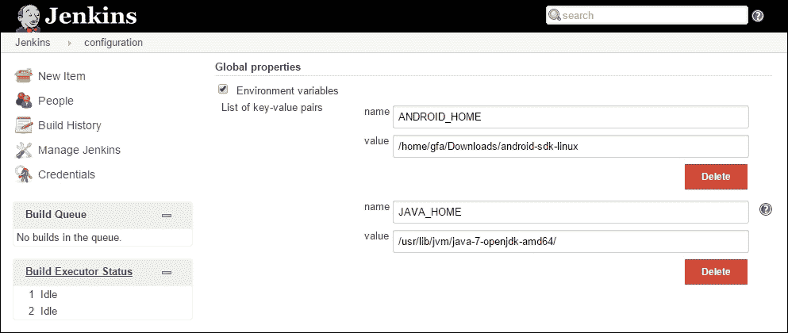
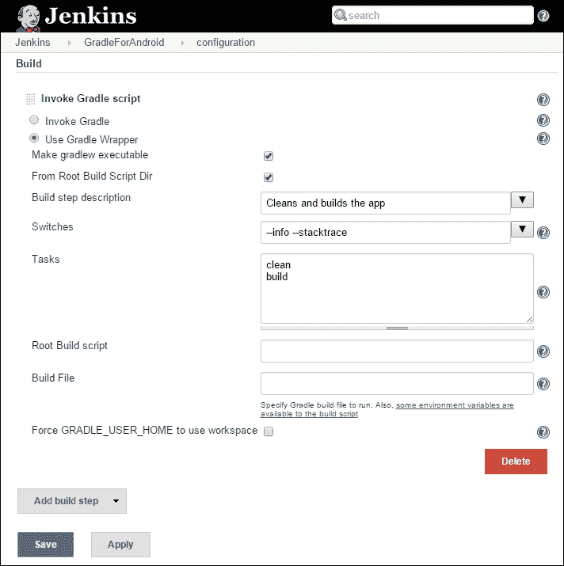
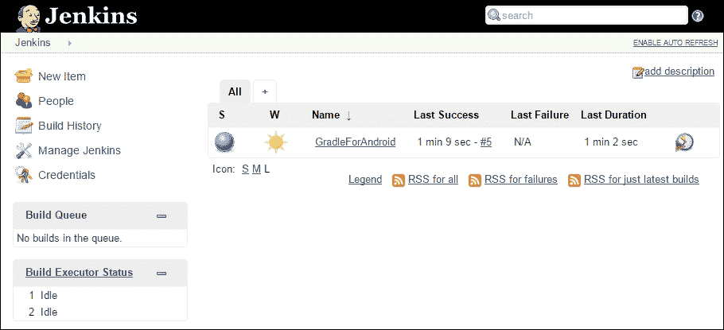
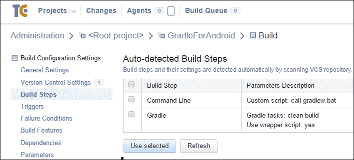
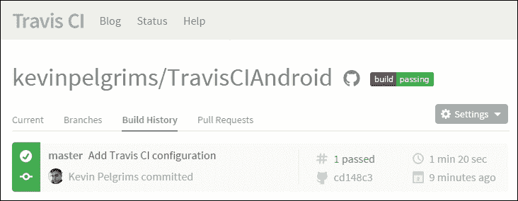
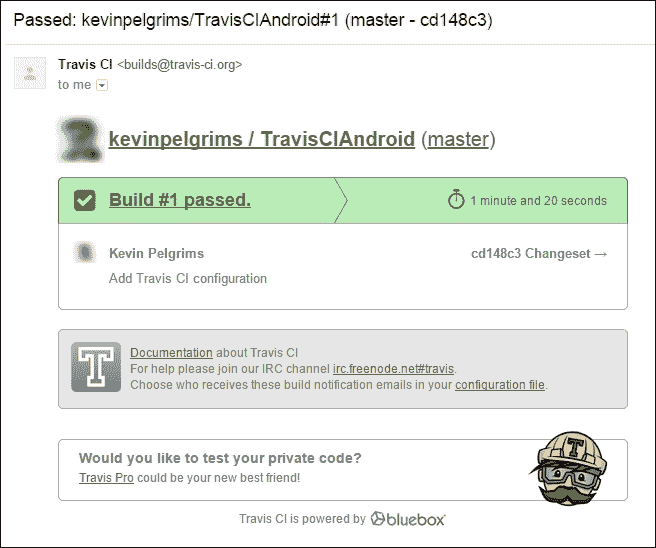

# 第八章. 设置持续集成

**持续集成** (**CI**) 是一种开发实践，要求团队中的开发人员定期集成他们的工作，通常每天多次。每次向主仓库的推送都会通过自动构建进行验证。这种做法有助于尽早发现问题，从而加快开发速度，并提高代码质量。伟大的马丁·福勒（Martin Fowler）就这一主题撰写了一篇文章，解释了概念并描述了最佳实践（[`martinfowler.com/articles/continuousIntegration.html`](http://martinfowler.com/articles/continuousIntegration.html)）

为 Android 设置 CI 有几种选择。最常用的有 **Jenkins**、**TeamCity** 和 **Travis CI**。Jenkins 拥有最大的生态系统，大约有一千个可用的插件。它也是一个拥有众多贡献者的开源项目。TeamCity 是 JetBrains 公司的产品，该公司还创建了 IntelliJ IDEA。Travis CI 是一个相对较新的参与者，主要关注开源项目。

我们将探讨这些 CI 系统，以及如何让 Gradle 在这些系统上工作。在本章结束时，我们将提到一些 Gradle 技巧，以使 CI 更容易，无论选择的 CI 系统是什么。

在本章中，我们将涵盖以下主题：

+   Jenkins

+   TeamCity

+   Travis CI

+   进一步自动化

# Jenkins

Jenkins 最初于 2005 年由 Sun Microsystems 以 Hudson 的名称发布。多年来，它已成为 Java 社区中最受欢迎的 CI 系统。在 Sun Microsystems 被甲骨文公司收购后不久，Oracle 与 Java 社区在 Hudson 问题上发生了冲突。当这个问题无法解决时，社区继续以 Jenkins 的名义在该项目上工作，因为 Hudson 这个名字归 Oracle 所有。

Jenkins 的强大之处在于其插件系统。任何需要构建系统新功能的人都可以创建一个新的插件，以扩展 Jenkins 的功能。这也是为什么为 Android 应用程序或库设置自动构建相当简单的原因。

## 设置 Jenkins

如果你还没有在你的构建机器上安装并运行 Jenkins，请从网站 ([`jenkins-ci.org`](https://jenkins-ci.org)) 下载它，并按照步骤操作。

在开始实际的 Jenkins 设置之前，你需要确保你有构建 Android 应用程序和库所需的全部库。要在 Java 中构建任何内容，你首先需要下载并安装 JDK，它可以从 Java 网站 ([`www.oracle.com/technetwork/java/javase/downloads/index.html`](http://www.oracle.com/technetwork/java/javase/downloads/index.html)) 下载。

你还需要确保你已经安装了 Android SDK 和构建工具。在你的构建服务器上安装 IDE 不是必需的，除非你计划在构建机器上打开项目。如果你只想安装 SDK 工具，你可以从 Android 开发者网站下载它们（[`developer.android.com/sdk/index.html#Other`](https://developer.android.com/sdk/index.html#Other)）。一旦你下载并安装了包，你需要在 SDK 目录中运行 `android` 可执行文件，这样你就可以安装所需的 API 和构建工具。

一旦安装了 Java 和 Android SDK，你需要在 Jenkins 中配置这些。首先打开你的网络浏览器，导航到构建服务器上的 Jenkins 主页。转到 **管理 Jenkins** | **配置系统** 并滚动到 **全局属性**。添加两个环境变量 `ANDROID_HOME` 和 `JAVA_HOME`，并将它们的值设置为正确的目录，如图所示：



你还需要安装 Gradle 插件。转到 **管理 Jenkins** | **管理插件**，导航到 **可用** 选项卡，并搜索 `Gradle`。当你找到 Gradle 插件时，只需勾选复选框，然后点击 **现在下载并在重启后安装**。此插件使得创建涉及 Gradle 的构建步骤成为可能。

## 配置构建

一旦安装了所有必需的组件，你就可以在 Jenkins 中创建一个 CI 项目。你应该做的第一件事是设置 VCS 仓库，这样 Jenkins 就知道从哪里获取你项目的源代码。你可以设置 Jenkins 根据仓库活动自动构建你的应用程序或库，使用构建触发器，或者你可以选择只进行手动构建。要执行实际的构建，你需要添加一个新的构建步骤来调用 Gradle 脚本。你可以配置 Jenkins 使用默认存在于 Android 项目中的 Gradle Wrapper。使用 Gradle Wrapper 不仅消除了在构建服务器上手动安装 Gradle 的需要，还确保了 Gradle 的任何更新都会自动处理。检查 **使 gradlew 可执行** 复选框也是一个好主意。这解决了在 Microsoft Windows 机器上创建项目时执行 Gradle Wrapper 的权限问题。

你可以为构建步骤输入一个不错的描述，并可选地添加两个开关 `info` 和 `stacktrace`。`info` 开关用于打印构建过程的更多信息，这在出现问题时可能很有用。如果构建引发异常，`stacktrace` 开关将打印出此异常的堆栈跟踪。有时你可能需要更详细的信息，在这种情况下，你可以使用 `full-stacktrace` 开关。

为了最终确定配置，请指定您想要执行的任务。首先，执行`clean`任务，以确保没有留下任何来自之前构建的输出。其次，执行`build`任务，这将触发所有变体的构建。Jenkins 配置应如下所示：



保存项目配置后，您可以运行构建。

### 注意

如果您的构建服务器安装在 64 位 Linux 机器上，您可能会遇到这个异常`java.io.IOException: Cannot run program "aapt": error=2, No such file or directory`。这是因为 AAPT 是一个 32 位应用程序，需要在 64 位机器上运行时需要一些额外的库。要安装必要的库，请使用以下命令：

```java
$ sudo apt-get install lib32stdc++6 lib32z1

```

如果构建没有问题完成，它将为所有构建变体创建 APK。您可以使用特定的 Gradle 任务来分发这些 APK。我们将在本章末尾提到自动分发，因为它并不特定于任何构建系统。



# TeamCity

与 Jenkins 不同，TeamCity 是一个专有产品，仅对开源项目免费使用。它由 JetBrains 创建和管理。这家公司还创建了 IntelliJ IDEA，这是 Android Studio 基于的 IDE。TeamCity 默认支持使用 Gradle 进行 Android 构建。

## 设置 TeamCity

如果您还没有安装 TeamCity，请从 JetBrains 网站下载它（[`www.jetbrains.com/teamcity`](https://www.jetbrains.com/teamcity)）并按照步骤操作。

要开始使用 TeamCity 构建 Android 应用程序和库，您需要确保 JDK、Android SDK 和 Android 构建工具已安装到您的构建服务器上。您可以在*Jenkins*部分找到这些说明。您还需要将`ANDROID_HOME`添加到机器的环境变量中，并指向 Android SDK 目录。

与 Jenkins 不同，TeamCity 不需要任何插件来触发 Gradle 构建，因为 TeamCity 内置了对运行 Gradle 的支持。

## 配置构建

要设置 Android 构建，您首先需要创建一个新的项目。您需要提供的只是名称。一旦项目创建完成，您就可以开始配置它。首先，您需要添加一个 VCS 根，以便 TeamCity 可以找到您项目的源代码。然后您需要创建一个新的构建配置。您还需要将 VCS 根附加到构建配置上。设置完成后，您可以添加一个新的构建步骤。如果您按下**自动检测构建步骤**按钮，TeamCity 将尝试根据项目的内容确定必要的构建步骤。对于基于 Gradle 的 Android 项目，结果看起来像这样：



TeamCity 会检测到项目使用 Gradle，甚至 Gradle Wrapper 也存在。你只需选择 Gradle 构建步骤，并将其添加到构建配置中。如果你不需要进行任何高级操作，这足以确保你的 Android 应用被构建。你可以通过打开项目概览并点击 Android 项目的 **运行…** 按钮来测试配置。

# Travis CI

如果你的项目仓库托管在 GitHub 上，你可以为你的自动化构建使用 Travis CI。Travis CI ([`travis-ci.org`](https://travis-ci.org)) 是一个开源的托管持续集成系统，对于公共仓库是免费的。对于私有仓库有一个付费计划，但在这本书中，我们只会查看免费选项。

Travis 会检测到当有新的提交推送到仓库时，并自动启动新的构建。默认情况下，Travis 会构建所有分支，而不仅仅是 master 分支。它还会自动构建拉取请求；这对于开源项目来说是一个有用的功能。

由于 Travis 内部的工作方式，你不能配置构建服务器本身。相反，你需要创建一个包含 Travis 构建应用或库所需的所有信息的配置文件。

## 配置构建

如果你想为你的项目启用 Travis 构建，首先你需要登录到 Travis CI 并将你的账户与 GitHub 连接。一旦完成，你需要在设置中启用你想要构建的项目。

为了配置构建过程，Travis 需要你创建一个名为 `.travis.yml` 的文件，该文件包含整个设置。为了配置 Android 项目，你需要定义语言并添加一些 Android 特定的属性：

```java
language: android
android:
  components:
    # The build tools version used by your project
    - build-tools-22.0.1

    # The SDK version used to compile your project
    - android-22

    # Additional components
    - extra-android-m2repository
```

语言设置指定了你想要运行哪种构建过程。在这种情况下，你正在构建一个 Android 应用。Android 特定的属性包括需要使用的构建工具版本和 Android SDK 版本。Travis 将在运行 `build` 任务之前下载这些工具。如果你使用了支持库或 Google Play 服务，你需要明确指定这一点，因为 Travis 需要下载这些依赖项的仓库。

### 注意

配置构建工具和 SDK 版本不是强制性的，但如果你确保版本与你在 `build.gradle` 文件中指定的版本一致，你会遇到更少的问题。

如果你在一个 Microsoft Windows 上创建 Android 项目，Gradle Wrapper 文件已知存在权限问题。因此，在运行实际的构建脚本之前修复权限是一个好主意。你可以添加一个预构建步骤，如下所示：

```java
before_script:
  # Change Gradle wrapper permissions
  - chmod +x gradlew
```

要开始实际的构建，将以下行添加到 Travis 配置文件中：

```java
# Let's build
script: ./gradlew clean build
```

这个命令将运行 Gradle Wrapper，就像你在开发机上做的那样，并执行 `clean` 和 `build` 任务。

当你完成 Travis 构建的配置后，你可以提交并将文件推送到项目的 GitHub 仓库。如果一切设置正确，Travis 将开始构建过程，你可以在 Travis 网站上跟踪。以下是项目成功构建时的样子：



Travis 也会在每次构建后发送电子邮件报告。如果你是定期收到拉取请求的开源库的维护者，这可能特别有用。当构建成功时，Travis 的报告电子邮件看起来是这样的：



你会很快注意到 Travis 有一个很大的缺点，那就是速度。Travis 不会给你一台特定的机器，而是为每个你触发的构建启动一个纯净的虚拟机。这意味着对于每个新的构建，Travis 都必须下载和安装 Android SDK 和构建工具，然后才能开始构建你的应用或库。

从积极的一面来看，Travis 是免费且公开的，这使得它非常适合开源项目。Travis 还会自动构建拉取请求，这可以在有人提交补丁到你的代码时给你带来安心。

# 进一步自动化

大多数现代持续集成系统默认支持 Gradle，或者通过插件支持。这意味着你不仅可以构建你的应用或库，还可以创建各种 Gradle 任务来进一步自动化构建。与在 CI 系统本身中定义额外的构建步骤相比，使用 Gradle 任务定义额外的构建步骤的优势在于，这些额外的构建步骤变得更加便携。在开发机器上运行自定义 Gradle 任务很容易。另一方面，没有安装 Jenkins，自定义 Jenkins 构建步骤是无法运行的。在某个 CI 系统中拥有额外的构建步骤也使得切换到不同的 CI 系统变得更加困难。Gradle 任务也可以轻松地移植到不同的项目中。在本节中，我们将探讨使用 Gradle 任务和插件进一步自动化构建和部署应用和库的几种方法。

## SDK 管理插件

你可能会遇到的一个问题是构建服务器上的 Android SDK 没有更新。当你更新你的应用或库的 SDK 版本时，你还需要在构建服务器上安装新的 SDK。如果你有多个构建代理，这会变得非常麻烦。

多亏了社区的努力，有一个 Gradle 插件负责检查构建是否依赖于一个不存在的 Android SDK 版本。如果 SDK 不存在，插件会自动下载它。

SDK 管理插件不仅会下载构建配置文件中指定的编译 SDK，还会下载正确的构建工具和平台工具版本。如果你的项目依赖于支持库或 Google Play 服务，插件还会下载这些指定的版本。

SDK 管理器插件是一个开源插件，你可以在 GitHub 上找到它的源代码（[`github.com/JakeWharton/sdk-manager-plugin`](https://github.com/JakeWharton/sdk-manager-plugin)）。

## 运行测试

如果你想在构建服务器上构建过程中运行单元测试（JUnit 或 Robolectric），你只需将相应的任务添加到 Gradle 执行中。如果你想运行任何功能测试，你需要一个模拟器来安装你的应用，然后你可以使用 `gradlew connectedAndroidTest` 运行测试。

运行模拟器的最简单方法是直接在构建服务器上启动一个模拟器，并始终保持其开启状态。不幸的是，这不是一个最佳解决方案，因为 Android 模拟器很容易发生随机崩溃，尤其是在你连续多天保持其开启状态时。

如果你正在使用 Jenkins，有一个名为 **Android Emulator Plugin** ([`wiki.jenkins-ci.org/display/JENKINS/Android+Emulator+Plugin`](https://wiki.jenkins-ci.org/display/JENKINS/Android+Emulator+Plugin)) 的插件，可以配置为为你的应用或库的每个构建启动一个模拟器。TeamCity 也有一个活跃的插件生态系统，其中有一个名为 **Android Emulator** 的插件，它以与 Jenkins 插件相同的方式帮助设置模拟器。你可以在官方 TeamCity 插件页面上找到它，以及其他 TeamCity 插件（[`confluence.jetbrains.com/display/TW/TeamCity+Plugins`](https://confluence.jetbrains.com/display/TW/TeamCity+Plugins)）。

Travis CI 有启动模拟器的功能，但这是一个实验性功能。如果你想尝试，请将以下片段添加到你的 `.travis.yml` 配置文件中，以便在 Travis 构建过程中启动 Android 模拟器：

```java
# Emulator Management: Create, Start and Wait
before_script:
  - echo no | android create avd --force -n test -t android-22 --abi armeabi-v7a
  - emulator -avd test -no-skin -no-audio -no-window &
  - android-wait-for-emulator
  - adb shell input keyevent 82 &
```

`android-wait-for-emulator` 指令告诉 Travis 等待模拟器启动。当模拟器启动后，执行 `adb shell input keyevent 82 &` 来解锁屏幕。之后，你只需告诉 Gradle 运行测试即可。

## 持续部署

为了帮助开发者自动部署 Android 应用，Google 发布了 Google Play 开发者 API，这是一个用于程序化地将 APK 推送到 Google Play 的 API ([`developers.google.com/android-publisher`](https://developers.google.com/android-publisher))。此 API 消除了你需要打开浏览器、登录 Google Play 并使用网页界面上传 APK 的需求。而不是基于 Google Play 开发者 API 创建自己的发布脚本，你可以在构建成功后直接从构建系统中使用许多插件之一将 APK 推送到 Google Play。

有一个名为**Google Play Android Publisher**的 Jenkins 插件([`wiki.jenkins-ci.org/display/JENKINS/Google+Play+Android+Publisher+Plugin`](https://wiki.jenkins-ci.org/display/JENKINS/Google+Play+Android+Publisher+Plugin))可以为您处理这些任务。然而，更好的选择是使用 Gradle 插件，这样您就可以从任何设备以及任何类型的持续集成系统中执行发布任务。Android 社区的一些人创建了一个围绕 Google Play 开发者 API 构建的 Gradle 插件，它使您能够配置整个发布过程。您可以在 GitHub 上找到 Gradle Play Publisher Gradle 插件的源代码([`github.com/Triple-T/gradle-play-publisher`](https://github.com/Triple-T/gradle-play-publisher))。它也通过 Maven Central 或 JCenter 提供。

要开始使用此插件，请将以下内容添加到您的`main build.gradle`文件中：

```java
buildscript {
    repositories {
        jcenter()
    }

    dependencies {
        classpath 'com.github.triplet.gradle:play-publisher:1.0.4'
    }
}
```

然后在您的 Android 模块的`build.gradle`文件中应用此插件：

```java
apply plugin: 'play'
```

当您将 Gradle Play Publisher 插件应用到构建中时，您将获得一些新的可用任务：

+   `publishApkRelease`上传 APK 和最近的变化

+   `publishListingRelease` 上传描述和图片

+   `publishRelease`上传所有内容

如果您有不同的构建变体，您还可以执行特定于变体的这些任务的版本，例如`publishApkFreeRelease`和`publishApkPaidRelease`。

要获取访问 Google Play 开发者 API 的权限，您需要设置一个服务帐户。此设置超出了本书的范围，但如果您想使用 Gradle Play Publisher 插件，则这是必需的。要开始，请遵循[`developers.google.com/android-publisher/getting_started`](https://developers.google.com/android-publisher/getting_started)中 Google Play 开发者 API 文档中的步骤。

一旦您创建了服务帐户，您可以在构建配置文件中输入凭证，如下所示：

```java
play {
    serviceAccountEmail = 'serviceaccount'
    pk12File = file('key.p12')
}
```

`play`块用于 Gradle Play Publisher 插件特有的属性。除了服务帐户凭证外，您还可以指定 APK 应推送到的轨道：

```java
play {
    track = 'production'
}
```

默认轨道是`alpha`，但您也可以将其更改为`beta`或`production`。

## 贝塔分布

对于 Android 应用的 beta 测试有很多选项，例如 Google Play 商店本身的 beta 轨道。另一个选项是**Crashlytics**([`crashlytics.com`](https://crashlytics.com))，它与 Gradle 有很好的集成。Crashlytics 团队创建了一个自定义插件，不仅创建新的 Gradle 任务以将构建发布到他们的平台，而且还挂钩到 Android 插件的任务以处理 ProGuard 映射。

要开始使用 Crashlytics，请遵循他们网站上的步骤。一旦设置完成，它将开始连接到你的构建。Crashlytics 插件暴露了一个名为 `crashlyticsUploadDistributionInternal` 的新任务，可以用来将 APK 上传到 Crashlytics。要推送你应用的新版本，你首先需要使用 `build` 或 `assemble` 任务来构建它。一旦 APK 准备就绪，你可以使用 `crashlyticsUploadDistributionInternal` 任务将其上传到 Crashlytics。Crashlytics 插件为项目中的每个构建变体创建一个上传任务。

多亏了自定义 Gradle 插件，开发者开始使用 Crashlytics 非常容易。它还使得将测试构建上传到 Crashlytics 变得非常简单，因为你在构建过程中只需要执行一个额外的任务。这是一个很好的例子，说明了正确使用 Gradle 的强大之处，以及一个好的 Gradle 插件如何让开发者的生活变得更加轻松。

# 摘要

在本章中，我们介绍了几种流行的持续集成系统，并解释了如何使用它们来自动化构建 Android 应用和库。你学习了如何配置 CI 系统，使用 Gradle 构建 Android 项目。然后我们探讨了几个 Gradle 插件，以帮助我们进一步自动化构建和部署过程，并解释了如何在构建服务器上自动运行测试。

在下一章中，我们将探讨 Gradle 的一些更高级的功能以及基于 Gradle 的构建优化。我们还将了解如何通过直接使用 Gradle 中的 Ant 任务，并逐步将它们移植到 Gradle 中，来迁移一个大的 Ant 构建配置。
