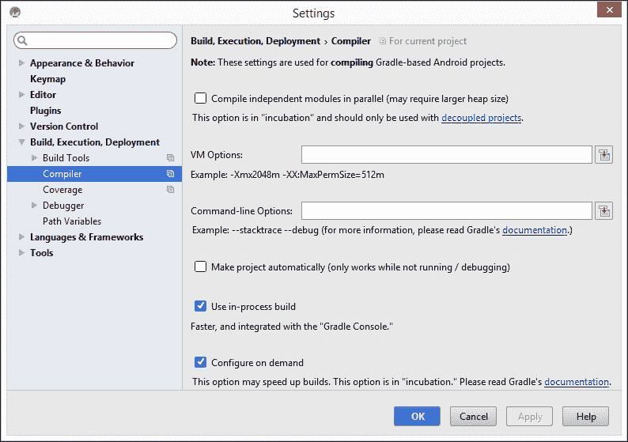
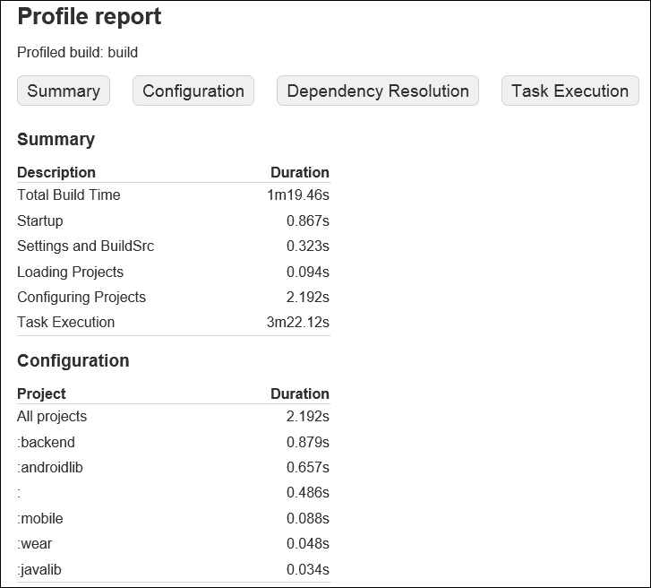

# 第九章. 高级构建定制

现在你已经了解了 Gradle 的工作原理，如何创建自己的任务和插件，如何运行测试，以及如何设置持续集成，你几乎可以称自己为 Gradle 专家。本章包含了一些我们之前章节中没有提到的技巧和窍门，这些技巧和窍门使得使用 Gradle 构建、开发和部署 Android 项目变得更加容易。

在本章中，我们将涵盖以下主题：

+   减小 APK 文件大小

+   加速构建

+   忽略 Lint

+   从 Gradle 使用 Ant

+   高级应用部署

我们将首先探讨如何减小构建输出的尺寸以及为什么这很有用。

# 减小 APK 文件大小

在过去几年中，APK 文件的大小急剧增加。这有几个原因——更多的库对 Android 开发者可用，增加了更多的密度，并且应用在功能上总体上变得更加丰富。

尽量保持 APK 尽可能小是一个好主意。这不仅因为 Google Play 上的 APK 文件有 50 MB 的限制，而且较小的 APK 也意味着用户可以更快地下载和安装应用，并且可以降低内存占用。

在本节中，我们将查看 Gradle 构建配置文件中的一些属性，我们可以通过操作这些属性来减小 APK 文件。

## ProGuard

**ProGuard** 是一个 Java 工具，它不仅可以在编译时缩小、优化、混淆和预验证你的代码，还可以在编译时进行这些操作。它遍历你的应用中的所有代码路径，以找到未使用的代码并将其删除。ProGuard 还会重命名你的类和字段。这个过程可以降低应用的占用空间，并使代码更难以逆向工程。

Android 插件 Gradle 有一个布尔属性，称为 `minifyEnabled`，在构建类型上需要将其设置为 true 以启用 ProGuard：

```java
android {
    buildTypes {
        release {
            minifyEnabled true
            proguardFiles getDefaultProguardFile('proguard-android.txt'), 'proguard-rules.pro'
        }
    }
}
```

当你将 `minifyEnabled` 设置为 `true` 时，`proguardRelease` 任务将被执行，并在构建过程中调用 ProGuard。

在启用 ProGuard 后重新测试你的整个应用是一个好主意，因为它可能会删除你仍然需要的某些代码。这是一个让许多开发者对 ProGuard 产生警惕的问题。为了解决这个问题，你可以定义 ProGuard 规则以排除某些类被删除或混淆。`proguardFiles` 属性用于定义包含 ProGuard 规则的文件。例如，为了保留一个类，你可以添加一个简单的规则，如下所示：

```java
-keep public class <MyClass>
```

`getDefaultProguardFile('proguard-android.txt')` 方法从名为 `proguard-android.txt` 的文件中获取默认的 ProGuard 设置，该文件位于 Android SDK 的 `tools/proguard` 文件夹中。`proguard-rules.pro` 文件默认情况下会被 Android Studio 添加到新的 Android 模块中，因此你可以在该文件中简单地添加针对模块的特定规则。

### 注意

ProGuard 规则对您构建的每个应用或库都不同，因此在这本书中我们不会过多地详细介绍。如果您想了解更多关于 ProGuard 和 ProGuard 规则的信息，请查看官方 Android ProGuard 文档[`developer.android.com/tools/help/proguard.html`](http://developer.android.com/tools/help/proguard.html)。

除了压缩 Java 代码外，压缩使用的资源也是一个好主意。

## 资源压缩

Gradle 和 Gradle 的 Android 插件可以在构建时移除所有未使用的资源，当应用正在打包时。如果您忘记移除旧资源，这可能会很有用。另一个用例是当您导入一个包含大量资源的库，但您只使用其中的一小部分时。您可以通过启用资源压缩来修复这个问题。有自动或手动两种方法来压缩资源。

### 自动压缩

最简单的方法是配置构建中的`shrinkResources`属性。如果您将此属性设置为`true`，Android 构建工具将自动尝试确定哪些资源未使用，并且不会将它们包含在 APK 中。

虽然您必须启用 ProGuard，但使用此功能有一个要求。这是由于资源压缩的工作方式，因为 Android 构建工具无法确定哪些资源未使用，直到引用这些资源的代码被移除。

下面的代码片段显示了如何在特定构建类型上配置自动资源压缩：

```java
android {
    buildTypes {
    release {
            minifyEnabled = true
            shrinkResources = true
        }
    }
}
```

如果您想查看启用自动资源压缩后 APK 变得多小，您可以运行`shrinkReleaseResources`任务。此任务会打印出它减少了多少包的大小：

```java
:app:shrinkReleaseResources
Removed unused resources: Binary resource data reduced from 433KB to 354KB: Removed 18%
```

您可以通过在构建命令中添加`--info`标志来获取从 APK 中移除的资源详细概述：

```java
$ gradlew clean assembleRelease --info

```

当您使用此标志时，Gradle 会打印出大量有关构建过程的额外信息，包括它未包含在最终构建输出中的每个资源。

自动资源压缩的一个问题是可能会移除过多的资源。特别是动态使用的资源可能会意外被移除。为了防止这种情况，您可以在`res/raw/`目录下放置一个名为`keep.xml`的文件中定义异常。一个简单的`keep.xml`文件看起来像这样：

```java
<?xml version="1.0" encoding="utf-8"?>
<resources 
    tools:keep="@layout/keep_me,@layout/also_used_*"/>
```

`keep.xml`文件本身也将从最终结果中移除。

### 手动压缩

一种不那么激进的移除资源的方法是移除某些语言文件或特定密度的图像。一些库，如 Google Play Services，包含很多语言。如果您的应用只支持一到两种语言，那么在最终的 APK 中包含这些库的所有语言文件就没有意义了。您可以使用`resConfigs`属性来配置您想要保留的资源，其余的将被丢弃。

如果你只想保留英语、丹麦语和荷兰语字符串，你可以这样使用 `resConfigs`：

```java
android {
    defaultConfig {
        resConfigs "en", "da", "nl"
    }
}
```

你也可以为密度桶做同样的事情，如下所示：

```java
android {
    defaultConfig {
        resConfigs "hdpi", "xhdpi", "xxhdpi", "xxxhdpi"
    }
}
```

甚至可以将语言和密度结合起来。事实上，可以使用这个属性限制每种类型的资源。

如果你设置 ProGuard 遇到困难，或者你只是想移除你的应用不支持的语言或密度的资源，那么使用 `resConfigs` 是开始资源缩减的好方法。

# 加快构建速度

许多开始使用 Gradle 的 Android 开发者抱怨编译时间过长。构建可能比使用 Ant 更长，因为 Gradle 在每次执行任务时都会经历构建生命周期的三个阶段。这使得整个过程非常可配置，但也相当慢。幸运的是，有几种方法可以加快 Gradle 构建速度。

## Gradle 属性

调整 Gradle 构建速度的一种方法是通过更改一些默认设置。我们已经在第五章中提到了并行构建执行，*管理多模块构建*，但还有一些其他设置你可以调整。

只为了回顾一下，你可以通过在项目根目录中的 `gradle.properties` 文件中设置一个属性来启用并行构建。你只需要添加以下这一行：

```java
org.gradle.parallel=true
```

另一个容易实现的改进是启用 Gradle 守护进程，当你第一次运行构建时，它会启动一个后台进程。随后的构建将重用那个后台进程，从而减少了启动成本。只要你在使用 Gradle，进程就会保持活跃，并在空闲三小时后终止。在短时间内多次使用 Gradle 时，使用守护进程特别有用。你可以在 `gradle.properties` 文件中这样启用守护进程：

```java
org.gradle.daemon=true
```

在 Android Studio 中，Gradle 守护进程默认是启用的。这意味着在 IDE 内部进行第一次构建之后，接下来的构建会稍微快一些。然而，如果你从命令行界面进行构建；那么 Gradle 守护进程是禁用的，除非你在属性中启用它。

为了加快编译本身的速度，你可以调整 Java 虚拟机（JVM）的参数。有一个名为 `jvmargs` 的 Gradle 属性，它允许你为 JVM 的内存分配池设置不同的值。有两个参数直接影响你的构建速度，即 `Xms` 和 `Xmx`。`Xms` 参数用于设置要使用的初始内存量，而 `Xmx` 参数用于设置最大值。你可以在 `gradle.properties` 文件中手动设置这些值，如下所示：

```java
org.gradle.jvmargs=-Xms256m -Xmx1024m
```

你需要设置一个数量和一个单位，这个单位可以是 k（千字节）、m（兆字节）或 g（千兆字节）。默认情况下，最大内存分配（`Xmx`）设置为 256 MB，而起始内存分配（`Xms`）则没有设置。最佳设置取决于你电脑的能力。

最后一个可以配置以影响构建速度的属性是 `org.gradle.configureondemand`。如果您有包含多个模块的复杂项目，这个属性尤其有用，因为它试图通过跳过对执行任务不是必需的模块来限制配置阶段的时间。如果您将此属性设置为 `true`，Gradle 将在运行配置阶段之前尝试确定哪些模块有配置更改，哪些没有。如果您项目中只有一个 Android 应用和一个库，这个功能可能不太有用。如果您有很多松散耦合的模块，这个功能可以为您节省大量的构建时间。

### 小贴士

**系统级 Gradle 属性**

如果您想将这些属性系统性地应用到所有基于 Gradle 的项目中，您可以在家目录中的 `.gradle` 文件夹中创建一个 `gradle.properties` 文件。在 Microsoft Windows 上，此目录的完整路径是 `%UserProfile%\.gradle`，在 Linux 和 Mac OS X 上是 `~/.gradle`。在您的家目录中设置这些属性是一个好习惯，而不是在项目级别上。这样做的原因是您通常希望降低构建服务器上的内存消耗，而构建时间则不那么重要。

## Android Studio

可以更改以加快编译过程的 Gradle 属性也可以在 Android Studio 设置中配置。要查找编译器设置，请打开 **设置** 对话框，然后导航到 **构建、执行、部署** | **编译器**。在该屏幕上，您可以找到并行构建、JVM 选项、按需配置等设置。这些设置仅适用于基于 Gradle 的 Android 模块。请查看以下截图：



在 Android Studio 中配置这些设置比在构建配置文件中手动配置要容易，设置对话框使得查找影响构建过程的属性变得简单。

## 分析

如果您想找出哪些构建部分减慢了进程，您可以分析整个构建过程。您可以通过在执行 Gradle 任务时添加 `--profile` 标志来实现这一点。当您提供此标志时，Gradle 会创建一个分析报告，该报告可以告诉您构建过程中哪些部分耗时最长。一旦您知道了瓶颈在哪里，您就可以进行必要的更改。报告以 HTML 文件的形式保存在您的模块中的 `build/reports/profile` 目录下。

这是执行多模块项目构建任务后生成的报告：



性能报告显示了在执行任务时每个阶段花费的时间概述。在以下摘要下方是 Gradle 为每个模块配置阶段花费时间的概述。报告中有两个更多部分在截图中没有显示。**依赖解析**部分显示了解析依赖项所需的时间，按模块划分。最后，**任务执行**部分包含了一个非常详细的任务执行概述。这个概述按执行时间从高到低排列了每个任务的计时。

## Jack 和 Jill

如果你愿意使用实验性工具，你可以启用 Jack 和 Jill 来加速构建过程。**Jack**（**Java Android Compiler Kit**）是一个新的 Android 构建工具链，它可以将 Java 源代码直接编译成 Android Dalvik 可执行文件（dex）格式。它有自己的`.jack`库格式，并负责打包和压缩。**Jill**（**Jack Intermediate Library Linker**）是一个可以将`.aar`和`.jar`文件转换为`.jack`库的工具。这些工具仍然相当实验性，但它们被制作出来是为了提高构建时间和简化 Android 构建过程。不建议在生产版本的项目中开始使用 Jack 和 Jill，但它们被提供出来，以便你可以尝试它们。

要使用 Jack 和 Jill，你需要使用版本 21.1.1 或更高版本的构建工具，以及 Gradle 的 Android 插件版本 1.0.0 或更高。启用 Jack 和 Jill 就像在`defaultConfig`块中设置一个属性一样简单：

```java
android {
    buildToolsRevision '22.0.1'
    defaultConfig {
      useJack = true
    }
}
```

你还可以在特定的构建类型或产品风味上启用 Jack 和 Jill。这样，你就可以继续使用常规构建工具链，并在旁边进行实验性构建：

```java
android {
    productFlavors {
        regular {
            useJack = false
        }

        experimental {
            useJack = true
        }
    }
}
```

一旦将`useJack`设置为`true`，最小化和混淆将不再通过 ProGuard 进行，但你仍然可以使用 ProGuard 规则语法来指定某些规则和异常。使用我们之前在讨论 ProGuard 时提到的相同的`proguardFiles`方法。

# 忽略 Lint

当你使用 Gradle 执行发布构建时，会对你的代码执行 Lint 检查。Lint 是一个静态代码分析工具，它会标记出布局和 Java 代码中的潜在错误。在某些情况下，它甚至可能阻止构建过程。如果你之前没有在项目中使用过 Lint，并且想要迁移到 Gradle，Lint 可能会出现很多错误。为了至少让构建工作，你可以配置 Gradle 忽略 Lint 错误，并通过禁用`abortOnError`来防止它们终止构建。这应该只是一种临时解决方案，因为忽略 Lint 错误可能会导致诸如缺失翻译等问题，这些问题可能导致应用崩溃。为了防止 Lint 阻止构建过程，可以像这样禁用`abortOnError`：

```java
android {
    lintOptions {
        abortOnError false
    }
}
```

临时禁用 Lint 终止可以更容易地将现有的 Ant 构建过程迁移到 Gradle。使过渡更平滑的另一种方法是直接从 Gradle 执行 Ant 任务。

# 使用 Gradle 的 Ant

如果您在设置 Ant 构建上投入了大量时间，那么切换到 Gradle 可能听起来有些可怕。在这种情况下，Gradle 不仅能够执行 Ant 任务，还可以扩展它们。这意味着您可以从 Ant 迁移到 Gradle，而不是花费几天时间转换整个构建配置。

Gradle 使用 Groovy 的 **AntBuilder** 来实现 Ant 集成。AntBuilder 允许您执行任何标准 Ant 任务、您自己的自定义 Ant 任务以及整个 Ant 构建。它还使得在 Gradle 构建配置中定义 Ant 属性成为可能。

## 从 Gradle 运行 Ant 任务

从 Gradle 运行标准 Ant 任务很简单。您只需在任务名称前加上 `ant.` 前缀，一切就会自动工作。例如，要创建一个存档，您可以使用此任务：

```java
task archive << {
    ant.echo 'Ant is archiving...'
    ant.zip(destfile: 'archive.zip') {
        fileset(dir: 'zipme')
    }
}
```

该任务在 Gradle 中定义，但使用了两个 Ant 任务，`echo` 和 `zip`。

当然，您应该始终考虑 Gradle 的标准 Ant 任务的替代方案。例如，要创建一个与上一个示例中类似的存档，您可以定义一个 Gradle 任务来处理此操作：

```java
task gradleArchive(type:Zip) << {
    from 'zipme/'
    archiveName 'grarchive.zip'
}
```

基于 Gradle 的存档任务更加简洁且易于理解。因为它不需要通过 AntBuilder，所以它也比使用 Ant 任务稍微快一些。

## 导入整个 Ant 脚本

如果您已经创建了一个用于构建您的应用的 Ant 脚本，您可以使用 `ant.importBuild` 导入整个构建配置。然后，所有 Ant 目标都会自动转换为 Gradle 任务，您可以通过它们原始的名称访问这些任务。

例如，考虑以下 Ant 构建文件：

```java
<project>
    <target name="hello">
        <echo>Hello, Ant</echo>
    </target>
</project>
```

您可以将此构建文件导入到您的 Gradle 构建中，方法如下：

```java
ant.importBuild 'build.xml'
```

这将使 hello 任务暴露给您的 Gradle 构建，因此您可以像执行常规 Gradle 任务一样执行它，并将打印出 `Hello, Ant`：

```java
$ gradlew hello
:hello
[ant:echo] Hello, Ant

```

因为 Ant 任务被转换为 Gradle 任务，所以您也可以使用 `doFirst` 和 `doLast` 块或 `<<` 快捷方式来扩展它。例如，您可以向控制台打印另一行文本：

```java
hello << {
    println 'Hello, Ant. It\'s me, Gradle'
}
```

如果现在执行 `hello` 任务，它看起来像这样：

```java
$ gradlew hello
:hello
[ant:echo] Hello, Ant
Hello, Ant. It's me, Gradle

```

您也可以像通常一样依赖于从 Ant 导入的任务。例如，如果您想创建一个依赖于 hello 任务的新的任务，您可以简单地这样做：

```java
task hi(dependsOn: hello) << {
    println 'Hi!'
}
```

使用 `dependsOn` 确保在执行 `hi` 任务时触发 `hello` 任务：

```java
$ gradlew intro
:hello
[ant:echo] Hello, Ant
Hello, Ant. It's me, Gradle
:hi
Hi!

```

如果需要，您甚至可以使 Ant 任务依赖于 Gradle 任务。为了实现这一点，您需要在 `build.xml` 文件中将 `depends` 属性添加到任务中，如下所示：

```java
<target name="hi" depends="intro">
    <echo>Hi</echo>
</target>
```

如果您有一个大的 Ant 构建文件，并且想确保没有任务名称重叠，您可以在导入时使用此代码片段重命名所有 Ant 任务：

```java
ant.importBuild('build.xml') { antTargetName ->
    'ant-' + antTargetName
}
```

如果您决定重命名所有 Ant 任务，请记住，如果您有一个依赖于 Gradle 任务的 Ant 任务，那么该 Gradle 任务也需要加上前缀。否则，Gradle 将无法找到它并抛出 `UnknownTaskException`。

## 属性

Gradle 和 Ant 不仅可以共享任务，你还可以在 Gradle 中定义可以在你的 Ant 构建文件中使用的属性。考虑以下 Ant 目标，它打印出一个名为`version`的属性：

```java
<target name="appVersion">
    <echo>${version}</echo>
</target>
```

你可以在 Gradle 构建配置中定义版本属性，就像在任务中一样，在属性名前加上`ant.`。这是定义 Ant 属性的最短方式：

```java
ant.version = '1.0'
```

Groovy 在这里隐藏了很多实现细节。如果你完整地编写属性定义，它看起来像这样：

```java
ant.properties['version'] = '1.0'
```

执行`version`任务将做你预期的事情，即打印出`1.0`到控制台：

```java
$ gradlew appVersion
:appVersion
[ant:echo] 1.0

```

在 Gradle 中深度集成 Ant 使得从基于 Ant 的构建过渡到 Gradle 变得容易得多，你可以按照自己舒适的节奏进行。

# 高级应用部署

在第四章“创建构建变体”中，我们探讨了使用构建类型和产品风味创建同一应用多个版本的好几种方法。然而，在某些情况下，使用更具体的技巧，如 APK 分割可能更容易。

## 分割 APK

构建变体可以被视为独立的实体，每个都可以有自己的代码、资源和清单文件。另一方面，APK 分割仅影响应用的打包。编译、缩减、混淆等操作仍然是共享的。这种机制允许你根据密度或**应用二进制接口**（**ABI**）来分割 APK。

你可以通过在`android`配置块内定义一个`splits`块来配置分割。要配置密度分割，在`splits`块内创建一个`density`块。如果你要设置 ABI 分割，使用一个`abi`块。

如果你启用了密度分割，Gradle 将为每个密度创建一个单独的 APK。如果你不需要某些密度，可以手动排除它们，以加快构建过程。以下示例展示了如何启用密度分割并排除低密度设备：

```java
android {
    splits {
        density {
            enable true
            exclude 'ldpi', 'mdpi'
            compatibleScreens 'normal', 'large', 'xlarge'
        }
    }
}
```

如果你只支持少数几种密度，你可以使用`include`来创建一个密度的白名单。要使用`include`，你首先需要使用`reset()`属性，该属性将包含的密度列表重置为空字符串。

前一个代码片段中的`compatibleScreens`属性是可选的，并在清单文件中注入一个匹配的节点。示例中的配置适用于支持从正常到超大屏幕的应用，排除了小屏幕设备。

根据 ABI 分割 APK 的方式与此相同，所有属性都与密度分割的属性相同，除了`compatibleScreens`。ABI 分割与屏幕大小无关，因此没有名为`compatibleScreens`的属性。

配置密度分割后执行构建的结果是 Gradle 现在创建了一个通用 APK 和几个特定密度的 APK。这意味着你最终会得到一个像这样的 APK 集合：

```java
app-hdpi-release.apk
app-universal-release.apk
app-xhdpi-release.apk
app-xxhdpi-release.apk
app-xxxhdpi-release.apk
```

尽管使用 APK 分割有一些注意事项。如果您想将多个 APK 推送到 Google Play，您需要确保每个 APK 都有不同的版本码。这意味着每个分割都应该有一个唯一的版本码。幸运的是，到目前为止，您已经能够在 Gradle 中通过查看 `applicationVariants` 属性来完成这项操作。

以下代码片段直接来自 Gradle Android 插件的文档，展示了如何为每个 APK 生成不同的版本码：

```java
ext.versionCodes = ['armeabi-v7a':1, mips:2, x86:3]

import com.android.build.OutputFile

android.applicationVariants.all { variant ->
    // assign different version code for each output
    variant.outputs.each { output ->
        output.versionCodeOverride =  project.ext.versionCodes.get(output.getFilter(OutputFile.ABI)) * 1000000 + android.defaultConfig.versionCode
    }
}
```

这个小代码片段检查构建变体中使用了哪种 ABI，然后对版本码应用一个乘数，以确保每个变体都有一个唯一的版本码。

# 摘要

在阅读本章之后，您将了解如何减小构建输出的体积，以及如何通过配置 Gradle 和 JVM 来加速构建。大型迁移项目再也不应该让您感到害怕了。您还学到了一些使开发和部署更简单的技巧。

有了这些，您已经到达了本书的结尾！现在您已经了解了 Gradle 的可能性，您可以调整和自定义 Android 项目的构建过程，直到您不需要进行任何手动工作，除了执行任务。您可以配置构建变体，管理依赖项，并配置多模块项目。Gradle DSL 对您来说是有意义的，因为您理解 Groovy 语法，并且您对钩入 Android 插件感到舒适。您甚至可以创建任务或插件并共享它们，以帮助他人自动化他们的构建。现在您需要做的就是应用您的新技能！
