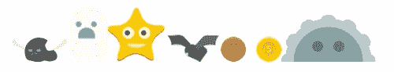
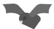
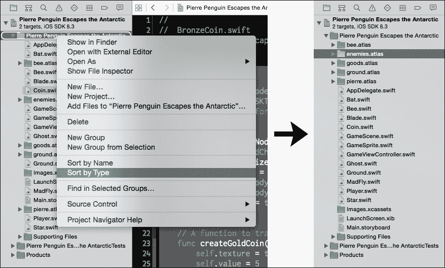
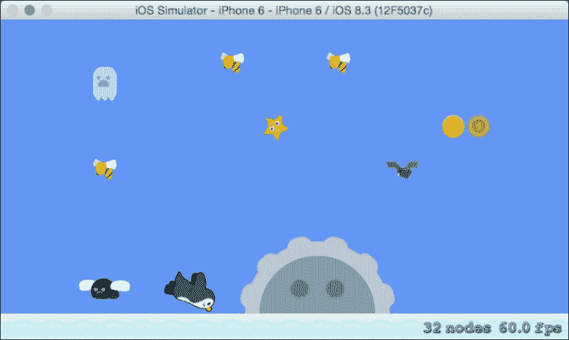
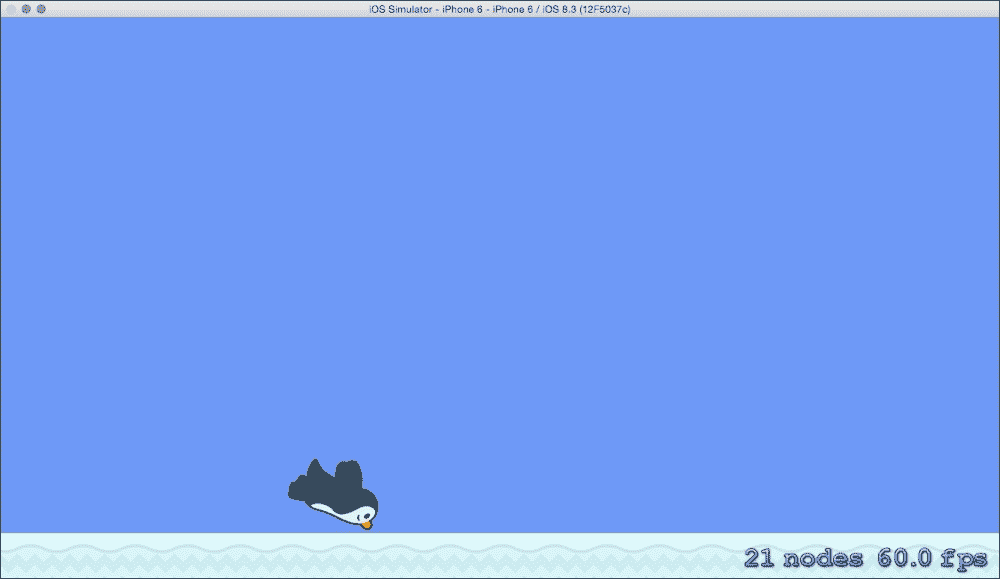

# 第五章：生成敌人、硬币和增强

游戏开发中最有趣和最具创造性的方面之一是为玩家构建可探索的游戏世界。我们的年轻项目在添加控制后开始像可玩游戏一样，下一步是构建更多内容。我们将为新的敌人、可收集的硬币和给予皮埃尔企鹅额外能量的特殊增强创建额外的类。然后我们可以开发一个系统，随着玩家的进步，逐渐生成越来越困难的这些游戏对象的模式。

本章包括以下主题：

+   添加增强星

+   新敌人——疯狂飞虫

+   另一个恐怖——蝙蝠！

+   可怕的幽灵

+   用刀守护地面

+   添加硬币

+   测试新游戏对象

# 介绍角色阵容

穿上你的安全帽，我们将在本章中编写大量的代码。坚持下去！结果绝对值得努力。来看看本章我们将介绍的新角色阵容：



## 添加增强星

许多我最喜欢的游戏在玩家捡起星星时都会赋予玩家临时无敌能力。我们将为我们的游戏添加一个高度活跃的增强星。来看看我们的星星：


### 定位艺术资源

您可以在资产包的`Coins`和`Powerups`文件夹中的`goods.atlas`纹理图集中找到增强星和硬币的艺术资源。现在将`goods.atlas`纹理图集添加到您的项目中。

### 添加 Star 类

一旦艺术资源到位，您可以在项目中创建一个名为`Star.swift`的新 Swift 文件；我们将继续将类组织到不同的文件中。`Star`类将与之前创建的`Bee`类相似；它将继承自`SKSpriteNode`并遵循我们的`GameSprite`协议。星星将为玩家带来很多力量，因此我们还将给它一个基于`SKAction`的特殊疯狂动画，使其脱颖而出。

要创建`Star`类，请在您的`Star.swift`文件中添加以下代码：

```swift
import SpriteKit

class Star: SKSpriteNode, GameSprite {
    var textureAtlas:SKTextureAtlas = 
        SKTextureAtlas(named:"goods.atlas")
    var pulseAnimation = SKAction()

    func spawn(parentNode:SKNode, position: CGPoint,
        size: CGSize = CGSize(width: 40, height: 38)) {
        parentNode.addChild(self)
        createAnimations()
        self.size = size
        self.position = position
        self.physicsBody = SKPhysicsBody(circleOfRadius: 
            size.width / 2)
        self.physicsBody?.affectedByGravity = false
        // Since the star texture is only one frame, set it here:
        self.texture = 
            textureAtlas.textureNamed("power-up-star.png")
        self.runAction(pulseAnimation)
    }

    func createAnimations() {
        // Scale the star smaller and fade it slightly:
        let pulseOutGroup = SKAction.group([
            SKAction.fadeAlphaTo(0.85, duration: 0.8),
            SKAction.scaleTo(0.6, duration: 0.8),
            SKAction.rotateByAngle(-0.3, duration: 0.8)
            ]);
        // Push the star big again, and fade it back in:
        let pulseInGroup = SKAction.group([
            SKAction.fadeAlphaTo(1, duration: 1.5),
            SKAction.scaleTo(1, duration: 1.5),
            SKAction.rotateByAngle(3.5, duration: 1.5)
            ]);
        // Combine the two into a sequence:
        let pulseSequence = SKAction.sequence([pulseOutGroup, 
            pulseInGroup])
        pulseAnimation = 
            SKAction.repeatActionForever(pulseSequence)
    }

    func onTap() {}
}
```

太好了！您应该已经熟悉了大部分代码，因为它与我们之前创建的一些类非常相似。让我们继续添加另一个新角色：一只烦躁的飞虫。

## 添加一个新敌人——疯狂飞虫

皮埃尔企鹅要实现他的目标，不仅需要躲避蜜蜂。在本章中，我们将添加一些新的敌人，首先是`MadFly`类。疯狂飞虫相当烦躁，正如你所见：


### 定位敌人资源

您可以在资产包的`Enemies`文件夹中的`enemies.atlas`纹理图集中找到我们新敌人的所有艺术资源。现在将这个纹理图集添加到您的项目中。

### 添加 MadFly 类

`MadFly`是一个简单的类；它看起来很像`Bee`代码。创建一个名为`MadFly.swift`的新 Swift 文件，并输入以下代码：

```swift
import SpriteKit

class MadFly: SKSpriteNode, GameSprite {
    var textureAtlas:SKTextureAtlas = 
        SKTextureAtlas(named:"enemies.atlas")
    var flyAnimation = SKAction()

    func spawn(parentNode:SKNode, position: CGPoint,
        size: CGSize = CGSize(width: 61, height: 29)) {
        parentNode.addChild(self)
        createAnimations()
        self.size = size
        self.position = position
        self.runAction(flyAnimation)
        self.physicsBody = SKPhysicsBody(circleOfRadius: 
            size.width / 2)
        self.physicsBody?.affectedByGravity = false
    }

    func createAnimations() {
        let flyFrames:[SKTexture] = [
            textureAtlas.textureNamed("mad-fly-1.png"),
            textureAtlas.textureNamed("mad-fly-2.png")
        ]
        let flyAction = SKAction.animateWithTextures(flyFrames, 
            timePerFrame: 0.14)
        flyAnimation = SKAction.repeatActionForever(flyAction)
    }

    func onTap() {}
}
```

恭喜，你已经成功实现了疯狂飞行的敌人。没有时间庆祝——继续前进，迎接蝙蝠！

## 另一个恐怖——蝙蝠！

我们在创建新类方面已经进入了一种相当有节奏的状态。现在，我们将添加一只蝙蝠来与蜜蜂一起群飞。蝙蝠体型小，但有一对非常锋利的獠牙：



### 添加`Bat`类

要添加`Bat`类，创建一个名为`Bat.swift`的文件，并添加以下代码：

```swift
import SpriteKit

class Bat: SKSpriteNode, GameSprite {
    var textureAtlas:SKTextureAtlas = 
        SKTextureAtlas(named:"enemies.atlas")
    var flyAnimation = SKAction()

    func spawn(parentNode:SKNode, position: CGPoint,
        size: CGSize = CGSize(width: 44, height: 24)) {
        parentNode.addChild(self)
        createAnimations()
        self.size = size
        self.position = position
        self.runAction(flyAnimation)
        self.physicsBody = SKPhysicsBody(circleOfRadius: 
            size.width / 2)
        self.physicsBody?.affectedByGravity = false
    }

    func createAnimations() {
        // The Bat has 4 animation textures:
        let flyFrames:[SKTexture] = [
            textureAtlas.textureNamed("bat-fly-1.png"),
            textureAtlas.textureNamed("bat-fly-2.png"),
            textureAtlas.textureNamed("bat-fly-3.png"),
            textureAtlas.textureNamed("bat-fly-4.png"),
            textureAtlas.textureNamed("bat-fly-3.png"),
            textureAtlas.textureNamed("bat-fly-2.png")
        ]
        let flyAction = SKAction.animateWithTextures(flyFrames, 
            timePerFrame: 0.06)
        flyAnimation = SKAction.repeatActionForever(flyAction)
    }

    func onTap() {}
}
```

现在你已经创建了`Bat`类，还有两个敌人需要添加。我们将在下一个步骤中添加`Ghost`类。

## 可怕的幽灵

我们将用另一个可怕的敌人来补充蝙蝠：如这里所示的幽灵：


我们不会通过多个帧进行动画，而是使用动作来动画幽灵的单帧。

### 添加`Ghost`类

与其他类一样，在你的项目中创建一个名为`Ghost.swift`的新文件，然后添加以下代码：

```swift
import SpriteKit

class Ghost: SKSpriteNode, GameSprite {
    var textureAtlas:SKTextureAtlas = 
        SKTextureAtlas(named:"enemies.atlas")
    var fadeAnimation = SKAction()

    func spawn(parentNode:SKNode, position: CGPoint,
        size: CGSize = CGSize(width: 30, height: 44)) {
        parentNode.addChild(self)
        createAnimations()
        self.size = size
        self.position = position
        self.physicsBody = SKPhysicsBody(circleOfRadius: 
            size.width / 2)
        self.physicsBody?.affectedByGravity = false
        self.texture = 
            textureAtlas.textureNamed("ghost-frown.png")
        self.runAction(fadeAnimation)
        // Start the ghost semi-transparent:
        self.alpha = 0.8;
    }

    func createAnimations() {
        // Create a fade out action group:
        // The ghost becomes smaller and more transparent.
        let fadeOutGroup = SKAction.group([
            SKAction.fadeAlphaTo(0.3, duration: 2),
            SKAction.scaleTo(0.8, duration: 2)
            ]);
        // Create a fade in action group:
        // The ghost returns to full size and transparency.
        let fadeInGroup = SKAction.group([
            SKAction.fadeAlphaTo(0.8, duration: 2),
            SKAction.scaleTo(1, duration: 2)
            ]);
        // Package the groups into a sequence, then a 
        // repeatActionForever action:
        let fadeSequence = SKAction.sequence([fadeOutGroup, 
            fadeInGroup])
        fadeAnimation = SKAction.repeatActionForever(fadeSequence)
    }

    func onTap() {}
}
```

完美。我们的幽灵准备就绪，可以行动了。我们已经添加了许多飞行敌人来追逐皮埃尔企鹅穿越天空。我们需要一个地面敌人，它可以阻止玩家在地面以上轻易地前进。接下来，我们将添加`Blade`类。

## 守护地面——添加刀片

`Blade`类将阻止皮埃尔飞得太低。这个敌人类将与其他我们创建的类相似，只有一个例外：我们将基于纹理生成一个物理体。我们一直在使用的物理体圆形在计算上更快，通常足以描述我们敌人的形状；`Blade`类需要一个更复杂的物理体，考虑到它的半圆形形状和凹凸边缘：


### 添加`Blade`类

要添加`Blade`类，创建一个名为`Blade.swift`的新文件，并添加以下代码：

```swift
import SpriteKit

class Blade: SKSpriteNode, GameSprite {
    var textureAtlas:SKTextureAtlas = 
        SKTextureAtlas(named:"enemies.atlas")
    var spinAnimation = SKAction()

    func spawn(parentNode:SKNode, position: CGPoint,
        size: CGSize = CGSize(width: 185, height: 92)) {
        parentNode.addChild(self)
        self.size = size
        self.position = position
        // Create a physics body shaped by the blade texture:
        self.physicsBody = SKPhysicsBody(
            texture: textureAtlas.textureNamed("blade-1.png"),
            size: size)
        self.physicsBody?.affectedByGravity = false
        // No dynamic body for the blade, which never moves:
        self.physicsBody?.dynamic = false
        createAnimations()
        self.runAction(spinAnimation)
    }

    func createAnimations() {
        let spinFrames:[SKTexture] = [
            textureAtlas.textureNamed("blade-1.png"),
            textureAtlas.textureNamed("blade-2.png")
        ]
        let spinAction = SKAction.animateWithTextures(spinFrames, 
            timePerFrame: 0.07)
        spinAnimation = SKAction.repeatActionForever(spinAction)
    }

    func onTap() {}
}
```

恭喜，`Blade`类是我们游戏中需要添加的最后一个敌人。这个过程可能看起来很重复——你已经写了很多样板代码——但将我们的敌人分成各自的类可以让每个敌人实现独特的逻辑和行为。随着你的游戏变得越来越复杂，这种结构的优势将变得明显。

接下来，我们添加金币的类。

## 添加金币

如果有两种价值变化，金币会更有趣。我们将创建：

+   一枚铜币，价值一枚。

+   一枚金币，价值五枚。

两个金币将通过屏幕上的颜色和硬币上的面额文字来区分，如下所示：


### 创建金币类

我们只需要一个`Coin`类来创建两种面额。到目前为止，`Coin`类中的所有内容都应该非常熟悉。要创建`Coin`类，添加一个名为`Coin.swift`的新文件，然后输入以下代码：

```swift
import SpriteKit

class Coin: SKSpriteNode, GameSprite {
    var textureAtlas:SKTextureAtlas = 
        SKTextureAtlas(named:"goods.atlas")
    // Store a default value for the bronze coin:
    var value = 1

    func spawn(parentNode:SKNode, position: CGPoint,
        size: CGSize = CGSize(width: 26, height: 26)) {
        parentNode.addChild(self)
        self.size = size
        self.position = position
        self.physicsBody = SKPhysicsBody(circleOfRadius: 
            size.width / 2)
        self.physicsBody?.affectedByGravity = false
        self.texture =
            textureAtlas.textureNamed("coin-bronze.png")
    }

    // A function to transform this coin into gold!
    func turnToGold() {
        self.texture = 
            textureAtlas.textureNamed("coin-gold.png")
        self.value = 5
    }

    func onTap() {}
}
```

干得好——我们已经成功添加了所有需要的游戏对象，为我们的最终游戏做好了准备！

# 组织项目导航器

你可能会注意到这些新类使项目导航器变得杂乱。这是清理导航器的好时机。在项目导航器中右键单击项目，并选择**按类型排序**，如图所示：



你的项目导航器将根据文件类型进行分段，并按字母顺序排序。这使得在需要时查找文件变得容易得多。

# 测试新游戏对象

是时候看到我们的辛勤工作付诸实践了。我们现在将向游戏中添加我们每个新类的一个实例。注意，我们在完成后将移除这个测试代码；你可能想给自己留下注释或额外的空间以便于移除。打开`GameScene.swift`并定位到生成现有蜜蜂的六行代码。在蜜蜂行之后添加此代码：

```swift
// Spawn a bat:
let bat = Bat()
bat.spawn(world, position: CGPoint(x: 400, y: 200))

// A blade:
let blade = Blade()
blade.spawn(world, position: CGPoint(x: 300, y: 76))

// A mad fly:
let madFly = MadFly()
madFly.spawn(world, position: CGPoint(x: 50, y: 50))

// A bronze coin:
let bronzeCoin = Coin()
bronzeCoin.spawn(world, position: CGPoint(x: 490, y: 250))

// A gold coin:
let goldCoin = Coin()
goldCoin.spawn(world, position: CGPoint(x: 460, y: 250))
goldCoin.turnToGold()

// A ghost!
let ghost = Ghost()
ghost.spawn(world, position: CGPoint(x: 50, y: 300))

// The powerup star:
let star = Star()
star.spawn(world, position: CGPoint(x: 250, y: 250))
```

你可能还希望注释掉移动皮埃尔前进的`Player`类行，这样摄像机就不会快速移动过你的新游戏对象。只是确保你在完成后取消注释。

一旦你准备好了，运行项目。你应该看到整个家族，如图所示：



了不起的工作！我们所有的代码都得到了回报，我们有一大批角色准备行动。

# 检查点 5-A

下载到这一点的项目，请访问此 URL：

[`www.thinkingswiftly.com/game-development-with-swift/chapter-5`](http://www.thinkingswiftly.com/game-development-with-swift/chapter-5)

## 准备无限飞行

在第六章《生成无限世界》中，我们将通过生成充满这些新游戏对象的战术障碍课程来构建一个无限关卡。我们需要清除所有测试对象，为这个新的关卡生成系统做好准备。一旦你准备好了，从`GameScene`类中移除我们刚刚添加的生成测试代码。同时，移除我们之前章节中用来生成三只蜜蜂的六行代码。

当你完成时，你的`GameScene`类的`didMoveToView`函数应该看起来像这样：

```swift
override func didMoveToView(view: SKView) {
    // Set a sky-blue background color:
    self.backgroundColor = UIColor(red: 0.4, green: 0.6, blue: 
        0.95, alpha: 1.0)

    // Add the world node as a child of the scene:
    self.addChild(world)

    // Store the vertical center of the screen:
    screenCenterY = self.size.height / 2

    // Spawn the ground:
    let groundPosition = CGPoint(x: -self.size.width, y: 30)
    let groundSize = CGSize(width: self.size.width * 3, height: 0)
    ground.spawn(world, position: groundPosition, size: 
        groundSize)

    // Spawn the player:
    player.spawn(world, position: initialPlayerPosition)

    // Set gravity
    self.physicsWorld.gravity = CGVector(dx: 0, dy: -5)
}
```

当你运行项目时，你应该只看到皮埃尔和地面，如图所示：



我们现在准备好构建我们的关卡。

# 概述

你在本章中为我们游戏添加了完整的角色阵容。回顾一下你所取得的成就；你添加了能量星、铜币和金币、一个幽灵、疯狂的小飞虫、蝙蝠和一把刀。你测试了所有的新类，然后移除了测试代码，以便项目为我们在下一章中将要放置的关卡生成系统做好准备。

我们在构建每个新类上投入了大量的努力。在第六章《生成无限世界》中，世界将变得生动起来，并回报我们的辛勤工作。
