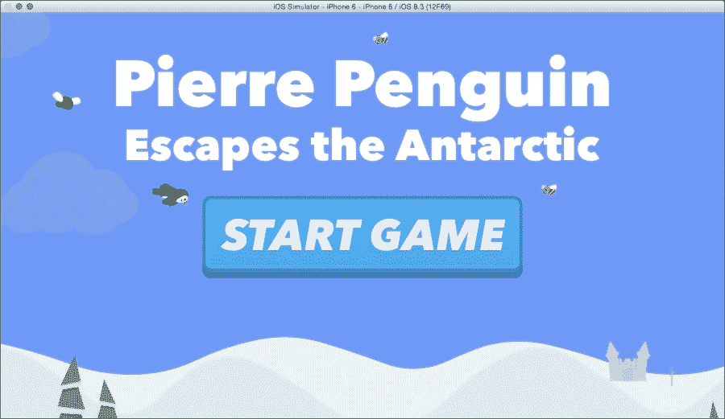
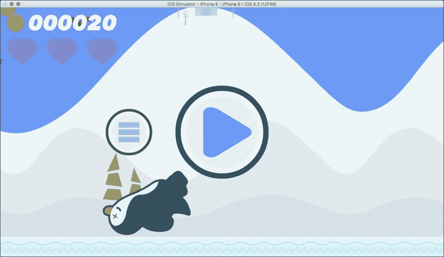
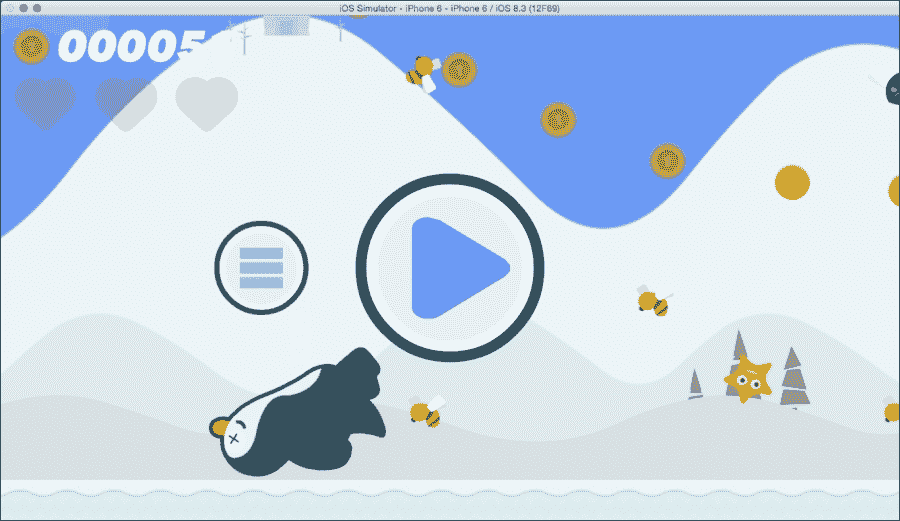

# 第九章：添加菜单和音效

容易忽视菜单设计，但菜单提供了游戏给玩家的第一印象。当正确使用时，你的菜单可以加强游戏的品牌，并在动作之间提供愉快的休息，从而让玩家留在游戏中。在本章中，我们将添加两个菜单：一个在游戏开始时显示的主菜单，以及一个在玩家输掉游戏时出现的重试菜单。

同样，沉浸式音效对于一款优秀的游戏至关重要。音效是支持游戏世界氛围和强调关键游戏机制（如收集金币和受到伤害）的机会。此外，每个有趣的游戏都值得有上瘾的背景音乐！我们将在本章中添加背景音乐和音效，以完成游戏世界的氛围。

本章包括以下主题：

+   构建主菜单场景

+   添加重新开始游戏菜单

+   使用`AVAudio`添加音乐

+   使用`SKAction`播放音效

# 构建主菜单

我们可以使用 SpriteKit 组件来构建我们的主菜单。我们将在新文件中创建一个新的场景用于主菜单，然后使用代码放置背景精灵节点、标志文本节点和按钮精灵节点。让我们首先将菜单场景添加到项目中，并构建出节点。

## 创建菜单场景和菜单节点

要创建菜单场景，请按照以下步骤操作：

1.  我们将为菜单使用一个新的背景图片。让我们将其添加到我们的项目中。

    1.  在资源包的`Backgrounds`文件夹中定位`Background-menu.png`。

    1.  在 Xcode 中打开`Images.xcassets`，然后将`Background-menu.png`拖放到`Images.xcassets`中，使其在项目中可用。

1.  在项目中添加一个名为`MenuScene.swift`的新 Swift 文件。

1.  添加以下代码以创建`MenuScene`场景类：

    ```swift
    import SpriteKit

    class MenuScene: SKScene {
        // Grab the HUD texture atlas:
        let textureAtlas:SKTextureAtlas = 
            SKTextureAtlas(named:"hud.atlas")
        // Instantiate a sprite node for the start button
        // (we'll use this in a moment):
        let startButton = SKSpriteNode()

        override func didMoveToView(view: SKView) {
        }
    }
    ```

1.  接下来，我们需要配置一些场景属性。在新的场景的`didMoveToView`函数内部添加以下代码：

    ```swift
    // Position nodes from the center of the scene:
    self.anchorPoint = CGPoint(x: 0.5, y: 0.5)
    // Set a sky-blue background color:
    self.backgroundColor = UIColor(red: 0.4, green: 0.6,
        blue: 0.95, alpha: 1.0) 
    // Add the background image:
    let backgroundImage = SKSpriteNode(imageNamed: "Background-menu")
    backgroundImage.size = CGSize(width: 1024, height: 768)
    self.addChild(backgroundImage)
    ```

1.  我们需要在菜单的顶部附近绘制游戏名称。在`didMoveToView`函数的底部添加以下代码来绘制“皮埃尔企鹅逃离南极”：

    ```swift
    // Draw the name of the game:
    let logoText = SKLabelNode(fontNamed: "AvenirNext-Heavy")
    logoText.text = "Pierre Penguin"
    logoText.position = CGPoint(x: 0, y: 100)
    logoText.fontSize = 60
    self.addChild(logoText)
    // Add another line below:
    let logoTextBottom = SKLabelNode(fontNamed: "AvenirNext-Heavy")
    logoTextBottom.text = "Escapes the Antarctic"
    logoTextBottom.position = CGPoint(x: 0, y: 50)
    logoTextBottom.fontSize = 40
    self.addChild(logoTextBottom)
    ```

1.  现在我们将添加开始按钮。开始按钮是由按钮图形的`SKSpriteNode`和“开始游戏”文本的`SKLabelNode`组合而成。在`didMoveToView`函数的底部添加以下代码以创建按钮：

    ```swift
    // Build the start game button:
    startButton.texture = textureAtlas.textureNamed("button.png")
    startButton.size = CGSize(width: 295, height: 76)
    // Name the start node for touch detection:
    startButton.name = "StartBtn"
    startButton.position = CGPoint(x: 0, y: -20)
    self.addChild(startButton)

    // Add text to the start button:
    let startText = SKLabelNode(fontNamed: 
        "AvenirNext-HeavyItalic")
    startText.text = "START GAME"
    startText.verticalAlignmentMode = .Center
    startText.position = CGPoint(x: 0, y: 2)
    startText.fontSize = 40
    // Name the text node for touch detection:
    startText.name = "StartBtn"
    startButton.addChild(startText)
    ```

1.  最后，我们将使开始按钮进行脉冲式进出，以增加菜单的动感和兴奋感。在`didMoveToView`函数的底部添加以下代码以淡入淡出按钮：

    ```swift
    // Pulse the start button in and out gently:
    let pulseAction = SKAction.sequence([
        SKAction.fadeAlphaTo(0.7, duration: 0.9),
        SKAction.fadeAlphaTo(1, duration: 0.9),
        ])
    startButton.runAction( SKAction.repeatActionForever(pulseAction))
    ```

干得好！我们已经创建了`MenuScene`类，并添加了构建菜单所需的所有节点。接下来，我们将更新我们的应用，使其从菜单开始，而不是直接跳转到`GameScene`类。

## 游戏开始时启动主菜单

到目前为止，我们的应用每次启动时都会直接跳转到`GameScene`类。现在我们将更新我们的视图控制器，使其从`MenuScene`类开始。按照以下步骤在游戏开始时启动菜单：

1.  打开`GameViewController.swift`文件，找到`viewWillLayoutSubviews`函数。

1.  将整个`viewWillLayoutSubviews`函数替换为以下代码：

    ```swift
    override func viewWillLayoutSubviews() {
        super.viewWillLayoutSubviews()

        // Build the menu scene:
        let menuScene = MenuScene()
        let skView = self.view as! SKView
        // Ignore drawing order of child nodes
        // (This increases performance)
        skView.ignoresSiblingOrder = true
        // Size our scene to fit the view exactly:
        menuScene.size = view.bounds.size
        // Show the menu:
        skView.presentScene(menuScene)
    }
    ```

运行项目，你应该会看到应用以你的新主菜单启动，这看起来就像下面的截图：



了不起的工作！接下来，我们将连接**START GAME**按钮以过渡到`GameScene`类。

## 连接 START GAME 按钮

就像在`GameScene`中一样，我们将在`MenuScene`类中添加一个`touchesBegan`函数来捕捉**START GAME**按钮的触摸。要实现`touchesBegan`，打开`MenuScene.swift`文件，在类的底部添加一个名为`touchesBegan`的新函数，如下所示：

```swift
override func touchesBegan(touches: Set<NSObject>, withEvent 
    event: UIEvent) {
    for touch in (touches as! Set<UITouch>) {
        let location = touch.locationInNode(self)
        let nodeTouched = nodeAtPoint(location)

        if nodeTouched.name == "StartBtn" {
            // Player touched the start text or button node
            // Switch to an instance of the GameScene:
            self.view?.presentScene(GameScene(size: self.size))
        }
    }
}
```

运行项目并点击开始按钮。游戏应该切换到`GameScene`类，游戏玩法将开始。恭喜你，你已经在 SpriteKit 中成功实现了你的第一个主菜单。接下来，我们将添加一个简单的重启菜单，当玩家死亡时，它将显示在`GameScene`上方。

# 添加重启游戏菜单

重启菜单的实现甚至更简单。我们不需要创建一个新的场景，而是可以通过扩展现有的`HUD`类来在游戏结束时显示重启按钮。我们还将包括一个更小的按钮，用于将玩家返回到主菜单。此菜单将显示在动作上方，如下面的截图所示：



## 扩展 HUD

首先，我们需要在`HUD`类中创建和绘制我们新的按钮节点。按照以下步骤添加节点：

1.  打开`HUD.swift`文件，并在`HUD`类中添加两个新属性，如下所示：

    ```swift
    let restartButton = SKSpriteNode()
    let menuButton = SKSpriteNode()
    ```

1.  在`createHudNodes`函数的底部添加以下代码：

    ```swift
    // Add the restart and menu button textures to the nodes:
    restartButton.texture = 
        textureAtlas.textureNamed("button-restart.png")
    menuButton.texture = 
        textureAtlas.textureNamed("button-menu.png")
    // Assign node names to the buttons:
    restartButton.name = "restartGame"
    menuButton.name = "returnToMenu"
    // Position the button node:
    let centerOfHud = CGPoint(x: screenSize.width / 2,
        y: screenSize.height / 2)
    restartButton.position = centerOfHud
    menuButton.position = 
        CGPoint(x: centerOfHud.x - 140, y: centerOfHud.y)
    // Size the button nodes:
    restartButton.size = CGSize(width: 140, height: 140)
    menuButton.size = CGSize(width: 70, height: 70)
    ```

1.  我们故意没有将这些节点作为`HUD`的子节点添加，所以它们将不会出现在屏幕上，直到我们准备好。接下来，我们将添加一个使按钮出现的函数。我们将从这个`GameScene`类中调用此函数，当玩家死亡时。在`HUD`类中添加一个名为`showButtons`的函数，如下所示：

    ```swift
    func showButtons() {
        // Set the button alpha to 0:
        restartButton.alpha = 0
        menuButton.alpha = 0
        // Add the button nodes to the HUD:
        self.addChild(restartButton)
        self.addChild(menuButton)
        // Fade in the buttons:
        let fadeAnimation = 
            SKAction.fadeAlphaTo(1, duration: 0.4)
        restartButton.runAction(fadeAnimation)
        menuButton.runAction(fadeAnimation)
    }
    ```

## 为游戏结束连接 GameScene

我们需要告诉`HUD`类，当玩家耗尽生命值时，显示重启和主菜单按钮。打开`GameScene.swift`文件，并在`GameScene`类中添加一个名为`gameOver`的新函数，如下所示：

```swift
func gameOver() {
    // Show the restart and main menu buttons:
    hud.showButtons()
}
```

到此为止，我们将在下一章中添加到`gameOver`函数，当我们实现高分系统时。

## 当玩家死亡时通知 GameScene 类

到目前为止，`GameScene`类对玩家是生是死一无所知。我们需要改变这一点，以便使用我们新的`gameOver`函数。打开`Player.swift`文件，找到`die`函数，并在函数底部添加以下代码：

```swift
// Alert the GameScene:
if let gameScene = self.parent?.parent as? GameScene {
    gameScene.gameOver()
}
```

我们通过遍历节点树来访问`GameScene`。`Player`节点的父节点是`world`节点，`world`节点的父节点是`GameScene`类。

运行项目并死亡。你应该会看到死亡后出现两个新按钮，如下所示：



干得好。按钮显示正确，但当我们点击它们时，还没有任何反应。为了完成我们的重启菜单，我们只需在`GameScene`类的`touchesBegan`函数中实现两个新按钮的触摸事件。

## 实现重启菜单的触摸事件

现在我们已经显示了按钮，我们可以在`GameScene`类中添加类似于`MenuScene`类中**START GAME**按钮的触摸事件。

要添加触摸事件，打开`GameScene.swift`文件，找到`touchesBegan`函数。我们将在`for`循环的底部添加重启菜单的代码。以下代码包含了整个`touchesBegan`函数，其中新添加的内容用粗体表示：

```swift
override func touchesBegan(touches: Set<NSObject>, withEvent 
    event: UIEvent) {
    player.startFlapping()

    for touch in (touches as! Set<UITouch>) {
        let location = touch.locationInNode(self)
        let nodeTouched = nodeAtPoint(location)

        if let gameSprite = nodeTouched as? GameSprite {
            gameSprite.onTap()
        }

 // Check for HUD buttons:
 if nodeTouched.name == "restartGame" {
 // Transition to a new version of the GameScene
 // to restart the game:
 self.view?.presentScene(
 GameScene(size: self.size),
 transition: .crossFadeWithDuration(0.6))
 }
 else if nodeTouched.name == "returnToMenu" {
 // Transition to the main menu scene:
 self.view?.presentScene(
 MenuScene(size: self.size),
 transition: .crossFadeWithDuration(0.6))
 }
    }
}
```

为了测试你的新菜单，运行项目并故意耗尽生命值。现在，当你死亡时，你应该能够开始新游戏，或者通过点击菜单按钮返回主菜单。太棒了！你已经完成了每个游戏所需的基本两个菜单。

这些简单的步骤对于游戏的总体完成度有很大帮助，企鹅游戏看起来非常棒。接下来，我们将添加事件音效和音乐，以完成游戏世界。

# 检查点 9-A

在此 URL 下载到这一点的项目：

[`www.thinkingswiftly.com/game-development-with-swift/chapter-9`](http://www.thinkingswiftly.com/game-development-with-swift/chapter-9)

# 添加音乐和音效

SpriteKit 和 Swift 使得在我们的游戏中播放声音变得非常容易。我们可以像拖放图像资源一样将声音文件拖入项目中，并通过`SKAction playSoundFileNamed`触发播放。

我们还可以使用`AVFoundation`框架中的`AVAudio`类进行更精确的音频控制。我们将使用`AVAudio`来播放我们的背景音乐。

## 将音效资源添加到游戏中

在`Assets`文件夹中找到`Sound`目录，并通过将其拖放到项目导航器中将其添加到项目中。你应该能看到`Sound`文件夹像其他资源一样出现在你的项目中。

## 播放背景音乐

首先，我们将添加背景音乐。我们希望音乐无论玩家当前查看哪个场景都能播放，因此我们将从视图控制器本身播放音乐。要播放音乐，请按照以下步骤操作：

1.  打开`GameViewController.swift`文件，在现有导入语句下方添加以下`import`语句，以便我们访问`AVFoundation`类：

    ```swift
    import AVFoundation
    ```

1.  在`GameViewController`类中，添加以下属性以存储我们的`AVAudioPlayer`：

    ```swift
    var musicPlayer = AVAudioPlayer()
    ```

1.  在`viewWillLayoutSubviews`函数的底部，添加以下代码以播放和循环音乐：

    ```swift
    // Start the background music:
    let musicUrl = NSBundle.mainBundle().URLForResource(
        "Sound/BackgroundMusic.m4a", withExtension: nil)
    if let url = musicUrl {
        musicPlayer = 
            AVAudioPlayer(contentsOfURL: url, error: nil)
        musicPlayer.numberOfLoops = -1
        musicPlayer.prepareToPlay()
        musicPlayer.play()
    }
    ```

运行项目。当应用启动时，你应该立即听到背景音乐。当你从主菜单移动到游戏界面再返回时，音乐应该持续播放。

## 播放音效

播放简单的声音甚至更容易。我们将使用 `SKAction` 对象在特定事件上播放声音，例如捡起硬币或开始游戏。

### 将硬币音效添加到 Coin 类

首先，我们将在玩家每次捡到硬币时添加一个快乐的声音。要添加硬币音效，请按照以下步骤操作：

1.  打开 `Coin.swift` 文件，并在 `Coin` 类中添加一个新属性以缓存硬币声音动作：

    ```swift
    let coinSound = 
        SKAction.playSoundFileNamed("Sound/Coin.aif", 
            waitForCompletion: false)
    ```

1.  定位 `collect` 函数，并在函数底部添加以下行以播放声音：

    ```swift
    // Play the coin sound:
    self.runAction(coinSound)
    ```

这就是每次玩家捡到硬币时播放硬币声音所需做的全部工作。如果您喜欢，现在可以运行项目来测试它。

### 小贴士

为了避免基于内存的崩溃，缓存每个 `playSoundFileNamed` 动作对象并在每次想要播放声音时重新运行相同的对象非常重要，而不是为每次播放创建一个新的 `SKAction` 对象实例。

### 将增强效果和受伤声音效果添加到 Player 类

当玩家找到星星增强效果时，我们将播放一个令人兴奋的声音，当玩家受到伤害时，我们将播放一个受伤的声音。按照以下步骤实现声音：

1.  打开 `Player.swift` 文件，并在 `Player` 类中添加两个新属性以缓存音效：

    ```swift
    let powerupSound = 
        SKAction.playSoundFileNamed("Sound/Powerup.aif",     
            waitForCompletion: false)
    let hurtSound = 
        SKAction.playSoundFileNamed("Sound/Hurt.aif",
            waitForCompletion: false)
    ```

1.  定位 `takeDamage` 函数，并在底部添加以下行：

    ```swift
    // Play the hurt sound:
    self.runAction(hurtSound)
    ```

1.  找到 `starPower` 函数，并在底部添加以下行：

    ```swift
    // Play the powerup sound:
    self.runAction(powerupSound)
    ```

### 游戏开始时播放声音

最后，我们将在游戏开始时播放一个声音。按照以下步骤播放此声音：

1.  打开 `GameScene.swift` 文件。我们将从 `didMoveToView` 函数播放这个声音效果。通常，在属性中缓存声音动作是至关重要的，但我们不需要缓存游戏开始的声音，因为我们将在每个场景加载时只播放一次。

1.  在 `GameScene didMoveToView` 函数的底部添加以下行：

    ```swift
    // Play the start sound:
    self.runAction(SKAction.playSoundFileNamed("Sound/StartGame.aif", 
        waitForCompletion: false))
    ```

太好了——我们已经为我们的游戏添加了所有音效。现在您可以运行项目来测试每个声音。

# 检查点 9-B

在此 URL 下载我到目前为止的项目：

[`www.thinkingswiftly.com/game-development-with-swift/chapter-9`](http://www.thinkingswiftly.com/game-development-with-swift/chapter-9)

# 摘要

在本章中，我们朝着完成游戏迈出了重要的一步。我们学会了在 SpriteKit 中创建菜单，将主菜单添加到游戏中，并在玩家健康耗尽时提供了重新开始游戏的方式。然后，我们通过吸引人的背景音乐和及时的声音效果增强了游戏体验。现在游戏感觉已经完成；我们几乎准备好发布我们的游戏了。

最后一步：我们将探索与 Apple Game Center 的集成，以在 第十章 中跟踪高分和成就，*与 Game Center 集成*。Game Center 集成鼓励玩家继续玩游戏并提高分数。他们可以看到自己的最佳分数，查看全球最高分，并挑战朋友打破他们的最佳成绩。
