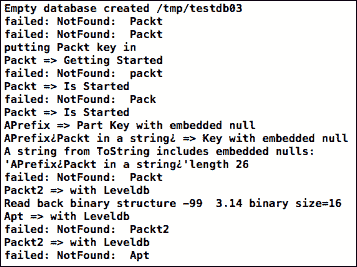

# 第三章. 基本键值操作 – 创建和删除数据

LevelDB 和任何键值存储的核心是能够通过键来 `Put`、`Get` 和 `Delete` 值。这三个操作就是我们存储和检索特定数据片段所需的所有操作，将我们的数据库视为持久字典。

本章将介绍如何以最简单的方式使用 `Put`、`Get` 和 `Delete` 操作来存储和检索数据。我们还将讨论何时以及如何将操作组合成批处理。

本章中的代码将开始比迄今为止的简单示例更具 C++ 习惯用法。LevelDB 的基本接口是 C++，而不仅仅是 C，这引入了一些您需要了解以进行安全编码的问题。许多其他 LevelDB 的语言绑定都建立在 C++ API 之上，尽管在大多数情况下它是不可见的。为了纯 Objective-C 程序员的好处，一些 C++ 习惯用法将详细解释。

用于本章和下一章的示例代码被编写为 OS X 控制台程序，以拥有最简单的测试环境。它关于数据库概念，而不是平台。在 Xcode 中复制项目是尴尬的，所以我们每次都会创建新的项目（当然，您可以在配套代码中下载）。示例代码在许多不同操作周围使用了大量的 `assert` 语句。通常，您会编写更健壮的错误处理代码。

以下截图显示了运行 `Sample03` 代码的整个控制台输出，包括由于一个键中嵌入的空字符而绘制的奇怪字符。

与我们的大多数示例一样，代码从零开始创建数据库，使用与我们在 第一章 中相同的逻辑将其放入临时目录，即 *下载 LevelDB 并在 OS X 上构建*。下载完整的示例代码以编译并亲自尝试，或者只需参考此控制台输出以查看以下代码片段的结果：



Sample03 的控制台输出，显示数据插入和检索的消息

# 在 LevelDbHelper.h 中理解 C++ 习惯用法

LevelDbHelper.h 的几个 C++ 习惯用法是关于能够写入标准 I/O。

### 小贴士

永远不要将未限定的 `using` 语句放入头文件中，因为这会传播到任何 `#includes` 该头文件的源代码，导致难以理解的错误。然而，将 `using` 语句放在其中是完全可以接受的，就像在 `testRead`（以下代码片段中）中看到的那样简化函数。

以 `template` 开头并使用模板类型在其声明中使用的函数，如 `operator<<`，将自动为不同数据类型创建代码。以下是如何添加一个 `operator<<` 函数，以便您的自定义数据类型可以写入流以进行输出：

```swift
// little helper so any Slice can be written to a stream
template<class streamT>
streamT& operator<<(
  streamT& stream,
  const leveldb::Slice& sliceValue)
{
  stream << sliceValue.ToString();
  return stream;
}
```

LevelDB 的 `Get` 函数将 `std::string` 作为其返回值的唯一方式。与经典的 `const char*` C 字符串不同，C++ `std::string` 可以包含二进制数据。它基本上是一个大小和一个指向字节的指针，它通常像字符字符串一样行为，但也可以用作任意容器。你可以看到通过调用 `Get` 返回的 `leveldb::Status` 对象，以及我们如何通过 `ToString()` 检查其 `ok()` 函数和可读的错误消息：

```swift
template<class keyT>
void testRead(keyT key)
{ // templated so we take a key of any datatype accepted by Get
  using std::cout; using std::endl;
  std::string value;
  leveldb::Status s = db->Get(
    leveldb::ReadOptions(), key, &value);
  if (s.ok())
    cout << key << " => " << value << endl;
  else
    cout << "failed: " << s.ToString() << " " << key << endl;
}
```

大多数 LevelDB 函数将 `options` 对象作为它们的第一个参数。仅为此测试，你看到了如何使用 `leveldb::ReadOptions()` 创建默认值。`main03.cpp` 中的 `ropt` 和 `wopt` 变量用于一组单一的连续选项。

# 使用字符串进行 Get 和 Put 操作

来自 `main03.cpp` 的 `testString` 函数存储和检索字符串值。我们首先尝试读取一个不存在的键。请注意，可以传递一个字面量引号字符串或 `std::string` 对象作为键。`testRead` 中的 `Get` 调用会失败，并显示消息 **NotFound**，你可以通过 `if (s.IsNotFound())` 来测试这一点。参见 `leveldb/status.h` 中的 `leveldb::Status` 类声明，以获取所有这些辅助函数。

在使用 `Put` 调用来为给定键添加值之后，只能通过再次使用确切的键来读取它——参见以下代码——不同的案例是如何失败的。更新值只需再次使用 `Put` 并提供不同的值但相同的键即可：

```swift
testRead("Packt");  // should fail until we add this key
testRead( std::string("Packt") ); // should still fail
cout << "putting Packt key in" << endl;
assert( db->Put(wopt, "Packt", "Getting Started").ok() );
assert( db->Put(wopt, "Packt2", "with Leveldb").ok() );
testRead("Packt");  // succeeds now we have put that record
testRead("packt");  // fails, keys are case-sensitive

// change value for existing key
assert( db->Put(wopt "Packt", "Is Started").ok() );
testRead("Packt");  // succeeds now we have put that record
```

# 理解切片 - 高效的 LevelDB 参数对象

`testRead` 函数被模板化，允许它接受任何数据类型作为键。在实践中，这可以是任何可以创建 `leveldb::Slice` 对象的数据类型。这些对象在 LevelDB 接口中用作参数。`Slice` 对象包含一个长度和一个数据指针。它不拥有其数据，因此复制起来非常高效，但也存在风险。如果你保留了一个 `Slice` 对象，那么请确保初始化它的数据也被保留，并且上下文是线程安全的。这也是你永远不应该在线程之间共享 LevelDB 对象的一个原因——它们有通过 `Slices` 引用的内部存储，而这些缓冲区可能会被其他线程的操作损坏。

查看 `slice.h` 以获取完整的类声明。`Slice` 构造函数可以单独接受一个 `const char*` 参数作为 C 字符串，或者接受一个 `std::string` 或 `const char*` 与 `size_t` 长度来定义一个有大小值。`Slice` 方法 `data()` 和 `size()` 返回该数据指针和大小。`Get` 和 `Put` 的输入键和值是 `Slice` 对象的 `const` 引用。这意味着独特的 C++ 构造转换习语可以从任何单个值创建一个临时的 `Slice` 对象，该对象可以用作 Slice 构造函数参数，例如 `const char*` 或 `std::string&`。

# 使用二进制值进行 Get 和 Put 操作

现在你已经了解了如何使用`Slice`对象，让我们回到简单的`Put`和`Get`操作。二进制值可以像字符串值一样存储，记住一个`std::string`值可以被视为，例如`Slice`，只包含数据字节和长度。区别在于`std::string`保留了其字节的拥有权，因此是二进制数据的安全容器。在下面的`testBin()`示例中，我们使用一个指针和长度创建一个`Slice`对象，任意二进制`struct`，并执行相反操作从`Get`返回的`std::string`值中获取二进制`struct`：

```swift
  struct binValues {
    int intVal;
    double realVal;
  };    
  binValues b = {-99, 3.14};
  Slice binSlice((const char*)&b, sizeof(binValues) );
  assert( db->Put(WriteOptions(), "BinSample", binSlice).ok() );
  std::string binRead;
  assert( db->Get(ReadOptions(), "BinSample", &binRead).ok() );
// treat the std::string as a container for arbitary binary data
  binValues* b2 = (binValues*)binRead.data();     
  cout << "Read back binary structure " << b2->intVal << "  "
  << b2->realVal << " binary size=" << binRead.size() << endl;
```

# 使用 Delete – 键值操作的最后一部分

在本章前面，我们看到了如何仅通过再次使用相同键的`Put`操作来更改给定键的值。如果你想有效地重命名一个键，或者完全删除它，你将使用`Delete`。如果键不存在，它将处理这种情况，就像在`Packt`的第二个`Delete`中看到的那样：

```swift
WriteOptions syncWopt;
syncWopt.sync = true;
assert( db->Delete(syncWopt, "Packt").ok() );
testRead("Packt");  // should fail now we have deleted the key
testRead("Packt2"); // still here, delete only removed exact match
assert( db->Delete(syncWopt, "Packt").ok() );  // safe failure
```

`Delete`操作从存储中删除一个键值对。如前所述，我们还需要将其作为重命名的一部分使用，以确保原始键不再存在。与其它数据库架构不同，LevelDB 基于日志的存储没有可以更新的索引表。因此，`rename`操作意味着创建一个新的键，并且整个相关值被重写：

```swift
std::string value;
if (db->Get(readOpt, fromKey, &value).ok()) {
  if (db->Put(writeOpt, toKey, value).ok())
    db->Delete(writeOpt, fromKey);
}    
```

这种通过复制重命名的操作首先检索我们要添加回的值，所以我们从使用旧键的`Get`操作开始。

# 使用 WriteBatch 包装操作以增加安全性

之前重命名键的例子，就像 LevelDB 的任何其他操作序列一样，如果程序在中间终止，则存在使数据库处于不一致状态的风险。我们可以将任何`Put`和`Delete`操作序列包装在`WriteBatch`对象中。使用同步将保证我们等待磁盘 I/O 完成，并允许批次优化其写入序列。重命名的更安全版本是：

```swift
leveldb::WriteOptions syncW;
syncW.sync = true;  // sync writes slower but even safer
std::string value;
if (db->Get(readOpt, fromKey, &value).ok()) {
  leveldb::WriteBatch wb;
  wb.Put(toKey, value);
  wb.Delete(fromKey);
  db->Write(syncW, &wb);
}
```

如果你熟悉其他数据库概念，`WriteBatch`类似于执行事务和提交。这意味着可以放弃操作，这也是`WriteBatch`的一部分，使用其`Clear`操作可以实现。或者，你也可以简单地释放一个`WriteBatch`对象，并且永远不使用`db->Write()`来应用它。

# 摘要

这章非常专注于 C++，展示了用于不同类型内容的模板函数以及将数据写入控制台。详细讨论了至关重要的`Slice`类，其高效但危险的仅引用行为以及它如何使存储二进制数据成为可能。我们涵盖了`Put`、`Get`和`Delete`操作，以及使用`WriteBatch`安全地包装数据更改组合的方法。接下来，我们将学习如何搜索键。
