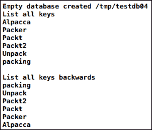
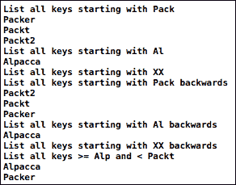
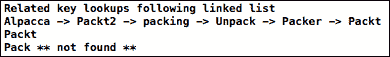

# 第四章. 遍历和搜索键

第三章, *基本键值操作 创建和删除数据*，发现我们只需要通过键来`Put`、`Get`和`Delete`值，但有时一次获取多个值的方式通常非常有用。如果你不知道你的键中可能包含什么数据，那么你需要一种方法来搜索部分匹配或者从数据库的起始位置开始搜索。这种按顺序搜索和遍历键的能力，使得 LevelDB 能够成为数据库基础的能力得以完善。默认的排序顺序是`BytewiseComparator`，实际上是 ASCII 排序。

# 介绍 Sample04 以展示循环和搜索

`Sample04`使用与之前相同的`LevelDbHelpers.h`。请下载整个示例，查看`main04.cpp`以了解代码的上下文。运行`Sample04`首先会打印出整个数据库的输出，如下面的截图所示：



列出键的控制台输出

## 使用循环创建测试记录

这里使用的测试数据是通过一个简单的循环创建的，形成了一个链表。在简单关系型风格部分有更详细的解释。创建测试数据的循环使用了新的 C++11 基于范围的循环风格：

```swift
vector<string> words {"Packt", "Packer", "Unpack", "packing",
"Packt2", "Alpacca"};
stringprevKey;
WriteOptionssyncW; syncW.sync = true;
WriteBatchwb;
for (auto key : words) {
  wb.Put(key, prevKey + "\tsome more content");
  prevKey = key;
}
assert(db->Write(syncW, &wb).ok() );
```

注意我们是如何使用一个`string`来保留`prevKey`的。这里可能会有使用`Slice`来引用`key`的前一个值的诱惑，但请记住关于`Slice`只有数据指针的警告。这将是一个由`Slice`指向其下可以更改的值的经典错误！

我们正在使用`WriteBatch`添加所有键，这不仅是为了保持一致性，而且为了让存储引擎知道它正在一次性接收大量的更新，并可以优化文件写入。从现在开始，我将经常使用术语**记录**。它比**键值对**更容易说，也表明了我们正在存储的更丰富、多值数据。

### 使用迭代器遍历所有记录

LevelDB 中多记录读取的模型是一个简单的迭代。找到一个起点，然后向前或向后移动。

这是通过一个管理你遍历键和值的顺序和起点的`Iterator`对象来完成的。你可以在`Iterator`上调用方法来选择开始的位置，移动，并获取键和值。每个`Iterator`都会得到数据库的一致快照，忽略迭代过程中的更新。创建一个新的`Iterator`来查看变化。

如果你使用过基于 SQL 的声明性数据库 API，你会习惯于执行查询然后操作结果。许多这些 API 和较老的、以记录为中心的数据库有一个**游标**的概念，它维护结果中的当前位置，你只能向前移动。其中一些允许你将游标移动到之前的记录。如果你习惯于从服务器获取集合，那么逐个记录迭代可能会显得笨拙且过时。然而，记住 LevelDB 是一个本地数据库。每一步都不代表一个网络操作！

**可迭代游标**的方法是 LevelDB 提供的所有方法，称为`Iterator`。如果你想以某种方式将收集到的结果集直接映射到**列表框**或其他容器，你将不得不在`Iterator`之上实现它，就像我们稍后将要看到的那样。

向前迭代时，我们只需从数据库中获取一个`Iterator`并使用`SeekToFirst()`跳转到第一个记录：

```swift
Iterator* idb = db->NewIterator(ropt);
for (idb->SeekToFirst(); idb->Valid(); idb->Next())
cout<<idb->key() <<endl;
```

向后搜索非常相似，但作为存储权衡，本质上效率较低：

```swift
for (idb->SeekToLast(); idb->Valid(); idb->Prev())
cout<<idb->key() <<endl;
```

如果你想同时看到值和键，只需在迭代器上使用`value()`方法（`Sample04`中的测试数据可能会让它看起来有些混乱，所以这里没有这样做）：

```swift
cout<<idb->key() << " " <<idb->value()  <<endl;
```

与一些其他编程迭代器不同，没有特殊的前向或后向迭代器的概念，也没有义务保持相同方向继续。考虑搜索一个 HR 数据库中薪酬最高的十位经理。使用*Job+Salary*作为键，你会迭代一个范围，直到你知道已经到达了经理的末尾，然后向后迭代以获取最后十位。

通过`NewIterator()`创建迭代器，所以你必须记得删除它，否则会导致内存泄漏。迭代是在数据的一致快照上进行的，并且通过`Put`、`Get`或`Delete`操作所做的任何数据更改都不会显示，直到创建另一个`NewIterator()`。

## 搜索键的范围

控制台输出的后半部分是我们迭代部分键的示例，这些键默认是区分大小写的，使用默认的`BytewiseComparator`。



搜索的控制台输出

正如我们多次看到的，`Get`函数寻找键的**精确**匹配。然而，如果你有一个`Iterator`，你可以使用`Seek`，它会跳转到第一个与指定的部分键完全匹配或紧随其后的键。

如果我们只是寻找具有公共前缀的键，最优的比较方法是使用`Slice`类的`starts_with`方法：

```swift
Void listKeysStarting(Iterator* idb, const Slice& prefix)
{
cout<< "List all keys starting with "
<<prefix.ToString() <<endl;
for (idb->Seek(prefix);
idb->Valid() &&idb->key().starts_with(prefix);
idb->Next())
cout<<idb->key() <<endl;
}
```

向后搜索稍微复杂一些。我们使用一个保证失败的键。你可以将其视为位于以我们的前缀开始的最后一个键和所需范围之外的下一个键之间。当我们`Seek`到那个键时，我们需要向前移动一步到前一个键。如果这是有效的并且匹配的，那么它就是我们的范围内的最后一个键：

```swift
Void listBackwardsKeysStarting(Iterator* idb, const Slice& prefix)
{
cout<< "List all keys starting with "
<<prefix.ToString() << " backwards " <<endl;
const string keyAfter = prefix.ToString() + "\xFF";
idb->Seek(keyAfter);
if (idb->Valid())
idb->Prev(); // step to last key with actual prefix
else // no key just after our range, but
idb->SeekToLast(); // maybe the last key matches?
for(;idb->Valid() &&idb->key().starts_with(prefix);
idb->Prev())
cout<<idb->key() <<endl;
}
```

如果你想获取一个范围内的键？第一次，我不同意 LevelDB 附带文档中的说明。他们的迭代示例显示了与以下代码中显示的类似循环，但使用`idb->key().ToString() < limit`检查键值。这是一个更昂贵的迭代键的方式，因为它为每个被检查的键生成一个临时的字符串对象，如果范围内有数千个键，这将是昂贵的：

```swift
Void listKeys Between(Iterator* idb,
const Slice&startKey, const Slice&endKey)
{
cout<< "List all keys >= " <<startKey.ToString()
<< " and < " <<endKey.ToString() <<endl;
for (idb->Seek(startKey);
idb->Valid() &&idb->key().compare(endKey) < 0; 
idb->Next())
cout<<idb->key() <<endl;
}
```

我们可以使用`Slice`的另一个内置方法；`compare()`方法，它返回一个结果<0, 0, 或>0，以指示`Slice`是否小于、等于或大于它正在比较的其他`Slice`。这与标准 C 的`memcpy`语义相同。前面代码片段中显示的代码将找到与`startKey`相同或之后的键，并且在`endKey`之前。如果你想使范围包括`endKey`，将比较改为`compare(endKey) <= 0`。

### 以简单关系风格链接记录

有许多方法可以实现更丰富的关系索引，这将在稍后讨论。这个简单的例子显示了与一个键关联的值，它存储了数据以及另一个键值。这是经典的记录链表：



键的链随后存储一个键的值

如您所见，每个记录都包含查找另一个相关记录的信息。在这种情况下，关系仅仅是记录以特定的顺序创建，但它可以是任何一致的意义，例如，父子关系。

我们之前看到的循环，创建记录通过存储一个组合`prevKey + "\tsome more content"`（其中"some more content"通常每个记录都不同）来组成记录值。我们提取那个前一个键并使用它来导航到另一个记录：

```swift
string nextKey;
if (db->Get(ropt, firstkey, &nextKey).IsNotFound())
return firstkey + " ** not found **";  
string ret = firstkey;
for (;;) {
  string key = value.substr(0, value.find("\t") );     
  if (db->Get(ropt, key, &value).IsNotFound())
  break;
  ret += " -> " + key;
}
return ret;
```

注意我们在记录值中使用了简单的制表符作为分隔符，在下一个要使用的键和实际内容之间的文本。这个原则与关系数据库相同；其他搜索的键值包含在记录中。这个例子只有一种记录数据。在下一章中，我们将使用这种技术构建一个二级索引，其中使用电话号码键来查找主记录键。如果你需要查找数据，添加多个键是唯一实现速度的方法。

# 摘要

在这一章中，我们学习了 LevelDB 中迭代器的概念，作为按其键排序的记录遍历的方式。数据库通过搜索来获取迭代器的起始点，以及示例展示了如何有效地在遍历范围时检查键。最后，我们回到了简单的`Get`来查找键，以帮助通过数据库实现链表。现在，我们将离开 C++，进入 Objective-C 的世界。
