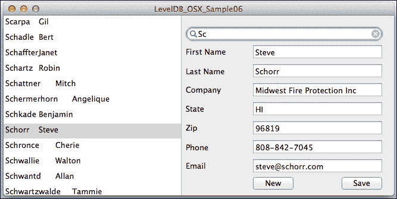

# 第六章。与 Cocoa UI 集成

到目前为止，重点一直是如何用尽可能少的用户界面用 C++ 或 Objective-C 编程数据库调用。现在我们将看到一些在 Cocoa 应用程序中展示这些数据的一些简单方法，足以构建一个完整的应用程序。第一次，我们的示例代码将是一个由用户驱动的应用程序，而不仅仅是测试函数的一系列。这些讨论假设你熟悉使用 Xcode 编辑界面，包括连接到 `IBOutlets` 和 `IBActions`。请参阅本章末尾的参考文献（部分：*推荐 Xcode 书籍*）以获取 Xcode 的帮助。

# 使用 LevelDB 满足数据源需求

在 `NSTableView` 或 `UITableView` 中展示数据列表的问题在于，它们期望一个类似数组的模型，具有两个特性：

+   行数是已知的

+   可以在任意索引处检索行内容

这与 LevelDB 不太匹配，因为 LevelDB 不了解键的总数，只能通过遍历其他九个键来获取第十个键。典型的解决方案，我们在这些示例中使用，是将数据库中的内容复制到 `NSArray` 类中，以填充表格视图。对于单个滚动表格中的可用数据量，这表现良好。我用像这里捆绑的 50,000 条记录进行了测试，它仍然在 iPhone4 上快速且可用。

要获取与给定行相关联的数据的完整详细信息，当行被选中时，你需要能够从行号映射到数据源中的位置。如果你允许通过点击标题或拖放新内容来重新排序表格，这将会变得复杂。在这个示例中，我们将不会深入探讨细节，但通常的技术是使用 `NSMutableArray` 的子类，以便单元格可以被移动。

虽然接下来的讨论都是关于 OS X 应用程序的，但 iOS 版本已在线上提供，几乎完全相同，用 `UITableView` 替换了 `NSTableview`。另一个主要区别是控制器逻辑的位置。在简单的 OS X 应用程序中，使用 `AppDelegate` 的地方，在 iOS 应用程序中你会使用 `ViewController` 类。

# 创建 OS X 图形用户界面

OS X 用户界面结合了一个可搜索的记录列表和一个相邻的数据输入表单，以查看和更改记录的详细信息，包括创建新记录。



OS X 示例应用程序显示带有搜索结果和记录详细信息的列表

OS X 应用程序是一个包含以下内容的单个窗口 `MainMenu06.xib`：

+   用于列出记录的 `NSTableView` 类

+   一个 `NSSearchField` 类，用于输入搜索，随着你输入而触发

+   一系列 `NSTextField` 字段，用于编辑记录的各个部分

+   两个 `NSButtons` 用于发出命令，**保存** 和 **新建**

+   一个菜单栏，包含与按钮相同的命令（例如，**文件** | **保存**）

它是使用 Xcode 模板创建的新 Cocoa 应用程序，没有检查 **基于文档** 选项。

# 将数据库连接到 `NSTableView`

所有这些界面方法和输出都在 `GSwLDB06osxAppDelegate` 中。

+   输入时自动进行实时搜索，因为 `NSSearchField` 对象的操作连接到 `IBActionviewMatches`

+   `NSTableView` 类的 `datasource` 和 `delegate` 输出连接到 `GSwLDB06osxAppDelegate`，它有一个相应的输出 `tableView`，引用 `NSTableView` 类

为了支持表格操作，向对象添加了两个独立的协议。`NSTableViewDelegate` 是关于表格行为，响应诸如编辑和拖动项等事件。提供显示数据的两个关键方法由 `NSTableViewDataSource` 协议提供。这两个协议通常由一个对象满足，但这不是强制性的：

```swift
@interface GSwLDB06osxAppDelegate: NSObject
<NSApplicationDelegate, NSTableViewDataSource,
NSTableViewDelegate>
- (IBAction)viewMatches:(id)sender;
- (IBAction)newRecord:(id)sender;
- (IBAction)saveRecord:(id)sender;
@property (weak) IBOutletNSTextField *FirstNameEntry;
...
@property (weak) IBOutletNSTextField *EmailEntry;
@property (assign) IBOutletNSWindow *window;
@property (retain) IBOutletNSTableView *tableView;
@end
```

这个 GUI 代理和负责管理数据选择并重用于 iOS 应用中的 `Model` 类之间存在明显的分离。作为一个 `NSTableViewDataSource` 协议，代理向模型请求数据。GUI 对 LevelDB 一无所知。《GSwLDB06osxAppDelegate》中的表格相关方法包括：

```swift
- (IBAction)viewMatches:(id)sender {
  [self.modelloadStartingWith:[sender stringValue]];
  [self.tableViewreloadData];
  [selfloadFieldsForCurrentSelectedRow];  // explicitly reload
}

- (NSInteger) numberOfRowsInTableView:(NSTableView *)table {
  return [self.modelcountRows];
}

- (id)tableView:(NSTableView *)table
    objectValueForTableColumn:(NSTableColumn *)column
    row:(NSInteger)rowIndex
{ // cheat by using combined Last/First Name rather than two cols
  return [self.modelkeyForRow:rowIndex];
}
```

模型的公共接口在 `Sample06_Model.h` 中：

```swift
@interface Sample06_Model :NSObject
+ (Sample06_Model*)modelWithSampleDatabasePath:
(NSError**)errorOut;
- (void)loadSampleDatafile:(NSString*)filename;
- (NSString*)keyForRow:(NSInteger)row;
- (int)countRows;
- (void)loadStartingWith:(NSString*)partialKey;
- (NSArray*)fieldsForRow:(NSInteger)index;
- (BOOL)saveRecord:(NSArray*)fields;
@end
enumfieldOffsets {eFirstName=0, eLastName=1, eCompany=2,
eState=3, eZip=4, ePhone=5, eEmail=6};
```

在 `Sample06_Model.m` 中通过类扩展添加了私有方法和属性：

```swift
@interface Sample06_Model(){}	
- (Sample06_Model*) initWithSampleDatabasePath:
(NSError**)errorOut;
- (void)loadListForUI;
- (NSString*)mainKeyFrom:(NSString*)key;
- (void)addRecord:(NSArray*)fields
using:(id<APLevelDBWriteBatch>)batch;
@property (retain) APLevelDB* db;
@property (retain) NSArray* rowsForUI;
@end

- (void)loadStartingWith:(NSString*)partialKey {
  self.rowsForUI = [self.dbkeysWithPrefix:partialKey];
}

- (int)countRows{
  if (self.rowsForUI == nil)
    [selfloadListForUI];
  return [self.rowsForUI count];
}

- (NSString*) keyForRow:(NSInteger)row{
  if (self.rowsForUI == nil)
    [selfloadListForUI];
  return (NSString*)(self.rowsForUI[row]);
}

- (void)loadListForUI {
  self.rowsForUI = [self.dballKeys];
}
```

假设 `loadListForUI` 可能需要在任何时候调用。虽然它只是一行，但它被分离成一个方法，以便后续代码可以更智能地加载列表。

# 将记录详细信息连接到编辑表单

编辑 GUI 根据表格中的当前选择显示记录的详细信息。我们可以更改记录并保存它们，或者在不警告丢失更改的情况下点击不同的行。最简单的编辑行为包括：

+   **响应** 表格选择的变化，显示详细信息

+   **保存** 将输入的详细信息复制回数据库

+   **新建** 清除输入字段，以便可以添加记录

模型将记录详细信息呈现为 `NSString` 值的 `NSArray` 类，通过枚举 `fieldOffsets` 索引。你可以将其视为一个水平数组，与在表格中显示的键的垂直数组形成对比。

允许并响应 **选择** 变化很简单。由协议 `NSTableViewDelegate` 声明的两个选择相关方法也被使用：

```swift
- (void)tableViewSelectionDidChange:(NSNotification*)notification
{
  [selfloadFieldsForCurrentSelectedRow];
}

- (BOOL)selectionShouldChangeInTableView:(NSTableView*)tableView {
  return YES; // assumes we always leave, abandoning changes
}

- (void)loadFieldsForCurrentSelectedRow {  // mirrors saveRecord
if ([self.tableViewnumberOfSelectedRows] == 0) {
    [selfclearEntryFields];
    return;
  }
  NSArray* fields = [self.modelfieldsForRow:row];
  [self.FirstNameEntrysetStringValue:fields[eFirstName] ];
...
  [self.EmailEntrysetStringValue:fields[eEmail] ];
}

- (IBAction)saveRecord:(id)sender {
  NSArray* fields = [NSArrayarrayWithObjects:
    [self.FirstNameEntrystringValue],
...
    [self.EmailEntrystringValue],
  nil ]; // built an array of all field entries
  [self.modelsaveRecord:fields]; // save array to record
}

- (IBAction)newRecord:(id)sender {
  if ([self.tableViewnumberOfSelectedRows] == 0)
    [selfclearEntryFields];
  else  // selecting none will trigger clearEntryFields
    [self.tableViewdeselectAll:sender];
}
```

`Sample06_Model.m` 对 GUI 的支持知道如何将 GUI 中的行号映射到数据库键，正如我们所见，这用于提供表视图内容。类似的逻辑提供了我们现在用来检索数据库记录的键：

```swift
- (NSArray*)fieldsForRow:(NSInteger)index
{
  NSString* key = [self keyForRow:index];
  NSData* mainRec = [self.dbdataForKey:key];
  NSError* decodeErr;
  NSArray* fields = [NSJSONSerialization
  JSONObjectWithData:mainRec options:0 error:&decodeErr];
  return fields;
}
```

这样就处理了数据加载。为了保存，我们需要将字段数组发送回模型并更新数据库。这从 `GSwLDB06osxAppDelegate` 中的 `(IBAction)saveRecord` 开始。它调用模型的 `saveRecord` 方法，该方法反过来使用 `addRecord` 保存一个包含名称的键和 JSON 体的键：

```swift
- (IBAction)saveRecord:(id)sender {
  NSArray* fields  = [NSArrayarrayWithObjects:
    [self.FirstNameEntrystringValue],
...
    [self.EmailEntrystringValue],
  nil ];
  [self.modelsaveRecord:fields];
  self.isNewRecord = NO;
  [self.tableViewreloadData];
}

- (void)saveRecord:(NSArray*)fields {
  id<APLevelDBWriteBatch>wb = [self.dbbeginWriteBatch];  
  [selfaddRecord:fieldsusing:wb];
  [self.dbcommitWriteBatch:wb];  
  self.rowsForUI = nil; // force reload when UI refreshes
  return YES;
}

- (void)addRecord:(NSArray*)fields 
  using:(id<APLevelDBWriteBatch>)batch{
  NSString* nameKey = nameKeyFromFields(fields); 
  NSError* encErr;
  NSData* enc = [NSJSONSerializationdataWithJSONObject:fields
    options:0 error:&encErr];
    [batchsetData:encforKey:nameKey];
}
```

新的动作只是一个清除所有输入字段的 GUI 动作。它设置了代理的属性 `isNewRecord`，正如你在 `saveRecord` 中的前述代码中所见，但它对模型或 leveldb 没有影响。只有当你保存新记录时，数据库才会被使用。

# 推荐的 Xcode 书籍

以下 Packt 出版的书籍在介绍 Xcode 界面编辑器和解释表格类时非常直接，并配有良好的示例：

+   *《Cocoa 和 Objective-C 烹饪书》*，*Jeff Hawkins*，*Packt 出版公司*，针对 OS X 上的 `NSTableView`

+   *《Xcode 4 烹饪书》*，*Steven F Daniel*，*Packt 出版公司*，针对 iOS 上的 `UITableView`

# 摘要

我们现在已经对具有 GUI 和数据模型分离的真实数据库应用程序有了良好的开端。你在模型层中使用了添加数据和搜索的理解。我们涵盖了加载记录列表的需求以及如何根据我们的选择显示详细数据。现在我们有一个更复杂的应用程序，下一章将展示我们如何使用一些调试技术来查看数据变化。之后，我们将回到 `Sample06` 并添加二级索引、删除以及更复杂的数据更新。
