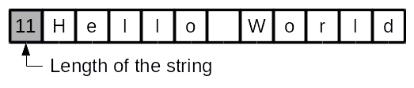
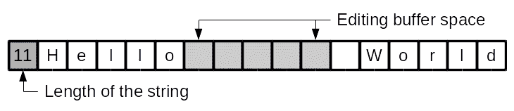
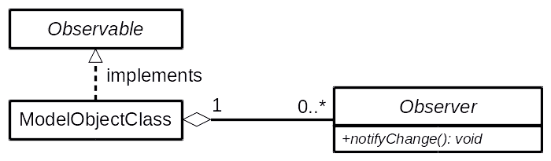
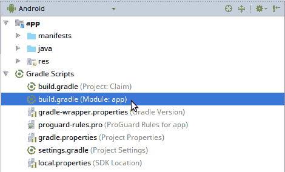
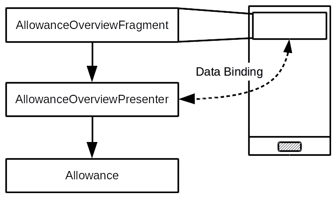
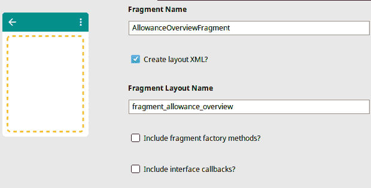
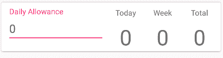

# 第五章：将数据绑定到小部件

到目前为止，你一直是手动将数据从数据模型复制到你的表示层，然后再将其复制回来。这种在具有状态的控件之间来回移动数据的行为，在某种程度上是你始终需要做的。数据复制的位置和方式可能会改变，但为了使应用程序工作，这必须完成。在本章中，我们将探讨 Android 提供的一个名为数据绑定的系统。**数据绑定**为数据的来回复制提供了一种替代方案，同时也为代码的更多重用打开了几个其他设计机会。

数据绑定为你提供了一种方法，可以显著减少应用程序中的样板代码量，同时保持类型安全并提供出色的性能。数据绑定引擎允许你提供用户界面逻辑，该逻辑与布局资源明显分离，并且可以很容易地由应用程序中的许多屏幕重用，同时简化应用程序代码和布局资源文件的复杂性。

在本章中，我们将探讨以下主题：

+   数据绑定存在的理由

+   如何编写数据绑定布局

+   如何在 MVP 设计中使用数据绑定

+   响应式编程和你的数据模型

+   如何在 Activity、Fragment 和小部件中使用数据绑定

# 探索数据模型和小部件

理论上，小部件可以直接通过持有数据指针来引用它们正在操作的记忆，而不是来回复制数据，但大多数情况下，使用相同的数据格式来存储和编辑是没有意义的。

以文本字符串为例；存储字符串的最佳方式是作为字符数组；每次需要将文本发送到任何地方，无论是通过网络还是显示，都可以简单地从第一个字符读取到最后的字符，每个字符都可以原样传输。例如，"Hello World" 可以存储为字符串长度，后跟每个字符：



这不是存储正在编辑的字符串的好方法；然而，对于编辑来说，最好在光标周围留有缓冲空间，以避免在用户输入和更正时需要来回复制大量数据。例如，如果用户将光标放在单词 "Hello" 之后，相同的数组可能看起来像这样：



这种在数据只读时应如何存储，以及编辑时应如何存储之间的张力，是现代用户界面小部件往往成为复杂机械的重要原因之一。它们不仅需要看起来漂亮，还需要快速，为此，它们需要在内部以最适合其实现的方式表示数据。因此，我们无法让`EditText`小部件仅仅操作一个字符数组，我们被迫像你迄今为止手动做的那样，在内部结构中复制和粘贴字符串。

Android 中的数据绑定系统允许你直接从布局文件中引用你的对象模型，然后生成连接对象模型到小部件所需的全部 Java 代码。这个系统被称为数据绑定，其核心类可以在`android.databinding`包中找到。数据绑定系统还支持*响应式编程*；当数据模型发生变化时，它可以直接反映在用户界面小部件上，使得应用无需显式更新小部件就能保持屏幕上的内容更新。数据绑定系统也是完全类型安全的，因为它在应用编译时生成所有代码，所以任何类型错误都会立即产生，而不是可能在运行时产生，那时用户可能会看到它们。

# 观察者模式

Android 中的数据绑定框架利用**观察者模式**来实现*响应式编程*。任何由实现`Observable`接口的布局文件引用的对象都会被监视，当它发出已更改的信号时，用户界面会相应地更新。由于数据绑定系统可以用在任何小部件的任何属性或设置器上，这意味着你可以控制的不仅仅是用户界面内容或状态。你可以控制小部件是可见还是不可见，还可以控制用于小部件背景的图像。在核心上，观察者模式看起来是这样的：



在 Android 观察者模式中，数据模型类通过实现`android.databinding.Observable`接口并通知一系列事件监听器（观察者）其状态的变化来暴露自己。Android 提供了几个便利类，使得实现这个模式变得容易得多。你可以通过以下三种方式在 Android 中实现这个模式：

+   在你的对象模型中实现可观察模型

+   在你的对象模型之上实现一个可观察模型

+   在表示层实现可观察模型

让我们详细看看这三种方法：

+   在你的对象模型中**直接实现可观察**是常见的，但副作用是使用可观察模式和 Android 类污染你的对象模型，这实际上会阻止你在系统的其他部分（例如服务器端）使用相同的代码库。当你的对象模型代码仅由你的 Android 应用程序使用时，这是一个好的方法。

+   在对象模型之上**实现一个可观察层**有时是一个更好的选择，但也可能导致复杂化；通过可观察层引用的每个对象也需要被包裹在一个可观察对象中。这会导致模型实现变得更加复杂，并且无法覆盖在可观察层之外做出的更改。当你使用工具生成对象模型的代码，或者需要在 Android 应用程序代码中添加额外的应用特定层时，这种方法是有用的。

+   在表示层**实现观察者模式**意味着数据绑定层持有的根引用本身是可观察的，但对象模型不是。这从技术上允许你拥有一个不可变的数据模型。数据绑定引擎将不会看到数据模型中各个字段的更改，而是被通知整个模型已更改。这也可能是一个非常昂贵的模型，因为数据绑定层将重新评估数据模型的每个部分，以应对对其所做的每个更改。然而，当你的应用程序倾向于同时更新模型中的多个字段，或者高度多线程时，这是一个很好的方法。

这些选项中没有一个是始终优于其他选项的；相反，在确保你的用户界面与应用程序的整体状态保持同步时，值得考虑每个选项。在某些屏幕上，这种反应性行为甚至可能是不希望的，因为它可能会轻易地打扰用户。在这些情况下，仅为了填充屏幕，使用数据绑定就值得了。

数据绑定系统不是双向的；模型中的更改反映在用户界面上，但用户界面小部件中的输入不会自动推送到模型中。这意味着你的应用程序仍然需要处理事件并捕获用户界面中的更改，如前面所示。

# 启用数据绑定

在 Android 项目中，默认情况下数据绑定功能是关闭的。你需要在项目的`build.gradle`文件中手动启用它们。按照以下快速步骤启用数据绑定系统：

1.  首先，在 Android Studio 的 Android 面板中找到你的应用程序模块的`build.gradle`文件：



1.  打开此文件并定位到`android`块：

```java
android {
  compileSdkVersion 26
  // ...
}
```

1.  在`android`块的末尾，添加以下片段以启用数据绑定：

```java
android {
 compileSdkVersion 26
   // ...
 dataBinding {
 enabled = true
 }
}
```

1.  保存此文件后，Android Studio 将在文件顶部打开一个横幅，告诉你需要同步项目。点击横幅右侧的“立即同步”链接，等待同步完成。

恭喜！你已经在你的项目中启用了数据绑定框架。现在你可以开始了，利用你的布局文件中的数据绑定系统，这将简化应用程序并打开通往重用代码库的新方法。

# 数据绑定布局文件

数据绑定主要通过代码生成来实现，运行时开销非常小。它允许你在布局 XML 文件中使用特殊的表达式语言，这些表达式在应用程序编译之前被转换为 Java 代码。这些表达式可以调用方法、访问属性，甚至对于触发事件也很有用。然而，它们也有一些限制：它们不能直接引用用户界面中的小部件，也不能创建任何新对象（它们没有`new`运算符）。因此，你需要为你的布局文件提供一些实用方法以保持简单，并且在使用表达式时有一些指南需要遵循：

+   **保持表达式简单**：不要在表达式中写入应用程序逻辑；相反，创建一个可重用的实用方法。

+   **避免直接操作数据**：尽管这样做可能很有吸引力，但请确保在将数据提供给布局绑定之前，数据总是准备好用于展示。在你的`Activity`或`Fragment`类模型中保留默认值，而不是在布局 XML 文件中。

+   **使用展示者对象**：当你需要对数据进行一些简单的转换（例如格式化日期或数字）时，将这些转换放入对象中。表达式语言可以引用静态方法，但展示者对象要强大得多，也更加灵活。

+   **传递事件**：在编写事件时，避免使用表达式语言进行除方法调用之外的操作，并尝试将事件作为对象传递到布局中，无论是作为展示者还是作为命令对象。这保持了事件的灵活性和可重用性。

通过坚持这些指南，你会发现使用数据绑定系统不仅能让你摆脱一些最常见的用户界面模板代码，还能提高你布局和整体应用程序的质量。通过在你的布局文件中使用对象而不是静态方法，你最终会得到模块化的类，这些类可以在整个应用程序中轻松重用。

现在您的应用可以捕获人们的费用作为索赔，是时候开始考虑如何显示这些信息了。这有两个主要组成部分：用户创建的索赔项列表，以及他们应该保持的整体旅行津贴。到目前为止，您有捕获屏幕，虽然在许多方面它是应用中最重要的屏幕，但并不是用户首先看到的屏幕——那将是概览屏幕。

概览屏幕的主要任务是按顺序显示索赔项，从最新到最旧。然而，为了保持用户的简单生活，我们还会在屏幕顶部显示一个摘要卡片，这有助于他们跟踪他们的消费。在这个例子中，我们假设津贴是按每天旅行金额指定的。

# 创建一个 Observable 模型

为了开始这个项目部分的工作，你需要一个新的模型类来封装用户的津贴和消费。我们将把这个新类命名为 `Allowance`，并内置一些实用方法来获取有用的信息（例如用户在两个日期之间的消费金额）。最重要的是，这个新模型需要告诉我们何时发生变化。这可以从技术上通过事件总线或专门的监听器来完成，但在这个例子中，我们将采用观察者模式。为了使这可行，`Allowance` 类将扩展自 `BaseObservable`，这是一个数据绑定 API 的一部分，用于方便的类。每当 `Allowance` 类发生变化时，它将发出事件，通知其观察者变化。让我们开始构建 `Allowance` 类：

1.  右键单击 `model` 包，然后选择“新建| Java 类”。

1.  将新类命名为 `Allowance`。

1.  将父类更改为 `android.databinding.BaseObservable`。

1.  将 `android.os.Parcelable` 添加到接口字段。

1.  点击“确定”以创建新类。

1.  在类顶部，声明以下字段和构造函数，以及一个获取 `amountPerDay` 的 getter 方法，它代表用户希望获得的津贴：

```java
private int amountPerDay;
private final List<ClaimItem> items = new ArrayList<>();

public Allowance(final int amountPerDay) {
    this.amountPerDay = amountPerDay;
}

protected Allowance(final Parcel in) {
    amountPerDay = in.readInt();
    in.readTypedList(items, ClaimItem.CREATOR);
}

public int getAmountPerDay() { return amountPerDay; }
```

1.  现在是 Observable 实现的第一部分；当我们更改 `amountPerDay` 字段时，我们需要通知任何观察者 `Allowance` 对象已更改：

```java
public void setAmountPerDay(final int amountPerDay) {
    this.amountPerDay = amountPerDay;
    notifyChange();
}
```

1.  `Allowance` 类将始终确保所有 `ClaimItem` 对象按从新到旧的顺序排序；了解这一点后，我们可以添加一些便利方法来找到 `Allowance` 对象的 *起始* 和 *结束* 日期：

```java
public Date getStartDate() {
  return items.get(items.size() - 1).getTimestamp();
}
public Date getEndDate() {
  return items.get(0).getTimestamp();
}
```

1.  现在，创建一个简单的计算方法来确定这个 `Allowance` 的总消费金额。这个方法简单地将所有 `ClaimItem` 对象中的金额加起来：

```java
public double getTotalSpent() {
    double total = 0;

    for (final ClaimItem item : items)
        total += item.getAmount();

    return total;
}
```

1.  然后，添加另一个计算方法来计算两个日期之间的消费金额。这可以用来找出特定日期、周、月等的消费金额：

```java
public double getAmountSpent(final Date from, final Date to) {
   double spent = 0;
    for (int i = 0; i < items.size(); i++) {
        final ClaimItem item = items.get(i);
        if (item.getTimestamp().compareTo(from) >= 0
                && item.getTimestamp().compareTo(to) <= 0) {
            spent += item.getAmount();
        }
    }

    return spent;
}
```

1.  现在，您需要一个方法来向`Allowance`添加`ClaimItem`。`Allowance`始终维护从最新到最旧的`ClaimItem`对象列表，因此每次添加项目时，此方法只需对列表进行排序，然后通知观察者`Allowance`已更改：

```java
public void addClaimItem(final ClaimItem item) {
   items.add(item);
   Collections.sort(
     items,
     Collections.reverseOrder(new Comparator<ClaimItem>() {
       @Override
       public int compare(final ClaimItem o1, final ClaimItem o2) {
         return o1.getTimestamp().compareTo(o2.getTimestamp());
       }
     })
   );

   notifyChange();
}
```

对列表进行此类排序是一个非常糟糕的实现，但非常简单易写。在实际应用中，您应该使用二分查找来确定添加`ClaimItem`的正确位置。Android 提供了帮助进行此操作的类，我们将在本书的后面部分探讨。

1.  我们还需要能够从`Allowance`中删除`ClaimItem`对象。这也是一个可变操作，因此在完成后通知任何观察者：

```java
public void removeClaimItem(final ClaimItem item) {
  items.remove(item);
  notifyChange()
}
```

1.  添加`ClaimItem`对象的访问器方法：

```java
public int getClaimItemCount() {
  return items.size();
}
public ClaimItem getClaimItem(final int index) {
  return items.get(index);
}
public boolean isEmpty() {
  return items.isEmpty();
}
```

1.  通过编写其`Parcelable`实现来完成`Allowance`类的编写：

```java
@Override
public void writeToParcel(Parcel dest, int flags) {
  dest.writeInt(amountPerDay);
  dest.writeTypedList(items);
}

@Override
public int describeContents() { return 0; }

public static final Creator<Allowance> CREATOR = new Creator<Allowance>() {
  @Override
  public Allowance createFromParcel(Parcel in) {
    return new Allowance(in);
  }

  @Override
  public Allowance[] newArray(int size) {
    return new Allowance[size];
  }
};
```

如您所见，`Allowance`类是您对象模型中需要观察的第一个（也是目前唯一的）部分；构建一个`Observable`模型并不困难，能够观察模型状态的变化会打开一些惊人的机会，例如自动网络同步或统计聚合。

如果您的应用程序中有事件总线，通过它而不是直接观察来推送对象模型更改通常是一个更好的选择，因为它将提供更好的解耦。有许多与 Android 兼容的事件总线 API，值得检查它们。一个具有事件总线实现的知名 API 是 Google 的 Guava API ([`github.com/google/guava`](https://github.com/google/guava))。

# 建立 AllowanceOverviewFragment

允许概述将以卡片的形式显示在概述屏幕的顶部。概述卡片将由一个新的`Fragment`类填充，该类将封装数据绑定的第一部分。`AllowanceOverviewFragment`将依赖于数据绑定系统来完成大部分繁重的工作，并将提供一个特殊的`AllowanceOverviewPresenter`对象，该对象可以查询统计数据和数据。`AllowanceOverviewPresenter`将反过来引用`Allowance`对象，并监听其上的任何更改，以便更新和缓存统计数据。这些实体之间的关系可以用以下图表最好地解释：



在`Fragment`中封装统计数据意味着它更容易包含在其他布局中，这些布局可能包含与概述屏幕不同的信息。按照以下快速步骤创建`AllowanceOverviewFragment`和`AllowanceOverviewPresenter`骨架：

1.  右键单击`ui`包，然后选择“新建”|“Fragment”|“Fragment（空白）”。

1.  将 Fragment 命名为`AllowanceOverviewFragment`。

1.  关闭“包含 Fragment 工厂方法”和“包含接口回调”选项：



1.  点击“完成”以创建新的`Fragment`及其默认布局文件。

1.  再次右键单击 `ui` 包，并选择“新建| Java 类”。

1.  将新类命名为 `presenters.AllowanceOverviewPresenter`。

1.  点击“确定”以创建新的包和类。

1.  `AllowanceOverviewPresenter` 需要的第一件事是一个内部类，用于存储将显示给用户的缓存支出统计信息。这将是一个不可变结构；当统计信息发生变化时，我们将同时刷新所有这些信息：

```java
public static class SpendingStats {
   public final int total;
   public final int today;
   public final int thisWeek;
   SpendingStats(
           final int total,
           final int today,
           final int thisWeek) {
       this.total = total;
       this.today = today;
       this.thisWeek = thisWeek;
   }
}
```

你会注意到 `SpendingStats` 类的字段是 `public final`，并且没有 getter 方法。在处理数据绑定时，耦合通常非常紧密，因此引入 getter 方法实际上可能会增加复杂性。最好在需要之前避免使用 getter 方法。

1.  我们需要以某种方式将 `SpendingStats` 暴露在类外部，以便数据绑定可以监视其变化。Android 数据绑定再次有一个辅助类；当你有一个需要观察的字段时，你可以使用 `ObservableField` 类。当数据绑定布局文件中的表达式引用这些之一时，它将自动监听变化，并在字段更改时重新评估：

```java
public final ObservableField<SpendingStats> spendingStats = new ObservableField<>();
```

当使用 `ObservableField`（及其表亲：`ObservableString`、`ObservableInt` 等）时，最好将它们声明为 `final` 并初始化。数据绑定系统无法监视字段本身的变化，而是将监听器附加到 `ObservableField` 对象上。

1.  `AllowanceOverviewPresenter` 还需要一个 `Allowance` 对象，它将封装它，以及一个构造函数：

```java
public final Allowance allowance;
public AllowanceOverviewPresenter(final Allowance allowance) {
   this.allowance = allowance;
}
```

1.  最后，`AllowanceOverviewPresenter` 需要一个方法，允许用户更新他们每天被允许花费的金额。在这种情况下，演示者充当助手，将一些逻辑从布局文件中排除；`EditText` 小部件将提供一个数字作为 `CharSequence`，因此 `AllowanceOverviewPresenter` 需要解析它并处理任何错误，如果它在某些方面无效：

```java
public void updateAllowance(final CharSequence newAllowance) {
  try {
    allowance.setAmountPerDay(
        Integer.parseInt(newAllowance.toString()));
  } catch (final RuntimeException ex) {
    //ignore
    allowance.setAmountPerDay(0);
  }
}
```

`AllowanceOverviewPresenter` 类将作为原始数据绑定布局文件和原始对象模型之间的中介系统。这允许你将任何渲染逻辑从对象模型中排除，同时也将数据模型需求从布局 XML 文件中排除。

# 创建 `AllowanceOverview` 布局

现在，是时候创建布局文件并将其绑定到 `AllowanceOverviewPresenter` 类了。数据绑定布局文件与正常的 Android 布局文件略有不同。由于每个布局 XML 文件都会生成自己的绑定类，因此它们有一个 `layout` 的根元素，后面跟着一个 `data` 部分，该部分声明了它们将要绑定的变量。每个变量都以其 Java 类命名和类型化，因为在编译期间，这些都会转换为生成绑定类中的 Java 变量。最终，你希望创建的布局在概述屏幕顶部看起来像这样：



每日配额字段将允许用户直接编辑他们每天分配的金额，而右侧的标签将显示他们今天的支出、本周的支出以及总支出。按照以下步骤构建前面的布局；与之前的示例不同，这些步骤不使用设计视图进行编辑，布局是从右到左构建的：

1.  打开`fragment_allowance_overview.xml`布局文件。

1.  将编辑器更改为文本模式。

1.  将根元素从`FrameLayout`更改为布局，并删除内容：

```java
<layout 

   android:layout_width="match_parent"
   android:layout_height="match_parent"
   tools:context="com.packtpub.claim.ui.AllowanceOverviewFragment">
</layout>
```

1.  现在，在`layout`中声明一个数据部分，并为`AllowanceOverviewPresenter`类声明一个表示变量：

```java
<layout 

    android:layout_width="match_parent"
    android:layout_height="match_parent"
    tools:context="com.packtpub.claim.ui.AllowanceOverviewFragment">

  <data>
 <variable
 name="presenter"
 type="com.packtpub.claim.ui.
              presenters.AllowanceOverviewPresenter" />
 </data>
</layout>
```

1.  与`data`部分不同，小部件元素没有特殊的根，因此在`data`部分之后（并且仍然嵌套在`layout`元素中），声明此布局的根元素，它将是一个`ConstraintLayout`：

```java
<android.support.constraint.ConstraintLayout
   android:layout_width="match_parent"
   android:layout_height="match_parent">
</android.support.constraint.ConstraintLayout>
```

1.  在`ConstraintLayout`中创建一个`TextView`，它将作为包含单词`Total`的标签：

```java
<TextView
   android:id="@+id/totalLabel"
   android:layout_width="0dp"
   android:layout_height="wrap_content"
   android:layout_marginTop="@dimen/grid_spacer1"
   android:gravity="center"
   android:text="@string/label_total"
 android:minWidth="@dimen/allowance_overview_label_min_width"
   android:textAppearance="@style/TextAppearance.AppCompat.Caption"
   app:layout_constraintEnd_toEndOf="@+id/total"
   app:layout_constraintStart_toStartOf="@+id/total"
   app:layout_constraintTop_toTopOf="parent" />
```

1.  在指定`android:text`属性的行上，Android Studio 会抱怨`@string/label_total`资源不存在。使用代码辅助功能（通常是*Alt* + *Enter*），并选择创建字符串值资源`label_total`。

1.  将会打开一个对话框，提示您输入资源值；输入`Total`并点击确定按钮。

1.  使用相同的代码辅助功能在下一行创建一个尺寸资源，指定最小宽度。将新的`allowance_overview_label_min_width`资源设置为`50dp`并点击确定。

1.  在总标签小部件下方创建一个`TextView`，它将包含用户在`Allowance`中实际花费的金额：

```java
<TextView
   android:id="@+id/total"
   android:layout_width="wrap_content"
   android:layout_height="wrap_content"
   android:layout_marginEnd="@dimen/grid_spacer1"
   android:layout_marginTop="@dimen/grid_spacer1"
   android:gravity="center"
   android:minWidth="@dimen/allowance_overview_label_min_width"
   android:textAppearance="@style/TextAppearance.AppCompat.Display1"
   app:layout_constraintEnd_toEndOf="parent"
   app:layout_constraintTop_toBottomOf="@+id/totalLabel" />
```

1.  注意，在这里，您没有指定`android:text`属性。这将是布局文件中的第一个数据绑定属性，我们希望显示表示中的`SpendingStats`对象的总额字段。将此`android:text`属性写入上面的`TextView`，在`app:layout_constraintEnd_toEndOf`属性之前：

```java
android:text='@{Integer.toString(presenter.spendingStats.total) ?? "0"}'
```

数据绑定表达式都包裹在`@{..}`中，以表示它们与普通属性的不同。代码看起来像 Java，但实际上不是。注意`??`运算符；它是一个非常有用的“空安全”运算符。如果左侧的任何部分为 null，则将使用右侧的值（在这种情况下，是`"0"`字符串）代替（就像一个非常具体的三元运算符）。此外，注意`android:text`属性周围的单引号；数据绑定布局仍然必须是一个有效的 XML 文件，并且前面的代码需要指定一个使用双引号的 Java 字符串。与其将 Java 字符串转义为`&quot;0&quot;`，不如使用单引号来清理 XML 属性。

另一个重要因素是您需要使用`Integer.toString`来确保在`TextView`上调用正确的方法。将其保留为`int`将导致调用`TextView.setText(int)`，它期望一个字符串资源标识符。

1.  接下来，你需要为每周标签和金额显示声明非常相似的`TextView`元素。这些元素几乎与总`TextView`元素完全相同，只是它们的标签、ID 和约束不同。你还需要创建一个值为`Week`的`label_week`字符串资源：

```java
<TextView
   android:id="@+id/weekLabel"
   android:layout_width="wrap_content"
   android:layout_height="wrap_content"
   android:layout_marginEnd="0dp"
   android:layout_marginTop="@dimen/grid_spacer1"
   android:gravity="center"
   android:minWidth="@dimen/allowance_overview_label_min_width"
   android:text="@string/label_week"
   android:textAppearance="@style/TextAppearance.AppCompat.Caption"
   app:layout_constraintEnd_toEndOf="@+id/week"
 app:layout_constraintStart_toStartOf="@+id/week"
   app:layout_constraintTop_toTopOf="parent" />

<TextView
   android:id="@+id/week"
   android:layout_width="wrap_content"
   android:layout_height="wrap_content"
   android:layout_marginEnd="@dimen/grid_spacer1"
   android:layout_marginTop="@dimen/grid_spacer1"
   android:gravity="center"
   android:minWidth="@dimen/allowance_overview_label_min_width"
   android:text='@{Integer.toString(presenter.spendingStats.thisWeek) ?? "0"}'
   android:textAppearance="@style/TextAppearance.AppCompat.Display1"
   app:layout_constraintEnd_toStartOf="@+id/total"
 app:layout_constraintTop_toBottomOf="@+id/weekLabel" />
```

1.  你需要为今天的数字重复相同的操作。同样，你需要更改标签、ID 和约束，并创建一个值为`Today`的`label_today`字符串资源：

```java
<TextView
   android:id="@+id/todayLabel"
   android:layout_width="wrap_content"
   android:layout_height="wrap_content"
   android:layout_marginEnd="0dp"
   android:layout_marginTop="@dimen/grid_spacer1"
   android:gravity="center"
   android:minWidth="@dimen/allowance_overview_label_min_width"
   android:text="@string/label_today"
   android:textAppearance="@style/TextAppearance.AppCompat.Caption"
   app:layout_constraintEnd_toEndOf="@+id/today"
 app:layout_constraintStart_toStartOf="@+id/today"
   app:layout_constraintTop_toTopOf="parent" />

<TextView
   android:id="@+id/today"
   android:layout_width="wrap_content"
   android:layout_height="wrap_content"
   android:layout_marginEnd="@dimen/grid_spacer1"
   android:layout_marginTop="@dimen/grid_spacer1"
   android:gravity="center"
   android:minWidth="@dimen/allowance_overview_label_min_width"
   android:text='@{Integer.toString(presenter.spendingStats.today) ?? "0"}'
   android:textAppearance="@style/TextAppearance.AppCompat.Display1"
   app:layout_constraintEnd_toStartOf="@+id/week"
 app:layout_constraintTop_toBottomOf="@+id/todayLabel" />
```

1.  此卡片中的最后一个元素是每日限额输入区域，用户可以输入他们每天可以花费的金额。它由一个`TextInputLayout`和一个绑定到每天金额的`TextInputEditText`小部件组成。在这个元素中，你还将`TextInputEditText`小部件绑定到一个事件处理器，这看起来很像 Java lambda 表达式，但像所有绑定表达式一样，它并不是。然而，它被翻译成了 Java：

```java
<android.support.design.widget.TextInputLayout
  android:id="@+id/textInputLayout"
  android:layout_width="0dp"
  android:layout_height="0dp"
  android:layout_marginEnd="@dimen/grid_spacer1"
  android:layout_marginStart="@dimen/grid_spacer1"
  android:layout_marginTop="@dimen/grid_spacer1"
  app:layout_constraintBottom_toBottomOf="@+id/today"
  app:layout_constraintEnd_toStartOf="@+id/today"
  app:layout_constraintStart_toStartOf="parent"
  app:layout_constraintTop_toTopOf="parent">

  <android.support.design.widget.TextInputEditText
    android:layout_width="match_parent"
    android:layout_height="wrap_content"
    android:hint="@string/label_daily_allowance"
    android:inputType="number"
    android:onTextChanged=
           "@{(text, start, before, end)
              -> presenter.updateAllowance(text)}"
    android:text='@{presenter.allowance.amountPerDay > 0 ?
 Integer.toString(presenter.allowance.amountPerDay) : ""}' />

  </android.support.design.widget.TextInputLayout>
</android.support.constraint.ConstraintLayout>
```

1.  使用 Android Studio 代码助手创建一个值为`Daily Allowance`的`label_daily_allowance`字符串资源。

现在，如果你回到设计模式，你将能够看到你的新片段在用户设备屏幕上的样子。事件处理器已经连接，并且每次用户在每日限额输入框中更改任何文本时都会被触发。事件触发器将调用`presenter.updateAllowance`方法，该方法反过来会尝试解析该值并将其设置在`Allowance`对象上（假设它可以解析为整数）。

# 更新`SpendingStats`类

你已经创建了`SpendingStats`类并将其绑定到你的布局中，但它永远不会包含任何数据，因为它从未真正创建过，`AllowanceOverviewPresenter`中的`ObservableField<SpendingStats>`字段也从未被填充。这有一个很好的原因——统计需要时间来计算。即使我们有数据库来做繁重的工作，在将这三个数字显示在屏幕上之前，计算这些数字可能存在相当大的开销。而你可以直接在布局 XML 中调用`Allowance.getTotalSpent()`方法，这将阻塞主线程直到计算完那个数字。这不是一个好主意，因为这种延迟会迅速累积，并可能导致用户体验下降或甚至出现应用程序无响应错误。

解决方案是监听`Allowance`对象的更改，并在更新`AllowanceOverviewPresenter`中的`SpendingStats`字段之前在一个工作线程上重新计算值。数据绑定系统将负责其余部分，并在屏幕上填充值。本例的这一部分需要两个结构：一个观察者来监视`Allowance`对象上的任何更改，以及一个`ActionCommand`来计算并更新`AllowanceOverviewPresenter`中的`SpendingStats`。让我们创建它们：

1.  在 Android Studio 中打开`AllowanceOverviewPresenter`源文件。

1.  在`AllowanceOverviewPresenter`类的底部，开始一个新的`ActionCommand`内部类来更新`SpendingStats`，命名为`UpdateSpendingStatsCommand`：

```java
private class UpdateSpendingStatsCommand
    extends ActionCommand<Allowance, SpendingStats> {
```

1.  `UpdateSpendingStatsCommand`需要两个实用方法来计算*本周*和*今天*的日期范围。不幸的是，Android 不支持新的 Java 8 时间 API；你需要使用`Calendar`类。另一方面，Android 提供了一个非常有用的实用类`Pair`，非常适合定义日期范围：

```java
Pair<Date, Date> getThisWeek() {
  final GregorianCalendar today = new GregorianCalendar();
  today.set(
      Calendar.HOUR_OF_DAY,
      today.getActualMaximum(Calendar.HOUR_OF_DAY));
  today.set(
      Calendar.MINUTE,
      today.getActualMaximum(Calendar.MINUTE));
  today.set(
      Calendar.SECOND,
      today.getActualMaximum(Calendar.SECOND));
  today.set(
      Calendar.MILLISECOND,
      today.getActualMaximum(Calendar.MILLISECOND));

  final Date end = today.getTime();

  today.add(
      Calendar.DATE,
      -(today.get(Calendar.DAY_OF_WEEK) - Calendar.SUNDAY));

  today.set(Calendar.HOUR_OF_DAY, 0);
  today.set(Calendar.MINUTE, 0);
  today.set(Calendar.SECOND, 0);
  today.set(Calendar.MILLISECOND, 0);

  return new Pair<>(today.getTime(), end);
}

Pair<Date, Date> getToday() {
  final GregorianCalendar today = new GregorianCalendar();
  today.set(
      Calendar.HOUR_OF_DAY,
      today.getActualMaximum(Calendar.HOUR_OF_DAY));
  today.set(
      Calendar.MINUTE,
      today.getActualMaximum(Calendar.MINUTE));
  today.set(
      Calendar.SECOND,
      today.getActualMaximum(Calendar.SECOND));
  today.set(
      Calendar.MILLISECOND,
      today.getActualMaximum(Calendar.MILLISECOND));

  final Date end = today.getTime();

  today.add(Calendar.DATE, -1);
  today.set(Calendar.HOUR_OF_DAY, 0);
  today.set(Calendar.MINUTE, 0);
  today.set(Calendar.SECOND, 0);
  today.set(Calendar.MILLISECOND, 0);

  return new Pair<>(today.getTime(), end);
}
```

你会发现你的应用程序中有两种不同的`Pair`实现可用。一个是 Android 核心平台的一部分（`android.util.Pair`），另一个是由支持包提供的（`android.support.v4.util.Pair`）。支持实现旨在针对 API 版本 4 及以下的应用程序，而你的应用程序针对的是 API 版本 16 及以上；因此，你应该使用平台实现（`android.util.Pair`）。

1.  然后，你需要实现`onBackground`方法，将`Allowance`对象中的数据处理到`SpendingStats`中：

```java
public SpendingStats onBackground(final Allowance allowance)
      throws Exception {
  final Pair<Date, Date> today = getToday();
  final Pair<Date, Date> thisWeek = getThisWeek();
  // for stats we round everything to integers
  return new SpendingStats(
      (int) allowance.getTotalSpent(),
      (int) allowance.getAmountSpent(today.first, today.second),
      (int) allowance.getAmountSpent(thisWeek.first, thisWeek.second)
  );
}
```

1.  然后，`UpdateSpendingStatsCommand`需要其`onForeground`设置`AllowanceOverviewPresenter`上的`SpendingStats`字段，这将导致用户界面使用新数据更新：

```java
public void onForeground(final SpendingStats newStats) {
   spendingStats.set(newStats);
}
```

1.  这完成了`UpdateSpendingStatsCommand`；现在，在`AllowanceOverviewPresenter`类中，你需要一个`UpdateSpendingStatsCommand`的实例，当`Allowance`对象发生变化时可以调用：

```java
private final UpdateSpendingStatsCommand updateSpendStatsCommand
                                = new UpdateSpendingStatsCommand();
```

1.  然后，你需要`AllowanceOverviewPresenter`能够监视`Allowance`对象的变化。这将涉及一个观察者，Android 的数据绑定 API 调用`OnPropertyChangedCallback`。问题是`OnPropertyChangedCallback`是一个类而不是接口，所以对于`AllowanceOverviewPresenter`，使用匿名内部类作为`OnPropertyChangedCallback`：

```java
private final Observable.OnPropertyChangedCallback
    allowanceObserver = new Observable.OnPropertyChangedCallback() {

   public void onPropertyChanged(
       final Observable observable,
       final int propertyId) {
     updateSpendStatsCommand.exec(allowance);
   }
};
```

1.  `AllowanceOverviewPresenter`需要在构造函数中将其观察者连接到`Allowance`对象：

```java
public AllowanceOverviewPresenter(final Allowance allowance) {
   this.allowance = allowance;
   this.allowance.addOnPropertyChangedCallback(allowanceObserver);
}
```

1.  `Observable`对象持有的对其观察者的引用是强引用，所以如果不注意，你可能会发现自己有内存泄漏。为了避免这种情况，当`AllowanceOverviewPresenter`不再需要时，一个好的做法是断开监听器；然而，这需要从外部完成：

```java
public void detach() {
   allowance.removeOnPropertyChangedCallback(allowanceObserver);
}
```

`UpdateSpendingStatsCommand`的大部分代码被日期范围计算占据；否则它是一个非常简单的类。重要的是它既封装了计算，又在后台工作线程上运行，以保持用户界面在计算数字时平滑运行。

# 数据绑定和片段

在使用数据绑定框架工作时，重要的是要考虑将用户界面的各个部分封装在哪里。由于你可以直接将逻辑钩入布局文件，因此通常更好的做法是使用类似于你在第三章，“采取行动”，中编写的`DatePickerWrapper`的类，使用`<include>`和`<merge>`标签，而不是将组件组包裹在类中。包含在其他布局中的数据绑定布局仍然有变量，并且外部布局有责任将这些变量向下传递到包含的布局文件中。例如，包含日期选择器的布局可能看起来像这样：

```java
<include layout="@layout/merge_date_picker"
         app:date="@{user.dateOfBirth}"
         android:layout_width="match_parent"
         android:layout_height="wrap_content"/>
```

只要`user`或其`dateOfBirth`是`Observable`，布局将自动反映对其的任何更改。这种模式不仅允许你模块化你的布局，还可以确保它们只接收它们实际需要以工作的数据。另一个优点是，使用`<merge>`元素与`ConstraintLayout`配合使用时，可以非常顺畅，允许你构建复杂且可重用的布局元素，这些元素在代码中嵌套，但在组件层次结构中是平的（不是嵌套的）。使用`ConstraintLayout`的平面布局通常更容易构建，渲染速度通常更快，并且比深层嵌套布局提供更多灵活的动画。它们可能更难模块化以供重用；数据绑定使这一点变得容易得多。

如果你还在犹豫是否仍然引入片段和视图类，看看逻辑边界，你将不得不嵌套你的组件。一个很好的边界示例是`CardView`。`CardView`需要一个嵌套布局，因此其内容是完美适合作为视图或片段的候选，这可以进一步帮助你封装布局和逻辑。

在构建它们时，也要考虑你的“展示者”类和对象。单个布局可以有任意数量的变量，展示者类不必是浅层结构。按继承级别构建展示者类很常见，你可能构建一个应用级别的展示者，具有全局规则（如何格式化日期和数字），以及用于显示对话框等子类；记住，一些逻辑可能不是直接由布局使用，而是由事件处理方法使用。以这种方式拆分展示者类可以进一步将逻辑限制在需要的地方，并提高代码的可重用性。

# 测试你的知识

1.  Android 的数据绑定框架遵循哪种绑定？

    +   模型-视图-视图模型（双向）绑定

    +   模型-视图-展示者模式

    +   模型-视图（单向）绑定

1.  数据绑定布局必须具有以下哪种变量？

    +   任何 Java 对象

    +   可由数据绑定框架观察

    +   展示对象

    +   模型对象

1.  以下哪个功能属于数据绑定表达式？

    +   它们必须用单引号编写

    +   它们是 Java 表达式

    +   它们是一种特殊的表达式语言

    +   它们仅在运行时评估

1.  要触发数据绑定用户界面的更新，你必须做以下哪一项？

    +   使用事件总线监听对象模型的变化

    +   扩展 `PropertyChangeCallback` 类

    +   在生成的 `Binding` 对象上调用刷新

    +   对 `Binding` 对象进行一个可以观察到的更改

# 摘要

数据绑定不仅可以大量减少编写用户界面所需的样板代码量，还可以积极改进你的代码库并增加可重用代码的数量。通过避免复杂的绑定表达式并在你的表示类中封装显示逻辑，你可以构建高度模块化的布局，这些布局快速、类型安全且可重用。

有时将数据绑定布局文件视为它们自己的 Java 类是有用的；毕竟，它们每个都会生成一个 `Binding` 类。记住，`Binding` 类本身也是可观察的，所以通过它们生成的设置方法对它们的任何更改都会自动触发用户界面的更新。此外，记住当你将数据绑定布局包含在另一个布局中时，你需要向下传递所有其变量，这就像在构造函数中指定参数一样，而这些变量不需要直接包含在父布局中。

到目前为止，你一直在构建内存中的数据模型，但这也意味着当你的应用程序终止时，所有数据都会丢失。在下一章中，我们将探讨 Android 上的长期数据存储，并了解如何在不降低用户体验和感知性能的情况下将其与用户界面集成。
