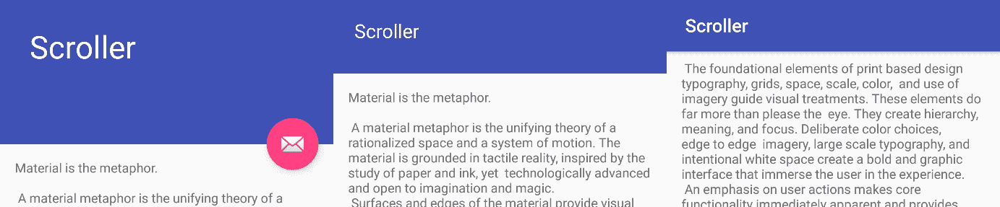
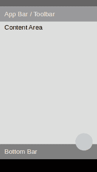
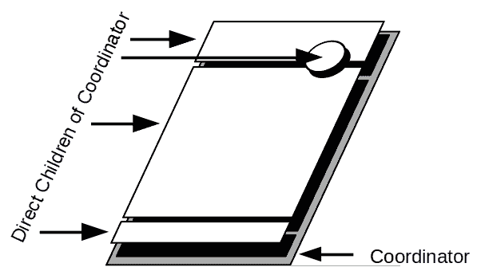
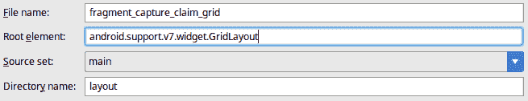
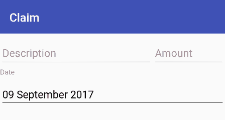
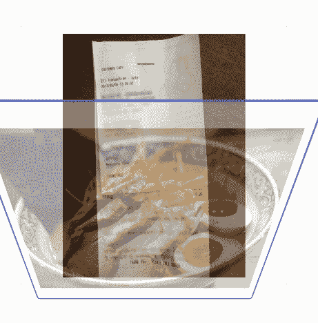

# 第八章：设计材料布局

在设计和创建屏幕布局时，关于如何进行有许多不同的观点。现代布局通常是复杂的系统，它们会根据用户的交互动态地改变形状。在过去，布局往往是相当刚性的结构，只有像窗口或狭缝面板这样的特定区域可以被用户调整。然而，移动应用程序必须更好地利用它们可用的空间，因为它们通常用于物理尺寸较小的设备上。触摸界面的直接交互也改变了用户对应用程序行为的期望；你需要不仅对用户的操作做出反应，还要注意他们的手和手指可能在哪里，因为它们可能会遮挡屏幕的一部分，当他们拖动以滚动应用程序时。

要了解布局如何改变和调整，最简单的方法是使用巨型折叠工具栏。当屏幕打开时，工具栏是全尺寸的，占据足够的空间来容纳各种附加的小部件和信息。当屏幕滚动时，操作按钮消失，工具栏缩小。然后，工具栏将自己固定在屏幕顶部，并仅以标题和可能的一些操作按钮的形式保持可见，如下所示：



这种折叠行为在材料应用程序中很常见——用户界面的各个部分在用户滚动或更改操作时显示或隐藏。这些布局通常同时协调许多不同小部件的移动、调整大小、显示和隐藏，为此有一个特殊的类——`CoordinatorLayout`。

在本章中，我们将探讨`CoordinatorLayout`和其他一些专业的 Android 布局类，以便完成以下任务：

+   创建基于用户操作的动态布局

+   在灵活的网格上创建布局

+   允许用户通过手势执行操作

+   使用高度突出显示一些小部件，使其高于其他小部件

# 查看材料结构

材料布局有一系列模式，应用程序应该遵循每个它们构建的屏幕。这种类型的模板通常被称为**框架**，对于移动设备来说，它看起来是这样的：



框架的重要性在于，尽管它定义了几乎所有屏幕的基本布局，但它并没有定义你应该如何实现这种设计，甚至在 Android 上，你会发现有几种不同的方式来创建具有前述布局结构的屏幕。一些元素也是可选的：底部栏和浮动操作按钮通常被省略，因为它们对屏幕没有帮助。应用栏几乎出现在所有屏幕上，但它可以更大，也可以折叠起来，为用户提供更多阅读空间的内容区域。

还很重要的一点是，默认情况下，平台主题会将 App Bar（由`ActionBar`类呈现）放入一个`Activity`中为你处理；使用`Toolbar`类和`NoActionBar`主题在`Activity`中创建自己的 App Bar 也是常见的。实际上，在第二章，*设计表单屏幕*中，当你创建`CaptureClaimActivity`时，Android Studio 模板正是这样做的：

```java
<activity
    android:name=".CaptureClaimActivity"
    android:label="@string/title_activity_capture_claim"
    android:theme="@style/AppTheme.NoActionBar" />
```

在`CaptureClaimActivity`类中，在`onCreate`方法顶部附近，你可以找到以下代码片段：

```java
Toolbar toolbar = findViewById(R.id.toolbar);
setSupportActionBar(toolbar);
```

这段代码允许你的应用程序完全控制`Toolbar`的外观和包含的小部件。将其设置为`SupportActionBar`会告诉`AppCompatActivity`将任何对`Activity.setTitle`和类似方法的调用委托给`Toolbar`，但不会以任何方式改变`Toolbar`与布局系统的交互方式。现在，这仍然完全在你的控制之下。

# 介绍`CoordinatorLayout`

Android 有一系列布局，旨在协同工作以在用户滚动时实现动态移动效果。这个系列的核心是`CoordinatorLayout`类，它允许将复杂的行为附加到任意数量的浮动兄弟小部件上，这些小部件可以相互依赖并对其位置和大小做出反应。为了说明`CoordinatorLayout`的实际工作原理，请看以下这张图：



尽管看起来`FloatingActionButton`似乎浮在其它小部件之上，但实际上它是`CoordinatorLayout`的直接子元素。它之所以保持在原位，是因为它被锚定在工具栏的底部。如果工具栏改变其大小或位置，`CoordinatorLayout`将会移动`FloatingActionButton`，使其看起来像是附着在工具栏的底部。这些移动都是作为布局过程的一部分一起完成的，从而确保每一帧都是像素完美的，并且所有元素看起来像是一起移动和调整大小。

`CoordinatorLayout`定义了两种主要的操纵子小部件的方式——锚点和行为：

+   **锚点**是这两种方式中较为简单的一种；它只是将一个小部件附着到另一个小部件上。锚点响应`layout_gravity`属性和特殊的`layout_anchorGravity`属性，以确定锚定小部件相对于它所附着的小部件应该出现在哪个位置。

+   **行为**更复杂；它们是完整的类，可以根据其他小部件（称为其**依赖项**）以任何方式操作小部件。几个类定义了自己的行为类，当它们在`CoordinatorLayout`内声明时应该使用。例如，`FloatingActionButton`声明了一个`FloatingActionButton.Behavior`类，当其锚点接近屏幕末端时，将隐藏按钮，并在有足够空间时再次出现。这种显示和隐藏行为甚至伴随着动画。

# 协调概览屏幕

你在第七章，*创建概览屏幕*中构建的概览屏幕是`CoordinatorLayout`的完美候选者。首先，允许概览栏可以折叠，并在用户滚动时展开。这为屏幕上的索赔项提供了更多空间，当他们向上滚动时再次展开概览，用户不需要滚动到顶部以获取概览。

这种行为不仅会使用`CoordinatorLayout`，还需要`AppBarLayout`和`CollapsingToolbarLayout`类的帮助，因为你需要控制 Material Design 脚手架以使其工作。按照以下步骤将允许概览移动到标题栏并使其折叠：

1.  首先，从项目树中的`manifests`文件夹打开`AndroidManifest`文件（使用 Android 视角）。

1.  找到`OverviewActivity`条目并添加一个主题属性，告诉系统不要提供系统`ActionBar`，因为你会添加自己的：

```java
<activity
    android:name=".OverviewActivity"
 android:theme="@style/AppTheme.NoActionBar"
    android:windowSoftInputMode="stateHidden">
    <intent-filter>
        <action android:name="android.intent.action.MAIN" />
        <category android:name="android.intent.category.LAUNCHER" />
    </intent-filter>
</activity>
```

1.  现在，打开`activity_overview`布局文件，切换到文本模式。删除`FrameLayout`及其所有内容；你需要完全重写这个文件。

1.  使用所有标准命名空间和上下文创建`CoordinatorLayout`根元素。请注意，这次你需要告诉系统这个小部件将适应根窗口，而不是作为*内容*：

```java
<android.support.design.widget.CoordinatorLayout 

    android:layout_width="match_parent"
    android:layout_height="match_parent"
 android:fitsSystemWindows="true"
android:id="@+id/scaffolding"
    tools:context="com.packtpub.claim.OverviewActivity">
</android.support.design.widget.CoordinatorLayout>
```

1.  现在，在`CoordinatorLayout`中创建`AppBarLayout`元素；再次提醒系统，`AppBarLayout`应适应系统窗口，不应被视为普通*内容*小部件：

```java
<android.support.design.widget.AppBarLayout
    android:id="@+id/app_bar"
    android:layout_width="match_parent"
 android:layout_height="@dimen/app_bar_height"
android:fitsSystemWindows="true"
    android:theme="@style/AppTheme.AppBarOverlay">
</android.support.design.widget.AppBarLayout>
```

1.  使用`layout_height`的代码辅助功能创建一个名为`app_bar_height`的新维度资源，并分配一个值为`180dp`：

```java
<dimen name="app_bar_height">180dp</dimen>
```

1.  在`AppBarLayout`内部，你需要声明`CollapsingToolbarLayout`。这将处理工具栏和其他小部件的折叠和展开，当用户滚动时。你使用`layout_scrollFlags`来告诉它如何折叠和展开，但重要的是要注意，实际上是`AppBarLayout`负责这些操作，所以`AppBarLayout`的任何子项都可以使用这些标志。在这种情况下，我们将告诉它，当用户滚动查看项目列表时进行折叠，但不要完全退出（消失），当用户开始向上滚动列表时立即重新进入：

```java
<android.support.design.widget.CollapsingToolbarLayout
    android:id="@+id/toolbar_layout"
    android:layout_width="match_parent"
    android:layout_height="match_parent"
    android:fitsSystemWindows="true"
    app:contentScrim="?attr/colorPrimary"
    app:expandedTitleGravity="top"
    app:layout_scrollFlags="scroll|enterAlwaysCollapsed|snap|exitUntilCollapsed"
    app:toolbarId="@+id/toolbar">
</android.support.design.widget.CollapsingToolbarLayout>
```

在前面的代码中，`CollapsingToolbarLayout`将其`contentScrim`声明为`?attr/colorPrimary`。属性`?`语法是与主题一起使用的一种查找类型。它告诉资源系统在主题中查找该属性，而不是直接引用属性。

1.  在`CollapsingToolbarLayout`内部，你需要声明一个`Toolbar`小部件。这个小部件将取代系统`ActionBar`的位置。我们使用`layout_collapseMode`来告诉`CollapsingToolbarLayout`，一旦折叠，就将`Toolbar`固定在屏幕顶部（而不是让它完全消失）：

```java
<android.support.v7.widget.Toolbar
    android:id="@+id/toolbar"
    android:layout_width="match_parent"
    android:layout_height="?attr/actionBarSize"
    app:layout_collapseMode="pin"
    app:popupTheme="@style/AppTheme.PopupOverlay" />
```

1.  在`Toolbar`小部件之后，你可以声明`AllowanceOverviewFragment`；它将使用`parallax`折叠模式，并在用户滚动查看索赔项目列表时消失：

```java
<fragment
    android:id="@+id/overview"
    class="com.packtpub.claim.ui.AllowanceOverviewFragment"
    android:layout_width="match_parent"
    android:layout_height="wrap_content"
    android:layout_gravity="bottom"
    android:layout_marginBottom="@dimen/grid_spacer1"
    app:layout_collapseMode="parallax"
    app:layout_collapseParallaxMultiplier="0.65" />
```

1.  这就完成了你的新`AppBarLayout`结构；现在你需要在`AppBarLayout`之后添加`RecyclerView`，并告诉`CoordinatorLayout`使用`layout_behaviour`属性，它正在滚动内容。这将告诉`CoordinatorLayout`，当`RecyclerView`滚动时，`AppBarLayout`应该对滚动做出反应：

```java
<android.support.v7.widget.RecyclerView
    android:id="@+id/claim_items"
    android:layout_width="match_parent"
    android:layout_height="match_parent"
    android:layout_marginTop="@dimen/grid_spacer1"
    android:clipToPadding="false"
    android:clipChildren="false"
    android:paddingLeft="@dimen/grid_spacer1"
    android:paddingRight="@dimen/grid_spacer1"
    app:layoutManager="android.support.v7.widget.LinearLayoutManager"
    app:layout_behavior="@string/appbar_scrolling_view_behavior" />
```

声明的`RecyclerView`其行为引用了一个名为`appbar_scrolling_view_behavior`的字符串资源，但你没有在`strings.xml`文件中声明这样的资源，所以为什么代码助手没有抱怨？这是一个由`CoordinatorLayout`支持库声明的字符串资源，它在构建过程中合并到你的应用程序资源中。其内容是滚动视图`Behaviour`实现的完整类名（即：）。

1.  在你的`CoordinatorLayout`中的最后一个元素应该是`NewClaimItemFloatingActionButtonFragment`，由于`FloatingActionButton`类的编写方式，它将在`CoordinatorLayout`中自动获得特殊行为：

```java
<fragment
    android:id="@+id/new_claim_item"
    class="com.packtpub.claim.ui.NewClaimItemFloatingActionButtonFragment"
    android:layout_width="wrap_content"
    android:layout_height="wrap_content"
    android:layout_gravity="bottom|end"
    android:layout_margin="@dimen/fab_margin" />
```

`FloatingActionButton`类声明了一个默认的`Behaviour`类，当任何子项被添加到`CoordinatorLayout`中时，`CoordinatorLayout`会查找这个类。这定义了`FloatingActionButton`在屏幕上的位置，以及它应该在何时消失、重新出现，甚至相对于可能出现在屏幕底部的面板（如 snackbars）移动。声明是通过一个公开可访问的注解来完成的：

```java
@CoordinatorLayout.DefaultBehavior(FloatingActionButton.Behavior.class)
public class FloatingActionButton extends VisibilityAwareImageButton {
```

由于您的应用程序的结构，`OverviewActivity` 类不需要修改即可使新布局工作。它仍然会自动用 `ClaimItem` 对象填充 `RecyclerView`，并且片段将通过数据库进行通信。然而，使新的 `Toolbar` 小部件充当 `OverviewActivity` 的 `ActionBar` 是有用的；您可以通过将 `onCreate` 方法更改为调用 `setSupportActionBar` 来实现这一点：

```java
protected void onCreate(final Bundle savedInstanceState) {
    super.onCreate(savedInstanceState);
    setContentView(R.layout.activity_overview);

    setSupportActionBar(findViewById(R.id.toolbar));
    // …
}
```

# 向右滑动删除

虽然您的用户有创建索赔项的方法，但他们没有删除自己创建的索赔项的方法。在移动应用列表中，一个常见的模式是允许用户向右滑动来删除或删除项目。`RecyclerView` 提供了一些优秀且易于使用的结构来启用这种行为；然而，始终确保用户不会意外删除项目是非常重要的。

在过去，大多数用户界面在执行破坏性操作时都会使用确认对话框。然而，这些“你确定吗”对话框对大多数用户来说都是一种糟糕的干扰，因为这些消息违反了一个关键原则——应用程序假设用户可能不想执行他们刚刚采取的操作。实际上，用户可能确实打算删除该项目，但应用程序会打断他们，询问他们是否确定自己的选择。更好的行为是假设用户确实想要采取行动，但如果他们犯了错误，则提供一种撤销操作的方法。Material Design 有一个专门针对此类任务的设计模式和控件——`Snackbar`。

在 Material Design 术语中，`Snackbar` 是一个可以出现在屏幕底部的小栏，向用户提供信息以及基于所提供信息的可能操作。最常见的用法是在删除某物时，用户有机会撤销删除。撤销操作可能看起来很复杂，但如果正确地封装在 `Command` 类中，实际上执行起来非常简单。按照以下步骤向旅行索赔应用程序添加向右滑动删除操作和撤销选项：

1.  打开 ui 包中的 `DataBoundViewHolder` 类。

1.  您的新类将需要一个简单的方法来访问 `DataBoundViewHolder` 中的项目，但 `ViewDataBinding` 并没有提供 `getVariable` 方法，因此您需要将其保存在类字段中并提供一个获取方法：

```java
private I item;
public I getItem() { return item; }
```

1.  您还需要修改 `setItem` 方法以捕获此字段：

```java
public void setItem(final I item) {
    this.item = item;
    binding.setVariable(BR.item, item);
}
```

1.  在 Android Studio 中打开 `OverviewActivity` 的源文件。

1.  在 `OverviewActivity` 类的底部，您需要声明一个新的 `ActionCommand` 类，该类将封装删除操作和撤销操作。与大多数其他 `ActionCommand` 类不同，这个类是不可重用的，并且不接受任何参数：

```java
class DeleteClaimItemCommand
        extends ActionCommand<Void, Void>
        implements View.OnClickListener {
}
```

1.  新的 `DeleteClaimItemCommand` 类需要一个对 `ClaimDatabase` 的引用，并且还将有一个 `ClaimItem` 字段，它将删除并可选地恢复：

```java
private final ClaimDatabase database = ClaimApplication.getClaimDatabase();
private final ClaimItem item;
public DeleteClaimItemCommand(final ClaimItem item) {
    this.item = item;
}
```

1.  `onBackground` 的实现将从数据库中删除 `ClaimItem` 对象，但 `DeleteClaimItemCommand` 会保留对内存中实现的引用，如果用户决定恢复它：

```java
public Void onBackground(final Void noArgs) {
    database.claimItemDao().delete(item);
    return null;
}
```

此代码不会删除与 `ClaimItem` 相关的 `Attachments`，这会导致应用程序泄漏附件文件和数据库行。在实际应用中，你还希望确保附件也被清理，就像对 `ClaimItem` 使用的行为一样，但这超出了本例的范围。

1.  `onForeground` 的实现需要显示一个 `Snackbar` 通知，告诉用户项目已被删除；为此，你需要一个可本地化的消息。`Context` 类提供了一个方便的 `getString` 方法，它将从应用程序资源生成格式化的字符串：

```java
final String message = getString(
        R.string.msg_claim_item_deleted,
        item.getDescription());
```

1.  使用代码辅助功能创建一个名为 `msg_claim_item_deleted` 的新字符串资源：

```java
<string name="msg_claim_item_deleted">%s Deleted</string>
```

这些字符串遵循 `java.util.Formatter` 或 `String.format` 中定义的格式化规则，允许你创建相对复杂的格式化规则。通过为不同语言和格式提供不同的 `strings.xml` 文件，你可以非常容易地本地化应用程序中的大多数字符串。

1.  在 `onForeground` 方法中，你需要获取 `CoordinatorLayout` 的引用作为 `Snackbar` 的基础：

```java
final View scaffolding = findViewById(R.id.scaffolding);
```

1.  然后，创建 `Snackbar` 对象，指定其撤销动作文本，并使用 `DeleteClaimItemCommand` 作为动作处理程序（`OnClickListener`）：

```java
Snackbar.make(scaffolding, message, Snackbar.LENGTH_LONG)
        .setAction(R.string.undo, this)
        .show();
```

1.  使用代码辅助功能在 `R.string.undo` 引用上创建一个新的字符串资源，用于 `undo` 动作的文本：

```java
<string name="undo">Undo</string>
```

1.  如果用户点击撤销动作，将调用 `DeleteClaimItemCommands` 和 `onClick` 方法。然后，它可以使用其缓存的已删除 `ClaimItem` 引用将其恢复到数据库中：

```java
public void onClick(final View view) {
    AsyncTask.SERIAL_EXECUTOR.execute(database.createClaimItemTask(item));
}
```

1.  作为 `OverviewActivity` 的另一个内部类，你需要一个类来提供对 *滑动删除* 行为的动作定义和处理。这个新类将扩展 `ItemTouchHelper` 类中的 `SimpleCallback` 类，该类提供了对移动手势识别的处理：

```java
private class SwipeToDeleteCallback extends ItemTouchHelper.SimpleCallback {
}
```

1.  `SimpleCallback` 构造函数接受两套以 `int` 值形式表示的“标志”。这些标志实际上是一系列可以二进制“或”操作（使用 `|` 操作符）的数字。这些定义了允许和管理不同手势。其中第一个是用于不同类型的“移动”手势的标志，这些手势可以用来重新排列 `RecyclerView` 中的项目（将此设置为零表示不应识别任何移动手势）。第二个标志的参数是用于“滑动”手势的，这是我们在这里感兴趣的内容：

```java
SwipeToDeleteCallback() {
    super(0, ItemTouchHelper.RIGHT);
}
```

1.  `SimpleCallback`类要求你声明用于移动和滑动的处理方法，即使该类不会处理移动手势。你需要声明`onMove`，但该类可以简单地返回`false`作为其实现：

```java
public boolean onMove(
        final RecyclerView recyclerView,
        final RecyclerView.ViewHolder viewHolder,
        final RecyclerView.ViewHolder target) {

    return false;
}
```

1.  接下来，你可以定义`onSwipe`方法的实现，这将创建一个`DeleteClaimItemCommand`并执行它：

```java
public void onSwiped(
        final RecyclerView.ViewHolder viewHolder,
        final int direction) {

    final DataBoundViewHolder<?, ClaimItem> holder
           = (DataBoundViewHolder<?, ClaimItem>) viewHolder;
    new DeleteClaimItemCommand(holder.getItem()).exec(null);
}
```

1.  现在，要将`SwipeToDeleteCallback`附加到`RecyclerView`上，你需要使用`ItemTouchHelper`类将其包装，并在`onCreate`方法的底部将其附加到你的`RecyclerView`实例上：

```java
final RecyclerView claimItems = findViewById(R.id.claim_items);
    claimItems.setAdapter(new ClaimItemAdapter(
            this, this,
            ClaimApplication.getClaimDatabase().claimItemDao().selectAll()
    ));

    new ItemTouchHelper(new SwipeToDeleteCallback())
 .attachToRecyclerView(claimItems);
}
```

# 提升小部件

在屏幕上突出显示一个小部件而不是其他小部件的一个很好的方法是让它出现在其他小部件之上，不是二维的，而是像在三维空间中一样浮在它们之上。如果你查看`FloatingActionButton`类，这已经是一个清晰的模式；它们不仅仅重叠其他小部件，而且它们有阴影，看起来像在空间中浮动（因此类名为`FloatingActionButton`）。

Android 小部件库中的伟大功能之一是`View`类定义了海拔的概念，这使得它可以通过工具包中的每个小部件使用。小部件的海拔不会影响其二维位置或大小，但它会导致它产生一个阴影，该阴影将正确着色，就像小部件在三维空间中浮动一样。这可以在你需要吸引对消息的注意，或者当用户在屏幕上重新定位小部件时（例如，重新组织提醒列表）时创建惊人的效果。鉴于大多数 Material Design 用户界面都是平面的，添加三维海拔可以立即让小部件在用户面前脱颖而出。

与`CardView`小部件的边框和阴影类似，当你使用海拔时，你需要确保阴影不会被父小部件或填充属性裁剪。使用`clipChildren`和`clipToPadding`属性来控制这一点。

按照以下步骤向滑动删除行为回调添加海拔效果：

1.  打开`OverviewActivity`并找到`SwipeToDeleteCallback`内部类。

1.  如果用户在拾起项目后“放下”项目以删除它，则该类需要能够重置海拔。为此，`SwipeToDeleteCallback`类需要一个具有默认卡片海拔的字段：

```java
final float defaultElevation = 
        getResources().getDimensionPixelSize(R.dimen.cardview_default_elevation);
```

1.  每次在`RecyclerView`的子项被拾起后绘制，`ItemTouchHelper`允许你覆盖绘制行为。在你的情况下，你想要根据用户拖动的距离调整卡片相对于右侧的海拔。为了在旧版本的 Android 上工作，此代码使用`ViewCompat`类来更改海拔：

```java
public void onChildDraw(
        final Canvas c,
        final RecyclerView recyclerView,
        final RecyclerView.ViewHolder viewHolder,
        final float dX, final float dY,
        final int actionState,
        final boolean isCurrentlyActive) {

    if (isCurrentlyActive) {
        ViewCompat.setElevation(
 viewHolder.itemView,
 Math.min(
 Math.max(dX / 4f, defaultElevation),
 defaultElevation * 16f
 )
 );
    }

    super.onChildDraw(c, recyclerView, viewHolder, dX, dY, actionState, isCurrentlyActive);
}
```

1.  一旦用户释放卡片，我们需要通过将其重置为默认值来清除海拔值；当用户放下一个项目时，`ItemTouchHelper`将调用`clearView`回调：

```java
public void clearView(
        final RecyclerView recyclerView,
        final RecyclerView.ViewHolder viewHolder) {
    ViewCompat.setElevation(viewHolder.itemView, defaultElevation);
    super.clearView(recyclerView, viewHolder);
}
```

一旦实现了这种行为，用户在滑动删除手势时将收到二级视觉反馈，因为当他们将卡片向右拖动时，卡片看起来会升到其他卡片之上。如果他们再次将卡片向左拖动，它也会反向动作，看起来会下降回到正常的高度。这种高度反馈在用户可以改变列表中卡片位置的用户界面（例如，待办事项列表）上会更加有用。注意，随着卡片高度的增加，它会在其下方和上方的卡片上投下阴影：


# 使用网格构建布局

当构建屏幕时，通常希望特定的部件与其它部件具有相同的大小和形状。这通常是通过使用灵活的网格模型来实现布局的。通过将屏幕划分为若干个单元格，并让每个部件占据一个或多个单元格，你可以创建非常复杂的布局，这些布局可以扩展到任何屏幕大小。然而，当面对`ConstraintLayout`时，这种传统模型就显得完全过时了，因为`ConstraintLayout`能够在不使用网格的情况下维护部件之间的复杂关系。

在大多数情况下，`ConstraintLayout`应该能够管理你选择的任何复杂布局，并且会比网格/表格布局管理器更加灵活。与基于网格的布局引擎不同，`ConstraintLayout`在处理基于字体大小或图像大小的部件时更加灵活，这些图像的大小取决于物理屏幕大小和像素密度。虽然`GridLayout`会调整单元格的大小以适应这些部件，但它们仍然受限于网格线。

然而，时不时地，你可能需要基于网格单元格构建布局。对于这种情况，你将希望使用`GridLayout`类。`GridLayout`允许你基于一个不可见的网格定义布局，其中每个部件可以占据一个或多个单元格，每一行和每一列的大小都是灵活的；也就是说，每一列可以有不同的宽度，每一行可以有不同的高度。重要的是要记住，`GridLayout`并不适用于显示大量数据的大表格，而是用于布局那些偏好网格结构的屏幕。如果你需要向用户展示一个可滚动的网格（例如，图标图像的网格），那么更好的模型是使用带有`GridLayoutManager`的`RecyclerView`，因为它可以扩展到几乎任何数量的子组件。

在 Android 中，`GridLayout`有两种不同的实现：一种是在平台核心 API 中，另一种是在支持 v7 API 中。出于兼容性的原因，通常最好使用支持包中的类，因为它包括了最近添加的许多可能不在平台实现中出现的特性。

为了探索`GridLayout`，让我们看看您将如何使用`GridLayout`而不是`ConstraintLayout`来实现*捕获索赔详情*卡片：

1.  首先，您需要将`GridLayout`实现添加到您的项目中。在项目树中打开 Gradle 脚本，并打开 app 模块的 build.gradle 文件（使用 Android 视角）。

1.  在依赖项列表中，添加对 grid-layout 模块的依赖项：

```java
implementation 'com.android.support:appcompat-v7:26.0.0'
implementation 'com.android.support:gridlayout-v7:26.0.0'
```

末尾的版本号（在本例中为`26.0.0`）必须与您的应用程序引用的`appcompat`模块的版本号完全匹配。如果这些版本不匹配，可能会导致不稳定，在某些情况下，甚至无法编译应用程序。在继续下一步之前，将版本号更改为与您的`build.gradle`中声明的`appcompat`引用上的版本号相匹配。

1.  保存文件，并使用编辑器顶部的 Sync Now 链接同步项目。

1.  在项目文件树中，右键单击 res | layout 目录，然后选择 New | Layout resource file。

1.  将新文件命名为`fragment_capture_claim_grid`。

1.  将根元素更改为`android.support.v7.widget.GridLayout`：



1.  切换到文本模式编辑器。

1.  由于您正在使用`GridLayout`的支持库实现，XML 属性中的许多将位于`app`命名空间而不是平台（`android`）命名空间中。您需要将`app`命名空间添加到`GridLayout`声明中：

```java
<android.support.v7.widget.GridLayout

    android:layout_width="match_parent"
    android:layout_height="match_parent">
</android.support.v7.widget.GridLayout>
```

**9.  `GridLayout`默认设置了许多布局属性，并默认假设每个子元素都在单元格中，跟随其前面的单元格（从左上角的单元格开始）。它允许您指定`columnWeight`和`rowWeight`属性来定义每个单元格应占用多少可用空间。声明一个`TextInputLayout`来占用 70%的可用空间：**

```java
<android.support.design.widget.TextInputLayout app:layout_columnWeight="0.7">
    <android.support.design.widget.TextInputEditText
        android:id="@+id/description"
        android:layout_width="match_parent"
        android:layout_height="wrap_content"
        android:hint="@string/label_description" />
</android.support.design.widget.TextInputLayout>
```

前面的`TextInputLayout`小部件仅占用`GridLayout`中的一个单元格，但该单元格已被告知在渲染时占用 70%的可用水平空间。

1.  接下来，声明`TextInputLayout`的数量；这将仅占用单个单元格，但我们希望它占用剩余的 30%水平空间：

```java
<android.support.design.widget.TextInputLayout app:layout_columnWeight="0.3">
    <android.support.design.widget.TextInputEditText
        android:id="@+id/amount"
        android:layout_width="match_parent"
        android:layout_height="wrap_content"
        android:hint="@string/label_amount" />
</android.support.design.widget.TextInputLayout>
```

1.  现在，我们想要声明一个`DatePickerLayout`供用户选择日期，但我们需要告诉`GridLayout`将其放在下一行。您可以使用`row`和`column`属性来完成此操作。此小部件还需要占用`GridLayout`的整个宽度，这意味着它需要占用两个列，这是通过使用`columnSpan`属性来完成的：

```java
<com.packtput.claim.widget.DatePickerLayout
    android:id="@+id/date"
    app:layout_row="1"
 app:layout_column="0"
 app:layout_columnSpan="2"
 app:layout_gravity="fill_horizontal" />
```

如果你查看设计视图，你会注意到这个布局几乎与你写在第二章，“设计表单屏幕”，中捕获索赔的那个布局一模一样。最大的区别是，`ConstraintLayout`为金额使用了一个固定的最小尺寸，而此布局通过操作网格单元的权重使用相对尺寸。生成的布局应该看起来像这样：



# 栈视图

有时候，能够只显示一次一个项目的同时显示长列表的项目是有用的，例如，`ClaimItem`的附件列表。在这种情况下，你可以使用你之前已经使用过的侧向`ViewPager`，但还有一个选项——`StackView`。`StackView`类将其内容呈现为三维卡片堆叠，其中“顶部”卡片完全可见，而一些卡片“在其后面”，如下所示：



这通常是一个非常有用的模式，因为它为用户提供足够的屏幕空间来查看顶部项目，同时也能看到还有其他可以查看的项目。这使得它非常适合显示照片或大型数据卡片。这与你在设备上点击“最近应用”按钮时 Android 显示正在运行的应用程序列表的方式非常相似。

`StackView`是一个经典的`Adapter`视图，它使用与`ListView`或`GridView`相同的`Adapter`实现。如果做得正确，你可以编写可以在这些类中使用的代码；按照以下步骤构建一个简单的`StackView`和`Adapter`实现，以便以不同的方式预览`附件`：

1.  在项目树中右键单击`ui.attachments`包，然后选择“新建| Java 类”。

1.  将新类命名为`AttachmentListAdapter`。

1.  将超类改为`android.widget.BaseAdapter`。

1.  点击“确定”以创建新类。

1.  在新的`AttachmentListAdapter`类中，声明一个用于向用户呈现的`Attachment`对象`List`：

```java
private List<Attachment> attachments = Collections.emptyList();
```

1.  创建一个构造函数来观察`LiveData`并分配附件的`List`，并在事情发生变化时通知`StackView`：

```java
public AttachmentListAdapter(
        final LifecycleOwner lifecycleOwner,
        final LiveData<List<Attachment>> attachments) {

    attachments.observe(lifecycleOwner, new Observer<List<Attachment>>() {
        @Override
        public void onChanged(final List<Attachment> attachments) {
            AttachmentListAdapter.this.attachments =
                    attachments != null
                            ? attachments
                            : Collections.<Attachment>emptyList();
            notifyDataSetChanged();
        }
    });
}
```

1.  与`RecyclerView.Adapter`实现类似，`BaseAdapter`需要一个方法来访问它预期呈现的项目数量：

```java
public int getCount() { return attachments.size(); }
```

1.  然而，与`RecyclerView.Adapter`实现不同，`BaseAdapter`预期直接暴露底层数据。它还必须暴露每个数据元素的唯一 ID：

```java
public Object getItem(final int i) { return attachments.get(i); }
public long getItemId(final int i) { return attachments.get(i).id; }
```

1.  此外，与`RecyclerView.Adapter`不同，创建和重用现有视图项以及将数据绑定到它们的方法只有一个。在此方法中，第二个参数可以是`null`，也可以是一个期望被回收的现有视图：

```java
public View getView(
        final int i,
        final View view,
        final ViewGroup viewGroup) {

    AttachmentPreview preview = (AttachmentPreview) view;
    if (preview == null) {
        preview = new AttachmentPreview(viewGroup.getContext());
    }

    preview.setAttachment(attachments.get(i));

    return preview;
}
```

1.  要从布局 XML 文件中使用`StackView`，你只需像声明`RecyclerView`或`ViewPager`一样声明`StackView`：

```java
<StackView
    android:id="@+id/attachments"
    android:layout_width="match_parent"
    android:layout_height="match_parent" />
```

1.  然后，从封装的 `Activity` 或 `Fragment` 中，您需要设置其 `Adapter`。与 `RecyclerView` 类似，`Adapter` 也可以从数据绑定布局中指定。以下是在 `Activity` 中的代码示例：

```java
final StackView attachments = findViewById(R.id.attachments);
attachments.setAdapter(new AttachmentListAdapter(
        this,
        database.attachmentDao().selectForClaimItemId(claimItem.id)
));
```

`StackView` 类是向用户展示大量更大、更视觉化的项目的一种极好方式。它非常适合浏览照片或预览图形，并提供易于使用的三维变换。在使用 `StackView` 之前，您应该始终考虑用户是否需要同时查看多个项目中的数据。有时，最好将 `RecyclerView` 作为“概览”与 `StackView` 结合使用，以查看单个项目。

# 测试你的知识

1.  应该使用提升（Elevation）来做什么？

    +   当用户在列表中选择一个项目时

    +   为了选择性地突出显示平铺布局上方的单个项目

    +   当用户滑动删除项目时

1.  `CoordinatorLayout` 可以用来协调以下哪些之间的移动和大小？

    +   嵌套在 `AppBarLayout` 中的组件

    +   任何其直接子小部件

    +   在不同活动中的 `Fragment`

1.  要以向后兼容的方式更改小部件的提升，您需要执行以下提到的哪些操作？

    +   将小部件嵌套在 `CardView` 中

    +   使用 `ViewCompat` 类

    +   使用 Java 反射来调用 `setElevation`

1.  在以下哪种情况下应使用 `GridLayout` 类？

    +   当 `ConstraintLayout` 不可用时

    +   显示大量数据表格

    +   沿着网格线排列屏幕

# 摘要

掌握通常属于系统装饰的应用程序提供了巨大的额外灵活性和功能。通过使用 `CoordinatorLayout` 来托管屏幕的框架和内容，您通过允许小部件在动画过程中动态交互进一步扩展了您的灵活性。这为您提供了以最少的额外工作制作像素完美屏幕的方法。

使用不仅可以动态改变形状，还可以使用如滑动删除等手势来改变内容的布局，以进一步增强触摸屏用户界面的直接操作方面。同时，始终考虑用户的交互和何时中断它们，尤其是在破坏性行动周围非常重要。虽然有时您可能仍然想使用确认对话框，但通常更好的方法是给用户提供一种撤销操作的方法。通常，将已删除的实体对象保留在内存中，直到 `Snackbar` 消失并从内存中释放，这是一个非常简单的事情。实际上，从 Room 中插入您已删除的实体将保持它们的 ID，这意味着它们的行将恢复到删除之前的状态。

在下一章中，我们将探讨 Android 应用程序中的导航，并了解为用户导航应用程序提供的各种用户界面功能。我们还将研究一些允许您更好地控制应用程序导航流程的技术。提供一致且高质量的导航对用户体验有着巨大的影响。**
