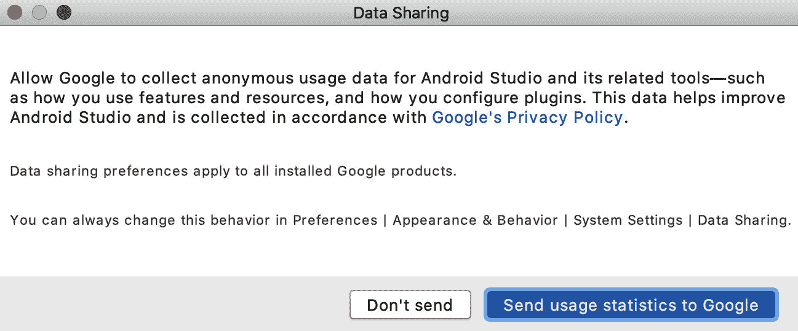
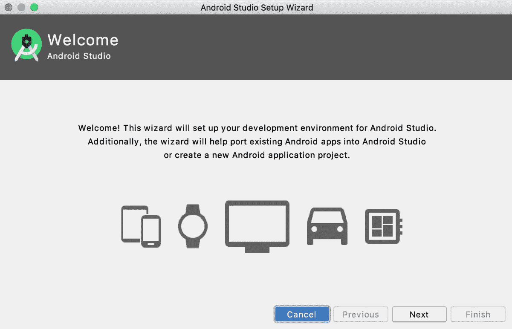
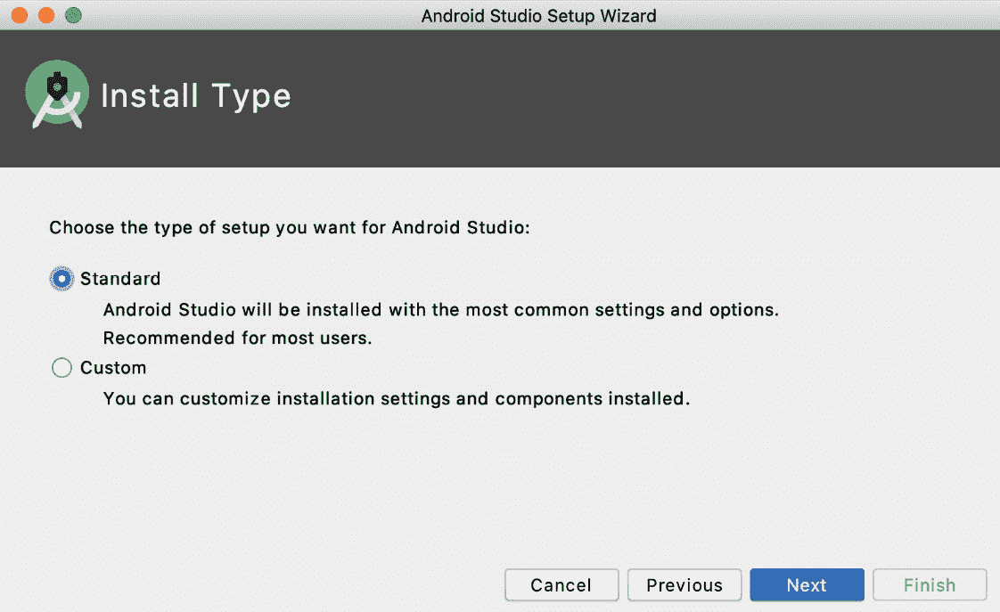
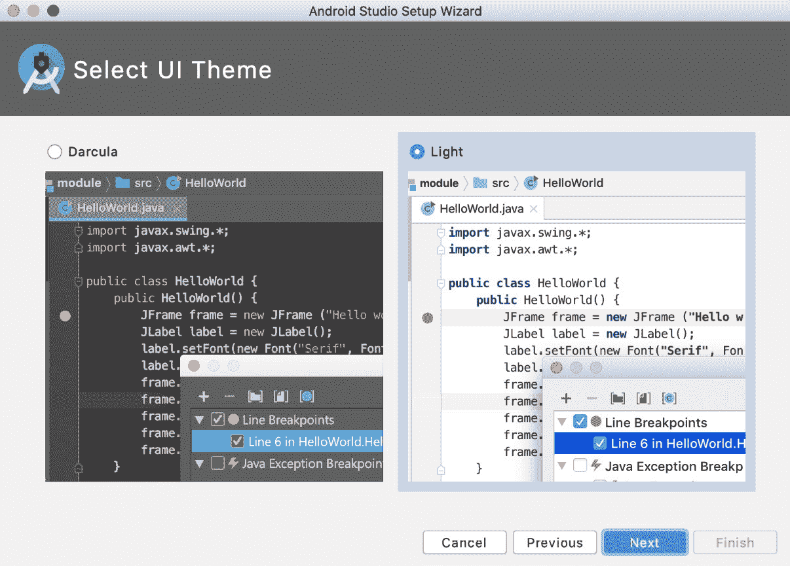
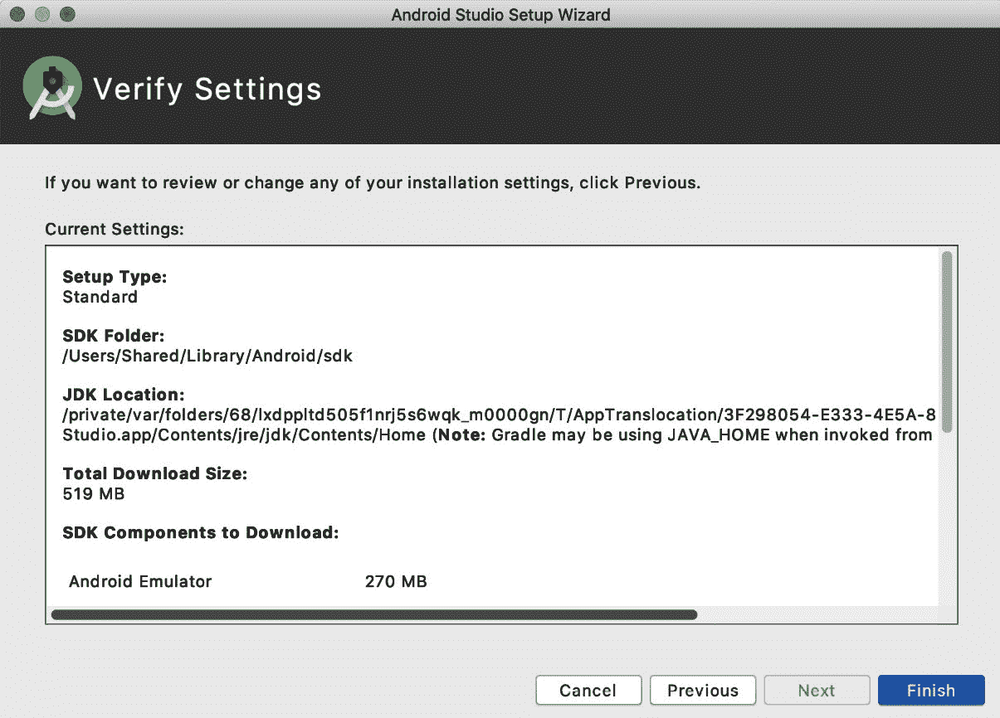

# 前言

过去十年中，Android 已经统治了应用市场，开发者们越来越倾向于开始构建自己的 Android 应用。*如何使用 Kotlin 构建 Android 应用* 从 Android 开发的构建块开始，教你如何使用 Android Studio，这是 Android 的**集成开发环境**（**IDE**），以及使用 Kotlin 编程语言进行应用开发。

然后，你将通过指导练习学习如何创建应用并在虚拟设备上运行它们。你将涵盖 Android 开发的 fundamentals，从构建应用的结构到使用活动、片段和各种导航模式构建 UI。随着章节的推进，你将深入研究 Android 的 RecyclerView，以充分利用显示数据列表，并熟悉从网络服务获取数据和处理图像。

然后，你将了解映射、位置服务和权限模型，在处理通知和如何持久化数据之前。接下来，你将使用 Jetpack Compose 构建用户界面。继续前进，你将掌握测试，涵盖测试金字塔的全面范围。你还将学习如何使用 **Android 架构组件**（**AAC**）来干净地组织你的代码，并探索各种架构模式和依赖注入的好处。

对于异步编程，将涵盖协程和 Flow API。然后，焦点回到 UI 上，演示如何在用户与你的应用交互时添加运动和过渡效果。接近尾声时，你将构建一个有趣的应用，从电影数据库检索并显示流行电影，然后了解如何将你的应用发布到 Google Play。

到这本书的结尾，你将拥有使用 Kotlin 构建完整 Android 应用所需的技术和信心。

# 这本书面向谁

如果你想要使用 Kotlin 构建自己的 Android 应用，但又不确定如何开始，那么这本书就是为你准备的。对 Kotlin 编程语言的基本理解将帮助你更快地掌握本书涵盖的主题。

# 这本书涵盖的内容

*第一章*，*创建你的第一个应用*，展示了如何使用 Android Studio 构建你的第一个 Android 应用。在这里，你将创建一个 Android Studio 项目，了解其构成，并探索在虚拟设备上构建和部署应用所需的工具。你还将了解 Android 应用的结构。

*第二章*，*构建用户界面流程*，深入探讨了 Android 生态系统和 Android 应用的构建块。将介绍活动及其生命周期、意图和任务等概念，以及恢复状态和在不同屏幕或活动之间传递数据。

*第三章*, *使用 Fragment 开发 UI*，教授您使用 Fragment 为 Android 应用程序的用户界面奠定基础。您将学习如何以多种方式使用 Fragment 来构建适用于手机和平板电脑的应用布局，包括使用 Jetpack Navigation 组件。

*第四章*, *构建应用导航*，介绍了应用中不同类型的导航。您将了解具有滑动布局的导航抽屉、底部导航和标签导航。

*第五章*, *核心库：Retrofit、Moshi 和 Glide*，为您揭示了如何使用 Retrofit 库和 Moshi 库将数据转换为 Kotlin 对象，从而构建从远程数据源获取数据的 App。您还将了解 Glide 库，它可以将远程图片加载到您的应用中。

*第六章*, *添加和与 RecyclerView 交互*，介绍了使用 RecyclerView 小部件构建列表并显示的概念。

*第七章*，*Android 权限和 Google Maps*，介绍了权限的概念以及如何从用户那里请求权限，以便您的应用执行特定任务，同时还将介绍 Maps API。

*第八章*, *服务、WorkManager 和通知*，详细介绍了 Android 应用中的后台工作概念以及如何以对用户不可见的方式执行某些任务，同时还将介绍如何显示此类工作的通知。

*第九章*, *使用 Jetpack Compose 构建用户界面*，展示了 Jetpack Compose 的工作原理，如何应用样式和主题，以及如何在具有布局文件的项目中使用 Jetpack Compose。

*第十章*, *使用 JUnit、Mockito 和 Espresso 进行单元测试和集成测试*，教授您关于 Android 应用程序的不同类型测试，每种测试类型使用的框架，以及测试驱动开发的概念。

*第十一章*, *Android 架构组件*，为您揭示了 Android Jetpack 库中的组件，如 ViewModel，它有助于将业务逻辑与用户界面代码分离。然后我们将探讨如何使用可观察的数据流，如 LiveData，将数据传递到用户界面。最后，我们将分析 Room 库，了解如何持久化数据。

*第十二章*, *数据持久化*，展示了在设备上存储数据的各种方法，从 SharedPreferences 到文件。还将介绍 Repository 概念，让您了解如何以不同层次结构构建您的应用。

*第十三章*，*使用 Dagger、Hilt 和 Koin 进行依赖注入*，解释了依赖注入的概念及其为应用程序提供的优势。Dagger、Hilt 和 Koin 等框架被介绍来帮助你管理依赖项。

*第十四章*，*协程和 Flow*，向你介绍如何使用协程和 Flow 进行后台操作和数据操作。你还将了解如何使用 Flow 运算符和 LiveData 转换来操作和显示数据。

*第十五章*，*架构模式*，解释了你可以用它来结构化你的 Android 项目，将它们分离成具有不同功能的独立组件的架构模式。这些模式使你更容易开发、测试和维护你的代码。

*第十六章*，*使用 CoordinatorLayout 和 MotionLayout 进行动画和过渡*，讨论了如何使用`CoordinatorLayout`和`MotionLayout`增强你的应用，添加动画和过渡效果。

*第十七章*，*在 Google Play 上发布你的应用*，通过向你展示如何在 Google Play 上发布你的应用来结束这本书：从准备发布到创建 Google Play 开发者账户，最后发布你的应用。

# 为了充分利用这本书

每一段伟大的旅程都始于一个谦卑的步伐。在我们能够在 Android 中做些惊人的事情之前，我们需要准备好一个高效的环境。在本节中，我们将了解如何做到这一点。

## 最小硬件要求

为了获得最佳的学习体验，我们推荐以下硬件配置：

+   **处理器**：英特尔酷睿 i5 或同等或更高

+   **内存**：8 GB 或更多 RAM

+   **存储**：至少 8 GB 可用空间

## 软件要求

你还需要提前安装以下软件：

+   **操作系统**：64 位 Windows 8/10/11、macOS 或 64 位 Linux

+   Android Studio Electric Eel 或更高版本

## 安装和设置

在开始这本书之前，你需要安装 Android Studio Electric Eel（或更高版本），这是你将在本章中使用到的软件。你可以从 https://developer.android.com/studio 下载 Android Studio。

在 macOS 上，启动 DMG 文件，将 Android Studio 拖放到`Applications`文件夹中。完成此操作后，打开 Android Studio。在 Windows 上，启动 EXE 文件。如果你使用 Linux，将 ZIP 文件解压到你的首选位置。打开你的终端，导航到`android-studio/bin/`目录并执行`studio.sh`。

接下来，将弹出**数据共享**对话框；点击**将使用统计信息发送给 Google**按钮或**不发送**按钮以禁用向 Google 发送匿名使用数据：



数据共享对话框

在**欢迎**对话框中，点击**下一步**按钮开始设置：



欢迎对话框

在**安装类型**对话框中，选择**标准**以安装推荐设置。然后，点击**下一步**按钮：



**安装类型**对话框

在**选择 UI 主题**对话框中，选择您喜欢的 IDE 主题——无论是**浅色**还是**Darcula**（深色主题）——然后点击**下一步**按钮：



**选择 UI 主题**对话框

在**验证设置**对话框中，检查您的设置，然后点击**完成**按钮。设置向导将下载并安装额外的组件，包括 Android SDK：



**验证设置**对话框

下载完成后，您可以点击**完成**按钮。现在您已准备好创建您的 Android 项目。

**如果您使用的是本书的数字版，我们建议您自己输入代码或从本书的 GitHub 仓库（下一节中提供链接）获取代码。这样做将帮助您避免与代码复制和粘贴相关的任何潜在错误。**

# 下载示例代码文件

您可以从 GitHub 下载本书的示例代码文件：[`github.com/PacktPublishing/How-to-Build-Android-Apps-with-Kotlin-Second-Edition`](https://github.com/PacktPublishing/How-to-Build-Android-Apps-with-Kotlin-Second-Edition)。如果代码有更新，它将在 GitHub 仓库中更新。

我们还有其他来自我们丰富图书和视频目录的代码包，可在 [`github.com/PacktPublishing/`](https://github.com/PacktPublishing/) 获取。查看它们！

# 下载彩色图像

我们还提供包含本书中使用的截图和图表的彩色图像的 PDF 文件。您可以从这里下载：[`packt.link/vnOCn`](https://packt.link/vnOCn)。

# 使用的约定

本书使用了多种文本约定。

`文本中的代码`：表示文本中的代码单词、数据库表名、文件夹名、文件名、文件扩展名、路径名、虚拟 URL、用户输入和推特用户名。以下是一个示例：“您可以在主项目窗口下的`MyApplication` | `app` | `src` | `main`中找到它。”

代码块设置如下：

```swift
<resources>
    <string name="app_name">My Application</string>
</resources>
```

当我们希望您注意代码块中的特定部分时，相关的行或项目将以粗体显示：

```swift
<?xml version="1.0" encoding="utf-8"?>
<resources>
    <string name="app_name">My Application</string>
    <string name="first_name_text">First name:</string>
    <string name="last_name_text">Last name:</string>
</resources>
```

**粗体**：表示新术语、重要单词或您在屏幕上看到的单词。例如，菜单或对话框中的单词以粗体显示。以下是一个示例：“点击**完成**，您的虚拟设备将被创建。”

小贴士或重要提示

看起来像这样。

# 联系我们

我们欢迎读者的反馈。

**一般反馈**：如果您对本书的任何方面有疑问，请通过电子邮件发送至 customercare@packtpub.com，并在邮件主题中提及书名。

**勘误表**：尽管我们已经尽最大努力确保内容的准确性，但错误仍然可能发生。如果您在此书中发现错误，我们将不胜感激，如果您能向我们报告，我们将不胜感激。请访问[www.packtpub.com/support/errata](http://www.packtpub.com/support/errata)并填写表格。

`copyright@packt.com`并附上材料的链接。

**如果你有兴趣成为作者**：如果您在某个领域有专业知识，并且您有兴趣撰写或为书籍做出贡献，请访问[authors.packtpub.com](http://authors.packtpub.com)。

# 分享你的想法

一旦你阅读了《如何使用 Kotlin 构建 Android 应用（第 2 版）》，我们很乐意听听你的想法！请选择[`www.amazon.in/review/create-review/error?asin=1837634939`](https://www.amazon.in/review/create-review/error?asin=1837634939)为此书提供反馈。

你的评论对我们和科技社区非常重要，并将帮助我们确保我们提供高质量的内容。

# 下载此书的免费 PDF 副本

感谢您购买此书！

你喜欢在路上阅读，但无法携带你的印刷书籍到处走吗？

你的电子书购买是否与您选择的设备不兼容？

别担心，现在，随着每本 Packt 书籍，您都可以免费获得该书的 DRM 免费 PDF 版本。

在任何地方、任何地方、任何设备上阅读。从您最喜欢的技术书籍中直接搜索、复制和粘贴代码到您的应用程序中。

优惠不会就此结束，您还可以获得独家折扣、时事通讯和每日收件箱中的精彩免费内容。

按照以下简单步骤获取福利：

1.  扫描二维码或访问以下链接


[`packt.link/free-ebook/9781837634934`](https://packt.link/free-ebook/9781837634934)

1.  提交你的购买证明

1.  就这样！我们将直接将免费 PDF 和其他福利发送到您的电子邮件。

# 第一部分：Android 基础

这一部分首先向用户介绍 Android Studio，这是用于 Android 开发的**集成开发环境**（**IDE**），然后引导他们了解 Android 开发的构建块。这是一个对 Android 框架的全面概述，通过指导练习来强化学习目标，以便保留这些知识。

在本节中，我们将涵盖以下章节：

+   *第一章*, *创建你的第一个应用*

+   *第二章*, *构建用户屏幕流程*

+   *第三章*, *使用片段开发 UI*

+   *第四章*, *构建应用导航*
