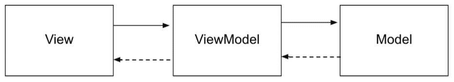
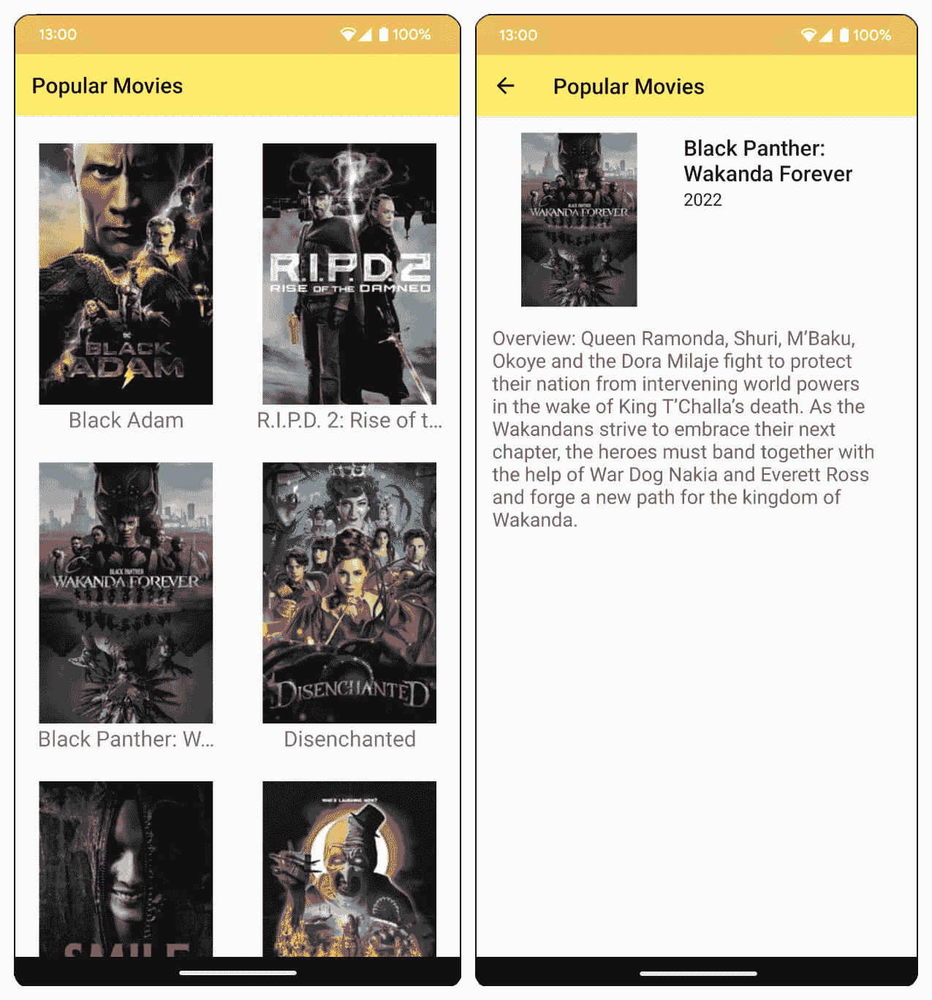
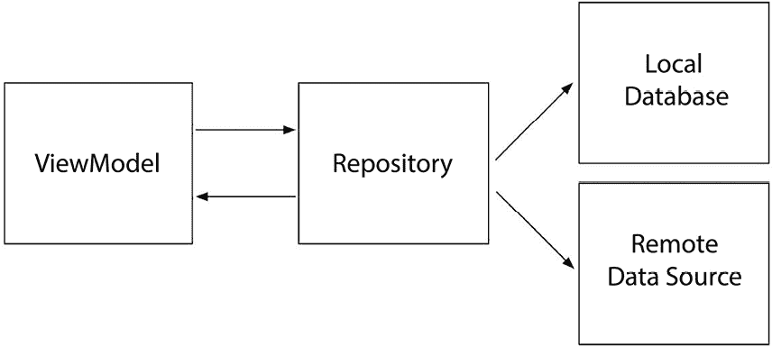
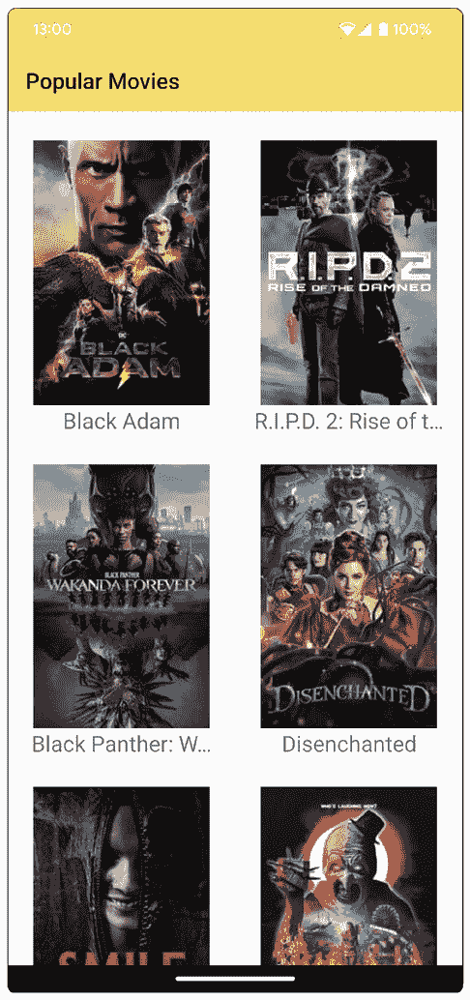
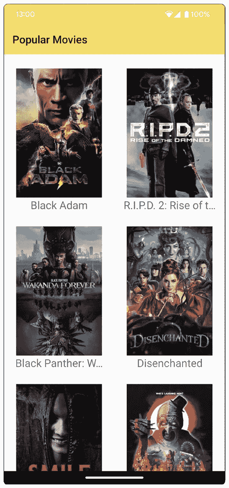
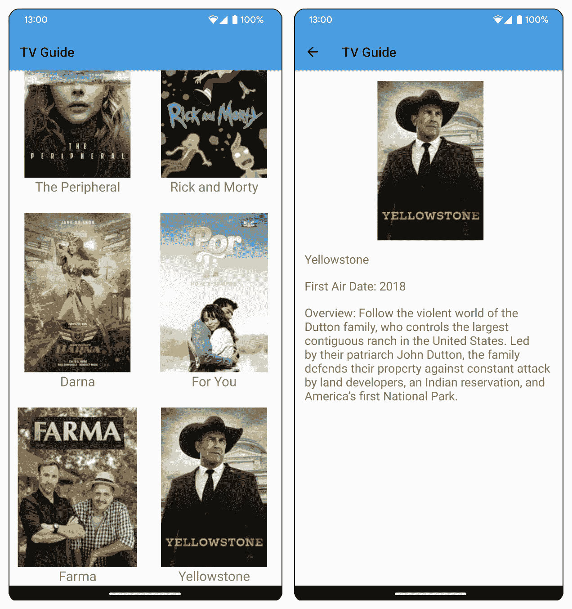

# 第十五章：架构模式

本章将介绍你可以用于你的 Android 项目的架构模式。它涵盖了使用 **模型-视图-视图模型**（**MVVM**）模式、添加视图模型和使用数据绑定。你还将了解使用存储库模式进行数据缓存和使用 WorkManager 在计划的时间间隔内检索和存储数据。

到本章结束时，你将能够使用 MVVM 和数据绑定来构建你的 Android 项目结构。你还将能够使用 Room 库的存储库模式来缓存数据，并使用 WorkManager 在计划的时间间隔内检索和存储数据。

在上一章中，你学习了如何使用协程和流进行后台操作和数据操作。现在，你将学习架构模式，以便你可以改进你的应用。

在开发 Android 应用时，你可能倾向于在活动或片段中编写大部分代码（包括业务逻辑）。这将使你的项目在以后难以测试和维护。随着你的项目增长和变得更加复杂，难度也会增加。你可以通过使用架构模式来改进你的项目。

架构模式是设计和发展应用程序部分的一般解决方案，特别是对于大型应用。你可以使用架构模式将你的项目结构化成不同的层（表示层、**用户界面**（**UI**）层和数据层）或功能（观察者/可观察）。使用架构模式，你可以以使开发、测试和维护更容易的方式进行代码组织。

对于 Android 开发，常用的模式包括 **模型-视图-控制器**（**MVC**）、**模型-视图-表示者**（**MVP**）和 MVVM。推荐的架构模式是 MVVM，这将在本章中讨论。你还将了解数据绑定、使用 Room 库的存储库模式和工作管理器。

本章我们将涵盖以下主题：

+   开始使用 MVVM

+   在 Android 上使用数据绑定绑定数据

+   使用 Retrofit 和 Moshi

+   实现存储库模式

+   使用 WorkManager

# 技术要求

本章中所有练习和活动的完整代码可在 GitHub 上找到，网址为 [`packt.link/PZNNT`](https://packt.link/PZNNT)

# 开始使用 MVVM

MVVM 允许你分离 UI 和业务逻辑。当你需要重新设计 UI 或更新模型/业务逻辑时，你只需触摸相关组件，而不会影响你应用的其他组件。这将使你更容易添加新功能和测试现有代码。MVVM 在创建使用大量数据和视图的巨大应用中也很有用。

使用 MVVM 架构模式，你的应用将被分为三个组件：

+   **模型**：这代表数据层

+   **视图**：这是显示数据的 UI

+   `Model` 和将其提供给 `View`

通过以下图表可以更好地理解 MVVM 架构模式：



图 15.1 – MVVM 架构模式

模型包含应用程序的数据。用户看到并与之交互的活动、片段和布局是 MVVM 中的视图。视图只处理应用程序的外观。它们让`ViewModel`知道用户操作（如打开活动或点击按钮）。

ViewModel 链接`View`和`Model`。ViewModel 还执行业务逻辑处理，并将它们转换为在视图中显示。视图订阅 ViewModel，并在值更改时更新 UI。

您可以使用 Jetpack 的 ViewModel 为您的应用程序创建 ViewModel 类。Jetpack 的 ViewModel 管理自己的生命周期，因此您不需要自己处理它。

您可以通过在您的`app/build.gradle`文件中添加以下代码将 ViewModel 添加到项目中：

```swift
implementation 'androidx.lifecycle:
lifecycle-viewmodel-ktx:2.5.1'
```

例如，如果您正在开发一个显示电影的 App，您可能有一个`MovieViewModel`。这个 ViewModel 将有一个函数来获取电影列表：

```swift
class MovieViewModel : ViewModel() {
    private val _movies: MutableStateFlow<List<Movie>>
    fun movies: StateFlow<List<Movie>> { ... }
    ...
}
```

在您的活动中，您可以使用`ViewModelProvider`创建 ViewModel：

```swift
class MainActivity : AppCompatActivity() {
    private val movieViewModel by lazy {
        ViewModelProvider(this).get(MovieViewModel::
        class.java)
    }
    ...
}
```

然后，您可以从`ViewModel`连接到`movies`Flow，并在电影列表更改时自动更新 UI 上的列表：

```swift
override fun onCreate(savedInstanceState: Bundle?) {
    ...
    lifecycleScope.launch {
        repeatOnLifecycle(Lifecycle.State.STARTED) {
            launch {
                movieViewModel.popularMovies.collect {
                movies ->
                    movieAdapter.addMovies(movies)
                }
            }
        }
    }
    ...
}
```

当`ViewModel`中的值发生变化时，视图会收到通知。您还可以使用数据绑定将`View`与`ViewModel`中的数据连接起来。您将在下一节中了解更多关于数据绑定的信息。

## 使用数据绑定在 Android 上绑定数据

视图绑定和数据绑定是两种将数据绑定到 Android 视图的方法。视图绑定是一种更简单、更快的绑定方式，您可以使用它来替换代码中的`findViewById`。数据绑定功能更强大，可以自定义以将数据与布局变量和表达式连接起来。

使用数据绑定，您可以将布局中的视图与来自源（如 ViewModel）的数据连接起来。您不需要在布局文件中添加代码来查找视图并在 ViewModel 的值更改时更新它们，数据绑定可以自动为您处理这些操作。

要在您的 Android 项目中使用数据绑定，您应该在`app/build.gradle`文件的`android`块中添加以下内容：

```swift
buildFeatures {
    dataBinding true
}
```

在`layout`文件中，您必须使用`layout`标签包装根元素。在`layout`标签内部，您需要定义要绑定到此`layout`文件的数据的`data`元素：

```swift
<layout xmlns:android=
    "http://schemas.android.com/apk/res/android">
    <data>
        <variable name="movie" type=
        "com.example.model.Movie"/>
    </data>
    <ConstraintLayout ... />
</layout>
```

`movie`布局变量代表将在布局中显示的`com.example.model.Movie`类。要将属性设置为数据模型中的字段，您需要使用`@{}`语法。例如，要使用电影的标题作为`TextView`的文本值，您可以使用以下代码：

```swift
<TextView
    ...
    android:text="@{movie.title}"/>
```

你还需要更改你的活动文件。如果你的`layout`文件名为`activity_movies.xml`，数据绑定库将在你的项目构建文件中生成一个名为`ActivityMoviesBinding`的绑定类。在活动中，你可以将`setContentView(R.layout.activity_movies)`行替换为以下内容：

```swift
val binding: ActivityMoviesBinding = DataBindingUtil
.setContentView(this, R.layout.activity_movies)
```

你也可以使用`binding`类或`DataBindingUtil`类的`inflate`方法：

```swift
val binding: ActivityMoviesBinding = ActivityMoviesBinding
.inflate(getLayoutInflater())
```

然后，你可以使用名为`movie`的布局变量将`movie`实例绑定到布局中：

```swift
val movieToDisplay = ...
binding.movie = movieToDisplay
```

如果你使用`LiveData`或`Flow`作为绑定到布局的项目，你需要为`binding`变量设置`lifeCycleOwner`。`lifeCycleOwner`指定了对象的范围。你可以使用活动作为`binding`类的`lifeCycleOwner`：

```swift
binding.lifeCycleOwner = this
```

这样，当`ViewModel`中的值发生变化时，`View`将自动使用新值更新。

你使用`android:text="@{movie.title}"`在`TextView`中设置电影标题。数据绑定库有默认的绑定适配器，可以处理对`android:text`属性的绑定。有时，可能没有可用的默认属性。你可以创建自己的绑定适配器。例如，如果你想绑定`RecyclerView`的电影列表，你可以创建一个自定义的`BindingAdapter`调用：

```swift
@BindingAdapter("list")
fun bindMovies(view: RecyclerView, movies: List<Movie>?) {
    val adapter = view.adapter as MovieAdapter
    adapter.addMovies(movies ?: emptyList())
}
```

这将允许你为`RecyclerView`添加一个接受电影列表的`app:list`属性：

```swift
app:list="@{movies}"
```

让我们尝试在一个 Android 项目中实现数据绑定。

## 练习 15.01 - 在 Android 项目中使用数据绑定

在上一章中，你使用 Movie Database API 开发了一个显示热门电影的程序。在本章中，你将使用 MVVM 来改进这个应用。你可以使用上一章的“热门电影”项目，或者复制它。在这个练习中，你将为从`ViewModel`到 UI 绑定电影列表添加数据绑定：

1.  在 Android Studio 中打开“热门电影”项目。

1.  打开`app/build.gradle`文件，并在`android`块中添加以下内容：

    ```swift
    buildFeatures {
        dataBinding true
    }
    ```

这将启用你的应用程序的数据绑定。

1.  在你的`app/build.gradle`文件中的插件块末尾添加`kotlin-kapt`插件：

    ```swift
    plugins {
        ...
        id 'kotlin-kapt'
    }
    ```

`kotlin-kapt`插件是 Kotlin 注解处理工具，它是使用数据绑定所必需的。

1.  创建一个名为`RecyclerViewBinding`的新文件，其中包含`RecyclerView`列表的绑定适配器：

    ```swift
    @BindingAdapter("list")
    fun bindMovies(view: RecyclerView, movies:
    List<Movie>?) {
        val adapter = view.adapter as MovieAdapter
        adapter.addMovies(movies ?: emptyList())
    }
    ```

这将允许你为`RecyclerView`添加一个`app:list`属性，你可以传递要显示的电影列表。电影列表将被设置到适配器中，从而更新 UI 中的`RecyclerView`。

1.  打开`activity_main.xml`文件，将所有内容包裹在一个`layout`标签内：

    ```swift
    <layout xmlns:android=
        "http://schemas.android.com/apk/res/android"
        xmlns:app="http://schemas.android.com/apk/res-auto"
        xmlns:tools="http://schemas.android.com/tools">
        <androidx.constraintlayout.widget.ConstraintLayout
            ... >
        </androidx.constraintlayout.widget
        .ConstraintLayout>
    </layout>
    ```

这样，数据绑定库将能够为这个布局生成一个绑定类。

1.  在`layout`标签和`ConstraintLayout`标签之前，添加一个数据元素，包含一个名为`viewModel`的变量：

    ```swift
    <data>
        <variable
            name="viewModel"
            type="com.example.popularmovies
            .MovieViewModel" />
    </data>
    ```

这创建了一个与你的`MovieViewModel`类对应的`viewModel`布局变量。

1.  在 `RecyclerView` 中，使用 `app:list` 添加要显示的列表：

    ```swift
    app:list="@{viewModel.popularMovies}"
    ```

`popularMovies` 从 `MovieViewModel.getPopularMovies` 将作为电影列表传递给 `RecyclerView`。

1.  打开 `MainActivity`。在 `onCreate` 函数中，将 `setContentView` 行替换为以下内容：

    ```swift
    val binding: ActivityMainBinding = DataBindingUtil
    .setContentView(this, R.layout.activity_main)
    ```

这设置了要使用的 `layout` 文件并创建了一个绑定对象。

1.  从 `movieViewModel` 中删除 `popularMoviesView` 的集合。

1.  在 `movieViewModel` 初始化之后添加以下代码：

    ```swift
    binding.viewModel = movieViewModel
    binding.lifecycleOwner = this
    ```

这将 `movieViewModel` 绑定到 `activity_main.xml` 文件中的 `viewModel` 布局变量。

1.  运行应用程序。它应该像往常一样工作，显示热门电影的列表，点击其中一项将打开所选电影的详细信息：



图 15.2 – 主屏幕（左侧）显示当年的热门电影和详细信息屏幕（右侧）显示所选电影的更多信息

在这个练习中，您已经在 Android 项目中使用了数据绑定。

数据绑定将视图与 ViewModel 连接起来。ViewModel 从模型中检索数据。您可以使用的某些库来获取数据是 Retrofit 和 Moshi，您将在下一节中了解更多关于它们的信息。

# 使用 Retrofit 和 Moshi

当连接到您的远程网络时，您可以使用 Retrofit。Retrofit 是一个 HTTP 客户端，它使实现向后端服务器发送请求和检索响应变得容易。

您可以通过在 `app/build.gradle` 文件依赖项中添加以下代码将 Retrofit 添加到您的项目中：

```swift
implementation 'com.squareup.retrofit2:retrofit:2.9.0'
```

您可以使用 Moshi，一个将 JSON 解析为 Java 对象的库，将 Retrofit 的 JSON 响应进行转换。例如，您可以将获取电影列表的 JSON 字符串响应转换为 `ListofMovie` 对象，以便在您的应用程序中进行显示和存储。

您可以通过在 `app/build.gradle` 文件依赖项中添加以下代码将 Moshi Converter 添加到您的项目中：

```swift
implementation 'com.squareup.retrofit2:
converter-moshi:2.9.0'
```

在您的 Retrofit 构建器代码中，您可以调用 `addConverterFactory` 并传递 `MoshiConverterFactory`：

```swift
Retrofit.Builder()
    ...
    .addConverterFactory(MoshiConverterFactory.create())
    ...
```

您可以从 ViewModel 调用数据层。为了减少其复杂性，您可以使用 Repository 模式来加载和缓存数据。您将在下一节中了解这一点。

## 实现 Repository 模式

而不是直接由 `ViewModel` 调用获取和存储数据的服务，它应该将这项任务委托给另一个组件，例如仓库。

使用 Repository 模式，您可以将处理数据层的代码从 `ViewModel` 中移动到单独的类。这减少了 `ViewModel` 的复杂性，使其更容易维护和测试。仓库将管理数据的获取和存储，就像使用本地数据库或网络服务来获取或存储数据一样：



图 15.3 – 带有 Repository 模式的 ViewModel

在`ViewModel`中，你可以为仓库添加一个属性：

```swift
class MovieViewModel(val repository: MovieRepository):
ViewModel() { ...}
```

`ViewModel`将从仓库中获取电影，或者它可以监听它们。它将不知道你实际上是从哪里获取列表的。

你可以创建一个仓库接口，它连接到数据源，例如以下示例：

```swift
interface MovieRepository {
    fun getMovies(): List<Movie>
}
```

`MovieRepository`接口有一个`getMovies`函数，你的仓库实现类将覆盖它以从数据源获取电影。你也可以有一个单独的仓库类，它处理从本地数据库或远程端点获取数据。

当使用本地数据库作为仓库的数据源时，你可以使用 Room 库，这使你通过编写更少的代码并在编译时检查查询来更容易地与 SQLite 数据库一起工作。

你可以通过将以下代码添加到`app/build.gradle`文件中的依赖项来将 Room 添加到你的项目中：

```swift
implementation 'androidx.room:room-runtime:2.4.3'
implementation 'androidx.room:room-ktx:2.4.3'
kapt 'androidx.room:room-compiler:2.4.3'
```

让我们尝试将 Repository 模式和 Room 添加到 Android 项目中。

## 练习 15.02 – 在 Android 项目中使用 Room 的 Repository

在上一个练习中，你已经在`热门电影`项目中添加了数据绑定。在这个练习中，你将使用 Repository 模式来更新应用。

当打开应用时，它会从网络上获取电影列表。这需要一些时间。每次你获取这些数据时，你都会将它们缓存到本地数据库中。当用户下次打开应用时，应用将立即在屏幕上显示从数据库获取的电影列表。你将使用 Room 进行数据缓存：

1.  打开你在上一个练习中使用的`热门电影`项目。

1.  打开`app/build.gradle`文件，并添加 Room 库的依赖项：

    ```swift
    implementation 'androidx.room:room-runtime:2.4.3'
    implementation 'androidx.room:room-ktx:2.4.3'
    kapt 'androidx.room:room-compiler:2.4.3'
    ```

1.  打开`Movie`类，并为它添加一个`Entity`注解：

    ```swift
    @Entity(tableName = "movies",  primaryKeys = [("id")])
    data class Movie( ... )
    ```

`Entity`注解将为电影列表创建一个名为`movies`的表。它还将`id`设置为表的键。

1.  创建一个新的包`com.example.popularmovies.database`。为访问`movies`表创建一个`MovieDao`数据访问对象：

    ```swift
    @Dao
    interface MovieDao {
    @Insert(onConflict = OnConflictStrategy.REPLACE)
    fun addMovies(movies: List<Movie>)
    @Query("SELECT * FROM movies")
    fun getMovies(): List<Movie>
    }
    ```

这个类包含一个用于在数据库中添加电影列表的函数，以及一个用于从数据库获取所有电影的函数。

1.  在`com.example.popularmovies.database`包中创建一个`MovieDatabase`类：

    ```swift
    @Database(entities = [Movie::class], version = 1)
    abstract class MovieDatabase : RoomDatabase() {
        abstract fun movieDao(): MovieDao
        companion object {
            @Volatile
            private var instance: MovieDatabase? = null
            fun getInstance(context: Context):
            MovieDatabase {
                return instance ?: synchronized(this) {
                    instance ?: buildDatabase(
                    context).also { instance = it }
                }
            }
            private fun buildDatabase(context: Context):
            MovieDatabase {
                return Room.databaseBuilder(context,
                MovieDatabase::class.java, "movie-db")
                .build()
            }
        }
    }
    ```

这个数据库有一个版本`1`，一个用于`Movie`的单个实体，以及电影的访问对象。它还有一个`getInstance`函数来生成数据库的实例。

1.  更新`MovieRepository`类，为`movieDatabase`添加构造函数：

    ```swift
    class MovieRepository(private val movieService:
    MovieService, private val movieDatabase:
    MovieDatabase) { ... }
    ```

1.  更新`fetchMovies`函数：

    ```swift
    fun fetchMovies(): Flow<List<Movie>> {
        return flow {
            val movieDao: MovieDao =
                movieDatabase.movieDao()
            val savedMovies = movieDao.getMovies()
            if(savedMovies.isEmpty()) {
                val movies = movieService
                    .getPopularMovies(apiKey).results
                movieDao.addMovies(movies)
                emit(movies)
            } else {
                emit(savedMovies)
            }
        }.flowOn(Dispatchers.IO)
    }
    ```

它将从数据库中获取电影。如果没有保存任何内容，它将从一个网络端点检索列表并将其保存。

1.  打开`MovieApplication`，在`onCreate`函数中，将`movieRepository`的初始化替换为以下内容：

    ```swift
    val movieDatabase =
        MovieDatabase.getInstance(applicationContext)
    movieRepository =
        MovieRepository(movieService, movieDatabase)
    ```

1.  运行应用。它将显示流行电影的列表，点击其中一个将打开所选电影的详细信息。如果你关闭移动数据或断开无线网络连接，它仍然会显示电影列表，这些电影现在已缓存在数据库中：



图 15.4 – 使用 Repository 和 Room 的 Popular Movies 应用

在这个练习中，你通过将数据的加载和存储移动到仓库来改进了应用。你还使用了 Room 来缓存数据。

仓库从数据源获取数据。如果数据库中还没有存储数据，应用将调用网络请求数据。这可能需要一段时间。你可以通过在预定时间预取数据来改善用户体验，这样当用户下次打开应用时，他们已经可以看到更新后的内容。你可以使用 WorkManager 来实现这一点，我们将在下一节中讨论。

# 使用 WorkManager

**WorkManager** 是一个用于后台操作的 Jetpack 库，它可以延迟执行，可以根据你设置的约束条件运行。它非常适合执行必须运行但可以稍后或定期执行的任务，无论应用是否正在运行。

你可以使用 WorkManager 在预定的时间间隔运行任务，例如从网络获取数据并将其存储到你的数据库中。即使应用已被关闭或设备重启，WorkManager 也会运行任务。这将确保你的数据库与后端保持最新。

你可以通过将以下代码添加到你的 `app/build.gradle` 文件依赖项中来将 WorkManager 添加到你的项目中：

```swift
implementation 'androidx.work:work-runtime:2.7.1'
```

WorkManager 可以调用仓库从本地数据库或网络服务器获取和存储数据。

让我们尝试将 WorkManager 添加到 Android 项目中。

## 练习 15.03 – 将 WorkManager 添加到 Android 项目

在上一个练习中，你通过 Room 将 Repository 模式添加到本地数据库中缓存数据。现在，应用可以从数据库而不是网络中获取数据。现在，你将添加 WorkManager 来安排从服务器获取数据并将其保存到数据库的定时任务：

1.  打开你在上一个练习中使用的 Popular Movies 项目。

1.  打开 `app/build.gradle` 文件并添加 WorkManager 库的依赖项：

    ```swift
    implementation 'androidx.work:work-runtime:2.7.1'
    ```

这将允许你将 WorkManager 工作者添加到你的应用中。

1.  打开 `MovieRepository` 并添加一个用于从网络使用 `movieDatabase` 中的 `apiKey` 获取电影并将其保存到数据库的挂起函数：

    ```swift
    suspend fun fetchMoviesFromNetwork() {
        val movieDao: MovieDao = movieDatabase.movieDao()
        try {
            val popularMovies = movieService
                .getPopularMovies(apiKey)
            val moviesFetched = popularMovies.results
            movieDao.addMovies(moviesFetched)
        } catch (exception: Exception) {
            Log.d("MovieRepository", "An error occurred:
                ${exception.message}")
        }
    }
    ```

这将是 `Worker` 类将要调用的函数，用于检索和保存电影。

1.  在 `com.example.popularmovies` 包中创建 `MovieWorker` 类：

    ```swift
    class MovieWorker(private val context: Context,
    params: WorkerParameters) : Worker(context, params) {
        override fun doWork(): Result {
            val movieRepository = (context as
            MovieApplication).movieRepository
            CoroutineScope(Dispatchers.IO).launch {
                movieRepository.fetchMoviesFromNetwork()
            }
            return Result.success()
        }
    }
    ```

1.  打开 `MovieApplication` 并在 `onCreate` 函数的末尾，安排 `MovieWorker` 来检索并保存电影：

    ```swift
    override fun onCreate() {
        ...
        val constraints =
            Constraints.Builder().setRequiredNetworkType(
            NetworkType.CONNECTED).build()
        val workRequest = PeriodicWorkRequest
            .Builder(MovieWorker::class.java, 1,
            TimeUnit.HOURS).setConstraints(constraints)
            .addTag("movie-work").build()
        WorkManager.getInstance(
            applicationContext).enqueue(workRequest)
    }
    ```

这将在设备连接到网络时每小时调度 `MovieWorker` 运行。`MovieWorker` 将从网络获取电影列表并将其保存到本地数据库中。

1.  运行应用程序。关闭它并确保设备已连接到互联网。超过一小时后，再次打开应用程序并检查显示的电影列表是否已更新。如果没有，几小时后再试。显示的电影列表将定期更新，大约每小时更新一次，即使应用程序已关闭。



图 15.5 – 使用 WorkManager 更新热门电影应用程序的列表

在这个练习中，你向应用程序添加了 WorkManager，以自动使用从网络检索的电影列表更新数据库。

## 活动十五点零一 - 重访电视指南应用程序

在上一章中，你开发了一个可以显示正在播出的电视剧列表的应用程序。该应用程序有两个屏幕：主屏幕和详情屏幕。在主屏幕上，有一个电视剧列表。点击电视剧时，将显示选中电视剧的详情屏幕。

当运行应用程序时，显示节目列表需要一段时间。更新应用程序以缓存列表，以便在打开应用程序时立即显示。此外，通过使用数据绑定和添加 WorkManager 来改进应用程序。

你可以使用上一章中工作的电视指南应用程序或从 GitHub 仓库（[`packt.link/Eti8M`](https://packt.link/Eti8M)）下载它。以下步骤将帮助你完成此活动：

1.  在 Android Studio 中打开电视指南应用程序。打开 `app/build.gradle` 文件并添加 `kotlin-kapt` 插件、数据绑定依赖项以及 Room 和 WorkManager 的依赖项。

1.  为 `RecyclerView` 创建一个绑定适配器类。

1.  在 `activity_main.xml` 中，将所有内容包裹在一个 `layout` 标签内。

1.  在 `layout` 标签内和 `ConstraintLayout` 标签之前，添加一个数据元素，其中包含 `ViewModel` 的变量。

1.  在 `RecyclerView` 中，使用 `app:list` 添加要显示的列表。

1.  在 `MainActivity` 中，将 `setContentView` 的行替换为 `DataBindingUtil.setContentView` 函数。

1.  将 `TVShowViewModel` 中的观察者替换为数据绑定代码。

1.  在 `TVShow` 类中添加 `Entity` 注解。

1.  为访问 `TV` `shows` 表创建一个 `TVDao` 数据访问对象。

1.  创建一个 `TVDatabase` 类。

1.  使用 `tvDatabase` 构造函数更新 `TVShowRepository`。

1.  更新 `fetchTVShows` 函数以从本地数据库获取电视剧。如果还没有，则从端点检索列表并将其保存到数据库中。

1.  添加一个挂起函数 `fetchTVShowsFromNetwork`，从网络获取电视剧并将其保存到数据库中。

1.  创建 `TVShowWorker` 类。

1.  打开 `TVApplication` 文件。在 `onCreate` 中，安排 `TVShowWorker` 检索并保存节目。

1.  运行你的应用。应用将显示电视节目列表。点击一个电视节目将打开详情活动，显示电影详情。主屏幕和详情屏幕将类似于以下内容：



图 15.6 – TV 指南应用的主屏幕和详情屏幕

注意

该活动的解决方案可在[`packt.link/By7eE`](https://packt.link/By7eE)找到。

# 摘要

本章重点介绍了 Android 的架构模式。你从 MVVM 架构模式开始学习。你了解了它的三个组成部分：模型(Model)、视图(View)和视图模型(ViewModel)。你还使用了数据绑定来将视图与视图模型连接起来。

接下来，你学习了如何使用 Repository 模式来缓存数据。然后，你学习了 WorkManager 以及如何安排诸如从网络获取数据并将数据保存到数据库以更新本地数据等任务。

在下一章中，你将学习如何通过动画来改善和提高你应用的外观和设计。你将使用`CoordinatorLayout`和`MotionLayout`为你的应用添加动画和过渡效果。
