# 第四章：确保其工作正常

> 现在我们已经构建了我们的第一个 iAd，我们需要测试其功能性和性能，以确保我们为用户提供最佳可能的体验。彻底的测试将有助于通过展示质量和档次来确立您品牌的价值。

在本章中，我们将探讨以下内容：

+   学习在 Safari 中测试的局限性

+   在 iOS 模拟器中进行测试

+   与模拟器交互

+   模拟硬件事件

+   在设备上部署和“触摸”我们的广告

+   调试常见问题

+   使用演示分享我们的 iAd

# 在 Safari 中进行测试

在上一章中，我们简要地看了如何在 Safari 中使用 Safari 预览我们的动画，现在让我们深入探讨并用于测试，我们会很快发现其局限性。

# 是时候在 Safari 上进行操作了

让我们在 Safari 中打开一个项目进行预览和测试。

1.  在**iAd Producer**中打开一个项目，例如我们一直在工作的`Dino Stores`项目。

1.  从广告概览中，通过单击选择 iAd 的页面；它周围应该出现一个黄色边框。现在，从菜单栏选择**导出**，然后**在 Safari 中预览**，或者使用键盘快捷键*Cmd* + *Shift* + *Enter*。

    ### 注意

    如果在从概览中预览时没有选择特定的页面，iAd Producer 将默认打开启动页面。

1.  您的 iAd 页面将在 Safari 中打开；您现在可以点击周围来测试您的广告。点击菜单项导航到广告的其他页面。

    ### 小贴士

    要直接从画布中测试广告，请选择**导出**，然后**在 Safari 中预览**，iAd Producer 将自动打开您一直在工作的当前页面。

1.  尝试与广告互动；你会很快看到有一些局限性。Safari 中的预览缺少围绕横幅的 iAd 框架，并且那些通常不会可见的元素在它们进入视图之前就可以看到。虽然图像、音频和视频元素将工作，但如地图和可摇动的视图等元素在 Safari 预览中不可用。

    如果某些对象不可用，Safari 将显示一个警告提示，告知您哪些组件无法加载。

## 发生了什么？

我们刚刚在 Safari 中直接从概览和编辑画布上的特定页面打开了我们的 iAd。这对于快速测试很有用，但在它可以显示的对象和我们可以使用的硬件交互方面存在局限性；例如，摇动设备和多点触控不可用。

您的 Mac 上的 Safari 可能使用的是比 iOS 中可用的**WebKit**更新的版本，这意味着您不太可能看到在使用 iOS 时可能出现的问题。

WebKit 是一个开源渲染引擎，它决定了网页应该如何显示。它被 Safari（在桌面和移动设备上）和 Chrome 等网络浏览器使用。

我们无法在 Safari 中测试我们 iAd 的某些部分和页面之间的流程和交互，所以让我们使用 iOS 模拟器打开一个 iAd。

# 在模拟器中进行测试

iOS 模拟器允许我们在没有设备的条件下进行测试，并且对于在兼容性检查中快速部署测试在一个准确的环境中非常有用。

在产品上市之前，开发者无法获得物理设备，因此启动时可用的 iPad 应用程序完全使用模拟器构建。

## 安装 Xcode 和 iOS 模拟器

要使用 iOS 模拟器在 iPhone 和 iPad 上进行测试，您需要从 Apple 安装 iOS SDK，它包含在 Xcode 中。**SDK**是**软件开发工具包**；它包含构建和测试特定平台软件所需的工具。

Xcode 可以从 Mac App Store 或从开发者门户手动下载。Mac App Store 更受欢迎，但仅适用于 Mac OS X 的较新版本。让我们看看如何使用 Mac App Store 安装，以及如果不可用，如何手动获取 Xcode。

### 注意

您需要在您的 Mac 上有大约 10GB 的可用磁盘空间来安装 Xcode 和开发工具。您必须将 Xcode 安装在您的主硬盘上，因为它需要更新核心系统工具，这些工具不能从外部磁盘运行。

# 行动时间 — 使用 Mac App Store 安装 Xcode（简单）

我们现在将发现您的 Mac 上是否有 Mac App Store，如果有，则安装 Xcode。

1.  从菜单栏最左侧的 Apple 图标中选择**App Store**以打开商店。

    ### 注意

    如果找不到菜单按钮，这意味着您的 Mac OS 版本不支持 Mac App Store。要更新您的操作系统，请选择 Apple 图标并选择**软件更新**。完成任何必需的更新后，再次开始此练习。

    如果您仍然看不到 Mac App Store，请跳到下一练习—手动安装**Xcode**。

1.  打开 App Store 后，搜索 Xcode 或访问 [`itunes.apple.com/gb/app/xcode/id448457090`](http://itunes.apple.com/gb/app/xcode/id448457090) 以自动打开 Xcode。

    ### 注意

    在 Lion 之前的较旧版本的 Mac OS X 可能会尝试向您收取从 Mac App Store 下载 Xcode 的费用。如果 Xcode 未能作为免费下载出现，请遵循下一练习中的手动步骤，免费安装它。

1.  下载完安装 Xcode 应用程序后，双击它以打开安装程序。按照安装步骤操作，Xcode 将被安装！

## 发生了什么？

通过使用 Mac App Store 下载我们的应用程序，我们避免了从开发者门户下载的大量手动和繁琐的任务。您在打开商店时将自动收到更新通知；或者，如果 App Store 图标在您的 dock 中，当有更新可用时，将出现徽章。

如果您在安装后需要磁盘空间，可以安全地删除安装 Xcode 应用程序。但是，保留它将意味着未来的 Xcode 更新可以更快地下载，因为只需下载安装更改的部分。

如果您无法从 Mac App Store 下载 Xcode，请遵循下一练习中的手动下载步骤。

# 手动安装 Xcode 的时间 — 手动安装（更难）

如果您不想使用或无法使用 Mac App Store，我们可以从开发者门户手动下载和安装 Xcode。如果您已成功从 App Store 下载了应用程序，请跳过此练习。

1.  要访问 iOS SDK，我们需要登录到 iOS 开发者门户。转到[`developer.apple.com/ios/`](http://developer.apple.com/ios/)并使用您的 Apple ID 和密码登录。

1.  我们需要下载 iOS SDK，这是用于为 iPhone 和 iPad 开发 iOS 应用程序的应用程序。登录后，找到页面底部的**下载**部分，并点击**下载 Xcode 4**以开始下载。在以下截图中，我们可以看到开发者门户中下载 Xcode 的选项：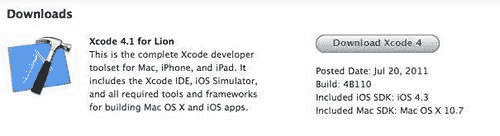

    ### 注意

    Xcode 和 iOS SDK 的下载大小为几个吉字节，可能需要一段时间才能下载；如果您连接速度较慢，可能值得留到夜间完成。

    下载完成后，通过双击打开`Xcode and iOS SDK.mkpg`安装包。当提示**此包将运行一个程序以确定软件是否可以安装**时，点击**继续**。

1.  阅读并接受**软件许可协议**，然后继续到**安装类型**屏幕。确保所有选项都已勾选，因为我们需要安装 iOS 模拟器的所有组件。您的安装窗口应类似于以下截图：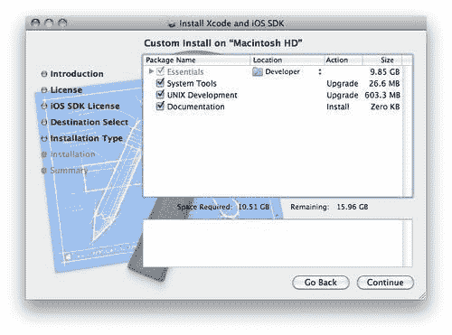

1.  点击**继续**然后**安装**，以完成安装。

### 注意

默认情况下，Xcode 和相关工具存储在您的硬盘上的`Developer`目录中；您通常不需要更改此设置。

## 刚才发生了什么？

您刚刚从开发者门户手动安装了 Xcode（那些无法通过 Mac App Store 安装 Xcode 或它对您不可免费使用的人）。

您现在已安装了构建 iOS 和 Mac 应用程序的工具，包括 iPhone 和 iPad 的 iOS 模拟器。尽管我们不会使用 Xcode 来开发我们的广告，但我们仍然必须安装它以使模拟器工作。

# 打开广告的时间

现在我们已经安装了 iOS 模拟器，我们可以测试在完整的 iAd 框架中运行的 iAd。

1.  打开 iAd Producer 并加载一个现有的 iAd 项目，例如我们之前制作的`Dino Stores`项目。

1.  从广告概览中，点击左下角的**模拟**按钮以打开模拟器。您可以使用*Cmd* + *Enter*从键盘打开模拟器。

    ### 注意

    iAd Producer 将根据您正在工作的项目类型自动打开 iOS 模拟器作为 iPhone 或 iPad。

1.  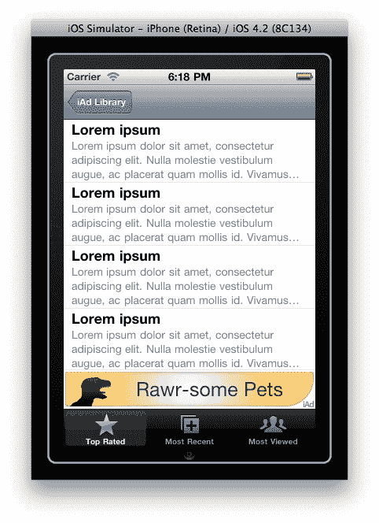

    ### 注意

    iAd 测试器应用是一个**虚假**的占位符应用，它模拟了一个您的广告可能出现的应用。通常，您的 iAd 将出现在底部，位于标签栏上方，用于在应用屏幕之间导航。

1.  点击横幅以打开您的 iAd。现在您可以像在设备上一样玩转并测试您的 iAd。

## 刚才发生了什么？

您现在已经在将运行的精确软件环境中测试了您的 iAd。每当您想要在模拟器中更新预览时，只需按下 iAd Producer 中的**模拟**按钮，它将被重新部署。

## 与模拟器交互

对于快速检查，与 Safari 相比，使用模拟器会更好，因为您的广告被正确地嵌入并且可以访问完整的 iAd 功能和组件。与 Safari 不同，我们在与 iAd 交互时能够模拟硬件事件。

# 模拟器中的硬件模拟实战时间

使用真实设备，我们可以摇晃、捏合和旋转 iPhone 或 iPad 来与 iAd 交互。这些事件可以在模拟器中模拟。

1.  我们将使用一个示例项目，其中包含我们可以与之交互的对象集合。打开与书籍资源一起提供的`Interaction Demo`项目。

1.  从广告概览中，点击**模拟**按钮以打开模拟器。首先，让我们看看如何旋转设备。

1.  您应该在 iAd 测试器中看到横幅出现。现在我们将旋转模拟器来检查我们的横幅在横幅模式下的外观。从菜单栏中选择**硬件**然后**向左旋转**或**向右旋转**来旋转设备。然后模拟器将旋转，横幅应该更新以显示横幅模式。现在将 iAd 旋转回纵向，可以通过相反方向旋转一次，或者通过在相同方向旋转模拟器三次，回到起始位置。

    ### 注意

    您还可以使用键盘快捷键来旋转模拟器；尝试按住**Cmd**键并使用左右箭头。

1.  现在点击横幅以进入 iAd。从菜单中选择**Shakey Time**。现在我们将学习如何模拟用户摇晃他们的设备。从硬件菜单中选择**摇晃**；广告应该更新以显示您已经摇晃了它。尝试再摇晃几次。您可以在以下截图中的**硬件**菜单项中看到**摇晃手势**：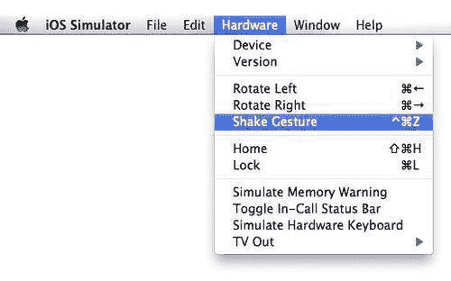

    ### 注意

    很遗憾，摇晃您的 Mac 不会更新模拟器中的广告。然而，键盘上的**cmd** + **ctrl** + **Z**可以为您提供快速摇晃 iOS 模拟器的方法。

1.  点击菜单按钮回到演示 iAd 的起始位置。现在选择第二个项目**GPS/多点触控**。这将打开一个提示，请求访问您的位置，模拟真实设备中找到的 GPS 硬件。由于您的 Mac（可能）中没有 GPS，模拟器默认设置为加利福尼亚州库比蒂诺的苹果公司总部。

1.  现在，地图已经找到了你的*位置*，让我们模拟一个捏合手势来放大和缩小地图。将鼠标指针移至地图中间附近，并在键盘上按住*Ctrl*键；应该会出现两个圆圈，代表两个手指的触摸点。继续按住*Ctrl*键，从地图外部点击并拖动以放大。要缩小，重复此过程，但开始于地图外部并向内拖动。以下截图显示了模拟的多点触控拖动：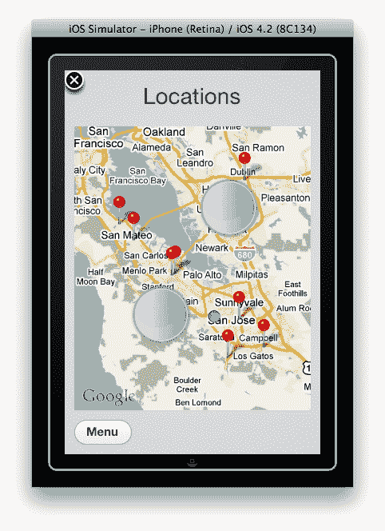

1.  尝试捏合和展开地图来放大和缩小；这可能需要一段时间才能习惯，所以如果你第一次没有成功，不要担心。当你对这些手势有信心时，点击**菜单**返回主广告屏幕。

1.  最后，我们将尝试快速滑动全景视图。从菜单中打开**Flick**页面。你现在应该看到一个图像；这个图像在一个可滚动的视图中，因此可以在其框架内移动以显示不同的部分。点击并拖动图像以查看这一点。要快速滑动图像，快速并尖锐地点击并拖动；你应该会看到在你放手后图像仍然继续移动。

    ### 注意

    快速滑动用于快速导航大型的可滚动区域。iOS 计算拖动手势的速度和距离，并给滚动添加惯性，因此在你从屏幕上移开手指后它仍然继续移动。然后滚动逐渐减速到一个自然结束。

1.  一旦你满意自己能够与 iOS 模拟器交互，可以通过从菜单栏中选择**iOS Simulator**并点击**退出**来退出它，或者使用键盘快捷键，*Cmd* + *Q*。

## 发生了什么？

我们刚刚测试了模拟硬件事件，例如旋转、震动和多点触控。请记住，与设备相比，模拟器中的某些硬件功能表现并不完全相同；例如，GPS 模拟位置和鼠标指针提供的点击精度比手指更高。

## 快速问答——iOS 模拟器

检查你是否能够回答以下关于 iOS 模拟器的问题：

1.  我们需要安装什么才能使用 iOS 模拟器？

    +   a. Xcode 和 iOS SDK。

    +   b. 仅 Xcode。

    +   c. 仅 iOS SDK。

    +   d. iOS 的开发者预览版。

1.  你如何在 iOS 模拟器中使用捏合手势？

    +   a. 按压屏幕。

    +   b. 在键盘上按*Cmd* + *Z*。

    +   c. 在触控板上用两个手指捏合。

    +   d. 按住*Ctrl*以显示两个触摸点，然后点击并拖动。

# 演示时间——模拟不同设备

默认情况下，iAd Producer 以**iPhone 4 with Retina Display**打开 iPhone 广告的模拟器，或以**通用 iPad**打开 iPad 项目。iPhone 4 模拟器缩放至 50%，以抵消更高的像素计数，以便它仍然可以适应您的屏幕。我们还可以打开一个标准分辨率的显示 iPhone，以查看我们的低分辨率资源如何显示。让我们尝试在 iPad、标准分辨率 iPhone 和不同的 iOS 软件版本中进行模拟。

1.  让我们打开一个 iPad 项目来查看模拟器在测试 iPad 广告时的外观。由于我们尚未创建 iPad 广告，请从书籍资源中打开**交互演示 - iPad**文件。一旦加载，点击**模拟**以打开模拟器。

1.  模拟器应该会自动与 iPad 一起打开。尝试与 iAd 交互——摇动和旋转的硬件控制方式相同。

    ### 注意

    区分 iPad 和 iPhone 4 视网膜模拟器可能很困难；如果您不确定哪个模拟器是打开的，请检查标题栏，它应该说明它是以 iPad 还是 iPhone 运行。

1.  默认情况下，iOS 模拟器将 iPad 的分辨率缩放至 50%，如果你的屏幕不够大，无法显示 iPad 的原生尺寸。要正确缩放 iPad 模拟器，请从菜单栏中选择**窗口**。现在点击**缩放**并选择**100%**。您也可以使用键盘上的*Cmd* + *1*切换到 100%缩放，使用*Cmd* + *2*切换回 50%。当缩放到 100%时，您可能需要滚动模拟器来访问 iPad 的屏幕外部分，如下面的截图所示：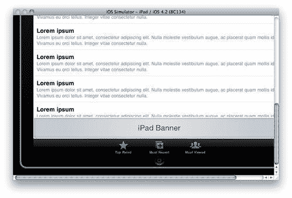

1.  关闭 iPad 模拟器并打开一个 iPhone 项目，例如**交互演示**。我们现在将测试我们 iAd 的标准分辨率、非视网膜版本。打开广告概述中的横幅；它现在应该出现在编辑画布上。从右上角的**视图**下拉菜单中，将其从**iPhone (Retina) - 50%**更改为**iPhone**，如下面的截图所示：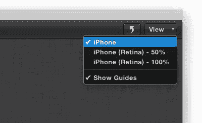

1.  现在，点击**模拟**以打开标准分辨率的 iPhone 模拟器。模拟器现在应该有一个合适的 iPhone 框架包围它，没有标题栏。您应该使用标准分辨率模拟器来检查 iAd Producer 是否已正确将图像缩放到这些设备上显示。

1.  我们还可以指定不同的 iOS 版本来测试我们的 iAd。较旧的 iOS 版本可能有不同的渲染怪癖，并且可能以不同的方式显示内容，因此在部署之前测试尽可能多的版本是很重要的。要更改模拟器启动的 iOS 版本，请从 iAd Producer 的菜单栏中选择**导出**，然后选择**模拟器 iOS 版本**；尝试更改版本并点击**模拟**以重新启动广告。

### 注意

根据与 Xcode 一起安装的 iOS SDK 版本，您可能只有 iOS 模拟器的一个版本可用。苹果在发布每个新版本的 iOS 时都会定期更新 SDK，因此请留意苹果宣布 SDK 更新的电子邮件。然后，您可以重新下载最新的 Xcode 并安装更新，以便访问最新的模拟器。

## 刚才发生了什么？

使用模拟器，我们能够模拟不同的硬件和软件条件，以测试 iAd 可能出现的各种情况。

## Have a go hero

为什么不尝试在不同的模拟器条件下测试我们在 第三章 "制作您的 iAd" 中制作的 iAd 或您自己的 iAd，以检查它是否按预期工作。您可以尝试：

+   在模拟器中测试

+   预览您的资产在高分辨率视网膜显示屏和标准分辨率显示屏上的外观

+   测试与硬件的交互，例如摇晃和使用 GPS 位置

+   在不同版本的 iOS 中使用您的 iAd

# 在设备上测试

在您的计算机上测试可以很好地检查图形是否如您预期的那样，预览动画，并尝试您的广告的流程；但它们无法与触摸和与沉浸式 iAd 交互的经验相提并论。

## 安装 iAd Tester

iAd Tester 是我们在 iOS 模拟器中使用的 *虚假* 占位符应用，用于测试我们的 iAd。苹果已将此应用提供给我们，以便我们可以在我们的 iOS 设备上安装并直接测试广告。使用 iAd Tester，我们可以访问设备上的 iAds、在 Mac 上远程访问，以及从 iAd 测试服务器无线访问。

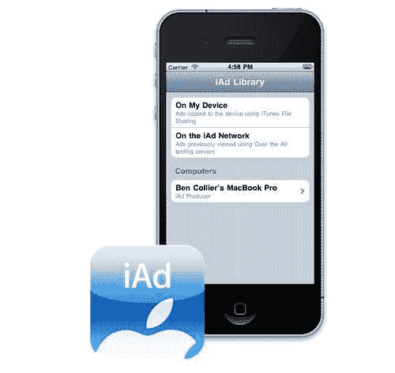

在前面的屏幕截图中，您可以看到 iAd Tester 在 iPhone 4 上运行。

# 操作时间 — 将 iAd Tester 放置在您的设备上

当您安装 iAd Producer 时，它将 iAd Tester 的一个版本放置在您的 Mac 上。我们可以使用 iTunes 在我们的 iOS 设备上安装它。

1.  iAd Producer 将 iAd Tester 的一个版本复制到您的 Mac 的 `Developer` 文件夹中。打开 Finder 并导航到 `Developer`，然后 `iAdJSDeveloper`；现在打开 `iAdTester-Device` 文件夹。您应该看到一个名为 `iAdTester` 的文件。

1.  打开 iTunes 并将文件拖到您的库中，正如您在以下屏幕截图中看到的那样：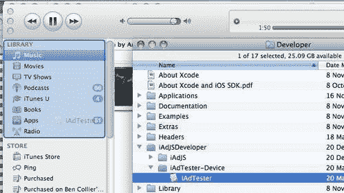

1.  这会将 iAd Producer 添加到您的 iTunes 库中，以便它可以同步到您的 iOS 设备。现在，使用 dock 连接线将 iOS 设备（如 iPhone 或 iPad）连接到您的 Mac。iTunes 应该现在可以识别设备，它将显示在侧边栏中。单击设备图标以打开概览，并将选项卡切换到 **Apps**。确保 **Sync Apps** 已选中，并在右侧的应用列表中找到 `iAdTester`；勾选复选框以选择它进行同步。您的 iTunes 应用程序页面应类似于以下屏幕截图：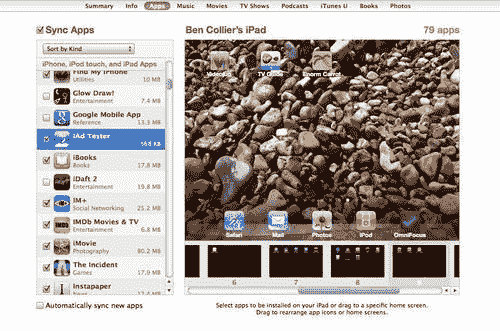

1.  点击**应用**并等待设备同步。现在 iAd Tester 应该已经安装。

    ### 注意

    你的 iOS 设备在任何时候只能与一台机器同步；如果你想与不同的机器同步，你可能会丢失设备上的媒体和应用程序。

1.  对所有需要测试的 iOS 设备重复此操作。

## 刚才发生了什么？

使用 iTunes，我们将 iAd Tester 复制到我们想要用来测试 iAds 的 iOS 设备上。你应该尝试在许多设备上测试，所以请在每个设备上安装 iAd Tester。

保持你的 iOS 设备连接并打开 iTunes，因为我们现在将查看如何使用 iAd Tester 导出和访问我们的 iAd。

## 访问你的开发 iAd

iAd Producer 允许你导出并复制你的 iAd 到设备，或者通过网络无线广播你的项目。让我们导出我们的 iAd 并将其复制到已安装 iOS Tester 的设备上。

### 复制到设备

我们可以使用 iTunes 将我们的广告复制到设备上。如果你没有无线连接或者想在远离 Mac 的地方演示你的 iAd，这很有用。

### 注意

如果你正在开会讨论你那令人兴奋的 iAd 的进展，将 iAd 复制到设备上意味着你可以在不需要 Mac 开机并连接到同一网络的情况下展示你的作品。

# 行动时间 — 导出我们的 iAd

在我们能够将我们的 iAd 复制到 iPhone 或 iPad 之前，我们需要导出我们的广告。

1.  在 iAd Producer 中打开你想要导出的项目，例如，我们在上一章中制作的 iPhone iAd `Dino Stores`。

1.  从菜单栏的*导出项*中选择**导出到磁盘（优化）**。现在选择一个位置导出你的 iAd 并保存。

### 注意

当你导出一个优化的广告时，iAd Producer 会自动生成两个额外的文件，`WebArchive.manifest`和`WebArchive@2x.manifest`。这些清单文件是 HTML5 的一部分，告诉网络浏览器或 iAd 框架，它们包含的所有文件名都应该下载以供离线使用。这意味着你的 iAd 中的内容在需要之前就开始加载，所以当用户浏览你的 iAd 时，广告内容会立即显示。优化的广告也被压缩，代码中的空白和注释被移除。

## 刚才发生了什么？

导出我们的 iAd 项目到 Mac 上的一个文件夹。现在我们已经有了正确的格式的广告，我们可以将其复制到设备上并开始测试。

# 行动时间 — 将我们的广告复制到设备

iTunes 的*文件共享*功能可以用来将我们的 iAd 复制到设备上，以便可以用 iAd Tester 打开。确保你使用的是启用了*文件共享*功能的最新版本的 iTunes——从菜单栏中选择苹果标志，然后**软件更新…**下载可能需要的任何更新。

1.  在 Finder 中找到您导出的 iAd；它应该是一个名为 `Your-Project-Name.ad` 的文件夹。如果您好奇，可以查看您导出的 iAd 的结构。iAd Tester 需要我们导出项目的压缩或压缩版本，因此右键单击包含导出的文件夹并选择 **Compress** `"Your-Project-Name.ad"`。以下屏幕截图显示了我们的 `Dino Store` 项目正在压缩：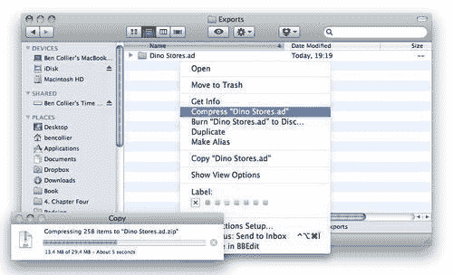

1.  在 ZIP 文件创建后，请检查 iTunes 是否已打开，并连接一个已安装 iAd Tester 的 iOS 设备。在侧边栏中单击设备以打开概览。现在，打开 **应用程序** 选项卡并找到底部的 **文件共享** 部分。

    ### 注意

    不要对您导出的 iAd 中的文件进行任何更改，例如修改资产，因为导出的项目无法再导入到 iAd Producer。

1.  在 **文件共享** 部分中选择 **iAd Tester**，使其高亮显示。现在，您可以将压缩的 ZIP 文件拖动到文档区域，或者点击 **添加** 并找到要复制的文件。文件现在将同步到设备。以下屏幕截图显示了我们将之前压缩的 `Dino Stores` 广告同步的过程：

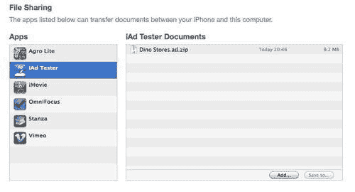

### 注意

如果 iAd Tester 没有出现在应用程序列表中，请确保它已安装。检查您的 iOS 设备主屏幕上的图标。如果没有，请尝试重新安装。

## 发生了什么？

我们现在已将我们的 iAd 传输到我们的设备，以便我们可以测试它。如果您想从 iPhone 或 iPad 删除广告（或任何文档），请在高亮显示文档列表中的项目并按 *Delete* 或 *Backspace* 键。

### 在设备上测试

一旦我们成功使用 iTunes 将我们的广告传输到 iPhone 或 iPad，我们就会想要运行并首次体验它。

# 操作时间 — 测试广告

在您的 iOS 设备上安装了 iAd Tester 并将广告传输到该设备后，我们现在可以打开并测试我们的广告：

1.  通过在主屏幕上点击其图标，从您的设备打开 iAd Tester。

1.  现在，点击 **On My Device** 以显示您使用 iTunes 文件共享复制到 iAd Tester 的 `Documents` 文件夹中的文件列表。

1.  选择您想要预览的 iAd；如果您使用的是 `Dino Stores` 项目，请从列表中选择 **Dino Stores**。

1.  iAd Tester 现在显示一个模拟应用程序，其中可能包含您的 iAd；点击横幅以开始与您的 iAd 交互。在这里，您可以看到您需要导航以演示广告的三个屏幕：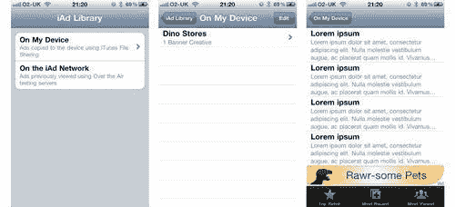

1.  如果您想关闭您的 iAd，只需点击左上角的 **X** 返回到模拟应用程序。如果您想更改您正在使用的广告，请从导航栏点击 **On My Device** 并选择不同的一个（如果有的话）。

## 发生了什么？

我们现在可以在实际设备上测试我们的 iAd；这是了解我们的广告在受限制的移动设备硬件上表现如何的关键。

只为了查看我们的广告就走了这么多步骤，所以让我们尝试使用 Wi-Fi 网络无线测试我们的 iAd。

### 无线测试

幸运的是，为了快速测试，我们不需要每次想要预览更新时都同步新版本的 iAd 到设备上。如果我们的 iOS 设备和运行 iAd Producer 的 Mac 在同一网络中，我们可以无线访问我们的项目。

# 行动时间 — 无线部署

iAd Producer 能够无线共享开放项目到 iAd Tester。在继续之前，请确保您的 iOS 设备和 Mac 连接到同一网络。

1.  打开 iAd Producer 和您想要测试的项目。确保项目与您正在测试的设备相匹配；例如，iPhone 项目只能在 iPhone 或 iPod touch 上可用。打开`交互演示`项目以在 iPhone 上测试它。

1.  一旦项目打开，我们需要启用无线共享。通过从菜单栏中选择**iAd Producer**，然后选择**偏好设置**，或使用键盘快捷键*Cmd* +*, (一个逗号)来打开偏好设置菜单。

1.  *从**偏好设置**菜单中，打开**测试**选项卡，并确认**启用设备上的 iAd 测试**滑块设置为**开启**。如果没有开启，将其滑动到开启位置。以下截图显示了您应该使用的 iAd 测试设置：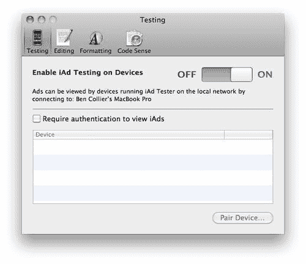

    ### 注意

    您还可以通过从菜单栏中的**iAd Producer**项使用**本地共享广告**选项来切换无线共享的开启和关闭。

1.  *现在您可以关闭偏好设置窗口，并在您的 iOS 设备上打开 iAd Tester。您在 iAd Producer 中打开的所有项目都将广播并可在 iAd Tester 中查看。*

1.  *从 iAd Tester 中，您现在应该看到一个**计算机**部分，其中应该列出您的电脑名称。点击您的电脑名称以查看打开的 iAd Producer 项目列表。*

    ### 注意

    如果您找不到您的电脑，请确保两个设备连接到同一网络。如果您找不到您的项目，请记住，在 iAd Producer 中尚未保存的新项目将显示为**未命名**。

1.  *选择您想要预览的广告。您现在将看到与使用 iTunes 文件共享在设备上保存的广告相同的相同模拟占位符应用。*

1.  *现在尝试在 iAd Producer 中修改您的广告并再次在 iAd Tester 中预览它。您可能需要关闭并重新打开广告以预览更新，因为设备需要下载更改。*

1.  *当您关闭 iAd Producer 或项目时，它将不再远程可用，直到您在 iAd Producer 中再次打开该项目。*

## *发生了什么？*

*iAd Producer 现在通过您的 Wi-Fi 网络本地广播您的 iAd，以便在运行 iAd Tester 的设备上访问。这是一种轻松测试您的广告，并且经常在真实设备上测试的好方法；尽可能使用它！*

## *尝试一下英雄 — 保护 iAd Producer*

*目前，任何连接到与您相同 Wi-Fi 网络的人都可以看到正在广播的广告。如果您在一个可信的网络中，比如您的家庭或办公室，这应该是安全的，但如果您在使用公共 Wi-Fi，您可以确保哪些设备可以访问您的 iAds。*

*尝试以下步骤：*

1.  *如果您还没有，打开 iAd Producer 并启用本地共享广告。*

1.  *从 iAd Producer 预设中，勾选 **查看 iAds 需要身份验证** 复选框。现在按 **配对设备..**。*

1.  *iAd Producer 将显示一个 PIN 码。在您的设备上打开 iAd Tester 并点击您的计算机名称；它应该在下面显示 **开放以配对**。输入 PIN 码。以下截图显示了示例 PIN 码：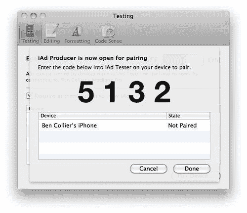*

1.  *对您想要配对的任何其他设备重复此操作。*

*您的 iAds 现在只能通过授权设备无线访问。或者，当您不想广告被广播时，可以切换到 **本地共享广告** 选项。*

### *注意*

*记住，iAd Producer 只广播当前打开的 iAd 项目；当您关闭 iAd Producer 时，您或您网络上的其他人将无法访问任何广告。*

*# 提交您的广告*

一旦您完成您的 iAd，您可以将它提交给 Apple iAd 网络，以便从实时服务器上进行测试。这很有用，因为它模拟了您的 iAd 在上线时将经历的精确交付流程，并允许您测试在蜂窝网络上的下载性能。

# 行动时间 — 在网络上发布

要启用您的账户以使用 iAd 测试服务器，您需要联系 Apple，他们可以启用您的 Apple ID 以进行测试。您只能在 iAd 制作的最后阶段，并且有 Apple 的 iAd 账户经理时才能这样做。

1.  选择 **导出**，然后 **上传到 iAd 测试服务器**。您需要使用您的 Apple ID 登录。然后会出现 **上传选项** 对话框。

1.  输入您的 iAd 的详细信息，例如广告名称和描述。

    ### *注意*

    如果您上传的广告名称与现有广告相同，它将被覆盖；为了避免这种情况，请确保您使用一个独特的名称。

1.  点击 **上传**，您的 iAd 将开始上传到测试服务器。在上传过程中，您无法编辑广告，但您可以继续工作在其他 iAd 项目上。

1.  上传完成后，您可以将通知邮件发送给您的团队，告知他们 iAd 已在测试服务器上可用。邮件中包含用于在您的设备上查看广告的说明。

## 发生了什么？

您刚刚将您的广告上传到 iAd 测试服务器；这使您能够精确复制您的 iAd 将加载的条件，例如网络速度和延迟问题。您现在应该在所有可能的连接方式上测试您的 iAd，例如 Wi-Fi、蜂窝网络和差的网络信号。

## 快速问答 — 在何时测试什么

虽然在可能的情况下最好在设备上进行测试，但当我们对 iAd 进行快速迭代时，通常更容易以其他方式预览我们的广告。看看您能否在这些情况下提出最合适的方法：

1.  如果您想测试 iAd 中的按钮，哪种方法最好使用？

    +   a. Safari。

    +   b. 总是在设备上测试。

    +   c. iAd Producer 的画布预览。

    +   d. iOS 模拟器。

1.  您更改了其中一个元素的动画，并想看看它的效果，您会使用哪种方法？

    +   a. 设备。

    +   b. 模拟器。

    +   c. Safari。

    +   d. 画布。

    +   e. 上传到 iAd 测试服务器。

1.  您导入了一些额外的资产，并想检查它们是否已正确缩放；您会使用以下哪种方法？

    +   a. iAd Producer 的画布预览。

    +   b. 一台设备。

    +   c. Safari。

    +   d. iOS 模拟器。

# 解决常见问题

您需要确保您的 iAd 符合苹果公司的法规和指南，并了解如何在 iAd 开发过程中解决可能出现的常见问题。让我们看看如何查找潜在问题，并克服您可能会遇到的一些问题。

## 验证您的广告

您可能省略了 iAd 中所需的某些元素或设置，或者您的资产大小可能超出了苹果公司的指南。幸运的是，iAd Producer 能够发现您广告中可能阻止其正确工作的潜在问题，并提出改进建议以提高广告的性能。

# 行动时间 — 验证您的 iAd

当您在 iAd Producer 中处理项目时，您可以随时检查广告的状态。

1.  在 iAd Producer 中打开您想要验证的项目，例如，本书资产中的验证示例。

1.  项目打开后，从菜单栏选择 **导出**，然后 **显示项目警告**。这将打开 **项目报告** 窗口。以下是一个 **项目报告** 的示例：

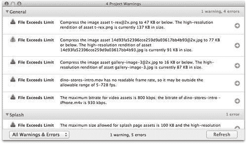

报告按一般和页面特定问题拆分，分为两个部分：

+   错误—用红色圆形图标突出显示

+   警告—用橙色三角形图标突出显示

错误意味着项目无效，并且未经纠正不会被苹果公司接受进入 iAd 项目。警告是建议和提示，表明您可能遗漏了某些内容，或提供了改进您 iAd 的方法。警告不会阻止您的 iAd 被苹果公司接受，但重要的是，如果可能，检查并修复它们。

让我们先修复项目中的错误。

1.  如果您正在使用示例广告，您会注意到错误是由于我们其中一张图片的文件大小引起的。我们可以通过使用 **Preview** 调整图片到正确的大小，并用 **ImageOptim** 优化图片来修复这个问题。每次我们在 iAd Producer 之外更新资产时，我们都需要告诉它更新其本地副本。

    ### 注意

    当您将资产添加到资产库时，iAd Producer 会为每个资产创建一个副本并将其保存在您的项目中。

1.  要使用 iAd Producer 底部的左下角的**资产**按钮刷新我们的资产库，以获取资产的最新版本。已更新的资产旁边有一个圆形箭头；右键单击资产并选择**更新**。确认您要更新文件，更新后的资产现在将出现在您的库中。在下面的屏幕截图中，我们可以看到一个资产更新确认的示例：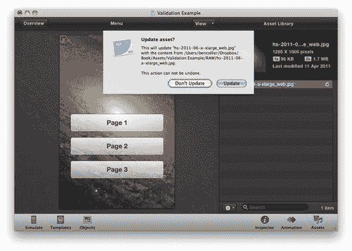

1.  如果您正在使用示例项目，请重新打开**项目报告**；现在它应该不再有文件大小错误。

### 注意

如果**项目报告**仍然显示您已修复的错误或警告，请尝试点击底部的右下角的**刷新**按钮。报告通常会自动更新，但有时您需要强制它检查您的项目。

一旦修复了项目中的所有错误，请查看剩余的警告。示例项目有几个警告，大多数像“名为'页面 1'的页面没有更改”。这个警告是由于我们没有应用模板或更改此页面而生成的。逐个检查每个“未更改”的错误，并添加一个模板和一些自定义内容。

其他常见警告包括：

+   "在'Preroll Video'页面上的具有出口'video'的对象缺少一个或多个必需属性": 如果您的广告中没有预滚动，可以安全地忽略此警告；如果您有，请确保您已将视频添加到启动页面的预滚动选项卡中。

+   "图像资源'image-name'的高度/宽度大于包含组件 ImageView1 的高度/宽度": 这意味着图像的尺寸大于包含它的视图的尺寸，因此您可以调整图像的大小（并减小文件大小），因为图像比所需的要大。

如果您无法修复所有警告，只要您知道它们并且意识到其影响，就不用担心。

## 刚才发生了什么？

我们刚刚在 iAd Producer 中使用了项目报告工具来突出显示阻止项目被苹果接受的错误，并修复了一些可能影响广告性能的警告。您也可以从广告概览的检查器面板中找到**项目报告**工具。现在，我们可以查看项目报告未检测到的问题。

## 故障排除常见问题

在构建您的 iAd 时，您可能会遇到一些常见问题；以下是一些可能的解决方案。

### 关于图像文件大小的警告

*我已经减小了图像的大小，但 iAd Producer 仍然显示警告或错误*。

通过确保使用正确的图像类型可以减小大图像的大小；例如，如果你不需要透明度，确保你的图像使用 JPG 格式。在预览中保存 JPG 图像时，我们可以提高压缩级别以减小文件大小。从预览的菜单栏中选择**文件**，然后**另存为**，并调整质量滑块，直到图像大小减少到可接受的水平。然而，要注意，过度降低图像质量可能会导致图像出现块状和像素化。尝试不同的质量水平，直到找到可接受的权衡。在下面的屏幕截图中，你可以看到保存图像时质量和文件大小对话框的示例：

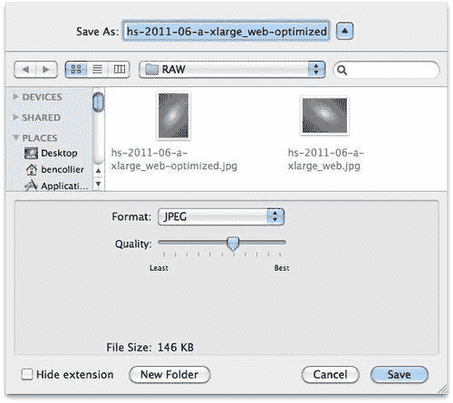

### 慢速性能

*我的广告在模拟器上表现很好，但在设备上真的很慢*。

你的 Mac 比你的 iOS 设备拥有更多的资源和功率（尽管它们正在迅速追赶），所以在设备上测试时你可能会看到一些性能下降。

### 注意

这就是为什么你应该在整个开发周期中经常在设备上测试。你将能够及早发现问题并追踪原因。同时，也要确保在不同的设备型号上进行测试，因为某些设备的性能比其他设备更强。

通常，可以通过隔离减慢广告速度的组件来优化你的 iAd 性能；检查以下元素：

1.  **大阴影**：每个阴影都必须动态地绘制到你的 iAd 上，而较大的阴影生成需要更长的时间。如果你看到性能不佳，尝试减少阴影的距离和模糊度。

1.  **缓慢或跳跃的动画**：如果设备中没有足够的功率重新绘制运动每一帧，对象将不会平滑地动画化。通常，这会在你同时进行太多动画，或者动画元素应用了太多样式时发生。尝试减少同时动画的项目数量，并移除或减少如阴影、反射或透明度等密集样式。

1.  **图像仅短暂显示部分内容**：这通常是由于你的 iAd 没有预取广告使用的资产。iAd Producer 仅对导出的优化广告启用预取，所以当你在你 Ad Test Server 上测试广告时，你不应该经常看到这种情况。

### 注意

即使你的导出 iAd 已经优化，你仍然可能会看到图像在下载过程中部分出现。优化的广告会在需要之前开始下载资产；但是，如果你连接速度慢，或者有大量资产，它们可能在你需要之前没有下载完成。

### 导入的图像看起来很小

*当我用 iAd Producer 打开图像时，它们比我预期的要小*。

iAd Producer 假设你正在导入用于视网膜显示屏的高分辨率图像，因此它将你的图像可见大小减半以适应这一点。你应该始终以你想要它们显示的水平和垂直分辨率的两倍导出你的图像。

例如，如果你有一个全屏图像，以 960px by 640px 导出它，这是 480px by 320px 标准屏幕尺寸的两倍。

你应该尽量保持源图像尽可能大，因为缩小图像很容易，但如果没有损失质量，则无法将其放大。

### iAd 测试器没有显示任何广告

*我的广告在无线共享时没有出现在 iAd Tester 中*。

如果你无法在 iAd Tester 中看到你的广告，请确保你想要分享的项目已在 iAd Producer 中打开。只有打开的项目才会通过你的无线网络广播。如果你在 iAd Producer 中打开了项目，请确保它正在共享你的广告项目——你可以从菜单栏中的 iAd Producer 项打开本地共享。

如果 iAd Producer 确实正在广播你的开放项目，但你仍然无法在 iAd Tester 中看到你的电脑，请确保你的 iOS 设备和 Mac 连接到同一网络。

# 行动时间 — 检查你连接的网络

假设你的 Mac 无线连接到你的网络；如果它有有线连接，你需要确保你的 iOS 设备连接到同一接入点。

1.  在你的 Mac 上，点击菜单栏中的 Wi-Fi 图标以显示可用的网络。注意旁边有勾选的网络名称；这是当前连接的无线网络。

1.  在你的 iOS 设备上，打开**设置**；然后，从菜单中选择**Wi-Fi**项。现在这将显示一个类似的可用的网络列表。检查是否有勾选与你的 Mac 连接到同一网络的网络名称；如果没有，点击该网络名称以连接设备。你可能需要输入网络密码才能访问网络。在下面的屏幕截图中，你可以看到 iPhone 和 Mac 的设置：

## 发生了什么？

我们刚刚检查了我们的 Mac 和 iOS 设备连接到同一网络，这样 iAd Producer 和 iAd Tester 就可以成功连接到对方。

如果你仍然无法访问你的 iAds，你可能已经打开了 iAd Producer 中的身份验证设置；要么配对设备，要么从 iAd Producer 首选项中关闭身份验证。

# 分享演示

当你开发你的 iAd 时，你可能想与同事分享你的进度，以获取评论和建议。我们可以分享我们的 iAd 快照，录制快速屏幕演示，甚至与团队的其他成员共享正在进行的广告。

## 捕获屏幕截图

为了快速直观地展示我们的 iAd，我们可以截图其中一个屏幕。

# 行动时间 — 捕获屏幕截图

我们可以在 iOS 设备上或通过使用 Mac 的模拟器来截取屏幕截图。

1.  要在我们的 iOS 设备上截取屏幕截图，打开您想要捕获的屏幕，例如在 iAd Tester 中的广告页面。

1.  找到主屏幕按钮（屏幕底部中央的圆形按钮）和锁定按钮（用于关闭设备的顶部按钮），同时按下这两个按钮。您应该听到相机咔嚓一声，屏幕会短暂地变白。如果这没有发生，请再次尝试并确保您同时精确地按下它们。

1.  这会将整个屏幕图像的副本保存到您的相机胶卷中，您可以在 iOS 设备上的照片应用中找到它。打开您刚刚拍摄的图片，您可以通过电子邮件发送图片。

1.  如果您想在 Mac 上截取屏幕截图，请在 iOS 模拟器中打开您的 iAd。一旦您得到了想要分享的广告页面，按下键盘上的 *Cmd* + *Shift* + *4*。现在您可以点击并拖动您想要捕获的屏幕区域，或者按下 *空格键* 并点击高亮的模拟器，这将只捕获该窗口。

    ### 注意

    您也可以通过在键盘上按下 *Cmd* + *Shift* + *3* 来截取整个屏幕的截图。

1.  您的截图将保存为 PNG 文件在您的桌面上。您可以通过将其拖动到电子邮件客户端来与同事分享。

## 刚才发生了什么？

您现在可以在您的 Mac 和 iOS 设备上截取屏幕截图。这些快捷键不仅限于 iAd Tester；您能够捕获您想要的任何屏幕或应用。

如果您需要展示您的 iAd 中的动画和交互，我们可以录制屏幕演示与您的团队分享。

## 录制屏幕演示

屏幕演示是记录 Mac 屏幕上动作的短片。如果您想要向没有访问 iAd Tester 或 iOS 设备的团队成员发送工作进度演示，屏幕演示非常有用。

# 行动时间 — 开机，摄像头，行动

目前还没有简单的方法来记录我们 iOS 设备的输出，因此我们将使用 iOS 模拟器和 QuickTime 来录制我们的 iAd。

1.  在 iOS 模拟器中打开您的广告，确保您的广告没有完全打开，这样只显示横幅。

1.  现在，从 `应用程序` 文件夹中打开 **QuickTime Player**。从菜单栏中选择 **文件**，然后选择 **新建屏幕录制**。

1.  QuickTime 将会显示一个包含红色录制按钮的窗口。当您想要开始录制时，点击此按钮。以下截图显示了带有说明对话框的 **开始录制** 窗口：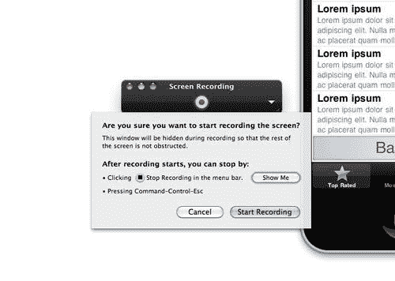

1.  在录制之前，QuickTime 将会显示如何停止视频的说明；您可以使用菜单栏中的 **停止录制** 项或键盘快捷键 *Cmd* + *Ctrl* + *Esc*。

1.  点击 **开始录制** 并开始与您的 iAd 互动。一旦您获得了想要的素材，停止录制。

    ### 注意

    使用键盘快捷键意味着你的视频不会以你试图找到停止按钮而结束！

1.  QuickTime 现在将显示你的屏幕录制，准备播放。检查视频；如果你对它满意，请从菜单栏中选择**文件**，然后**另存为..**。如果你想再次尝试录制视频，请关闭此电影并开始新的屏幕录制。

## 刚才发生了什么？

使用 QuickTime，我们能够录制屏幕内容以制作演示视频并与我们的团队分享。QuickTime 创建的屏幕截图以`.mov`文件格式保存，采用 H.264 格式，应在大多数现代视频播放器中可播放，并在许多移动设备上可播放，例如基于 Android 和 iOS 的设备。

## 尝试英雄般的演示——创建一个演示

为什么不尝试与同事或朋友分享你的 iAd 录音呢？你可以：

+   录制你的 iAd 的每一屏并与元素互动

+   使用模拟器硬件控制来显示不同的方向和摇晃事件

+   在录制演示时，将 iOS 模拟器更改为标准、非视网膜设备，因为它会在模拟器外部提供一个更好的设备框架

+   将你的 Mac 背景设置为纯白色，以获得更专业的效果

+   下载 PhoneFinger，一个可以将鼠标光标替换为手的工具，以获得更真实的演示。它可以从[`wonderwarp.com`](http://wonderwarp.com)免费下载

+   通过从 QuickTime 导出你的广告与你的团队分享

现在，你能够创建一个出色的 iAd 演示；你还可以使用这些技术来创建你完成 iAd 的促销材料。

## 分享一个广告

你可以将你的 iAd 与任何在其设备上安装了 iAd Tester 的人分享。使用 iAd Producer 导出优化的 iAd；压缩文件夹，就像你使用 iTunes 文件共享测试你的 iAd 一样，但不是将其复制到你的设备上，而是将`.zip`文件发送给你的团队。

# 摘要

我们现在能够以各种不同的方式测试和分享我们的广告，并知道在正确的时间使用最有用的技术。你现在可以：

+   使用 iOS 模拟器模拟你无法访问的设备和 iOS 版本

+   快速无线测试你的设备，以便离线使用

+   解决你可能遇到的一些常见问题

+   分享你的 iAd 的快照和视频演示

在下一章中，我们将探讨模板的高级使用，以提供丰富的功能，例如视频和壁纸选择器，以及动画和过渡效果，以增加我们广告的情感表达和响应能力*。
