# 第六章。广告目的地和操作

> 在创建了一个令人兴奋的广告，让用户对我们的产品或品牌感到兴奋之后，我们需要引导他们执行对我们有益的操作。

在本章中，我们将探讨：

+   为什么我们不应该直接将用户重定向到我们的网站

+   销售我们的数字内容，如应用程序和音乐

+   将我们的商店查找器提升到下一个水平

+   优化我们的广告结构

+   使用短信文本消息与我们的品牌进行社交互动

# 打开外部网站

移动设备上的传统广告通常由横幅组成，点击横幅会将用户带到他们的移动浏览器，并经常加载一个完整且杂乱的桌面网站。创建一个 iAd 则不同，因为您有一个完整的框架来构建一个微型应用程序，所有这些都在主应用程序内。使用 iAd 框架和 iAd Producer，您可以在我们的 iAd 中创建相同甚至更好的集成体验。

将您的 iAd 视为一个您绝对不希望用户离开的微型网站。让我们探讨我们可以在 iAd 内实现的目的地和用户操作，避免将用户带到您的主站。

# 销售数字产品

我们可以直接在我们的 iAd 中销售数字产品，如歌曲、电影或应用程序，而无需用户离开他们所在的广告或应用程序。只要您的项目在 iTunes 商店有售，它们就可以包含在 iAd 中。

### 注意

当用户从您的广告中下载数字内容时，您将获得与直接从商店购买相同的收入。

# 执行动作 — 从我们的广告中下载应用程序

在 iAd Producer 中使用**购买**模板，我们将为上瘾的免费应用程序`Bouncing Balls`添加一个**购买**页面。

我们将继续使用我们在上一章中工作的`Coffee Beans`项目。在 iAd Producer 中打开它。

1.  让我们添加一个额外的页面作为我们的**购买**页面。从广告概览中，点击显示菜单和页面之间关系的线条上的加号图标，如以下截图所示：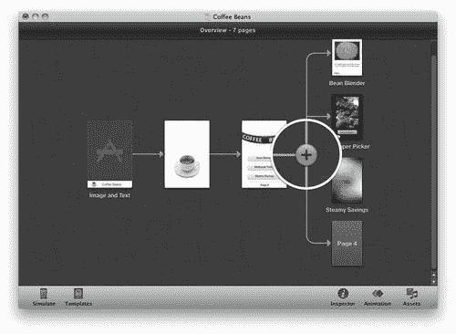

1.  双击新创建的页面，标记为**页面 4**，以打开模板选择器。选择**购买**模板，然后再次双击页面以在编辑画布上打开它。您将看到一个占位符产品页面，类似于在 iOS 应用商店中看到的页面。

1.  如果检查器面板尚未打开，请打开它，然后在画布上的任何位置单击以选择由模板自动添加到页面的商店视图对象。展开**属性**部分，以显示我们需要为此广告页面配置的设置。

1.  你会看到我们需要提供我们的项目可用的**国家**、**Store ID**以及 iTunes 分配给项目的唯一 ID，这样模板就知道我们想要销售哪个项目。现在，使用`358992973`作为**Store ID**并从列表中选择你的国家：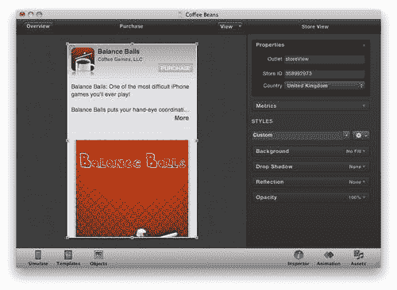

1.  你应该看到画布更新以显示**平衡球**应用程序。如果你选择一个国家时项目没有出现，尝试选择**英国**或**美国**，因为内容可能目前在你所在的国家不可用。稍后我们将探讨如何从 iTunes Store 获取你自己的内容的**Store ID**。

1.  在设备上测试广告并尝试购买项目；你将被要求输入你的 iTunes 账户密码。如果你不想完成交易，在此步骤上点击**取消**。在 iOS 模拟器中无法下载或购买商店项目，因为它不允许访问受许可的内容。

    ### 注意事项

    注意：如果你正在测试下载非免费项目，即使它是你自己的产品或内容，你也将被收费。

1.  如你所见，我们几乎不需要做什么就能创建一个伟大、快速且无缝的方式让用户下载我们的内容。通常你不会为此页面进行样式设计，因为它与 iTunes 和 App Store 的购买体验保持一致。所以，保持原样并保存你的 iAd 项目。

## 刚才发生了什么？

我们在我们的 iAd 中添加了一个额外的页面，使用 iAd Producer 中的广告画布上的加号按钮。你可以使用加号按钮添加尽可能多的页面到你的 iAd 中，但尽量保持总数不超过五个，以防止你的广告显得过于拥挤。

使用一个示例`Store ID`，我们能够让我们的 iAd 用户直接在广告内购买或下载应用程序，而无需离开广告。应用程序将在后台下载并自动出现在用户的设备主屏幕上。现在，让我们看看如何将你自己的 iTunes 内容添加到**购买**模板中。

# 操作时间 — 获取 iTunes Store ID

我们可以使用 iTunes 中的内置商店获取**购买**模板所需项目的**Store ID**：

1.  要访问 iTunes Store，打开 iTunes。你可以在 Mac 的`应用程序`文件夹中找到 iTunes。双击图标以打开它。

1.  在 iTunes 的侧边栏中，点击在**商店**标题下找到的**iTunes Store**项目，如下面的截图所示：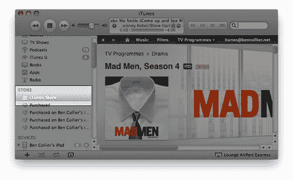

1.  在 iTunes 主栏的右上角找到搜索商店文本区域。输入你想要查找 ID 的内容，例如，苹果的 iBooks 应用程序。按*Enter*键进行搜索。

1.  现在，你会看到一个搜索结果列表；找到你的项目，点击价格旁边的箭头，并选择**复制链接**。这将把你的项目链接复制到你的剪贴板：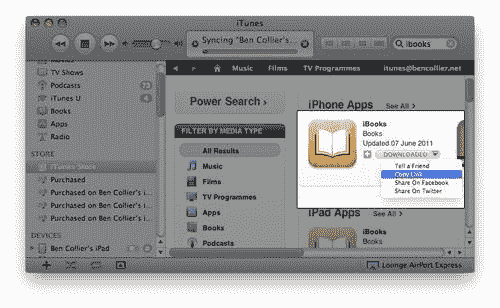

1.  现在，我们需要粘贴链接，以便我们可以从中提取存储 ID。打开 TextEdit，这是随你的 Mac 一起提供的文本编辑器。你应该能在`应用程序`文件夹中找到它。一旦打开，你应该会看到一个大的白色文本区域；右键单击它并选择**粘贴**，或者使用键盘快捷键*cmd* + *V*。你会看到我们刚刚复制的链接出现。该链接是一个你可以分享的网站 URL；点击时它会自动打开 iTunes Store。

    ### 小贴士

    如果你不能选择**粘贴**，或者如果出现了链接以外的其他内容，请回到 iTunes 并再次复制链接。

1.  你会在链接的末尾找到存储 ID。以[`itunes.apple.com/gb/app/ibooks/id364709193?mt=8`](http://itunes.apple.com/gb/app/ibooks/id364709193?mt=8)为例。在这个链接中，ID 是`id`之后和`?mt=8`之前的数字字符串，所以你会使用`364709193`作为存储 ID。现在尝试打开`咖啡豆`项目并更新存储 ID 为 iBooks ID。

1.  现在，让我们尝试查找一首歌；回到 iTunes 并搜索一首歌，例如 RJD2 的《美丽矿》。从搜索结果中找到你想要的项目，并复制链接。将链接粘贴到 TextEdit 中；它应该看起来像这样：[`itunes.apple.com/gb/album/a-beautiful-mine/id148031770?i=148032644`](http://itunes.apple.com/gb/album/a-beautiful-mine/id148031770?i=148032644)。

    对于歌曲，你只能提供单个曲目供购买，而不是整个专辑，因此我们需要歌曲的项目 ID。单个歌曲 ID 位于`i=`之后，所以对于这个项目，它将是`148032644`，而不是其他 id，后者用于识别整个专辑。

    我们也可以在我们的广告中提供电影供购买，例如，复制《第九区》的链接并将其粘贴到 TextEdit 中。电影链接看起来像[`itunes.apple.com/gb/movie/district-9/id331251689`](http://itunes.apple.com/gb/movie/district-9/id331251689)。像应用链接一样，此电影的存储 ID 位于链接末尾的`id`文本之后；此项目的 ID 是`331251689`。尝试在 iAd Producer 中使用此 ID 更新存储 ID，以查看电影和电影的购买模板如何显示。 

    ### 注意

    一些内容，尽管在你的国家 iTunes Store 中可见，但在 iAd Producer 或测试你的 iAd 时可能显示不正确。尝试暂时将国家更新为**美国**以修复此问题。如果你继续遇到问题，请联系你的 Apple iTunes Store 代理或开发者支持。

1.  最后，可以包含书籍——它们的 ISBN 用作存储 ID，但书籍必须在 iBook Store 中有售。例如，要找到《宝岛》的存储 ID，复制链接并将其粘贴到 TextEdit 中。链接看起来类似于[`itunes.apple.com/gb/book/treasure-island/id370190362?mt=11`](http://itunes.apple.com/gb/book/treasure-island/id370190362?mt=11)，存储 ID 位于`id`之后，在这个例子中是`370190362`。

## 刚才发生了什么？

我们使用 iTunes 和 iTunes Store 来查找项目的 Store ID，这是 iAd Producer 中**购买**模板所必需的。您可以在需要获取商店中自己的项目 ID 时使用此技术。

根据您拥有的数字内容，在广告中推广时，考虑免费提供或打折。让我们调整我们的广告，因为我们不小心在添加**购买**页面时创建了一些不一致性。

# 行动时间 — 修复我们的广告

由于我们为“咖啡豆”项目使用的菜单模板会在我们添加或删除页面时自动更新，因此我们无需做任何操作来更新它。然而，我们还需要进行一些调整：

1.  继续使用我们的“咖啡豆”项目，确保它在 iAd Producer 中已打开。在编辑画布上打开**购买**页面。

1.  iAd Producer 已自动将我们的页面命名为**购买**，这对我们的用户来说并不特别吸引人。在没有选择任何对象的情况下，展开检查器，并在**属性**中将页面重命名为，例如“获取应用！”。这使用了一个行动号召，请求并鼓励用户遵循您的指示。

    在下面的屏幕截图中，您可以查看**属性**部分和**名称**字段：

    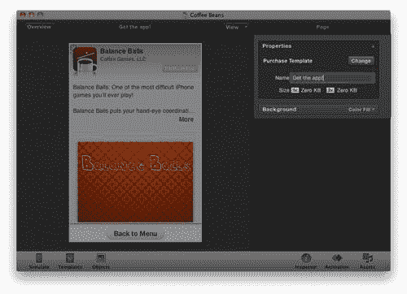

1.  返回到广告概览并打开画布上的菜单。您会看到文本已更新以匹配页面的新名称，但其他按钮的样式尚未应用到我们的新菜单项上。整个菜单对象在屏幕底部也被截断了。

1.  点击菜单对象，将其拖动到页面上方，以确保最后一个按钮不被遮挡。您可能还需要通过拖动底部的拖动手柄来调整菜单的大小，以适应我们添加的额外按钮。

1.  接下来，我们将更新按钮的样式，使其与其他按钮匹配。选择菜单后，双击第一个按钮进入编辑模式；然后，再次单击按钮以选择它。这可能需要尝试几次。一旦选中，如果尚未展开，请展开检查器面板，并单击**应用样式到所有按钮**，如以下屏幕截图所示。这会将样式复制到菜单中的所有其他按钮，使它们匹配并保持一致：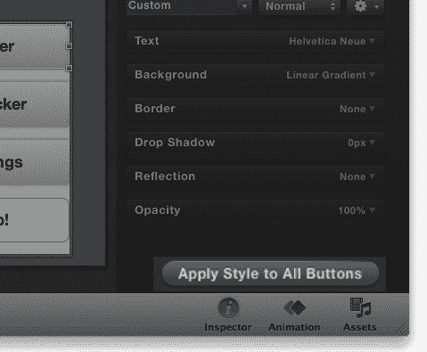

    +   现在按钮与其它按钮匹配后，让我们在设备或 iOS 模拟器上测试我们的广告。

1.  您可能已经注意到，我们无法从**购买**页面返回，因为菜单项缺失。它位于页面上，但隐藏在页面上的购买对象后面，因此我们需要将商店项目发送到页面的背面。在广告画布上打开**购买**页面，并单击购买对象以选择它。右键单击并选择**发送到背面**。现在菜单按钮应该出现了。

1.  如果您在上一个章节中为菜单项保存了样式，请务必从样式预设列表中选择该样式。

1.  不幸的是，我们的菜单项的位置干扰了购买对象的内容，如以下截图所示。让我们重新构建页面以适应它：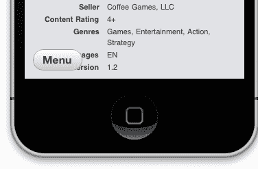

1.  通过调整购买对象的大小，我们可以在 iAd 的底部创建一个专用区域，包含返回按钮。点击购买对象，并拖动底部的拖动手柄，使其位于**菜单**按钮上方。

1.  现在通过拖动将其移到屏幕中间以居中菜单按钮。考虑更新文本为`返回菜单`，并调整按钮大小，使其占据广告底部更多的空间。

1.  将页面背景改为颜色填充并设置为白色；这将使可滚动的购买对象和**返回菜单**按钮分开。

1.  重新选择购买对象，并添加一个阴影以进一步分隔页面的两个部分。

1.  最后，给按钮和购买对象添加进入和退出动画。购买视图在进入时**从顶部移动进入**，在退出时**向顶部移动退出**。菜单按钮在进入时**从底部移动进入**，在退出时**向底部移动退出**。当你选择一个对象时，你可以在动画面板中找到进入和退出部分。

1.  在 iOS 模拟器或你的设备上的 iAd 测试器中打开你的 iAd，检查我们是否能够按照预期进行交互。你的最终**购买**页面应该看起来像这样：

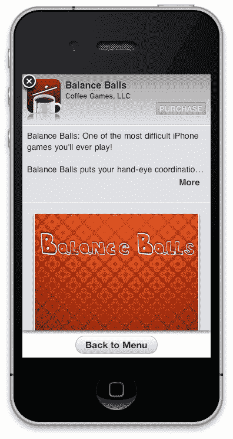

## 刚才发生了什么？

由于给我们的 iAd 项目添加一个额外的页面在主菜单上造成了一些样式问题，并阻止了我们的应用导航按预期工作，我们重新应用了按钮样式到单元格，并重新设计了**购买**页面，以包含一个**返回菜单**按钮。

## 突击测验 — 数字下载

你可以从你的 iAds 中的可下载内容中产生巨大的认知度或收入，所以让我们检查你是否做对了：

1.  如何获取 iAd Producer 中购买模板所需的数字项目的商店 ID？

    +   a. 只使用项目的名称。

    +   b. 发送电子邮件给苹果，请求你的项目 ID。

    +   c. 打开 iTunes 并使用商店中的复制链接菜单项。

    +   d. 购买该项目，查看我们的收据；ID 就在价格旁边。

1.  这首歌的链接的商店 ID 是多少—`http://itunes.apple.com/gb/album/a-beautiful-mine/id148031770?i=148032644?`

    +   a. a-beautiful-mine

    +   b. id148031770

    +   c. 148031770

    +   d. 148032644

正如你所见，无论是音乐、电影还是应用，销售数字内容都极其简单。只需三下操作，用户就能购买你的产品，并且它将出现在他们的 iOS 设备上。你也可以为你的公司创建一个免费应用，提供比 iAd 更丰富的体验，并持续出现在用户的主屏幕上，让他们可以持续与你的品牌互动。

# 高级商店搜索器

并非所有产品都是数字的；有时您想增加实体店铺的客流量。之前，我们将基本的商店搜索器整合到了 iAd 中；现在，我们将扩展这一功能，以提供出色的体验，吸引用户到您的店铺。

# 行动时间 — 添加商店搜索器

我们将在`Coffee Beans` iAd 中添加一个商店搜索器，以便用户可以找到当地商店并购买一些优质的咖啡：

1.  打开我们在 iAd Producer 中一直在工作的`Coffee Beans`项目。我们将首先为我们的 iAd 添加一个额外的页面。从广告概览中，使用加号图标向项目添加一个额外的页面。双击新页面以打开模板选择器并选择**地图**。双击新页面以在广告画布上打开它。

1.  我们首先要做的是添加一个**自定义标记**；这将显示在我们用户附近的每个商店的地图上。打开检查器面板并展开**属性**部分；从**自定义标记**下拉菜单中选择标记图像，例如，**coffee-cup-pin.jpg**。我们将调整偏移量以使图像居中在蓝色位置十字准线上——更改 X 和 Y 偏移量，直到您的标记位于十字准线上。大约 8px 的 X 偏移量和 5px 的 Y 偏移量应该与这张图片很好地配合。您的对齐标记应该类似于以下：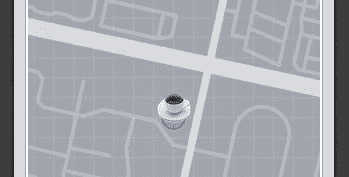

1.  如果您有一个网站 ID，现在请输入它；如果没有，只需使用显示最近苹果商店的演示 ID。

    ### 注意

    在您将 iAd 提交给苹果之前，您需要联系他们以设置您自己的网站 ID 以显示您的商店位置。

1.  现在，双击页面标题，即**位置**标签，并将文本更新为更友好的内容，例如，`查找您最近的杯子..`。您应该更新背景以匹配您的广告其余部分，在这种情况下，到一个**白色**的填充色。

1.  调整地图区域的大小以填充屏幕宽度，并可能添加您选择的阴影和边框。

1.  预览您的 iAd；您会看到我们现在在广告中有一个基本的商店搜索器。然而，点击一个标记会显示一个简单、默认样式的详情页面。返回到 iAd Producer 并切换到**地图详情**视图，使用画布顶部的切换按钮：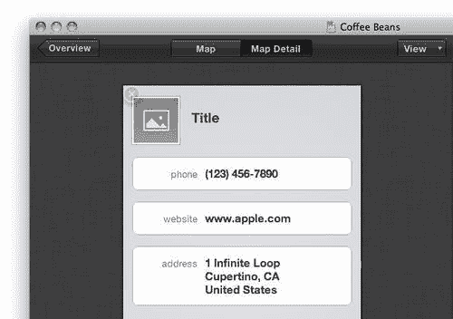

1.  通过将此页面风格与我们的广告其余部分保持一致，我们将创建一个一致的经验。将**背景**设置为**颜色填充**，并将颜色设置为**白色**。在标题旁边的图像占位符对象中添加一个图像；**coffee-cup-small.jpg**在这里效果很好。

1.  将图像**beans 3-dark-roast.jpg**从**资产库**拖动到画布上。将其发送到页面后面的所有其他对象之后，并将其移动到屏幕底部。

1.  信息区域的全白色背景与我们的白色背景或图像不太搭配。我们可以更改**背景、边框、不透明度**和**阴影**，以改善它们的样式。点击包含电话号码的第一个信息区域。然后，从检查器中展开**背景、边框、不透明度**和**阴影**部分。将**背景颜色填充**设置为浅灰色，例如来自蜡笔选择器的*Mercury*颜色。将**边框**设置为 2px 宽，并将其颜色改为比背景稍暗，如蜡笔选择器的*Silver*。将检查器底部的**不透明度**设置为，比如说，**90%**。这将允许图像稍微透过我们的信息区域：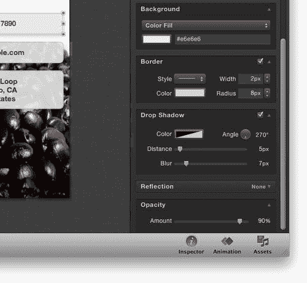

1.  在第一个信息区域样式化后，让我们使用样式预设将其样式复制到其他区域。在**样式**标题下，点击齿轮按钮并选择**保存**。为样式输入一个名称，例如“地图详情信息区域”，然后点击**确定**。现在，选择其他信息区域并将该样式预设应用到它们上。

    ### 注意

    我们不需要更新**地图详情**视图中的**标题**文本区域中的文本，因为当用户点击打开商店时，iAd 框架会自动设置。

    +   您的最终页面可能看起来像这样：

    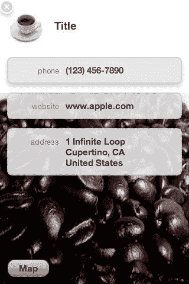

1.  保存您的广告并在 iOS 模拟器或您的设备上测试它。

## 刚才发生了什么？

我们添加了一个基本的商店查找器，使用了**地图**模板，然后对其进行了样式化和定制。在**地图**页面样式化后，我们通过添加几张图片并重新设计信息框来改变原始的默认商店详情页面。现在，找到您的商店将几乎和在其中一样好！

随着我们的广告内容变得更加丰富，包含许多页面，我们可能想要隐藏某些页面，并从广告的其他部分以子页面的形式访问它们。现在我们将看看如何在我们的广告中包含隐藏页面。

# 行动时间 — 隐藏页面

如您所见，我们的菜单中项目太多，第一页看起来杂乱无章。让我们制作自己的自定义菜单，并使商店查找器页面作为广告的隐藏子页面可访问。

1.  我们将继续使用我们的咖啡豆示例；如果它还没有打开，请在 iAd Producer 中打开您的“咖啡豆”项目。从**概览**中，在画布上打开**菜单**页面。您将看到我们的最后一个菜单项；商店查找器从页面中裁剪出来，如下面的截图所示：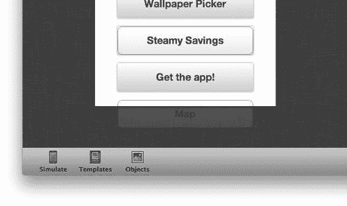

1.  我们可以将菜单向上移动，但这会产生一个杂乱无章且令人不知所措的初始屏幕来展示给用户。相反，我们将创建自己的导航菜单，使用按钮对象，并将地图页面按钮放置在**Steamy Savings**页面中，使其从主菜单中隐藏。

1.  返回到**广告概览**，并在画布上打开**蒸汽储蓄**页面。在我们能够向此页面添加任何内容之前，我们需要暂时将`Wipe Clear`对象从画布上移开，以便访问页面对象。单击`Wipe Clear`对象并将其拖离主画布，到页面左侧或右侧。我们将在编辑完页面后将其移回原位。

1.  在移除`Wipe Clear`后，选择并拖动**优惠券代码**和**优惠券**区域向上移动到咖啡杯附近；这将为我们**地图**按钮腾出一些额外空间。如果您之前已经添加了它，请选择**在店内展示优惠券代码**文本标签并删除它，使用键盘上的*删除*或*退格*键；我们将用商店查找按钮替换它。

1.  打开**对象库**并选择**按钮**。这将向画布添加一个空按钮；调整大小并移动此按钮，使其适合广告底部。双击按钮以编辑文本，并将其更新为例如`现在找一家商店`。

1.  选择按钮后，在检查器中展开**事件**部分。将**Touched Up Inside**下拉菜单更改为**转到页面**，然后选择**地图**；这将导致当用户点击按钮时打开**地图**页面：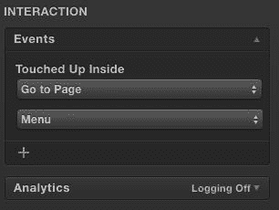

1.  预览您的广告并测试按钮是否按预期工作。

1.  我们现在需要更新我们的主菜单，以移除**地图**按钮。不幸的是，由于菜单对象在我们添加新页面时会自动更新，移除**地图**按钮只会导致它在下次修改页面时被重新生成。这意味着我们需要自己构建一个由按钮组成的菜单。尽管如此，我们仍然可以使用一些技巧来简化我们自己的菜单管理。回到广告概览，并在画布上打开**菜单**页面。

1.  首先，我们将保存菜单按钮的样式作为一个预设，这样我们就可以快速将其应用到所有自己的按钮上。单击菜单对象以选择它，然后双击进入菜单项编辑模式；最后，单击菜单中的一个按钮以选择它。现在，使用**齿轮**按钮保存样式作为预设，然后选择**保存**。将预设命名为例如`主菜单按钮`，这样你就可以知道稍后选择哪种样式。按钮样式保存后，我们可以安全地删除菜单对象。点击菜单对象外部以退出菜单项编辑模式，然后单击菜单对象以选择它。按*删除*或*退格*键从画布上删除整个对象。

    ### 小贴士

    如果**保存**和**另存为…**项被禁用，请尝试再次选择单个按钮；通常很难选择正确的项！

1.  由于我们的**Menu**页面不再有任何形式的导航，打开**Objects**库并点击按钮对象以将新按钮添加到画布上。从样式预设选择器中，更新样式为你的菜单按钮样式，例如**Main Menu Button**。按钮现在应该看起来像我们删除的菜单中的按钮；如果不一致，请确保你选择了正确的样式。

1.  让我们更改按钮的`Touch Up Inside`事件为`Go To Page`。然后，选择要跳转到的页面为`Bean Blender`，即我们 iAd 的第一页，使用与为我们的**store finder**按钮添加跳转目标相同的技巧。双击按钮，将文本替换为`Bean Blender`，使其与跳转目标匹配。

1.  接下来，我们将复制此按钮以节省我们从头创建新按钮的时间。选择按钮对象后，右键点击它并选择**Copy**，或者使用键盘快捷键*cmd* + *C*。现在，右键点击画布并从菜单中选择**Paste**，或者使用键盘上的*cmd* + *V*。再粘贴两次按钮，这样屏幕上就有四个按钮了：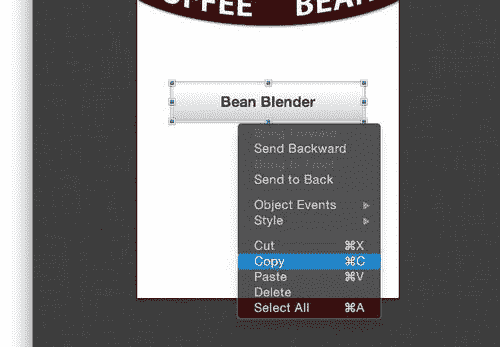

1.  调整每个项目，使它们在页面上均匀分布。使用拖动项目时出现的黄色辅助线来确保间距正确，如下面的截图所示：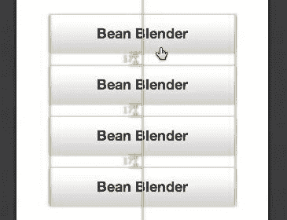

1.  将每个项目的`Touch Up Inside`事件更改为跳转到正确的页面和文本，这样我们的广告的每一页都可以像以前一样访问。然而，不要为**Maps**页面添加按钮。

    ### 注意

    你可能已经注意到在广告概览中，iAd Producer 仍然显示**Map**页面与**Menu**页面相连。这是可以的；iAd Producer 假设所有页面都从核心菜单页面链接，即使你已经更改了它。

1.  在完成自定义菜单后，返回到**广告概览**并打开**Maps**页面。目前，我们**Map**页面上的按钮说**Menu**并返回到菜单。然而，由于这个页面现在是从**Voucher**页面访问的，我们将更新按钮使其返回那里。点击**Menu**按钮以选择它，然后将其更改为跳转到**Steamy Savings**。更新按钮文本为`Back`，告诉用户他们将返回到之前访问的页面，而不是菜单。

1.  打开**Steamy Savings**页面，并将`Wipe Clear`对象移至页面上方。你可能需要右键点击`Wipe Clear`对象并选择**Bring to Front**，以确保它是画布上最前面的对象。保存并预览你的 iAd。

## 刚才发生了什么？

通过自己构建菜单，我们可以更多地控制广告的页面结构，但会失去自动更新菜单对象的便利性。

记住：如果你在你的广告中添加任何额外的页面，你需要去添加指向该页面的另一个按钮到菜单中；同样，当删除页面时，你也必须删除菜单项。

## 尝试英雄式操作

我们对我们的广告做了一些改动，为什么不尝试整理一下呢？例如，你可以做以下事情：

+   为我们的新页面添加过渡效果，以简化用户在广告中的浏览体验

+   尝试添加回我们替换菜单时丢失的**内置和退出**动作动画。

+   确保所有按钮都应用了正确的样式，并且点击它们可以跳转到正确的页面。

+   尝试添加另一个页面，并为它创建一个菜单项。

+   仔细测试广告，理想情况下在多个设备上进行。尝试修复你可能发现的所有问题。

一旦你的广告看起来很棒，就保存它并向你的团队、朋友和家人展示。在开发过程中定期进行全面审查并整理你的广告是一个好主意，尤其是在你接近 iAd 完成时。

# 发送消息

为了在我们的 iAd 内部生成额外的推广，我们可以启用预编写的 SMS 文本消息和电子邮件功能，而无需用户离开广告或应用。鼓励你的用户通过几次简单的点击与朋友分享他们对你的品牌或产品的热情，这可以显著增加广告潜在受众的范围。

# 行动时间 — 发送消息

默认情况下，iAd Producer 没有支持发送 SMS 的对象或模板；然而，我们可以通过**iAd JS 库**（我们的 iAd 的动力框架）来实现这一点。我们只需用四行代码就能发送 SMS；别担心，添加到你的广告中非常简单。

### 注意

记住：iAd Producer 是一个编辑器，它为我们管理了大部分 iAd JS 库，尽管它目前不支持所有可用功能，所以我们偶尔需要修改和添加一些自定义代码。

1.  我们将继续我们的“咖啡豆”项目；如果它还没有打开，现在就打开它。

1.  让我们在**菜单**页面上创建一个按钮，以便我们的用户可以与他们的朋友分享我们的品牌。在编辑画布上打开**菜单**页面，并从**对象库**中添加一个按钮对象。将按钮文本更改为类似“告诉朋友”的内容，然后将按钮放置在屏幕的右下角。更改按钮的样式。例如，尝试：

    +   将背景设置为从浅到深的线性红色渐变

    +   将文字颜色改为白色

    +   给按钮添加圆角，使其边缘圆润

    +   在按钮上添加阴影以增加光晕效果

    +   调整不同的按钮状态，例如高亮状态，以便按钮在被点击时改变

    +   你可能需要重新定位页面上的其他对象以适应新的按钮

1.  你可能想让你的按钮看起来像以下这样：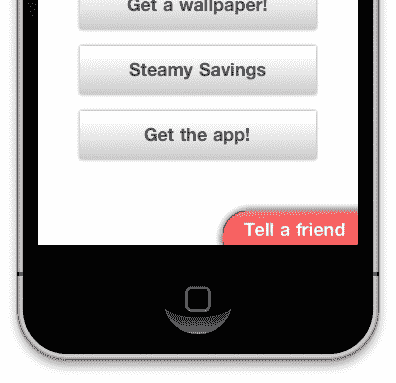

1.  当你对按钮的样式满意时，是时候添加一小段代码来添加广告的短信发送功能了。选中按钮后，右键点击它并选择 **对象事件** | **触摸内部** | **执行 JavaScript**。你可以看到以下截图中的菜单：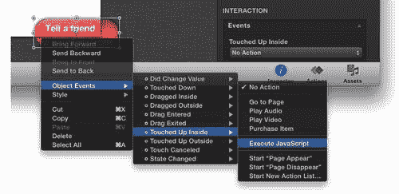

1.  你会在屏幕上看到一个文本窗口出现，其中预先填充了一些代码；这仅仅是当此事件被触发时运行的动作集。在 `function(event) {` 和 `}` 之间的空行中，准确输入以下几行：

    ```swift
    window.ad.smsComposer.listener =function(){};
    window.ad.smsComposer.toRecipients = [" "];
    window.ad.smsComposer.body = "We should have a drink at Coffee Beans!";
    window.ad.smsComposer.presentComposer();

    ```

    ### 注意

    **下载示例代码**

    你可以从你购买的所有 Packt 书籍的账户中下载示例代码文件。[`www.PacktPub.com`](http://www.PacktPub.com)。如果你在其他地方购买了这本书，你可以访问[`www.PacktPub.com/support`](http://www.PacktPub.com/support)并注册，以便直接将文件通过电子邮件发送给你。

1.  通过点击菜单栏上的 **文件** | **保存** 或使用键盘上的 *cmd* + *S* 来保存此代码文件。

1.  通过关闭代码窗口返回到 iAd Producer 主窗口。在你的 iOS 设备上预览你的广告；你不能使用 iOS 模拟器，因为它没有短信功能。如果你在点击按钮时没有看到消息窗口出现，请尝试重复这些步骤并确保代码完全匹配。

1.  保存你的 iAd 项目。

## 刚才发生了什么？

我们设计了一个按钮并添加了一段简短的定制代码。这段代码是用 JavaScript 编写的，并在某些事件发生时调用。对象事件是在对象上发生的行为；我们使用 **触摸内部** 作为当用户将手指从对象上抬起时触发的事件。这随后导致我们的代码被执行，进而打开短信窗口。

使用这种强大的脚本语言，我们能够将电子邮件、短信、电话和社交网络集成到我们的广告中。

# 摘要

动作和目的地是直接对你的品牌有益的目标，无论是用户与朋友社交分享内容，还是使用丰富的地图定位他们最近的商店。我们探讨了使用一些这些引人入胜的技术来吸引用户：

+   在我们的广告中推广和购买 iTunes 商店的内容，如应用和媒体，从而产生额外的收入来源或推广

+   定制商店查找体验

+   将广告的某些页面从主导航中隐藏，以提供补充内容

+   使用我们第一段 JavaScript 代码发送短信安排与朋友见面！

我们将在稍后学习如何使用高级代码创建更进一步的交互，但首先，让我们看看如何为大型屏幕 iPad 的 iAds 制作广告。
