# 第八章. 使用代码增强我们的应用

> iAd Producer 管理着驱动我们的 iAd 的 HTML、CSS 和 JavaScript，这意味着我们可以在不了解这些网络技术的情况下制作出视觉冲击力强的广告。我们可以通过修改和添加 iAd Producer 生成的 JavaScript 源代码来扩展我们广告的交互性。我们将回顾你一直在工作的项目，并通过简单的有效调整来增强它们的交互性。

在本章中，你将了解以下内容：

+   什么是 JavaScript

+   iAd Producer 的代码编辑器

+   处理事件

+   访问对象

+   发送电子邮件和短信

+   保存日历事件

尽管本章不会让你成为 JavaScript 大师，但你将了解正在发生的事情，并能够将这些片段和示例应用到自己的精彩 iAd 项目中。

# JavaScript

JavaScript，通常简称为 JS，是由 Netscape 的 Brendan Eich 于 1995 年创建的一种轻量级语言，用于通过增强网络交互性。JavaScript 使用**对象**，一个可以包含一个或多个**函数**和**属性**的项目。函数是一系列在用户或代码调用时发生的操作，而属性或变量是存储在对象中的值。

如果你已经熟悉编程，你会发现 JavaScript 受到了 C 语言的高度影响。JavaScript 在浏览器以外的应用中越来越受欢迎，学习它是一种强大且有用的语言。

### 注意

与普遍的误解相反，JavaScript 与 Java 语言没有关系。它最初被命名为 Mocha，然后是 LiveScript，最后改为 JavaScript——Sun Microsystems 的商标。

如果你之前没有使用过 JavaScript，不要担心，我们将逐步讲解每个练习，并解释代码是如何与我们的广告及其组件交互的。

## 代码编辑器

iAd Producer 内置了一个代码编辑器，我们将用它来编辑我们的 JavaScript 代码。它本质上是一个基本的文本编辑器，带有一些实用的工具，例如为我们的代码着色以提高可读性，以及基本的错误检查。

每次你在项目中创建一个新页面时，iAd Producer 都会自动生成一个隐藏的 JavaScript 文件，你可以通过从 iAd Producer 菜单栏中选择**代码** | **显示代码编辑器**来查看它。每个对象也有自己的 JavaScript 文件，用于在发生事件（如触摸或滑动）时调用函数。要查看对象的代码，请选择对象后打开编辑器。你可以在以下屏幕截图中看到一个代码编辑器的示例：

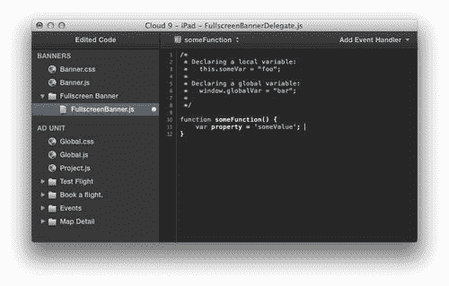

# 访问页面对象

每当我们向页面画布添加一个对象时，我们都能使用一些 JavaScript 代码访问和编辑它的某些属性。这允许你编辑在 iAd Producer 界面中不可用的属性，或者改变你的广告中的对象以响应用户的输入。

# 行动时间——访问对象

让我们继续使用上一章中创建的`Cloud 9 - iPad`广告。我们将对我们的**Test Flight**页面的滚动视图对象进行一些调整，这些调整在 iAd Producer 界面中是不可能的：

1.  在 iAd Producer 中打开项目`Cloud 9 - iPad`。如果您没有完成此项目，请在`Cloud 9`文件夹中打开`8. Store Finder.iadproj`文件，然后进入`Exercises`文件夹。此文件中已为您完成了之前的练习。

1.  双击广告概览中的第一页**Test Flight**，在画布上打开它。在画布外的网格背景上右键单击，展开菜单项**页面事件** | **视图加载完成** | **执行 JavaScript**。这将自动创建此事件所需的功能，并打开此页面的代码编辑器：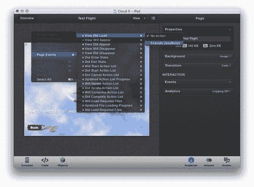

1.  在代码编辑器窗口中，iAd Producer 为该页面创建了一个新函数，当视图出现时将调用并运行。`//Code goes here`占位符注释显示了您放置自定义代码的位置。删除占位符注释并添加以下内容：

    ```swift
    //get the scrollView from the canvas
    var scrollView = this.outlets.scrollView;

    ```

    ### 注意

    在 JavaScript 中，任何在`//`之后的行都是注释，在运行时将被忽略。如果您想有多行注释，请使用`/* comment goes here */`。注释很有用，因为它们可以用来提醒您（或告知正在您代码上工作的其他开发者）为什么以某种方式做事。代码编辑器会将注释变为绿色，以区分 JavaScript 代码。

1.  第一行是一个注释，说明我们在做什么，即从页面中检索滚动视图对象并将其引用存储在变量中，变量用`var`表示，命名为`scrollView`。页面上的每个对象都被分配了一个唯一的出口名称。要查找或修改对象的出口值，请从画布上点击并选择它，然后打开检查器面板。展开**属性**部分，您会看到一个带有出口名称的文本框。如果您在页面上有多个相同类型的对象，您可以将其更改为一个更容易记住的名称：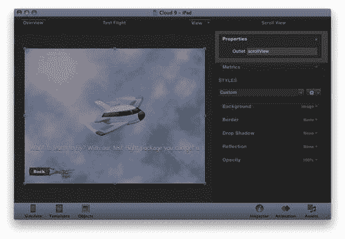

1.  现在我们已经通过`scrollView`变量轻松访问了出口，我们可以通过调整其属性来操作它。在代码编辑器中添加以下行到您的函数中：

    ```swift
    //prevent up & down vertical scrolling
    scrollView.verticalScrollEnabled = false;

    ```

    ### 注意

    要禁用属性，我们使用`false`值，而使用`true`值来启用它。

1.  这将禁用我们的滚动视图的垂直滚动，使其只能由用户左右滚动。由于我们阻止了垂直滚动，我们还应该防止垂直滚动条出现：

    ```swift
    //remove vertical scrollbar
    scrollView.showsVerticalScrollIndicator = false;

    ```

1.  通过将我们的滚动视图对象的`showsVerticalScrollIndicator`属性设置为`false`，我们禁用了垂直滚动条的出现。

1.  您的完整代码应该类似于代码编辑器中的以下图片：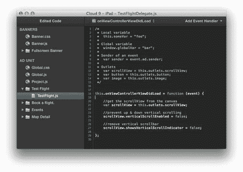

1.  保存您的项目，并在 iOS 模拟器或使用 iAd Tester 的设备上测试广告。您会注意到滚动视图不能再上下滚动，只能左右滚动，并且不会出现垂直滚动条。

## 刚才发生了什么？

我们使用了`onViewControllerViewDidLoad`事件函数，该函数在页面完成加载后调用，并修改了一些我们的滚动视图对象的一些属性。iAd Producer 不允许访问某些属性，因此它可以保持其用户界面干净、易懂。通过从初学者那里隐藏高级功能，他们使开始创建 iAd 的过程不那么令人不知所措。既然你现在已经是 iAd 专家，我们可以深入 JavaScript 来创建更好的广告。

# 处理用户事件

无论是由用户还是系统触发的我们的广告上的任何操作，都会调用一个事件。我们能够将 JavaScript 函数添加到广告中的各种事件中，例如按钮的点击、设备的摇晃和方向变化。

事件分为三组：

+   **全球事件:** 这些事件发生在整个广告中

+   **页面事件:** 这些与特定页面相关

+   **对象事件:** 这些事件特定于页面上的一个对象

例如，用户摇晃设备或广告完成加载是一个全局事件，页面加载或出现是一个页面事件，按钮被触摸则是一个对象事件。您可以在以下位置查看事件层次结构：

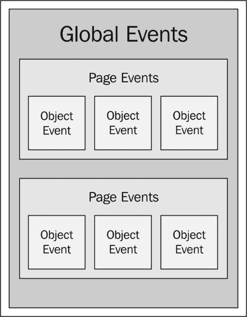

## 发送短信和电子邮件

iAd Producer 没有提供用于发送电子邮件或短信的对象或模板，但为我们 iAd 提供动力的 iAd JS 框架有一个简单的方法向用户展示电子邮件对话框。

你可能记得我们在第六章“广告目的地和动作”中简要提到了这一点，当时我们添加了使用短信分享广告的功能。这次，我们将更深入地查看代码以及每个步骤中发生的事情，并改为发送电子邮件。

# 行动时间——检测点击并发送电子邮件

继续增强我们的`Cloud 9`广告，我们将在**预订航班**页面上添加一个按钮，该按钮将预先填充我们的预订中心的电子邮件地址。

1.  如果还没有，请在 iAd Producer 中打开`Cloud 9 - iPad`项目。双击**预订航班**页面以在广告画布上打开它。使用画布上方的页面切换器，切换到**地图详情**视图。

1.  从对象库中，将一个**按钮**添加到画布上。打开检查器，将出口名称更改为`emailButton`。

    ### 注意

    当命名出口时，你应该以小写字母开始，然后使用驼峰式命名法；这意味着第一个单词之后的每个后续单词都应该大写。例如，*youShouldCapitalizeEveryFirstLetterOfEachWord*。这样做使得阅读和理解每个出口的功能更容易。

1.  将按钮文本更新为“现在预订航班！”

1.  在按钮选中后，展开**检查器**面板并找到**事件**部分。**Touched Up Inside**事件已经选中，但没有动作。我们使用**Touched Up Inside**事件来检测用户从对象上的点击中释放手指。我们使用**Touched Up Inside**而不是**Touched Down Inside**，因为**Touch Down**事件在用户触摸对象时立即被调用。这可能会给用户带来令人不适的体验，因为意外点击在触摸下更可能发生。将事件的动作更改为**执行 JavaScript**：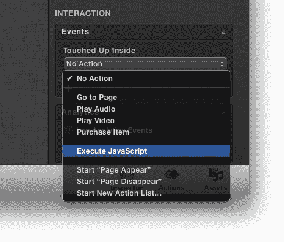

1.  代码编辑器将出现；删除`// Code here`占位符注释并添加以下内容：

    ```swift
    // Set the mail composer listener to an empty function
    window.ad.mailComposer.listener = function(){ };

    ```

1.  这将我们的广告的`mailComposer`对象的**监听器**属性设置为空函数。监听器是当另一个动作完成时被调用的函数；例如，当电子邮件成功发送或由于任何原因失败时，我们的监听器会被调用。目前，我们只是使用一个空函数，因为我们不需要以不同的方式处理发送错误或成功。如果没有空函数，我们的广告会崩溃，因为它会尝试找到不存在的东西。

1.  让我们设置我们的收件人电子邮件地址，这是将接收任何预订的电子邮件账户。在我们的监听器之后添加以下代码，并将`your@emailaddress.com`更新为您的电子邮件地址，以便您稍后能够测试它是否工作：

    ```swift
    // Set our recipient email address for the mail composer window.ad.mailComposer.toRecipients = ["you@emailaddress.com"];

    ```

1.  注意到方括号吗？它们表示方括号内的内容是否为数组。把它想象成一个包含在方括号内的项目列表。数组中的每个项目都由逗号分隔，所以如果你想包括多个收件人，你会使用`["recipientOne@email.com", "recipientTwo@email.com"]`等等。

    ### 注意

    尽管我们只传递了一个项目给收件人，但我们仍然必须使用数组，因为`toRecipients`属性期望的是数组。

1.  在设置收件人列表后，我们可以设置电子邮件的`subject`属性，同时在编辑器中继续构建代码，添加以下内容：

    ```swift
    // Set the email subject property
    window.ad.mailComposer.subject = "I'd like to book a flight!";

    ```

1.  这只是将我们的广告的邮件编写器的`subject`属性设置为**字符串**——一个包含引号的文本块。我们将预先填充正文——电子邮件的主要内容：

    ```swift
    //Set the message body using the mailComposer function
    window.ad.mailComposer.setMessageBody( "I'd like to book a flight..", false );

    ```

1.  与我们的其他属性不同，正文文本不是使用`=`赋值来设置，而是通过添加两个括号内的值来设置。这些括号内的项目被传递到邮件编写器的`setMessageBody`函数。它接受两个参数，该函数所需的项目，在这种情况下，一个用于正文文本的字符串，以及一个表示正文文本是否为 HTML 字符串的布尔值。布尔值是一个简单的是或否开关，分别使用`true`或`false`。如果我们想在电子邮件中添加 HTML 网页内容，我们可以使用``作为字符串，并将布尔值设置为`true`。这将在我们的电子邮件中显示一个图片。

    ### 注意

    要调用或调用一个函数，你使用函数名后跟`()`。JavaScript 函数也可以是属性，这就是为什么`window.ad.mailComposer.setMessageBody`需要使用括号`(`和`)`包裹的值来设置。

1.  当我们为`mailComposer`属性设置了所有必需的信息后，现在可以向用户展示邮件编辑器视图。将以下代码行添加到编辑器中：

    ```swift
    // Show the user the mail composer window
    window.ad.mailComposer.presentComposer();

    ```

这只是调用了邮件编辑器的`presentComposer`函数，它告诉 iOS 设备显示电子邮件窗口，并将其预先填充为我们设置的值。

### 注意

注意代码是如何从屏幕左侧缩进的；函数内的每一行代码都应该缩进四个空格以提高可读性。你可以通过按键盘上的制表符键一次来使用这个快捷键。

## 发生了什么？

由于所有这些代码都发生在我们按钮的`onTouchUpInside`事件函数中，所以每行代码都是逐步执行的，最后一步调用一个显示带有预填属性的电子邮件编辑器的函数。

在创建我们的电子邮件时，我们使用了数组、字符串和布尔值来定制消息编辑器，以包含我们自己的所需内容。

iOS 模拟器通常不会发送电子邮件。当你点击发送时，消息会被静默丢弃，并显示成功消息。为了测试你的电子邮件能否送达收件人，你需要在配置了电子邮件账户的设备上进行测试：

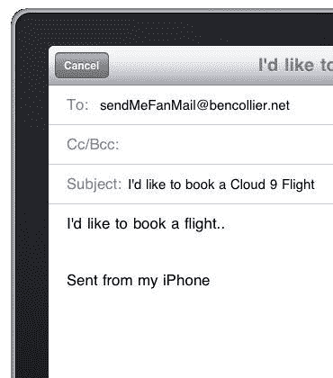

## 尝试一下英雄

现在用户无需离开我们的广告就能联系我们，真是太好了，为什么不尝试以下方法：

+   在我们的电子邮件中发送一张图片；你需要有一个托管在网上的图片的 URL。

+   将邮件编辑器改为发送短信。如果你需要一些提示，可以查看第六章的最后练习，*广告目的地和操作*。

+   确保函数内的所有代码行都缩进四个空格/一个制表符。

+   如同往常，我们的广告需要一些样式来更新我们添加的库存对象。

# 行动时间——给我们的电子邮件添加一些额外内容

虽然我们的电子邮件联系表单已经符合用途，但我们仍然可以添加一些额外的润色和整洁的功能（就像我们一直在做广告的视觉方面一样）。由于**立即预订**按钮位于商店详情页上，让我们让电子邮件正文包含所选商店的名称：

1.  在 iAd Producer 中打开`Cloud 9 - iPad`项目，并在画布上打开**预订航班**页面的**地图详情视图**。

1.  我们需要回到代码编辑器，找到我们在上一个练习中添加的代码。在 **预订航班** 按钮被选中时，从菜单栏点击 **代码** | **显示代码编辑器**。这将打开代码编辑器，您可以向下滚动以找到函数 `this.onViewTouchUpInside`。当一个控件只有一个函数或事件添加到它上面时，这个技术很简单。然而，如果我们的控件有多个事件，我们的文件可能会很快变得拥挤。要直接在函数中打开代码编辑器并聚焦，请选择按钮对象，然后右键单击并选择对象事件，然后 **触摸内部**，最后 **执行 JavaScript**。您会看到已经分配了函数的事件旁边有一个实心点，而空事件旁边有一个空圆圈，如下截图所示：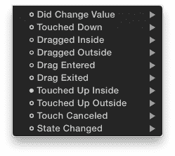

1.  在打开代码编辑器并将位置定位在事件函数上时，我们可以修改一些代码，将商店名称添加到电子邮件消息正文中。在设置电子邮件主题后直接添加以下代码：

    ```swift
    //create our message variable
    var message = "I'd like to book a flight at " + this.viewController.annotation.title;

    ```

1.  这创建了一个名为 `message` 的变量，其中包含文本 `我想预订航班` 与地图引脚注释的文本相结合。我们使用 `+` 来连接两个字符串，并访问地图引脚的 `title` 属性来构建我们的消息。现在我们有了包含组合字符串的 `message` 变量，我们需要将其传递到我们的电子邮件正文中。

1.  要在我们的电子邮件正文中设置新的动态文本，我们需要从 `.setMessageBody` 中移除字符串，并用我们的 `message` 变量替换它。您应该更新您的消息正文函数以匹配以下行：

    ```swift
    //Set the message body using the mailComposer function
    window.ad.mailComposer.setMessageBody(message, false);

    ```

1.  在更新此消息正文函数后，此代码将消息正文设置为我们在 `message` 变量中创建并存储的字符串。

    ### 注意

    确保您也从 `.setMessageBody` 函数中移除引号 `"`"。引号内的变量名将导致变量名出现，而不是变量值。

1.  您最终更新的触摸事件函数应如下截图所示：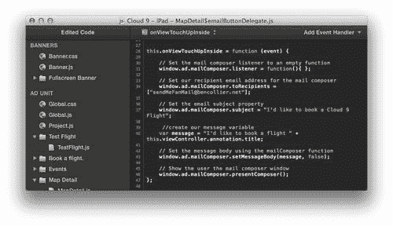

1.  现在测试广告。打开商店详情查看页面，点击 **预订航班！** 按钮。您会看到主要电子邮件正文文本是动态设置为商店的标题。

### 注意

在模拟器中测试时，请确保您从广告概览中点击 **模拟** 按钮，而不是商店查找画布。直接从画布打开会导致广告崩溃，因为它不会加载用于注释标题的正确引脚数据。

## 刚才发生了什么？

我们通过将用户正在查看的当前航班中心添加到消息正文中，使我们的电子邮件更加动态；这应该允许更好地管理用户收到的电子邮件。

通过触发按钮的 `Touch Up Inside` 事件，我们将消息字符串与动态的 pin 注释属性结合在一起，这意味着我们的电子邮件正文文本会更新为用户当前查看的商店名称。

## 尝试一下英雄

如果您对到目前为止我们使用的 JavaScript 代码感到舒适，您可以尝试通过以下方式进一步扩展它：

+   将地址添加到消息字符串中。提示：您可以使用 `this.viewController.annotation.address` 访问注释的地址。

+   留空收件人数组并创建一个 `分享给朋友` 按钮，以便可以将特定商店与朋友分享。要创建一个空数组，只需不要在 `[]` 中添加任何属性即可。

+   在收件人数组中包含一个额外的电子邮件地址，以便电子邮件分发到您公司中的两个人。

## 突击测验 — 变量

变量是存储 JavaScript 中的值的好方法，可以帮助保持我们的代码可读和清晰。看看您是否能够识别这些不同的变量类型和用途：

1.  以下哪种方式是声明变量名 `cyril` 并赋予字符串 `the squirrel has lost his nuts` 的正确方法？

    +   a. var cyril = "the squirrel has lost his nuts";

    +   b. 变量 cyril = "the squirrel has lost his nuts";

    +   c. cyril = "the squirrel has lost his nuts";

    +   d. "cyril" = the squirrel has lost his nuts;

1.  以下哪种方式是显示布尔值的正确方法？

    +   a. 是/否

    +   b. 是/否

    +   c. 开/关

    +   d. 是/真

# 添加日历条目

iAd JavaScript 库允许我们向用户的日历添加事件；这可以让我们留下某些时间敏感的折扣或促销活动的提醒。

# 使用日历的行动时间

使用我们的 `Cloud 9 - iPad` 项目，我们将添加一个事件页面，其中包含一个按钮，该按钮会将事件添加到用户的 iPad 内置日历中：

1.  打开 `Cloud 9 - iPad` 项目，并在广告中添加一个空白页面。将一个按钮添加到主菜单轮播图中，该按钮指向此页面。如果您需要提醒如何操作，请回到第七章，*为大屏幕构建*。将页面命名为 `Events`。使用按钮图像 **events-button.png** 并将其放置在占位符云单元格之一，例如 **Cell 4**，如图所示：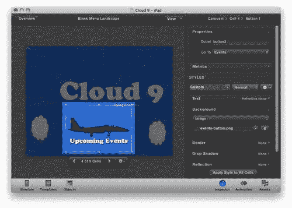

1.  在广告画布上打开新的 **Events** 页面，并从对象库中将一个按钮添加到画布中。将按钮中的文本更改为 `添加到日历`。

1.  在选择按钮后，为当对象被 `Touched Up Inside` 时添加一个 `Execute JavaScript` 事件。删除占位符注释并添加以下代码行：

    ```swift
    //Convert readable date into milliseconds
    var startDate = Date.parse("Tue, 16 Aug 2011 13:30:00 GMT");

    ```

1.  使用 `Date.parse` 函数，我们将可读日期转换为 JavaScript 可以理解的格式。JavaScript 使用自 1970 年 1 月 1 日 00:00:00 UTC 以来的毫秒数来计算其日期和时间。

1.  我们需要将 JavaScript 时间转换为 iAd 和 iOS 可以理解的形式。我们将使用`Date`函数来完成这项工作。直接在最后两条语句之后添加以下代码：

    ```swift
    // Convert milliseconds to a date object
    startDate = new Date(startDate);

    ```

1.  这将从 JavaScript 理解的毫秒时间创建一个新的`date`对象。`date`对象有一系列我们可以使用的函数，可以将日期转换为各种格式。

    ### 注意

    注意，这次我们在`startTime`变量名之前没有包含`var`。这是因为你只需要在第一次创建变量时声明`var`。

1.  使用我们刚刚创建的`date`对象，我们可以访问 iAd 日历所需的日期的 ISO 日期字符串。继续将以下代码添加到我们的代码中：

    ```swift
    //Get the ISO string for the date
    var startDateISO = startDate.toISOString();

    ```

1.  这访问我们的`startDate`日期对象并调用其`toISOString`函数；然后我们将此值保存在变量`startDateISO`中。ISO 日期字符串是一个国际化标准，由我们的 iAd 用于创建日历日期。我们本可以直接跳过这些步骤并直接创建 ISO 日期字符串。然而，与更易于管理的可读日期一起工作会更好。例如，我们开始时间的 ISO 日期是`2011-08-16T13:30:00.000Z`。

1.  在我们的开始日期以正确格式的情况下，我们还需要为我们的活动创建一个结束日期和时间。我们将以与开始时间完全相同的方式执行此操作，但使用未来的不同时间。添加以下代码块：

    ```swift
    // Convert readable date into milliseconds
    var endDate = Date.parse("Tue, 16 Aug 2011 20:30:00 GMT");
    // Convert milliseconds to a date object
    endDate = new Date(endDate);
    // Get the ISO string for the date
    var endDateISO = endDate.toISOString();

    ```

1.  正如我们对开始时间所做的那样，我们现在有了事件结束时间的 ISO 日期字符串。

    ### 注意

    要更新您自己的事件，您需要在`Date.parse()`函数中调整开始时间和结束时间。使用前面的示例作为模板来设置时间。要指定不同的时区，您可以在`GMT`之后添加偏移量。例如，`GMT+0430`将使时间比格林尼治子午线东四小时半，而`GMT-400`将使时间比 GMT 西四小时，并给您美国东部时间。

1.  我们的日期已经准备好了，现在我们可以创建 iAd 框架所需的事件对象。将以下代码添加到您的`touch Up Inside`事件函数的末尾：

    ```swift
    // Setup the event object
    var theEvent = {
    "description": "Aviation Awards 2011",
    "location": "Brighton, UK",
    "summary": "Acrobatics and airplanes!",
    "start": startDateISO,
    "end": endDateISO
    };

    ```

1.  此对象包含创建事件所需的属性和值列表。我们可以将`startDateISO`和`endDateISO`值添加到我们的对象的`start`和`end`属性中。

1.  在我们能够显示日历窗口之前，我们需要告诉广告在哪里定位日历**弹出视图**。弹出视图是一个仅在 iPad 上使用的元素，它覆盖在其他用户界面对象之上，通常出现在激活它的按钮旁边。我们需要获取按钮的位置并稍作调整，以便在正确的位置显示日历弹出视图。假设您的按钮位于屏幕中央，请返回到 iAd Producer 画布并选择按钮对象。打开检查器面板并展开**布局**部分：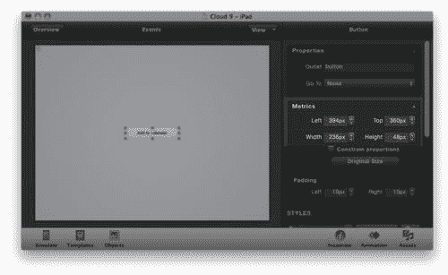

1.  我们可以使用这些布局指标来计算我们的弹出窗口的 X 和 Y 位置。X 位置是指我们的弹出窗口应该从左侧显示多远，Y 是指从设备屏幕顶部应该有多少距离。为了计算 X 位置并使我们的弹出窗口看起来在按钮的右侧，我们取**左**值，在这个例子中是**394**，然后加上**宽度**，在这个例子中是**236**，得到最终的 X 值为`630`。我们希望弹出窗口出现在按钮的右中心，所以我们的 Y 值是通过取**顶**值，在这个例子中是**360**，然后加上按钮**高度**的一半，在这个例子中是**24**，得到最终的 Y 值为`384`。有了这些值，我们可以创建我们的位置对象，并将以下内容添加到函数中：

    ```swift
    // On iPad so set the position for the popover
    var calPosition = {
    'x':630,
    'y':384
    };

    ```

1.  因为我们使用的是整数——数值，而不是字符串，所以我们不需要用引号将我们的位置值括起来。

    ### 注意

    由于这仅在 iPad 上必要，因此对于 iPhone 广告，我们会将`calPosition`留空，因为添加日历事件时它使用整个屏幕。记住，如果你移动你的按钮，你也必须更新这些值。

1.  我们将快速创建一个空监听器，就像我们为电子邮件编辑器所做的那样。我们不需要任何关于成功或失败日历事件的反馈，所以我们只需使用以下内容：

    ```swift
    // Empty listener
    var listener = {};

    ```

1.  这将防止日历不显示，因为它找不到监听器。

1.  在设置好所有对象之后，我们最终可以告诉 iAd 框架显示弹出窗口。将以下代码行添加到函数的末尾：

    ```swift
    //show the popover
    ad.calendar.presentComposer(theEvent, listener, calPosition);

    ```

1.  这告诉我们的广告日历显示事件弹出窗口，并传递我们创建的事件对象、空监听器和弹出窗口在屏幕上的位置对象。

1.  保存项目，然后测试你的新按钮！你的最终代码应该看起来像以下截图：

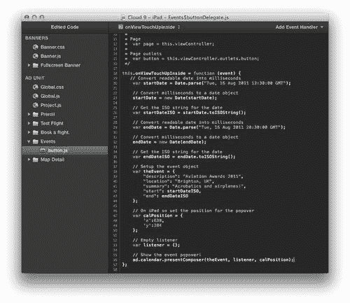

## 发生了什么？

使用 JavaScript 中的 Date 对象，我们将可读的日期转换为我们的 iAd 和 iOS 设备可以转换成机器可读格式的格式。通过创建两个日期，用于事件的开始和结束时间，然后设置一个事件对象，我们可以将其传递给设备。这个事件对象包含了事件的详细信息以及我们转换的开始和结束时间。最后，由于我们的广告是为 iPad 设计的，我们必须设置一个对象，定义弹出窗口在屏幕上的 X 和 Y 位置。我们的弹出窗口日历将看起来像以下截图：

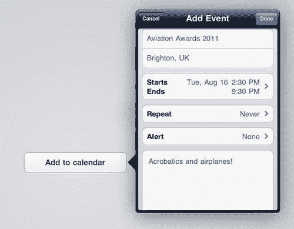

弹出窗口给用户提供了编辑事件、使事件重复或添加闹钟以提醒他们的机会。一旦用户点击，事件就会被添加到他们设备内置的日历应用中，确保我们在用户关闭我们的广告后仍然与他们保持联系。

在 iPhone 上，我们不需要设置弹出视图的坐标并留空位置对象，因为 iPhone 会自动用我们的日历视图填满整个屏幕。

## 尝试一下英雄

在空白页面的中间放置一个按钮并不很有吸引力，也不太可能激发用户将事件添加到他们的日历中。用一些关于事件的图片和信息让你的页面更有趣，例如，为什么不尝试以下方法：

+   添加一个或多个过去事件的图片

+   使用包含事件详细信息的标签

+   更新页面背景，使其与我们的广告其余部分相匹配

+   不要忘记包括一个返回按钮，以便用户可以返回主菜单！

# 播放音频

iAd Producer 有一个音频对象，用户可以点击播放按钮来听我们广告中包含的音频文件。这对于歌曲和声音剪辑非常有效，但我们也可以从 JavaScript 触发音频剪辑。由于我们使用 JavaScript 播放音频文件，因此我们可以使用广告中的任何事件来启动音频。

# 行动时间 — 控制音频播放器

让我们结合对象库中的音频对象和一些 JavaScript 代码，以便每次用户摇动设备时播放音频剪辑：

1.  我们将使用本书开头构建的示例项目 `Dino Stores`，并在每次摇动我们的 **Shake to Change** 展览时让恐龙咆哮。现在在 iAd Producer 中打开项目。如果您尚未完成项目，可以使用 `Dino Stores` 练习文件夹中的 `6.Dino Stores - Store Finder`。

1.  在画布上打开 **Shake to Change** 页面。从对象库中添加一个音频对象到画布，并将其放置在屏幕之外，以便用户看不到它。

1.  选择对象后，展开检查器面板并选择 **roar-noise.m4a** 作为音频剪辑的文件，如图所示：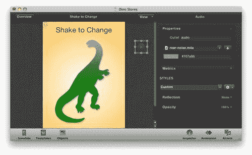

1.  通过点击恐龙图像选择摇动视图对象。右键单击它并选择 **对象事件** | **Did Shake** | **执行 JavaScript**。这将打开代码编辑器并为该事件添加一个占位符函数。

1.  当摇动事件发生时，我们希望我们的音频对象播放，因此将以下 JavaScript 添加到函数中：

    ```swift
    this.viewController.outlets.audio.play();

    ```

1.  这只是从我们的页面获取音频对象并调用其 `play` 函数，令人惊讶的是，这将使我们的音频剪辑播放！请确保对象检查器中的输出值设置为 `audio`。如果它是页面上唯一的音频对象，则默认情况下应该是这样的。

1.  关闭代码编辑器并测试广告。导航到 **Shake to Change** 页面然后摇动设备。当页面改变时，你会听到恐龙咆哮。

## 刚才发生了什么？

通过在我们的页面上添加音频对象，我们可以通过其`outlet`属性使用 JavaScript 访问它。我们将音频对象从画布上移除，因此它包含在页面中但不可见给用户，当我们的摇动视图的摇动事件发生时，我们调用了音频对象的`play`函数。你可能会注意到第一次摇动设备时会有延迟，因为音频正在加载，但随后的摇动将使音频立即播放，因为设备会将其缓存。为了最小化延迟，请保持音频短小并优化，因为显然，较小的文件比较大的文件播放得更快。

# 使用 Twitter 发推文

当苹果公司在 2011 年秋季发布 iOS 5 时，他们包括了从操作系统的各个部分直接推文文本、链接和图像的支持。这种**Twitter**支持已扩展到我们的 iAds，并且由于其分享范围，它是一个伟大的营销工具。

Twitter 是一个流行的微博服务，用户可以向关注或订阅他们的人发送简短、及时更新，这些更新限制在 140 个字符以内。

# 行动时间 — 发推文

由于并非每个设备都一定运行 iOS 5，我们将创建一个检查以确保设备支持 Twitter，然后让用户发推文并分享关于我们品牌的更新：

1.  打开我们在上一个练习中使用的`Dino Stores`项目。我们将在菜单屏幕上添加一个按钮，该按钮将打开 Twitter 对话框。在画布上打开菜单页面，然后从对象库中拖动按钮。

1.  将菜单放置在页面底部附近，并扩展以填充宽度。更新文本，例如使用行动号召，如`推一个恐龙事实！`。你的按钮可能看起来像以下截图：

1.  点击并选择按钮，然后选择**执行 JavaScript**作为**内部触摸**动作以创建事件并自动打开代码编辑器。

1.  删除占位符注释`//Code here`，并用以下代码替换：

    ```swift
    if(window.ad.twitterComposer) {
    window.ad.twitterComposer.text = 'The longest dinosaur was Seismosaurus, was as long as five double-decker buses - Dino Stores';
    window.ad.twitterComposer.URLs = ['http://www.bencollier.net/'];
    window.ad.twitterComposer.present();
    }

    ```

1.  这将检查 Twitter 作曲家是否可用，然后添加将要发推文的文本和 URL。在`if(window.ad.twitterComposer)`之后的括号内的任何内容，只有在 Twitter 作曲家对象存在时才会运行。现在我们可以添加一个`else`代码块，如果 Twitter 作曲家不可用，它将运行。

1.  在我们刚刚添加的代码之后立即插入以下内容：

    ```swift
    else {
    alert('You need iOS 5 with a Twitter account to send this tweet');
    }

    ```

1.  这只会在之前的检查没有找到 Twitter 作曲家可用时运行；并将向用户显示一个警告。

1.  我们可以在 iOS 模拟器或设备上测试我们的广告。你需要确保你的 iPhone 或 iPod 运行 iOS 5，并且你已经配置了你的 Twitter 账户。当使用模拟器时，你可以通过 iAd Producer 更改其运行的 iOS 版本。从菜单栏选择**导出** | **模拟器 iOS 版本** | **iOS 5.x**。保存你的项目并点击**模拟**按钮。

    ### 注意

    要在 iOS 设备或模拟器上登录 Twitter，请打开**设置**应用，然后选择**Twitter**。您将被提示输入用户名和密码，如果您还没有，您还有机会创建账户。

1.  点击**推文**按钮现在将打开我们配置的**Twitter 编辑器**窗口：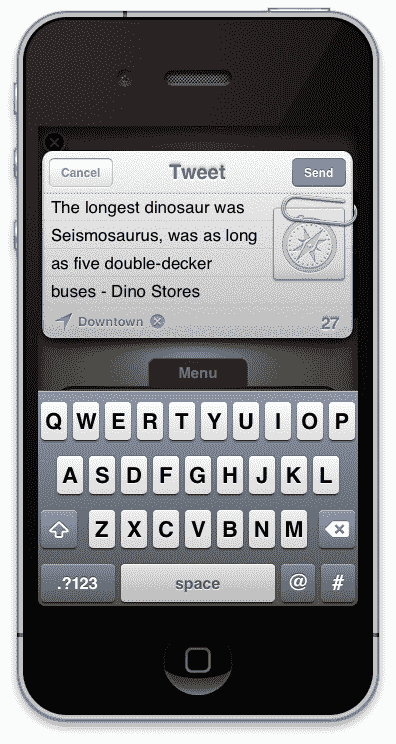

1.  如果您看到我们的错误警报信息出现，请确保您正在使用 iOS 5，并且您的账户配置正确！您可以使用 iTunes 升级您的设备。

## 刚才发生了什么？

使用 iOS 5 中引入的 Twitter 编辑器，我们发布了一条带有链接的基本文本推文。如果我们尝试在用户不在 Twitter 支持设备上时访问 Twitter 编辑器，我们的广告可能会崩溃。因此，当针对较旧的 iOS 版本时，检查其可用性是至关重要的。

## 尝试一下英雄

如果您对您的 Twitter 代码有信心，考虑如下改进：

+   将模拟器版本更改为 iOS 5 之前的版本，以便您可以测试回退消息。

+   对于更高级的用户，考虑在 Twitter 编辑器不可用时隐藏按钮。我们可以使用页面事件**viewControllerViewDidAppear**，我们之前使用的`if`语句，并将按钮输出端的`hidden`属性设置为`true`。

# 调试器

我们并不都是完美的，有时我们在编写 JavaScript 代码时会犯错；幸运的是，iAd Producer 有两个内置工具，用于突出显示和发现您代码中的错误。

## 错误检查语法

如果您的代码语法有错误——定义您代码结构的规则，当您尝试保存该 JavaScript 文件时，iAd Producer 会提示您。iAd Producer 会识别出错误发生的行，并允许您保存文件（不推荐）或编辑它。

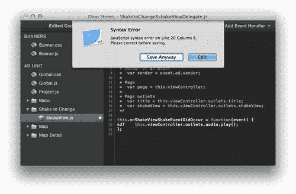

您应该检查的一般语法错误包括：

+   忘记在行末加上分号。

+   没有使用逗号分隔对象或数组值。

+   在数组或对象中的最后一个项目后包含一个逗号。例如，`['item one', 'item two', last item',]` 将是不正确的，因为末尾有一个多余的逗号。

+   使用错误的案例。JavaScript 及其变量是区分大小写的，所以`thisVariable`和`ThisVARIABLE`被认为是两个不同的值。

+   忘记关闭括号或大括号。

## 使用调试器

如果您的代码在语法上是正确的，但在运行时出现错误，调试器窗口将出现并突出显示发生错误的代码行。例如，如果我们尝试访问一个尚未分配值的变量，我们可能会发现调试器显示访问未定义函数或值的警告。


如果你熟悉开发，你可以在代码的特定部分设置断点以暂停广告。要设置这些断点，只需双击你想要暂停的行号。然后，你可以在 iAd Producer 中使用**继续**按钮来恢复 JavaScript 的执行。

## 编码规范

当你编写 JavaScript 代码时，你应该确保它符合开发者使用的某些基本规则和最佳实践：

+   使用我们之前在本章中讨论的驼峰命名法，用小写字母命名起始变量。变量名应该是详尽的，并且与它们所持有的数据相关。

+   注释你的代码，以便你在重新访问代码时能理解，并对未来可能查看它的其他开发者来说清晰易懂。

+   每个语句都以分号结束。

+   使用*Tab*键或四个空格将函数内的代码缩进。注意第二个示例如何更易于阅读和清晰：

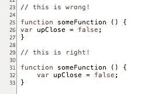

## 尝试一下英雄

学习了一些示例代码片段、代码应有的风格以及如何识别和修复代码中的错误后，你可以为我们迄今为止创建的其他示例项目添加一些增强功能。你可以：

+   在`Coffee Beans`项目中为摇动视图添加音频片段

+   在`Cloud 9 - iPad`项目中添加多个事件按钮到即将到来的**事件**页面，每个按钮创建具有不同时间和详细信息的日历事件

+   这应该展示了如何在单个页面的 JavaScript 文件中存在多个事件函数

### 注意

当你在屏幕上有多按钮时，可能需要考虑重命名你的按钮输出。这将使在 JavaScript 文件中的函数之间导航更容易。

+   阅读 Apple 文档以了解 JavaScript 在您的 iAd 中的其他可能性，可在[`developer.apple.com`](http://developer.apple.com)找到

+   使用你迄今为止学到的各种技术，为你的产品或品牌创建一个全新的广告

# 摘要

JavaScript 是一种非常强大且灵活的语言，与 iAd JS 框架结合使用，可以创建一些令人惊叹的动态和丰富的广告。在本章中，我们只简要介绍了通过简单的代码片段扩展我们的 iAds 的潜力，这些代码片段允许我们：

+   编辑在 iAd Producer 检查器面板中未向我们暴露的对象的值

+   将事件添加到用户的日历中，并在他们离开我们的广告后继续提醒他们

+   使用动态内容发送电子邮件，让用户联系我们

+   使用代码编辑器和调试器来捕获常见错误

当我们的广告看起来很棒，具有丰富的交互性，并为我们的用户提供难忘的体验时，让我们来看看管理成功的 iAd 活动的后勤工作。
