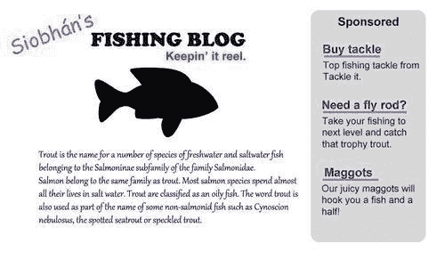
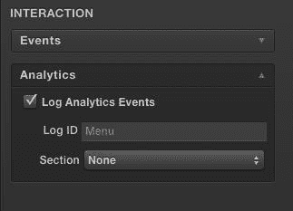
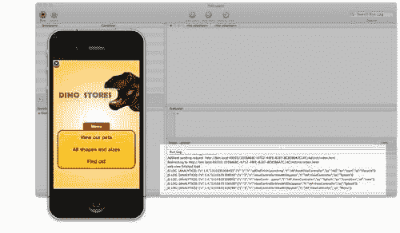
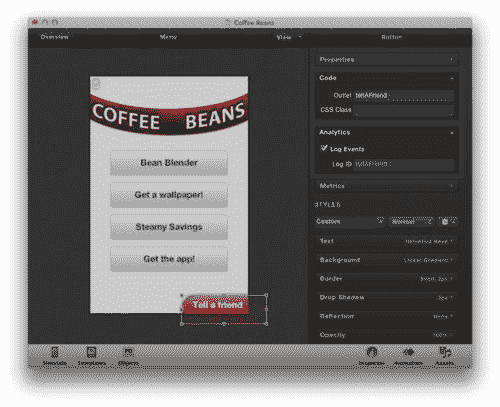
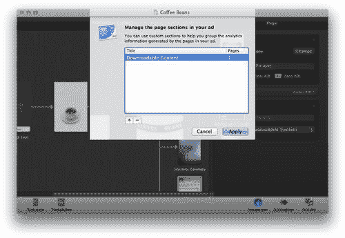
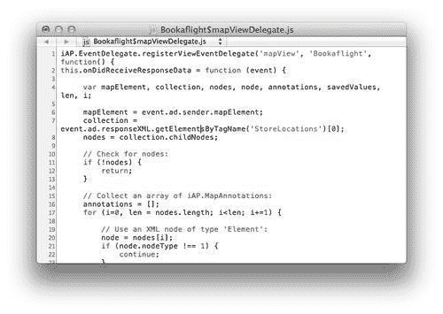
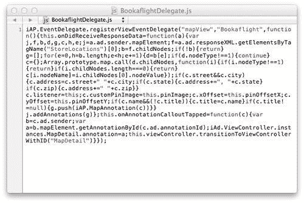
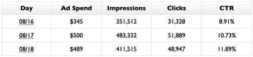

# 第九章. 管理成功的 iAd 宣传活动

> 您能够制作出令人惊叹的 iAd，在 iPhone 和 iPad 上令您的受众惊叹。现在您需要了解如何管理一个成功的宣传活动，该活动能够触及目标人口统计，符合预算，并且有可衡量的成功衡量方式。

在本章中，我们将探讨确保您从 iAd 活动中获得最大收益所需的技能，例如以下内容：

+   针对特定受众定位您的广告

+   理解定价模型和成本

+   在您的广告中关于用户互动的报告和分析

+   启动广告并完成最终提交前的检查

# 寻找您的受众

使用 iAd，我们能够运行需要用户或广告出现的上下文满足特定标准以针对您的理想受众的宣传活动。

寻找您的目标受众可能很复杂，因为有许多影响因素可能会对您的产品或品牌感兴趣。

### 注意

您的目标市场可能并不一定是您预期的或希望它成为的那样！因此，在启动您的活动之前，请确保您了解您应该针对哪些受众。

如果您有现有的客户群，您可以对他们进行画像以识别趋势和共同兴趣；考虑进行简短的客户调查并询问他们问题，或者举行焦点小组。尽管找到目标市场很重要，但请确保在尝试从他们那里获取信息时不要惹恼您的现有客户群！

当您知道可用的定位选项时，您可能需要调整您的市场研究。让我们看看不同的定位类型。

## 定位

当市场定位明确后，您将能够定制和调整您的活动以最大化其效率。这将通过获得更多有用的用户参与，并针对可能对您的广告和品牌感兴趣的相关人口统计来增加您的 iAd 曝光价值。广告可以通过情境或行为数据来定位，以触及最有可能对您的 iAd 感兴趣并参与的用户群体。

### 情境广告

**情境广告**假设广告的相关性是因为它出现的上下文必须对用户在查看或使用时具有吸引力。情境广告的最佳例子是网站上的赞助链接。它们通常分析页面内容，并通过寻找共同的关键词来捕捉一般主题或上下文。

以下截图显示了使用情境定位放置广告的示例网站。当页面加载时，它会检查页面的主要内容，并挑选出常见的单词和主题，并从广告网络中获取它认为可能相关的任何广告：



您会发现它们通常并不完美；例如，一个提到摇滚乐多次的网站可能会生成关于 AC/DC 和下一个关于在南达科他州意外发现的火山岩形成的公共会议的广告。

### 行为定位

**行为定位**根据用户的行为分析和建立用户档案，这些行为是广告网络可以访问的。用户的网络之旅可以在他们访问不同网站或进行搜索以寻找趋势时进行跟踪，然后广告网络可以汇总这些趋势并据此对用户的人口统计和兴趣做出明智的猜测。

广告网络特别使用行为定位，因为它们能够跟踪用户在他们广告网络中的网站之间导航时的行为。例如，如果用户访问了一个关于潜水网站的页面，然后是酒店网站，最后是航空公司预订页面——他很可能要去度假。广告提供商然后基于这个假设开始在非假日相关网站上展示关于旅行的广告。它使用与上下文定位类似的技术来突出页面上的关键词并衡量一个共同的主题。

### 注意

广告网络使用有争议的**跟踪 cookies**——一种保存在您电脑上的小文件，用于保存匿名会话和状态数据。Cookies 通常用于保持您登录到网站或记住购物车中的内容，但广告商可以使用相同的技巧匿名识别从网站到网站的访客。

### iAd 定位

iAd 结合了上下文广告和行为定位，以帮助您找到最适合您的 iAd 的相关和有价值的目标受众。您的广告可以指定它将在哪些应用类别中显示，或针对用户对应用类别的普遍偏好。

多亏了苹果通过 iTunes 商店账户和设备信息对用户进行用户画像，我们能够根据以下用户行为和信息来定位我们的活动：

+   人口统计

+   应用偏好

+   音乐兴趣

+   电影、电视和有声书兴趣类别

+   位置

+   设备（iPhone、iPad 和 iPod touch）

+   网络（Wi-Fi 和 3G）

通过人口统计，您可以根据人群进行定位，能够通过年龄、性别和其他信息匿名过滤用户，这些信息可在他们的 iTunes 个人资料中找到。位置在您没有全球品牌存在时是理想的，因为您能够按国家或地区进行定位。如果您在您的应用内销售数字商品，您应该只针对您的应用或内容可用的国家进行定位。

应用偏好使用用户的下载历史来估计他们感兴趣的应用类别。这，结合音乐、电影、电视兴趣和一些假设，可以是一种找到符合您理想客户用户的好方法。

您将需要与您的 iAd 代理协商以设置和调整您的活动，并尽早与他们联系，讨论并获取他们对将为您的活动提供的标准定位的反馈。

# 定价模型

在电视和广播广告中，我们不确定观众或听众对我们活动的参与程度；他们的注意力可能（并且经常是）在其他地方。在 iAd 中，我们几乎可以保证用户沉浸在内容中，因为他们已经选择与之互动。这使得 iAd 的每次互动成本更有价值。通常，你会发现你为针对更受欢迎的受众群体的广告支付的费用更高，但如何衡量和向你收费取决于所使用的定价模式。

移动广告遵循的定价模式与您可能熟悉的互联网频道类似。如果您不熟悉，或者想要复习一下，我们将探讨当前的模型和一系列缩写词。

## 每千次展示费用（CPM）

**每千次展示费用（CPM）**是指你为广告展示付费。千是拉丁语中的“一千”，因此 CPM 是指向 1000 名观众展示你的广告横幅或链接的费用。

### 注意

CPM 经常与每百万费用混淆。确保你不会混淆它们，否则你的活动看起来会比实际便宜得多！有时 CPM 被称为 CPI 或每次展示费用。

CPM 是广告中最常见的定价模式，因为它可以轻松地映射到传统的印刷或电视广告，其中销售的副本或收视率将用于确定观看广告的有效观众数量。“观众”是广告行业为他们的广告观众创造的术语。在 iAd 中，我们称与我们的广告互动的人为用户，因为他们比基本观众更重要和投入，这要归功于 iAd 引人入胜的广告。使用 CPM，你支付的是向观众展示你的横幅的费用，无论他们是否决定点击或轻触它。

我们可以通过将 CPM 价格除以 1000 来计算我们广告的每次展示费用。例如，一个 CPM 价格为 20 美元的活动将代表每次用户查看你的广告横幅时支付 0.02 美元的费用。

## 按点击付费（PPC）

我相信随着时间的推移，我们会称之为按轻触付费，但在这个模型中，你每次用户点击你的网站链接或轻触你的广告横幅时都要付费。**每点击费用（CPC）**是每次点击（或轻触）的平均费用。无论你的横幅收到多少次展示，你只需在横幅被轻触且广告打开时付费。按点击付费可能比 CPM 更有价值，因为你只需在用户表现出兴趣并轻触你的横幅开始与你的品牌互动时付费。

按点击付费有两种子定价模式，即固定费率或基于出价。

### 固定费率 PPC

**固定费率按点击付费**是在广告商（你）和发布商（比如，苹果）之间预先约定的费率。在固定费率下，你将确切知道每次轻触你的横幅将花费你多少钱。

例如，如果你的 PPC 费率是 1.50 美元，并且 1000 名用户轻触你的横幅，你将不得不支付 1500 美元，无论你的横幅收到多少次展示。

### 按点击出价（Bid PPC）

在**按点击付费的出价**中，您与其他广告商进行横幅位置的竞价战。您决定愿意为每次点击支付的最高金额，发布网络在显示横幅时更频繁地选择最高出价者。您仍然只需在用户点击您的横幅时付费，而不是每次展示时付费。

如果您愿意为每次点击支付更多费用，那么广告网络更有可能展示您的横幅而不是竞争对手的横幅。您通常只需支付比您低一位的出价者略高的费用，而不是您的最高出价。

每次点击的最高出价为 2 美元，如果收到 1000 次点击，费用可能从 10 美元到 2000 美元不等。

当您针对具有少量竞争广告商的利基市场时，按点击付费的出价可能具有成本效益。

## 每次行动成本 (CPA)

**每次行动成本(CPA)**与 PPC 类似，但这次您是为用户的转化或行动付费。这可能包括支付以在 Facebook 上获得更多粉丝、在 Twitter 上获得更多关注者或注册您的邮件列表。

例如，如果您愿意为每次用户通过您的广告下载售价 2.99 美元的应用程序支付 0.50 美元，那么实现 1000 次销售将花费您 500 美元。

## iAd 的定价模式

iAd 采用混合模式，您需要为一定数量的展示次数付费，并且为打开广告的每次点击/触摸额外付费。这实际上是一种固定费率的 PPC 与 CPM 的结合。

您可以预期支付大约 10 美元的 CPM，即每次横幅展示 0.01 美元，以及大约 2.00 美元的 PPC。要了解定价和最低活动承诺的详细信息，请联系苹果公司[`advertising.apple.com`](http://advertising.apple.com)，因为价格会根据活动以及品牌规模的不同而有很大差异。

在 iAd for Developers 中，苹果公司提供的基本 iAd 用于在 App Store 上推广应用程序的方案，苹果公司通常运营一个独家 CPC 模型。只需为点击付费，而不是展示次数，这降低了进入门槛，CPC 大约为 0.25 美元。然而，您无法修改 iAd 开发者广告模板除横幅之外的部分，因此您的广告与 iAd Producer 广告相比将缺乏如此吸引人的体验。

# 衡量成功

iAd Producer 内置了分析日志系统，默认情况下，它会监控和捕获匿名用户数据。这些数据被发送到 iAd 网络，苹果公司将其汇总以生成丰富的报告，您可以通过这些报告来监控广告的参与度和成功率。

默认情况下，iAd Producer 启用了实时广告的日志记录功能，但我们能够查看开发广告的原始数据，并对其进行调整以提供对 iAd 项目的更深入分析。

# 行动时间 — 查看日志

在我们开发广告时，我们可以使用几行 JavaScript 查看将发送到 iAd 网络的日志。要查看日志，请按照以下步骤操作：

1.  在 iAd Producer 中打开现有项目。在这个例子中，我们将使用本书前面已经讨论过的`Dino Stores` iPhone iAd。

1.  我们需要启用某些对象和页面以进行分析事件。这意味着我们的分析只包含我们选择的有意义的数据。打开广告画布上的**菜单**页面，并展开检查器面板。点击**分析**以展开它，并勾选**记录分析事件**框。**日志 ID**会自动从页面名称生成。所以，如果你给你的页面起了有意义的名称，你可能不需要更改它。你可以在以下截图中看到**分析**部分：

1.  当你选择单个对象时，检查器面板的**分析**部分也会出现，这样你就可以在页面中激活某些对象以生成日志事件。

1.  返回广告概览，从菜单栏中选择**代码** | **项目事件**，然后选择**执行 JavaScript**，最后选择**adDidFinishLaunching**。这将打开带有占位符函数的代码编辑器。将`//code here`注释替换为以下行：

    ```swift
    iAd.Analytics.sharedObject.logsToConsole = true;

    ```

1.  这告诉 iAd 的内置分析在调试控制台中显示，这样我们就可以预览正在记录的数据类型。

1.  通过从菜单栏中选择**代码** | **显示调试器**来打开**调试器**窗口。

1.  在 iOS 模拟器中打开广告，通过在主 iAd Producer 窗口中点击**模拟**按钮。

1.  将 iAd Producer **调试器**窗口置于焦点，并查看你与广告交互时的**运行日志**面板。你可能需要重新定位 iOS 模拟器和**调试器**窗口，以便同时看到它们，如以下截图所示：

1.  我们可以在这里看到日志；例如，看看以下日志片段：

    ```swift
    iAd Content: [ANALYTICS]: {"v":"1.4.1","1324329243506":{"an":"transition","at":"view","as":"Menu"}}

    ```

1.  这显示了`菜单视图`控制器出现的事件。不用担心这不太容易阅读。这是发送给苹果的数据，苹果将对其进行处理和汇总，使其更易于理解。

1.  现在，继续处理你的 iAd 项目，为任何剩余的对象和所有你想要跟踪的页面启用分析。通常，你希望记录尽可能多的事件。尝试与不同的对象交互，查看它们生成的事件。

### 注意

确保在发布广告之前禁用此日志记录。一旦发布，你的广告将始终提交此日志数据。这个标志仅会导致日志出现在调试器中。每次日志出现在调试器中，都会有一定的性能成本，这就是为什么我们应该在提交之前删除不必要的日志。要禁用日志记录，可以删除我们添加的代码或将`true`更改为`false`。

## 刚才发生了什么？

使用 iAd Producer 中的默认日志记录，我们预览了苹果记录并发送给 iAd 网络供我们稍后查看的信息。这种高级的事件记录意味着我们可以深入了解广告和品牌中最有趣和最受欢迎的部分。

# 定制日志

虽然 iAd Producer 提供的默认日志记录功能全面且有用，但我们能够修改其行为以更好地适应我们的广告。例如，默认情况下，iAd Producer 不会记录我们的自定义事件函数，但这很容易解决。

# 操作时间 — 定制日志

我们将定制我们的日志消息，以确保我们在稍后分析它们时它们是逻辑上可理解和有用的。为了定制日志，请按照以下步骤操作：

1.  我们需要一个包含自定义事件的 iAd Producer 项目。对于这个练习，让我们使用我们之前制作的`Coffee Beans`广告。

1.  选择一个设置了自定义事件的对象，例如，我们`Coffee Beans`项目菜单页面上的**告诉朋友**按钮。打开检查器面板，展开**属性**和**分析**部分。将**出口**名称更新为有意义的名称，例如`tellAFriend`。

    ### 注意

    注意我们使用的是驼峰命名法来命名出口名称。因为出口在 JavaScript 中是公开的，所以我们应遵循与直接编写 JavaScript 相同的约定。

1.  现在，勾选**日志事件**复选框，以启用此对象的日志记录：

1.  您需要为每个希望跟踪数据的自定义对象执行此操作。开启日志记录到控制台分析选项（就像我们在上一个练习中所做的那样），您将在调试器中看到按钮的事件：

    ```swift
    [ANALYTICS]: {"v":1.4,"1310344477450":{"s":"12","n":"controlTouchUpInside","t":"iAd.Button","as":"tellAFriend","an":"tap","at":"gesture"}}

    ```

1.  在这里，我们可以看到`controlTouchUpInside`事件被调用。

### 注意

由于 iOS 模拟器不支持`smsComposer`函数，我们可能需要在`touchUpInside`事件中添加以下行：

`//特征检测以在模拟器和 iPod touch 中停止广告崩溃`

`If (window.ad.smsComposer === undefined) return`;

## 刚才发生了什么？

我们启用了我们添加到画布中的自定义对象的日志记录分析功能。iAd Producer 默认不会这样做，因此请确保您检查每个希望生成日志的交互对象是否已勾选。我们修改了日志中使用的 ID，使其在达到 iAd 网络并在报告中出现时更具可理解性和实用性。

随着收集和处理的庞大数据量，区分和识别常见区域可能会变得困难。幸运的是，我们可以将我们的 iAd 分析数据分组到不同的部分。

# 操作时间 — 使用部分

iAd Producer 允许我们将分析数据分段，以便更容易地分离结果。您无需修改任何 JavaScript 即可做到这一点：

1.  打开您想在 iAd Producer 中设置部分的工程。我们将继续使用上一个练习中使用的`Coffee Beans`广告。

1.  从广告概览中，点击一个页面，例如**壁纸选择器**，然后展开检查器面板的**分析**部分。点击**部分**下拉菜单，然后选择**管理部分**。

1.  点击弹出菜单底部左边的**+**按钮，并输入你的章节文本，例如`可下载内容`。

1.  选择**应用**以关闭菜单。现在，重新选择**章节**下拉菜单，将章节设置为**可下载内容**，对于所选页面。

1.  从广告概览中选择另一个相关页面，例如`获取应用`，并将它的章节设置为**可下载内容**。

    ### 备注

    你不需要将章节应用于每个页面，只需应用于你希望在报告中分析的页面。

1.  打开日志记录（参见最后一个练习）并在 iOS 模拟器中打开你的页面。你会注意到页面生成的任何日志，包括对象特定事件，都将分组在你设置的章节中：

    ```swift
    [ANALYTICS]: {"v":1.4,"1310510020556":{"s":"8","n":"viewControllerViewDidAppear","t":"iAP.ViewController","as":"GetTheApp","an":"transition","at":"view","k":"Downloadable Content"}}

    ```

1.  注意到**可下载内容**部分现在出现在发送给 iAd 网络的请求中。

## 发生了什么？

在 iAd Producer 的**分析**选项中的**章节**字段中，我们在我们广告的两个页面上为我们的可下载内容设置了一个章节。这意味着由这些页面生成的任何分析日志，例如页面进入视图或用户与内容交互，都可以在 iAd 报告界面中进行筛选。虽然章节在较小的广告中可能看起来不是必需的或功能强大，但当你开始使用隐藏导航和高级页面结构来扩展 iAd Producer 的边界时，它将迅速变得至关重要。

这些数据由苹果公司收集和整理，并在报告中可用。你需要联系你的 iAd 账户经理以获取有关如何访问这些信息的说明。通过将数据分组到章节中，分析广告中受欢迎和吸引人的部分可以变得更加容易。你可以绘制趋势图，调整并更新你的广告和活动以匹配这些响应。例如，如果你注意到使用你的商店搜索的人比使用你的电子邮件分享功能的人多，你可以在商店搜索上投入更多精力，甚至考虑在热门地区开设更多商店。

## 快速问答——给你的广告章节命名

选择一个好的分析命名约定至关重要，因为一旦你决定了模式，更改它可能会出现问题，因为你将无法将其与现有数据映射。看看你是否能决定最佳的命名约定。记住，这些只是建议，并没有严格正确的答案！

1.  你在广告中有一个商店搜索页面和一个画廊；你会：

    +   a. 不做任何事情；广告中只有两页，所以不需要章节。

    +   b. 将商店搜索部分命名为`联系我们`，将画廊命名为`画廊`。

    +   c. 将两个页面都归类到**子页面**章节下。

    +   d. 添加一个**商店**和一个**图片**章节。

1.  以我们之前工作的`咖啡豆`示例项目为例。它有一个关于咖啡的信息页面，一个壁纸选择器，一个互动优惠券，一个商店搜索，以及在广告中的应用下载。你如何将这些内容分组到章节中？

    +   a. 给每个页面一个部分，这样它们就容易被分离和识别。

    +   b. 页面太多，尝试将它们分组将毫无意义。

    +   c. 对于用户在产品上执行操作的页面，如商店查找或下载内嵌应用，使用`User Actions`，而对于如咖啡豆烘焙过程这样的信息页面，使用`Information`。

    +   d. 根据内容类型分离页面；例如，将咖啡豆处理和壁纸选择器组合到`Image Rich`部分，将地图组合到`Mapping`部分。

## 尝试一下英雄——分析

分析对于衡量你的 iAd 活动成功至关重要，所以请确保你将其作为策略的一部分。你应该：

+   尝试分析你制作的其它广告。

+   查看为你的广告每个页面产生的分析。你可能需要重命名对象和页面，以便在以后处理时更有意义。你会发现 iAd Producer 提供的默认名称并不非常有用。

### 注意

确保对象和页面名称在广告之外也能理解；例如，将分享广告的按钮命名为`tellAFriend`而不是`button1`。

+   在你的广告页面中添加`custom`部分，以便将相似的数据分组在一起。花点时间考虑你的部分，因为这个功能可以成为一个有价值的工具。

# 上线

当你的广告看起来很棒，并且你对定价模型以及广告运行成本有清晰的理解时，我们就能采取最后一步，将我们的 iAd 在 iAd 网络上发布。

当你使用 iAd Producer 的本地共享测试广告时，你正在预览开发代码，这与 iAd 网络提供的广告使用的优化代码不同。在罕见的情况下，优化代码可能会引入错误，所以在将广告上传到 iAd 测试服务器之前，使用优化导出选项作为最终测试是个好主意。

### 注意

要导出广告的优化版本，从 iAd Producer 菜单栏中选择**导出** | **导出到磁盘（优化）**。如果你不记得如何导出并将优化广告传输到你的设备，请参阅第四章，*确保它工作*。

这里，我们可以看到我们项目的一个地图视图的未优化、导出的源代码：



当你导出你的广告 iAd Producer 的优化版本时，它使用几种技术来减小广告的大小并提高 iAd 的效率，例如：

+   **移除不必要的空白：**虽然你的代码中的空格使其更易读，但在无线传输广告到用户时，它们会浪费带宽。

+   **将变量名更改为单个字符：**同样，就像空白一样，可读的名称对机器来说不是必需的，所以我们可以通过用更短的名字替换它们来减少发送给用户的字节数。例如，`myLongVariableName`将被重命名为`a`，每次你的广告传输时可以节省大约 17 字节。

+   **合并文件：** 从 iAd 网络获取每个文件都有额外的开销，而设备和服务器之间相互通信。您的优化广告将多个文件合并为一个，以减少这种开销。

### 注意

您可能记得，在早期章节中，我们使用了一个**图像精灵**，将许多图像合并成一个大的图像，然后在任何时候只显示所需的部件，以减少对服务器的请求。

+   **创建清单文件：** 清单文件是 HTML5 规范的一部分，它告诉设备哪些文件需要预取和缓存，以确保您的广告在页面之间平稳过渡，用户无需等待额外内容加载。对于间歇性连接的用户，缓存应该会改善他们的体验，因为 iAd 框架将在有连接可用时尝试下载资源。

在应用了这些技术之后，我们可以看到我们项目地图页面的优化源代码：



在提交之前验证您的广告非常重要。这将突出显示您 iAd 中资产或内容的问题。要验证您的广告，您需要选择**导出** | **显示项目警告**。我们在第四章中查看了解决任何问题；如果您的项目有任何您不确定的警告，请回那里查看。

在您测试并验证了您的广告之后，下一步是将广告提交给 iAd 网络以供批准和发布。要将您的广告提交给 iAd 网络，您需要联系您的 iAd 代理以激活您的账户进行实时提交，并为您提供提交说明。

一旦您对 iAd 活动做出承诺，您应该联系苹果公司开始设置您的 iAd 账户，并获取有关成本、预估展示次数和点击次数的更多信息，这些是您的活动预期产生的。

## 尝试英雄式测试提交

拿一个您现有的项目并模拟将其上线。您可以：

+   修复并验证警告。

+   再次运行您的图像通过优化过程，以防在您开发广告时遗漏了任何图像。

+   多次优化图像，而不会降低质量，因为我们使用的是无损优化技术。

+   导出并测试您广告的优化版本

+   在尽可能多的设备和不同的 iOS 版本上测试，以检查性能。

+   与您的 iAd 代理联系，以启用您的账户进行 iAd 测试服务器。

+   您应该使用各种网络连接进行测试，以确保您的媒体内容能够根据可用带宽正确适应。

### 注意

iAd 测试服务器为您提供了一个真实世界的测试环境，它模拟了苹果将用于分发您最终广告的实时服务器。

+   让您的管理层签署广告，以突出他们可能对活动存在的问题。

# 跟踪活动

一旦你的广告上线，你需要分析由分析工具生成的报告，以及你广告活动的成本。广告成本包括你的广告中的综合 CPC 和 CPM。苹果公司会按日分解显示这些数据。

这里是一个为期三天运行的广告活动的示例报告：



**广告支出**是一天的综合 CPC 和 CPM 成本。你可以设定一个你愿意每天花费的最大金额限制。一旦达到每日限制，你的广告将在下一个日历日之前不会由网络投放。

**展示次数**和**点击次数**分别代表你的横幅在应用中出现的次数以及点击横幅以探索核心广告体验的用户数量。

**点击率（CTR）**可以通过计算用户点击你的横幅并查看你的广告的展示次数的百分比来得出。如果你的 CTR 较低，比如低于 5%，你应该考虑使你的横幅更具吸引力，以吸引更多用户点击，或者调整你的广告定位以吸引对市场更感兴趣的受众。

就像你直播活动的多数方面一样，你的 iAd 账户代理是你主要的联系人，负责提供咨询并帮助你调整广告策略，以在 iAd 网络中实现最佳成功。

# 摘要

现在，你不仅能够制作出令人惊叹的广告，还可以通过以下方式确保它们的成功：

+   寻找和定位正确的受众

+   跟踪你的广告用户并突出热门部分

+   确保你的广告针对 iAd 网络进行了优化

+   评估成本和最大化广告活动效率

通过掌握制作、管理和监控成功广告活动的技能，你现在已经成为 iAd 大师！祝你好运！既然你已经了解了 iAds 丰富的交互特性，它们可以在应用中创造不引人注目的收入流，那么让我们来看看如何将它们添加到你的应用中。
