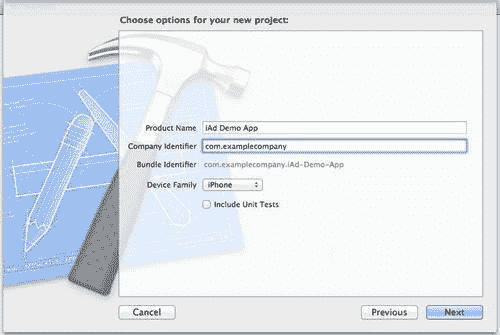
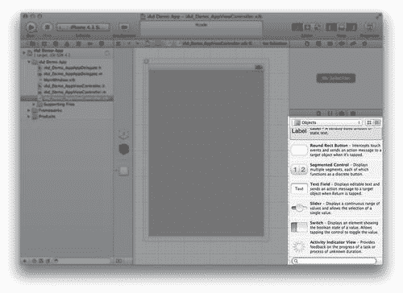
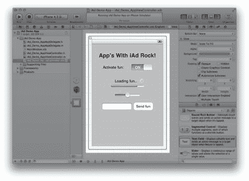
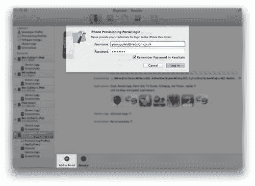
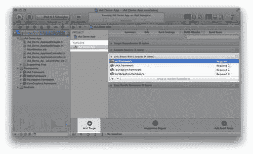
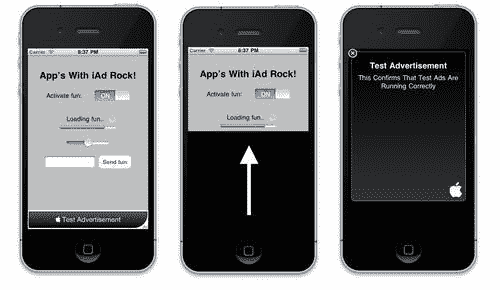
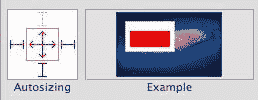
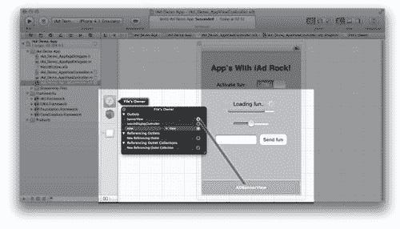
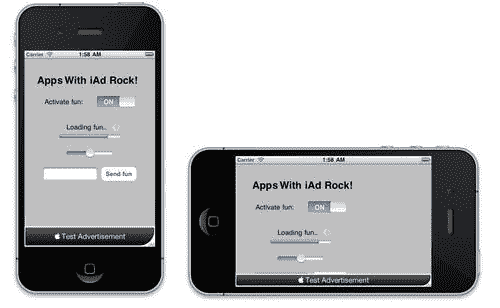

# 第十章。将 iAd 添加到您的应用程序中

> 现在我们已经看到了 iAd 对您的品牌是多么的神奇，我们将看看如何将它们添加到您现有的应用程序中，以增加额外的收入来源。

在本章中，您将学习如何：

+   设置一个空的 iPhone 占位符应用程序，以防您目前没有应用程序及其源代码

+   将 iAd 横幅视图添加到应用程序中

+   更新横幅以处理设备旋转

+   当没有广告可用时隐藏横幅

如果您之前没有创建过 iPhone 应用程序或者没有 iOS 开发经验，不要担心；我们将为您提供添加此功能所需的所有代码。实际上，您甚至可以在没有任何编程经验的情况下将基本的 iAd 横幅添加到应用程序中。话虽如此，不太冒险的人可能更喜欢将此信息传递给他们的应用程序开发团队。

# 设置基本项目

如果您还没有应用程序但仍然想尝试将 iAd 添加到应用程序中，我们可以快速创建一个单屏幕的 iPhone 占位符项目，以便将其添加横幅。

### 注意

我们将使用 Xcode；我们在第四章中安装了它，即*确保它工作*，当时我们设置了 iOS 模拟器，所以您应该有它可用（如果没有，那么请返回并现在设置它）。

如果您不想设置演示应用程序，您可以在`iAd Demo App`文件夹中找到带有书籍资源的完成占位符项目。

# 行动时间——一个占位符应用程序

使用 Xcode 及其内置的界面构建器和拖放 UI 设计器，我们将创建一个带有一些模拟组件的单屏幕 iPhone 应用程序来模拟应用程序：

1.  打开 Xcode。如果您之前没有使用过它，您可以在 Mac 根目录下的`Developer`文件夹中的`Applications`文件夹中找到它。

    ### 注意

    这与 iAd Producer 所在的`Applications`文件夹不同。如果您找不到 Xcode，请使用 finder 中的搜索功能来定位它。

1.  Xcode 将打开**欢迎使用 Xcode**窗口。从这里，选择**创建一个新的 Xcode 项目**。当被要求选择项目类型时，点击**基于视图的应用程序**|**继续**。

1.  您需要输入**产品名称**（这是您想要给应用程序取的名字）和**公司标识符**（这通常是您的网站 URL 的反转）。例如，使用`Demo iAd App`作为名称，使用`com.examplecompany`作为标识符。

1.  确保选择**设备系列**为**iPhone**，并取消选择**包含单元测试**。当您的 Xcode 窗口看起来类似于以下截图时，点击**下一步**按钮：

1.  选择一个位置来保存您的项目和关联文件，然后点击**创建**。

1.  请等待 Xcode 设置您的项目。它将在您选择保存项目的目录中创建几个文件和文件夹。一旦 Xcode 窗口加载完毕，从 Xcode 项目导航器中定位文件`iAd_Demo_AppViewController.xib`。项目导航器位于 Xcode 左侧的一个面板。如果您看不到它，请从 Xcode 菜单栏中选择**视图** | **导航** | **显示项目导航器**。

1.  这将打开 XIB 文件——将这个文件想象成您 iAd 中的一个页面。它将在 Xcode 界面构建器中打开。界面构建器就像 iAd Producer 中的画布；您可以从库中拖放对象来构建页面。要向我们的画布（称为视图）添加对象，请通过选择**视图** | **活动** | **对象库**打开对象库。Xcode 右侧将展开一个面板，您将在其底部找到对象库：

1.  在这里，我们可以看到可用用户界面组件的列表，我们可以将其添加到视图中。找到一个标签并将其拖放到视图中。

    ### 注意

    您会注意到许多这些控件与 iAd Producer 非常相似。这是因为苹果公司试图在 iOS 上的许多对象之间保持一致性，以降低入门门槛和学习曲线。

1.  双击标签以编辑其文本。将文本更改为类似`Apps With iAd Rock!`的内容，然后单击标签外部以退出编辑模式。如果您想更改标签的样式，可以使用属性检查器，其行为类似于 iAd Producer 中的属性和样式。您可以在对象库上方找到属性检查器。添加一些更多对象，例如按钮、开关、滑块和文本字段。将这些对象放置在视图中，但靠近底部留出空间。这就是我们的横幅稍后会出现的地方。

1.  您的视图可能看起来像这样：

1.  实际上，页面的外观并不重要；这只是为了让我们在下一个练习中添加横幅时有上下文。

1.  最后，我们可以在模拟器中运行我们的应用程序。从 Xcode 左上角选择**运行**按钮（带有播放图标），模拟器应该会打开。您应该能够切换开关并移动滑块。每次运行项目时，Xcode 都会构建应用程序并自动保存所有文件。

## 刚才发生了什么？

我们从 Xcode 模板中创建了一个基于视图的应用程序，它给我们提供了一个带有空白视图的单视图应用程序，我们可以向其中添加对象。我们向视图中添加了一些对象，以便在运行应用程序时有一些内容可用。在 Xcode 的界面构建器中完成视图布局后，我们模拟了应用程序以查看其行为。

在设备上测试 iAd 需要您将其注册给 Apple 以进行配置和启用开发。这需要一个有效的付费开发者会员资格，我们在 第一章 的 *开始使用 iAd* 中注册了，以获取访问 iAd Producer 的权限。

# 行动时间 — 在设备上运行

如果您尚未为开发配置设备，我们可以使用 Xcode 的组织者工具登录到 Apple 配置文件门户并设置所需的证书并注册您的设备：

1.  打开 Xcode，如果尚未打开。从菜单栏中选择 **窗口** | **组织者**。这将打开组织者，允许我们管理我们的 iOS 设备、它们的配置文件和应用程序提交。

1.  现在插入一个 iOS 设备，例如 iPhone 或 iPad。如果它与 iTunes 同步，请等待其完成。确保组织者的 **设备** 选项卡已选中，并在左侧列表中找到您的设备。

1.  选择设备，然后单击 **用于开发** 按钮以允许其设置为开发配置。

1.  一旦设备在本地配置完成，选择 **+ 添加到门户** 按钮以联系 Apple 开发者门户，该门户将设置您的设备。输入您的 Apple ID/开发者帐户的 **用户名** 和 **密码**：

1.  组织者现在将与 Apple 通信并启用 Xcode 在您的设备上交互。一旦完成，您的 Mac 将能够向设备发送构建。

1.  关闭组织者窗口，并将设备 **方案** 从 **运行** 和 **停止** 按钮旁边的下拉选择器中的 `Your Device Name` 更改为。Xcode 将构建您的应用程序，您应该会在不久后看到它在设备上运行。

## 发生了什么？

Xcode 自动将您的设备添加到配置文件门户中，您可以在 [`developer.apple.com`](http://developer.apple.com) 查看和管理。当将设备添加到门户时，Xcode 会执行以下步骤：

+   将 **唯一设备标识符 (UDID**) 提交到 Apple 配置文件门户。

+   将设备添加到您的注册设备列表中，该列表与您的开发者帐户相关联。每个帐户最多可以添加 100 台设备。

+   代表您创建并安装证书，这些证书用于保护构建，以确保只有您才能创建它们。

+   代表您生成并设置开发 **配置文件**—这告诉设备是否允许运行应用程序。配置文件包含每个设备的 UDID 列表，有权运行相关应用程序。

### 注意

您需要为每个想要测试的设备重复此过程，并且这特定于 Mac 用户帐户。如果您切换了机器，您需要重新配置 Xcode 并再次执行这些步骤。

在我们的演示应用程序已安装并运行在模拟器和设备上后，我们可以向其中添加第一个 iAd 横幅！

# 将横幅添加到视图中

我们可以使用界面构建器将 iAd 横幅添加到您的应用视图中。这是一个简单的拖放操作，以获得基本的横幅功能。

# 添加横幅的行动时间

我们将在上一练习中构建的占位符应用中添加 iAd 横幅。如果您想使用自己的应用，请确保您熟悉 Xcode 中的界面构建器。按照以下步骤添加横幅：

1.  打开您的项目，或 Xcode 中的我们的演示项目。

1.  从文件列表中打开文件`iAd_Demo_AppViewController.xib`，如果尚未打开。这将启动界面构建器。从对象库中，将**Ad BannerView**对象拖动到主视图中。对象库包含大量项目，可能会使导航变得困难。您可以使用其下方的搜索文本区域来过滤结果。搜索横幅会显示任何与横幅相关的对象。在以下屏幕截图中，您可以看到对**banner:**的搜索。![添加横幅的行动时间]

1.  重新定位横幅视图，使其在屏幕底部中央对齐。

1.  苹果建议将横幅放置在应用的顶部或底部，并确保它是静态的；将其放入可滚动的视图或列表中会限制横幅在屏幕上的显示时间，这将严重影响您活动的收入。尝试使用**运行**按钮或键盘快捷键*cmd* + *r*来运行您的应用。您会发现应用在启动前崩溃。这是由于存在我们需要包含的横幅视图的依赖项。iAd 横幅需要将 iAd 框架包含在我们的应用程序中。

1.  要添加 iAd 框架，点击 Xcode 左侧的项目导航器面板中您的项目名称。如果您使用的是演示项目，这将显示为`iAd Demo Project`，可以在项目导航器的最顶部找到。这将打开 Xcode 主窗口中您项目的信息。在**TARGETS**下选择您的项目名称，然后切换到**构建阶段**。

1.  展开**链接二进制文件与库**部分，然后在该部分的底部点击**+**按钮以打开库/框架选择器。搜索`iAd`并选择**iAd.framework**。然后点击**添加**。

1.  从项目导航器文件列表中，将**iAd.framework**文件拖动到`Frameworks`文件夹。您不必执行此步骤，但这有助于保持项目整洁。

1.  运行您的应用。您应该在几秒钟后看到测试横幅出现。尝试点击它以打开演示广告。

1.  干得好！您的项目现在成功添加了 iAd！

## 刚才发生了什么？

我们刚刚将 Ad BannerView 对象添加到应用视图中，并将其定位在屏幕底部中央。使用构建阶段，即构建和运行应用时调用的步骤列表，我们添加了 iAd 框架以确保它在我们的应用中可用。我们必须将`iAd.framework`添加到我们的应用项目中，否则横幅视图将无法访问正确的组件并导致应用崩溃。

当应用处于调试或开发模式时，iAd 网络会自动提供测试广告。这是为了防止**点击欺诈**，即通过生成人工点击（或轻触）来欺骗系统并虚假增加收入：



在你将应用提交到 App Store 之前，我们需要启用我们的广告以供生产。我们将在下一章中这样做，但首先让我们看看如何改进应用内的横幅体验。

# 处理方向变化

你可能记得，当我们使用 iAd Producer 构建横幅时，我们检查了它们在纵向和横向是否都工作；然而，目前我们的演示应用只支持纵向。确保你的应用可以在任何方向上显示横幅，这将确保你从 iAd 网络中获得最大的曝光和收入。

# 行动时间——你让我旋转得如此之快

如果你正在使用演示应用，那么让我们启用所有可能的方向。确保我们的横幅能够相应地调整：

1.  在 Xcode 中打开演示应用。如果你正在使用已经支持多方向的自己的应用，请跳到步骤 4。

1.  为了使我们的应用知道当设备旋转时应该旋转视图，我们需要修改一点 Objective C 代码。从项目导航器打开文件`iAd_Demo_AppViewController.m`；你会在屏幕上看到代码。找到方法`(BOOL)shouldAutorotateToInterfaceOrientation`，它应该位于函数的末尾附近。当设备旋转并且我们能够告诉它何时应该和不应该更新视图时，会调用这个方法。找到以下行：

    ```swift
    return (interfaceOrientation == UIInterfaceOrientationPortrait);

    ```

1.  目前，它检查旋转方向是否为纵向，如果是，则返回`YES`，如果不是，则返回`NO`。我们能够覆盖这个检查并始终说`YES`；将行更改为读取：

    ```swift
    return YES;

    ```

1.  这意味着应用将允许视图旋转到任何可能的方向。

1.  运行应用并尝试旋转它；你会看到视图旋转，但在横向时会被裁剪，横幅视图不可见。现在，我们将忽略其余被裁剪的内容，但调整横幅使其始终可见。

1.  在界面构建器中打开你的视图的 XIB 文件。如果你正在继续使用演示应用，它将是`iAd_Demo_AppViewController.xib`。点击视图底部的广告横幅视图以选择它。从菜单栏中选择**视图** | **实用工具** | **显示大小检查器**。

1.  这将打开大小检查器，允许我们修改横幅视图的布局信息。大小检查器位于 Xcode 右侧，位于对象库上方。

1.  找到**Autosizing**框，并单击顶部的红色双倍横梁形状以禁用它。然后单击底部的一个以启用它。你的自动调整大小设置应如下截图所示：

1.  这意味着横幅的位置将从屏幕底部设置，而不是顶部，因此无论高度如何，它始终附着在视图的底部。

1.  再次测试广告。无论方向如何，横幅现在都位于屏幕底部，但它并没有动态更新以正确填充屏幕。我们需要使横幅视图可访问，以便我们可以在旋转发生时通知它。这与 iAd Producer 中的出口类似工作。

1.  从项目导航器中打开文件`iAd_Demo_AppViewController.h`。这将打开 Xcode 中的代码编辑器。在`#import <UIKit/UIKit.h>`之后，添加以下代码：

    ```swift
    #import <iAd/iAd.h>

    ```

1.  这告诉文件我们将使用 iAd 框架，因此它应该导入它。现在在`@interface iAd_Demo_AppViewController : UIViewController`和`@end`之间，添加以下代码：

    ```swift
    {
    ADBannerView *bannerView;
    }
    @property(nonatomic, strong) IBOutlet ADBannerView *bannerView;

    ```

1.  这创建了一个名为`bannerView`的变量，它将可以从我们的代码中访问。`IBOutlet`告诉界面构建器`bannerView`可以作为出口使用。

1.  将代码编辑器切换到文件`iAd_Demo_AppViewController.m`，在`@implementation iAd_Demo_AppViewController`之后，在新行上添加以下代码：

    ```swift
    @synthesize bannerView;

    ```

1.  这将使我们能够访问`bannerView`的属性。

    ### 注意

    你可能会发现 Xcode 尝试通过自动完成和建议来帮助你编写代码。为了确认你想要使用建议，请按*tab*键。

1.  在我们的出口就位后，我们可以在界面构建器中连接到它。打开`iAd_Demo_AppViewController.xib`，在界面构建器左侧的**File's Owner**图标（一个立方体线框）上右键单击。点击并拖动圆圈，在覆盖列表中的**bannerView**出口之后，将其拖到主视图上的**AdBannerView**，如图所示：

1.  这将我们在代码中创建的出口与界面构建器视图上的横幅链接起来。现在我们可以在代码中访问我们的横幅，并可以在旋转发生时通知横幅。在文件底部的`@end`行附近，添加以下代码块：

    ```swift
    (void)willRotateToInterfaceOrientation:(UIInterfaceOrientation)toInterfaceOrientation duration:(NSTimeInterval)duration
    {
    if(UIInterfaceOrientationIsLandscape(toInterfaceOrientation))
    bannerView.currentContentSizeIdentifier =ADBannerContentSizeIdentifierLandscape;
    else
    bannerView.currentContentSizeIdentifier = ADBannerContentSizeIdentifierPortrait;
    }

    ```

1.  当添加此代码时，你可能发现自动完成很有用。我们正在使用设备在旋转发生之前调用的`willRotateToInterfaceOrientation`方法。然后我们检查它将要旋转到的方向，并更新我们横幅的`contentSizeIdentifier`属性。

1.  运行应用并旋转设备进行测试；横幅现在将更新以填充屏幕并显示横幅广告。

## 刚才发生了什么？

我们通过调整横幅视图以使其工作，提高了我们应用的体验和潜在收入。无论设备处于何种方向，你的横幅都应该动态更新横幅创意：



通过使横幅视图可以从代码中访问，我们现在能够为我们的应用添加更多增强功能，例如，在没有广告可用时隐藏视图或提供备用内容。

## 突击测验

Xcode 和 Objective-C 一开始可能会有些令人不知所措，但一旦你掌握了基础知识，你会注意到它与 iAd Producer 的相似之处。通过尝试这些问题来检验你学到了什么：

1.  要在界面构建器中使一个对象可以从代码中访问，你会怎么做？

    +   a. 在你的代码中声明一个 IBOutlet，然后在界面构建器中连接该出口

    +   b. 在界面构建器中重命名该项，然后在代码中使用它

    +   c. 只需编写代码，界面构建器就会添加该项

    +   d. 通过`[UIView objectAtIndex:0]`访问视图项，根据它们在页面上的位置

1.  如果 iAd 横幅导致我们的应用崩溃，最常见的原因是什么？

    +   a. 没有广告可用

    +   b. 下载的广告对于操作系统来说太大，无法处理

    +   c. 没有互联网连接

    +   d. 项目缺少 iAd 框架

# 处理无可用广告

你的应用可能会遇到 iAd 网络无法提供广告的情况。这可能是因为网络覆盖差或 iAd 尚未在用户所在的国家可用。我们应该优雅地处理这种情况，确保我们不显示空横幅，并在有广告可用时将其重新显示在视图中。

# 是时候行动起来——禁止横幅广告

通过对我们的视图和代码进行一些小的调整，我们可以根据广告的可用性来动画化横幅的显示和隐藏：

1.  在 Xcode 中打开示例项目，或打开包含广告横幅视图的自己的项目。打开你的视图的主控制器文件，例如，`iAd_Demo_AppViewController.m`。

1.  假设广告总是会失败，并在应用进入视图时立即将横幅移出视图。然后我们将等待 iAd 网络的成功消息，并将其重新显示在视图中。在约第 30 行添加以下代码：

    ```swift
    - (void)viewWillAppear:(BOOL)animated
    {
    CGRect frame = self.view.bounds;
    CGPoint bannerOrigin =CGPointMake(CGRectGetMinX(frame), CGRectGetMaxY(frame));
    bannerView.frame = CGRectMake(bannerView.bounds.origin.x, bannerOrigin.y, bannerView.frame.size.width, bannerView.frame.size.height);
    }

    ```

1.  这将横幅的框架设置为将`y`值设置为当前视图的高度，从而将其移出屏幕。尝试运行你的应用；你会发现横幅从未出现，即使它可能是已加载的，因为当广告成功加载时，横幅永远不会回到原来的位置。

1.  我们现在将使用 iAd 横幅的 `delegate` 方法来处理广告的成功和失败响应。委托是一种与对象交互并接收事件或消息的方式；在我们的案例中，我们可以在代码中实现横幅的委托，以便它通知我们变化。让我们更新代码，让横幅知道它应该使用什么作为其委托。在上次修改的 `viewWillAppear` 方法中，将以下内容添加到方法末尾：

    ```swift
    bannerView.delegate = self;

    ```

1.  添加此方法后，您应该会在行号旁边看到一个黄色警告图标。单击此图标以显示警告：

1.  这个警告告诉我们，尽管我们已经将横幅视图的委托设置为当前文件（通过说 `self`），但它目前无法处理其角色。切换到 `iAd_Demo_AppViewController.h` 文件，它被称为头文件，并找到 `UIViewController`。将其更新为以下内容：

    ```swift
    UIViewController<ADBannerViewDelegate>

    ```

1.  这告诉我们的视图控制器类它可以响应来自 Ad Banner View 的委托请求。有了我们的委托和能够响应它的视图控制器，我们现在可以添加处理广告的成功和失败方法。在您的 `iAd_Demo_AppViewController.m` 文件中的 `@end` 之前，添加以下内容：

    ```swift
    #pragma mark ADBannerViewDelegate methods

    ```

1.  这不是必需的，但它有助于分离我们的代码部分，并突出显示 `delegate` 方法开始的地方。

1.  在我们的 `pragma mark` 行之后，我们可以添加委托方法。从在广告成功加载后使横幅回到视图中的代码开始。在您的 `pragma mark` 行后立即添加此方法：

    ```swift
    -(void)bannerViewDidLoadAd:(ADBannerView *)banner
    {
    CGRect frame = self.view.bounds;
    CGPoint bannerOrigin =CGPointMake(CGRectGetMinX(frame), CGRectGetMaxY(frame));
    bannerOrigin.y -= bannerView.bounds.size.height; 
    // Animate into view
    [UIView animateWithDuration:2.0f
    animations:^{
    bannerView.frame = CGRectMake(bannerView.bounds.origin.x, bannerOrigin.y, bannerView.frame.size.width, bannerView.frame.size.height);
    }];
    }

    ```

1.  在这里，我们添加了 `bannerViewDidLoadAd` 方法，这是横幅的委托方法。当 iAd 网络成功交付广告时，它会调用此代码。然后我们取横幅的框架并调整它，使其回到视图中，并添加了动画变化，使横幅从视图底部移动进来。运行广告，您将看到横幅出现。

    ### 注意

    有时 iAd 网络不会交付广告来模拟失败。如果您发现横幅没有出现，请尝试关闭并重新打开您的应用程序以触发另一个广告。

1.  当下载广告出现问题，横幅正在动画显示时，让我们确保它也可以动画退出。一旦横幅可见，它将在各种创意之间循环，因此我们不应该假设一旦我们有一个广告，我们就会继续收到一系列的广告。类似于 `bannerViewDidLoadAd` 委托方法，当我们无法获取广告时，我们可以使用 `didFailToReceiveAdWithError` 方法。使用以下代码，将其放置在上一步添加的代码下方：

    ```swift
    (void)bannerView:(ADBannerView *)banner didFailToReceiveAdWithError:(NSError *)error
    {
    CGRect frame = self.view.bounds;
    CGPoint bannerOrigin =CGPointMake(CGRectGetMinX(frame), CGRectGetMaxY(frame));
    // Animate into view
    [UIView animateWithDuration:2.0f
    animations:^{
    bannerView.frame = CGRectMake(bannerView.bounds.origin.x, bannerOrigin.y, bannerView.frame.size.width, bannerView.frame.size.height);
    }];
    }

    ```

1.  您可能会注意到，此代码几乎与我们收到广告时的代码相同；只是现在我们不是从框架中减去横幅的高度，因此它处于屏幕外。在下一个练习中，我们将通过不重复代码来优化我们的代码。

1.  如果你耐心地观察你的应用，它最终会失败下载横幅，你应该看到当前的横幅从视图中滑出。

## 刚才发生了什么？

我们在 `viewWillAppear` 方法中添加了一些代码，这个方法会在视图即将变得可见时被调用。这段代码将空横幅隐藏在屏幕之外，以便为额外的组件腾出更多空间。使用代理，我们设置了视图以响应来自 iAd 网络的短信，并根据广告的可用性在屏幕上动画横幅的显示和隐藏。

## 尝试一下英雄

我们的 app 看起来很棒，横幅出现在我们的应用中，并在旋转时正确调整大小，当广告可用时显示或隐藏自己。如果你觉得这些步骤很简单，那么尝试这些更高级的任务：

+   更新占位符应用中项目的 **自动调整大小** 属性，以便在横幅中不会裁剪。

+   如果你熟悉 iPhone 开发，考虑将所有内容组合到一个与横幅分开的视图中。这样，它就可以成为横幅视图的兄弟视图，并且它的布局可以根据横幅的可用性进行调整。

+   如果你有自己的应用，尝试在应用的所有页面之间共享一个横幅对象以提高效率。

+   创建一个 iPad 项目，并在其中添加一个全屏横幅。作为参考，使用：[`developer.apple.com/library/ios/#documentation/UserExperience/Conceptual/iAd_Guide/Full-ScreenAdvertisements/Full-ScreenAdvertisements.html`](http://developer.apple.com/library/ios/#documentation/UserExperience/Conceptual/iAd_Guide/Full-ScreenAdvertisements/Full-ScreenAdvertisements.html)。

+   尝试下一个 *行动时间* 部分，在那里，对于更有冒险精神的开发者，我们将整理代码！

+   在[`developer.apple.com/library/mac/#documentation/Cocoa/Conceptual/CocoaFundamentals/CommunicatingWithObjects/CommunicateWithObjects.html`](http://developer.apple.com/library/mac/#documentation/Cocoa/Conceptual/CocoaFundamentals/CommunicatingWithObjects/CommunicateWithObjects.html)了解更多关于 Objective C 基础的知识。

# 行动时间 — 清理代码

当你开始复制代码时，你正在增加维护你的应用所需的努力，因为你必须遍历每一个实例并对其进行更改。在我们的上一个练习中，我们有三个相似的代码块，我们可以将它们合并成一个智能处理这些情况的方法。这个函数将根据横幅的可用性来处理我们广告的隐藏和显示。继续使用我们的演示应用，完成以下步骤以清理代码：

1.  在横幅的代理方法和 `pragma mark` 之前创建一个空方法，添加以下代码：

    ```swift
    -(void) adjustBannerVisibility
    {
    }

    ```

1.  我们需要在文件 `iAd_Demo_AppViewController.h` 的 `@end` 语句之前添加以下内容，以便在头文件中：

    ```swift
    -(void) adjustBannerVisibility;

    ```

1.  这将抑制 Xcode 关于未知方法的任何警告。现在返回到主文件——`iAd_Demo_AppViewController.m`。

1.  我们现在可以构建这个方法的功能。它将替换并管理横幅的显示和隐藏。在方法内部添加以下内容：

    ```swift
    CGRect frame = self.view.bounds;
    CGPoint bannerOrigin =CGPointMake(CGRectGetMinX(frame), CGRectGetMaxY(frame));
    // check if the banner is loaded
    if(bannerView.bannerLoaded) {
    // bring banner into view
    bannerOrigin.y -= bannerView.bounds.size.height;
    }
    // Animate into view
    [UIView animateWithDuration:2.0
    animations:^{
    bannerView.frame = CGRectMake(bannerView.bounds.origin.x, bannerOrigin.y, bannerView.frame.size.width, bannerView.frame.size.height);
    }];

    ```

1.  这与之前的横幅代码工作方式相同，但都在一个方法中。`bannerView.bannerLoaded`检查我们是否已加载横幅，然后相应地调整偏移量。

1.  目前，我们正在调整`viewWillAppear`、`didFailToReceiveAdWithError`和`bannerViewDidLoadAd`方法中的横幅。逐个查看这些方法，并将横幅框架代码替换为我们新的方法。您可以通过以下代码行调用我们的方法：

    ```swift
    [self adjustBannerVisibility];

    ```

    ### 注意

    确保您不要从`viewWillAppear`方法中移除`banner.delegate = self`；这将阻止您的横幅永远显示出来！

+   例如，您的`bannerViewDidLoad`方法现在应该看起来像以下这样：

    ```swift
    -(void)bannerViewDidLoadAd:(ADBannerView *)banner
    {
    [self adjustBannerVisibility];
    }

    ```

+   与任何更改一样，测试您的应用并确保新代码按预期工作！

## 刚才发生了什么？

通过将多个方法合并为一个方法，我们减少了因错误而导致的代码失败风险，并且可以在一个中心位置更新我们的代码，而无需重复任何更改。应用现在变得更加整洁。删除代码真的很令人满意，因为这意味着未来工作量更少！

# 摘要

在本章中，我们使用了 iAd 为您的应用用户提供了一个简单、广为人知且沉浸式的横幅和广告体验。为了使横幅在我们的应用中优雅地工作并最大化收入机会，我们：

+   创建了一个占位符应用来测试 iAd 功能

+   使用界面构建器将横幅放置在静态位置

+   仅在横幅有内容时处理横幅的显示

+   优化了代码以提高其可维护性

通过提高我们广告的可见性并处理没有广告可用的情况，我们应该能够从我们的应用中生成健康的最优收入流。在我们开始兑现支票之前，我们需要激活我们的应用以投放实时广告，并查看我们如何跟踪收入；所有这些内容将在最后一章中介绍！
