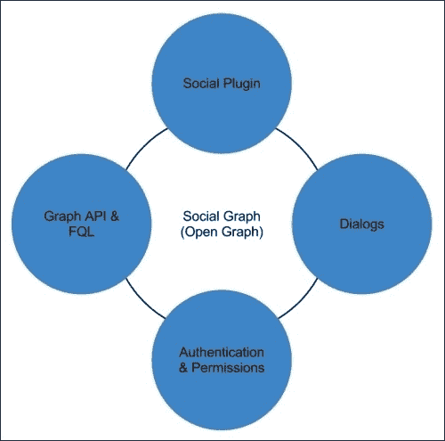
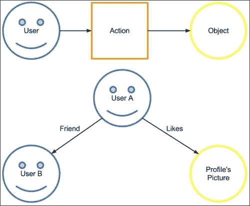
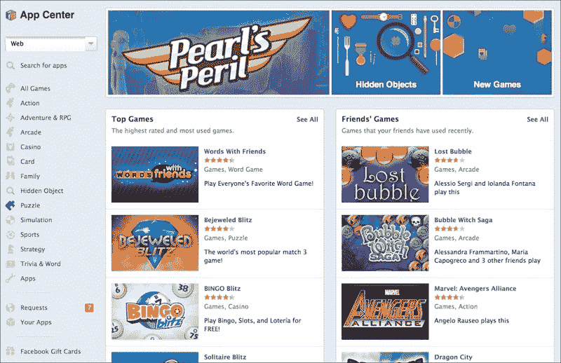
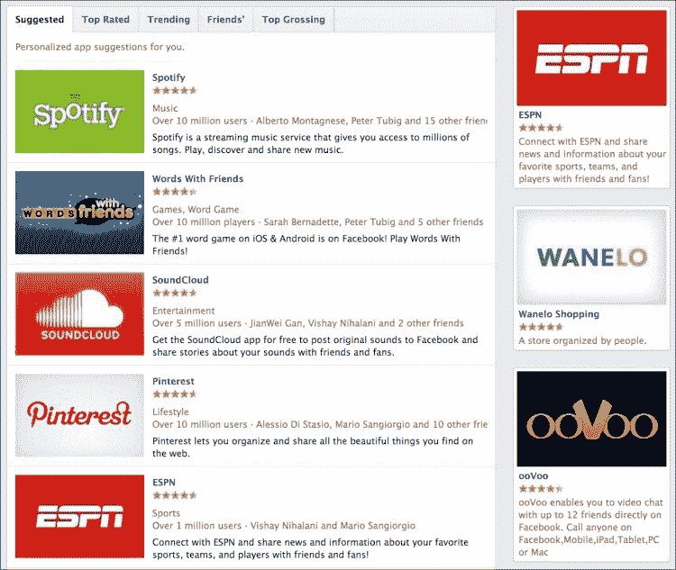
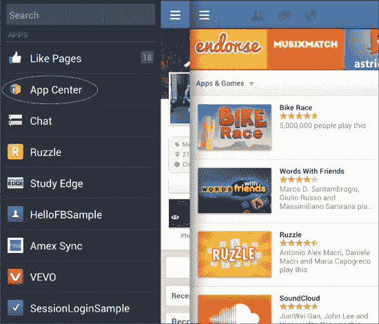
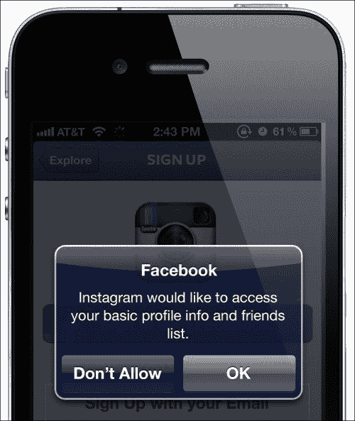
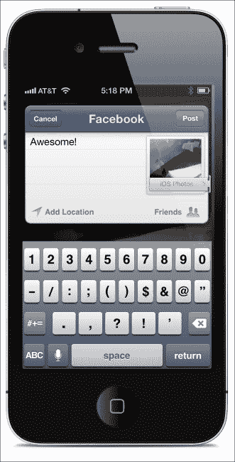

# 第一章. Facebook 平台简介

平台是 Facebook 项目的主要组件之一。它允许开发者创建能够依赖 Facebook 的架构层来扩展他们自己的系统的第三方应用程序。自 2007 年 5 月平台推出以来，Facebook 工程师一直在努力扩展、改进和使架构更加灵活、可靠、安全、健壮。去年以来，Facebook 一直专注于提升移动设备上的用户体验，因此他们扩展了他们的架构，引入了原生 SDK，如 iOS 和 Android。

在本章中，我们将从开发者的角度来探讨 Facebook 平台的架构和功能。我们将重点关注那些可以使我们的应用程序在社交世界中迅速传播的平台部分。

# Facebook 平台 – 功能

自 Facebook 最初推出以来，它已经发生了很大的变化。在其首次发布时，它不过是一个学生信息的存储库。当 Facebook 成为领先的社交网络网站时，Facebook 工程师开始开发一套 REST API，这后来允许开发者提取用户数据的一部分，如基本信息、活动和好友列表。

正如我们之前提到的，去年 Facebook 投入了大量精力来生产各种 SDK 集合，以满足开发者的需求。

上述图表显示了 Facebook 平台具有模块化架构，为开发者提供多种功能。

## 社交图谱

社交图谱是 Facebook 平台的核心组件。平台使用图结构来存储用户、对象以及它们之间的连接。我们可以将社交图谱的结构总结如下：

+   **用户**：这是在 Facebook 图谱中表示单个个人的数据结构。

+   **动作**：这是两个对象之间的链接。这可以通过平台定义的属性或开发者创建的属性进行自定义。

+   **对象**：这代表除了用户之外的所有实体；例如，Facebook 活动和 Facebook 页面。可以使用开放图谱自定义任何对象。

社交图谱的一个用例是当 Facebook 用户喜欢一个朋友的图片时。在这种情况下，图片是对象；“喜欢”对应动作；当然，Facebook 用户是用户。

以下图表显示了基于刚才提到的用例场景的社交图谱的基本结构：

图结构提供了以下优势：

+   **高关系定制**：开发者可以使用预定义的连接或创建自己的连接。

+   **分布**：使用图路径算法，朋友的动态可以轻松被发现并显示在用户的动态时间轴上。

+   **对象定制**：任何东西都可以是对象，用户也不例外。如果默认对象定义不足，没问题，开发者可以创建自己的定制对象并将它们存储在社交图谱中。

图形结构提供了更多技术优势，但它们超出了本书的范围。

## 图形 API

作为 Facebook 平台最重要的部分，图形 API 对外部世界开放；事实上，它是开发者与社交图谱和现实生活交互的主要工具。这是一个基于 HTTP 调用的 API 系统，用于查询、更新和创建新的对象和动作。

图形 API 也是 Facebook SDKs 用来实现我们应用程序和社交图谱之间低级通信的系统。

我们将在第六章“Facebook 图形 API”中关注图形 API。

## 社交插件

社交插件是可以在网站上使用以扩展社交功能的网络工具，这些功能与 Facebook 平台相连。以下列表显示了平台当前提供的社交插件：

+   **赞按钮**：这允许用户将外部网站上的网页分享到他们的 Facebook 个人资料

+   **发送按钮**：这会将网页内容发送到 Facebook 朋友

+   **关注按钮**：这允许人们订阅其他 Facebook 用户

+   **评论**：这允许用户为您的网站上的任何部分创建评论

+   **活动流**：这允许其他网站显示用户的朋友的动态

+   **推荐框**：这建议用户可能喜欢您网站上哪些页面

+   **赞框**：这允许用户在您的网站上赞和展示 Facebook 页面

+   **登录按钮**：这显示了 Facebook 的**登录**按钮和当前网站上已经登录的朋友的图片

+   **注册**：这使您的网站能够使用 Facebook 作为认证系统

+   **脸谱**：这显示了已经赞过 Facebook 页面或注册过您网站的用户的图片

所有社交插件仅适用于网络应用。

## 对话框

对话框为访问多个平台上的社交功能提供了统一的接口。目前有七个对话框可用，在我看来，以下是最重要的：

+   **分享对话框**：在用户的动态时间轴上发布

+   **登录对话框**：授权应用程序使用 Facebook 平台作为单一登录入口点

+   **好友对话框**：发送好友请求

## 认证和权限

Facebook 平台的登录部分分为两个不同的部分，如下所示：

+   应用程序权限使我们社交应用能够访问用户信息。我们将在本章后面讨论这些权限。

+   签名请求是在某些情况下平台传递给应用程序的请求的一部分；这对于本书的范围来说并不重要；因此，我们不会讨论它。

# 功能 - 存储和使用平台数据

由于开发者处理的数据类型，Facebook 实施了关于此类用户信息使用的严格政策。开发者需要小心处理从平台接收到的数据。

Facebook 平台包含大量关于任何用户的信息。由于这种丰富性，开发者应仅请求操作应用程序所需的数据，以最佳方式运行。

用户登录到他们的社交应用后，开发者可以访问基本用户信息，无需请求任何特定权限。基本账户信息包括姓名、性别、个人资料图片、URL 和好友列表。为了访问更多账户数据，我们需要明确请求用户的许可。

为了访问额外信息，我们需要请求权限。此外，我们还需要定义并使我们的应用程序隐私政策可供用户查看。我们需要确切地说明我们将如何使用用户信息。

### 注意

注意，不能与任何第三方网络、广告交易平台和货币化或广告服务共享信息。有关更多信息，请参阅[`developers.facebook.com/policy/`](https://developers.facebook.com/policy/)。

## 集成点

理解应用集成点非常重要。这些点将确保我们的社交应用可见性。Facebook 平台提供了许多集成点，有助于在用户和应用程序之间创建无缝的用户体验。

当我们构建 Facebook 应用时，无论是移动端还是桌面端，我们始终需要记住使用所有可用的集成或营销点，这些点可以与我们的社交应用相匹配。平台提供以下点：

+   内容和信息

+   沟通和动态信息

+   移动信息和通信

+   用户行为

+   市场营销和推广机制

集成点将在第八章“推广您的社交应用”中介绍。

Facebook 对集成点使用制定了政策。开发者应始终定义公平的用户体验，不会阻止用户使用 Facebook 的社交渠道。一旦我们的应用程序获得在用户时间轴上发布权限，应用程序应始终提醒用户下一次时间轴更新。我们在社交应用中放置的广告必须与 Facebook 平台上的任何视觉对象不同。

关于 Facebook 消息有一个重要的注意事项。此渠道应仅用于用户之间的沟通，而不是应用程序和用户之间的沟通。

## Facebook 应用门户

Facebook App Portal 于 2012 年 5 月推出，旨在帮助用户将其安装到他们的时间轴或移动设备上。该门户最初推出时包含 600 个移动和 Web 应用。在这个门户中，一个团队会选择将在 App Center 中出现的应用，以确保根据用户评分和应用参与度分析，向公众提供高质量的产品。这并不意味着我们不能创建新的 Facebook 应用，但为了在我们的应用在 App Center 中活跃起来，我们将不得不等待我们的应用变得流行。

关于 Facebook App Center 也有一些批评。帮助提高门户上提供的产品质量的同一政策，却否认了新应用的可视性。

Facebook App Center 的目标不是取代 iOS 应用或 Google Play 商店。真正的目标是引导移动用户到这些商店。为了获取更多数据，我们可以看看以下统计数据：

+   App Center 在 2012 年 5 月仅将人们引导到 App Store 就超过 8300 万次

+   类似地，Facebook 在 2012 年 5 月将用户引导到 iOS 应用上 134 百万次

Facebook App Center 在桌面和移动版本以及 Facebook iOS 和 Android 应用中都可以使用。我们将概述桌面和移动版本。

对于桌面版本，你可以在左侧栏中找到**App Center**链接。一旦点击链接，你将被重定向到实际门户；你也可以通过访问[`www.facebook.com/appcenter/`](https://www.facebook.com/appcenter/)来访问 App Center。

Facebook App Center – 主要部分

用户体验完全基于 Facebook 个人资料进行定制。实际上，页面将根据访问它的用户而有所不同。建议系统使用推荐和你的朋友的数据来定制你的门户着陆页。

如前一个截图所示，页面布局简单。在左侧栏中，我们有三部分：搜索和分类、请求和我们的应用，以及 Facebook 礼品卡。在页面中心，我们可以看到不同的部分，如**热门游戏**和**朋友的游戏**。这些部分是为每个用户独特定制的。

如果我们向下滚动，我们还可以看到如下截图所示的章节：

我们可以很容易地理解门户上建议是如何工作的——我们朋友中最受欢迎的应用总是位于顶部。

当然，我们很高兴 Facebook 决定给我们提供选择，去发现我们网络中未使用过的应用。

我们也可以看看 App Center 的 Android 移动版本，如下面的截图所示：

## 应用权限

如前所述，隐私是用户数据的首要关注点。Facebook 意识到这个问题，并致力于保护用户信息免受未经授权的访问。

为了规范账户信息的访问，Facebook 工程师基于权限定义了一项隐私政策。权限是开发者访问账户信息的唯一方式。

当我们创建一个 Facebook 应用程序（我们将在后面看到如何操作）时，我们将自动获得用户某些信息的访问权限。这也被称为**基本账户信息或公开资料和好友列表**。

有时这些信息不足以满足我们的应用程序体验；因此，我们可以要求我们的用户以下权限：

+   **电子邮件权限**

+   **扩展资料权限**

+   **扩展权限**

+   **开放图权限**

+   **页面权限**

**基本账户权限或公开资料和好友列表**：这提供了以下账户属性的访问权限：`id`、`name`、`first_name`、`last_name`、`link`、`username`、`gender`、`locale`、`age range`以及我们设置为公开的所有信息。

**电子邮件权限**：这提供了访问用户电子邮件地址的权限。请注意，根据 Facebook 平台政策，您不能向用户的电子邮件账户发送垃圾邮件。有关更详细的信息，请参阅[`developers.facebook.com/docs/reference/login/email-permissions/`](https://developers.facebook.com/docs/reference/login/email-permissions/).

**扩展资料权限**：此权限用于访问资料信息。此组权限在登录流程中不能被撤销；因此，它们是必需的。如果我们希望它们是可选的，我们必须设计我们的工作流程应用程序，在应用程序的特定部分请求这些权限，而不是在登录时。有关更详细的信息，请参阅[`developers.facebook.com/docs/reference/login/extended-profile-properties/`](https://developers.facebook.com/docs/reference/login/extended-profile-properties/).

**扩展权限**：这允许开发者访问敏感信息，并赋予发布和删除数据的能力。

当一个应用程序被授予发布权限的访问权限时，我们能够执行以下操作：

+   上传照片和视频（包括创建相册）

+   发布到用户的动态

+   在照片和视频中创建标签

+   在故事中创建点赞和评论

+   发布问题

+   创建笔记

+   为事件或群组创建内容

我们应该只在需要时请求扩展权限。

**开放图权限**：这提供了访问开放图信息以及创建新操作的能力。

**页面权限**：这允许开发者检索当前用户拥有的页面和应用程序的信息。

我们的应用程序应该足够智能，能够在运行时理解我们目前拥有用户账户信息的哪些权限。每次我们对 Facebook 用户数据进行任何操作时，应用程序都应该在运行时检查我们是否被授予完成请求操作所需的权限。这非常重要，因为用户随后能够通过 Facebook 网站在应用程序环境之外修改/删除应用程序权限。

处理缺失的权限将肯定改善用户与我们的应用程序的交互。用户体验将变得更加流畅，我们不会在我们的 App Store 着陆页上处理负面反馈。

### 小贴士

**经验法则**

你请求的权限越多，用户不授予它们的可能性就越大。始终给用户提供按他们意愿开启和关闭权限的能力。

# Facebook iOS SDK 3.x 的新功能

当 Facebook 工程师发布了 Facebook iOS SDK 的 3.0 版本时，许多开发者因为提供了许多改进而感到非常兴奋，这些改进使得开发者能够构建社交应用。

新的 SDK 提供了以下几个新功能：

+   集成在 iOS 6 中

+   原生 UI 控件用于常见操作

+   更好的会话管理

+   移动应用分析

## iOS 6 中的 Facebook 集成

Facebook 是 iOS 中集成的第二个社交服务；第一个是 iOS 5 中的 Twitter。Facebook 集成将为想要构建社交应用的开发者带来几个优势；实际上，Facebook iOS SDK 正是利用了这种集成。

为了在 iOS 设备上使用 Facebook 集成功能，我们需要在**设置**中设置一个 Facebook 账户。

一旦 Facebook 账户与 iOS 设备连接，我们需要考虑我们应用程序的数据流。

首先，为了使用原生登录对话框，我们需要独立处理读写权限。因此，我们需要执行不同的请求以获取用户账户信息的权限。

Facebook SDK 提供了使用原生登录对话框的支持；然而，当设备上没有设置 Facebook 账户时，相同的 API 将提供回退到快速应用切换界面。

原生 UI 登录对话框

前面的图片展示了在 iOS 6 上原生登录交互的一个示例。

另一个利用 iOS Facebook 集成的 SDK 功能是分享功能。使用原生分享功能，用户将能够通过原生 iOS 功能发布状态更新、链接、照片、视频，以及与朋友和位置标记操作。不幸的是，这个 API 没有回退来支持没有设置 Facebook 账户的设备。因此，这意味着我们需要手动处理它。

在我们的实际应用实现过程中，我们将使用原生分享对话框实现分享功能；然而，我们也将引入回退功能，以便在设备没有与应用程序关联的 Facebook 账户时提供实用的替代方案。

iOS 6 提供的所有原生功能都可以真正提高用户体验，避免令人烦恼的快速应用切换效果。我们的流程将在整个应用中看起来更加一致。

以下图片展示了如何使用分享对话框发布带有图片的状态更新。

原生 UI 分享对话框

我想提出一个关于原生功能的考虑。当然，它们非常有用，因为它们肯定会提高我们社交应用的用户体验。但也有一些明显的缺点。我们需要改变请求权限的方式，并且原生 API 只随着 iOS 更新而更新。这意味着，如果需要修复 API 的时间，我们需要等待才能获得这样的修复，这可能会很耗时。Facebook SDK API 的更新频率比原生功能更高；因此，它们更可靠且经过充分测试。此外，开发者不需要使用 SDK API 更改应用程序请求权限的方式。

## 原生 UI 控件

Facebook SDK 的新版本提供了几个可用的 UI 组件，以便执行常见的操作，如好友选择、地点选择、登录和用户头像。

我首先想讨论的是登录组件，也称为`FBLoginView`类。使用这个组件实现登录/注销 Facebook 流程是多么简单，这真的令人印象深刻。将`FBLoginView`对象添加到我们的界面中，将使我们的社交应用能够以透明的方式执行登录和注销。我们只需要处理回调，以便在成功或失败响应中自定义我们的系统。我们将在编码之旅中稍后深入了解`FBLoginView`。

社交应用的一个重要部分包括展示用户个人资料信息和 Facebook 个人头像的能力。在 SDK 3.0 之前，展示用户头像的方式是通过下载图片并将其放置在我们的界面中。当然，处理这个流程并不复杂，但许多事情可能会出错，例如下载和存储图片时可能会出现错误，这可能会减慢我们的开发进程。使用新的组件`FBProfilePictureView`，我们只需在我们的界面中添加一个新的`FBProfilePictureView`实例。用户登录后，我们将 Facebook 个人资料 ID 传递给`FBProfilePictureView`对象，这样我们就完成了——我们得到了用户的头像。

每当我们思考创建我们的社交应用并将其病毒式传播时，我们首先想到的是给用户分享他们生活的能力。每次我们在 Facebook 时间轴上发布内容，我们总是试图标记我们的朋友；因此，我们需要一种方式来挑选我们的朋友，也许还要选择一个地点。框架 SDK 提供了现成的组件，能够显示和选择朋友和地点。开发者需要做的唯一工作就是处理回调。这些组件也可以很容易地进行定制，我们将以`FBFriendPickerViewController`为例。

## 更好的会话管理

在 SDK 2.x 中，会话管理是一个痛点。实际上，通过访问令牌进行会话管理是开发者的责任。在 SDK 3.x 中，Facebook 工程师引入了新的会话管理流程 API，将处理与认证和会话相关的所有方面，包括刷新令牌。

新的会话管理过程的核心是`FBSession`。在新版本的框架中，`FBSession`负责管理用户登录流程和处理我们应用使用期间的 Facebook 会话。新的会话管理组件有几个改进和新特性，例如安全令牌的自动刷新功能，这是我个人比较喜欢的。在框架的上一版本中，开发者负责扩展认证令牌。

新的会话管理类使用 Objective-C 的块隐喻将响应从任何会话操作（如登录、登出和其他状态变化）发送回我们的应用程序。

## 移动分析

对于开发者来说，了解用户如何使用他们的社交应用非常重要。在框架的上一版本中，Facebook 工程师引入了新的使用指标，通过广告帮助开发者提高他们的应用货币化潜力。

应用使用指标为原生登录对话框和分享表（分享对话框）的印象和用法提供分析。开发者还可以使用 AppInsight 服务可视化这些指标。

在 Facebook 移动产品上，广告正在变得越来越大。新的框架可以跟踪来自您应用的转换事件。转换事件帮助商家跟踪他们在 Facebook 广告投资上的回报率。

我们在框架中还有一个新特性，称为**购买事件**。购买事件目前仍处于测试版，但最终将提供应用内购买元素的能力。

我们将在第八章“推广您的社交应用”中详细研究 Facebook 分析。

# 平台参考

技术参考在开发应用程序中始终非常重要。Facebook 为开发者提供的信息量相当可观。

我们可以从 Facebook 开发者页面([`developers.facebook.com/`](https://developers.facebook.com/))开始，在那里我们可以找到我们开始开发社交应用程序所需的所有信息。

为了始终了解平台和 SDK 的更新，我们可以访问 Facebook 开发者博客[`developers.facebook.com/blog/`](https://developers.facebook.com/blog/)和 Facebook 开发者直播页面[`www.facebook.com/FacebookDevelopers`](https://www.facebook.com/FacebookDevelopers)。

对于 iOS 开发者，我们的页面是 iOS SDK 页面[`developers.facebook.com/ios/`](https://developers.facebook.com/ios/)。

Facebook 平台文档可以在[`developers.facebook.com/docs/coreconcepts/`](https://developers.facebook.com/docs/coreconcepts/)找到，以及平台 Facebook 页面([`www.facebook.com/platform`](https://www.facebook.com/platform))。维基百科也有一篇关于 Facebook 平台的非常有用的页面([`www.facebook.com/platform`](https://www.facebook.com/platform))。

Open Graph 参考可以在[`developers.facebook.com/docs/concepts/opengraph/`](https://developers.facebook.com/docs/concepts/opengraph/)找到。

# 摘要

在本章中，我们讨论了 Facebook 平台及其功能。社交图谱是核心数据结构，将使社交网络能够创建丰富和吸引人的用户体验。

为了将 Facebook 的流行度扩展到其网站之外，Facebook 工程师创建了社交插件组件。这些组件允许用户在任何网站或网络应用程序中包含部分 Facebook 功能。

我们还讨论了 Graph API。Graph API 是开发人员查询社交平台和获取数据的主要工具。它们被用于所有的 Facebook SDK 中。

通过使用他们的 SDK 的应用程序收集的大量数据，Facebook 使社交平台能够向开发者和应用程序所有者提供使用分析。对 Facebook 来说最有利可图的移动功能是移动广告和应用推广。
