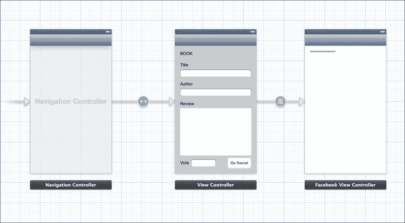
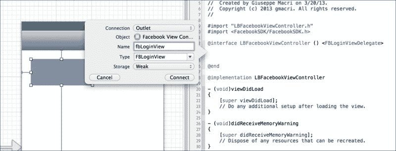

# 第三章：连接到 Facebook 用户账户

在上一章中，我们创建了一个只有一个视图的项目，用户可以在其中提供书籍信息。在本章中，我们将扩展之前的应用程序原型。

在本章中，我们将构建我们的第一个 Facebook 用户交互体验，例如登录和登出流程。我们将构建一个新的视图控制器来处理社交应用程序中的逻辑和用户界面。这个控制器的名字将是`LBFacebookViewController`。

处理 Facebook 身份验证流程有两种方式：

+   `FBLoginView`: 通过使用包含处理身份验证流程逻辑的用户界面组件

+   `FBSession`: 通过构建我们的自定义界面，让用户能够与他们在 Facebook 平台上的社交生活进行交互

我们将学习如何使用`FBLoginView`组件来对 Facebook 平台进行用户身份验证。

我们只需要提供`FBLoginView`的`FBLoginView`代理的`LBFacebookViewController`，以便用户可以使用平台登录和登出。作为我们 UI 视图的一部分，我们将显示一些 Facebook 用户账户信息，例如用户名和头像。

我们将在本书后面使用`FBSession`来检索有关用户社交生活的更多信息。

# 登录流程

在新的 Facebook SDK 3 之前，处理 Facebook 会话很繁琐，可能会花费我们大量的时间在代码维护和调试上。

`FBSession`组件（[`developers.facebook.com/docs/reference/ios/3.2/class/FBSession/`](https://developers.facebook.com/docs/reference/ios/3.2/class/FBSession/））是在 Facebook SDK 的版本 3 中引入的。它是一个跟踪并确保 Facebook 会话信息保持最新的组件。**身份验证令牌**是`FBSession`信息中最重要的属性。所有与平台的安全通信都基于身份验证令牌。实际上，它将是我们在 Facebook 平台上执行的每个请求的一部分。从之前的 SDK 版本开始，开发者有责任在令牌过期后对其进行扩展。

`FBLoginView`是由 Facebook SDK 提供的 UI 组件，它将使任何 iOS 应用程序能够在不编写处理平台请求/响应的代码的情况下，对 Facebook 平台进行用户身份验证。

`FBLoginView`处理用户交互并持续更新`FBSession`状态。如前所述，自 iOS 6 以来，苹果一直在提供 Facebook 集成。`FBLoginView`能够使用原生 UI 组件让用户接受他们当前使用的应用程序可以访问他们的 Facebook 资料。这只能在当前 iOS 设备与 Facebook 账户相关联时发生。如果没有设置 Facebook 账户，`FBLoginView`将使用 Safari 对用户进行身份验证。

`FBLoginView`通过`FBLoginViewDelegate`提供了四个回调来处理使用`FBLoginView`进行身份验证后 Facebook 平台的响应，如下所示：

+   `loginView:handleError:`

+   `loginViewFetchedUserInfo:user:`

+   `loginViewShowingLoggedInUser:`

+   `loginViewShowingLoggedOutUser:`

对于我们的社交应用程序，我们将使用`FBLoginView`组件。我们将在登录/注销流程实现期间讨论这些方法。

`FBLoginView`处理登录流程，我们只需要在登录过程成功后设置我们的应用程序状态。

# 创建登录界面

在本节中，我们将创建一个新的视图控制器，使应用程序能够对 Facebook 平台进行用户身份验证。

## 创建 Facebook 视图控制器

从我们之前的工程开始，我们将添加一个新的视图控制器，该控制器将包含 UI 元素和逻辑来处理身份验证流程。

选择应用程序的`LBViewController`，在右下角位置添加一个新按钮，并将其标签设置为`Go Social`，如以下截图所示。此按钮将提示 Facebook 视图控制器，并使用户能够使用该平台。


Go Social 按钮

现在，创建一个新的视图控制器。从**对象库**列表中，将视图控制器拖放到 Storyboard 中，如以下截图所示。Storyboard 现在有一个新的场景，我们将称之为 Facebook 场景。


新的故事板视图控制器

新场景将包含`FBLoginView`组件。我们需要在第一个场景和 Facebook 场景之间进行转场。选择**Go Social**按钮，按住*Ctrl*按钮，然后再次选择**Go Social**按钮以在两个场景之间创建连接。

以下截图显示了如何创建新的转场：


Go Social 转场

在**动作转场**下选择**推送**。


将选择作为动作转场

对于那些已经熟悉 Storyboard 的你们来说，你们会注意到，在不属于导航控制器的视图控制器中定义推送转场会抛出异常，因为没有导航控制器，应用程序无法跟踪用户通过我们的视图的路径。为了避免异常，我们需要创建一个将两个场景包裹在内的导航控制器。

以下截图显示了如何创建导航控制器以定义用户的交互。选择第一个场景，然后转到编辑器 | 嵌入 | 导航控制器。


创建导航控制器

导航视图控制器现在将使应用程序内的推送转场成为可能。



导航控制器

上述截图显示了创建导航控制器后的结果。

现在我们已经固定了导航，我们需要创建一个类，将 Facebook 视图场景与我们将要实现的逻辑绑定起来。要创建一个新的`ViewController`类，在`iLikeBook`文件夹上右键单击，然后转到**新建文件** | **Objective-C 类**。提供一个类名，`LBFacebookVIewController`，并将子类定义为`UIVIewController`。取消选择**带有 XIB 用户界面**选项。


LBFacebookViewController

新类将出现在`iLikeBook`文件夹下。我们需要将 Storyboard 中的 Facebook 场景与`LBFacebookVIewController`绑定。选择 Storyboard 和 Facebook 场景。打开**实用工具**仪表板，在 XCode 右上角的**视图**面板上，选择最右侧的按钮。在**自定义类**下打开**身份检查器**，并将**类**字段设置为`LBFacebookVIewController`。当用户访问 Facebook 场景时，应用程序将加载`LBFacebookVIewController`类的代码。

打开`LBFacebookVIewController.m`，并在代码中添加以下`@interface`语句：

```swift
@interface LBFacebookViewController ()
 @end
```

当 Facebook 场景仍然被选中时，将其拖放到一个新的`UIView`中。新视图的背景色为白色，当未选中时可能难以识别视图。通过访问**属性检查器** | **背景**，将视图的背景色更改为浅灰色。使用大小检查器将新视图组件的大小设置为`100 x 50`，位置设置为`(70, 45)`。将新`UIView`的**自定义类**设置为`FBLoginView`。


FBLoginView

现在我们需要在`LBFacebookViewController`中创建对`FBLoginView`的引用。在选择了 Facebook 场景后，打开辅助编辑器，并使用 XCode 右上角的**显示辅助编辑器**按钮。


FBLoginView 与 LBFacebookViewController

确保左侧可以访问`LBFacebookViewController.m`。

选择`FBLoginView`，按住*Ctrl*键，并将视图拖到类文件中的`@interface`语句内。XCode 将要求输入引用名称，如下面的截图所示：



FBLoginView 引用创建

将**存储**字段保留为`Weak`值。生成的代码语句应类似于以下截图所示：


FBLoginView 引用

Facebook 场景现在包含`FBLoginView`，但我们希望在用户正确登录后提供一些反馈。在 Facebook 场景中拖放一个新的`UIView`。将其大小调整为 200 x 200 px，并将其放置在场景的中心。将`UIView`的**自定义类**设置为`FBProfilePictureView`。`FBProfilePictureView`将允许应用程序在成功登录后显示用户的 Facebook 个人资料信息。


FBProfilePictureView

上一张截图显示了添加`FBProfilePictureView`后的结果。

`FBProfilePictureView` 需要更新所有登录和登出操作；因此，应用程序需要在 `LBFacebookViewController` 中有一个 UI 对象的引用。

正如我们在 `FBLoginView` 中所做的那样，我们需要在 `LBFacebookViewController` 类中创建 `FBProfilePictureView` 的引用。结果应类似于以下截图：


`FBProfilePictureView` 参考信息

在继续使用 `FBLoginView` 代理之前，我们需要在 `AppDelegate` 类中设置应用程序处理外部 URL 的方式。我们希望 Facebook SDK 处理我们应用程序和社交平台之间的通信。

使用以下命令在 `AppDelegate` 文件中导入 Facebook SDK：

```swift
#import &lt;FacebookSDK/FacebookSDK.h&gt;
```

打开 **Live Blogger** (`LB`) 的 `AppDelegate` 文件并添加以下代码：

```swift
- (BOOL)application:(UIApplication *)application
openURL:(NSURL *)url
sourceApplication:(NSString *)sourceApplication
annotation:(id)annotation
{
return [FBSession.activeSessionhandleOpenURL:url];
}
```

上述代码将处理针对 Facebook 平台的每个单独请求。

由于 `FBProfilePictureView` 中存在一个错误，如果该类之前未加载，应用程序在运行时可能会抛出异常。为了解决这个问题，我们需要更改以下突出显示的 `AppDelegate` 方法：

```swift
- (BOOL)application:(UIApplication *)application <span class="strong"><strong>didFinishLaunchingWithOptions:(NSDictionary *)launchOptions</strong></span>
{ 
    [FBProfilePictureView class];
 return YES;
}
```

下一步是设置 `FBLoginView`。打开 `LBFacebookViewController` 并自定义 (void) `viewDidLoad` 方法如下：

```swift
- (void)viewDidLoad
{
    [superviewDidLoad];
     [self.fbLoginViewsetDelegate:self];
 }
```

`self.fbLoginViewsetDelegate:self` 方法将当前类设置为 `FBLoginView` 的代理。


登录用户界面

# 登录代理

现在 `FBLoginView` 组件已经就位，我们需要关注其代理以处理响应和/或错误。

打开 `LBFacebookViewController.m`。正如我们在上一节中所做的那样，我们需要导入 Facebook SDK。

我们还需要使用以下代码将 `FBLoginViewDelegate` 扩展到 `LBFacebookViewController`：

```swift
@interface LBFacebookViewController () &lt;FBLoginViewDelegate&gt;
 @end
```

使用上述代码，我们将允许将当前类设置为 `FBLoginView` 的代理以捕获回调。

我们应该实现的第一代理如下：

```swift
//delegate method to handle communication errors
- (void)loginView:(FBLoginView *)loginViewhandleError:(NSError *)error {
if (error) {
    NSLog(@"%@", error);
    }
}
```

上述代码片段显示了在 `FBLoginView` 抛出任何错误时将被调用的代理代码，并将错误打印到调试窗口中。

以下代码块显示了在用户登录后处理回调的说明；应用程序仍然没有关于用户 Facebook 账户的信息。在即将到来的章节中，将使用此方法来启用按钮以提供更多功能。

```swift
// delegate to handle the logged in mode
- (void)loginViewShowingLoggedInUser:(FBLoginView *)loginView {
 }
```

以下方法将为我们提供有关用户 Facebook 账户的信息。以下代码是处理用户获取信息的回调方法：

```swift
// delegate called after the application has received
// the user information from Facebook platform
- (void)loginViewFetchedUserInfo:(FBLoginView *)loginView user:(id&lt;FBGraphUser&gt;)user
{
    [self.profilePictureViewsetProfileID:user.id];
}
```

`user` 对象包含 Facebook 账户信息。`FBGraphUser` 提供了一个简单的接口来访问账户数据。`setProfileId` 方法设置 `FBProfilePictureView` ID，并通过调用 Facebook 平台的 API 获取账户图片。

由于 Framework SDK 的新更新，处理 Facebook 会话现在变得非常简单。


用户登录成功

# 登出流程

登出流程不过是使用`FBLoginView`的新委托方法。再次强调，在`LBFacebookViewController`中，创建新的委托方法如下：

```swift
// delegate to handle the logged out mode
- (void)loginViewShowingLoggedOutUser:(FBLoginView *)loginView
{
    [self.profilePictureViewsetProfileID:nil];
}
```

在用户成功登出后，将调用前面的方法。由于到目前为止 UI 仍在开发中，我们只需要将`FBProfilePictureView`的 profile ID 更新为 null 值，因为没有用户登录。

这是我们处理登出流程所需做的所有事情。

# 摘要

本章涵盖了实现 Facebook 登录和登出流程所需的所有要点。我们最初创建了一个视图控制器，用作用户界面的接口。

为了处理身份验证逻辑和与社交平台的通信，我们依赖于`FBLoginView`。为了向用户提供一些反馈，我们使用了`FBProfilePictureView`通过设置对象的一个属性来显示用户的图片资料。
