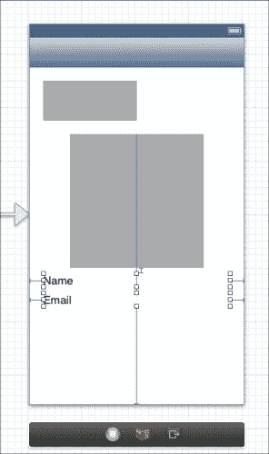
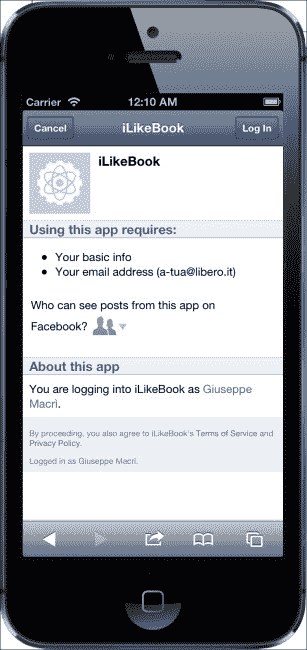
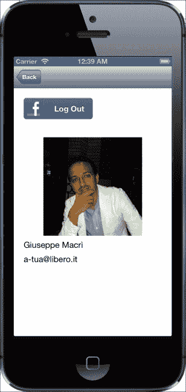
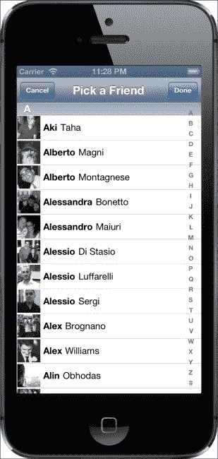
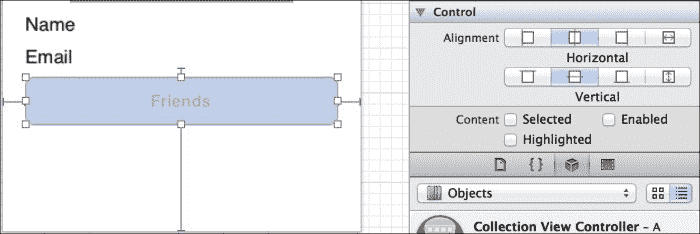
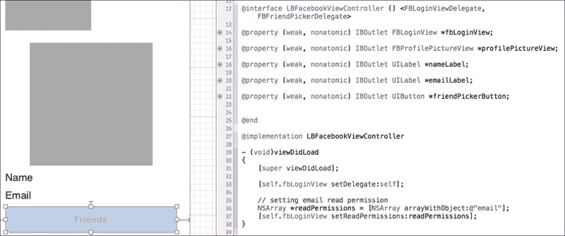
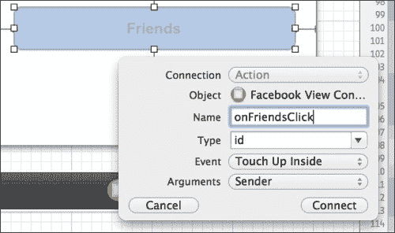
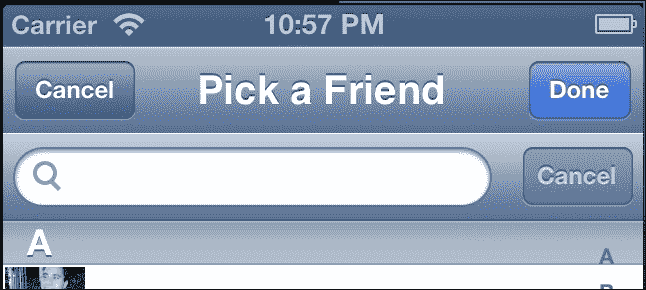
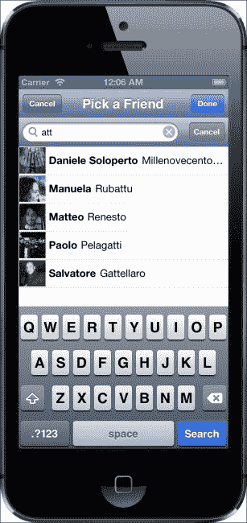

# 第四章。显示用户配置文件

在本章中，我们将通过从 Facebook 平台获取用户信息来扩展我们的社交应用程序。我们将探讨在明确请求用户权限的情况下和未明确请求用户权限的情况下可以获取的信息类型。我们将学习如何使用`FBSession`获取额外的用户信息。

# 理解 Facebook 平台

Facebook 通过权限系统保护用户数据。为了访问用户信息，我们需要请求用户允许应用程序获取此类数据。您可以在[`developers.facebook.com/docs/reference/api/user/`](https://developers.facebook.com/docs/reference/api/user/)找到用户信息的完整列表。

当用户登录到我们的系统时，他们允许应用程序访问他们的基本信息。基本信息包括以下内容：

+   `id`

+   `name`

+   `first_name`

+   `last_name`

+   `link`

+   `username`

+   `gender`

+   `locale`

+   `age_range`

您可以在以下位置找到有关朋友的基本信息

[`developers.facebook.com/docs/reference/login/public-profile-and-friend-list/`](https://developers.facebook.com/docs/reference/login/public-profile-and-friend-list/).

如果我们计划使用任何其他用户信息类型，我们需要请求用户，并确保我们的应用程序足够智能，能够处理拒绝/撤销的权限。

**电子邮件**是重要信息，需要谨慎处理。用户需要授权才能访问此类数据。不要向用户的电子邮件发送垃圾邮件。

[`developers.facebook.com/docs/reference/login/-permissions/`](https://developers.facebook.com/docs/reference/login/-permissions/)

**扩展配置文件属性**权限提供访问基本信息中未包含的剩余字段。您可以在以下位置找到关于扩展配置文件属性的完整信息

[`developers.facebook.com/docs/reference/login/extended-profile-properties/`](https://developers.facebook.com/docs/reference/login/extended-profile-properties/).

**扩展权限**提供访问敏感信息以及发布和删除社交图上数据的权限。信息可在以下位置找到

[`developers.facebook.com/docs/reference/login/extended-permissions/`](https://developers.facebook.com/docs/reference/login/extended-permissions/).

**开放图权限**提供与开放图交互的能力。用户将通过我们的应用程序发布和检索开放图上的操作。

[`developers.facebook.com/docs/reference/login/open-graph-permissions/`](https://developers.facebook.com/docs/reference/login/open-graph-permissions/)

在本章范围内，我们将使用用户的基本信息和电子邮件信息在我们的应用程序中显示。

# 设置用户配置文件界面

在上一章中，我们实现了 Storyboard Facebook 场景，在用户登录后显示个人资料图片。在本章的这一部分，我们将扩展场景以包括他们的姓名和电子邮件。

姓名 信息已经通过基本权限提供。现在，对于用户的电子邮件，我们需要明确请求用户允许我们访问它。

首先，我们需要向我们的 Facebook 场景添加两个新的标签来显示新信息。以下图显示了添加标签后的场景外观：



用户登录后，新标签将动态设置用户信息。当用户注销时，我们将姓名和电子邮件信息替换为空字符串。

点击**显示辅助编辑器**按钮，并在`LBFacebookViewController.m`接口声明中逐个拖放标签。

以下代码片段显示了创建标签引用的结果：

```swift
import "LBFacebookViewController.h"
#import &lt;FacebookSDK/FacebookSDK.h&gt;

@interface LBFacebookViewController () &lt;FBLoginViewDelegate, FBFriendPickerDelegate, UIAlertViewDelegate&gt;
 @property (weak, nonatomic) IBOutlet FBLoginView *fbLoginView;
 @property (weak, nonatomic) IBOutlet FBProfilePictureView *profilePictureView;
 @property (weak, nonatomic) IBOutlet UILabel *nameLabel;
 @property (weak, nonatomic) IBOutlet UILabel *emailLabel;
 @end
```

现在我们有了姓名和电子邮件的标签引用，我们可以从 Open Graph 获取用户信息。

# 获取用户信息

在本节中，我们将专注于实现显示和隐藏用户姓名和电子邮件的代码。

在上一章中，我们在 Facebook 场景中为`FBLoginView`组件创建了一个代理方法来访问用户信息。隐藏**辅助编辑器**并打开`LBFacebookViewController.m`文件。我们需要在`loginViewFetchedUserInfo`方法中添加一些代码来定制新的标签。

从自定义姓名标签开始，我们可以使用方法提供的`(id<FBGraphUser>)user`输入参数来访问用户姓名并设置标签。

```swift
// delegate called after the application has received
// the user information from Facebook platform
- (void)loginViewFetchedUserInfo:(FBLoginView *)loginView user:(id&lt;FBGraphUser&gt;)user
{
  [self.profilePictureView setProfileID:user.id];
  self.nameLabel.text = user.name;
}
```

`self.nameLabel.test = user.name`代码行将使用`FBLoginView`回调提供的用户姓名设置 UI 姓名标签内容。

当用户注销时，我们需要将姓名标签内容设置为空字符串，如下所示：

```swift
// delegate to handle the logged out mode
- (void)loginViewShowingLoggedOutUser:(FBLoginView *)loginView
{
  [self.profilePictureView setProfileID:nil];
  self.nameLabel.text = @"Name";
}
```

`self.nameLabel.test = @"Name"`指令将姓名标签恢复到默认内容。

为了获取用户的电子邮件，我们首先需要请求用户允许应用程序访问此信息。我们需要通过以下方式定制`FBLoginView`，添加电子邮件权限：

```swift
- (void)viewDidLoad
{
  [super viewDidLoad];

  [self.fbLoginView setDelegate:self];

  // setting email read permission
  NSArray *readPermissions = [NSArray arrayWithObject:@"email"];
  [self.fbLoginView setReadPermissions:readPermissions];
}
```

以下代码片段显示了如何设置`FBLoginView`的附加权限。首先定义一个包含应用程序需要的读取权限的列表，并将创建的数组设置为`FBLoginView readPermissions`字段。

以下截图显示了带有附加电子邮件请求的用户权限界面：



如果用户接受了请求，我们可以通过以下代码使用`FBLoginView`代理获取用户信息：

```swift
// delegate called after the application has received
// the user information from Facebook platform
- (void)loginViewFetchedUserInfo:(FBLoginView *)loginView user:(id&lt;FBGraphUser&gt;)user
{
  [self.profilePictureView setProfileID:user.id];
  self.nameLabel.text = user.name;

  if ([user objectForKey:@"email"]) {
    self.emailLabel.text = [user objectForKey:@"email"];
  }

}
 // delegate to handle the logged out mode
- (void)loginViewShowingLoggedOutUser:(FBLoginView *)loginView
{
  [self.profilePictureView setProfileID:nil];
  self.nameLabel.text = @"Name";
  self.emailLabel.text = @"Email";
}
```

第一种方法仅在平台响应中存在电子邮件字段时才会获取电子邮件字段。第二种方法将用户的电子邮件替换为默认内容。

以下截图显示了最终结果：



# 创建朋友视图接口

当我们想到社交活动时，我们会想到与朋友分享生活经历和时刻。

在本章的这一部分，我们将创建一个简单的朋友选择视图控制器。该控制器将显示与我们的 Facebook 账户关联的所有朋友，并提供选择一个或多个朋友的能力。

在下一章中，我们将使用朋友选择器与他们分享我们信息的一部分。

使用 Facebook SDK 的 2.x 版本，与新的 SDK 相比，实现好友列表将涉及大量工作。使用之前的 SDK 构建好友列表将需要创建一个新的 UI 组件来显示朋友信息，例如，表格视图控制器。背后的逻辑也是具有挑战性的，因为我们需要处理安全令牌扩展并解析响应以填充好友列表 UI。

使用 Facebook iOS SDK 3.x 创建好友列表是一个完全不同的故事。在 SDK 的 3.x 版本中，Facebook 工程师们非常努力地创建出完美无缺、即用即得的组件。其中之一就是`FBFriendPickerViewController`。

`FBFriendPickerViewController`封装了用户交互和逻辑，以处理用户的好友列表。它将提供一个类似表格的 UI，因为它继承自`UITabelViewController`。从/到 Facebook 平台的整个通信完全由新组件处理。

我们可以在`FBFriendPickerViewController`上执行的一些自定义操作包括按姓氏或名字排序，更改显示朋友名字的方式等。

以下截图显示了使用新视图控制器生成的最终 UI 结果：



只有当所选用户登录时，好友列表才会启用。

# 创建 UI

为了显示好友列表，我们需要首先向 Facebook UI 添加一个新按钮。打开 Storyboard，选择 Facebook 场景。按住*Ctrl*键盘按钮，从**对象库**中拖放一个按钮并将其放置在电子邮件标签下方。为新按钮设置标签文本，例如**好友**。通过导航到**实用工具面板**|**属性检查器**取消选择**启用**选项。

截图 1 到 5 显示了**属性检查器**中的**启用**选项未被勾选。



**好友**按钮只有在用户已经登录的情况下才会触发创建`FBFriendPickerViewController`实例的代码；否则，它将被禁用。由于我们需要启用和禁用按钮，我们需要在我们的`LBFacebookViewController`中有一个按钮的引用，该引用将通过`FBLoginView`代理来访问。为了创建按钮引用，打开辅助编辑器，并在`LBFacebookViewController`接口声明内通过拖放创建好友按钮引用。



当用户点击 **朋友** 按钮时，将触发创建朋友列表的代码。要将 **朋友** 按钮的 `click` 事件映射到 `LBFacebookViewController` 方法，请按住 *Ctrl* 键盘按钮，并将按钮拖放到 `loginViewShowingLoggedOutUser` 方法之后。XCode 将要求输入新方法的名称，该方法将映射 **Touch Up Inside** 事件。



在我们点击 **连接** 后，XCode 将根据以下代码生成方法：

```swift
- (IBAction)onFriendsClick:(id)sender {

}
```

之前的片段将包含显示 `FBFriendPickerViewController` 实例的代码。

## 显示 FBFriendPickerViewController

为了显示 UI 朋友列表组件，我们需要在 `LBFacebookViewController` 中保持一个 `FBFriendPickerViewController` 的实例。打开 `LBFacebookViewController.m` 文件，并在 `interface` 语句中添加一个新的 `FBFriendPickerViewController` 实例。

以下代码显示了 `interface` 语句。

```swift
@interface LBFacebookViewController () &lt;FBLoginViewDelegate, FBFriendPickerDelegate&gt;
 @property (weak, nonatomic) IBOutlet FBLoginView *fbLoginView;
@property (weak, nonatomic) IBOutlet FBProfilePictureView *profilePictureView;
@property (weak, nonatomic) IBOutlet UILabel *nameLabel;
@property (weak, nonatomic) IBOutlet UILabel *emailLabel;
@property (weak, nonatomic) IBOutlet UIButton *friendPickerButton;
@property (strong, nonatomic) FBFriendPickerViewController *friendPickerViewController;
 @end
```

我们会注意到，`FBFriendPickerViewController` 也作为委托出现在之前的代码片段中，这是在 `interface` 语句的第一行显示的。

现在我们需要更新 `onFriendsClick` 方法，以初始化或重用 `friendPickerViewController` 属性并显示朋友列表。下一个应用程序方法显示了 `onFriendsClick` 方法的实现。

```swift
#pragma mark - FBFriendPickerViewController
- (IBAction)onFriendsClick:(id)sender {
  if (self.friendPickerViewController == nil) {
    self.friendPickerViewController = [[FBFriendPickerViewController alloc] init];
    self.friendPickerViewController.title = @"Pick a Friend";
    [self.friendPickerViewController setDelegate:self];
  }

  [self.friendPickerViewController loadData];
  [self.friendPickerViewController clearSelection];

  [self presentViewController:self.friendPickerViewControlleranimated:YES completion:^{
    NSLog(@"Friends list ready");
  }];
}
```

方法的第一部分检查 `friendPickerViewController` 是否已经初始化。如果没有初始化，该方法将为实例分配新的内存，并为 UI 设置标题，将当前类作为朋友列表控制器的委托。`loadData` 方法将从平台加载朋友信息，或者如果仍然有效，则从缓存中加载。`clearSelection` 方法将清除用户选择，如果朋友列表 UI 已经被使用。在方法结束时，我们使用 `presentViewController` 方法显示新的视图控制器，这将把 `FBFriendPickerViewController` 视图推到 UI 堆栈的顶部。

正如我们所说，`FBFriendPickerViewController` 需要一个委托才能与用户和其他应用程序交互。

在本章的范围内，我们将使用两个委托方法来处理 `FBFriendPicker` 视图中的 **完成** 和 **取消** 按钮。在本章中，这两个委托方法将仅隐藏朋友列表 UI。下一代码显示了 `FBFriendPickerViewController` 的委托方法。

```swift
#pragma mark - FBFriendPickerViewController delegate
- (void)facebookViewControllerDoneWasPressed:(id)sender {
  [self dismissViewControllerAnimated:YES completion:^{
    NSLog(@"Friend Picker Done Button Clicked");
  }];
}
 - (void)facebookViewControllerCancelWasPressed:(id)sender {
  [self dismissViewControllerAnimated:YES completion:^{
    NSLog(@"Friend Picker Cancel Button Clicked");
  }];
}
```

之前代码中的两种委托方法都调用了 `dismissViewControllerAnimated`，这将从堆栈中弹出朋友列表 UI。

## 使用搜索栏自定义朋友列表

在上一节中，我们创建了朋友列表 UI，它还包括使用界面右侧的索引导航用户朋友列表的能力。

用户有很多朋友，有时索引可能不够快。我们希望向用户提供一个位于朋友列表顶部的搜索栏。

我们将开始创建一个新的类，该类将继承自 `FBFriendPickerViewController`。新的类将包含一个 `UISearchBar` UI 组件，因此我们需要将其设置为 `UISearchBar` 代理。当用户在搜索栏中输入时，新类将根据搜索查询内容过滤朋友条目。

为了创建新类，打开 **项目导航器** 并选择 **iLikeBook** 项目中的 **iLikeBook** 文件夹。右键单击它并选择 **新建文件…**，然后选择 `Cocoa Touch` 和 `Objective-C class` 模板。点击 **下一步** 并设置类名，例如 `LBFriendPickerViewController`，并将 `FBFriendPickerViewController` 设置为子类。新类将具有与 `FBFriendPickerViewController` 相同的功能和属性。点击 **下一步** 创建文件。我们现在可以在 **项目导航器** 中看到两个新文件。

为了扩展我们的新朋友选择控制器，我们需要另外两个属性，如下所示：

+   `SearchText`：它是一个包含当前搜索查询的变量。`Friend Picker` 代理将访问它以过滤掉不满足搜索查询的朋友。

+   `UISearchBar`：它是允许用户输入搜索查询的 UI 组件。

`SearchText`，正如我们前面提到的，将用于从 `Friend Picker` 列表中过滤出朋友；因此我们可以将其定义为公共变量。打开 `LBFriendPickerViewController.h` 文件，并将 `SearchText` 变量添加为公共字段。以下列表显示了它在 `LBFriendPickerViewController` 类中的位置。

```swift
#import &lt;FacebookSDK/FacebookSDK.h&gt;
@interface LBFriendPickerViewController : FBFriendPickerViewController
 // Keep track of user's search query
@property (strong, nonatomic) NSString *searchText;
 @end
```

### 注意

更多信息，您可以查看以下两个 URL：[`developers.facebook.com/docs/reference/ios/3.2/protocol/FBFriendPickerDelegate`](https://developers.facebook.com/docs/reference/ios/3.2/protocol/FBFriendPickerDelegate)

[`developer.apple.com/library/ios/#documentation/uikit/reference/UISearchBarDelegate_Protocol/Reference/Reference.html`](http://developer.apple.com/library/ios/#documentation/uikit/reference/UISearchBarDelegate_Protocol/Reference/Reference.html)

现在打开 `LBFriendPickerViewController.h` 文件；我们将实现朋友搜索的 UI。

开始将 `UISearchBar` 组件添加到 `interface` 语句中。我们还需要将当前类定义为 `UISearchBarDelegate`，以便捕获用户的输入，如下面的代码片段所示：

```swift
@interface LBFriendPickerViewController () &lt;UISearchBarDelegate&gt;
 @property (weak, nonatomic) UISearchBar *searchBar;
 @end
```

`UISearchBar` 将显示在朋友列表的顶部，其宽度将与容器视图的宽度完全相同。该栏将在容器视图加载后由应用程序构建。



如果还没有创建 `init` 方法，请创建一个。在这个方法中，调用父类的 `init` 方法，并将 `searchBar` 变量设置为 `nil`，如下面的代码片段所示。

```swift
- (id)init
{
  self = [super init];
  if (self) {
    self.searchBar = nil;
  }
  return self;
}
```

我们需要自定义 `viewDidLoad` 方法，以便在朋友选择视图中构建 `UISearchBar`。

```swift
- (void)viewDidLoad
{
  [super viewDidLoad];
  [self addSearchBarToFriendPickerView];
}
```

之前的代码展示了新的`viewDidLoad`方法，其中包含尚未定义的新方法`addSearchBarToFriendPickerView`。新方法仅在`searchBar`设置为`nil`时初始化`searchBar`。初始化完成后，`searchBar`将被添加到视图容器中。

下面的代码片段展示了`addSearchBarToFriendPickerView`的实现。

```swift
- (void)addSearchBarToFriendPickerView
{
  if (self.searchBar == nil) {
    CGFloat searchBarHeight = 44.0;
    self.searchBar = [[UISearchBar alloc]initWithFrame:CGRectMake(0, 0, self.view.bounds.size.width,searchBarHeight)];
    self.searchBar.autoresizingMask =self.searchBar.autoresizingMask |UIViewAutoresizingFlexibleWidth;
    self.searchBar.delegate = self;
    self.searchBar.showsCancelButton = YES;

    // Adding the searchBar to the current view and resize thefriends' list table view
    [self.canvasView addSubview:self.searchBar];
    CGRect newFrame = self.view.bounds;
    newFrame.size.height -= searchBarHeight;
    newFrame.origin.y = searchBarHeight;
    self.tableView.frame = newFrame;
  }
}
```

前面的方法首先检查`searchBar`是否已经初始化；如果没有，该方法将进行初始化。`searchBarHeight`变量是`UISearchBar`的最终高度，它将被用作初始化`searchBar`变量时的输入参数，以创建自定义框架。

在继续前进的过程中，我们将定义`searchBar autoresizingMask`以确保其宽度与视图容器相同。`UISearchBar`需要一个代理来访问用户的搜索查询；因此我们设置了一个代理。使用`self.searchBar.showsCancelButton`指令，我们可以设置`UISearchBar`按钮内的**取消**按钮为可见或隐藏。

`searchBar`组件需要被添加到当前视图。由于`LBFriendPickerViewController`继承了`FBFriendPickerViewController`，我们可以通过`self.canvasView`属性接收对父视图的访问。`searchBar`组件将显示在顶部，因为我们定义了位置（`0`，`0`）的框架。

在添加搜索栏后，我们需要使用`searchBarHeight`来调整朋友表格视图的高度。

UI 部分现在已完成；我们仍需注意`UISearchBar`和`LBFriendPickerViewController`类之间的通信。

创建一个辅助方法来处理搜索，如下面的代码示例所示：

```swift
- (void)handleSearch: (UISearchBar *)searchBar {
  [NSObject cancelPreviousPerformRequestsWithTarget:selfselector:@selector(handleRealSearch:) object:searchBar];

  [self performSelector:@selector(handleRealSearch:)withObject:searchBar afterDelay:0.5f];
}
 - (void)handleRealSearch:(UISearchBar *)searchBar
{
  self.searchText = searchBar.text;
  [self updateView];
}
```

前面的方法将使用当前的`UISearchBar`内容值设置`searchText`属性，并调用`updateView`。`UpdateView`方法将调用`LBFriendPickerViewController`的代理方法来过滤用户。我们将在本节稍后深入了解该方法。

`UISearchBar`需要代理方法来处理用户的搜索。我们需要创建三个代理方法来处理以下操作：

+   搜索栏文本已更改。

+   **搜索**按钮被点击。

+   **取消**按钮被点击。

文本更改方法相当简单。当用户输入时，应用程序将动态过滤用户。新代理方法的代码如下所示：

```swift
- (void)searchBar:(UISearchBar *)searchBar textDidChange:(NSString *)searchText
{
    [self handleSearch:searchBar];
}
```

`textDidChange`方法使用`handleSearch`辅助方法来处理搜索。

要处理**搜索**按钮，点击并创建如下所示的方法：

```swift
- (void)searchBarSearchButtonClicked:(UISearchBar*)searchBar
{
  [self handleSearch:searchBar];
  [searchBar resignFirstResponder];
}
```

与之前的代理方法相比，唯一的区别是调用`resignFirstResponder`，这将点击**搜索**按钮后隐藏键盘。

**取消**按钮的方法更复杂；它将重置`searchText`和`searchBar`内容值为空字符串，更新视图，并隐藏键盘。

```swift
- (void)searchBarCancelButtonClicked:(UISearchBar *) searchBar {
  self.searchBar.text = @"";
  [self handleSearch:searchBar];
  [searchBar resignFirstResponder];
}
```

作为最后的润色，我们需要重写`clearSelection`方法以执行父级职责并重置`searchText`和`searchBar`的内容。

```swift
- (void)clearSelection
{
  [super clearSelection];
  self.searchText = nil;
  self.searchBar.text = @"";
}
```

现在我们有了新的好友选择控制器，我们需要使用它。之前，我们在`LBFriendPickerViewController`内部使用了`FBFriendPickerViewController`。

打开`LBFriendPickerViewController.m`，将`FBFriendPickerViewController`属性及其初始化替换为`LBFriendPickerViewController`，即刚刚创建的新类。你应该只有两个这样的实例。

```swift
@property (strong, nonatomic) LBFriendPickerViewController *friendPickerViewController;
 self.friendPickerViewController = [[LBFriendPickerViewController alloc] init];
```

我们需要实现的最后一个方法是过滤好友列表中用户的代理方法。在`LBFriendPickerViewController.m`的末尾，创建以下代码片段所示的方法：

```swift
- (BOOL)friendPickerViewController:(FBFriendPickerViewController *)friendPicker shouldIncludeUser:(id&lt;FBGraphUser&gt;)user
{
  NSString *searchText =self.friendPickerViewController.searchText;
  if (searchText &amp;&amp; ![searchText isEqualToString:@""]) {
    NSRange result = [user.namerangeOfString:searchTextoptions:NSCaseInsensitiveSearch];
    if (result.location != NSNotFound) {
    return YES;
  } else {
    return NO;
  }
} else {
  return YES;
}
return YES;
}
```

代码中列出的方法将检查我们好友列表中的每个用户，以找到与当前用户搜索查询的匹配项，并将返回 true 和 false。LBFriendPickerViewController 和 UISearchBar 调用此方法。

以下截图显示了定制的最终结果：



# 摘要

在本章中，我们讨论了我们可以使用基本权限获取哪些信息。使用故事板，我们构建了个人资料 UI，在那里我们显示 Facebook 个人资料名称和图片。使用`FBLoginView`，我们实现了登录和注销流程，而不需要处理 Facebook 会话信息。

我们在个人资料 UI 中插入了一个新的按钮，该按钮将触发一个新的模态视图控制器。新的控制器继承自`FBFriendPickerViewController`，这将使我们的社交应用能够轻松获取好友列表。

我们通过插入一个新的搜索组件来自定义了好友列表的用户界面，我们可以使用这个组件根据用户的输入来过滤好友。
