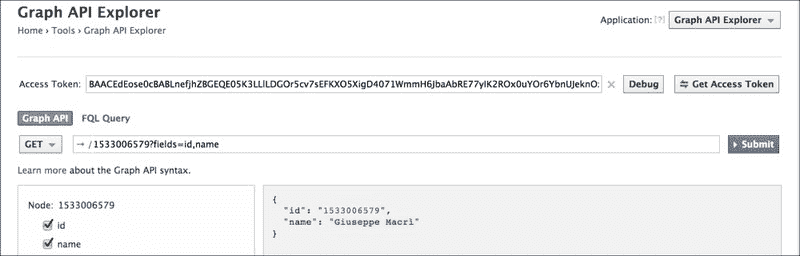
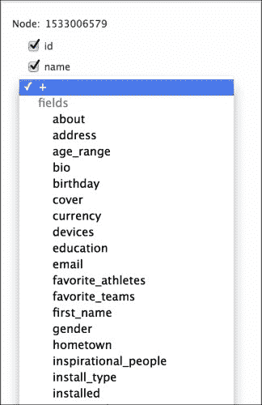
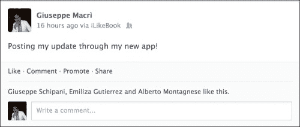

# 第六章。Facebook Graph API

在本章中，我们将深入研究 Facebook Graph API。

### 注意

为了访问 Facebook iOS SDK API 参考，请访问 [`developers.facebook.com/docs/reference/api/`](https://developers.facebook.com/docs/reference/api/)。

新的**API**（**应用程序编程接口**）是由 Facebook 工程师开发的，以取代旧的**REST**（**表示状态传输**）网络服务。Graph API 是获取和存储 Social Graph 内数据的主要工具。它基于低级 HTTP 动词（GET、POST、PUT 等）。Facebook SDKs 也是基于 Graph API 的。

# 通过 Graph API 可用的功能

使用 Graph API，我们有权访问所有必要的权限下的 Social Graph 信息。重要的是要理解，Facebook 的一些 API 有使用限制，以防止滥用，例如，下载图片。

当我们从核心图结构读取数据时，我们有以下功能可用：

+   **图片**: 这些是个人资料图片。

+   **选择结果**: 使用过滤器，可以控制哪些字段包含在响应中。

+   **分页**: 这是定义响应数据限制的能力。这实际上非常有用，例如，当我们尝试下载用户时间线信息时。

+   **搜索**: 它提供了搜索的能力；然而，请求需要定义一个搜索查询和对象类型。

+   **权限和登录协议**: 这些是使用 Graph API 访问敏感数据所必需的。

Graph APIs 提供了从用户的个人时间线发布和删除信息的能力。我们还可以通过提供**RSVP**、创建相册、写笔记和引用链接与事件进行交互。

Graph API 的一个重要特性是接收实时更新的能力。

[`developers.facebook.com/docs/reference/api/realtime/`](https://developers.facebook.com/docs/reference/api/realtime/)

当应用程序订阅特定对象的更新时，我们需要定义一个回调 URL。Facebook 平台将在订阅对象发生变化时调用该 URL。

# Graph API 探索器

学习如何使用 Graph API 的最佳方式是通过 Graph Explorer。Graph API Explorer 是一个调试工具，它通过模拟 Graph API 调用帮助开发者理解如何使用 Graph API。

为了访问探索工具，请访问 [`developers.facebook.com/tools/explorer`](https://developers.facebook.com/tools/explorer)。

第一次访问 Graph Explorer 时，调试工具将显示我们的 Facebook 账户**id**和**name**。以下截图显示了 Graph API Explorer 界面：



Facebook 动态提供访问令牌，并允许我们访问私有数据。我们可以在查询输入字段下方的面板中输入自己的查询并查看结果。左侧的栏提供响应的数据过滤；我们可以决定在查询响应中显示哪些字段。



探索工具提供了许多功能，我强烈建议您查看它们，因为它们不会在本书中介绍。

# 使用 Facebook iOS SDK 中的 Graph API

为了在我们的社交应用中使用 Graph API，我们将使用一个名为 `FBRequestConnection` 的组件。

之前提到的类提供了方便的方法来执行 Graph API 调用，并完美处理响应，因为它将与社交平台创建单个 HTTP 连接。`FBRequestConnection` 仅在当前 `FBSession` 打开且具有有效令牌时工作。

`FBRequestConnection` 的职责如下：

+   为您的 Graph API 请求创建正确的 URI 并将正确的 URN 附加到基础 Graph Facebook URL ([`graph.facebook.com/`](http://graph.facebook.com/))

+   获取当前活动的 `FBSession`，提取相关的安全令牌，并将安全令牌附加到 Graph API 请求

+   处理连接开始/结束/取消和批量请求

使用 `FBRequestConnection`，我们有几种方法来执行 Graph API 请求。执行此类请求的所有方法都需要 `FBRequestHandler` 作为输入参数。

```swift
typedef void (^FBRequestHandler)(
FBRequestConnection *connection,
id result,
NSError *error);
```

以下 Graph API 方法可供我们方便使用：

+   `+ (FBRequestConnection *)startForMeWithComplentionHandler` (`FBRequestHandler`)handler: 它执行一个请求以获取用户信息 (`/me`)。它使用通过 `FBSession activeSession` 获取的活动会话。

+   `+ (FBRequestConnection *)startForMyFriendWithComplentionHandler` (`FBRequestHandler`)handler: 它执行一个请求以获取用户的朋友 (`/me/friends`)。此操作需要一个活动会话。

+   `+ (FBRequestConnection *) startForPlacesSearchAtCoordinate:(CLLocationCoordinate2D)coordinate radiusInMeters:(NSInteger)radius resultsLimit:(NSInteger)limit searchText:(NSString*)searchText completionHandler (`FBRequestHandler`)handler: 它返回与 `searchText` 字符串匹配的、由坐标和半径定义的特定区域的地点。我们需要为从该请求返回的结果数量定义一个限制。

+   `+ (FBRequestConnection*)startForPostStatusUpdate:(NSString *)message completionHandler` (`FBRequestHandler`)handler: 它执行一个请求，在用户的个人时间轴上发布状态更新。

+   `+ (FBRequestConnection*)startForUploadPhoto:(UIImage *)photo completionHandler` (`FBRequestHandler`)handler: 它执行一个 POST 请求来上传照片。

每次我们尝试执行 Graph API 请求时，我们都使用 Graph API 探索工具来检查响应。

在接下来的章节中，我们将使用一些 `FBRequestConnection` 方法来构建和执行 Graph API 请求。

下面的示例与迄今为止我们构建的应用程序没有直接关联；因此，它们可以很容易地用于不同的项目。

## 获取用户信息

在第四章*显示用户资料*中，我们使用了`FBLoginView`的代理方法来获取和显示用户信息。`FBLoginView`使用 Graph API 为我们获取了这些信息。

`FBRequestConnection`允许我们独立于`FBLoginView`获取用户资料信息，例如，自定义用户界面和登录流程。

```swift
- (void)fetchUserInfoWithGraphApi
{
    [FBRequestConnection startForMeWithCompletionHandler:^(FBRequestConnection *connection, id result, NSError *error) {
        if (error) {
            NSString *title = @"Graph API Error";
            NSString *message = @"Error retrieving user information through Graph API";
            UIAlertView *errorGraphAPIMessage = [[UIAlertView alloc] initWithTitle:title
                                                                              message:message
                                                                             delegate:nil
                                                                    cancelButtonTitle:nil
                                                                    otherButtonTitles:@"OK", nil];
            [errorGraphAPIMessage show];
        } else {
            NSLog(@"User information: %@", result);
        }
    }];
}
```

上述代码展示了`startForMeWithComplentionHandler`的实现。请求处理程序将检查是否存在任何错误。如果没有错误，处理程序将使用日志界面上的结果变量显示用户资料信息。结果变量中的对象是一个`id<FBGraphUser>`对象。

### 注意

更多关于`FBGraphUser`的信息，请访问

[`developers.facebook.com/docs/reference/ios/3.6/protocol/FBGraphUser/`](https://developers.facebook.com/docs/reference/ios/3.6/protocol/FBGraphUser/).

## 获取用户的好友

在第四章*显示用户资料*中，我们创建了一个视图控制器来显示用户的好友列表。现在，让我们考虑一个情况，即表格视图不是我们想要的交互类型。我们可能需要自定义我们的界面，并直接从 Facebook 平台获取用户的好友列表信息。

```swift
- (void)fetchUserFriendsListWithGraphAPI
{
    [FBRequestConnection startForMyFriendsWithCompletionHandler:^(FBRequestConnection *connection, id result, NSError *error) {
        if (error) {
            NSString *title = @"Graph API Error";
            NSString *message = @"Error retrieving user friends list through Graph API";
            UIAlertView *errorGraphAPIMessage = [[UIAlertView alloc] initWithTitle:title
                                                                           message:message
                                                                          delegate:nil
                                                                 cancelButtonTitle:nil
                                                                 otherButtonTitles:@"OK", nil];
            [errorGraphAPIMessage show];
        } else {
            NSLog(@"Friends information: %@", result);
        }
    }];
}
```

上述代码展示了`startForMyFriendWithComplentionHandler`的一个示例。前面的代码向平台发出请求。在这种情况下，我们期望的结果是包含用户好友列表的`id<FBGraphUser>`。

## 获取用户的照片

获取用户的照片需要访问这些数据的权限。我们首先需要实现用户请求权限；如果成功，我们可以获取用户的照片：

```swift
- (void)fetchUserPhotosWithGraphApi
{
    // Ask for user_photos permissions
    NSString *permission = @"user_photos";
    if ([FBSession.activeSession.permissions indexOfObject:permission] == NSNotFound) {
        [FBSession.activeSession requestNewReadPermissions:[NSArray arrayWithObject:permission]
                                         completionHandler:^(FBSession *session, NSError *error) {
            if (!error) {
                [self fetchUserPhotos];
            } else {
                if (error.fberrorCategory == FBErrorCategoryUserCancelled) {
                    NSString *title = @"Permission Error";
                    NSString *message = @"User Photos Permission was not granted";
                    UIAlertView *errorGraphAPIMessage = [[UIAlertView alloc] initWithTitle:title
                                                                                   message:message
                                                                                  delegate:nil
                                                                         cancelButtonTitle:nil
                                                                         otherButtonTitles:@"OK", nil];
                    [errorGraphAPIMessage show];
                }
            }
        }];
    } else { // If permissions present, fetch photos
        [self fetchUserPhotos];
    }
}
```

上述代码片段展示了如何对用户进行请求以访问照片信息。如果`FBSession`中已经存在权限，我们可以执行 Graph API 请求；否则，我们必须等待用户给予我们权限。

```swift
- (void)fetchUserPhotos
{
    [FBRequestConnection startWithGraphPath:@"/me/photos"
                          completionHandler:^(FBRequestConnection *connection, id result, NSError *error) {
        if (error) {
            NSString *title = @"Graph API Error";
            NSString *message = @"Error retrieving user photos through Graph API";
            UIAlertView *errorGraphAPIMessage = [[UIAlertView alloc] initWithTitle:title
                                                                           message:message
                                                                          delegate:nil
                                                                 cancelButtonTitle:nil
                                                                 otherButtonTitles:@"OK", nil];
            [errorGraphAPIMessage show];
        } else {
            NSLog(@"User photos information: %@", result);
        }
    }];
}
```

要获取用户的照片，我们可以使用`startWithGraphPath`方法。此方法允许我们通过将 URN 作为输入参数传递来自定义我们的 Graph API 请求，例如，`/me/photos`。结果 URI 将是[graph.facebook.com/me/photos](http://graph.facebook.com/me/photos)。

结果变量是一个包含当前用户图片列表的`FBGraphObject`类型。

## 发布状态更新

要执行任何发布操作，我们明确需要用户的权限。通过 Graph API 发布状态更新首先需要我们请求正确的权限，一旦获得批准，就在 Facebook 平台上执行请求。

```swift
- (void)postStatusUpdateUsingGraphAPI
{
    // Ask for post update permissions
    NSString *permission = @"user_photos";
    if ([FBSession.activeSession.permissions indexOfObject:permission] == NSNotFound) {
        [FBSession.activeSession requestNewPublishPermissions:[NSArray arrayWithObject:permission]
                                              defaultAudience:FBSessionDefaultAudienceFriends
                                            completionHandler:^(FBSession *session, NSError *error) {
                                                if (!error) {
                                                    [self postStatusUpdate];
                                                } else {
                                                    if (error.fberrorCategory == FBErrorCategoryUserCancelled) {
                                                        NSString *title = @"Permission Error";
                                                        NSString *message = @"Publish Action Permission was not granted";
                                                        UIAlertView *errorGraphAPIMessage = [[UIAlertView alloc] initWithTitle:title
                                                                                                                       message:message
                                                                                                                      delegate:nil
                                                                                                             cancelButtonTitle:nil
                                                                                                             otherButtonTitles:@"OK", nil];
                                                        [errorGraphAPIMessage show];
                                                    }
                                                }
                                            }];
    } else { // If permissions present, publish the story
        [self postStatusUpdate];
    }
}
```

一旦发布更新权限被授予，我们就可以运行`postStatusUpdate`代码。以下代码片段展示了如何在用户的动态时间轴上发布新的状态更新：

```swift
- (void)postStatusUpdate
{
    [FBRequestConnection startForPostStatusUpdate:@"Posting my update through my new app!"
                                completionHandler:^(FBRequestConnection *connection, id result, NSError *error) {

        NSString *title = @"Graph API Success";
        NSString *message = @"Status Update posted";

        if (error) {
            title = @"Graph API Error";
            message = @"Error posting update through Graph API";
        } else {
            NSLog(@"Post information: %@", result);
        }

        UIAlertView *graphAPIMessage = [[UIAlertView alloc] initWithTitle:title
                                                                  message:message
                                                                 delegate:nil
                                                        cancelButtonTitle:nil
                                                        otherButtonTitles:@"OK", nil];
        [graphAPIMessage show];
    }];
}
```

发布新时间线更新的结果是新的帖子 ID。



## 发布新照片

发布新照片需要`photo_upload`权限。以下代码展示了如何请求上传照片权限并在平台上执行请求。

```swift
- (void)postPictureUsingGraphAPI
{
    // Ask for post picture permission
    NSString *permission = @"photo_upload";
    if ([FBSession.activeSession.permissions indexOfObject:permission] == NSNotFound) {
        [FBSession.activeSession requestNewPublishPermissions:[NSArray arrayWithObject:permission]
                                              defaultAudience:FBSessionDefaultAudienceFriends
                                            completionHandler:^(FBSession *session, NSError *error) {
                                                if (!error) {
                                                    [self postPhoto];
                                                } else {
                                                    if (error.fberrorCategory == FBErrorCategoryUserCancelled) {
                                                        NSString *title = @"Permission Error";
                                                        NSString *message = @"Upload Photo Permission was not granted";
                                                        UIAlertView *errorGraphAPIMessage = [[UIAlertView alloc] initWithTitle:title
                                                                                                                       message:message
                                                                                                                      delegate:nil
                                                                                                             cancelButtonTitle:nil
                                                                                                             otherButtonTitles:@"OK", nil];
                                                        [errorGraphAPIMessage show];
                                                     }
                                                }
                                            }];
    } else { // If permissions present, upload the photo
        [self postPhoto];
    }
}
```

当照片上传权限被授予时，我们可以使用`postPhoto`方法执行 Graph API 请求。以下代码展示了如何使用 Graph API 上传照片：

```swift
- (void)postPhoto
{
    // You can get an img from any source: camera or image library
    UIImage *img = [UIImage imageNamed:@"book.jpg"];
    [FBRequestConnection startForUploadPhoto:img
                           completionHandler:^(FBRequestConnection *connection, id result, NSError *error) {
                               NSString *title = @"Graph API Success";
                               NSString *message = @"Picture uploaded";

                               if (error) {
                                   title = @"Graph API Error";
                                   message = @"Error uplaoding picture through Graph API";
                               } else {
                                   NSLog(@"Picture posted information: %@", result);
                               }

                               UIAlertView *graphAPIMessage = [[UIAlertView alloc] initWithTitle:title
                                                                                         message:message
                                                                                        delegate:nil
                                                                               cancelButtonTitle:nil
                                                                               otherButtonTitles:@"OK", nil];
                               [graphAPIMessage show];
    }];
}
```

上述代码使用了一个 iOS 项目的图片；然而，我们可以从任何来源获取图片，例如相机或库。请求的结果是 Facebook 平台上的图片 ID。


# 摘要

在本章中，我们重点关注 Facebook iOS SDK 最重要的部分——Graph APIs。我们学习了如何使用这些 API 与平台进行通信。Graph API 方法为我们提供了灵活性，如果我们不喜欢原生或 Web 组件提供的 GUI，我们可以构建自己的 GUI。

Graph API 探索器是我们实现任何与平台通信之前都应该使用的工具。它将帮助我们理解与社会网络通信的请求和响应格式。

使用原生组件，我们只能使用 Graph API 提供的功能子集。Graph API 是我们用来与平台交互以及获取用户及其朋友信息的强大且灵活的工具。
