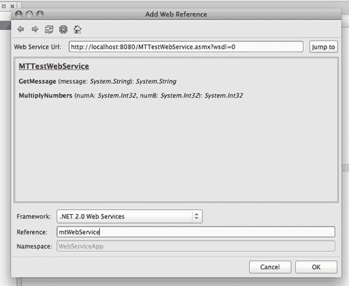
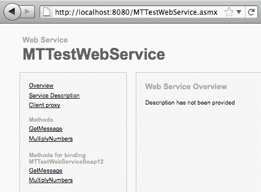

# 第六章：网络服务

在本章中，我们将涵盖：

+   消费网络服务

+   调用网络服务

+   消费 WCF 服务

+   读取 JSON 数据

# 简介

向用户提供在线信息是移动开发的关键部分。在本章中，我们将讨论开发与网络服务通信以提供信息的应用程序。我们将看到如何基于 SOAP 消费和调用网络服务，还将讨论如何使用 WCF 网络服务以及如何从网络服务器解析流行的 JSON 数据格式。

本章中的所有示例都使用与 Mono 框架一起提供的 xsp 轻量级网络服务器，因此无需在线上运行一个实时网络服务来使用提供的代码。

# 消费网络服务

在本配方中，我们将学习如何在 MonoTouch 项目中使用 SOAP 网络服务。

## 准备工作

在 MonoDevelop 中创建一个新的项目，并将其命名为`WebServiceApp`。本章的代码包含一个名为`MTWebService`的网络服务项目。这就是将要使用的网络服务。

## 如何操作...

1.  要使用`MTWebService`网络服务，我们需要一个网络服务器。Mono 框架提供了用于测试目的的 xsp 轻量级网络服务器。

1.  打开一个终端，并输入以下命令以进入网络服务的目录，将`<code_directory>`替换为下载的代码所在的路径：

    ```swift
    cd <code_directory>/CH06_code/MTWebService/MTWebService

    ```

1.  通过在提示符中输入`xsp4`来运行 xsp 网络服务器。你将看到类似以下输出的内容：

    ```swift
    xsp4
    Listening on address: 0.0.0.0
    Root directory: /Users/dtavlikos/projects/CH06_code/MTWebService/ MTWebService
    Listening on port: 8080 (non-secure)
    Hit Return to stop the server. 

    ```

1.  现在，我们需要在项目中添加对网络服务的引用。在**解决方案**面板中右键单击项目，然后选择**添加 | 添加 Web 引用**。

1.  在将显示的对话框中，添加以下截图提供的信息：

1.  在将引用添加到**MTTestWebService**网络服务后，在`MainController`的视图中添加一个按钮和一个标签。覆盖`MainController`类的`ViewDidLoad`方法，并在其中输入以下代码：

    ```swift
    this.buttonFetchData.TouchUpInside += delegate {
    using (MTTestWebService webService = new MTTestWebService()){
    this.lblMessage.Text = webService.GetMessage ("Hello Web Service!");
    }
    } ;

    ```

1.  最后，为我们的网络服务命名空间提供一个`using`指令：

    ```swift
    using WebServiceApp.mtWebService;

    ```

1.  在模拟器上编译并运行应用程序。

1.  点击按钮以调用网络服务，并注意标签中的输出消息。

## 工作原理...

MonoTouch 可以像.NET 桌面应用程序一样消费网络服务。`xsp`轻量级网络服务器在安装 Mono 框架时默认安装，这是 MonoTouch 安装的要求。在终端中运行不带任何参数的`xsp4`命令时，它默认将其基本目录设置为当前目录，并开始监听`8080`端口。如果网络服务器已启动，可以通过在浏览器中输入`http://localhost:8080/MTTestWebService.asmx`来查看网络服务描述：



需要在网络服务引用对话框的 **Web 服务 URL** 字段中输入的链接，可以通过点击服务描述页面上的 **服务描述** 链接，然后点击位于网络服务 WSDL 描述上方的 **下载** 链接来找到。

然后，我们将 **框架** 值设置为 **.NET 2.0 Web 服务**，并提供一个 **引用** 名称，该名称将反映网络引用的命名空间。为了在我们的代码中使用网络服务，我们实例化它，然后只需调用我们感兴趣的方法：

```swift
this.lblMessage.Text = webService.GetMessage ("Hello Web Service!");

```

## 更多内容...

除了使用本地托管网络服务外，互联网上还有许多示例网络服务。简单的搜索会产生许多结果。

### XSP 关闭

要关闭 `xsp` 网络服务器，只需在执行它的终端中按 *回车键*。

## 参见

在这一章中：

+   *调用网络服务*

+   *消费 WCF 服务*

# 调用网络服务

在这个菜谱中，我们将讨论如何正确使用 MonoTouch 中的网络服务。

## 准备工作

在 MonoDevelop 中创建一个新的项目，并将其命名为 `WebServiceApp2`。启动 `xsp` 网络服务器，并在项目中添加对 `TTestWebService` 网络服务的引用，具体操作如前一个任务所述。

## 如何做到...

1.  在 `MainController` 的视图中添加一个标签和一个按钮。

1.  在 MonoDevelop 中的 `MainController` 类中，覆盖 `ViewDidLoad` 方法，并在其中输入以下代码：

    ```swift
    this.buttonInvoke.TouchUpInside += delegate {
    int a = 5;
    int b = 12;
    MTTestWebService webService = new MTTestWebService ();
    webService.MultiplyNumbersCompleted += MultiplyNumbers_CompletedHandler;
    webService.MultiplyNumbersAsync (a, b);
    UIApplication.SharedApplication. NetworkActivityIndicatorVisible = true;
    this.lblMessage.Text = String.Format ( "Multiplying {0} by {1}", a, b);
    } ;

    ```

1.  最后，添加以下方法：

    ```swift
    private void MultiplyNumbers_CompletedHandler ( object sender, MultiplyNumbersCompletedEventArgs args){
    UIApplication.SharedApplication. NetworkActivityIndicatorVisible = false;
    this.InvokeOnMainThread (delegate {
    this.lblMessage.Text = String.Format ( "Multiplication result: {0}", args.Result);
    } );
    }

    ```

1.  在模拟器上编译并运行应用程序。

1.  点击按钮，查看网络服务的结果在标签上显示。

### 它是如何工作的...

正如你可能已经注意到的，在前一个任务中，当应用程序与网络服务通信时，它冻结了，直到收到结果。在这个任务中，我们使用异步调用，这样在应用程序联系网络服务时用户界面就不会冻结。

我们希望在应用程序从网络服务收到响应时得到通知，但我们还需要它的结果。在调用我们感兴趣的 web 方法之前，我们订阅了网络服务对象的 `MultiplyNumbersCompleted` 事件，如 `ViewDidLoad` 覆盖中突出显示的代码所示。这个事件是 MonoDevelop 在我们添加网络引用时创建的类的一部分，每个 web 方法都有一个对应的事件。然后我们通过访问 `MultiplyNumbersAsync` 方法异步调用 web 方法。这个调用立即返回。下一个调用很有趣：

```swift
UIApplication.SharedApplication.NetworkActivityIndicatorVisible = true;

```

通过 `UIApplication.SharedApplication` 静态属性，我们可以访问一些应用程序范围内的组件，例如屏幕上显示的状态栏。当有进程挂起时，建议向用户提供某种信息。状态栏包含一个活动指示器，这是在原生 iOS 应用程序中设备连接到互联网时显示的内容。因此，用户习惯于这个控件，并知道当它显示时，设备正在连接以接收数据。通过将 `NetworkActivityIndicatorVisible` 属性设置为 `true`，网络指示器被激活并显示。

当对 Web 方法的调用完成时，将触发相应的事件。在 `MultiplyNumbers_CompletedHandler` 方法内部，我们首先确保隐藏网络指示器，以通知用户应用程序不再连接。我们可以通过 `MultiplyNumbersCompletedEventArgs.Result` 属性访问 Web 方法的返回结果。

在这个示例中，我们希望在处理程序内部直接在标签中显示结果。因为 Web 方法是异步调用的，处理程序很可能会在主线程之外的其他线程上执行。因此，我们将结果赋值给标签的操作包装在一个匿名方法中，并在主线程上执行，如处理程序实现中突出显示的代码所示。

### 更多内容...

Web 服务对象包含了一组更常见的异步调用，我们可以使用。它遵循 `BeginInvoke EndInvoke` 模式，方法名称根据服务的 Web 方法进行重命名。在这种情况下，这些方法被命名为 `BeginMultiplyNumbers` 和 `EndMultiplyNumbers`。

#### 错误处理

`MultiplyNumbersCompletedEventArgs` 类还包含一个 `Error` 属性。它返回 `System.Exception` 类型的值，如果发生错误，例如由于网络连接问题，它将包含适当的信息。如果没有发生错误，`Error` 属性将返回 `null`。在检索 Web 方法的返回结果之前，建议始终检查此属性：

```swift
if (null != args.Error){
// Something went wrong, handle appropriately.
}

```

### 参见

在本章中：

+   *消费 WCF 服务*

# 消费 WCF 服务

在本食谱中，我们将学习如何使用 MonoTouch 消费 WCF 服务。

## 准备工作

对于此项目，我们需要一个正在运行的 WCF 服务。本章的代码下载中可以找到 WCF 服务。要启动服务，打开终端并转到项目的目录。通过运行 `start_wcfservice.sh` 脚本来启动服务：

```swift
cd <code_directory>/CH06_code/ WcfService/WcfService
./start_wcfservice.sh

```

服务启动后，在 MonoDevelop 中创建一个新的项目，并将其命名为 `WcfServiceApp`。

## 如何操作...

1.  将 `System.Runtime.Serialization` 和 `System.ServiceModel` 的引用添加到项目中，并在 `MainController.cs` 文件中添加它们对应的 `using` 指令。

1.  MonoTouch 尚未提供对 WCF 服务的全面支持。为了生成客户端代理，我们将在 Windows 机器上使用`slsvcutil`工具。在 Windows 的终端中运行以下命令：

    ```swift
    "c:\Program Files\Microsoft SDKs\Silverlight\v3.0\Tools\slsvcutil /noconfig http://192.168.1.18:8080/WcfService.svc?wsdl" 

    ```

    此命令将生成一个名为`service.cs`的 C#源文件。将此文件添加到 MonoDevelop 项目中。

1.  在`MainController`视图上添加一个标签和一个按钮。重写`MainController`类的`ViewDidLoad`方法，并在其中输入以下代码：

    ```swift
    this.buttonFetchData.TouchUpInside += delegate( object sender, EventArgs e) {
    WcfTestServiceClient client = new WcfTestServiceClient ( new BasicHttpBinding (), new EndpointAddress ( "http://192.168.1.18:8080/WcfTestService.svc"));
    client.GetBookInfoCompleted += WcfTestServiceClient_GetBookInfoCompleted;
    client.GetBookInfoAsync ();
    UIApplication.SharedApplication. NetworkActivityIndicatorVisible = true;
    } ;

    ```

1.  最后，添加以下事件处理器：

    ```swift
    private void WcfTestServiceClient_GetBookInfoCompleted ( object sender, GetBookInfoCompletedEventArgs e){
    this.InvokeOnMainThread (delegate {
    UIApplication.SharedApplication. NetworkActivityIndicatorVisible = false;
    this.labelResult.Text = String.Format ("Book title: {0}\nAuthor: {1}", e.Result.Title, e.Result.Name);
    } );
    }

    ```

1.  在模拟器上编译并运行应用程序。

1.  点击按钮，并观察从服务返回的数据填充到标签中。

### 它是如何工作的...

MonoTouch 依赖于 Mono Framework 对 WCF 服务的支持，但这并不完整。然而，仅 WCF 服务可以在 iOS 应用程序中使用这一事实就使 MonoTouch 对.NET 开发者更具吸引力。

例如，没有工具可以在 Mac 上创建客户端代理，因此我们必须能够访问 Windows 机器来执行此操作，使用**Silverlight 服务模型代理生成工具（slsvcutil.exe）**。该工具生成的源文件允许我们在项目中消耗 WCF 服务。它基本上做了 MonoDevelop 在我们添加 Web 引用到 ASMX Web 服务时自动执行的事情，就像在前两个任务中一样。

### 注意

重要的一点是使用**Silverlight 版本 3.0**的`slsvcutil`来创建客户端代理。

除了 Mono Framework 的支持外，还有一个限制：iOS 不允许动态代码生成。这使得任何依赖于`System.Reflection.Emit`命名空间的代码都无法使用。实际上，`System.Reflection.Emit`命名空间在 MonoTouch 中根本不可用。

在 Mac 上复制生成的文件后，我们将其添加到项目中，我们就可以使用 WCF 服务了。之前高亮显示的代码显示了如何实例化服务对象。请注意，服务对象的默认构造函数不能使用，因为 MonoTouch 不支持`System.Configuration`命名空间。

实际通信是通过调用方法异步实现来完成的，在设置其对应完成事件的处理器之后。请注意，在这种情况下，没有使用同步调用或`BeginInvoke EndInvoke`模式的替代方案：

```swift
client.GetBookInfoCompleted += WcfTestServiceClient_GetBookInfoCompleted;
client.GetBookInfoAsync ();

```

服务返回的结果可以通过指定的`EventArgs`派生类的`Result`属性检索：

```swift
this.labelResult.Text = String.Format ( "Book title: {0}\nAuthor: {1}", e.Result.Title, e.Result.Name);

```

### 还有更多...

当调试消耗 WCF 服务的项目时，请记住设置服务运行在的机器的地址，而不是`localhost`或`127.0.0.1`。这是因为当我们将应用程序运行在设备上时，应用程序将无法连接到服务。

#### 关于 MonoDevelop 的 WCF 支持的更多信息

在*消耗 Web 服务*配方中显示的**添加 Web 引用**窗口中，可以通过 MonoDevelop 添加 WCF Web 引用。然而，它尚未完成。

#### WCF 服务创建

从 `WcfService` 服务返回的对象以及实际的服务本身都是在 Mac 上使用 MonoDevelop 完全创建的。由于没有 WCF 项目模板，使用了 **空项目** 模板。

### 相关内容

在本章中：

+   *消费 Web 服务*

# 读取 JSON 数据

在本食谱中，我们将学习如何读取 **JavaScript 对象表示法 (JSON )** 数据。

## 准备工作

在 MonoDevelop 中创建一个新的项目，并将其命名为 `JsonDataApp`。在 `MainController` 的视图中添加一个按钮和一个标签。

## 如何实现...

1.  将项目添加到 `System.Json` 程序集的引用中。

1.  在 `MainController.cs` 文件中添加以下 `using` 指令：

    ```swift
    using System.Json;
    using System.Net;
    using System.IO;

    ```

1.  输入以下方法：

    ```swift
    private JsonValue GetJsonObject (){
    string responseString = string.Empty;
    Uri uri = new Uri ("http://192.168.1.18:8080/mtjson.txt");
    HttpWebRequest request = new HttpWebRequest (uri);
    request.Method = "GET";
    HttpWebResponse response = request.GetResponse () as HttpWebResponse;
    using (StreamReader sr = new StreamReader(response.GetResponseStream())) {
    responseString = sr.ReadToEnd ();
    }
    response.Close ();
    return JsonValue.Parse (responseString);
    }

    ```

1.  将处理程序附加到按钮的 `TouchUpInside` 事件，并在其中输入以下代码：

    ```swift
    JsonValue json = this.GetJsonObject ();
    this.labelResponse.Text = String.Format ("File name: {0}\n Description: {1}", json ["filename"], json ["description"]);

    ```

1.  最后，在项目目录中运行 `xsp` 服务器。文件 "mtjson.txt" 包含了 JSON 格式的数据。

## 它是如何工作的...

JSON 是一种特定的文本格式，它易于阅读和实现。许多流行的网站使用此格式来分发数据。其主要优势是它不受语言限制。JSON 的结构基于名称/值对和数组。在本任务中使用的 JSON 数据对象相当简单：

```swift
{
"filename":"mtjson.txt",
"description":"a sample json object"
}

```

要从网络服务器读取数据，我们只需创建一个 `HttpWebRequest` 对象，将其 `Method` 属性设置为 `HTTP GET:`。

```swift
HttpWebRequest request = new HttpWebRequest (uri);
request.Method = "GET";

```

然后，我们需要从服务器获取响应。我们通过检索请求的响应对象，并使用 `StreamReader` 从其底层流中读取数据来完成此操作：

```swift
HttpWebResponse response = request.GetResponse () as HttpWebResponse;
using (StreamReader sr = new StreamReader(response.GetResponseStream())) {
responseString = sr.ReadToEnd ();
}

```

现在的 `responseString` 变量包含了之前显示的原始 JSON 数据。为了解析 JSON 数据，MonoTouch 提供了 `JsonValue` 类。要创建一个 `JsonValue` 对象，我们使用它的 `Parse` 静态方法，并将包含 JSON 数据的字符串传递给它：

```swift
return JsonValue.Parse (responseString);

```

要访问 `JsonValue` 对象解析的数据，我们使用索引器：

```swift
this.labelResponse.Text = String.Format ("File name: {0}\nDescription: {1}", json ["filename"], json ["description"]);

```

## 更多内容...

如果传递了一个在 JSON 对象中不存在的名称，将会抛出异常。如果不知道 JSON 对象的名称，我们可以使用整数来检索数据：

```swift
//json[0], json[1] etc...

```

`JsonValue` 类继承自 `IEnumerable` 接口。

### 序列化

`System.Json` 命名空间提供了用于简单解析 JSON 数据的对象。它不提供 JSON 序列化功能。然而，我们可以从一组 `KeyValuePair<string, JsonValue>` 对象创建一个 `JsonObject`。要创建之前的 JSON 对象，我们将编写如下内容：

```swift
JsonObject obj = new JsonObject (new KeyValuePair<string, JsonValue> ("filename", JsonValue.Parse ("\"mtjson.txt\"")), new KeyValuePair<string, JsonValue>("description", JsonValue.Parse("\"a sample json object\"")));

```

## 相关内容

在本章中：

+   *消费 Web 服务*
