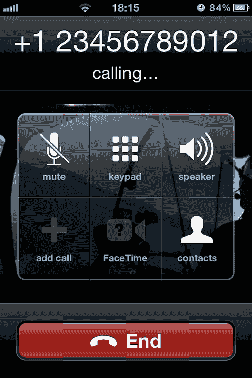
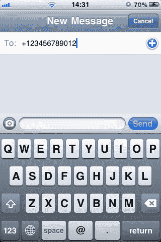
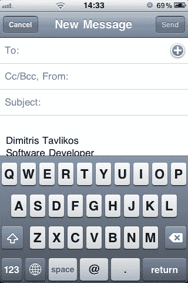
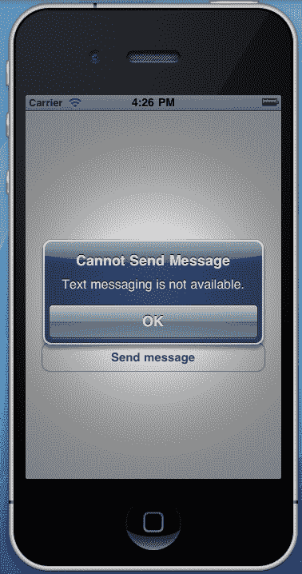
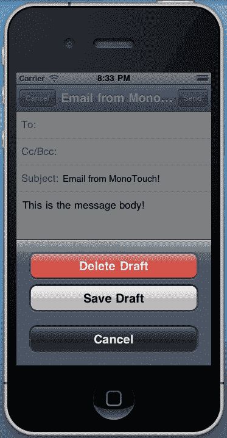
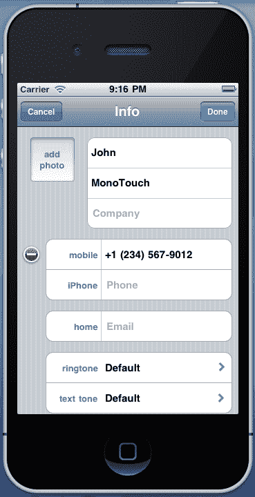

# 第八章。集成 iOS 功能

在本章中，我们将介绍以下内容：

+   开始电话通话

+   发送短信和电子邮件

+   在我们的应用程序中使用短信

+   在我们的应用程序中使用电子邮件消息

+   管理地址簿

+   显示联系人

+   管理日历

# 简介

移动设备为用户提供了一系列功能。创建一个与应用程序这些功能交互以向用户提供完整体验的应用程序当然可以被视为一种优势。

在本章中，我们将讨论 iOS 的一些最常见功能以及如何将它们的一些或全部功能集成到我们的应用程序中。我们将看到如何使用原生平台应用程序或通过在我们的项目中集成原生用户界面来使用户能够进行电话通话、发送短信和电子邮件。此外，我们还将讨论以下组件：

+   `MFMessageComposeViewController:` 这个控制器适合发送文本（SMS）消息

+   `MFMailComposeViewController:` 这是一个用于发送带或不带附件的电子邮件的控制器

+   `ABAddressBook:` 这是一个提供我们访问地址簿数据库的类

+   `ABPersonViewController:` 这是一个显示和/或编辑地址簿中联系人信息的控制器

+   `EKEventStore:` 这是一个负责管理日历事件的类

此外，我们还将学习如何读取和保存联系人信息，如何显示联系人详细信息，以及如何与设备日历交互。

注意，本章中的一些示例可能需要设备。例如，模拟器不包含消息应用程序。要将应用程序部署到设备，您需要通过 Apple 的开发者门户注册为 iOS 开发者，并获得 MonoTouch 的商业许可证。

# 开始电话通话

在本食谱中，我们将学习如何调用原生电话应用程序，允许用户进行通话。

## 准备工作

在 MonoDevelop 中创建一个新的项目，并将其命名为 `PhoneCallApp`。

### 注意

原生电话应用程序在模拟器上不可用。它仅在 iPhone 设备上可用。

## 如何操作...

1.  在 `MainController` 的视图中添加一个按钮，并重写 `ViewDidLoad` 方法。使用以下代码实现它。如果您实际上想要拨打电话，请将数字替换为真实的电话号码：

    ```swift
    this.buttonCall.TouchUpInside += delegate {
    NSUrl url = new NSUrl("tel:+123456789012");
    if (UIApplication.SharedApplication.CanOpenUrl(url)){
    UIApplication.SharedApplication.OpenUrl(url);
    } else{
    Console.WriteLine("Cannot open url: {0}", url.AbsoluteString);
    }
    } ;

    ```

1.  在设备上编译并运行应用程序。点击 **Call!** 按钮开始通话。以下截图显示了电话应用程序正在拨打电话：



## 它是如何工作的...

通过 `UIApplication.SharedApplication` 静态属性，我们可以访问应用程序的 `UIApplication` 对象。我们可以使用它的 `OpenUrl` 方法，该方法接受一个 `NSUrl` 变量来发起通话：

```swift
UIApplication.SharedApplication.OpenUrl(url);

```

由于并非所有 iOS 设备都支持原生电话应用程序，因此首先检查其可用性将是有用的：

```swift
if (UIApplication.SharedApplication.CanOpenUrl(url))

```

当调用 `OpenUrl` 方法时，原生电话应用将被执行，并且它将立即开始拨打电话。请注意，需要 `tel:` 前缀来发起通话。

## 更多内容...

MonoTouch 也支持 `CoreTelephony` 框架，通过 `MonoTouch.CoreTelephony` 命名空间。这是一个简单的框架，提供了有关通话状态、连接、运营商信息等方面的信息。请注意，当通话开始时，原生电话应用进入前台，导致应用挂起。以下是对 `CoreTelephony` 框架的简单使用：

```swift
CTCallCenter callCenter = new CTCallCenter();
callCenter.CallEventHandler = delegate(CTCall call) {
Console.WriteLine(call.CallState);
} ;

```

注意，处理程序是用等号（=）而不是常见的加等号（+=）组合赋值的。这是因为 `CallEventHandler` 是一个属性而不是一个事件。当应用进入后台时，事件不会分配给它。当应用返回前台时，只有最后发生的事件会被分配。

### 关于 OpenUrl 的更多信息

`OpenUrl` 方法可以用来打开各种原生和非原生应用。例如，要在 Safari 中打开网页，只需创建一个包含以下链接的 `NSUrl` 对象：

```swift
NSUrl url = new NSUrl("http://www.packtpub.com");

```

## 相关链接

本章内容：

+   *发送短信和电子邮件*

# 发送短信和电子邮件

在这个菜谱中，我们将学习如何在我们的应用中调用原生邮件和消息应用。

## 准备工作

在 MonoDevelop 中创建一个新的项目，并将其命名为 `SendTextApp`。

## 如何操作...

1.  在 `MainController` 的主视图中添加两个按钮。覆盖 `MainController` 类的 `ViewDidLoad` 方法，并使用以下代码实现：

    ```swift
    this.buttonSendText.TouchUpInside += delegate {
    NSUrl textUrl = new NSUrl("sms:");
    if (UIApplication.SharedApplication.CanOpenUrl(textUrl)){
    UIApplication.SharedApplication.OpenUrl(textUrl);
    } else{
    Console.WriteLine("Cannot send text message!");
    }
    } ;
    this.buttonSendEmail.TouchUpInside += delegate {
    NSUrl emailUrl = new NSUrl("mailto:");
    if (UIApplication.SharedApplication.CanOpenUrl(emailUrl)){
    UIApplication.SharedApplication.OpenUrl(emailUrl);
    } else{
    Console.WriteLine("Cannot send e-mail message!");
    }
    } ;

    ```

1.  在设备上编译并运行应用程序。点击其中一个按钮以打开相应的应用。

## 它是如何工作的...

再次使用 `OpenUrl` 方法，我们可以发送文本或电子邮件消息。在这个示例代码中，只需使用 `sms:` 前缀就会打开原生短信应用。在 `sms:` 前缀后添加手机号码将打开原生消息应用：

```swift
UIApplication.SharedApplication.OpenUrl(new NSUrl("sms:+123456789012"));

```



### 注意

除了收件人号码外，在显示原生短信应用之前，没有其他数据可以设置。

对于打开原生电子邮件应用，过程类似。传递 `mailto:` 前缀将打开编辑邮件控制器。

```swift
UIApplication.SharedApplication.OpenUrl(new NSUrl("mailto:"));

```



`mailto:` URL 方案支持各种参数来定制电子邮件消息。这些参数允许我们输入发送者地址、主题和消息：

```swift
UIApplication.SharedApplication.OpenUrl("mailto:recipient@example.com?subject=Email%20with%20MonoTouch!&body=This%20is%20the%20message%20body!");

```

## 更多内容...

虽然 iOS 提供了打开原生消息应用的方法，但在电子邮件的情况下，预先定义消息内容，这里的控制从应用内部停止。实际上通过代码发送消息是没有办法的。是否发送消息将由用户决定。

### 关于打开外部应用的更多信息

`OpenUrl`方法提供了一个打开原生消息应用程序的接口。打开外部应用程序有一个缺点：调用`OpenUrl`方法的程序会转到后台。在 iOS 版本 3.*之前，这是通过应用程序提供消息的唯一方式。从 iOS 版本 4.0 开始，Apple 向 SDK 提供了消息控制器。以下菜谱讨论了它们的用法。

## 相关内容

在本章中：

+   *开始电话*

+   *在我们的应用程序中使用文本消息*

# 在我们的应用程序中使用文本消息

在这个菜谱中，我们将学习如何在我们的应用程序中使用原生消息用户界面提供文本消息功能。

## 准备工作

在 MonoDevelop 中创建一个新的项目，并将其命名为`TextMessageApp`。

## 如何做到这一点...

1.  在`MainController`的视图中添加一个按钮。在`MainController.cs`文件中输入以下指令：

    ```swift
    using MonoTouch.MessageUI;

    ```

1.  使用以下代码实现`ViewDidLoad`方法，根据您的意愿更改接收者号码和/或消息正文：

    ```swift
    private MFMessageComposeViewController messageController;
    public override void ViewDidLoad (){
    base.ViewDidLoad ();
    this.buttonSendMessage.TouchUpInside += delegate {
    if (MFMessageComposeViewController.CanSendText){
    this.messageController = new MFMessageComposeViewController();
    this.messageController.Recipients = new string[] { "+123456789012" };
    this.messageController.Body = "Text from MonoTouch";
    this.messageController.MessageComposeDelegate = new MessageComposerDelegate();
    this.PresentModalViewController( this.messageController, true);
    } else{
    Console.WriteLine("Cannot send text message!");
    }
    } ;
    }

    ```

1.  添加以下嵌套类：

    ```swift
    private class MessageComposerDelegate : MFMessageComposeViewControllerDelegate{
    public override void Finished (MFMessageComposeViewController controller, MessageComposeResult result){
    switch (result){
    case MessageComposeResult.Sent:
    Console.WriteLine("Message sent!");
    break;
    case MessageComposeResult.Cancelled:
    Console.WriteLine("Message cancelled!");
    break;
    default:
    Console.WriteLine("Message sending failed!");
    break;
    }
    controller.DismissModalViewControllerAnimated(true);
    }
    }

    ```

1.  在设备上编译并运行应用程序。

1.  点击**发送消息**按钮以打开消息控制器。点击**发送**按钮发送消息，或点击**取消**按钮返回应用程序。

## 它是如何工作的...

`MonoTouch.MessageUI`命名空间包含允许我们在 iOS 应用程序中实现消息的必要 UI 元素。对于文本消息（SMS），我们需要`MFMessageComposeViewController`类。

只有 iPhone 能够直接发送短信。在 iOS 5 中，iPod 和 iPad 也可以发送短信，但用户可能没有在设备上启用此功能。因此，检查可用性是最佳实践。《MFMessageComposeViewController》类包含一个名为`CanSendText`的静态方法，它返回一个布尔值，指示我们是否可以使用此功能。在这种情况下，重要的是我们应该在初始化控制器之前检查发送短信是否可用。这是因为当你在不支持短信的设备或模拟器上尝试初始化控制器时，你将在屏幕上看到以下消息：



为了确定用户在消息 UI 中采取了哪些操作，我们实现一个`Delegate`对象并重写`Finished`方法：

```swift
private class MessageComposerDelegate : MFMessageComposeViewControllerDelegate

```

MonoTouch 提供的另一个选项是订阅`MFMessageComposeViewController`类的`Finished`事件。

在`Finished`方法中，我们可以根据`MessageComposeResult`参数提供功能。它的值可以是以下三个之一：

1.  `Sent:` 这个值表示消息已成功发送。

1.  `Cancelled:` 这个值表示用户点击了**取消**按钮，消息将不会发送。

1.  `Failed:` 这个值表示消息发送失败。

最后要做的就是取消消息控制器，操作如下：

```swift
controller.DismissModalViewControllerAnimated(true);

```

在初始化控制器后，我们可以将收件人和正文消息设置到相应的属性中：

```swift
this.messageController.Recipients = new string[] { "+123456789012" };
this.messageController.Body = "Text from MonoTouch";

```

`Recipients`属性接受一个字符串数组，允许有多个收件人号码。

你可能已经注意到，消息控制器的`Delegate`对象被设置为它的`MessageComposeDelegate`属性，而不是常见的`Delegate`。这是因为`MFMessageComposeViewController`类直接继承自`UINavigationController`类，所以`Delegate`属性接受`UINavigationControllerDelegate`类型的值。

## 还有更多...

SDK 提供了发送文本消息的用户界面，并不意味着它是可定制的。就像调用原生消息应用一样，是否发送消息或丢弃消息的决定权在用户手中。实际上，在控制器显示在屏幕上之后，任何尝试更改实际对象或其任何属性的操作都将失败。此外，用户可以更改或删除收件人和消息正文。真正的优势在于，消息用户界面是在我们的应用程序内显示的，而不是单独运行。

### 仅限短信

`MFMessageComposeViewController`只能用于发送**短消息服务（SMS）**消息，而不能发送**多媒体消息服务（MMS）**。

# 在我们的应用程序中使用电子邮件消息

在这个菜谱中，我们将学习如何在应用程序中使用电子邮件消息界面。

## 准备工作

在 MonoDevelop 中创建一个新的项目，并将其命名为`EmailMessageApp`。

## 如何做到这一点...

1.  在`MainController`的视图中添加一个按钮，并在`MainController.cs`文件中的`MonoTouch.MessageUI`命名空间中。

1.  在`ViewDidLoad`方法中输入以下代码：

    ```swift
    this.buttonSendEmail.TouchUpInside += delegate {
    this.mailController = new MFMailComposeViewController();
    this.mailController.SetToRecipients(new string[] { "recipient@example.com" });
    this.mailController.SetSubject("Email from MonoTouch!");
    this.mailController.SetMessageBody("This is the message body!", false);
    this.mailController.Finished += this.MailController_Finished;
    if (MFMailComposeViewController.CanSendMail){
    this.PresentModalViewController(this.mailController, true);
    } else{
    Console.WriteLine("Cannot send email!");
    }
    } ;

    ```

1.  添加以下方法：

    ```swift
    private void MailController_Finished (object sender, MFComposeResultEventArgs e){
    switch (e.Result){
    case MFMailComposeResult.Sent:
    Console.WriteLine("Email sent!");
    break;
    case MFMailComposeResult.Saved:
    Console.WriteLine("Email saved!");
    break;
    case MFMailComposeResult.Cancelled:
    Console.WriteLine("Email sending cancelled!");
    break;
    case MFMailComposeResult.Failed:
    Console.WriteLine("Email sending failed!");
    if (null != e.Error){
    Console.WriteLine("Error message: {0}", e.Error.LocalizedDescription);
    }
    break;
    }
    e.Controller.DismissModalViewControllerAnimated(true);
    }

    ```

1.  在模拟器或设备上编译并运行应用程序。

1.  点击**发送电子邮件**按钮以显示邮件用户界面。发送或取消消息。应用程序将在模拟器上工作，并且行为与设备上的原生邮件应用相同，只是消息实际上不会发送或保存。

## 它是如何工作的...

`MFMailComposeViewController`类提供了原生邮件编写界面。为了确定设备是否能够发送电子邮件，我们首先检查其`CanSendMail`属性。

与`MFMessageComposeViewController`类似，它包含一个`Finished`事件，我们使用它来响应用户操作，而无需实现`Delegate`对象。我们通过`MailController_Finished`方法来实现，基于`MFComposeResultEventArgs.Result`属性，该属性的类型为`MFMailComposeResult`。其可能的值将包括以下之一：

+   `Sent:` 这个值表示电子邮件消息已排队待发送

+   `Saved:` 这个值表示用户点击了**取消**按钮，动作表单中的**保存草稿**选项自动出现



+   `Cancelled:` 此值表示用户在控制器上点击 **取消** 按钮并在动作表中选择了 **删除草稿** 选项

+   `Failed:` 此值表示电子邮件消息发送失败

在初始化对象之后，我们可以通过相应的 `Set` 前缀方法来分配收件人列表、主题和消息正文：

```swift
this.mailController.SetToRecipients(new string[] { "recipient@example.com" });
this.mailController.SetSubject("Email from MonoTouch!");
this.mailController.SetMessageBody("This is the message body!", false);

```

`SetMessageBody` 消息的第二个参数，如果设置为 `true`，则通知控制器该消息应被视为 HTML 格式。

## 更多内容...

除了简单的或 HTML 格式的文本外，我们还可以发送附件。我们可以使用 `AddAttachmentData` 方法来完成此操作：

```swift
this.mailController.AddAttachmentData(UIImage.FromFile("image.jpg"). AsJPEG(), "image/jpg", "image.jpg");

```

第一个参数是 `NSData` 类型，应包含附件的内容。在这种情况下，我们通过 `UIImage.AsJPEG()` 方法附加一个图片，该方法返回一个包含在 `NSData` 对象中的图片内容。第二个参数代表附件的 **Multipurpose Internet Mail Extensions (MIME)** 类型，第三个参数是文件名。项目源代码包含一个完整并带有注释的示例。

### 草稿动作表

当用户点击 **取消** 按钮时显示的动作表由 `MFMailComposeViewController` 自动处理。

## 相关内容

在本章中：

+   *在我们的应用程序中使用短信*

# 管理地址簿

在本食谱中，我们将讨论如何访问和管理设备地址簿中存储的用户联系人。

## 准备中

在 MonoDevelop 中创建一个新的项目，并将其命名为 `AddressBookApp`。

## 如何操作...

1.  在 `MainController` 的视图中添加一个按钮。在 `MainController.cs` 文件中输入以下 `using` 指令：

    ```swift
    using MonoTouch.AddressBook;

    ```

1.  覆盖 `ViewDidLoad` 方法：

    ```swift
    public override void ViewDidLoad (){
    base.ViewDidLoad ();
    this.buttonGetContacts.TouchUpInside += delegate {
    ABAddressBook addressBook = new ABAddressBook();
    ABPerson[] contacts = addressBook.GetPeople();
    foreach (ABPerson eachPerson in contacts){
    Console.WriteLine(string.Format("{0} {1}", eachPerson.LastName, eachPerson.FirstName));
    }
    } ;
    }

    ```

1.  在模拟器上编译并运行应用程序。

1.  点击 **获取联系人** 按钮，并观察联系人名称在 MonoDevelop 的 **应用程序输出** 面板中显示。

### 注意

在安装 iOS SDK 之后，模拟器不包含任何联系人。您可以像在设备上一样添加联系人。

## 如何工作...

`MonoTouch.AddressBook` 命名空间包含所有允许我们管理设备地址簿的类。要直接访问数据，我们需要 `ABAddressBook` 类的一个实例：

```swift
ABAddressBook addressBook = new ABAddressBook();

```

要获取地址簿中存储的所有联系人，我们调用其 `GetPeople()` 方法：

```swift
ABPerson[] contacts = addressBook.GetPeople();

```

此方法返回一个 `ABPerson` 对象数组，其中包含所有单个联系人的信息。要读取联系人的详细信息，我们遍历 `ABPerson` 数组，并使用 `FirstName` 和 `LastName` 属性分别获取每个联系人的名和姓：

```swift
Console.WriteLine(string.Format("{0} {1}", eachPerson.LastName, eachPerson.FirstName));

```

## 更多内容...

要获取联系人的存储电话号码，请调用 `GetPhones()` 方法：

```swift
ABMultiValue<string> phones = eachPerson.GetPhones();
Console.WriteLine(phones[0].Value);

```

它返回一个 `ABMultiValue<string>` 类型的对象。`ABMultiValue<T>` 是一个泛型集合，特别设计用于地址簿的多个值。

### 向联系人添加电话号码

要向联系人添加电话号码，我们可以使用`ABPerson`类的`SetPhones`方法。它接受一个`ABMultiValue<string>`对象作为其参数，但我们不能向`ABMultiValue`对象添加新值。然而，我们可以将值写入`ABMutableMultiValue<T>`对象：

```swift
ABMutableMultiValue<string> newPhones = phones.ToMutableMultiValue();

```

这行代码创建了一个新的`ABMutableMultiValue<string>`对象实例，然后我们使用它来添加我们想要的电话号码：

```swift
newPhones.Add("+120987654321", ABPersonPhoneLabel.iPhone);
eachPerson.SetPhones(newPhones);
addressBook.Save();

```

`Add`方法的第二个参数是电话号码在保存到联系人时将拥有的标签。调用`ABAddressBook.Save()`方法很重要，否则更改将不会保存。

# 显示联系人

在这个菜谱中，我们将学习如何使用原生地址簿用户界面来显示联系人信息。

## 准备工作

在 MonoDevelop 中创建一个新的项目，并将其命名为`DisplayContactApp`。在`MainController`的视图中添加一个按钮。

## 如何做到这一点...

1.  在`AppDelegate`类中为`UINavigationController`创建一个字段：

    ```swift
    UINavigationController navController;

    ```

1.  实例化导航控制器，将其根控制器传递为`MainController`的实例：

    ```swift
    this.navController = new UINavigationController(new MainController());

    ```

1.  将导航控制器设置为窗口的根视图控制器：

    ```swift
    window.RootViewController = this.navController;

    ```

1.  在`MainController.cs`文件中添加命名空间`MonoTouch.AddressBook`和`MonoTouch.AddressBookUI`。

1.  覆盖`MainController`类的`ViewDidLoad`方法，并使用以下代码实现：

    ```swift
    ABAddressBook addressBook = new ABAddressBook();
    ABPerson[] contacts = addressBook.GetPeople();
    ABPersonViewController personController = new ABPersonViewController();
    personController.DisplayedPerson = contacts[0];
    this.buttonDisplayContact.TouchUpInside += delegate {
    this.NavigationController.PushViewController( personController, true);
    } ;

    ```

1.  在模拟器或设备上编译并运行应用程序。

1.  点击**显示第一个联系人**按钮以显示联系人详细信息。

## 它是如何工作的...

`MonoTouch.AddressBookUI`命名空间包含原生`Contacts`应用程序使用的控制器，允许用户显示和管理联系人。每个联系人的详细信息都可以使用`ABPersonViewController`查看。此控制器必须通过`UINavigationController`来展示，否则将无法正确显示。

初始化后，我们将想要显示的`ABPerson`对象设置为其`DisplayedPerson`属性：

```swift
ABPersonViewController personController = new ABPersonViewController();
personController.DisplayedPerson = contacts[0];

```

然后，我们将其推送到导航控制器的堆栈中：

```swift
this.NavigationController.PushViewController(personController, true);

```

## 还有更多...

`ABPersonViewController`也可以用于编辑。为此，将`AllowsEditing`属性设置为`true`：

```swift
personController.AllowsEditing = true;

```

结果将与原生`Contacts`应用程序完全相同：



注意，更改通常通过`ABPersonViewController`保存。

### 其他地址簿控制器

`MonoTouch.AddressBookUI`命名空间包含我们创建自定义联系人应用程序所需的所有控制器：

+   `ABPeoplePickerNavigationController`：这是一个显示已保存联系人的导航控制器。用户可以从列表中选择一个联系人。

+   `ABPersonViewController`：这个控制器在之前的示例中有描述。

+   `ABNewPersonViewController`：这是创建新联系人的控制器。

+   `ABUnknownPersonViewController:` 这是用于创建新联系人的部分数据显示的控制器。这与我们在设备上最近通话列表中点击未知号码时显示的控制器类似。

## 相关内容

在本章中：

+   *管理地址簿*

# 管理日历

在本食谱中，我们将学习如何创建一个事件并将其保存到设备的日历数据库中。

## 准备工作

在 MonoDevelop 中创建一个新的项目，并将其命名为 `CalendarEventsApp`。

### 注意

此项目必须在设备上执行。本机 `Calendar` 应用程序未安装在模拟器上。

## 如何操作...

1.  在 `MainController` 的主视图中添加一个按钮。在 `MainController.cs` 文件中添加命名空间 `MonoTouch.EventKit`。

1.  最后，在 `ViewDidLoad` 方法中输入以下代码：

    ```swift
    this.buttonDisplayEvents.TouchUpInside += delegate {
    EKEventStore evStore = new EKEventStore();
    NSPredicate evPredicate = evStore.PredicateForEvents( DateTime.Now, DateTime.Now.AddDays(30), evStore.Calendars);
    evStore.EnumerateEvents(
    evPredicate, delegate(EKEvent calEvent, ref bool stop) {
    if (null != calEvent){
    stop = false;
    Console.WriteLine("Event title: {0}\nEvent start date: {1}", calEvent.Title, calEvent.StartDate);
    }
    } );
    } ;

    ```

1.  在设备上编译并运行应用程序。

1.  点击 **显示事件** 按钮以在 **应用程序输出** 面板中输出未来 30 天的日历事件。

## 工作原理...

`MonoTouch.EventKit` 命名空间负责管理日历事件。为了读取已存储的事件，我们首先初始化一个 `EKEventStore` 对象：

```swift
EKEventStore evStore = new EKEventStore();

```

`EKEventStore` 类为我们提供了访问已存储事件的权限。要检索日历事件，我们需要一个类型为 `NSPredicate` 的谓词。我们可以通过 `EKEventStore` 类的 `PredicateForEvents` 方法创建一个实例：

```swift
NSPredicate evPredicate = evStore.PredicateForEvents(DateTime.Now, DateTime.Now.AddDays(30), evStore.Calendars);

```

前两个参数的类型为 `NSDate`（可以隐式转换为 `DateTime`），表示要搜索事件的开始和结束日期。第三个参数的类型为 `EKCalendar[]`，它是要搜索的日历数组。要搜索所有可用的日历，我们传递 `EKEventStore.Calendars` 属性。

最后，我们调用 `EnumerateEvents` 方法：

```swift
evStore.EnumerateEvents(evPredicate, delegate(EKEvent calEvent, ref bool stop) {
//...

```

我们将之前创建的谓词传递给第一个参数。第二个参数是类型为 `EKEventSearchCallback` 的委托。为了读取每个事件的数据，我们使用其 `EKEvent` 对象。请注意，枚举日历事件的过程与在上一章中讨论的从资产库枚举资产的过程类似。

## 更多信息...

除了枚举事件外，`EKEventStore` 允许我们创建新的事件。以下示例创建并保存了一个新的日历事件：

```swift
EKEvent newEvent = EKEvent.FromStore(evStore);
newEvent.StartDate = DateTime.Now.AddDays(1);
newEvent.EndDate = DateTime.Now.AddDays(1.1);
newEvent.Title = "MonoTouch event!";
newEvent.Calendar = evStore.DefaultCalendarForNewEvents;
NSError error = null;
evStore.SaveEvent(newEvent, EKSpan.ThisEvent, out error);

```

为了创建一个新的 `EKEvent` 实例，我们使用 `EKEvent.FromStore` 静态方法。然后我们设置开始和结束日期、标题以及事件将要存储的日历。在这里，我们使用 `EKEventStore.DefaultCalendarForNewEvents` 属性可以获取的默认日历。当一切设置完毕后，我们调用 `SaveEvent` 方法来保存它。

### 关于日历的信息

默认情况下，设备已设置两个日历：`Home` 和 `Work`。尽管我们无法在设备上创建新日历，但我们在用于同步设备的计算机上创建的新日历在同步时将自动添加。

## 相关内容

在本书中：

第七章, 多媒体资源：

+   *直接管理专辑项目*
