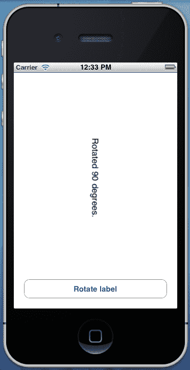
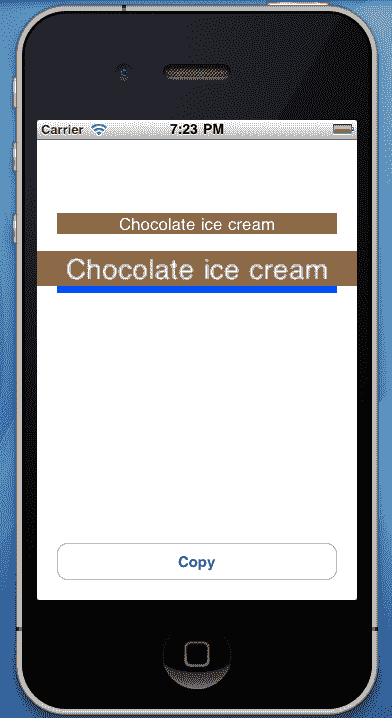
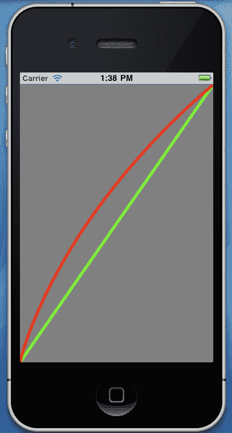
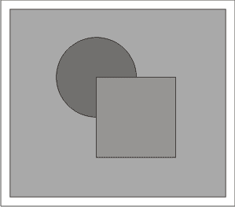
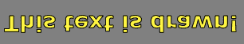
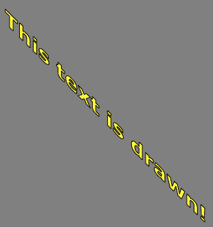
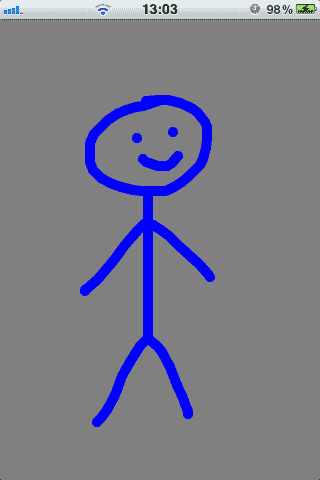

# 第十一章. 图形和动画

在本章中，我们将涵盖：

+   动画化视图

+   变换视图

+   使用图像进行动画

+   动画化层

+   绘制线条和曲线

+   绘制形状

+   绘制文本

+   一个简单的绘图应用程序

+   创建图像上下文

# 简介

在本章中，我们将讨论自定义绘制和动画。iOS SDK 包含两个用于这些任务的非常有用的框架：Core Graphics 和 Core Animation。

这两个框架简化了在 UI 元素上动画化以及绘制 2D 图形的过程。有效使用这两个框架将在平淡无奇和令人惊叹的应用程序之间产生差异。毕竟，这两个框架在使 iOS 平台在其类别中独一无二方面发挥着非常重要的作用。

我们将学习如何为控件提供简单甚至更复杂的动画，以提供独特的用户体验。我们还将看到如何在屏幕上自定义绘制线条、曲线、形状和文本。最后，通过所有提供的示例，我们将创建两个绘图应用程序。

# 动画化视图

在这个菜谱中，我们将学习如何利用`UIKit`动画在屏幕上移动`UILabel`。

## 准备工作

在 MonoDevelop 中创建一个新的项目，并将其命名为`ViewAnimationApp`。在`MainController`的视图中添加一个标签和一个按钮。

## 如何做到这一点...

1.  添加`MonoTouch.ObjCRuntime`命名空间，并在以下`ViewDidLoad`重写中输入：

    ```swift
    public override void ViewDidLoad (){
    base.ViewDidLoad ();
    this.lblOutput.BackgroundColor = UIColor.Green;
    this.buttonAnimate.TouchUpInside += delegate {
    RectangleF labelFrame = this.lblOutput.Frame;
    labelFrame.Y = 380f;
    UIView.BeginAnimations("LabelPositionAnimation");
    UIView.SetAnimationDuration(1);
    UIView.SetAnimationCurve(UIViewAnimationCurve.EaseInOut);
    UIView.SetAnimationDelegate(this);
    UIView.SetAnimationDidStopSelector(new Selector("LabelPositionAnimationStopped"));
    this.lblOutput.Frame = labelFrame;
    UIView.CommitAnimations();
    };
    }

    ```

1.  添加以下方法：

    ```swift
    [Export("LabelPositionAnimationStopped")]
    public void LabelAnimationStopped(){
    this.lblOutput.Text = "Animation ended!";
    this.lblOutput.BackgroundColor = UIColor.Red;
    }

    ```

1.  在模拟器上编译并运行应用程序。

1.  点击**Animate!**按钮，并观察标签移动到视图的下半部分。

## 它是如何工作的...

`UIView`类包含许多针对动画的静态方法。在这个例子中，我们只是通过动画改变了一个标签的位置。

要动画化位置的变化，我们需要在调用`BeginAnimations`方法之后应用这些更改：

```swift
UIView.BeginAnimations("LabelPositionAnimation");

```

它接受一个字符串参数，该参数声明了动画的名称。在这次调用之后我们对视图所做的更改将被动画化。但，我们也可以调整各种动画参数：

```swift
UIView.SetAnimationDuration(1);
UIView.SetAnimationCurve(UIViewAnimationCurve.EaseInOut);

```

`SetAnimationDuration`方法定义了动画的持续时间（以秒为单位）。`SetAnimationCurve`方法定义了将在动画的起点和/或终点应用到的默认缓动函数。

当动画完成时，我们有执行代码的选项。为此，我们首先需要使用`SetAnimationDelegate`方法设置动画代理对象：

```swift
UIView.SetAnimationDelegate(this);

```

在这个例子中，我们将我们的控制器对象`MainController`设置为动画代理对象。在设置代理对象后，我们需要设置当动画完成时将被调用的选择器：

```swift
UIView.SetAnimationDidStopSelector(new Selector("LabelPositionAnimationStopped"));

```

要创建`Selector`实例，我们需要使用`MonoTouch.ObjCRuntime`命名空间：

```swift
using MonoTouch.ObjCRuntime;

```

在对动画进行所有调整后，我们将新值设置到将被动画化的对象上，并调用`CommitAnimations`方法：

```swift
this.lblOutput.Frame = labelFrame;
UIView.CommitAnimations();

```

注意，在 `BeginAnimations` 调用下面的代码将在 `CommitAnimations` 行执行。此外，每个使用 `BeginAnimations` 方法开始的动画都应该有一个相应的 `CommitAnimations` 方法调用，否则可能会出现意外结果；例如，对 UI 元素所做的每个更改都将被动画化。

## 还有更多...

`UIView` 类还包含一个重载的 `Animate` 方法。此方法基本上将我们在这里使用的方法封装在一个方法中。使用 `Animate` 方法的前一个示例表示为以下代码：

```swift
UIView.Animate(1, 0, UIViewAnimationOptions.CurveEaseInOut, delegate { this.lblOutput.Frame = labelFrame; }, delegate { this.LabelAnimationStopped(); } );

```

此重载的第二个参数是动画开始后的延迟。

### UIKit 动画和 iOS 版本

`Animate` 方法是在 iOS 4.0 版本中引入的。当针对低于 4 的 iOS 版本时，使用由 `BeginAnimations` 和 `CommitAnimations` 方法定义的动画块。

### 可动画属性

`UIKit` 动画支持一组特定的 `UIView` 属性。这些属性被称为 **可动画属性**。以下是可被动画化的 `UIView` 属性列表：

+   `Frame`

+   `Bounds`

+   `Center`

+   `Transform`

+   `Alpha`

+   `BackgroundColor`

+   `ContentStretch`

# 视图变换

在这个菜谱中，我们将通过应用变换来旋转 `UILabel`。此外，旋转将会有动画效果。

## 准备工作

在 MonoDevelop 中创建一个新的项目，并将其命名为 `TransformViewApp`。在 `MainController` 的视图中添加一个标签和一个按钮。

## 如何实现...

1.  添加 `MonoTouch.CoreGraphics` 命名空间：

    ```swift
    using MonoTouch.CoreGraphics;

    ```

1.  在 `MainController` 类中输入以下代码：

    ```swift
    private double rotationAngle;
    public override void ViewDidLoad (){
    base.ViewDidLoad ();
    this.buttonRotate.TouchUpInside += delegate {
    this.rotationAngle += 90;
    CGAffineTransform transform = CGAffineTransform.MakeRotation( (float)this.DegreesToRadians(this.rotationAngle));
    UIView.BeginAnimations("RotateLabelAnimation");
    UIView.SetAnimationDuration(0.5f);
    this.lblOutput.Transform = transform;
    UIView.CommitAnimations();
    this.lblOutput.Text = string.Format("Rotated to {0} degrees.", this.rotationAngle);
    if (this.rotationAngle >= 360){
    this.rotationAngle = 0;
    this.lblOutput.Transform = CGAffineTransform.MakeIdentity();
    }
    };
    }
    public double DegreesToRadians (double degrees){
    return (degrees * Math.PI / 180);
    }

    ```

1.  在模拟器上编译并运行应用程序。

1.  点击按钮并观察标签旋转。



## 工作原理...

`MonoTouch.CoreGraphics` 命名空间是 `CoreGraphics` 框架的包装器。这个框架是 iOS 的基本图形框架。

要旋转视图，我们需要一个变换对象，该对象将通过视图的 `Transform` 属性应用于视图：

```swift
CGAffineTransform transform = CGAffineTransform.MakeRotation( (float)this.DegreesToRadians(this.rotationAngle));

```

变换对象是 `CGAffineTransform` 类的实例，并通过 `MakeRotation` 静态方法初始化。此方法接受一个浮点值，表示我们想要应用的角度，单位为弧度。可以使用 `DegreesToRadians` 方法将度转换为弧度。创建变换对象后，我们将其分配给标签的 `Transform` 属性，在动画块内部：

```swift
UIView.BeginAnimations("RotateLabelAnimation");
UIView.SetAnimationDuration(0.5f);
this.lblOutput.Transform = transform;
UIView.CommitAnimations();

```

注意，每次按下按钮时，我们需要增加旋转角度，因为我们应用的变化不会被自动增加。如果我们应用另一个具有相同角度的旋转变换对象，将不会有任何效果，因为它基本上是相同的变化。

当标签旋转到完整圆（=360 度）时，我们重置 `rotationAngle` 值和变换对象：

```swift
this.rotationAngle = 0;
this.lblOutput.Transform = CGAffineTransform.MakeIdentity();

```

`MakeIdentity`静态方法创建一个恒等变换对象，这是在应用变换对象之前所有视图的默认变换。

## 还有更多...

`CGAffineTransform`类包含用于创建变换对象的静态方法。这些是：

+   `CGAffineTransformInvert:` 此方法反转当前变换并返回结果

+   `MakeIdentity:` 此方法创建一个恒等变换

+   `MakeRotation:` 此方法创建一个旋转变换

+   `MakeScale:` 此方法创建一个缩放变换

+   `MakeTranslation:` 此方法创建一个平移变换

+   `Multiply:` 此方法将两个变换相乘并返回结果

### 变换和框架

在对一个视图应用变换后，其`Frame`属性不应被考虑。如果需要在变换后更改视图的大小或位置，请分别使用`Bounds`和`Center`属性。

## 相关内容

在这一章中：

+   *动画视图*

+   *动画层*

# 使用图像的动画

在这个菜谱中，我们将使用`UIImageView`内置的动画功能创建一个简单的图片幻灯片。

## 准备工作

在 MonoDevelop 中创建一个新的项目，并将其命名为`ImageAnimationApp`。在`MainController`的视图中添加一个`UIImageView`和两个按钮。此任务的示例项目包含三张图片。将两张或更多图片添加到项目中，并将它们的**构建操作**设置为**内容**。

## 如何做到这一点...

1.  输入以下`ViewDidLoad`重写：

    ```swift
    public override void ViewDidLoad (){
    base.ViewDidLoad ();
    this.imageView.ContentMode = UIViewContentMode.ScaleAspectFit;
    this.imageView.AnimationImages = new UIImage[] {
    UIImage.FromFile("images/Kastoria.jpg"),
    UIImage.FromFile("images/Parga02.jpg"),
    UIImage.FromFile("images/Toroni.jpg")
    } ;
    this.imageView.AnimationDuration = 3;
    this.imageView.AnimationRepeatCount = 10;
    this.buttonAnimate.TouchUpInside += delegate {
    if (!this.imageView.IsAnimating){
    this.imageView.StartAnimating();
    }
    };
    this.buttonStop.TouchUpInside += delegate {
    if (this.imageView.IsAnimating){
    this.imageView.StopAnimating();
    }
    };
    }

    ```

1.  在模拟器上编译并运行应用程序。

1.  点击**动画图像**按钮以开始动画。

## 它是如何工作的...

`UIImageView`可以接受一个`UIImage`对象的数组，并自动按顺序显示它们。

要加载视图将动画的图像，将图像的数组分配给其`AnimationImages`属性：

```swift
this.imageView.AnimationImages = new UIImage[] {
UIImage.FromFile("images/Kastoria.jpg"),
UIImage.FromFile("images/Parga02.jpg"),
UIImage.FromFile("images/Toroni.jpg")
} ;

```

图像显示的顺序由它们在数组中的顺序定义。在设置将动画的图像后，我们设置动画的持续时间（以秒为单位）和它将发生的次数：

```swift
this.imageView.AnimationDuration = 3;
this.imageView.AnimationRepeatCount = 10;

```

要开始或停止动画，分别调用`StartAnimating`或`StopAnimating`方法。

## 还有更多...

`UIImageView`的`AnimationImages`属性和`Image`属性之间没有关系。如果需要在没有动画时显示图像，请在动画前后将图像设置到`Image`属性中。

### 检查动画

要确定是否发生动画，请检查`UIImageView`的`IsAnimating`属性。

## 相关内容

在这一章中：

+   *动画视图*

在这本书中：

第二章，用户界面：视图：

+   *显示图像*

# 动画层

在这个菜谱中，我们将学习如何使用`Core Animation`框架通过动画其层来复制屏幕上的`UILabel`。

## 准备工作

在 MonoDevelop 中创建一个新的项目，并将其命名为 `LayerAnimation`。在 `MainController` 的视图中添加两个标签和一个按钮。为第一个视图设置文本和背景颜色，并为第二个视图设置不同的背景颜色。

## 如何做...

1.  添加 `MonoTouch.CoreAnimation` 命名空间：

    ```swift
    using MonoTouch.CoreAnimation;

    ```

1.  在类中添加一个 `CALayer` 类型的字段：

    ```swift
    private CALayer copyLayer;

    ```

1.  在 `ViewDidLoad` 覆盖中添加以下代码：

    ```swift
    this.buttonCopy.TouchUpInside += delegate {
    this.lblTarget.Text = string.Empty;
    this.lblTarget.BackgroundColor = UIColor.Blue;
    this.copyLayer = new CALayer();
    this.copyLayer.Frame = this.lblSource.Frame;
    this.copyLayer.Contents = this.lblSource.Layer.Contents;
    this.View.Layer.AddSublayer(this.copyLayer);
     CABasicAnimation positionAnimation = CABasicAnimation.FromKeyPath("position");
    positionAnimation.To = NSValue.FromPointF(this.lblTarget.Center);
    positionAnimation.Duration = 1;
    positionAnimation.RemovedOnCompletion = true;
    positionAnimation.TimingFunction = CAMediaTimingFunction.FromName( CAMediaTimingFunction.EaseInEaseOut);
    positionAnimation.AnimationStopped += delegate {
    this.lblTarget.BackgroundColor = this.lblSource.BackgroundColor;
    this.lblTarget.Text = this.lblSource.Text;
    this.lblTarget.TextColor = this.lblSource.TextColor;
    this.copyLayer.RemoveFromSuperLayer();
    };
    CABasicAnimation sizeAnimation = CABasicAnimation.FromKeyPath("bounds");
    sizeAnimation.To = NSValue.FromRectangleF(new RectangleF(0f, 0f, this.lblSource.Bounds.Width * 2f, this.lblSource.Bounds.Height * 2));
    sizeAnimation.Duration = positionAnimation.Duration / 2;
    sizeAnimation.RemovedOnCompletion = true;
    sizeAnimation.AutoReverses = true; 
    this.copyLayer.AddAnimation(positionAnimation, "PositionAnimation");
    this.copyLayer.AddAnimation(sizeAnimation, "SizeAnimation");
    } ;

    ```

1.  在模拟器上编译并运行应用程序。

1.  点击 **复制** 按钮以动画方式将第一个标签的内容复制到第二个标签。



## 它是如何工作的...

`MonoTouch.CoreAnimation` 命名空间是 `Core Animation` 框架的包装器。

每个视图都有一个 `Layer` 属性，它返回视图的 `CALayer` 对象。在这个任务中，我们正在创建一个动画，它以图形方式显示从一个标签复制内容到另一个标签。

我们不是创建另一个标签并用 `UIView` 动画移动它，而是创建一个层并移动它。我们通过设置其 `Frame` 和 `Contents` 属性来创建层，后者来自源标签的层。然后我们使用 `AddSublayer` 方法将层添加到主视图的层中。从这一点开始，主视图包含一个层，它显示相同的内容，并且位于源标签之上。

```swift
this.copyLayer = new CALayer();
this.copyLayer.Frame = this.lblSource.Frame;
this.copyLayer.Contents = this.lblSource.Layer.Contents;
this.View.Layer.AddSublayer(this.copyLayer);

```

要动画化从源标签到目标标签的过渡，我们将使用 `CABasicAnimation` 类。前面的高亮代码展示了如何初始化和设置类的实例。`FromKeyPath` 静态方法创建一个新的实例，接受作为参数的将被动画化的层的属性名称。`To` 属性表示属性将被动画到的值。`Duration` 属性表示动画的持续时间（以秒为单位），而 `RemovedOnCompletion` 属性声明当动画完成时应该从层中移除动画对象。`TimingFunction` 属性设置动画的行为。当动画完成时，会触发 `AnimationStopped` 事件。在分配给它的处理程序内部，我们将源标签的内容设置为目标标签，从而完成复制。`AutoReverses` 属性表示当 `To` 属性的值达到时，动画应该反转。正是这个属性使得标签在达到最终位置时先变大然后变小。

当动画被添加到层中时，动画开始：

```swift
this.copyLayer.AddAnimation(positionAnimation, "PositionAnimation");
this.copyLayer.AddAnimation(sizeAnimation, "SizeAnimation");

```

## 还有更多...

可以在以下链接中找到 `FromKeyPath` 方法接受的字符串列表：`http://developer.apple.com/library/ios/#documentation/Cocoa/Conceptual/CoreAnimation_guide/Articles/KVCAdditions.html#//apple_ref/doc/uid/TP40005299`。

除了 `To` 属性外，`CABasicAnimation` 类还有两个用于定义动画的属性：`From` 和 `By`。它们都是 `NSObject` 类型，但应该分配给它们的实际值应该是 `NSValue` 类型。`NSValue` 类包含创建其实例的各种静态方法。

### 层

**层**是非常强大且高效的用于绘制和动画的对象。强烈建议使用层在视图上执行动画，而不是使用实际的视图本身。

## 参见

在本章

+   *动画视图*

# 绘制线条和曲线

在这个菜谱中，我们将实现自定义绘制，在 `UIView` 上绘制两条线。

## 准备工作

在 MonoDevelop 中创建一个新的项目，并将其命名为 `DrawLineApp`。

## 如何操作...

1.  向项目中添加一个新类，并将其命名为 `DrawingView`。从 `UIView` 派生它：

    ```swift
    public class DrawingView : UIView

    ```

1.  在 `DrawingView.cs` 文件中添加以下 `using` 指令：

    ```swift
    using MonoTouch.CoreGraphics;

    ```

1.  覆盖 `UIView` 的 `Draw` 方法，并使用以下代码实现它：

    ```swift
    public override void Draw (RectangleF rect){
    base.Draw (rect);
    Console.WriteLine("DrawingView draw!");
    using (CGContext context = UIGraphics.GetCurrentContext()){
    context.SetLineWidth(5f);
    context.SetStrokeColorWithColor(UIColor.Green.CGColor);
    context.AddLines(new PointF[] {
    new PointF(0f, this.Bounds.Height),
    new PointF(this.Bounds.Width, 0f)
    } );
    context.StrokePath();
    context.SetStrokeColorWithColor(UIColor.Red.CGColor);
     context.MoveTo(0, this.Bounds.Height);
    context.AddCurveToPoint(0f, this.Bounds.Height, 50f, this.Bounds.Height / 2f, this.Bounds.Width, 0f); 
    context.StrokePath();
    }
    }

    ```

1.  在 `MainController` 的 `ViewDidLoad` 覆盖中，初始化并添加视图：

    ```swift
    DrawingView drawingView = new DrawingView(this.View.Bounds);
    drawingView.BackgroundColor = UIColor.Gray;
    this.View.AddSubview(this.drawingView);

    ```

1.  在模拟器上编译并运行应用程序。结果应该类似于以下内容：

## 它是如何工作的...

`MonoTouch.CoreGraphics` 命名空间是对原生 `Core Graphics` 框架的封装。`Core Graphics` 框架包含了在视图中进行自定义绘制的必要对象。

要在视图上绘制，我们必须覆盖其 `Draw(RectangleF)` 方法：

```swift
public override void Draw (RectangleF rect)

```

在 `Draw` 方法内部，我们需要当前图形上下文的实例：

```swift
using (CGContext context = UIGraphics.GetCurrentContext())

```

图形上下文由 `CGContext` 类表示。`UIGraphics.GetCurrentContext` 静态方法返回当前上下文的一个实例。

`CGContext` 类包含各种方法，允许我们在视图上绘制。我们需要设置线宽、颜色，然后添加绘制类型：

```swift
context.SetLineWidth(5f);
context.SetStrokeColorWithColor(UIColor.Green.CGColor);
context.AddLines(new PointF[] {
new PointF(0f, this.Bounds.Height),
new PointF(this.Bounds.Width, 0f)
} );

```

要添加线条，我们使用接受包含每条线的起点和终点的 `PointF` 结构数组 `AddLines` 方法。仅仅将线条添加到上下文中是不够的。为了在视图上呈现绘制内容，我们调用 `StrokePath` 方法：

```swift
context.StrokePath();

```

要向绘制中添加另一个项目，我们相应地重复步骤。`MoveTo` 方法将当前点移动，以便附加项目将有一个曲线的起点。

## 还有更多...

当运行时需要绘制视图的内容时，会调用 `Draw` 方法。我们只能在 `Draw` 方法内部获取当前图形上下文的实例。我们不应该直接调用它，因为如果这样做，`UIGraphics.GetCurrentContext` 方法将返回 `null`。如果我们需要强制运行时调用 `Draw` 方法，我们需要调用 `SetNeedsDisplay()`。在调用它时应该小心，因为绘制操作在 CPU 使用方面代价高昂。

当不需要重新绘制整个视图区域时，我们可以调用`SetNeedsDisplayInRect`方法，传递视图坐标系中要更新的区域的`RectangleF`。

### 在 UIImageView 上的图形上下文

`UIImageView`的当前图形上下文保留用于绘制图像内容。在继承自`UIImageView`的自定义视图中调用`SetNeedsDisplay`与直接调用`Draw`方法具有相同的效果。如果我们需要在自定义图像视图中绘制，我们必须要么在其上方添加另一个视图并在该视图上绘制，要么在自定义图层上绘制并将其添加到视图的主图层中。

## 参见

在本章中：

+   *绘制文本*

在本书中：

第二章, 用户界面：视图：

+   *创建*一个*自定义视图*

# 绘制形状

按照前一个食谱中的示例，我们将在屏幕上绘制一个圆和一个正方形。

## 准备工作

在 MonoDevelop 中创建一个新的项目，并将其命名为`DrawShapeApp`。添加一个类似于之前的任务的自定义视图，并将其命名为`DrawingView`。

## 如何做...

1.  在`Draw`方法的重写中添加以下代码：

    ```swift
    using (CGContext context = UIGraphics.GetCurrentContext()){
    context.SetFillColorWithColor(UIColor.Blue.CGColor);
    context.SetShadow(new SizeF(10f, 10f), 5f);
    context.AddEllipseInRect(new RectangleF(100f, 100f, 100f, 100f));
    context.FillPath();
    context.SetFillColorWithColor(UIColor.Red.CGColor);
    context.AddRect(new RectangleF(150f, 150f, 100f, 100f));
    context.FillPath();
    }

    ```

1.  在模拟器上编译并运行应用程序。屏幕上的结果应类似于以下内容：



## 它是如何工作的...

要在视图中绘制形状，我们需要调用适当的方法。我们首先设置`CGContext`实例的填充颜色：

```swift
context.SetFillColorWithColor(UIColor.Blue.CGColor);

```

要绘制圆，我们调用`AddEllipseInRect`方法，传递一个包含圆边界矩形的`RectangleF`对象：

```swift
context.AddEllipseInRect(new RectangleF(100f, 100f, 100f, 100f));

```

形状是否为椭圆或绝对圆由边界矩形的尺寸定义。然后我们调用`FillPath`方法：

```swift
context.FillPath();

```

阴影效果由`SetShadow`方法定义：

```swift
context.SetShadow(new SizeF(10f, 10f), 5f);

```

第一个参数，其类型为`SizeF`，定义了阴影的偏移量，而第二个参数定义了模糊量。

## 还有更多...

当调用`SetShadow`方法时，所有添加到上下文中的对象都会显示阴影。要移除阴影，调用`SetShadowWithColor`方法，传递一个完全透明的颜色或为颜色参数传递`null`。

### 透明颜色

要用透明色填充形状，创建一个具有适当值的`CGColor`实例：

```swift
context.SetFillColorWithColor(new CGColor(1f, 0f, 0f, 0.5f));

```

这将创建一个红色，其不透明度设置为 50%的颜色。

## 参见

在本章中：

+   *绘制线条和曲线*

# 绘制文本

在本食谱中，我们将学习如何使用轮廓绘制样式文本。

## 准备工作

在 MonoDevelop 中创建一个新的项目，并将其命名为`DrawTextApp`。将我们在之前的任务中创建的`DrawingView`类添加到项目中。

## 如何做...

1.  在`DrawingView`类中实现以下`Draw`方法的重写：

    ```swift
    using (CGContext context = UIGraphics.GetCurrentContext()){
    context.SetFillColorWithColor(UIColor.Yellow.CGColor);
    context.SetTextDrawingMode(CGTextDrawingMode.FillStroke);
    NSString drawText = new NSString("This text is drawn!");
    drawText.DrawString(new PointF(10f, 100f), UIFont.FromName("Verdana-Bold", 28f));
    }

    ```

1.  在模拟器上编译并运行应用程序。文本将在屏幕上显示。结果应类似于以下内容：


## 它是如何工作的...

`NSString` 类包含一个非常有用的方法 `DrawString`，它将包含的文本绘制到当前上下文中。为了提供轮廓效果，我们调用 `SetTextDrawingMode` 方法：

```swift
context.SetTextDrawingMode(CGTextDrawingMode.FillStroke);

```

我们传递了 `CGTextDrawingMode.FillStroke` 值。由于我们没有为上下文设置描边颜色，它默认为黑色。

最后，调用 `DrawString` 方法：

```swift
drawText.DrawString(new PointF(10f, 100f), UIFont.FromName( "Verdana-Bold", 28f));

```

此方法有多个重载。我们在这里使用的是接受一个 `PointF` 结构的重载，它表示字符串在视图坐标系中的位置，以及一个 `UIFont` 实例，它表示文本将在屏幕上通过该字体渲染。

## 还有更多...

`CGContext` 类包含用于绘制文本的方法。我们首先需要调用 `SelectFont` 方法来分配字体：

```swift
context.SelectFont("Verdana-Bold", 28f, CGTextEncoding.MacRoman);

```

然后我们调用 `ShowTextAtPoint` 方法来绘制文本：

```swift
context.ShowTextAtPoint(10, 100, drawText.ToString());

```

这将给出以下结果：



文本将显示在正确的位置，但方向相反。为了纠正这一点，我们需要将一个变换矩阵设置到 `TextMatrix` 属性：

```swift
context.TextMatrix = new CGAffineTransform(1, 0, 0, -1, 0, 0);

```

使用 `CGContext` 类的方法的最大优点是我们可以轻松地变换文本的外观。例如，通过应用一个稍微不同的变换矩阵，我们可以轻松地显示倾斜的文本：

```swift
context.TextMatrix = new CGAffineTransform(1, 1, 0, -1, 0, 0);

```



### 绘制文本的大小

`NSString` 类的 `DrawString` 方法返回文本的边界矩形的大小。然而，我们可以通过 `StringSize` 方法在绘制之前获取文本的大小：

```swift
Console.WriteLine("Text size: {0}", drawText.StringSize(UIFont.FromName("Verdana-Bold", 28f)));

```

## 参见

在本章中：

+   *绘制线条和曲线*

+   *绘制形状*

# 一个简单的绘图应用程序

在这个菜谱中，我们将使用我们学到的技术来创建一个绘图应用程序。

## 准备工作

在 MonoDevelop 中创建一个新的项目，并将其命名为 `FingerDrawingApp`。再次，我们需要一个自定义视图。添加一个继承自 `UIView` 的类，并将其命名为 `CanvasView`。

## 如何实现...

1.  使用以下代码实现 `CanvasView` 类：

    ```swift
    public class CanvasView : UIView{
    public CanvasView (RectangleF frame) : base(frame){
    this.drawPath = new CGPath();
    }
    private PointF touchLocation;
    private PointF previousTouchLocation;
    private CGPath drawPath;
    private bool fingerDraw;
    public override void TouchesBegan (NSSet touches, UIEvent evt){
    base.TouchesBegan (touches, evt);
    UITouch touch = touches.AnyObject as UITouch;
    this.fingerDraw = true;
    this.touchLocation = touch.LocationInView(this);
    this.previousTouchLocation = touch.PreviousLocationInView(this);
    this.SetNeedsDisplay();
    }
    public override void TouchesMoved (NSSet touches, UIEvent evt){
    base.TouchesMoved (touches, evt);
    UITouch touch = touches.AnyObject as UITouch;
    this.touchLocation = touch.LocationInView(this);
    this.previousTouchLocation = touch.PreviousLocationInView(this);
    this.SetNeedsDisplay();
    }
    public override void Draw (RectangleF rect){
    base.Draw (rect);
    if (this.fingerDraw){
    using (CGContext context = UIGraphics.GetCurrentContext()){
    context.SetStrokeColorWithColor(UIColor.Blue.CGColor);
    context.SetLineWidth(5f);
     context.SetLineJoin(CGLineJoin.Round);
    context.SetLineCap(CGLineCap.Round); 
    this.drawPath.MoveToPoint(this.previousTouchLocation);
    this.drawPath.AddLineToPoint(this.touchLocation);
    context.AddPath(this.drawPath);
    context.DrawPath(CGPathDrawingMode.Stroke);
    }
    }
    }
    }

    ```

1.  在模拟器或设备上编译并运行应用程序。

1.  用手指触摸并拖动（或使用光标点击并拖动）开始绘画！



## 它是如何工作的...

在这个任务中，我们将结合触摸事件和自定义绘制来创建一个简单的绘图应用程序。当用户触摸并在屏幕上移动手指时，我们保留触摸位置点的信息，并在 `Draw` 方法中使用这些信息来绘制线条。

在将触摸位置设置为类字段后，我们调用 `SetNeedsDisplay` 来强制调用 `Draw` 方法。`fingerDraw` 字段用于确定 `Draw` 方法是由屏幕上的触摸触发的，而不是在视图首次加载时由运行时触发的。

每次我们调用一个方法将某个东西绘制到图形上下文中时，该上下文中的先前绘图都会被清除。为了避免这种行为，我们使用`CGPath`对象。我们可以在`CGPath`中添加各种绘图对象，并通过将它们添加到图形上下文中来显示这些对象。因此，每次用户在屏幕上移动手指时，由触摸位置点定义的新线就会被添加到路径中，并且路径会在当前上下文中绘制。

注意，我们需要保留当前触摸位置和上一个位置的信息。这是因为`AddLineToPoint`方法接受一个点，该点定义了线的终点，假设路径中已经有一个点。每条线的起点是通过调用`MoveToPoint`，传递上一个触摸位置点来定义的。

通过在屏幕上滑动手指绘制的路径基本上由一系列连续的直线组成。然而，由于`TouchesMoved`方法在手指在屏幕上每次移动时都会被触发，因此结果是平滑的路径，它遵循手指的移动。

在将线添加到路径后，我们将其添加到上下文中并绘制它：

```swift
context.AddPath(this.drawPath);
context.DrawPath(CGPathDrawingMode.Stroke);

```

## 更多内容...

在本任务中引入了两个新的`CGContext`方法：`SetLineJoin`和`SetLineCap`。`SetLineJoin`方法设置每条线如何与前一条线连接，而`SetLineCap`设置线的端点外观。

它们接受的值解释如下：

+   `SetLineJoin`

    +   `CGLineJoin.Miter:` 以斜角连接两条线

    +   `CGLineJoin.Round:` 以圆角连接两条线

    +   `CGLineJoin.Bevel:` 以方形端点连接两条线

+   `SetLineCap`

    +   `CGLineCap.Butt:` 线将以端点上的方形边缘结束

    +   `CGLineCap.Round:` 线将以圆角结束，并扩展到端点之外

    +   `CGLineCap.Square:` 线将以扩展到端点之外的方形边缘结束

### 清除绘图

为了清除绘图，我们只需将`fingerDraw`变量设置为`false`并调用`SetNeedsDisplay`。这样，`Draw`方法将不会调用我们的自定义绘图代码，从而清除当前上下文。

## 参见

在本章中：

+   *绘制线条和曲线*

+   *绘制形状*

+   *绘制文本*

# 创建图像上下文

在本食谱中，我们将通过为用户提供保存创建的绘图的功能来扩展我们之前创建的手指绘图应用程序。

## 准备工作

在 MonoDevelop 中创建一个新的项目，并将其命名为`ImageContextApp`。将我们在上一个任务中创建的`CanvasView`类添加到项目中。

## 如何操作...

1.  在`MainController`的视图中添加两个按钮。一个将用于保存图像，另一个用于清除当前绘图。

1.  在`CanvasView`类中添加以下方法：

    ```swift
    public UIImage GetDrawingImage(){
    UIImage toReturn = null;
    UIGraphics.BeginImageContext(this.Bounds.Size);
    using (CGContext context = UIGraphics.GetCurrentContext()){
    context.SetStrokeColorWithColor(UIColor.Blue.CGColor);
    context.SetLineWidth(10f);
    context.SetLineJoin(CGLineJoin.Round);
    context.SetLineCap(CGLineCap.Round);
    context.AddPath(this.drawPath);
    context.DrawPath(CGPathDrawingMode.Stroke);
    toReturn = UIGraphics.GetImageFromCurrentImageContext();
    }
    UIGraphics.EndImageContext();
    return toReturn;
    }
    public void ClearDrawing(){
    this.fingerDraw = false;
    this.drawPath.Dispose();
    this.drawPath = new CGPath();
    this.SetNeedsDisplay();
    }

    ```

1.  在`MainController`类中添加以下代码：

    ```swift
    private CanvasView canvasView;
    public override void ViewDidLoad (){
    base.ViewDidLoad ();
    this.canvasView = new CanvasView(new RectangleF( this.View.Bounds.Location, new SizeF(this.View.Bounds.Width, this.buttonClear.Frame.Top - 10f)));
    this.canvasView.BackgroundColor = UIColor.Gray;
    this.View.AddSubview(this.canvasView);
    this.buttonSave.TouchUpInside += delegate {
    UIImage drawingImage = this.canvasView.GetDrawingImage();
    drawingImage.SaveToPhotosAlbum(delegate( UIImage image, NSError error) {
    if (error != null){
    Console.WriteLine("Error saving image! {0}", error.LocalizedDescription);
    }
    } );
    } ;
    this.buttonClear.TouchUpInside += delegate {
    this.canvasView.ClearDrawing();
    } ;
    }

    ```

1.  在模拟器上编译并运行应用程序。

1.  在画布上绘制一些东西，然后点击 **保存绘图** 按钮来保存你的绘图。

1.  点击 **清除** 绘图按钮来清除画布。然后你可以检查模拟器的照片库以查看你的绘图。

## 工作原理...

使用 `UIGraphics` 类，我们可以创建一个图像上下文，通过这个上下文我们可以从 `UIImage` 对象中检索我们的绘图。

要创建图像上下文，在 `GetDrawingImage` 方法中我们调用 `BeginImageContext` 静态方法，传递我们想要图像上下文具有的大小：

```swift
UIGraphics.BeginImageContext(this.Bounds.Size);

```

当前上下文现在是我们使用 `BeginImageContext` 调用创建的图像上下文。然后我们重复 `Draw` 方法中的代码，只是这次不需要向路径中添加新线条。我们只需将已有的路径添加到上下文中并绘制它。

添加路径后，我们通过调用 `GetImageFromCurrentContext` 方法获取上下文图像：

```swift
toReturn = UIGraphics.GetImageFromCurrentImageContext();

```

最后，我们必须结束图像上下文块并返回 `UIImage` 对象：

```swift
UIGraphics.EndImageContext();
return toReturn;

```

要从屏幕上清除绘图，我们只需将 `fingerDraw` 变量设置为 `false`，并在 `ClearDrawing` 方法中处理并准备我们的 `CGPath` 对象以供重新使用：

```swift
this.fingerDraw = false;
this.drawPath.Dispose();
this.drawPath = new CGPath();

```

要立即在屏幕上反映清除操作，我们调用 `SetNeedsDisplay` 方法：

```swift
this.SetNeedsDisplay();

```

## 更多...

我们不能在 `Draw` 方法内部创建图像上下文。这是因为当我们调用 `BeginImageContext` 方法时，实际上创建了一个上下文，但视图的默认上下文仍然是当前上下文。因此，`GetImageFromCurrentImageContext` 方法会返回 `null`。

### 在 `UIImageView` 上绘制

这里讨论的技术可以用来在自定义 `UIImageViews` 上绘制。要显示当手指在屏幕上滑动时的绘图，我们只需将其 `Image` 属性设置为从图像上下文中获取的图像。

### 保存绘图的背景信息

你会注意到，尽管我们将 `CanvasView` 的背景设置为灰色，但保存的绘图却是白色背景。这是因为视图的背景颜色不包括在绘图内。要包括它，我们只需将与背景颜色相同的矩形绘制到图形上下文中。

## 参见

在本章中：

+   *绘制线条和曲线*

+   *绘制形状*

+   *绘制文本*

+   *简单绘图*
