# 第一章. 开发工具

在本章中，我们将涵盖：

+   安装必备条件

+   使用 Xamarin Studio 创建 iOS 项目

+   Interface Builder

+   创建 UI

+   使用 Outlets 访问 UI

+   向控件添加操作

+   编译 iOS 项目

+   调试我们的应用程序

# 简介

专业人士最关心的一件重要事情是完成他们工作所需的工具。就像木匠需要凿子来刮木料，或者摄影师需要相机来捕捉光线一样，我们开发者需要某些工具，没有这些工具我们无法工作。

在本章中，我们将提供有关开发 iOS 应用程序（Apple 的移动设备操作系统）所需的 **IDEs（集成开发环境**）和 **SDKs（软件开发工具包**）的信息。我们将描述每个工具在开发周期中的作用，并介绍开发我们的第一个应用程序所必需的功能。

以下是需要使用 Xamarin.iOS 开发应用程序的工具：

+   **至少运行 Lion (10.7.*) 操作系统的 Apple Mac 计算机**：我们需要的必需程序不能安装在其他计算机平台上。

    ### 注意

    Xamarin 还为其产品提供 Visual Studio 开发集成。编译、测试、调试和分发应用程序仍需要一台 Mac 计算机。更多信息可以在 Xamarin 网站上找到，链接为 [`docs.xamarin.com/guides/ios/getting_started/introduction_to_xamarin_ios_for_visual_studio/`](http://docs.xamarin.com/guides/ios/getting_started/introduction_to_xamarin_ios_for_visual_studio/)。

+   **最新 iOS SDK**：要能够下载 iOS SDK，开发者必须注册为 Apple 开发者。iOS SDK 包括两个基本组件，以及其他内容：

    +   **Xcode**：这是 Apple 使用 *Objective-C* 编程语言为 iOS 和 Mac 开发原生应用程序的 IDE。

    +   **iOS 模拟器**：这是一个在计算机上调试 iOS 应用程序的基本程序，无需设备。请注意，许多 iOS 功能在模拟器上无法工作。因此，如果应用程序使用这些功能，则需要设备。

    ### 注意

    注册和 SDK 下载均可在 Apple 开发者门户([`developer.apple.com`](http://developer.apple.com))免费进行。如果我们想在设备上运行和调试我们的应用程序或在 App Store 上分发它们，我们需要注册 iOS 开发者计划，这需要订阅费。

+   **Xamarin 安装程序**：Xamarin 提供了一个包含所有必要工具的安装包。此包包括 Xamarin.iOS SDK 和用于使用 C# 开发 iOS 应用程序的 IDE——Xamarin Studio。下载 Xamarin 安装程序需要免费注册，可以通过点击链接 [`xamarin.com/download`](http://xamarin.com/download) 获取。

本章还将描述如何使用 Xamarin Studio 创建我们的第一个 iPhone 项目，使用 Xcode 构建其 UI，以及如何在我们的代码中访问应用程序的用户界面，使用**Outlets**和**Actions**的概念。

最后但同样重要的是，我们将学习如何编译我们的应用程序，可用的编译选项以及如何在模拟器上进行调试。

# 安装先决条件

本节提供了有关如何下载和安装使用 Xamarin.iOS 进行开发的必要工具的信息。

## 准备工作

我们需要在我们的计算机上下载并安装所有必要的组件。首先，需要在 [`developer.apple.com`](http://developer.apple.com) 上注册为 Apple 开发者。注册是免费且简单的，并提供访问所有必要的发展资源。通过电子邮件确认注册后，我们可以登录并从地址 [`developer.apple.com/devcenter/ios/index.action#downloads`](https://developer.apple.com/devcenter/ios/index.action#downloads) 下载 iOS SDK。在撰写本文时，Xcode 的最新版本是 5.0.1，iOS SDK 的最新版本是 7.0.3。

## 如何操作...

为了使我们的计算机准备好进行 iOS 开发，我们需要按照以下顺序下载和安装必要的组件：

+   **Xcode 和 iOS SDK**: 需要登录 Mac App Store。您可以在 App Store 中搜索 Xcode，或者在 iOS 开发者门户的下载部分点击**下载 Xcode**按钮。下载完成后，按照屏幕上的说明安装 Xcode。以下截图显示了 Mac App Store 中的 Xcode：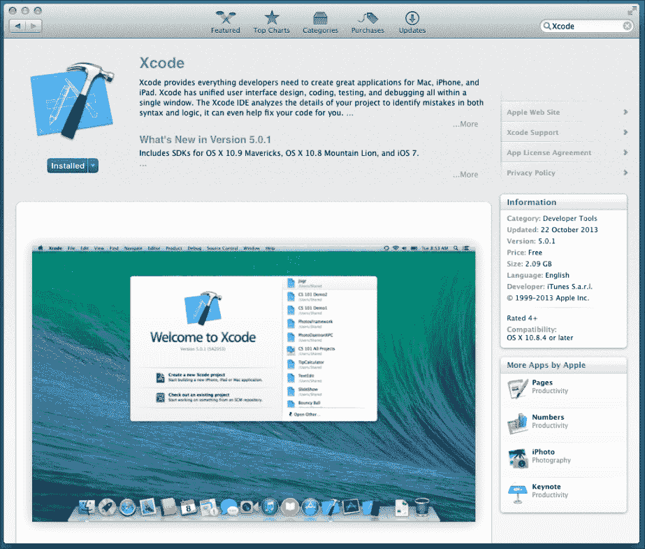

+   **Xamarin 入门版**: 从 Xamarin 网站 [`xamarin.com/download`](http://xamarin.com/download) 下载并运行 Xamarin 入门版。按照屏幕上的说明安装 Xamarin Studio 和 Xamarin.iOS。

    ### 注意

    Xamarin 入门版是免费的，但有一些限制，例如最大应用程序包大小的限制，并且没有 Visual Studio 支持。然而，它支持部署到设备和 App Store。在撰写本文时，本书中显示的所有配方都完全由入门版支持，除了第六章中的*使用 WCF 服务*配方，*Web 服务*。需要商业或企业版才能支持 WCF。

## 它是如何工作的...

现在我们已经准备好了，让我们看看每个组件需要什么。

### Xcode

Xcode 是苹果为 iOS 和 Mac 平台开发应用程序的 IDE。它针对 Objective-C 编程语言，这是使用 iOS SDK 进行编程的主要语言。由于 Xamarin.iOS 是 C#语言的 SDK，人们可能会问我们为什么需要它。除了提供各种调试 iOS 应用的工具外，Xcode 还为我们提供了**组织者**窗口。如以下截图所示，我们可以使用它来查看设备的控制台日志、安装和管理必要的配置文件，甚至查看设备的崩溃日志。要打开**组织者**窗口，请转到菜单栏上的**窗口** | **组织者**，或在键盘上按*Cmd* + *Shift* + *2*。

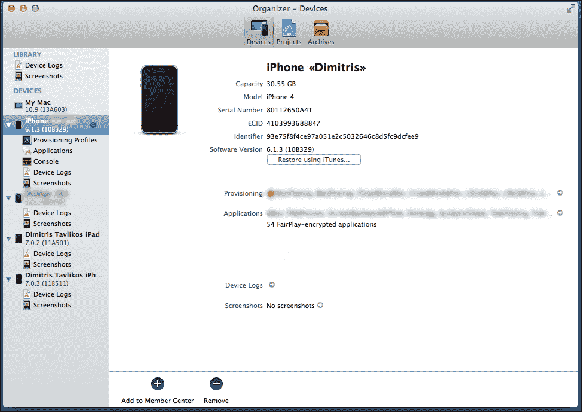

### 接口构建器

第二个组件是接口构建器。这是一个用户界面设计器，它以前是一个独立的应用程序。从 Xcode 4.0 开始，它被集成到 IDE 中。接口构建器提供了构建应用程序用户界面所需的所有必要功能。它也与.NET 开发者习惯的内容有很大不同。

### iOS 模拟器

第三部分是 iOS 模拟器。正如其名称所暗示的那样：一个设备模拟器，我们可以用它来运行我们的应用，而无需实际设备。iOS 模拟器最重要的特点是它可以选择模拟较旧的 iOS 版本（如果它们已安装在计算机上），包括 iPhone 和 iPad 界面以及设备方向。然而，模拟器缺少一些依赖于硬件的设备功能，例如指南针或加速度计。使用这些功能的应用程序必须在实际设备上进行测试和调试。

Xamarin.iOS 是允许.NET 开发者使用 C#编程语言为 iOS 开发应用程序的 SDK。所有对 Objective-C 开发者可用的 API 也通过 Xamarin.iOS 对 C#开发者可用。它不是一个具有自己 API 的独立框架，例如用户界面。Xamarin.iOS 程序员可以使用与 Objective-C 程序员相同的 UI 元素，同时还可以享受 C#带来的额外好处，如泛型、LINQ 以及使用 async/await 的异步编程。

## 还有更多...

使用 Xamarin.iOS 开发的应用程序与使用原生 Objective-C 编程语言开发的所有其他应用程序进入 App Store 的机会相同。这意味着如果一个应用不符合苹果对应用接受度的严格政策，它将失败，无论它是用 Objective-C 还是 C#编写的。Xamarin.iOS 团队在创建一个 SDK 方面做得很好，让开发者只需担心设计和代码的最佳实践，而无需担心其他任何事情。

### 有用链接

以下是一些有用的链接，您可以浏览：

+   **苹果 iOS 开发者门户**：[`developer.apple.com/devcenter/ios/index.action`](http://developer.apple.com/devcenter/ios/index.action)

+   **Xamarin.iOS**：[`xamarin.com/ios`](http://xamarin.com/ios)

+   **Xamarin Mac 安装指南**：[`docs.xamarin.com/guides/ios/getting_started/installation/mac/`](http://docs.xamarin.com/guides/ios/getting_started/installation/mac/)

+   **关于 Apple 开发者工具的信息**：[`developer.apple.com/technologies/tools/xcode.html`](http://developer.apple.com/technologies/tools/xcode.html)

### 更新

Xamarin Studio 有一个检查可用更新的功能。每次程序启动时，它都会检查 Xamarin.iOS 的更新。它可以关闭，但这样做不建议，因为它有助于保持与最新版本的同步。它可以在 **Xamarin Studio** | **检查更新** 下找到。

## 参见

+   *编译 iOS 项目* 和 *调试我们的应用程序* 菜谱

+   在第十四章 *部署* 的 *为 App Store 准备我们的应用* 菜谱中，第十四章

# 使用 Xamarin Studio 创建 iOS 项目

在这个菜谱中，我们将讨论如何使用 Xamarin Studio 创建我们的第一个 iOS 项目。

## 准备中...

现在我们已经安装了所有先决条件，我们将讨论如何使用 Xamarin Studio 创建我们的第一个 iOS 项目。

启动 Xamarin Studio。它可以在 `应用程序` 文件夹中找到。Xamarin Studio 的默认项目位置是 `/Users/{你的用户名}/Projects`。如果硬盘上不存在，则在创建我们的第一个项目时创建。如果您想更改文件夹，请从菜单栏选择 **Xamarin Studio** | **首选项**。在左侧面板中选择 **加载/保存**，在 **默认解决方案** **位置** 字段中输入项目首选位置，然后单击 **确定**。

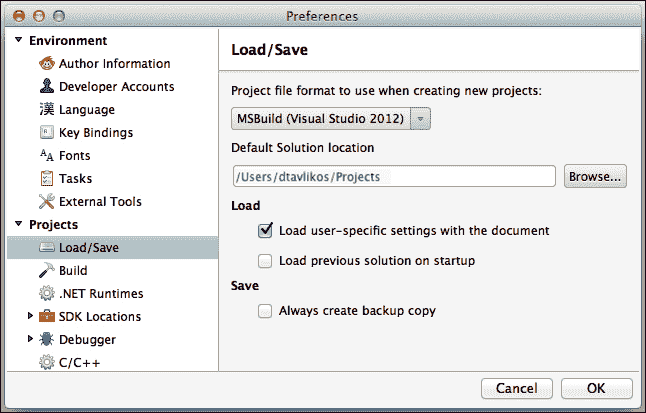

## 如何做...

当启动 Xamarin Studio 时，首先加载的是其起始页面。执行以下步骤以使用 Xamarin Studio 创建 iOS 项目：

1.  从菜单栏导航到 **文件** | **新建** | **解决方案...**。将出现一个窗口，提供给我们可用的项目选项。

1.  在此窗口左侧的面板中，转到 **C#** | **iOS** | **iPhone**。iPhone 项目模板将在中间面板中显示。

1.  选择 **单视图应用程序**。

1.  最后，输入 `MyFirstiOSProject` 作为 **解决方案名称** 并单击 **确定**。以下截图显示了 **新建解决方案** 窗口：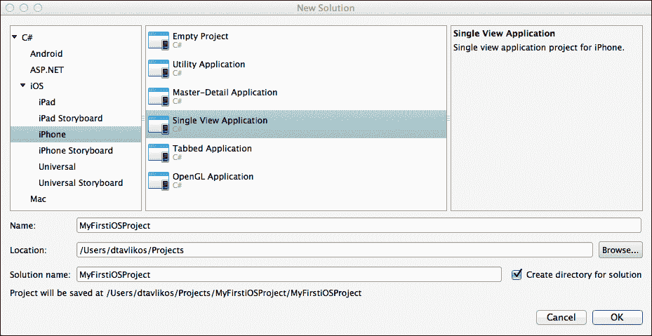

就这么简单。您已经创建了您的第一个 iPhone 项目。您可以构建并运行它；iOS 模拟器将启动，但屏幕仍然是空白浅灰色。

### 注意

项目模板可能与前面截图中的不同。

## 工作原理...

让我们看看幕后发生了什么。

当 Xamarin Studio 创建一个新的 iOS 项目时，它会创建一系列文件。解决方案文件可以在 Xamarin Studio 窗口左侧的 **解决方案** 面板中查看。如果 **解决方案** 面板不可见，可以通过从菜单栏选择 **视图** | **面板** | **解决方案** 来激活它。

下面的截图显示了构成 iPhone 项目的关键文件：

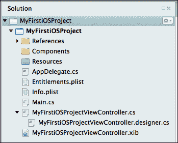

### MyFirstiOSProjectViewController.xib

`MyFirstiOSProjectViewController.xib` 是包含应用程序视图的文件。XIB 文件基本上是 Xcode 可以读取的具有特定结构的 XML 文件。这些文件包含有关用户界面的信息，例如它包含的控件类型、它们的属性和出口。

### 注意

如果双击 `MyFirstiPhoneProjectViewController.xib` 或任何具有 .xib 后缀的文件，Xamarin Studio 将自动在 Xcode 的 Interface Builder 中打开该文件。

当我们使用 Interface Builder 创建一个新的界面并保存时，它将以 XIB 格式保存。

### MyFirstiOSProjectViewController.cs

`MyFirstiOSProjectViewController.cs` 是实现视图功能的文件。以下是创建文件时的内容：

```swift
using System;
using System.Drawing;
using MonoTouch.Foundation;
using MonoTouch.UIKit;

namespace MyFirstiOSProject
{
    public class MyFirstiOSProjectViewController : UIViewController
    {
        public MyFirstiOSProjectViewController () : base ("MyFirstiOSProjectViewController", null)
        {
        }

        public override void DidReceiveMemoryWarning ()
        {
            // Releases the view if it doesn't have a superview.base.DidReceiveMemoryWarning ();

            // Release any cached data, images, etc that aren't in use.
        }

        public override void ViewDidLoad ()
        {
            base.ViewDidLoad ();

            // Perform any additional setup after loading the view, typically from a nib.
        }
}
}
```

### 注意

Xamarin.iOS 以前被称为 MonoTouch。为了确保代码兼容性，命名空间没有被重命名。

此文件中的代码包含与将要加载的视图相对应的类，以及一些默认方法，这些方法会被覆盖。这些是我们创建视图控制器时将更频繁使用的方法。以下是每个方法的简要描述：

+   **ViewDidLoad**：当控制器的视图加载时，会调用此方法。这是我们用来初始化任何附加组件的方法。

+   **DidReceiveMemoryWarning**：当应用程序收到内存警告时，会调用此方法。此方法负责释放当时不需要的资源。

### MyFirstiOSProjectViewController.designer.cs

`MyFirstiOSProjectViewController.designer.cs` 是一个文件，它以 C# 代码的形式保存了我们主窗口的类信息。Xamarin Studio 为项目中添加的每个 XIB 创建一个 `.designer.cs` 文件。每次我们通过 Interface Builder 保存 XIB 中的更改时，该文件都会自动生成。Xamarin Studio 会处理这些更改，以确保我们在界面中做出的更改能够立即反映在代码中。我们不得直接修改此文件，因为当相应的 XIB 通过 Interface Builder 保存时，这些更改将会丢失。此外，如果通过 Interface Builder 没有保存任何内容，并且手动修改了它，很可能会导致编译错误。

创建新项目时文件的内容如下：

```swift
//
// This file has been generated automatically by MonoDevelop to store outlets and
// actions made in the Xcode designer. If it is removed, they will be lost.
// Manual changes to this file may not be handled correctly.
//
using MonoTouch.Foundation;

namespace MyFirstiOSProject
{
    [Register ("MyFirstiOSProjectViewController")]
    partial class MyFirstiOSProjectViewController
    {
        void ReleaseDesignerOutlets ()
        {
        }
    }
}
```

### 小贴士

**下载示例代码**

您可以从您在 [`www.packtpub.com`](http://www.packtpub.com) 的账户中下载您购买的所有 Packt 书籍的示例代码文件。如果您在其他地方购买了这本书，您可以访问 [`www.packtpub.com/support`](http://www.packtpub.com/support) 并注册以将文件直接通过电子邮件发送给您。

此文件包含 `MyFirstiOSProjectViewController` 类的其他部分声明。它被 `Register` 属性装饰。

`Register` 属性用于将类暴露给底层 Objective-C 运行时。字符串参数声明我们的类将通过什么名称暴露给运行时。它可以是我们想要的任何名称，但始终将其设置为我们的 C# 类的名称是一个好习惯。该属性在 Xamarin.iOS 的内部使用得非常频繁，因为它将所有原生 `NSObject` 类与其 C# 对应项绑定在一起。

### 注意

`NSObject` 是一个根类或基类。它在 .NET 世界中相当于 `System.Object`。两者之间的唯一区别是，所有 .NET 对象都继承自 `System.Object`，但在 Objective-C 中，大多数而不是所有 Objective-C 对象都继承自 `NSObject`。所有从 `NSObject` 继承的本地对象的 C# 对应项也继承自其 Xamarin.iOS `NSObject` 对应项。

### AppDelegate.cs

`AppDelegate.cs` 文件包含 `AppDelegate` 类。文件的以下内容列出：

```swift
using System;
using System.Collections.Generic;
using System.Linq;
using MonoTouch.Foundation;
using MonoTouch.UIKit;

namespace MyFirstiOSProject
{
    // The UIApplicationDelegate for the application. This classis responsible for launching the
    // User Interface of the application, as well as listening(and optionally responding) to
    // application events from iOS.
    [Register ("AppDelegate")]
    public partial class AppDelegate : UIApplicationDelegate
    {
        // class-level declarations
        UIWindow window;
        MyFirstiOSProjectViewController viewController;
        //
        // This method is invoked when the application has loaded and is ready to run. In this
        // method you should instantiate the window, load the UI into it and then make the window
        // visible.
        //
        // You have 17 seconds to return from this method, or iOS will terminate your application.
        //
        public override bool FinishedLaunching (UIApplication app,NSDictionary options)
        {
            window = new UIWindow (UIScreen.MainScreen.Bounds);

            viewController = new MyFirstiOSProjectViewController ();
            window.RootViewController = viewController;
            window.MakeKeyAndVisible ();

            return true;
        }
    }
}
```

第一部分对 .NET 开发者来说很熟悉，包括适当的 `using` 指令，用于导入使用所需的命名空间。考虑以下代码：

```swift
using System;
using System.Collections.Generic;
using System.Linq;
using MonoTouch.Foundation;
using MonoTouch.UIKit;
```

前三个 `using` 指令允许我们使用 .NET 世界中特定且熟悉的命名空间，与 Xamarin.iOS 一起使用。

### 注意

`System`、`System.Collections.Generic`、`System.Linq`：尽管这三个命名空间提供的功能几乎与它们知名的 .NET 对应项相同，但它们包含在专门为与 Xamarin.iOS 一起使用而创建的程序集中，并且当然与它一起分发。使用 .NET 编译的程序集不能直接用于 Xamarin.iOS 项目。

`MonoTouch.Foundation` 命名空间是对原生 Objective-C Foundation 框架的包装，其中包含提供基本功能类的封装。这些对象的名称与在原生 Foundation 框架中找到的相同 NS 前缀相同。例如，`NSObject`、`NSString`、`NSValue` 等等。除了带有 NS 前缀的对象外，`MonoTouch.Foundation` 命名空间还包含用于绑定到原生对象的全部属性，例如我们之前看到的 `Outlet` 和 `Register` 属性。`MonoTouch.UIKit` 命名空间是对原生 Objective-C UIKit 框架的包装。正如其名称所暗示的，该命名空间包含提供界面功能的类、代理和事件。几乎所有对象的名称都共享相同的 UI 前缀。此时应该清楚，这两个命名空间对于所有 Xamarin.iOS 应用程序都是必不可少的，并且它们的对象将被频繁使用。

该类继承自 `UIApplicationDelegate` 类，使其成为我们应用程序的代理对象。

### 注意

Objective-C 世界中委托对象的概念与 C# 中的 `delegate` 有所不同。它将在第二章（Chapter 2，*用户界面 – 视图*）中详细解释。

`AppDelegate` 类包含两个字段和一个方法：

```swift
UIWindow window;MyFirstiOSProjectViewController viewController; 
//..
public override bool FinishedLaunching (UIApplication app, NSDictionary options) {
```

`UIWindow` 对象定义了我们应用程序的主窗口，而 `MyFirstiOSProjectViewController` 对象是用于保存应用程序视图控制器的变量。

### 注意

iOS 应用通常只有一个 `UIWindow` 类型的窗口。`UIWindow` 是应用程序启动时首先显示的控制项，后续的每个视图都按层次结构添加在其下方。

如其名称所示，`FinishedLaunching` 方法在应用程序完成初始化过程时被调用。这是我们向用户展示用户界面的方法。此方法的实现必须轻量级；如果它不能在调用后及时返回，iOS 将终止应用程序。这通过防止开发者在初始化时执行复杂和长时间运行的任务（例如连接到网络服务以接收数据）来为用户提供更快的用户界面加载时间。`app` 参数是应用程序的 `UIApplication` 对象，也可以通过 `static` 属性 `UIApplication.SharedApplication` 访问。`options` 参数可能包含有关应用程序启动方式的信息，但目前我们不需要它。

此类型项目的 `FinishedLaunching` 方法的默认实现如下：

+   `UIWindow` 对象使用屏幕大小初始化如下：

    ```swift
    window = new UIWindow (UIScreen.MainScreen.Bounds);
    ```

+   视图控制器初始化并设置为窗口的根视图控制器如下：

    ```swift
    viewController = new MyFirstiPhoneProjectViewController();
    window.RootViewController = viewController;
    window.MakeKeyAndVisible ();
    return true;
    ```

通过 `window.MakeKeyAndVisible()` 调用在屏幕上显示窗口，并返回方法。此方法必须在 `FinishedLaunching` 方法内部调用，否则应用程序的用户界面将不会按预期向用户展示。最后但同样重要的是，`return true` 行通过标记其执行完成来返回方法。

### Main.cs

在 `Main.cs` 文件内部，程序的运行时生命周期从以下代码开始：

```swift
namespace MyFirstiOSProject
{
    public class Application
    {
        // This is the main entry point of the application.
        static void Main (string[] args)
        {
            // if you want to use a different Application Delegate class from "AppDelegate"
            // you can specify it here.
            UIApplication.Main (args, null, "AppDelegate");
        }
    }
}
```

它与以下 .NET System.Windows.Forms 应用程序中的调用非常相似：

```swift
Application.Run(new Form1());
```

`UIApplication.Main` 方法启动消息循环或运行循环，该循环负责通过 `AppDelegate` 类的事件处理器将通知分发给应用程序。事件处理器如 `FinishedLaunching`、`ReceiveMemoryWarning` 或 `DidEnterBackground` 只是这些通知中的一些。除了通知分发机制外，`UIApplication` 对象还包含所有存在的 `UIWindow` 对象的列表，通常只有一个。iOS 应用必须有一个 `UIApplication` 对象，或者是从它继承的类，并且该对象必须有一个相应的 `UIApplicationDelegate` 对象。这就是我们之前看到的 `AppDelegate` 类实现。

### Info.plist

`Info.plist`文件基本上是应用程序的设置文件。它具有简单的属性值结构，定义了 iOS 应用程序的各种设置，例如它支持的朝向、图标、支持的 iOS 版本、它可以安装的设备等等。如果我们双击 Xamarin Studio 中的此文件，它将在专门为此文件设计的嵌入式编辑器中打开。新项目中的文件如下截图所示：

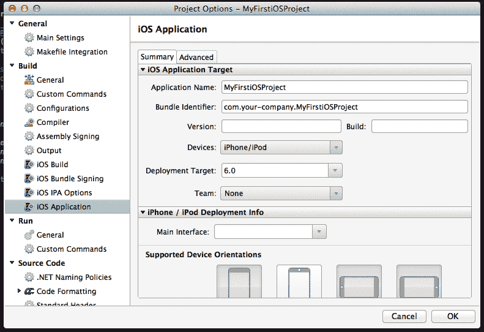

我们还可以通过**iOS 应用程序**下的项目选项窗口访问`Info.plist`。

## 更多内容...

Xamarin Studio 为开发 iOS 应用程序提供了许多不同的项目模板。以下是一个列表，描述了每个项目模板的用途：

+   **空项目**：这是一个没有任何视图的空项目。

+   **实用应用程序**：这是一种特殊的 iOS 应用程序，提供一屏功能，在许多情况下，还提供另一屏进行配置。

+   **主从应用程序**：这种类型的项目创建了一个支持通过多个屏幕导航的模板。它包含两个视图控制器。

+   **单视图应用程序**：这种模板类型是我们在这个配方中使用的。

+   **标签页应用程序**：这是一个添加标签栏控制器并管理类似标签界面的两个视图控制器的模板。

+   **OpenGL 应用程序**：这是一个用于创建 OpenGL 应用程序或游戏的模板。

这些模板适用于 iPhone、iPad 和通用（iPhone 和 iPad）项目。它们也适用于 Interface Builder 的故事板应用设计。

### 注意

除非另有说明，所有针对 iPhone 的项目模板也适用于 iPod Touch。

### Xamarin.iOS 组件列表

Xamarin.iOS 支持的组件可以在[`ios.xamarin.com/Documentation/Assemblies`](http://ios.xamarin.com/Documentation/Assemblies)找到。

## 参见

+   *创建 UI*和*通过 Outlets 访问 UI*的配方

+   第二章中的*添加和自定义视图*配方，*用户界面 – 视图*

# Interface Builder

在这个配方中，我们将查看 Xcode 的 Interface Builder。由于我们无法使用 Xcode 编写代码，Xamarin Studio 提供了一个透明的方式来与 Xcode 进行用户界面文件的通信。

## 如何操作...

让我们通过以下步骤查看 Interface Builder：

1.  如果你已经安装了 iOS SDK，那么你的电脑上已经安装了带有 Interface Builder 的 Xcode。前往 Xamarin Studio 并打开我们之前创建的项目`MyFirstiOSProject`。

1.  在左侧的**解决方案**面板中双击**MyFirstiOSProjectViewController.xib**。Xamarin Studio 将启动 Xcode 并在 Interface Builder 中加载文件。

1.  在 Xcode 窗口的右上角工具栏中，选择适当的编辑器和查看选项，如下面的截图所示：

1.  以下截图展示了打开 XIB 文件时的接口构建器外观：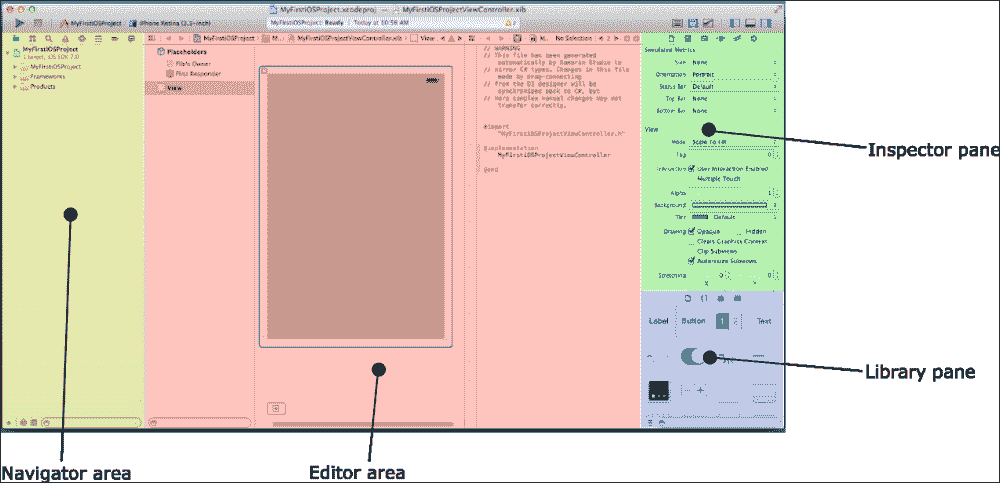

## 它是如何工作的...

现在我们已经用我们的应用程序视图控制器加载了接口构建器，让我们熟悉一下它。

用户界面设计师直接连接到 Xcode 项目。当我们添加一个对象时，Xcode 会自动生成代码以反映我们所做的更改。Xamarin Studio 会为我们处理这些，因此当我们双击 XIB 文件时，它会自动创建一个临时 Xcode 项目。这使我们能够对用户界面进行我们想要的更改。因此，我们只需为我们的应用程序设计用户界面即可。

接口构建器分为三个区域。以下是每个区域的简要描述：

+   **导航区域**：在这个区域，我们可以看到 Xcode 项目中的文件。

+   **编辑区域**：这个区域是我们设计用户界面的地方。编辑区域分为两个部分。左边的是设计师，右边的是辅助编辑器。在辅助编辑器内部，我们可以看到与设计师中选定的项目对应的底层 Objective-C 源代码文件。尽管我们不需要编辑 Objective-C 源代码，但稍后我们还需要辅助编辑器。

+   **实用区域**：这个区域包含检查器和库窗格。检查器窗格是我们配置每个对象的地方，库窗格是我们查找对象的地方。

## 还有更多...

我们在接口构建器中看到了 XIB 文件的外观，但关于这些文件还有更多内容。我们之前提到，XIB 文件是 Interface Builder 可以读取的 XML 文件，其中包含适当的信息。问题是，当项目中进行编译时，编译器会将 XIB 文件编译成其二进制等效文件，即 NIB 文件。XIB 和 NIB 文件包含相同的信息。它们之间的唯一区别是，XIB 文件以人类可读的形式存在，而 NIB 文件则不是。例如，当我们编译我们创建的项目时，`MyFirstiOSProjectViewController.xib`文件将在输出文件夹中变为`MyFirstiOSProjectViewController.nib`。除了二进制转换之外，编译器还会对 NIB 文件进行压缩。因此，NIB 文件的大小将比 XIB 文件小得多。

关于 XIB 文件，还有更多内容。我们之前提到，XIB 文件是 Interface Builder 可以读取的 XML 文件，其中包含适当的信息。问题是，当项目中进行编译时，编译器会将 XIB 文件编译成其二进制等效文件，即 NIB 文件。XIB 和 NIB 文件包含相同的信息。它们之间的唯一区别是，XIB 文件以人类可读的形式存在，而 NIB 文件则不是。例如，当我们编译我们创建的项目时，`MyFirstiOSProjectViewController.xib`文件将在输出文件夹中变为`MyFirstiOSProjectViewController.nib`。除了二进制转换之外，编译器还会对 NIB 文件进行压缩。因此，NIB 文件的大小将比 XIB 文件小得多。

当应用程序启动时，iOS 会将 NIB 文件作为一个整体加载到内存中，并且其中的所有对象都会被实例化。因此，保留在 NIB 文件中不总是会被使用的对象是浪费内存的。此外，请记住，你正在为移动设备开发，其可用资源与桌面计算机的资源无法匹敌，无论其功能如何。

自 iOS 5 开始，苹果引入了故事板功能，该功能简化了用户界面设计。

### 更多信息

你可能已经注意到，在**检查器**面板的**属性**选项卡中，有一个名为**模拟度量**的部分。该部分下的选项帮助我们直接在设计师区域看到我们的界面在设备状态栏、工具栏或导航栏下的样子。尽管这些选项保存在 XIB 文件中，但它们与实际运行时的应用程序无关。例如，如果我们将**状态栏**选项设置为**无**，并不意味着我们的应用程序将没有状态栏启动。

### 注意

状态栏是显示在设备屏幕顶部的一部分，它向用户显示某些信息，例如当前时间、电池状态和 iPhone 上的运营商名称。

## 相关内容

+   *创建 UI*、*使用连接访问 UI*和*向控件添加动作*的配方

+   第二章（ch02.html "第二章。用户界面 – 视图"）中的*添加和自定义视图*配方，*用户界面 – 视图*

+   第三章（ch03.html "第三章。用户界面 – 视图控制器"）中的*使用视图控制器加载视图*配方，*用户界面 – 视图控制器*

# 创建 UI

在这个配方中，我们将学习如何在用户界面中添加和管理控件。

## 准备工作

让我们在界面中添加一些控件。首先，在 Xamarin Studio 中创建一个新的 iPhone 单视图应用程序项目，并将其命名为`ButtonInput`。当它打开时，双击**ButtonInputViewController.xib**在**解决方案**面板中，以 Interface Builder 打开它。

## 如何实现...

现在我们有一个新项目，并且 Interface Builder 已经打开了`ButtonInputViewController.xib`文件，我们将向其中添加一些控件。

### 添加标签

执行以下步骤：

1.  如果尚未选择，请转到**库**面板并从下拉列表中选择**对象**。

1.  选择**标签**对象。将**标签**拖放到设计师中视图的灰色区域，位于上半部分。

1.  从左侧和右侧选择并调整**标签**对象的大小，使其与当接近视图边缘时出现的虚线对齐。

1.  再次，当**标签**对象被选中时，转到**检查器**面板，选择**属性**选项卡，然后在**布局**部分单击中间对齐按钮。

恭喜你，你已经在应用程序的主视图中添加了**标签**！

### 添加按钮

我们将执行类似的步骤在我们的界面中添加按钮，使用以下步骤：

1.  再次，在**库**面板中，在**对象**部分，选择**按钮**对象。它位于**标签**对象旁边。将其拖放到视图的下半部分。将其中心与之前添加的**标签**的中心对齐。

1.  当两个控件的中心几乎对齐时，会出现一条虚线，**按钮**对象会自动吸附到它上面。

1.  将**按钮**对象调整到与**标签**相同的宽度。由于**标签**具有透明背景，您无法确切地看到它的宽度，当您调整大小时会显示三条虚线，这时您就会知道**按钮**对象具有相同的宽度。

1.  现在，让我们向**按钮**添加一些文本。选择它并转到**检查器**面板。

1.  在**标题**字段的**属性**选项卡中，输入`请在此处点击！`。

1.  在添加按钮后，通过在菜单栏中导航到**文件** | **保存**来保存文档。主视图现在应该看起来像以下截图所示：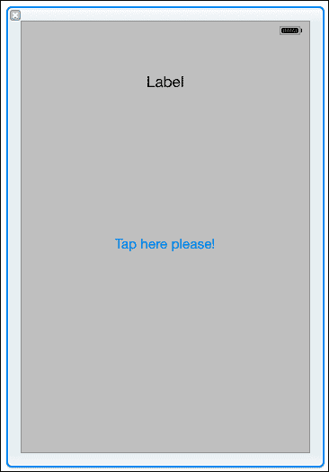

## 它是如何工作的...

如您所见，尽管 Interface Builder 的一些概念似乎很难，但它使用起来相当简单。它还提供了大量的反馈。当我们拖动对象时，会出现基本作为正确定位控件的对齐点的指南。此外，当我们调整控件大小时，我们会在其旁边看到其尺寸。

您还可以通过修改**检查器**面板中**大小**选项卡中的值来调整控件的大小和位置。**大小**选项卡中的另一个有用功能是**自动调整大小**。**自动调整大小**为控件提供布局选项，当我们要使我们的应用支持不同的设备方向时，它非常有用。您可以选择一个控件，然后点击**自动调整大小**部分中左边的方框外部或内部的线条。旁边的图像会动画显示，给您一个印象，当布局改变时控件将如何表现。

## 还有更多...

现在，让我们尝试在 iOS 模拟器上运行应用。回到 Xamarin Studio，如果尚未选择，请选择项目配置**调试**。根据您安装的 iOS SDK 版本，以下截图显示了可用的调试目标选项：

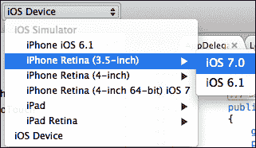

选择您喜欢的目标并点击**运行**按钮。当编译完成后，iOS 模拟器将自动启动并运行我们刚刚创建的应用。您甚至可以用鼠标点击**按钮**，并看到它做出响应。当然，我们的应用目前还没有其他功能。

### 设置按钮的标题

设置按钮或标签的标题可以通过简单地双击它并输入首选标题来完成。这样做，并观察 Interface Builder 如何响应以显示要执行的操作。

## 相关内容

+   *编译 iOS 项目*和*调试我们的应用*配方

+   第二章中的 *使用按钮接收用户输入* 菜单，*用户界面 – 视图*

# 使用出口访问 UI

在本菜谱中，我们将讨论出口的概念及其在 Xamarin.iOS 中的使用。

## 准备工作

在前面的菜谱中，我们学习了如何添加控件来形成我们应用的基本界面。在本菜谱中，我们将讨论如何在代码中访问和使用这些控件。启动 Xamarin Studio 并打开我们之前创建的`ButtonInput`项目。通过在**解决方案**面板中双击它来在 Interface Builder 中打开项目的`ButtonInputViewController.xib`。

## 如何操作...

执行以下步骤以使用出口访问 UI：

1.  在辅助编辑器中，选择`ButtonInputViewController.h`文件，按*Ctrl*键，并将其从**标签**拖动到 Objective-C 源文件中，如图所示：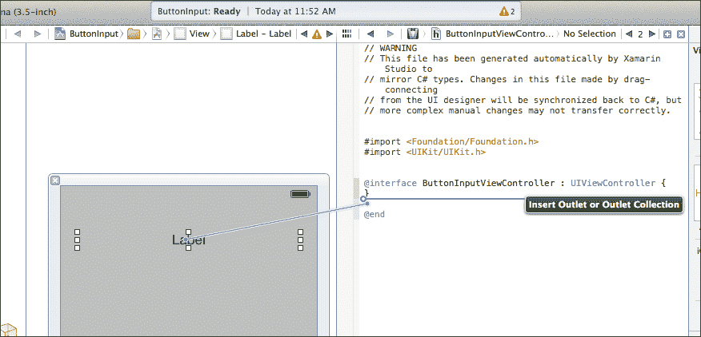

1.  当你释放光标时，会出现一个上下文窗口，类似于以下截图所示：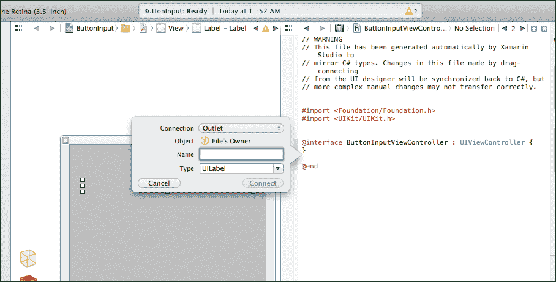

1.  在上下文窗口的**名称**字段中输入`labelStatus`，然后点击**连接**。

1.  对于**按钮**也做同样的操作，并将其命名为`buttonTap`。通过在菜单栏中导航到**文件** | **保存**或按键盘上的*Cmd* + *S*来保存 Interface Builder 文档。

1.  在 Xamarin Studio 中，在`ButtonInputViewController`类的`ViewDidLoad`方法中输入以下代码：

    ```swift
    // Create and hook a handler to our button's TouchUpInside event
    // through its outlet
    this.buttonTap.TouchUpInside += delegate(object sender, EventArgs e) {
      this.labelStatus.Text = "Button tapped!";
    };
    ```

    这段代码片段为按钮的`TouchUpInside`事件添加了一个处理程序。这个事件类似于`System.Windows.Forms`中`Button`控制的`Clicked`事件。它还展示了匿名方法的使用，这显示了 Xamarin.iOS 如何为.NET 开发者提供 C#功能。

就这样！我们的应用现在已经准备好了具有功能控件。在模拟器上编译并运行它。当你点击按钮时，你会看到标签文本的变化。

## 它是如何工作的...

出口机制基本上是一种将 Interface Builder 对象与代码连接起来的方法。这是必要的，因为这是我们访问使用 Interface Builder 创建的用户界面对象的唯一方式。这就是 Interface Builder 的工作原理，它不仅仅是一个 Xamarin.iOS 的解决方案。一个对象的出口提供了一个变量，这样我们就可以在项目中使用它。Xamarin.iOS 使开发者的生活变得更加容易，因为当我们创建 Interface Builder 中的出口并将它们连接起来时，Xamarin Studio 会在后台自动生成与这些出口相关的代码。这就是`ButtonInputViewController.designer.cs`文件添加的内容，为我们提供了访问我们创建的控件的方法：

```swift
[Outlet]
MonoTouch.UIKit.UILabel labelStatus { get; set; }

[Outlet]
MonoTouch.UIKit.UIButton buttonTap { get; set; }
```

这些属性为我们提供了访问控件的方法。它们被`Outlet`属性装饰。您可以看到属性名称与我们为出口输入的名称完全相同。这非常重要，因为我们只需要为出口提供一次名称，我们不必担心在代码的不同部分重复相同的命名约定。此外，请注意，控件变量的类型与我们在用户界面中拖放的控制类型完全相同。这些信息存储在 XIB 文件中，Xamarin Studio 相应地读取这些信息。

## 还有更多...

要删除出口，您首先必须断开它们。例如，要删除`buttonTap`出口，请按*Ctrl*并单击按钮。在出现的面板中，单击出口旁边的**x**按钮，如图下所示。这将断开出口。

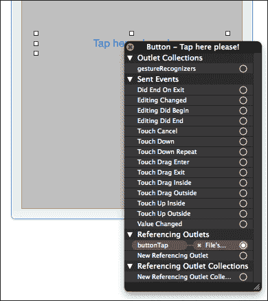

在此之后，从 Objective-C 源文件中删除以下代码：

```swift
@property (retain, nonatomic) IBOutlet UIButton *buttonTap;
```

当您保存文档时，出口将从 Xamarin Studio 项目中删除。

### 通过代码添加出口

添加出口的另一种方法是创建一个 C#类中的属性，并用`Outlet`属性装饰它：

```swift
[Outlet]
UIButton ButtonTap { get;	set; }
```

当您在界面构建器中打开 XIB 文件时，出口将被添加到用户界面中。然而，您仍然需要将其连接到相应的控件。最简单的方法是按*Ctrl*，单击出口对应的控件，然后从**新引用出口**拖动到设计区域左侧的**文件所有者**对象，如图下所示：

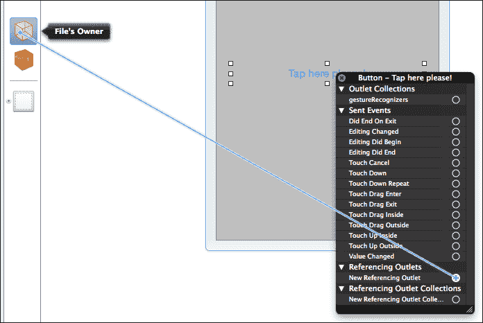

当您释放鼠标时，从出现的迷你上下文菜单中选择**ButtonTap**出口。

### 注意

注意，是 Xamarin Studio 监视在界面构建器中做出的更改，而不是相反。当在 Xamarin 项目中做出更改时，请确保始终从 Xamarin Studio 打开 XIB 文件。

## 参见

+   *界面构建器*、*创建用户界面*和*向控件添加动作*的食谱

+   在第二章*用户界面 – 视图*中的*添加和自定义视图*食谱，*用户界面 – 视图*

# 向控件添加动作

在这个食谱中，我们讨论了动作的概念及其与 Xamarin.iOS 的用法。

## 准备工作

在这个食谱中，我们将讨论如何使用动作与用户界面的控件。

1.  在 Xamarin Studio 中创建一个新的 iPhone 单视图应用程序项目，并将其命名为`ButtonInputAction`。

1.  在界面构建器中打开`ButtonInputActionViewController.xib`，并添加与之前食谱中`ButtonInput`项目相同的控件、出口和连接。现在不要在项目中添加任何代码。

## 如何做...

向界面对象添加动作与添加出口类似，如下所示：

1.  在 Interface Builder 中，按*Ctrl*并从按钮拖动到源代码文件。

1.  在将显示的上下文窗口中，将**连接**字段从**Outlets**更改为**Action**。

1.  在**名称**字段中输入`OnButtonTap`，如果尚未选择，请选择**触摸内部**。

1.  点击**连接**按钮并保存文档。

1.  在`ButtonInputActionViewController`类中，添加以下方法：

    ```swift
    partial void OnButtonTap(NSObject sender)
    {

      this.labelStatus.Text = "Button tapped!";

    }
    ```

应用程序已经准备好了！在模拟器中编译并运行它。点击按钮，您会看到标签中的文本改变，就像我们在上一个应用程序中创建的那样。

## 它是如何工作的...

Objective-C 中的动作相当于 C#中的控制事件。它们负责传递各种对象的信号通知。在这个例子中，我们不是在按钮的`TouchUpInside`事件上连接一个处理程序，而是为它添加了一个动作。如您可能已经注意到的，我们添加的作为动作处理程序的方法被声明为`partial`；这是因为 Xamarin Studio 已经为我们声明了一个部分方法声明。这是我们在 Interface Builder 中保存文档时产生的代码：

```swift
[Action ("OnButtonTap:")]
partial void OnButtonTap (MonoTouch.Foundation.NSObject sender);
```

方法的部分声明被标记为`Action`属性。这是来自`MonoTouch.Foundation`命名空间的一个属性，它允许我们将方法暴露为 Objective-C 动作。您可以看到，传递给属性的字符串参数与我们输入到 Interface Builder 中的动作名称完全相同，只是在后面加了一个冒号（:）。

### 注意

Objective-C 中的冒号表示参数的存在。例如，`doSomething`与`doSomething;`不同。区别在于第一个不接受任何参数，而第二个接受一个参数。

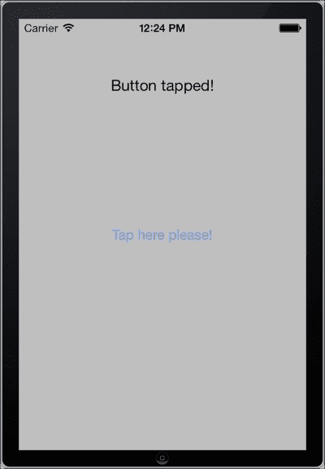

动作名称末尾的冒号表示有一个参数，在这种情况下，参数是`MonoTouch.Foundation.NSObject`发送者。这就是我们在模拟器中点击按钮时我们的应用程序看起来像什么：

## 更多...

上一节中的示例只是为了展示如何在 Xamarin.iOS 项目中实现动作。用动作替换事件基本上是开发者的决定。

## 参见

+   *Interface Builder*、*创建 UI*和*使用 Outlets 访问 UI*菜谱

# 编译 iOS 项目

在这个菜谱中，我们将讨论如何使用 Xamarin.iOS 编译一个项目。

## 准备工作

Xamarin Studio 提供了许多不同的编译选项。在这个菜谱中，我们将讨论这些选项。我们将使用本章中较早创建的`ButtonInput`项目。

## 如何做到这一点...

执行以下步骤以使用 Xamarin.iOS 编译 iOS 项目：

1.  在 Xamarin Studio 中加载项目后，转到**项目** | **按钮输入选项**。

1.  在出现的窗口中，从左侧面板的**构建**部分选择**iOS 构建**。选择项目配置为**调试**，平台为**iPhoneSimulator**。

1.  在**链接器行为**字段中，从组合框中选择**链接所有程序集**。

1.  在**SDK 版本**字段中，如果尚未选择，请选择**默认**。

1.  现在转到左侧面板上的**iOS 应用**。

1.  在**摘要**选项卡中，在**应用程序名称**字段中输入`Button Input`，在**版本**字段中输入`1.0`。在**部署目标**组合框中选择版本**6.0**。以下截图显示了**iOS 应用**选项窗口：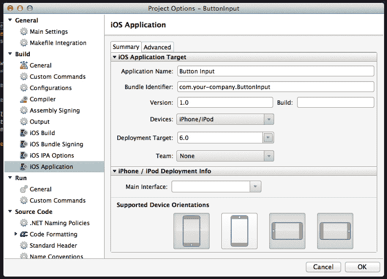

1.  点击**确定**按钮，通过菜单栏中的**构建** | **构建所有**导航来编译项目。

## 它是如何工作的...

我们为我们的项目设置了一些选项。让我们看看这些选项为编译定制提供了什么：

### iOS 构建选项

我们设置的第一项与**链接器**相关。链接器是由 Xamarin.iOS 团队开发的工具，并在 SDK 中提供。每次编译 Xamarin.iOS 项目时，编译器不仅编译项目，还需要 Xamarin.iOS 框架的所有程序集，以便最终应用能够在设备（或模拟器）上运行。这实际上意味着每个应用都附带其自己的 Xamarin.iOS 框架编译版本。最终的应用程序包大小相当大。这就是链接器的作用所在。它所做的就是删除所有未使用的代码的程序集，以便编译器只编译应用所需和使用的代码。这导致应用程序包的大小大大减小，这在移动应用中是一个宝贵的资产。以下是一些链接器选项：

+   **不链接**：当在模拟器上调试时使用此选项。链接器被关闭，所有程序集都按原样编译。这提供了更快的编译时间。

+   **仅链接 SDK 程序集**：链接器仅删除 Xamarin.iOS 框架的程序集。项目程序集保持完整。它有效地减少了最终应用的大小。

+   **链接所有程序集**：链接器在所有程序集上被激活。这会进一步减少大小。如果代码中使用了反射或序列化，使用此选项时需要小心。代码中通过反射使用的类型和方法对链接器来说是透明的。如果代码中存在这种情况，请使用`Preserve`属性装饰这些类型或方法。此属性基本上是通知链接器不要参与精简过程。

在**SDK 版本**字段中，我们设置将用于编译应用的 iOS SDK 版本。将其设置为**默认**将自动选择系统上安装的最高 SDK 版本。

### 注意

在为模拟器编译时，不建议开启链接器。这是因为编译器没有在 iPhoneSimulator 平台上编译 Xamarin.iOS 程序集，因此它们被直接使用。开启链接器只会导致编译完成所需的时间更长，对最终应用程序包的大小没有影响。

### iOS 应用程序选项

在项目选项中**构建**部分的**iOS 应用程序**窗口中，我们设置了三个选项：

+   第一个选项是**应用程序名称**。这是将在模拟器、设备和 App Store 上显示的应用程序包的名称。正如我们所看到的，我们通常可以在名称中添加空格。

+   第二个选项，**版本**，定义了应用程序的版本。当应用程序最终通过 App Store 分发时，它将显示为应用程序的版本。

+   第三个选项，**部署目标**，是应用程序可以安装的最小 iOS 版本。

## 还有更多...

还有两个选项窗口。这些是**iOS 包签名**和**iOS IPA 选项**。它们将在第十四章的食谱中详细讨论，*部署*。

## 参见

+   第十四章（*部署*）中第十四章. 部署的*为 App Store 准备我们的应用程序*食谱

# 调试我们的应用程序

本食谱提供了在模拟器上调试 Xamarin.iOS 应用程序的信息。

## 准备工作

Xamarin.iOS 与 Xamarin Studio 结合，提供用于在模拟器或设备上调试应用程序的调试器。在本食谱中，我们将了解如何使用调试器调试 Xamarin.iOS 应用程序。打开 Xamarin Studio 并加载`ButtonInput`项目。确保将项目配置设置为**调试** | **iPhone**。

## 如何操作...

执行以下步骤以调试您的应用程序：

1.  Xamarin Studio 支持断点。要激活一行上的断点，请点击行号左侧的空间来设置它。在`ButtonInputViewController.cs`文件中的以下行设置断点：

    ```swift
    this.labelStatus.Text = "Button tapped!";
    ```

    以下截图显示了 Xamarin Studio 中的断点外观：

    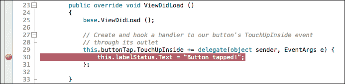

1.  通过点击**运行**按钮或通过菜单栏导航到**运行** | **开始调试**来编译和调试项目。Xamarin Studio 的状态将显示消息**等待调试器连接…**。

1.  当模拟器打开并加载应用程序时，请关注**应用程序输出**面板中提供的信息。

1.  点击应用程序按钮。执行将暂停，Xamarin Studio 将以黄色突出显示断点。将鼠标移至断点行中的`labelStatus`变量上。将显示一个窗口，其中包含所有已评估变量的成员，如下面的截图所示：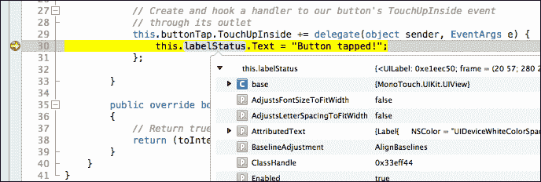

1.  要停止调试，请点击工具栏中的**停止**按钮。

## 工作原理...

所使用的调试器被称为**软调试器**。之所以称为“软调试器”，是因为它依赖于运行时和 Xamarin Studio，两者结合提供统一的调试平台。当调试过程开始时，Xamarin Studio 开始监听来自应用调试信息。在模拟器和设备上调试也是如此。当应用执行时，它开始将信息发送回 Xamarin Studio。然后，它在**应用程序输出**面板中显示这些信息，该面板会自动激活。调试时的典型应用程序输出包括已加载的程序集信息、开始执行的所有线程，以及如果有，可用的断点。

## 还有更多...

`Console.WriteLine()`方法也可以用于调试目的。调试器会处理这个问题，并将方法的输出重定向到 Xamarin Studio 的**应用程序输出**面板。

### 调试时的应用性能

当编译用于调试目的时，编译器会产生更大、更慢的代码。这是因为它生成了提供适当调试信息所需的额外代码。这就是为什么在调试应用时，应用的执行速度比简单运行情况慢得多。在生成应用的发布副本之前，请记住使用**发布** | **iPhone**项目配置来编译它，以避免运行时执行缓慢。

### `FinishedLaunching`中的断点

不在`FinishedLaunching`方法中编写复杂代码的另一个原因是，在大多数情况下，你将无法对其进行调试。如果你在`FinishedLaunching`中设置断点，应用执行将暂停，但当时间限制达到时，iOS 将终止应用。

## 参见

+   在第十四章“部署”中的*创建配置文件*配方
