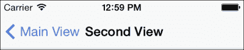
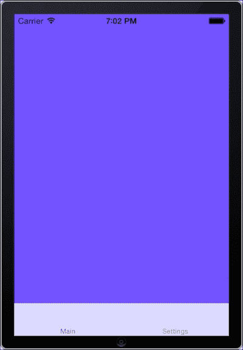
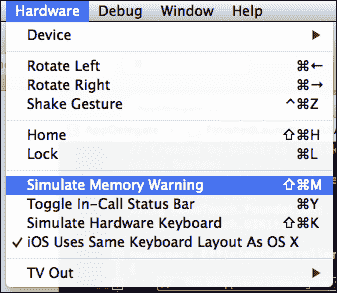
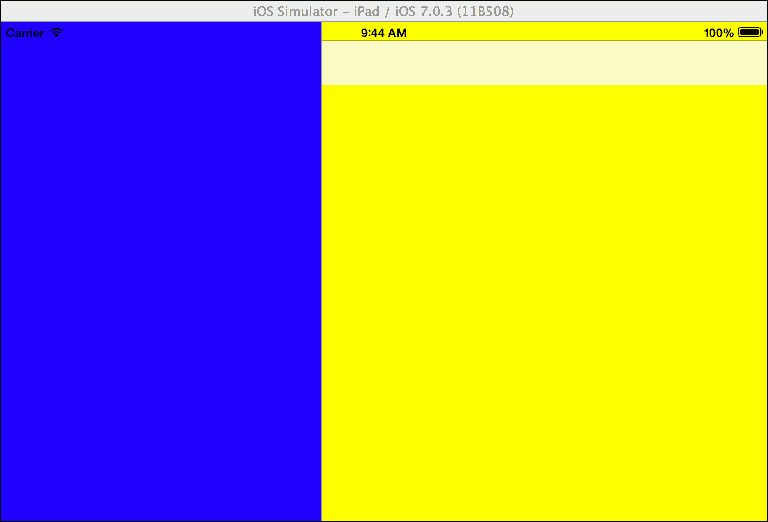
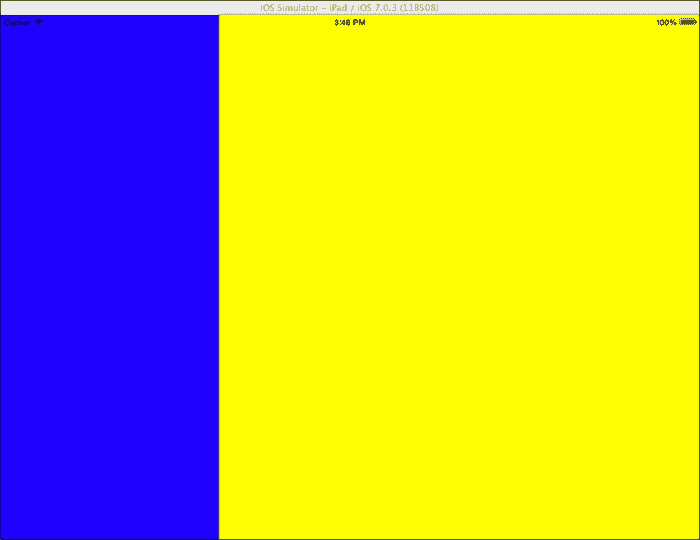
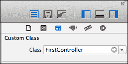
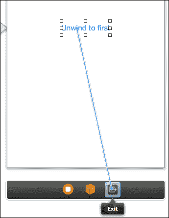
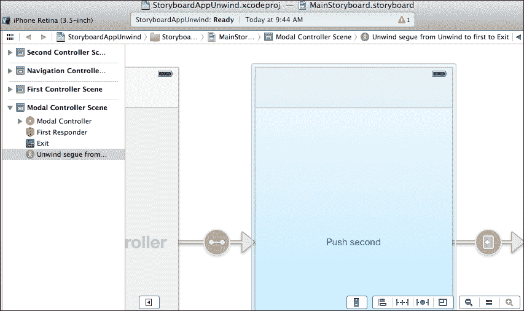

# 第三章. 用户界面 – 视图控制器

在本章中，我们将涵盖以下食谱：

+   使用视图控制器加载视图

+   在不同的视图控制器之间导航

+   在标签页中提供控制器

+   模态视图控制器

+   创建自定义视图控制器

+   高效使用视图控制器

+   iPad 视图控制器

+   使用故事板进行 UI 流程设计

+   在故事板中回滚

# 简介

到目前为止，我们已经讨论了视图及其使用方法。在大多数现实世界的应用程序场景中，仅使用视图是不够的。Apple 提供了一个另一个基类，即`UIViewController`类，它负责管理视图。视图控制器可以响应设备通知，例如当设备旋转时，或者可以提供不同的方式来显示和关闭多个视图，甚至其他视图控制器。有许多视图控制器可供我们使用。在本章中，我们将讨论其中最重要的。

这些视图控制器如下：

+   **UIViewController**：这是所有视图控制器的基类。

+   **UINavigationController**：这是一个提供多种在不同视图控制器之间导航方式的视图控制器。

+   **UITabBarController**：这是一个在类似标签的界面中显示多个视图控制器的视图控制器。

+   **针对 iPad 的视图控制器**：这些是仅适用于 iPad 设备的视图控制器。

此外，我们将学习如何创建我们自己的自定义视图控制器，并且我们将创建一个用户界面使用故事板文件创建的应用程序。

# 使用视图控制器加载视图

在这个食谱中，我们将学习如何使用`UIViewController`类来管理视图。

## 准备工作

在 Xamarin Studio 中创建一个新的 iPhone **空项目**，命名为`ViewControllerApp`。

## 如何操作...

执行以下步骤以使用视图控制器加载视图：

1.  向项目中添加一个新文件。

1.  右键单击**解决方案**面板中的项目，然后转到**添加** | **新建文件…**。

1.  在出现的对话框中，从**iOS**部分选择**iPhone 视图控制器**。命名为`MainViewController`并点击**新建**按钮。Xamarin Studio 将创建一个新的 XIB 文件，并自动打开`MainViewController.cs`源文件。此文件包含一个覆盖`UIViewController`类的类，我们可以在其中实现与我们的视图控制器相关的任何代码。

1.  在 Interface Builder 中打开`MainViewController.xib`文件。

1.  在视图中添加`UILabel`。

1.  在`MainViewController`类中为其创建并连接一个输出，命名为`myLabel`。

1.  在标签中输入文本`View in controller!`。

1.  保存 XIB 文档。

1.  在 Xamarin Studio 中，在`AppDelegate`类的`FinishedLaunching`方法中，在窗口初始化行之后输入以下代码：

    ```swift
    MainViewController mainController = new MainViewController ();
    window.RootViewController = mainController;
    ```

1.  在模拟器上编译并运行应用程序。

## 如何工作...

当我们在项目中添加一个新的 `iPhone 视图控制器` 文件时，在这种情况下是 `MainViewController`，Xamarin Studio 基本上会创建并添加以下三个文件：

+   `MainViewController.xib`: 这是一个包含控制器的 XIB 文件。

+   `MainViewController.cs`: 这是一个实现我们控制器类的 C# 源文件。

+   `MainViewController.designer.cs`: 这是一个自动生成的源文件，它反映了我们在 Interface Builder 中对控制器所做的更改。

注意，我们不需要为视图添加出口，因为这是由 Xamarin Studio 处理的。我们通过其类初始化控制器，如下所示：

```swift
MainViewController mainController = new MainViewController ();
```

然后，我们将控制器分配给 `window.RootViewController` 属性，如下所示：

```swift
window.RootViewController = mainController.
```

我们的观点控制器现在是应用程序窗口的根视图控制器，并且是应用程序启动时首先显示的一个。

## 更多内容...

我们刚刚创建的项目仅展示了我们如何添加具有视图的控制器。注意，我们在 `MainViewController` 类内部创建了标签的出口，该类在 XIB 文件中充当文件的所有者对象。为了为 `MainViewController` 类提供一些功能，在 `MainViewController.cs` 文件中的 `MainViewController` 类中添加以下方法：

```swift
public override void ViewDidLoad ()
{
  this.myLabel.Text = "View loaded!";
}
```

此方法重写了 `UIViewController.ViewDidLoad()` 方法，该方法在控制器加载其视图之后执行。

### 需要重写的 UIViewController 方法

`UIViewController` 类包含许多方法，允许我们管理视图控制器的生命周期。这些方法由系统在视图控制器上调用，我们可以重写它们以添加自己的实现。以下是一些这些方法：

+   `ViewWillAppear`: 当控制器的视图即将出现时，将调用此方法。

+   `ViewDidAppear`: 当控制器的视图已被显示时，将调用此方法。

+   `ViewWillDisappear`: 当控制器的视图即将消失时，将调用此方法，例如，当另一个控制器将被显示时。

+   `ViewDidDisappear`: 当视图消失时，将调用此方法。

## 相关内容

+   *在不同的视图控制器之间导航* 的配方

+   从 第一章 的 *使用 Xamarin Studio 创建 iOS 项目* 和 *使用出口访问 UI* 配方，*开发工具*

# 在不同的视图控制器之间导航

在这个配方中，我们将学习如何使用 `UINavigationController` 类在多个视图控制器之间进行导航。

## 准备工作

`UINavigationController` 类是一个提供具有多个视图控制器的分层导航功能的控制器。在 Xamarin Studio 中创建一个新的 iPhone **空项目**，并将其命名为 `NavigationControllerApp`。

## 如何操作...

执行以下步骤以在多个视图控制器之间创建导航：

1.  在项目中添加三个新的 iPhone 视图控制器，并分别命名为 `MainController`、`ViewController1` 和 `ViewController2`。

1.  打开 `AppDelegate.cs` 文件，并在 `FinishedLaunching` 方法中添加以下代码：

    ```swift
    MainController mainController = new MainController();
    mainController.Title = "Main View";
    UINavigationController navController = new UINavigationController(mainController);
    window.RootViewController = navController;
    ```

1.  在 Interface Builder 中打开 `MainController.xib` 并添加两个按钮及其相应的出口。分别设置它们的标题为 `First View` 和 `Second View`。

1.  在 `MainController` 类的 `ViewDidLoad` 方法中添加以下代码：

    ```swift
    this.buttonFirstView.TouchUpInside += (sender, e) => {

            ViewController1 v1 = new ViewController1();
            v1.Title = "First View";
            this.NavigationController.PushViewController(v1, true);

          } ;
          this.buttonSecondView.TouchUpInside += (sender, e) => {

            ViewController2 v2 = new ViewController2();v2.Title = "Second View";
            this.NavigationController.PushViewController(v2, true);

            };
    ```

1.  在 Interface Builder 中为 `ViewController1` 和 `ViewController2` 控制器各添加一个标题为 `Pop to root` 的按钮。然后，在这两个控制器的 `ViewDidLoad` 方法中添加以下代码：

    ```swift
    this.buttonPop.TouchUpInside += (sender, e) => {
      this.NavigationController.PopToRootViewController(true);
    };
    ```

1.  在模拟器上运行应用程序。

1.  点击按钮并查看用户界面是如何从一个控制器导航到另一个控制器的。

## 它是如何工作的...

`UINavigationController` 类保留了一个控制器栈。`UIViewController` 类有一个名为 `NavigationController` 的属性。在正常情况下，这个属性返回 null。然而，如果控制器被推入导航控制器栈中，它将返回导航控制器的实例。在这种情况下，我们所有控制器的 `NavigationController` 属性都将返回我们的导航控制器实例。因此，这样，在任何控制器层次结构中的任何一点，都可以访问导航控制器。要向导航栈中推入一个视图控制器，我们调用 `UINavigationController.PushViewController(UIViewController, bool)` 方法，使用以下代码行：

```swift
this.NavigationController.PushViewController (v1, true);
```

注意，`MainController` 类是导航栈中最顶层或根控制器。导航控制器必须至少有一个视图控制器作为其根控制器。我们可以在初始化导航控制器时提供它，如下所示：

```swift
UINavigationController navController = new UINavigationController(mainController);
```

要返回根控制器，我们可以在当前控制器中调用 `PopToRootViewController(bool)` 方法，如下所示：

```swift
this.NavigationController.PopToRootViewController (true);
```

两个方法中的布尔参数都用于在视图控制器之间动画过渡。将其设置为 `false` 将导致控制器瞬间固定在屏幕上，这在大多数情况下并不提供很好的用户体验。

## 更多内容...

在这个简单的示例中，我们通过按钮提供了返回根控制器的向后导航。注意，顶部栏中有一个箭头形状的按钮，如下面的截图所示：



这个顶部栏被称为导航栏，它是 `UINavigationBar` 类型。箭头形状的按钮被称为后退按钮，它是 `UIBarButtonItem` 类型。后退按钮，当它存在时，总是导航到导航栈中的上一个控制器。如果栈中的上一个控制器设置了 `Title` 属性，后退按钮将显示该标题。如果没有标题，后退按钮将显示为 `Back`。

### 管理导航栏按钮

要更改、添加和隐藏导航栏按钮，我们可以使用我们当前显示的视图控制器的 `NavigationItem` 属性的以下方法：

+   `SetLeftBarButtonItem`: 此方法在导航栏的左侧添加一个自定义按钮，替换默认的返回按钮。

+   `SetRightBarButtonItem`: 此方法在导航栏的右侧添加一个自定义按钮。

+   `SetHidesBackButton`: 此方法设置默认返回按钮的可见性。

要删除或隐藏导航栏左侧或右侧的自定义按钮，请调用适当的方法并传递 null 而不是 `UIBarButtonItem` 对象。

## 参见

+   *模式视图控制器* 和 *高效使用视图控制器* 的食谱

+   在 第十一章 的 *动画视图* 食谱中，*图形和动画*

# 在标签中提供控制器

在本食谱中，我们将学习如何在标签界面中显示多个视图控制器。

## 准备工作

`UITabBarController` 类提供了一种在相同层次结构级别上显示不同视图控制器的方法，这些控制器被划分为类似标签的界面。在 Xamarin Studio 中创建一个新的 iPhone **空项目** 并将其命名为 `TabControllerApp`。

## 如何做到这一点…

执行以下步骤以在标签中提供控制器：

1.  将两个 iPhone 视图控制器添加到项目中。将它们命名为 `MainController` 和 `SettingsController`。

1.  将以下代码添加到 `MainController` 的 `ViewDidLoad` 方法中：

    ```swift
    this.View.BackgroundColor = UIColor.Blue;
    ```

1.  将以下代码添加到 `SettingsController` 的 `ViewDidLoad` 方法中：

    ```swift
    this.View.BackgroundColor = UIColor.Yellow;
    ```

1.  将以下代码添加到 `AppDelegate` 类的 `FinishedLaunching` 方法中：

    ```swift
    MainController mainController = new MainController();
    SettingsController settingsController = new SettingsController();
    UITabBarController tabController = new UITabBarController();
    tabController.SetViewControllers(new UIViewController[] {
      mainController,
      settingsController
    }, true);
    tabController.TabBar.Items[0].Title = "Main";
    tabController.TabBar.Items[1].Title = "Settings";
    window.RootViewController = tabController;
    ```

1.  在模拟器上运行应用程序。单击底部的每个标签。当选择 `MainController` 时，界面应类似于以下截图：

## 它是如何工作的...

`UITabBarController` 类为它管理的每个控制器显示一个标签。该标签是 `UITabBarItem` 类型，可以接受文本和图像。我们通过其 `SetViewControllers` 属性设置它将显示的控制器，如下所示：

```swift
tabController.SetViewControllers(new UIViewController[] {
  mainController,
  settingsController
}, true);
```

在我们添加了控制器之后，我们可以通过 `TabBar` 属性访问其标签栏项。在这种情况下，我们设置了标签的 `Title` 属性：

```swift
tabController.TabBar.Items[0].Title = "Main";
```

每个 `UIViewController` 都包含一个 `TabController` 属性。类似于 `NavigationController` 属性，当控制器是标签控制器的一部分时，该属性将返回该标签控制器的实例。

## 更多内容...

控制器可以接受我们想要的任意数量的控制器，但如果添加六个或更多，则四个将带有标签显示，而第五个预定义的**More**标签将代表所有剩余的控制器。这是为了通过保持标签到特定大小，适合人类手指的大小，来保持界面易于用户访问。当我们向标签栏控制器界面添加超过六个控制器时，默认情况下，对象在**More**标签的顶部提供一个**Edit**按钮，允许用户重新排列控制器的顺序。如果我们想排除某些控制器从这个功能中，我们必须从`CustomizableViewControllers`数组中移除它。

### 有用的`UITabBarController`属性

`UITabBarController`类的其他一些有用属性如下：

+   `ViewControllers`：这是一个包含标签控制器所持有所有控制器的数组。

+   `SelectedIndex`：这是选中标签的零基索引。通过程序设置此属性以选择相应的控制器。

+   `SelectedViewController`：这是当前选中的控制器。

### 确定标签选择

要确定用户是否在标签控制器上选择了一个标签，我们可以订阅其`ViewControllerSelected`事件：

```swift
tabController.ViewControllerSelected += (sender, e) => {
  // Do something with e.ViewController.
};
```

## 相关内容

+   *高效使用视图控制器*的配方

# 模态视图控制器

在本配方中，我们将讨论如何以模态方式显示视图控制器。

## 准备工作

模态视图控制器是指呈现在其他视图或控制器之上的任何控制器。这个概念类似于显示 Windows 表单作为对话框，它控制界面并不允许访问应用程序的其他窗口，除非它被关闭。在 Xamarin Studio 中创建一个新的 iPhone **Empty Project**，并将其命名为`ModalControllerApp`。

## 如何操作…

执行以下步骤：

1.  将两个视图控制器添加到项目中，并分别命名为`MainController`和`ModalController`。

1.  在 Interface Builder 中打开`MainController.xib`文件，并在其视图中添加一个标题为`Present`的按钮。创建并连接按钮的适当出口。

1.  在`MainController`类中，在`ViewDidLoad`方法中添加以下代码：

    ```swift
    this.buttonPresent.TouchUpInside += async (s, e) => {
      ModalController modalController = new ModalController();
      await this.PresentViewControllerAsync(modalController, true);
    };
    ```

1.  打开`ModalController.xib`文件。在其视图中添加一个标题为`Dismiss`的按钮，并为它创建适当的出口。

1.  将其视图背景颜色设置为除白色以外的颜色。保存文档，并在`ModalController`的`ViewDidLoad`方法中输入以下代码：

    ```swift

      this.buttonDismiss.TouchUpInside += async (s, e) => {
        await this.DismissViewControllerAsync (true);
      };
    ```

1.  最后，在`FinishedLaunching`方法中添加代码以显示主控制器：

    ```swift
    MainController mainController = new MainController();
    window.RootViewController = mainController;
    ```

1.  在模拟器上编译并运行应用程序。点击**Present**按钮，观察模态控制器如何在主控制器之上呈现。点击**Dismiss**按钮以隐藏它。

## 它是如何工作的...

每个控制器对象都有两个处理以模态方式呈现和消失控制器的方法。在我们的示例中，我们调用 `PresentViewControllerAsync(UIViewController, bool)` 方法来呈现控制器，如下所示：

```swift
this.buttonPresent.TouchUpInside += async (s, e) => {
  ModalController modal = new ModalController ();
  await this.PresentViewControllerAsync (modal, true);
};
```

其第一个参数表示我们想要以模态方式显示的控制器，第二个参数确定我们是否希望呈现具有动画效果。要消失控制器，我们调用其 `DismissViewControllerAsync(bool)` 方法，如下所示：

```swift
await this.DismissViewControllerAsync (true);
```

它只接受一个参数，用于切换消失动画。

在此示例中，我们使用 `async`/`await` 和具有 `Async` 后缀的方法来以模态方式呈现和消失控制器。这些方法包含在 Xamarin.iOS 中以方便使用。我们还可以使用 `PresentViewController` 和 `DismissViewController`；两者都接受另一个参数，该参数为 `NSAction` 类型，表示完成回调。然而，我们真的需要陷入所有这些 "麻烦" 吗？

## 更多内容...

我们可以使用控制器的 `ModalTransitionStyle` 属性定义模态视图控制器呈现的过渡样式。在呈现模态控制器之前，输入以下代码行：

```swift
modalController.ModalTransitionStyle = UIModalTransitionStyle.FlipHorizontal;
```

主要控制器将翻转以呈现模态控制器，给人一种它附在其后面的印象。

### 访问模态控制器

每个以模态方式呈现另一个控制器的控制器都通过 `ModalController` 属性提供对其 "子" 控制器的访问。如果您需要通过此属性访问模态控制器，请确保在调用 `DismissViewControllerAsync` 方法之前进行操作。

#### 有多少个模态控制器？

理论上，我们可以呈现无限数量的模态控制器。当然，对此有两个限制，如下所述：

+   **内存不是无限的**：视图控制器会消耗内存，因此我们呈现的视图控制器越多，性能越差。

+   **糟糕的用户体验**：连续以模态方式呈现多个控制器可能会让用户感到困惑。

通常建议不要连续以模态方式呈现超过一个控制器。

## 相关内容

+   *在不同视图控制器之间导航* 和 *在标签中提供控制器* 的食谱

# 创建自定义视图控制器

在本教程中，我们将学习如何创建 `UIViewController` 的子类，并使用它来派生在 Interface Builder 中创建的视图控制器。

## 准备中

在本教程中，我们将创建一个自定义视图控制器，它将充当基控制器，为其继承者提供共同的功能。在 Xamarin Studio 中创建一个新的 iPhone **空项目**，并将其命名为 `CustomControllerApp`。

## 如何操作...

执行以下步骤：

1.  右键单击 **解决方案** 面板中的项目，然后转到 **添加** | **新建文件…**。

1.  在出现的对话框中，导航到 **常规** | **空类**。将文件命名为 `BaseController` 并点击 **新建** 按钮。

1.  打开刚刚创建的 `BaseController.cs` 文件，并将其修改为以下代码：

    ```swift
    using System;
    using MonoTouch.UIKit;
    using MonoTouch.Foundation;
    using System.Drawing;

    namespace CustomControllerApp {
    public class BaseController : UIViewController {

      //Constructor
      public BaseController (string nibName, NSBundle bundle) : base(nibName, bundle) {}

      public override void TouchesMoved (NSSet touches, UIEventevt)
      {
        base.TouchesMoved (touches, evt);
        // Capture the position of touches
        UITouch touch = touches.AnyObject as UITouch;
        if (null != touch) {
          PointF locationInView = touch.LocationInView (this.View);
          Console.WriteLine ("Touch coordinates: {0}", locationInView);
      }
    }
    ```

1.  现在，向项目中添加一个 iPhone 视图控制器，并将其命名为 `DerivedController`。在其类定义中将继承自 `UIViewController` 的类更改为 `BaseController`：`public partial class DerivedController : BaseController`。

1.  将派生控制器设置为主窗口的根视图控制器（在 `AppDelegate.cs` 中）：

    ```swift
    DerivedController derivedController = new DerivedController();
    window.RootViewController = derivedController;
    ```

1.  在模拟器上编译并运行应用。点击并拖动鼠标指针在白色表面上，观察 Xamarin Studio 的应用输出垫显示模拟器屏幕上指针的当前位置。

## 它是如何工作的...

我们在这里所做的是创建了一个可以用于多个 Xamarin.iOS 项目的基控制器类。我们添加到这个控制器中的功能是响应用户触摸。任何继承它的控制器都将继承相同的功能。我们添加到创建 `BaseController` 类中的代码相当简单。为了使它工作，我们在类中添加了以下构造函数：

```swift
public BaseController (string nibName, NSBundle bundle) : base(nibName, bundle) {}
```

这是当使用新关键字通过派生对象的 `DerivedController()` 构造函数初始化 `DerivedController` 类时将被调用的基构造函数，`this.derivedController = new DerivedController();`。所以，这实际上意味着我们可以通常使用继承与从 XIB 文件加载的控制器。

## 还有更多...

我们还可以从 XIB 文件中创建基控制器。然而，如果 XIB 文件包含出口，我们需要确保在我们的派生类中填充这些出口；否则，它们将不会在我们的派生控制器中可用。例如，如果我们有一个名为 `btnStart` 的按钮出口在基 XIB 文件中，我们将在我们的派生类中创建以下属性：

```swift
[Outlet("btnStart")]
public UIButton BtnStart {
  get { return base.btnStart; }
  set { base.btnStart = value; }
}
```

`Outlet` 属性告诉运行时特定属性是一个出口。不仅如此，它还有助于在我们在 XIB 中使用派生类时创建 Xcode 项目。

## 参见

+   *使用视图控制器加载视图*、*高效使用视图控制器* 和 *使用故事板进行 UI 流程设计* 菜单

+   在 第二章 的 *添加和自定义视图* 菜单，*用户界面 – 视图*

# 高效使用视图控制器

iOS 对内存使用非常严格。如果一个应用使用了过多的内存，iOS 将会发出内存警告。如果我们不相应地通过释放不需要的资源来应对这些内存警告，iOS 很可能会终止该应用。

## 准备工作

让我们看看我们可以做些什么来避免这种情况。在 Xamarin Studio 中创建一个新的项目，并将其命名为 `EfficientControllerApp`。

## 如何做到这一点...

执行以下步骤以完成此菜谱：

1.  向项目中添加一个视图控制器，并将其命名为 `MainController`。

1.  在 `MainController` 类的 `DidReceiveMemoryWarning` 方法中输入以下代码：

    ```swift
    Console.WriteLine("Main controller received memory warning!");
    ```

1.  在 `AppDelegate.cs` 中将控制器设置为应用的根视图控制器，如下所示：

    ```swift
    MainController mainController = new MainController();
    window.RootViewController = mainController;
    ```

1.  在模拟器上编译并运行应用。

1.  当 iOS 模拟器窗口处于活动状态时，在菜单栏上导航到 **硬件** | **模拟内存警告**，如图所示：

1.  检查 Xamarin Studio 中的 **应用程序输出** 选项卡。你应该会看到以下类似的输出：

    ```swift
    2013-12-04 08:09:47.695 EfficientControllerApp[1383:80b] Received memory warning.
    2013-12-04 08:09:47.709 EfficientControllerApp[1383:80b] Main controller received memory warning!
    ```

## 它是如何工作的...

此项目不提供任何有用的功能。其主要目的是展示如何通知 iOS 发出的内存警告。

当发出内存警告时，`DidReceiveMemoryWarning` 方法将在当前内存中所有实例化的视图控制器上被调用。当此方法被调用时，我们应该确保释放当前不需要的资源。这样，我们就可以为系统提供更多的内存。

iOS 模拟器提供了模拟内存警告的选项，这样我们就可以测试当内存不足时我们的应用会如何表现。在真实设备上，我们无法强制系统按需发出内存警告。请注意，尽管我们实际上可以在模拟器上模拟无限数量的内存警告，但应用永远不会被终止。另一方面，在设备上，应用将在两个或三个内存警告之后（实际数量根据内存使用情况而变化）被终止，因此我们需要考虑这一点。

## 还有更多...

视图控制器并不是唯一可以接收内存警告的对象。我们可以在 `AppDelegate` 类内部通过重写 `UIApplicationDelegate.ReceiveMemoryWarning(UIApplication)` 方法来捕获内存警告通知，如下所示：

```swift
public override void ReceiveMemoryWarning(UIApplication application)
{  //...    }
```

## 相关内容

+   *创建自定义视图控制器* 菜谱

+   第一章中的 *Interface Builder* 菜谱，*开发工具*

# iPad 视图控制器

我们迄今为止所使用的所有控制器都可以用于 iPhone 和 iPad 应用。然而，有两个控制器仅适用于 iPad。这些是 `UISplitViewController` 和 `UIPopoverController` 类。在此菜谱中，我们将创建一个使用 `UISplitViewController` 类的 iPad 项目。

## 准备工作

创建一个新的 iPad **空项目**，并将其命名为 `SplitControllerApp`。

## 如何操作…

执行以下步骤来完成此菜谱：

1.  向项目中添加两个 iPad 视图控制器，并分别命名为 `FirstController` 和 `SecondController`。将它们视图的背景颜色设置为不同的颜色，例如，将 `FirstController` 的背景颜色设置为蓝色，将 `SecondController` 的背景颜色设置为黄色。

1.  在 Interface Builder 中打开 `SecondController.xib` 文件，并将 `UIToolbar` 添加到视图的顶部附近。将工具栏连接到名为 `myToolbar` 的出口。

1.  默认情况下，Xamarin Studio 创建的表示出口的属性是私有的。在 `SecondController` 类中添加以下属性以公开工具栏出口：

    ```swift
    public UIToolbar MyToolbar {
      get { return this.myToolbar; }
    }
    ```

1.  将以下类添加到项目中：

    ```swift
    public class SplitControllerDelegate : UISplitViewControllerDelegate
      {
        public SplitControllerDelegate (SecondController controller)
        {  
          this.secondController = controller;
        }
        private SecondController secondController;
        public override void WillHideViewController (UISplitViewController svc, UIViewController aViewController, UIBarButtonItem barButtonItem, UIPopoverController pc)
        {
          barButtonItem.Title = "First";
          this.secondController.MyToolbar.SetItems (new UIBarButtonItem[] { barButtonItem }, true);
        }
        public override void WillShowViewController (UISplitViewController svc, UIViewController aViewController, UIBarButtonItem button)
        {
          this.secondController.MyToolbar.SetItems (new UIBarButtonItem[0], true);
        }
      }
    ```

1.  在 `AppDelegate` 类的 `FinishedLaunching` 方法中添加以下代码：

    ```swift
    FirstController firstController = new FirstController();
    SecondController secondController = new SecondController();
    UISplitViewController splitController = new UISplitViewController();
    splitController.ViewControllers = new UIViewController[] {
        firstController,
        secondController
      };
      splitController.Delegate = new SplitControllerDelegate(secondController);
      window.RootViewController = splitController;
    ```

1.  在模拟器上编译并运行应用程序。

1.  点击工具栏上的 **第一个** 按钮。`FirstController` 应该从侧面滑入。结果类似于以下截图：

## 它是如何工作的...

`UISplitViewController` 类有助于充分利用 iPad 更大的屏幕。它提供了一种在同一屏幕区域内同时显示两个不同视图的方法。它是通过在纵向模式下全屏显示一个控制器，并在需要时以较小的尺寸显示一个次要控制器来实现的。

为了让用户能够访问我们项目中的两个控制器，我们实现了一个继承自 `UISplitViewControllerDelegate` 的类，并在 `FinishedLaunching` 方法中将它分配给我们的分割控制器。我们创建的 `Delegate` 对象覆盖了两个方法。在第一个方法中，我们按照以下方式将一个按钮分配给工具栏：

```swift
public override void WillHideViewController (UISplitViewController svc, UIViewController aViewController, UIBarButtonItem barButtonItem, UIPopoverController pc)
{
  barButtonItem.Title = "First";
  this.secondController.MyToolbar.SetItems (new UIBarButtonItem[] { barButtonItem }, true);
}
```

当 `UISplitViewController` 从横向模式变为纵向模式，并且其较小的控制器即将被隐藏时，`WillHideViewController` 方法会被执行。因此，为了显示它，我们在全屏控制器的工具栏上提供了一个按钮。当我们点击该按钮时，另一个控制器将从侧面滑入。当方向从纵向变为横向时，较小的控制器会自动出现在较大的控制器旁边。因此，我们不再需要在工具栏上放置按钮；因此，我们覆盖了 `WillShowViewController` 方法来移除它。我们通过分配一个空的 `UIBarButtonItem[]` 数组来完成此操作，如下所示：

```swift
public override void WillShowViewController (UISplitViewController svc, UIViewController aViewController, UIBarButtonItem button)
{
  this.secondController.Toolbar.SetItems (new UIBarButtonItem[0], true);
}
```

## 更多...

要将模拟器旋转到（并从）横向模式，按住 *Cmd* 键和左箭头键（或右箭头键），同时让 iOS 模拟器上的应用运行。以下截图显示了已旋转到横向模式的 iOS 模拟器。没有采取其他任何操作来同时显示两个控制器，因为分割控制器为我们处理了这一点：



### iPad 特定的控制器使用

尽管所有其他控制器都对 iPhone 和 iPad 可用，但如果在运行在 iPhone 上的应用程序中使用 `UISplitViewController` 方法，将会发生异常。

## 参见

+   在 第九章 的 *调整 UI 方向* 菜谱中，*与设备硬件交互*

# 使用 storyboards 进行 UI 流程设计

当 iOS 5 发布时，苹果引入了 **storyboards**。Storyboard 是一种新的用户界面文件类型，它接受多个视图控制器，但它还包含有关所有这些控制器如何在应用程序的层次结构中相互关联的信息。Storyboard 在设计应用程序屏幕时非常有帮助，因为它们比从单个 XIB 文件加载不同的控制器更有效率；它们还把一组视图控制器保存在一个文件中。

## 准备工作

在 Xamarin Studio 中创建一个新的 iPhone **空项目**，并将其命名为 `StoryboardApp`。

### 注意

Xamarin Studio 包含许多用于故事板应用程序的项目模板。然而，我们将使用一个空 iPhone 项目，因为它将帮助我们更好地理解故事板的工作原理。

## 如何操作...

完成此菜谱的步骤如下：

1.  向项目中添加两个新的 C# 类（不是视图控制器），并将它们命名为 `FirstController` 和 `SecondController`。

1.  从 `UIViewController` 派生这两个类，并用 `Register` 属性进行装饰。确保在属性中为每个控制器传递不同的名称，如下所示：

    +   `FirstController` 类：

        ```swift
        [Register("FirstController")]
        public class FirstController : UIViewController
        { //..
        ```

    +   `SecondController` 类：

        ```swift
        [Register("SecondController")]
        public class SecondController : UIViewController
        { //..
        ```

1.  在两个类中添加 `UIViewController` 的 `IntPtr` 构造函数：

    ```swift
    public FirstController(IntPtr handle) : base(handle)
    {} 
    ```

1.  向项目中添加一个 `Empty iPhone Storyboard` 文件，并将其命名为 `MainStoryboard`。

1.  打开在 Interface Builder 中创建的 `MainStoryboard.storyboard` 文件。就像打开 XIBs 一样，在 Xamarin Studio 中双击该文件。

1.  在空画布上拖动 `UINavigationController`。默认情况下，Xcode 在添加导航控制器时会添加一个表格视图。选择它并通过按 *Backspace* 键删除它；我们只需要导航控制器。

1.  在画布上添加两个 `UIViewController` 对象。通过单独选择每个视图控制器，在 **Identity Inspector** 窗口中设置它们的 **Class** 字段为我们之前步骤中创建的类。以下截图显示了第一个控制器的 **Class** 字段设置为 **FirstController**：

1.  我们现在需要连接这两个控制器。就像添加一个出口一样，按 *Ctrl* 并从导航控制器拖动到 `FirstController`。在你释放按钮时出现的上下文菜单中，选择 **根视图**。

1.  在 `FirstController` 上添加 `UIButton`。按 *Ctrl* 并从按钮拖动到 `SecondController`。在出现的上下文菜单中选择 **推送**。不需要将按钮连接到出口。

1.  在 Xamarin Studio 中，回到 `FinishedLaunching` 方法中添加以下代码：

    ```swift
    UIStoryboard storyboard = UIStoryboard.FromName("MainStoryboard", NSBundle.MainBundle);
    UINavigationController navController = (UINavigationController)storyboard.InstantiateInitialViewController();
    window.RootViewController = navController;
    ```

1.  在模拟器上编译并运行应用程序。点击按钮会将第二个控制器推入显示。

## 它是如何工作的...

如您所见，我们成功地用最少的代码创建了应用程序的用户界面。在 storyboard 文件中，我们需要根据我们想要的屏幕层次结构来连接每个元素。我们首先将`FirstController`设置为导航控制器的根视图控制器。然后，我们将`SecondController`类分配给按钮的关系。因此，当按钮被点击时，`SecondController`类将被推入导航控制器的堆栈中，就像我们调用`UINavigationController.PushViewController`方法一样。这种关系称为**segue**。在 storyboard 文件中，我们可以单独选择 segues 并设置它们的属性。例如，我们可以设置一个标识符字符串或将行为从**push**更改为**modal**。

在`FinishedLaunching`方法中，我们首先通过静态`UIStoryboard.FromName`方法实例化一个`UIStoryboard`实例，如下所示：

```swift
UIStoryboard storyboard = UIStoryboard.FromName("MainStoryboard", NSBundle.MainBundle);
```

我们随后调用`InstantiateInitialViewController`方法来获取 storyboard 的初始控制器，如下所示。在这种情况下，初始控制器是`UINavigationController`：

```swift
UINavigationController navController = (UINavigationController)storyboard.InstantiateInitialViewController();
```

注意，我们需要将返回值转换为正确的控制器类型，因为它的返回类型是`NSObject`。

## 更多内容...

我们也可以通过编程方式启动 segues。为此，我们首先需要在 Xcode 中选择 segue 并为其在**属性**检查器标签中设置一个标识符。然后，我们可以通过调用属于它的`UIViewController`实例的`PerformSegue`方法来通过代码触发它，如下所示：

```swift
this.PerformSegue("MyPushSegue", null);
```

### 传递数据

使用 storyboards，系统正在实例化我们需要的视图控制器。我们可以通过覆盖拥有或源 segue 的控制器上的`PrepareForSegue`方法来访问将通过 segue 显示的视图控制器，如下所示：

```swift
public override void PrepareForSegue (UIStoryboardSegue segue, NSObject sender)
{
    base.PrepareForSegue (segue, sender);

    if (segue.Identifier == "MyPushSegue")
    {
      SecondController secondController = 
        (SecondController)segue.DestinationViewController;
      // Create a public method or property in SecondController 
      // for passing data to it.
    }//end if
}
```

如您所见，还有一个`UIStoryboardSegue`类为我们提供了必要的信息。

`PrepareForSegue`方法在涉及视图控制器实例化之后和 segue 开始之前被调用。因此，通过通过`Identifier`属性确定哪个 segue 触发了准备方法，我们可以通过`DestinationViewController`属性检索 segue 将要显示的控制器。

### 注意

无论 segue 是通过`PerformSegue`方法编程触发还是仅设置在 storyboard 文件中的按钮，`PrepareForSegue`方法都会被调用。

## 参见

+   第一章中的*Interface Builder*配方，*开发工具*

# 在 storyboard 中回退

Storyboards 的另一个非常实用的功能是**解包**。解包是一个类似于转场的过程，但它不是显示下一个视图控制器，而是将故事板中的视图控制器反转到之前的一个。它的好处是它允许我们回到任何视图控制器，而不仅仅是当前控制器之前的一个。本食谱将展示如何使用解包。

## 准备工作

对于这个食谱，我们需要在之前的食谱中创建的`StoryboardApp`项目。在 Xamarin Studio 中打开它。

## 如何做到这一点...

执行以下步骤以实现解包：

1.  在项目中添加一个新类，并将其命名为`ModalController`。

1.  将类设为自定义视图控制器，类似于项目中`FirstController`和`SecondController`，如下所示：

    ```swift
    [Register("ModalController")]
    public class ModalController : UIViewController
    {
      public ModalController (IntPtr handle) : base(handle)
      {
      }
    }
    ```

1.  在`FirstController`类中添加以下方法：

    ```swift
    [Action("unwindFromModalController:")]
    public void UnwindFromModalController(UIStoryboardSegue segue)
    {
    }
    ```

1.  在 Xcode 中打开`MainStoryboard.storyboard`文件并添加另一个`UIViewController`。将此控制器的**Class**设置为**ModalController**。

1.  在`SecondController`中添加**UIButton**并将其标题设置为`Show modal`。

1.  按*Ctrl*键并从按钮拖动到`ModalController`。将此转场设置为**模态**。

1.  在`ModalController`上添加另一个按钮。将其标题设置为`Unwind to first`。

1.  按*Ctrl*键并从按钮拖动到控制器工具栏上的**退出**项，如图下所示：

1.  在出现的上下文菜单中选择**unwindFromModalController**。

1.  在模拟器上编译并运行应用程序。浏览屏幕，直到到达模态控制器并点击**解包到第一个**按钮。用户界面将返回到第一个控制器。

## 它是如何工作的…

通过使用**解包**或**unwind segues**，我们可以回到层次结构中的任何控制器。基本要求是在你想要解包到的控制器中添加一个带有`Action`属性的装饰方法，如下所示：

```swift
[Action("unwindFromModalController:")]
public void UnwindFromModalController(UIStoryboardSegue segue) {}
```

该属性基本上会将方法暴露给 Xcode 作为动作，这样当打开 storyboard 文件时，我们就可以添加解包转场。这就是我们在拖动到**退出**项时出现**unwindFromModalController**动作的原因。动作是否在另一个类中无关紧要，Xcode 足够智能，可以搜索 storyboard 中的所有类。

### 注意

每个视图控制器工具栏中的**退出**项负责创建解包转场。它代表视图控制器的退出，这取决于控制器是如何显示的。

## 还有更多...

我们可以通过传递给解包动作的`UIStoryboardSegue`对象来访问启动解包转场的控制器，如下所示：

```swift
//..
ModalControllermodalController = (ModalController)segue.SourceViewController;
```

### 故事板中的解包转场在哪里？

当我们创建解包转场时，Xcode 的外观没有明显变化，也没有创建某些内容的指示，就像我们创建转场时一样。创建解包后，我们可以通过展开文档大纲来找到它，如图下所示：



## 参见

+   *导航不同视图控制器* 和 *模态视图控制器* 的食谱
