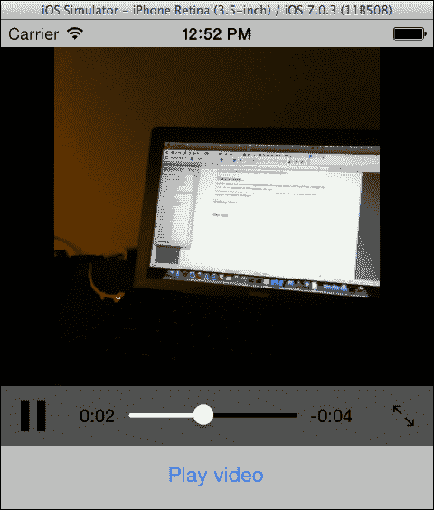

# 第七章. 多媒体资源

在本章中，我们将涵盖以下主题：

+   选择图像和视频

+   使用相机捕获媒体

+   播放视频

+   播放音乐和声音

+   使用麦克风录制

+   直接管理相册项目

# 简介

今天智能手机和平板电脑最重要的功能之一是它们捕获和管理多媒体资源的能力。无论是照片、视频还是音频，针对这些设备且能有效处理多媒体的应用程序非常重要。

在本章中，我们将了解如何管理设备上存储的媒体。我们还将学习如何使用设备的多媒体捕获设备（相机和麦克风）来捕获内容并创建一个将为用户提供丰富体验的应用程序。

更具体地说，我们将讨论以下主题：

+   `UIImagePickerController`：这是一个控制器，它通过用户界面提供对设备上保存的照片和视频的访问权限，同时也提供了一个相机界面，可以通过设备的相机硬件捕获照片。

+   `MPMoviePlayerController`：这是一个控制器，允许我们播放和流式传输视频文件。

+   `MPMediaPickerController`：这是访问由原生 iPod 应用程序管理的保存内容的默认用户界面。

+   `MPMusicPlayerController`：这是一个负责播放 iPod 内容的对象。

+   `AVAudioPlayer`：这是一个类，允许我们播放声音文件。

+   `AVAudioRecorder`：这是一个类，允许我们使用麦克风录制音频。

+   `ALAssetsLibrary`：这是一个类，提供对设备上可用资产及其元数据的访问权限。

# 选择图像和视频

在本食谱中，我们将学习如何为用户提供从设备相册导入图像和视频的能力。

## 准备工作

在 Xamarin Studio 中创建一个新的**单视图应用程序**，并将其命名为`ImagePickerApp`。对于本食谱，我们需要一些图像存储在模拟器的相册中。

向模拟器添加图像的一个简单方法是通过 Safari 导航到一个网页。在 Safari 中长按（点击并按住）任何图像将显示一个包含**保存**选项的操作表。点击该选项将图像保存到相册中。

## 如何操作...

执行以下步骤：

1.  在 Interface Builder 中打开`ImagePickerAppViewController.xib`文件，并向其中添加`UIImageView`和`UIButton`。

1.  在`ViewDidLoad`方法中输入以下代码：

    ```swift
    this.imagePicker = new UIImagePickerController();
    this.imagePicker.FinishedPickingMedia += this.ImagePicker_FinishedPickingMedia;
    this.imagePicker.Canceled += this.ImagePicker_Cancelled;
    this.imagePicker.SourceType = UIImagePickerControllerSourceType.PhotoLibrary;
    this.btnSelect.TouchUpInside += async (s, e) => {
      await this.PresentViewControllerAsync(this.imagePicker, true);
    };
    ```

1.  实现以下代码中的`FinishedPickingMedia`和`Canceled`事件处理程序：

    ```swift
    private async void ImagePicker_FinishedPickingMedia (object sender, UIImagePickerMediaPickedEventArgs e)
    {
      UIImage pickedImage = e.Info[UIImagePickerController.OriginalImage] as UIImage;
      this.imageView.Image = pickedImage;
      await this.imagePicker.DismissViewControllerAsync(true);
    }
    private async void ImagePicker_Cancelled (object sender, EventArgs e)
    {
      await this.imagePicker.DismissViewControllerAsync(true);
    }
    ```

1.  在模拟器上编译并运行应用程序。点击在初始步骤中添加的按钮以显示图片选择器，并通过点击其缩略图来选择一个图像。图像将在图像视图中显示。`UIImagePickerController`在以下屏幕截图中显示：

### 注意

在应用程序中第一次显示 `UIImagePickerController` 之前，iOS 将显示一个警报，请求用户允许访问照片库。处理这种情况将在本章后面的 *直接管理相册项目* 食谱中描述。

## 它是如何工作的...

`UIImagePickerController` 是 iOS 提供的一个特殊视图控制器，用于选择保存在设备相册中的图像和视频，甚至可以从相机捕获新的媒体。

在初始化图像选择器对象后，我们需要订阅其 `FinishedPickingMedia` 事件，该事件为我们提供了用户所选的媒体。在分配给它的处理程序中，我们获取所选的图像：

```swift
UIImage pickedImage = e.Info[UIImagePickerController.OriginalImage] as UIImage;
```

`Info` 属性返回一个包含有关所选媒体各种信息的 `NSDictionary` 对象。我们通过传递 `UIImagePickerController.OriginalImage` 常量作为键来检索图像。由于字典的值是 `NSObject` 类型，我们将返回值转换为 `UIImage`。在我们将图像分配给要显示的 `UIImageView` 之后，我们使用以下代码关闭控制器：

```swift
await this.imagePicker.DismissViewControllerAsync(true);
```

当用户点击控制器的 **取消** 按钮时，会触发 `Canceled` 事件。我们必须订阅它以关闭控制器，因为它在用户点击 **取消** 按钮时不会自动关闭。

## 还有更多...

我们可以通过图像选择器的 `SourceType` 属性定义它将从中读取的图像/视频的来源。在这个例子中，我们使用 `UIImagePickerController.PhotoLibrary`，因为模拟器不支持相机硬件。

### 选择视频

`UIImagePickerController` 默认只显示图像。要支持视频，其 `MediaType` 属性必须被设置。它接受一个 `string[]` 参数，其中包含指定的媒体名称，如下面的代码所示：

```swift
this.imagePicker.MediaTypes = new string[] { "public.image", "public.movie" };
```

要确定用户选择的媒体类型，我们在 `FinishedPickingMedia` 处理器中的字典中检查 `MediaType` 键。如果是视频，我们使用 `MediaUrl` 键获取其 URL，如下面的代码所示：

```swift
if (e.Info[UIImagePickerController.MediaType].ToString() == "public.movie")
{
  NSUrl mediaUrl = e.Info[UIImagePickerController.MediaURL] as NSUrl;
  // Do something useful with the media url.
}
```

## 参见

+   *使用相机捕捉媒体* 的食谱

+   *直接管理相册项目* 的食谱

# 使用相机捕捉媒体

在本食谱中，我们将学习如何使用设备相机来捕捉媒体。

## 准备工作

打开我们在上一个食谱中创建的 `ImagePickerApp` 项目。

### 注意

相机功能在 iOS 模拟器上不可用。此示例只能在设备上运行。有关更多信息，请参阅第十四章，*部署*。

## 如何操作...

执行以下步骤：

1.  在控制器类的 `ViewDidLoad` 方法中，将 `this.imagePicker.SourceType = UIImagePickerControllerSourceType.PhotoLibrary;` 替换为以下代码块：

    ```swift
    if (UIImagePickerController.IsSourceTypeAvailable(UIImagePickerControllerSourceType.Camera))
    {
      this.imagePicker.SourceType = UIImagePickerControllerSourceType.Camera;
    }  else
    {
      this.imagePicker.SourceType = UIImagePickerControllerSourceType.PhotoLibrary;
    }
    ```

1.  在 `FinishedPickingMedia` 处理程序中，在关闭图像选择器之前添加以下代码：

    ```swift
    pickedImage.SaveToPhotosAlbum((s, error) => {
      if (null != error)
      {
        Console.WriteLine("Image not saved! Message: {0}", error.LocalizedDescription);
      }
    } );
    ```

1.  在设备上编译并运行应用。点击按钮打开相机并拍照。照片将被保存到设备相册中。

## 它是如何工作的...

在展示相机取景器之前，我们必须确保应用运行在具有适当硬件的设备上。我们通过调用 `UIImagePickerController` 类的静态 `IsSourceTypeAvailable` 方法来完成此操作，如下所示：

```swift
if (UIImagePickerController.IsSourceTypeAvailable(UIImagePickerControllerSourceType.Camera))
```

如果此返回 `true`，我们使用以下代码将源类型设置为 `Camera`：

```swift
this.imagePicker.SourceType = UIImagePickerControllerSourceType.Camera;
```

这将导致图像选择器控制器启动相机设备而不是加载设备相册。

当用户通过我们的应用程序拍照（或录像）时，它不会自动保存在设备上。要保存它，我们使用 `UIImage` 类的 `SaveToPhotosAlbum` 方法。此方法接受 `UIImage.SaveStatus` 类型的委托，如果发生错误将报告错误：

```swift
if (null != error)
{
  Console.WriteLine("Image not saved! Message: {0}", error.LocalizedDescription);
}
```

## 还有更多...

相机视图也可以进行自定义。要禁用默认的相机控件，将 `ShowsCameraControls` 属性设置为 `false`。然后，将您想要的控件的自定义视图传递给 `CameraOverlayView` 属性。要触发相机的快门，请调用 `TakePicture` 方法。

### 图像编辑

在捕获图像后，相机支持简单的编辑功能。此编辑功能允许用户选择图像的特定部分，甚至可以放大到特定区域。要显示编辑控件，将 `AllowsEditing` 属性设置为 `true`。编辑后的图像可以从 `FinishedPickingMedia` 处理器中的字典中检索，传递 `UIImagePickerController.EditedImage` 键。编辑界面如下截图所示：


## 相关内容

+   *选择图像和视频* 菜谱

# 播放视频

在本菜谱中，我们将学习如何显示视频播放器界面并播放视频文件。

## 准备工作

在 Xamarin Studio 中创建一个新的 **Single View Application**，并将其命名为 `PlayVideoApp`。

## 如何操作...

执行以下步骤：

1.  在控制器的主视图中添加一个按钮。

1.  将视频文件添加到项目中，并将其 **Build Action** 设置为 **Content**。

1.  将以下代码添加到控制器类中的 `ViewDidLoad` 方法：

    ```swift
    this.moviePlayer = new MPMoviePlayerController(NSUrl.FromFilename("video.mov"));
    this.moviePlayer.View.Frame = new RectangleF(0f, 20f, this.View.Frame.Width, 320f);
    this.View.AddSubview(this.moviePlayer.View);
    this.playbackStateChanged = MPMoviePlaybackController.Notifications.ObservePlaybackStateDidChange(this.MoviePlayer_PlaybackStateChanged);
    this.finishedPlaying = MPMoviePlaybackController.Notifications.ObservePlaybackDidFinish(this.MoviePlayer_FinishedPlayback);
    this.btnPlayVideo.TouchUpInside += delegate {
      this.moviePlayer.Play();
    } ;
    ```

1.  在 `MainController` 类中输入以下方法：

    ```swift
    private void MoviePlayer_PlaybackStateChanged(object sender, NSNotificationEventArgs e)
    {
      Console.WriteLine("Movie player load state changed: {0}", this.moviePlayer.PlaybackState);
    }
    private void MoviePlayer_FinishedPlayback(object sender, 
      NSNotificationEventArgs e)
    {
      Console.WriteLine("Movie player finished playing.");
    }
    ```

1.  在模拟器上编译并运行应用。点击按钮，视频将加载并开始播放。在 Xamarin Studio 的 **Application Output** 面板中查看显示的消息。以下截图显示了在模拟器上播放的视频：

## 它是如何工作的...

`MPMoviePlayerController` 控制器播放存储在本地的或从网络流式传输的视频文件。我们使用接受 `NSUrl` 参数的构造函数初始化控制器，如下面的代码所示：

```swift
this.moviePlayer = new MPMoviePlayerController(NSUrl.FromFilename("video.mov"));
```

`NSUrl` 类是标准的 iOS URL 类。

在创建实例后，我们使用以下代码为其视图定义一个框架并将其添加到我们的视图中：

```swift
this.moviePlayer.View.Frame = new RectangleF(0f, 20f, this.View.Frame.Width, 320f);
this.View.AddSubview(this.moviePlayer.View);
```

在上一节中突出显示的代码向默认通知中心添加了观察者，以便在播放状态改变或结束时通知我们。然后，我们调用它的 `Play` 方法，并显示 `MPMoviePlayerController` 控制器的视图，视频开始播放。

在 `MoviePlayer_PlaybackStateChanged` 方法中，我们使用以下代码输出 `PlaybackState` 属性：

```swift
Console.WriteLine("Movie player load state changed: {0}", this.moviePlayer.PlaybackState);
```

此属性告诉我们播放状态，例如，`Paused`、`Playing`、`SeekingForward` 和 `SeekingBackward`。

## 更多内容...

除了本例中使用的那些之外，我们还可以为 `MPMoviePlayerController` 控制器的更多通知添加观察者，其中一些如下：

+   `DidEnterFullscreenNotification`：它通知我们用户已点击全屏控制，控制器已进入全屏模式

+   `DidExitFullscreenNotification`：它通知控制器已离开全屏模式

+   `DurationAvailableNotification`：这通知我们控制器已收到关于视频持续时间的详细信息

+   `LoadStateDidChangeNotification`：这在网络播放中很有用；当控制器完成缓冲区中媒体的预加载时，它会触发。

+   `NaturalSizeAvailableNotification`：当电影框架的尺寸可用时，它会触发。大小可以通过播放器的 `NaturalSize` 属性检索

+   `NowPlayingMovieDidChangeNotification`：当播放器的视频内容发生变化时，它会触发。当前内容可以通过其 `ContentUrl` 属性获取

### 无线流媒体

从 iOS 版本 4.3 开始，`MPMoviePlayerController` 可以用于将视频流式传输到 Apple 的 AirPlay 兼容设备。要启用无线流媒体，将 `MPMoviePlayerController` 实例的 `AllowsAirPlay` 属性设置为 `true`。当 `controller` 显示时，它将提供一个界面，允许用户选择它检测到的设备。

## 相关内容

+   *播放音乐和声音* 菜单

# 播放音乐和声音

在本菜谱中，我们将学习如何播放简单的音频文件和存储在设备上的歌曲。

## 准备中

在 Xamarin Studio 中创建一个新的 **单视图应用程序** 并将其命名为 `PlayMusicApp`。

### 注意

此示例在模拟器上无法工作。您还需要在设备上的 iTunes 库中至少存储一首歌曲。

## 如何操作...

执行以下步骤：

1.  向控制器的视图中添加三个按钮。

1.  在 `PlayMusicAppViewController.cs` 文件中添加以下 `using` 指令：

    ```swift
    using MonoTouch.MediaPlayer;
    ```

1.  在类中添加以下两个字段：

    ```swift
    private MPMusicPlayerController musicPlayer;
    private MPMediaPickerController mediaPicker;
    ```

1.  在 `ViewDidLoad` 方法中添加以下代码：

    ```swift
    this.mediaPicker = new MPMediaPickerController(MPMediaType.Music);
    this.mediaPicker.ItemsPicked += MediaPicker_ItemsPicked;
    this.mediaPicker.DidCancel += MediaPicker_DidCancel;
    this.musicPlayer = 
     MPMusicPlayerController.ApplicationMusicPlayer;
    this.btnSelect.TouchUpInside += async (s, e) => {
      await this.PresentViewControllerAsync(this.mediaPicker, true);
    } ;
    this.btnPlay.TouchUpInside += (s, e) => {
      this.musicPlayer.Play();
    } ;
    this.btnStop.TouchUpInside += (s, e) => {
      this.musicPlayer.Stop();
    } ;
    ```

1.  在类中添加以下方法：

    ```swift
    private async void MediaPicker_ItemsPicked (object sender, ItemsPickedEventArgs e)
    {
      this.musicPlayer.SetQueue(e.MediaItemCollection);
      await this.DismissViewControllerAsync(true);
    }
    private async void MediaPicker_DidCancel (object sender, EventArgs e)
    {
      await this.mediaPicker.DismissViewControllerAsync(true);
    }
    ```

1.  在设备上编译并运行应用程序。点击 **选择歌曲** 按钮并选择一首或多首歌曲。

## 它是如何工作的...

`MPMediaPickerController`控制器提供了与原生*音乐*应用相同的用户界面，用于选择歌曲。`MPMusicPlayerController`控制器负责播放设备上存储的歌曲。

我们首先初始化媒体选择器，通过在构造函数中使用以下代码通过其构造函数传递我们想要它查找的媒体类型：

```swift
this.mediaPicker = new MPMediaPickerController(MPMediaType.Music);
```

之后，我们订阅其`ItemsPicked`和`DidCancel`事件，以便我们可以通过以下代码捕获用户的反馈：

```swift
this.mediaPicker.ItemsPicked += MediaPicker_ItemsPicked;
this.mediaPicker.DidCancel += MediaPicker_DidCancel;
```

上一节中突出显示的代码显示了如何初始化音乐播放器对象。这里演示的选项`MPMusicPlayerController.ApplicationMusicPlayer`创建了一个仅适用于应用的实例。另一个可用的选项`MPMusicPlayerController.iPodMusicPlayer`创建了一个实例，允许在应用处于后台时播放媒体，类似于原生的*音乐*应用。

在`MediaPicker_ItemsPicked`处理程序中，我们通过其`SetQueue`方法将用户选择的歌曲设置到音乐播放器中，如下所示：

```swift
this.musicPlayer.SetQueue(e.MediaItemCollection);
```

之后，我们关闭模态媒体选择器控制器。播放和停止歌曲分别通过`MPMusicPlayerController`的`Play()`和`Stop()`方法实现。

## 还有更多...

`MPMusicPlayerController`包含正在播放的项目信息。这些信息可以通过其`NowPlayingItem`属性访问。它属于`MPMediaItem`类型，并包含正在播放的媒体的各种类型信息。以下示例输出正在播放的歌曲的标题：

```swift
Console.WriteLine(this.musicPlayerController.NowPlayingItem.ValueForProperty(MPMediaItem.TitleProperty));
```

### 播放声音文件

`MPMusicPlayerController`控制器是一个专门设计来管理和播放设备音乐库中存储的项目和播放列表的对象。

要播放简单的声音文件，Xamarin.iOS 提供了对 iOS 的`AVAudioPlayer`类的另一个包装器。以下代码是其最简单使用的示例：

```swift
using MonoTouch.AVFoundation;
//...
AVAudioPlayer audioPlayer = AVAudioPlayer.FromUrl(new NSUrl("path/to/sound file"));
audioPlayer.Play();
```

## 参见

+   *播放视频*菜谱

# 使用麦克风录制

在本菜谱中，我们将学习如何使用设备的麦克风来录制声音。

## 准备工作

在 Xamarin Studio 中创建一个新的项目，并将其命名为`RecordSoundApp`。

### 注意

此示例在模拟器上无法工作。

## 如何操作...

执行以下步骤：

1.  将两个按钮和一个标签添加到控制器的视图中。

1.  在`RecordSoundAppViewController.cs`文件中输入以下`using`指令：

    ```swift
    using System.IO;
    using MonoTouch.AVFoundation;
    using MonoTouch.AudioToolbox;
    ```

1.  重写`ViewDidLoad`方法并向其中添加以下代码：

    ```swift
    NSUrl soundFileUrl = null;
    NSError error = null;
    AVAudioSession session = AVAudioSession.SharedInstance();
    session.SetCategory(AVAudioSession.CategoryPlayAndRecord, out error);
    session.SetActive(true, out error);
    bool grantedPermission = false;
    session.RequestRecordPermission((granted) => {
      if (granted) {
        grantedPermission = true;
        string soundFile = Path.Combine(Environment.GetFolderPath(Environment.SpecialFolder.Personal), "sound.wav");
        soundFileUrl = new NSUrl(soundFile);
        NSDictionary recordingSettings = NSDictionary.FromObjectAndKey(AVAudioSettings.AVFormatIDKey, NSNumber.FromInt32((int)AudioFileType.Wave));
        this.audioRecorder = AVAudioRecorder.ToUrl(soundFileUrl, recordingSettings, out error);
      } else {
        this.lblStatus.Text = "Permission to microphone refused";
      }
    });

    this.btnStart.TouchUpInside += (s, e) => {
      if (grantedPermission) {
        this.audioRecorder.Record();
        this.lblStatus.Text = "Recording…";
      }
    };
    this.btnStop.TouchUpInside += (s, e) => {
      if (grantedPermission) {
        this.audioRecorder.Stop();
       this.lblStatus.Text = "Idle";
        AVAudioPlayer player = AVAudioPlayer.FromUrl(soundFileUrl);
        player.Play();
      }
    };
    ```

1.  在设备上编译并运行应用程序。点击**开始**录音按钮开始录音，例如，说出一些话以录制你的声音。点击**停止****录音**按钮停止录音并播放。

## 工作原理...

`AVAudioRecorder`类提供了录音功能。它是通过将捕获的音频直接流式传输到文件系统来实现的。在开始实际录音之前，我们需要使用以下代码准备共享音频会话：

```swift
NSError error = null;
AVAudioSession session = AVAudioSession.SharedInstance();
session.SetCategory(AVAudioSession.CategoryPlayAndRecord, out error);
session.SetActive(true, out error);
```

我们需要根据应用程序的需求调整音频会话，以便系统知道如何处理来自其他源的声音。通过将类别设置为`AVAudioSession.CategoryPlayAndRecord`，我们声明我们的应用程序在录音的同时能够播放音频。

第一次将共享音频会话的类别设置为任何需要使用麦克风的值时，iOS 会自动提示用户允许应用程序使用麦克风。通过调用`RequestRecordPermission`方法，我们可以确定用户是否已经允许我们的应用程序访问麦克风，如下面的代码所示：

```swift
session.RequestRecordPermission((granted) => {
  if (granted) {
    grantedPermission = true;
    //..
```

现在我们已经准备好了共享音频会话，是时候通过以下代码初始化一个`AVAudioRecorder`实例了：

```swift
this.audioRecorder = AVAudioRecorder.ToUrl(soundFileUrl, recordingSettings, out error);
```

如果与`NSUrl`变量对应的文件已经存在，它将被覆盖。

`recordingSettings`变量是`NSDictionary`类型，包含输出声音文件的设置。在初始化`AVAudioRecorder`时，我们必须提供至少一些最小设置。在这里，我们通过以下代码将声音格式设置为纯 WAV：

```swift
NSDictionary recordingSettings = NSDictionary.FromObjectAndKey(AVAudioSettings.AVFormatIDKey, NSNumber.FromInt32((int)AudioFileType.WAVE));
```

要指示录音器开始录音，我们只需通过以下代码行调用其`Record()`方法：

```swift
this.audioRecorder.Record();
```

当用户点击**停止录音**按钮时，录音停止，并使用`AVAudioPlayer`播放保存的声音：

```swift
this.audioRecorder.Stop();
AVAudioPlayer player = AVAudioPlayer.FromUrl(soundFileUrl);
player.Play();
```

## 更多内容...

`AVAudioRecorder`类还提供了声音计权选项。要启用声音计权，将它的`MeteringEnabled`属性设置为`true`。然后我们可以输出特定通道的峰值功率（分贝）。为了对录音的第一个通道执行此操作，在`Record()`方法调用后立即添加以下代码：

```swift
ThreadPool.QueueUserWorkItem(delegate {
  while (this.audioRecorder.Recording)
  {
    this.audioRecorder.UpdateMeters();
    Console.WriteLine(this.audioRecorder.PeakPower(0));
  }
} );
```

`PeakPower`方法接受通道的零基索引并返回该通道的峰值（分贝）。在调用`PeakPower`方法之前调用`UpdateMeters()`以获取最新的读数。

注意，在录音器上启用计权需要使用 CPU 资源。如果你不打算使用计权值，请不要启用它。

### 记录预定义的时间长度

要记录预定义时间长度的音频，而无需用户停止录音，请调用`RecordFor(double)`方法。它的参数是我们想要记录的秒数。

## 参见

+   *播放音乐和声音*食谱

# 直接管理专辑项目

在本食谱中，我们将讨论如何通过编程方式访问设备的照片库。

## 准备工作

在 Xamarin Studio 中创建一个新的**单视图应用程序**，并将其命名为`ManageAlbumApp`。

### 注意

此示例在模拟器上工作。模拟器的照片库中必须至少存在一个图像。

## 如何操作...

执行以下步骤：

1.  在控制器的主视图中添加一个按钮。

1.  在 `MainController.cs` 文件中输入以下 `using` 指令：

    ```swift
    using MonoTouch.AssetsLibrary;
    ```

1.  在 `ViewDidLoad` 方法中添加以下代码：

    ```swift
    this.btnEnumerate.TouchUpInside += (s, e) => {
      if (ALAssetsLibrary.AuthorizationStatus == ALAuthorizationStatus.Authorized ||
        ALAssetsLibrary.AuthorizationStatus == ALAuthorizationStatus.NotDetermined) {
        this.assetsLibrary = new ALAssetsLibrary();
        this.assetsLibrary.Enumerate(ALAssetsGroupType.All, this.GroupsEnumeration, this.GroupsEnumerationFailure);
      }
    } ;
    ```

1.  在类中添加以下方法：

    ```swift
    private void GroupsEnumeration(ALAssetsGroup assetGroup, ref bool stop)
    {
      if (null != assetGroup)
      {
        stop = false;
        assetGroup.SetAssetsFilter(ALAssetsFilter.AllPhotos);
        assetGroup.Enumerate(this.AssetEnumeration);
      }
    }
    private void AssetEnumeration(ALAsset asset, int index, ref bool stop)
    {
      if (null != asset)
      {
        stop = false;
        Console.WriteLine("Asset url: {0}", asset.DefaultRepresentation.Url.AbsoluteString);
      }
    }
    private void GroupsEnumerationFailure(NSError error)
    {
      if (null != error)
      {
        Console.WriteLine("Error enumerating asset groups! Message: {0}", error.LocalizedDescription);
      }
    }
    ```

1.  编译并运行应用。点击 **Enumerate** 按钮，观察保存照片的 URL 在 **Application Output** 面板中显示。

## 它是如何工作的...

`ALAssetsLibrary` 类提供了对设备相册项的访问。这些项由 `ALAsset` 类表示，并按组划分，由 `ALAssetGroup` 类表示。

我们需要做的第一件事是枚举资产组。为此，使用以下代码调用 `Enumerate` 方法：

```swift
this.assetsLibrary.Enumerate(ALAssetsGroupType.All, this.GroupsEnumeration, this.GroupsEnumerationFailure);
```

第一个参数是 `ALAssetGroupTypes` 类型，它指示要枚举的资产组。传递 `ALAssetGroupTypes.All` 表示我们想要枚举所有资产组。其他两个参数是委托类型。`GroupsEnumeration` 方法是我们读取组数据的地方，而 `GroupsEnumerationFailure` 方法将在发生错误时被触发。当第一次调用 `Enumerate` 方法时，用户会被要求授权应用访问设备的资产。如果用户拒绝访问，将触发失败方法。下次调用 `Enumerate` 方法时，访问消息将再次出现。

`GroupsEnumeration` 方法的签名如下：

```swift
private void GroupsEnumeration(ALAssetsGroup assetGroup, ref bool stop)
```

`assetGroup` 参数包含组的信息。

注意 `stop` 参数，它被声明为一个 `ref` 参数。当枚举发生时，该方法被触发一次以返回第一个组，并且无论存在多少更多组，都不会再次被调用。为了强制它继续被调用以枚举所有组，我们必须将 `stop` 变量设置为 `false`。当所有组都已枚举后，该方法最后一次被调用，此时 `assetGroup` 变量设置为 `null`。因此，我们需要检查这一点。要将所有这些放入代码中，请查看以下示例：

```swift
if (null != assetGroup)
{
  // Continue enumerating
  stop = false;
  // Determine what assets to enumerate
  assetGroup.SetAssetsFilter(ALAssetsFilter.AllPhotos);
  // Enumerate assets
  assetGroup.Enumerate(this.AssetEnumeration);
}
```

在对 `ALAssetGroup` 类的实例调用 `SetAssetsFilter` 方法之后，我们指示它过滤我们希望它查找的资产类型。之后，这个过程与组枚举类似。`ALAssetGroup` 类还包含一个 `Enumerate` 方法。它接受一个委托类型参数，在此处由 `AssetsEnumeration` 方法表示。其实现与 `GroupsEnumeration` 方法类似，如下所示：

```swift
if (null != asset)
{
  // Continue enumerating assets
  stop = false;
  // Output the asset url
  Console.WriteLine("Asset url: {0}", asset.DefaultRepresentation.Url.AbsoluteString);
}
```

`ALAsset` 类包含各种信息和属性。大部分信息存储在其 `DefaultRepresentation` 属性中，该属性为 `ALAssetRepresentation` 类型。

## 还有更多...

如果我们感兴趣的资产是一张图片，我们可以通过以下代码通过 `DefaultRepresentation` 属性获取实际图片：

```swift
CGImage image = asset.DefaultRepresentation.GetImage();
```

### 读取 EXIF 数据

我们可以通过 `ALAssetRepresentation` 的 `Metadata` 属性读取照片的 **可交换图像文件** （**EXIF**）格式元数据，该属性是 `NSDictionary` 类型，如下面的代码所示：

```swift
NSDictionary metaData = asset.DefaultRepresentation.Metadata;
if (null != metaData)
{
  NSDictionary exifData = (NSDictionary)metaData[new NSString("{Exif}")];
}
```

### 获取单个资源

如果我们知道资源的 URL，我们也可以通过 `ALAssetLibrary` 的 `AssetForUrl` 方法检索单个资源。

### 检查权限

我们可以通过 `ALAssetsLibrary.AuthorizationStatus` 静态属性检查用户是否已授予对资源库的访问权限。`ALAuthorizationStatus` 枚举的可能值如下：

+   `Authorized`：这意味着用户已授权我们的应用程序。

+   `Denied`：这意味着用户已拒绝访问相册。

+   `NotDetermined`：这意味着我们的应用程序从未请求访问相册。

+   `Restricted`：这意味着应用程序未经授权访问相册，并且用户无法授予访问权限，可能由于家长控制限制。

注意，访问 `AuthorizationStatus` 属性不会提示用户请求权限。当我们实际上尝试通过调用 `Enumerate` 方法访问库时，iOS 才会提示用户请求权限。

## 参见

+   *选择图片和视频* 菜单
