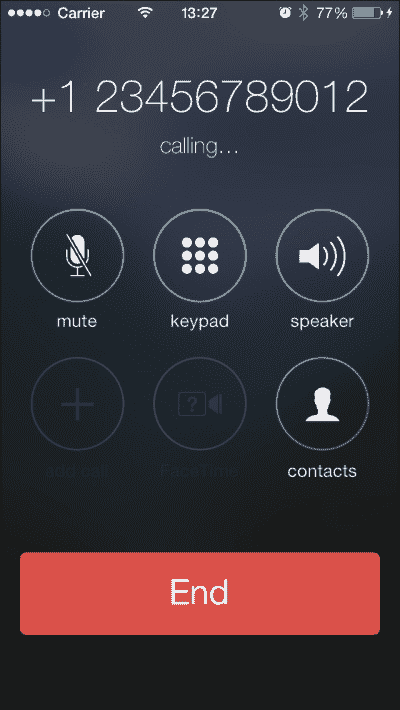
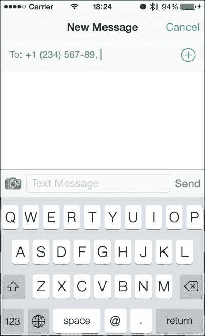
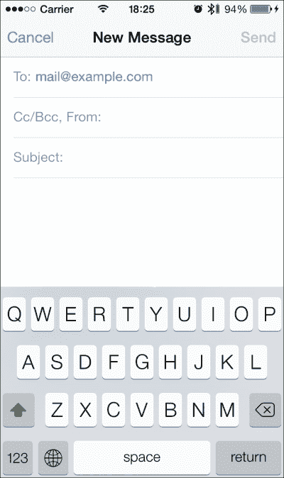
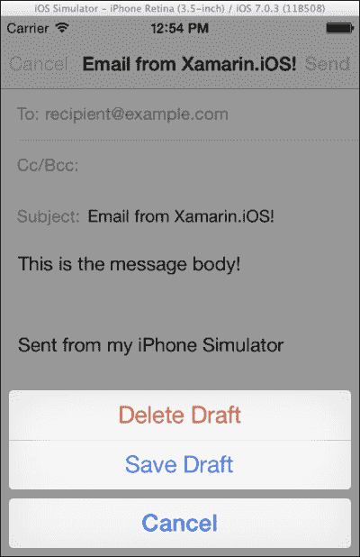
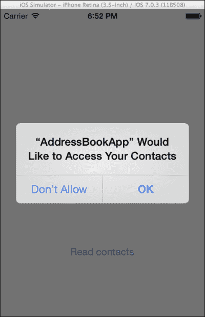
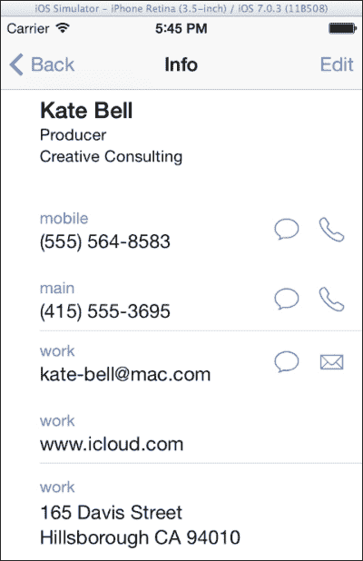

# 第八章。集成 iOS 功能

在本章中，我们将涵盖以下内容：

+   开始电话通话

+   发送短信和电子邮件

+   在我们的应用程序中使用短信

+   在我们的应用程序中使用电子邮件消息

+   管理地址簿

+   显示联系人

+   管理日历

# 简介

移动设备为用户提供了许多功能。创建一个与应用这些功能交互以向用户提供完整体验的应用程序可以肯定被视为一种优势。

在本章中，我们将讨论 iOS 的一些最常见功能以及如何将它们的一些或全部功能集成到我们的应用程序中。我们将看到如何使用原生平台应用或通过在我们的项目中集成原生用户界面来提供用户拨打电话、发送短信和电子邮件的能力。此外，我们还将讨论以下组件：

+   **MFMessageComposeViewController**：此控制器适用于发送文本（短信）消息

+   **MFMailComposeViewController**：此控制器用于发送带或不带附件的电子邮件

+   **ABAddressBook**：此类为我们提供了访问地址簿数据库的权限

+   **ABPersonViewController**：此控制器显示和/或编辑地址簿中的联系人信息

+   **EKEventStore**：此类负责管理日历事件

此外，我们还将学习如何读取和保存联系人信息，如何显示联系人详细信息，以及与设备的日历交互。

注意，本章中的一些示例可能需要设备。例如，模拟器不包含*消息*应用。要将模拟器部署到设备上，您需要通过苹果开发者门户注册为 iOS 开发者。

# 开始电话通话

在这个菜谱中，我们将学习如何调用原生的*电话*应用，允许用户拨打电话。

## 准备工作

在 Xamarin Studio 中创建一个新的**单视图应用程序**，并将其命名为`PhoneCallApp`。

### 注意

原生的*电话*应用在模拟器上不可用。它仅在 iPhone 设备上可用。

## 如何操作...

执行以下步骤以允许用户拨打电话：

1.  在`PhoneCallAppViewController`的视图中添加一个按钮。

1.  在`ViewDidLoad`方法中添加以下代码：

    ```swift
    this.btnCall.TouchUpInside += (s, e) => {
      NSUrlurl = new NSUrl("tel:+123456789012");
      if (UIApplication.SharedApplication.CanOpenUrl(url))
      {
        UIApplication.SharedApplication.OpenUrl(url);
      }  else
      {
        Console.WriteLine("Cannot open url: {0}", url.AbsoluteString);
      }
    } ;
    ```

1.  在设备上编译并运行应用。点击**呼叫电话号码**按钮开始通话。以下截图显示了*电话*应用正在拨打电话：

## 它是如何工作的...

通过`UIApplication.SharedApplication`静态属性，我们可以访问应用的`UIApplication`对象。我们可以使用其`OpenUrl`方法，该方法接受一个`NSUrl`变量，以下是一行代码来启动通话：

```swift
UIApplication.SharedApplication.OpenUrl(url);
```

由于并非所有 iOS 设备都支持原生的*电话*应用，因此首先检查其可用性将很有用。您可以使用以下代码来完成此操作：

```swift
if (UIApplication.SharedApplication.CanOpenUrl(url))
```

当调用`OpenUrl`方法时，原生的*Phone*应用将被执行并立即开始拨打电话。请注意，需要`tel:`前缀来发起通话。

## 还有更多...

Xamarin.iOS 还通过`MonoTouch.CoreTelephony`命名空间支持 CoreTelephony 框架。这是一个简单的框架，它提供了有关呼叫状态、连接、运营商信息等方面的信息。请注意，当电话开始时，原生的*Phone*应用进入前台，导致应用挂起。CoreTelephony 框架的简单用法如下：

```swift
CTCallCenter callCenter = new CTCallCenter();
callCenter.CallEventHandler = delegate(CTCall call) {
  Console.WriteLine(call.CallState);
} ;
```

注意，处理程序是用等号（=）而不是常见的加等于（+=）组合分配的。这是因为`CallEventHandler`是一个属性，而不是一个事件。当应用进入后台时，事件不会分配给它。然而，当应用返回前台时，最后发生的事件将被分配。

### 关于 OpenUrl 的更多信息

`OpenUrl`方法可以用来打开各种原生和非原生应用程序。例如，要在 Safari 中打开网页，只需创建一个包含链接的`NSUrl`对象，如下所示：

```swift
NSUrl url = new NSUrl("http://www.packtpub.com");
```

## 参见

+   **发送短信和电子邮件**菜谱

# 发送短信和电子邮件

在这个菜谱中，我们将学习如何在我们的应用程序中调用原生的*Mail*和*Messaging*应用。

## 准备工作

在 Xamarin Studio 中创建一个新的**单视图应用程序**，并将其命名为`SendTextApp`。

## 如何操作...

执行以下步骤以调用应用程序：

1.  在`SendTextAppViewController`的视图中添加两个按钮。

1.  在`ViewDidLoad`方法中添加以下代码：

    ```swift
    this.btnSendText.TouchUpInside += (s, e) => {
      NSUrl textUrl = new NSUrl("sms:+123456789");
      if (UIApplication.SharedApplication.CanOpenUrl(textUrl))
      {
        UIApplication.SharedApplication.OpenUrl(textUrl);
      }  else
      {
        Console.WriteLine("Cannot send text message!");
      }
    } ;
    this.btnSendEmail.TouchUpInside += (s, e) => {
      NSUrl emailUrl = new NSUrl("mailto:mail@example.com");
      if (UIApplication.SharedApplication.CanOpenUrl(emailUrl))
      {
        UIApplication.SharedApplication.OpenUrl(emailUrl);
      }  else
      {
        Console.WriteLine("Cannot send email message!");
      }
    } ;
    ```

1.  在设备上编译并运行应用程序。点击其中一个按钮以打开相应的应用程序。

## 如何工作...

再次使用`OpenUrl`方法，我们可以发送文本或电子邮件消息。只需使用前面示例代码中的`sms:`前缀即可打开原生的文本消息应用，如下所示：

```swift
UIApplication.SharedApplication.OpenUrl(new NSUrl("sms:+123456789012"));
```

在`sms:`前缀后添加手机号码将打开原生的*Messaging*应用，如下面的屏幕截图所示：



对于打开原生的电子邮件应用，过程类似。传递`mailto:`前缀，如下所示：

```swift
UIApplication.SharedApplication.OpenUrl(new NSUrl("mailto:mail@example.com"));
```

这将打开编辑邮件控制器，如下面的屏幕截图所示：



`mailto:` URL 方案支持各种参数以自定义电子邮件消息。这些参数允许我们输入发件人地址、主题和消息，如下所示：

```swift
UIApplication.SharedApplication.OpenUrl("mailto:recipient@example.com?subject=Email%20with%20Xamarin.iOS!&body=This%20is%20the%20message%20body!");
```

## 还有更多...

虽然 iOS 提供了打开原生*Messaging*应用的访问权限，但在电子邮件的情况下，在应用内部预定义消息内容是控制停止的地方。实际上，没有通过代码发送消息的方法。是否发送消息将由用户决定。

### 关于打开外部应用的更多信息

`OpenUrl`方法提供了一个打开外部应用程序的接口。打开外部应用程序有一个缺点，那就是调用`OpenUrl`方法的 app 会切换到后台。在 iOS 版本 3.*之前，这是通过应用程序进行消息传递的唯一方式。自 iOS 版本 4.0 以来，苹果向 SDK 提供了消息控制器。以下食谱讨论了它们的用法。

## 参见

+   **开始电话通话**和**在我们的应用程序中使用短信**的食谱

# 在我们的应用程序中使用短信

在这个食谱中，我们将学习如何在我们的应用程序中显示短信控制器。

## 准备工作

在 Xamarin Studio 中创建一个新的**单视图应用程序**，并将其命名为`TextMessageApp`。

## 如何操作...

执行以下步骤以在我们的应用程序中显示短信控制器：

1.  在控制器的视图中添加一个按钮。

1.  在`TextMessageAppViewController`文件中输入以下`using`指令：

    ```swift
    using MonoTouch.MessageUI;
    ```

1.  使用以下代码实现`ViewDidLoad`方法，根据您的意愿更改收件人号码和/或消息正文：

    ```swift
    private MFMessageComposeViewController messageController;
    public override void ViewDidLoad ()
    {
      base.ViewDidLoad ();
      this.btnSendMessage.TouchUpInside += async (s, e) => {
     if (MFMessageComposeViewController.CanSendText)
        {
          this.messageController = new MFMessageComposeViewController();
          this.messageController.Recipients = new string[] { "+123456789012" };
          this.messageController.Body = "Text from Xamarin.iOS";
          this.messageController.Finished += MessageController_Finished;
          await this.PresentViewControllerAsync(this.messageController, true);
        }  else
        {
          Console.WriteLine("Cannot send text message!");
        }
      } ;
    }
    ```

1.  添加以下方法：

    ```swift
    private async void MessageController_Finished(object sender, MFMessageComposeResultEventArgs e) {
      switch (e.Result) {
      case MessageComposeResult.Sent:
        Console.WriteLine("Message sent!");
        break;
      case MessageComposeResult.Cancelled:
        Console.WriteLine("Message cancelled!");
        break;
      default:
        Console.WriteLine("Message failed!");
        break;
      }
      e.Controller.Finished -= MessageController_Finished;
      await e.Controller.DismissViewControllerAsync(true);
    }
    ```

1.  在设备上编译并运行应用程序。点击**发送消息**按钮以打开消息控制器。点击**发送**按钮发送消息，或点击**取消**按钮返回应用程序。

## 它是如何工作的...

`MonoTouch.MessageUI`命名空间包含实现 iOS 应用程序中消息传递所需的 UI 元素。对于短信（SMS），我们需要`MFMessageComposeViewController`类。

我们需要检查短信可用性，因为并非所有设备都能发送短信。`MFMessageComposeViewController`类包含一个名为`CanSendText`的静态方法，它返回一个布尔值，表示我们是否可以使用此功能。在这种情况下，重要的是在初始化控制器之前检查发送短信功能是否可用。这是因为当你尝试在不支持短信或模拟器上的设备上初始化控制器时，你会得到一个异常。

为了确定用户在消息 UI 中何时采取了行动，我们订阅了`Finished`事件，如下所示：

```swift
this.messageController.Finished += MessageController_Finished;
```

在`Finished`方法内部，我们可以根据`MessageComposeResult`参数提供相应的功能。它可能有以下三个值之一：

+   已发送：这意味着消息已成功发送。

+   已取消：这意味着用户点击了**取消**按钮。消息将不会发送。

+   失败：这意味着消息发送失败。

最后一件要做的事情是取消订阅事件并关闭消息控制器，如下所示：

```swift
e.Controller.Finished -= MessageController_Finished;
await e.controller.DismissViewControllerAsync(true);
```

初始化控制器之后，我们可以将收件人和正文消息设置为适当的属性，如下所示：

```swift
this.messageController.Recipients = new string[] { "+123456789012" };
this.messageController.Body = "Text from Xamarin.iOS";
```

`Recipients`属性接受一个`string`数组，允许多个收件人号码。

## 还有更多...

SDK 允许用户界面发送文本消息的事实并不意味着它是可定制的。就像调用原生*Messaging*应用一样，是否发送消息或丢弃消息的决定权在用户手中。实际上，在控制器显示在屏幕上之后，任何尝试更改实际对象或其任何属性的操作都将失败。此外，用户可以更改或删除收件人和消息正文。真正的优势在于，消息用户界面是在我们的应用内部显示，而不是单独运行。

### 附件

从 iOS 7 开始，`MFMessageComposeViewController`类支持附件。我们可以通过`AddAttachment`方法将文件附加到消息中，如下所示：

```swift
this.messageController.AddAttachment(new NSUrl("path/to/file"), "A wonderful image");
```

第二个参数是将在 UI 中显示的字符串，作为文件名。如果传递 null，则将显示实际文件名。

# 在我们的应用中使用电子邮件消息

在本食谱中，我们将学习如何在应用中使用电子邮件消息界面。

## 准备工作

在 Xamarin Studio 中创建一个新的**单视图应用程序**，并将其命名为`EmailMessageApp`。

## 如何做...

执行以下步骤：

1.  在`EmailMessageAppViewController`的视图中添加一个按钮，并在`EmailMessageAppViewController.cs`文件中添加`MonoTouch.MessageUI`命名空间。

1.  在`ViewDidLoad`方法中输入以下代码：

    ```swift
    this.btnSendEmail.TouchUpInside += async (s, e) => {
      if (MFMailComposeViewController.CanSendMail)
      {
      this.mailController = new MFMailComposeViewController();
      this.mailController.SetToRecipients(new string[] { "recipient@example.com" });
      this.mailController.SetSubject("Email from Xamarin.iOS!");
      this.mailController.SetMessageBody("This is the message body!", false);
      this.mailController.Finished += this.MailController_Finished;
        await this.PresentViewControllerAsync(this.mailController, true);
      }  else
      {
        Console.WriteLine("Cannot send email!");
      }
    } ;
    ```

1.  添加以下方法：

    ```swift
    private async void MailController_Finished (object sender, MFComposeResultEventArgs e)
    {
      switch (e.Result)
      {
      case MFMailComposeResult.Sent:
        Console.WriteLine("Email sent!");
      break;
      case MFMailComposeResult.Saved:
        Console.WriteLine("Email saved!");
      break;
      case MFMailComposeResult.Cancelled:
        Console.WriteLine("Email sending cancelled!");
      break;
      case MFMailComposeResult.Failed:
        Console.WriteLine("Email sending failed!");
        if (null != e.Error)
        {
          Console.WriteLine("Error message: {0}", e.Error.LocalizedDescription);
        }
      break;
      }
      e.Controller.Finished -= MailController_Finished;
      await e.Controller.DismissViewControllerAsync(true);
    }
    ```

1.  在模拟器或设备上编译并运行应用。点击**发送电子邮件**按钮以显示邮件用户界面。

发送或取消消息。该应用将在模拟器上运行，并且与设备上的原生*Mail*应用行为相同，只是消息实际上不会发送或保存。

## 如何工作...

`MFMailComposeViewController`类提供了原生邮件编写界面。为了确定设备是否能够发送电子邮件，我们首先检查其`CanSendMail`属性，如下所示：

```swift
if (MFMailComposeViewController.CanSendMail)
```

就像我们对`MFMessageComposeViewController`类所做的那样，我们订阅了`MFMailComposeViewController`类的`Finished`事件。我们使用此事件来响应用户操作，而无需实现`Delegate`对象。我们根据`MFComposeResultEventArgs.Result`属性在`MailController_Finished`方法中这样做，该属性是`MFMailComposeResult`类型。`MFMailComposeResult`枚举的可能值将如下所示：

+   已发送：这意味着电子邮件消息已排队待发送。

+   已保存：这意味着用户点击了**取消**按钮，操作表的**保存草稿**选项自动出现。以下截图显示了用户点击**取消**按钮时出现的操作表：

+   已取消：这意味着用户在控制器上点击了**取消**按钮，并在操作表中选择了**删除草稿**选项。

+   失败：这意味着电子邮件消息发送失败。

在初始化对象之后，我们可以通过相应的 `Set` 前缀方法集分配收件人列表、主题和消息正文，如下所示：

```swift
this.mailController.SetToRecipients(new string[] { "recipient@example.com" });
this.mailController.SetSubject("Email from MonoTouch!");
this.mailController.SetMessageBody("This is the message body!", false);
```

如果 `SetMessageBody` 消息的第二个参数设置为 `true`，它通知控制器该消息应被视为 HTML。

## 还有更多...

除了简单的或 HTML 格式的文本之外，我们还可以发送附件。我们可以使用 `AddAttachmentData` 方法通过以下代码行来实现：

```swift
this.mailController.AddAttachmentData(UIImage.FromFile("image.jpg").AsJPEG(), "image/jpg", "image.jpg");
```

第一个参数是 `NSData` 类型，是附件的实际内容。在这种情况下，我们通过 `UIImage.AsJPEG()` 方法附加一个图片，该方法返回一个包含在 `NSData` 对象中的图片内容。第二个参数代表附件的 **Multipurpose Internet Mail Extensions** (**MIME**) 类型，第三个参数代表将显示给用户的文件名。

## 参见

+   *在我们的应用程序中使用文本消息* 菜谱

# 管理地址簿

在这个菜谱中，我们将讨论如何访问和管理设备地址簿中存储的用户联系人。

## 准备工作

在 Xamarin Studio 中创建一个新的 **Single View Application** 并将其命名为 `AddressBookApp`。

## 如何做...

执行以下步骤：

1.  在控制器的视图中添加一个按钮。

1.  在 `AddressBookAppViewController.cs` 文件中输入以下 `using` 指令：

    ```swift
    using MonoTouch.AddressBook;
    ```

1.  重写 `ViewDidLoad` 方法：

    ```swift
    public override void ViewDidLoad ()
    {
      base.ViewDidLoad ();
      this.btnReadContacts.TouchUpInside += (s, e) => {
      ABAuthorizationStatus abStatus = ABAddressBook.GetAuthorizationStatus();
      NSError error;
      ABAddressBook addressBook = ABAddressBook.Create(out error);
      if (abStatus == ABAuthorizationStatus.NotDetermined)
      {
        addressBook.RequestAccess((g, err) => {
          if (!g)
          {
            Console.WriteLine("User denied address book access!");
          } else
          {
            this.InvokeOnMainThread(() =>this.ReadContacts(addressBook));
          }
        });
      } else if (abStatus == ABAuthorizationStatus.Authorized)
      {
        this.ReadContacts(addressBook);
      } else
      {
        Console.WriteLine("App does not have access to the address book!");
      }
      };
    }
    ```

1.  添加以下方法：

    ```swift
    private void ReadContacts(ABAddressBook addressBook)
    {
      ABPerson[] contacts = addressBook.GetPeople();
      foreach (ABPerson eachPerson in contacts)
      {
        Console.WriteLine("{0} {1}", eachPerson.LastName, eachPerson.FirstName);
      }
    }
    ```

1.  在模拟器上编译并运行应用程序。点击 **获取联系人** 按钮并接受或拒绝访问地址簿。以下截图显示了当我们请求访问地址簿时出现的警报：

### 注意

模拟器的地址簿包含一些我们可以使用的虚假联系人。

## 它是如何工作的...

`MonoTouch.AddressBook` 命名空间包含所有允许我们管理设备地址簿的类。要访问地址簿，我们首先需要检查用户是否以前已授予我们的应用程序地址簿访问权限，并实例化一个 `ABAddressBook` 实例，如下所示：

```swift
ABAuthorizationStatus abStatus = ABAddressBook.GetAuthorizationStatus();
NSError error;
ABAddressBook addressBook = ABAddressBook.Create(out error);
```

如果状态是 `NotDermined`，我们调用 `RequestAccess` 方法，该方法接受一个 `Action<bool, NSError>` 委托，如下所示：

```swift
addressBook.RequestAccess((g, err) => {
      if (!g)
      {
        Console.WriteLine("User denied address book access!");
      } else
      {
 this.InvokeOnMainThread(() =>this.ReadContacts(addressBook));
      }
    });
```

`bool` 参数告诉我们用户是否已授予访问权限。如果它是 `true`，我们就调用 `ReadContacts` 方法，以便我们继续读取我们想要的地址簿信息。注意，我们用 `InvokeOnMainThread` 调用包装了 `ReadContacts` 方法的调用，尽管它没有访问 UI。这是因为 `RequestAccess` 方法是在一个单独的线程上被调用的。

### 注意

我们可以从除了主线程之外的其他线程访问地址簿；然而，每个 `ABAddressBook` 实例都需要在同一个线程上使用。

在 `ReadContacts` 方法内部，我们通过 `GetPeople` 方法枚举单个联系人，如下所示：

```swift
ABPerson[] contacts = addressBook.GetPeople();
foreach (ABPerson eachPerson in contacts)
{
  Console.WriteLine("{0} {1}", eachPerson.LastName, eachPerson.FirstName);
}
```

`ABPerson` 类包含我们想要的联系人信息。

## 还有更多...

要获取联系人的存储电话号码（s），请调用`GetPhones()`方法，如下所示：

```swift
ABMultiValue<string> phones = eachPerson.GetPhones();
Console.WriteLine(phones[0].Value);
```

它返回一个`ABMultiValue<string>`类型的对象。`ABMultiValue<T>`是一个泛型集合，特别设计用于多个地址簿值。

### 将电话号码添加到联系人

要将电话号码添加到联系人中，我们可以使用`ABPerson`类的`SetPhones`方法。它接受一个`ABMultiValue<string>`对象作为其参数，但我们不能向`ABMultiValue`对象中添加新值。然而，我们可以将值写入一个`ABMutableMultiValue<T>`对象，如下所示：

```swift
ABMutableMultiValue<string> newPhones = phones.ToMutableMultiValue();
```

这行代码创建了一个新的`ABMutableMultiValue<string>`对象实例，然后我们使用它来添加我们想要的电话号码（s），如下所示：

```swift
newPhones.Add("+120987654321", ABPersonPhoneLabel.iPhone);
eachPerson.SetPhones(newPhones);
addressBook.Save();
```

`Add`方法的第二个参数是电话号码在保存到联系人时将拥有的标签。调用`ABAddressBook.Save()`方法非常重要，否则，更改将不会保存。

# 显示联系人

在本食谱中，我们将学习如何使用原生地址簿用户界面来显示联系人信息。

## 准备工作

在 Xamarin Studio 中创建一个新的**单视图应用程序**，并将其命名为`DisplayContactApp`。

## 如何操作...

执行以下步骤：

1.  在控制器上添加一个按钮。

1.  在`AppDelegate.cs`文件中，将`DisplayContactAppViewController`添加到导航控制器中，如下所示：

    ```swift
    window.RootViewController = new UINavigationController(viewController);
    ```

1.  在`DisplayContactAppViewController.cs`文件中添加以下命名空间：

    ```swift
    using MonoTouch.AddressBook;
    using MonoTouch.AddressBookUI;
    ```

1.  在`ViewDidLoad`方法中添加以下代码：

    ```swift
    this.btnDisplayContact.TouchUpInside += (sender, e) => {
      ABAuthorizationStatus status = ABAddressBook.GetAuthorizationStatus();
      NSError error;
      ABAddressBook addressBook = ABAddressBook.Create(out error);
      if (status == ABAuthorizationStatus.NotDetermined)
      {
        addressBook.RequestAccess((g, err) => {
          if (g)
          {
            this.InvokeOnMainThread(() =>this.DisplayContactCard(addressBook));
          } else
          {
            Console.WriteLine("User denied access to the address book!");
          }
        });
      } else if (status == ABAuthorizationStatus.Authorized)
      {
        this.DisplayContactCard(addressBook);
      } else
      {
        Console.WriteLine("App does not have access to the address book!");
      }
    };
    ```

1.  添加以下方法：

    ```swift
    private void DisplayContactCard(ABAddressBookaddressBook)
    {
      ABPerson[] contacts = addressBook.GetPeople();
      ABPersonViewController personController = new ABPersonViewController();
      personController.DisplayedPerson = contacts[0];
      this.NavigationController.PushViewController(personController, true);
    }
    ```

1.  在模拟器上编译并运行应用程序。点击按钮以显示联系人卡片屏幕。结果应类似于以下截图：

## 工作原理...

`MonoTouch.AddressBookUI`命名空间包含原生*联系人*应用程序使用的控制器，允许用户显示和管理联系人。每个联系人的详细信息都可以使用`ABPersonViewController`查看。此控制器必须推送到`UINavigationController`，否则它将无法正确显示。

初始化后，我们将要显示的`ABPerson`对象设置为它的`DisplayedPerson`属性，如下所示：

```swift
ABPersonViewController personController = new ABPersonViewController();
personController.DisplayedPerson = contacts[0];
```

然后，我们使用以下代码将其推送到导航控制器的堆栈中：

```swift
this.NavigationController.PushViewController(personController, true);
```

## 更多内容...

`ABPersonViewController`类也可以用于编辑。为此，将`AllowsEditing`属性设置为`true`，如下所示：

```swift
personController.AllowsEditing = true;
```

注意，更改通过`ABPersonViewController`类正常保存。

### 其他地址簿控制器

`MonoTouch.AddressBookUI`命名空间包含我们创建自定义联系人应用程序所需的所有控制器，如下所示：

+   `ABPeoplePickerNavigationController`：这是一个显示已保存联系人的导航控制器。用户可以从列表中选择一个联系人。

+   `ABPersonViewController`：这在本食谱给出的示例中有描述。

+   `ABNewPersonViewController`：这是创建新联系人的控制器。

+   `ABUnknownPersonViewController`：这是用于创建新联系人的部分数据显示的控制器。这与我们在设备上最近通话列表中点击未知号码时显示的控制器类似。

## 相关内容

+   *管理通讯录* 菜谱

# 管理日历

在这个菜谱中，我们将学习如何创建一个事件并将其保存到设备的日历数据库中。

## 准备工作

在 Xamarin Studio 中创建一个新的 **Single View Application** 并将其命名为 `CalendarEventsApp`。

我们将要创建的应用程序将输出未来 30 天的日历事件。请确保在该时间段内有日历事件。

## 如何实现...

让我们通过以下步骤创建一个事件并将其保存到设备的日历数据库中：

1.  在控制器的主视图中添加一个按钮。

1.  在 `CalendarEventAppViewController.cs` 文件中添加 `MonoTouch.EventKit` 命名空间。

1.  在 `ViewDidLoad` 方法中输入以下代码：

    ```swift
    this.btnDisplayEvents.TouchUpInside += async (sender, e) => {
      EKAuthorizationStatus status = EKEventStore.GetAuthorizationStatus(EKEntityType.Event);
      EKEventStore evStore = new EKEventStore();
      if (status == EKAuthorizationStatus.NotDetermined)
      {
        if (await evStore.RequestAccessAsync(EKEntityType.Event))
        {
          this.DisplayEvents(evStore);
        } else
        {
          Console.WriteLine("User denied access to the calendar!");
        }
      } else if (status == EKAuthorizationStatus.Authorized)
      {
        this.DisplayEvents(evStore);
      } else
      {
        Console.WriteLine("App does not have access to the calendar!");
      }
    };
    ```

1.  添加以下方法：

    ```swift
    private void DisplayEvents (EKEventStoreevStore)
    {
      NSPredicate evPredicate = 
        evStore.PredicateForEvents(DateTime.Now, DateTime.Now.AddDays(30), evStore.GetCalendars(EKEntityType.Event));
      evStore.EnumerateEvents(evPredicate, delegate(EKEventcalEvent, ref bool stop) {
        if (null != calEvent) {
          stop = false;
          Console.WriteLine("Event title: {0}\nEvent start date: {1}", calEvent.Title, calEvent.StartDate);
        }
      });
    }
    ```

1.  在设备上编译并运行应用程序。点击 **Display events** 按钮以在 **Application Output** 面板中输出未来 30 天的日历事件。

## 它是如何工作的...

`MonoTouch.EventKit` 命名空间负责管理日历事件。为了读取存储的事件，我们首先检查我们是否有访问日历的权限，并初始化一个 `EKEventStore` 对象，如下所示：

```swift
EKAuthorizationStatus status = EKEventStore.GetAuthorizationStatus(EKEntityType.Event);
  EKEventStore evStore = new EKEventStore();
```

如果授权状态是 `NotDetermined`，我们调用 `RequestAccessAsync` 方法，以便用户被提示进行访问，如下所示：

```swift
if (await evStore.RequestAccessAsync(EKEntityType.Event))
```

如果结果是 `true`，这意味着用户已授予我们的应用程序日历访问权限。现在，我们调用 `DisplayEvents` 方法来读取和输出事件。

`EKEventStore` 类为我们提供了访问已存储事件的方法。要检索日历事件，我们需要一个 `NSPredicate` 类型的谓词。我们可以通过 `EKEventStore` 类的 `PredicateForEvents` 方法创建一个实例，如下面的代码片段所示：

```swift
NSPredicate evPredicate = 
    evStore.PredicateForEvents(DateTime.Now, DateTime.Now.AddDays(30), evStore.GetCalendars(EKEntityType.Event));
```

前两个参数是 `NSDate` 类型（可以隐式转换为 `DateTime`），代表要搜索事件的开始和结束日期。第三个参数是 `EKCalendar[]` 类型，代表要搜索的日历数组。要搜索所有可用的日历，我们传递 `GetCalendars` 方法的返回值。

最后，我们使用以下代码行调用 `EnumerateEvents` 方法：

```swift
evStore.EnumerateEvents(evPredicate, delegate(EKEventcalEvent, ref bool stop) {
//...
```

我们将之前创建的谓词传递给第一个参数。第二个参数是 `EKEventSearchCallback` 类型的委托。为了读取每个事件的数据，我们使用其 `EKEvent` 对象。请注意，枚举日历事件的过程与上一章中讨论的从资源库枚举资源的过程类似。这意味着如果 `EKEvent` 对象不为空，我们必须显式地将 `stop` 参数设置为 `false`，以便 `EKEventStore` 类继续枚举日历事件。

## 还有更多...

除了枚举事件之外，`EKEventStore` 类还允许我们创建新事件。以下示例创建并保存了一个新的日历事件：

```swift
EKEvent newEvent = EKEvent.FromStore(evStore);
newEvent.StartDate = DateTime.Now.AddDays(1);
newEvent.EndDate = DateTime.Now.AddDays(1.1);
newEvent.Title = "Xamarin event!";
newEvent.Calendar = evStore.DefaultCalendarForNewEvents;
NSError error = null;
evStore.SaveEvent(newEvent, EKSpan.ThisEvent, out error);
```

为了创建一个新的 `EKEvent` 实例，我们使用 `EKEvent.FromStore` 静态方法。然后我们设置开始和结束日期、标题以及事件将要存储的日历。在这里，我们使用默认的日历，我们可以通过 `EKEventStore` 的 `DefaultCalendarForNewEvents` 属性来获取。当我们设置好一切后，我们调用 `SaveEvent` 方法来保存它。

### 提醒事项

你可能已经注意到了 `EKEntityType` 枚举的使用。这定义了我们想要访问的实体类型。除了 `Event`，它指的是日历事件之外，我们还可以使用 `Reminder` 值，这样我们就可以与用户在 *提醒事项* 应用中的任务一起工作了。

即使用户已经授予了对日历的访问权限，我们也需要明确请求 **提醒事项** 权限。

## 参见

+   在第七章 *多媒体资源* 中，关于 *直接管理相册项目* 的配方，第七章
