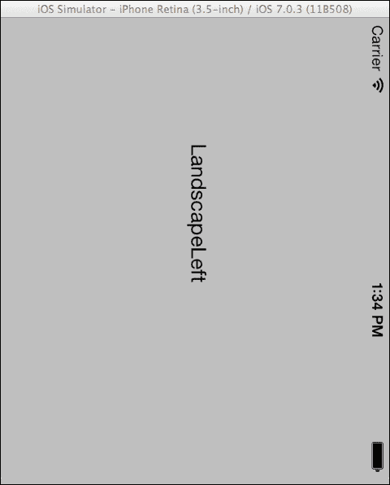
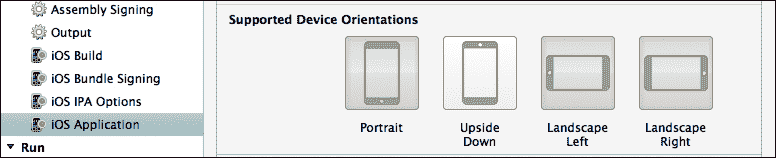
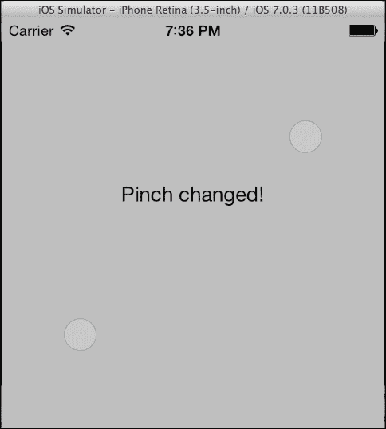
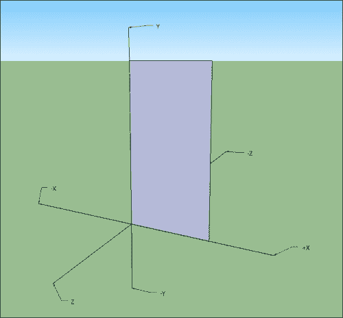

# 第九章。与设备硬件交互

在本章中，我们将涵盖以下主题：

+   检测设备方向

+   调整 UI 方向

+   距离传感器

+   获取电池信息

+   处理运动事件

+   处理触摸事件

+   识别手势

+   自定义手势

+   使用加速度计

+   使用陀螺仪

# 简介

当前的移动设备配备了非常先进的硬件，无论是用于检测运动和方向的加速度计，还是距离传感器、GPS 模块，以及许多其他组件中的复杂多点触控屏幕。

在本章中，我们将重点关注如何在我们的应用程序中使用这项硬件，为用户提供一个扩展到 3D 世界的体验。具体来说，我们将讨论如何根据设备的位置调整用户界面方向，如何使用距离传感器，以及如何读取电池信息。在一系列四个任务中，我们将学习如何捕捉屏幕上的用户触摸并识别手势。

最后但同样重要的是，我们将创建高级应用程序，读取加速度计和陀螺仪传感器的原始数据，以详细和简单的指南检测设备运动和旋转。

# 检测设备方向

在本食谱中，我们将学习如何创建一个能够感知设备方向变化的程序。

## 准备工作

在 Xamarin Studio 中创建一个新的**单视图应用程序**，并将其命名为`DeviceOrientationApp`。

## 如何做到这一点...

执行以下步骤：

1.  向控制器添加一个标签。

1.  在`DeviceOrientationAppViewController`类中，重写`ViewWillAppear`方法并使用以下代码实现：

    ```swift
    private NSObject orientationObserver;
    public override void ViewWillAppear (bool animated)
    {
      base.ViewWillAppear (animated);
      UIDevice.CurrentDevice.BeginGeneratingDeviceOrientationNotifications();
      this.orientationObserver = UIDevice.Notifications.ObserveOrientationDidChange((s, e) => {
        this.lblOrientation.Text = UIDevice.CurrentDevice.Orientation.ToString();
      });
    }
    ```

1.  使用以下代码重写`ViewWillDisappear`方法：

    ```swift
    public override void ViewWillDisappear (bool animated)
    {
      base.ViewWillDisappear (animated);
      NSNotificationCenter.DefaultCenter.RemoveObserver(this.orientationObserver);
        UIDevice.CurrentDevice.EndGeneratingDeviceOrientationNotifications();
    }
    ```

1.  在模拟器上编译并运行应用程序。通过在 Mac 上按住*Command*键并按左右箭头键来旋转模拟器。

## 它是如何工作的...

尽管模拟器缺少加速度计硬件，但它支持方向变化的通知。

设备方向通知机制可以通过`UIDevice.CurrentDevice`静态属性访问。为了接收通知，我们首先需要指示运行时发出它们。我们使用以下方法来完成：

```swift
UIDevice.CurrentDevice.BeginGeneratingDeviceOrientationNotifications();
```

此方法打开加速度计并开始生成方向通知。然后我们需要开始观察通知，以便对变化做出响应，如下面的代码所示：

```swift
this.orientationObserver = UIDevice.Notifications.ObserveOrientationDidChange((s, e) => {
  this.lblOrientation.Text = UIDevice.CurrentDevice.Orientation.ToString();
});
```

每当设备方向发生变化时，观察者都会触发匿名方法。在匿名方法中，我们将从`Orientation`属性获取的方向输出到标签。

`ViewWillDisappear`方法是在视图控制器即将隐藏时被调用的方法（例如，当我们在一个导航控制器上推送另一个视图控制器时）。在其内部，我们确保移除方向观察者，并使用以下代码指示运行时停止生成方向通知：

```swift
NSNotificationCenter.DefaultCenter.RemoveObserver(this.orientationObserver);
UIDevice.CurrentDevice.EndGeneratingDeviceOrientationNotifications();
```

## 更多内容...

`UIDevice`类的`Orientation`属性返回`UIDeviceOrientation`类型的枚举。其可能的值如下：

+   `Unknown`: 这表示设备方向未知

+   `Portrait`: 这表示设备处于正常的纵向方向，主页按钮在底部

+   `PortraitUpsideDown`: 这表示设备处于颠倒的纵向方向，主页按钮在顶部

+   `LandscapeLeft`: 这表示设备处于横屏方向，主页按钮在左侧

+   `LandscapeRight`: 这表示设备处于横屏方向，主页按钮在右侧

+   `FaceUp`: 这表示设备与地面平行，屏幕朝上

+   `FaceDown`: 这表示设备与地面平行，屏幕朝下

`FaceUp`和`FaceDown`是模拟器上无法复制的两个值。

### 设备方向和用户界面方向

用户界面——在这种情况下，视图控制器——将默认旋转并调整到新的屏幕方向。然而，需要注意的是，设备方向和用户界面方向可能不同。例如，设备可以是横屏，`UIDevice.CurrentDevice.Orientation`返回`LandscapeLeft`，而视图控制器的外观没有任何变化。

## 参见

+   *调整 UI 方向*配方

+   *使用加速度计*配方

# 调整 UI 方向

在本章中，我们将学习如何根据屏幕方向旋转用户界面。

## 准备工作

在 Xamarin Studio 中创建一个新的**单视图应用程序**，并将其命名为`UIOrientationApp`。

## 如何做到这一点...

执行以下步骤：

1.  在视图控制器中添加一个标签。

1.  覆盖`ShouldAutoRotate`方法：

    ```swift
    public override bool ShouldAutorotate ()
    {
      return true;
    }
    ```

1.  覆盖`GetSupportedInterfaceOrientations`方法：

    ```swift
    public override UIInterfaceOrientationMask GetSupportedInterfaceOrientations ()
    {
      return UIInterfaceOrientationMask.All;
    }
    ```

1.  覆盖`DidRotate`方法：

    ```swift
    public override void DidRotate (UIInterfaceOrientation fromInterfaceOrientation)
    {
      base.DidRotate (fromInterfaceOrientation);
      this.lblOrientation.Text = this.InterfaceOrientation.ToString();
    }
    ```

1.  在模拟器上编译并运行应用程序。通过按*Command*键和左箭头键或右箭头键旋转模拟器。当前的用户界面方向将在模拟器屏幕上显示。

    尝试旋转模拟器两次，将纵向方向颠倒。你会注意到用户界面不会旋转到这个方向，而将保持在横屏，如下面的截图所示：

    

## 它是如何工作的...

在加载的每个视图控制器上，系统会调用`ShouldAutoRotate`方法以确定是否应该旋转特定的控制器。如果该方法返回`true`，则系统会调用`GetSupportedInterfaceOrientations`方法以确定控制器可以旋转到哪些方向。以下代码显示了`GetSupportedInterfaceOrientations`方法的实现：

```swift
public override UIInterfaceOrientationMask GetSupportedInterfaceOrientations ()
{
  return UIInterfaceOrientationMask.All;
}
```

然而，在`Info.plist`文件中有一个全局设置，它对所有视图控制器的方向设置具有优先权。这可以通过项目选项下的**iOS 应用程序**节点访问。默认设置如下截图所示：



这也解释了为什么当设备倒置时，尽管我们从`GetSupportedInterfaceOrientations`方法返回`UIInterfaceOrientationMask.All`，我们的用户界面仍然不会旋转。为了使视图控制器支持`PortraitUpsideDown`方向，我们必须通过方向设置启用**倒置**选项。

类似地，如果我们想让用户界面只保持特定的方向，比如横屏，我们只需从`GetSupportedInterfaceOrientations`方法返回`UIInterfaceOrientationMask.Portrait`，确保在项目设置中至少启用了**横屏**方向。

## 更多...

只要应用支持一个方向，视图控制器就会在运行时调整到它，如果我们想要它这样做的话。例如，如果我们以模态方式呈现第二个视图控制器，并且我们只想在横屏方向显示该视图控制器，我们就会实现它的`GetSupportedInterfaceOrientations`方法，如下面的代码所示：

```swift
public override UIInterfaceOrientationMask GetSupportedInterfaceOrientations() {
  return UIInterfaceOrientationMask.LandscapeLeft | UIInterfaceOrientationMask.LandscapeRight;
}
```

### 子控制器用户界面方向

在我们在这里创建的项目中，如果`UIOrientationAppViewController`被呈现为一个子视图控制器（例如，通过`UINavigationController`），它的`ShouldAutoRotate`和`GetSupportedInterfaceOrientations`方法将不会被调用，而是会调用`UINavigationController`的方法，并返回相应的默认值。

在这种情况下，为了确保用户界面会根据当前控制器旋转，我们不得不子类化`UINavigationController`并重写这两个方法，从导航堆栈中当前活动的视图控制器返回相应的值，如下面的代码所示：

```swift
// Inside our UINavigationController subclass:
public override ShouldAutoRotate() {
  return this.TopViewController.ShouldAutoRotate();
}
public override UIInterfaceOrientationMask GetSupportedInterfaceOrientations() {
  return this.TopViewController.GetSupportedInterfaceOrientations();
}
```

这适用于任何父子控制器关系，例如，如果我们的父控制器是`UITabBarController`等等。

## 参见

+   *检测设备方向*菜谱

+   *使用加速度计*菜谱

+   在第三章的*通过不同的视图控制器导航*菜谱中，*用户界面 – 视图控制器*

# 接近传感器

在这个菜谱中，我们将讨论如何使用接近传感器来禁用设备屏幕。

## 准备工作

在 Xamarin Studio 中创建一个新的**单视图应用程序**，并将其命名为`ProximitySensorApp`。

### 注意

模拟器不支持接近传感器。

## 如何做到这一点...

执行以下步骤：

1.  对于这个项目，在视图控制器上不需要任何控件。使用以下命令声明一个`NSObject`字段，该字段将用于保存通知观察者：

    ```swift
    private NSObject proximityObserver;
    ```

1.  覆盖控制器中的`ViewWillAppear`方法并按照以下代码实现：

    ```swift
    public override void ViewWillAppear (bool animated)
    {
      base.ViewWillAppear (animated);
      UIDevice.CurrentDevice.ProximityMonitoringEnabled = true;
      if (UIDevice.CurrentDevice.ProximityMonitoringEnabled)
      {
        this.proximityObserver = UIDevice.Notifications.ObserveProximityStateDidChange((s, e) => {
          Console.WriteLine("Proximity state: {0}", UIDevice.CurrentDevice.ProximityState);
        });
      }
    }
    ```

1.  在设备上编译并运行应用程序。将手指放在接近传感器上（在 iPhone 上，它位于扬声器旁边），并观察 Xamarin Studio 中的**应用程序输出**面板显示的传感器状态。

## 它是如何工作的...

尽管接近传感器的功能相当简单，但它提供了一个非常重要的特性。iOS 设备正面只有一个按钮，即主按钮。几乎所有的用户与设备的交互都是基于触摸屏。这在 iPhone 上造成了一个问题；除了其多种功能外，它还是一部电话。这意味着它很可能会在用户的脸部侧面花费一些时间来进行通话。

为了避免意外点击虚拟按钮，当手机应用运行时，接近传感器会被激活以禁用屏幕，当设备靠近用户的耳朵或传感器上方的任何物体时。

要启用接近传感器，将`UIDevice.CurrentDevice.ProximityMonitoringEnabled`属性的值设置为`true`：

```swift
UIDevice.CurrentDevice.ProximityMonitoringEnabled = true;
```

如果设备不支持接近传感器，即使将其设置为`true`，此属性也会返回`false`。因此，在将其设置为`true`之后，我们可以通过以下代码检查设备是否支持传感器：

```swift
if (UIDevice.CurrentDevice.ProximityMonitoringEnabled)
```

在检查了接近传感器的支持后，我们可以添加一个观察者，通过以下代码来接收传感器状态的通知：

```swift
this.proximityObserver = UIDevice.Notifications.ObserveProximityStateDidChange((s, e) => {
  Console.WriteLine("Proximity state: {0}", UIDevice.CurrentDevice.ProximityState);
});
```

`ProximityState`属性返回`true`表示传感器已关闭屏幕，返回`false`表示它已重新打开。

## 还有更多...

接近传感器的使用不仅限于电话功能。例如，如果你正在开发一个在设备放在用户的口袋或钱包中时可以执行某些工作的应用程序，启用接近传感器可以帮助你确保不会意外点击控制按钮。你甚至可以通过关闭屏幕来节省电池电量。

## 相关内容

+   *获取电池信息*配方

# 获取电池信息

在这个配方中，我们将学习如何读取设备的充电状态及其电池使用情况。

## 准备工作

在 Xamarin Studio 中创建一个新的**单视图应用程序**，并将其命名为`BatteryInfoApp`。

## 如何实现...

执行以下步骤：

1.  在控制器的视图中添加一个标签。

1.  按照以下方式覆盖控制器类中的`ViewWillAppear`方法：

    ```swift
    private NSObject batteryStateChangeObserver;
    public override void ViewWillAppear (bool animated)
    {
      base.ViewWillAppear (animated);
      UIDevice.CurrentDevice.BatteryMonitoringEnabled = true;
     this.batteryStateChangeObserver = UIDevice.Notifications.ObserveBatteryStateDidChange((s, e) => {
     this.lblOutput.Text = string.Format("Battery level: {0}", UIDevice.CurrentDevice.BatteryLevel);
     Console.WriteLine("Battery state: {0}", UIDevice.CurrentDevice.BatteryState);
     });
    }
    ```

1.  在设备上编译并运行应用程序。在应用程序加载后，断开并/或连接设备的 USB 线缆。电池电量将在标签上显示，当前状态将在**应用程序输出**面板中显示。

## 它是如何工作的...

我们可以通过`UIDevice`类来检索电池信息。我们必须做的第一件事是启用电池监控：

```swift
UIDevice.CurrentDevice.BatteryMonitoringEnabled = true;
```

在不支持电池监控的模拟器上，即使我们将它设置为`true`，此属性也会返回`false`。

我们可以通过在前面章节中突出显示的代码中通过`UIDevice.BatteryStateDidChangeNotification`键添加一个观察者，来为电池状态变化通知添加观察者。电池电平可以通过`BatteryLevel`属性检索，该属性返回电池的充电百分比，范围在`0`到`1`之间（`0`表示完全放电，`1`表示 100%充电），如下面的代码所示：

```swift
this.lblOutput.Text = string.Format("Battery level: {0}", UIDevice.CurrentDevice.BatteryLevel);
```

同样，我们可以通过以下代码使用`BatteryState`属性检索电池的状态：

```swift
Console.WriteLine("Battery state: {0}", UIDevice.CurrentDevice.BatteryState);
```

`BatteryState`属性的可能的值如下：

+   `Unknown`: 这表示无法确定电池状态或电池监控已禁用

+   `Unplugged`: 这表示设备正在使用电池供电

+   `Charging`: 这表示设备电池正在充电，并且 USB 线已连接

+   `Full`: 这表示设备电池已满，并且 USB 线已连接

## 还有更多...

除了电池状态外，我们还可以获取其电量信息。为此，我们需要为`UIDevice.BatteryLevelDidChangeNotification`键添加一个观察者，如下面的代码所示：

```swift
private NSObject batteryLevelChangedObserver;
//...
this.batteryLevelChangedObserver = UIDevice.Notifications.ObserveBatteryLevelDidChange((s, e) => {..//
```

### 禁用电池监控

在不需要时始终禁用电池监控。实际的监控机制本身消耗了大量的电池电量。

## 参见

+   *接近传感器* 菜谱

# 处理运动事件

在这个菜谱中，我们将学习如何拦截和响应摇动手势。

## 准备工作

在 Xamarin Studio 中创建一个新的**单视图应用程序**，并将其命名为`MotionEventsApp`。

## 如何做到这一点...

执行以下步骤：

1.  在控制器的视图中添加一个标签。

1.  在`MotionEventsAppViewController`类中输入以下代码：

    ```swift
    public override bool CanBecomeFirstResponder
    {
      get {  return true; }
    }
    public override void ViewDidAppear (bool animated)
    {
      base.ViewDidAppear (animated);
      this.BecomeFirstResponder();
    }
    public override void MotionBegan (UIEventSubtype motion, UIEvent evt)
    {
      base.MotionBegan (motion, evt);
      this.lblOutput.Text = "Motion started!";
    }
    public override void MotionEnded (UIEventSubtype motion, UIEvent evt)
    {
      base.MotionEnded (motion, evt);
      this.lblOutput.Text = "Motion ended!";
    }
    public override void MotionCancelled (UIEventSubtype motion, UIEvent evt)
    {
      base.MotionCancelled (motion, evt);
      this.lblOutput.Text = "Motion cancelled!";
    }
    ```

1.  在设备上编译并运行应用程序。摇动设备并观察标签上的输出。

### 注意

您也可以在模拟器上测试此应用程序。加载后，在菜单栏上导航到**硬件** | **摇动手势**。

## 它是如何工作的...

通过重写`UIViewController`类的运动方法，我们可以拦截和响应系统发送的运动事件。然而，仅仅重写这些方法是不够的。为了控制器能够接收运动事件，它需要成为第一个响应者。为了确保这一点，我们首先重写`CanBecomeFirstResponder`属性，并从其中返回`true`，如下面的代码所示：

```swift
public override bool CanBecomeFirstResponder
{
  get {  return true; }
}
```

然后，我们确保当视图出现时，我们的控制器成为第一个响应者，通过在`ViewDidAppear`重写方法中调用`BecomeFirstResponder`方法，如下面的代码所示：

```swift
public override void ViewDidAppear (bool animated)
{
  base.ViewDidAppear (animated);
  this.BecomeFirstResponder();
}
```

`ViewDidAppear`方法在视图出现在屏幕上后被调用。

系统确定一个动作是否是摇动手势，并调用相应的方法。我们可以重写和捕获摇动手势的方法如下：

+   `MotionBegan`: 这表示摇动动作已经开始

+   `MotionEnded`：这意味着震动动作已经结束

+   `MotionCancelled`：这意味着震动动作已被取消

当设备开始移动时，会调用`MotionBegan`方法。如果运动持续大约一秒或更短，则调用`MotionEnded`方法。如果它持续更长，系统将其分类为不是震动手势，并调用`MotionCancelled`方法。当我们想在应用程序中实现震动手势时，建议重写所有这三个方法并相应地做出反应。

## 更多...

只有继承自`UIResponder`类的对象才会发送运动事件。这包括`UIView`和`UIViewController`类。

### 更多关于运动事件的信息

运动事件机制相当简单。它仅仅检测近瞬间的设备震动，而不提供有关其方向或速率的任何信息。为了根据不同的特性处理运动事件，可以将加速度计与组合使用。

## 参见

+   *使用加速度计*菜谱

# 处理触摸事件

在这个菜谱中，我们将学习如何拦截和响应用户触摸。

## 准备工作

在 Xamarin Studio 中创建一个新的**单视图应用程序**，并将其命名为`TouchEventsApp`。

## 如何做...

执行以下步骤：

1.  将一个标签添加到控制器视图。

1.  在`TouchEventsAppViewController`类中输入以下代码：

    ```swift
    public override void TouchesMoved (NSSet touches, UIEvent evt)
    {
      base.TouchesMoved (touches, evt);
      UITouch touch = touches.AnyObject as UITouch;
      UIColor currentColor = this.View.BackgroundColor;
      float red, green, blue, alpha;
      currentColor.GetRGBA(out red, out green, out blue, out alpha);
      PointF previousLocation = touch.PreviousLocationInView(this.View);
      PointF touchLocation = touch.LocationInView(this.View);
      if (previousLocation.X != touchLocation.X)
      {
        this.lblOutput.Text = "Changing background color...";
        float colorValue = touchLocation.X / this.View.Bounds.Width;
        this.View.BackgroundColor = UIColor.FromRGB(colorValue, colorValue, colorValue);
      }
    }
    ```

1.  在模拟器上编译并运行应用程序。在模拟器的屏幕上点击并拖动光标，观察视图的背景颜色逐渐从白色变为黑色。请注意，在模拟器屏幕上用光标点击相当于用手指触摸设备屏幕。

## 它是如何工作的...

要响应用户触摸，充当触摸接收器的对象必须将其`UserInteractionEnabled`属性设置为`true`。默认情况下，几乎所有对象都启用了用户交互，除非它们的主要用途不是直接用于用户交互，例如`UILabel`和`UIImageView`对象。如果我们想让这些对象对用户触摸敏感，我们需要明确地将`UserInteractionEnabled`设置为这些对象。除此之外，可以处理触摸事件的对象必须继承自`UIResponder`类。请注意，尽管`UIViewController`类继承自`UIResponder`并且可以捕获触摸事件，但它没有`UserInteractionEnabled`属性，而是它的主要属性`UIView`控制着触摸事件的传递。这意味着，如果你重写了`UIViewController`的触摸方法，但它的视图的`UserInteractionEnabled`属性设置为`false`，这些方法将不会响应用户触摸。

负责处理触摸事件的方法如下：

+   `TouchesBegan`：当用户触摸屏幕时被调用

+   `TouchesMoved`：当用户在屏幕上拖动手指时被调用

+   `TouchesEnded`：当用户从屏幕上抬起手指时调用

+   `TouchesCancelled`：当触摸事件被系统事件取消时调用，例如，当显示通知警报时

整个项目可以在可下载的源代码中找到。`TouchesMoved`方法实现已在下面解释。

每个触摸方法都有两个参数。第一个参数是`NSSet`类型，包含`UITouch`对象。`NSSet`类表示一组对象，而`UITouch`类保存每个用户触摸的信息。第二个参数是`UIEvent`类型，包含实际事件的信息。

我们可以通过使用以下代码通过`NSSet.AnyObject`返回值检索与实际触摸相关的`UITouch`对象：

```swift
UITouch touch = touches.AnyObject as UITouch;
```

它返回一个`NSObject`类型的对象，我们将它转换为`UITouch`。我们可以通过以下方法获取触摸的先前和当前位置：

```swift
PointF previousLocation = touch.PreviousLocationInView(this.View);
PointF touchLocation = touch.LocationInView(this.View);
```

前两种方法都返回一个`PointF`结构体，其中包含触摸在接收者坐标系中的位置。在接收到触摸位置后，我们相应地调整背景颜色。

## 更多...

本示例基于单个用户的触摸。为了使视图能够响应多个触摸，我们必须将其`MultipleTouchEnabled`属性设置为`true`。然后我们可以从数组中获取所有的`UITouch`对象：

```swift
UITouch[] allTouches = touches.ToArray<UITouch>();
```

### 获取点击次数

我们可以通过在`ToucheEnded`方法内部使用`UITouch.TapCount`属性来确定连续用户点击的次数。

## 参见

+   *处理运动事件*食谱

+   *识别手势*食谱

+   *自定义手势*食谱

# 识别手势

在本食谱中，我们将讨论如何识别触摸手势并相应地做出反应。

## 准备工作

在 Xamarin Studio 中创建一个新的**单视图应用程序**，并将其命名为`GestureApp`。

## 如何做...

执行以下步骤：

1.  在控制器的视图中添加一个标签。

1.  在`GestureAppViewController`类中添加以下方法：

    ```swift
    private void OnPinchGesture(UIPinchGestureRecognizer pinch)
    {
      switch (pinch.State)
      {
      case UIGestureRecognizerState.Began:
        this.lblOutput.Text = "Pinch began!";
        break;
      case UIGestureRecognizerState.Changed:
        this.lblOutput.Text = "Pinch changed!";
        break;
      case UIGestureRecognizerState.Ended:
        this.lblOutput.Text = "Pinch ended!";
        break;
      }
    }
    ```

1.  在`ViewDidLoad`方法中添加以下代码：

    ```swift
    UIPinchGestureRecognizer pinchGesture = new UIPinchGestureRecognizer(this.OnPinchGesture);
    this.View.AddGestureRecognizer(pinchGesture);
    ```

1.  在模拟器上编译并运行应用程序。按住*选项*键并点击拖动鼠标以执行模拟器屏幕上的捏合动作。

    在模拟器上按住选项键并拖动鼠标光标相当于用两只手指触摸设备的屏幕，如下面的截图所示：

    

## 它是如何工作的...

随着 iOS 3.2 版本的发布，iPad 一同推出，苹果公司引入了`UIGestureRecognizer`类及其派生类。手势识别器利用 iOS 设备上的多点触控屏幕。手势基本上是用于特定动作的触摸组合。

例如，在原生*照片*应用程序的全屏图像上缩放手势，将缩小图像。缩放手势是用户执行的手势，而手势识别器负责识别并将手势事件传递给接收器。

在这个例子中，我们创建了一个`UIPinchGestureRecognizer`实例，它将识别屏幕上执行的手势。其实例是通过以下代码创建的：

```swift
UIPinchGestureRecognizer pinchGesture = new UIPinchGestureRecognizer(this.OnPinchGesture);
```

初始化实例的构造函数接受一个参数，该参数为`Action<UIPinchGestureRecognizer>`类型，表示当识别器接收到手势时将被调用的方法。

在方法内部，我们读取手势识别器对象的`State`属性并根据情况进行响应，如下面的代码所示：

```swift
switch (pinch.State) { 
//…
```

## 还有更多...

每个手势识别器的状态由`UIGestureRecognizerState`类型的枚举表示。其可能的值如下所示：

+   `Possible`：这表示手势尚未被识别。这是默认值。

+   `Began`：这表示手势已开始。

+   `Changed`：这表示手势已改变。

+   `Ended`：这表示手势已结束。

+   `Cancelled`：这表示手势已被取消。

+   `Failed`：这表示无法识别手势。

+   `Recognized`：这表示手势已被识别。

### 手势识别器的优势

手势识别器的优势在于它们可以节省开发者创建自己的手势识别机制的时间，通过触摸事件实现。此外，它们基于用户在 iOS 设备上习惯使用的手势。

## 参见

+   *处理触摸事件*配方

+   *自定义手势*配方

# 自定义手势

在这个配方中，我们将学习如何创建自定义手势识别器以创建我们自己的手势响应机制。

## 准备工作

在 Xamarin Studio 中创建一个新的**单视图应用程序**，并将其命名为`CustomGestureApp`。

## 如何做到...

执行以下步骤：

1.  在控制器的视图中添加一个标签。

1.  在`CustomGestureAppViewController`类中创建以下嵌套类：

    ```swift
    private class DragLowerLeftGesture : UIGestureRecognizer
    {
      private PointF startLocation;
      private RectangleF lowerLeftCornerRect;
      public override UIGestureRecognizerState State
      {
        get
        {
          return base.State;
        }  set
        {
          base.State = value;
        }
      }
      public override void TouchesBegan (NSSet touches, UIEvent evt)
      {
        base.TouchesBegan (touches, evt);
        UITouch touch = touches.AnyObject as UITouch;
        this.startLocation = touch.LocationInView(this.View);
        RectangleF viewBounds = this.View.Bounds;
        this.lowerLeftCornerRect = new RectangleF(0f, viewBounds.Height - 50f, 50f, 50f);
        if (this.lowerLeftCornerRect.Contains(this.startLocation))
        {
          this.State = UIGestureRecognizerState.Failed;
        }  else
        {
          this.State = UIGestureRecognizerState.Began;
        }
      }
      public override void TouchesMoved (NSSet touches, UIEvent evt)
      {
        base.TouchesMoved (touches, evt);
        this.State = UIGestureRecognizerState.Changed;
      }
      public override void TouchesEnded (NSSet touches, UIEvent evt)
      {
        base.TouchesEnded (touches, evt);
        UITouch touch = touches.AnyObject as UITouch;
        PointF touchLocation = touch.LocationInView(this.View);
        if (this.lowerLeftCornerRect.Contains(touchLocation))
        {
          this.State = UIGestureRecognizerState.Ended;
        }  else
        {
          this.State = UIGestureRecognizerState.Failed;
        }
      }
    }
    ```

1.  将以下方法添加到类中：

    ```swift
    private void OnDragLowerLeft(NSObject gesture)
    {
      DragLowerLeftGesture drag = (DragLowerLeftGesture)gesture;
      switch (drag.State)
      {
      case UIGestureRecognizerState.Began:
        this.lblOutput.Text = "Drag began!";
        break;
      case UIGestureRecognizerState.Changed:
        this.lblOutput.Text = "Drag changed!";
        break;
      case UIGestureRecognizerState.Ended:
        this.lblOutput.Text = "Drag ended!";
        break;
      case UIGestureRecognizerState.Failed:
        this.lblOutput.Text = "Drag failed!";
        break;
      }
    }
    ```

1.  如下所示，在`ViewDidLoad`方法中初始化并添加手势识别器：

    ```swift
    DragLowerLeftGesture dragGesture = new DragLowerLeftGesture();
    dragGesture.AddTarget(this.OnDragLowerLeft);
    this.View.AddGestureRecognizer(dragGesture);
    ```

1.  在模拟器上编译并运行应用程序。在模拟器的屏幕上点击并拖动到左下角。

## 它是如何工作的...

要创建手势识别器，我们需要声明一个继承自`UIGestureRecognizer`类的类。在这个例子中，我们创建了一个手势，用户可以通过在屏幕上拖动手指到屏幕左下角的 50 x 50 点区域来识别这个手势。以下代码行显示了类声明：

```swift
private class DragLowerLeftGesture : UIGestureRecognizer
```

`UIGestureRecognizer` 类包含我们用来在视图中拦截触摸的相同触摸方法。我们还可以通过其 `View` 属性访问它所添加到的视图。在 `TouchesBegan` 方法中，我们确定初始触摸位置。如果它在视图的左下角外部，我们将 `State` 属性设置为 `Began`。如果它在左下角内部，我们将 `State` 属性设置为 `Failed`，这样回调就不会被调用。

在 `TouchesEnded` 方法中，如果触摸的位置在视图的左下角内部，我们考虑手势为 `Ended`。如果没有，手势识别被认为是 `Failed`。

`TouchesMoved` 方法是设置 `Changed` 状态的地方。对于这个简单的手势识别器，不需要其他逻辑。

由于 `UIGestureRecognizer` 类没有接受手势处理程序的 `Action<T>` 对象的构造函数，我们使用默认构造函数初始化它，并使用以下代码通过 `AddTarget` 方法来达到这个目的：

```swift
dragGesture.AddTarget(this.OnDragLowerLeft);
```

在这种情况下，唯一的区别是参数是 `Action<NSObject>` 类型，我们可以将其转换为我们的自定义类型，如下面的代码行所示：

```swift
DragLowerLeftGesture drag = (DragLowerLeftGesture)gesture;
```

## 更多...

这是一个简单的手势识别器，它依赖于单个触摸。通过触摸方法提供的信息，我们可以创建更复杂的支持多个触摸的手势。

### 自定义手势识别器的另一种用途

有一些视图继承自 `UIView` 类，根据苹果开发者文档，这些类不应该被子类化。`MKMapView` 类代表这些用于显示地图的视图之一。如果我们想拦截这些视图的触摸事件，这会引发问题。虽然我们可以在其上使用另一个视图并拦截该视图的触摸事件，但这相当复杂（且容易出错）。一个更简单的方法是创建一个简单的自定义手势识别器并将其添加到我们无法子类化的视图中。这样，我们可以在不子类化的情况下拦截其触摸。

## 参见

+   *识别手势* 菜单

+   *处理触摸事件* 菜单

# 使用加速度计

在这个菜谱中，我们将学习如何接收加速度计事件以创建一个能够感知设备运动的 app。

## 准备工作

在 Xamarin Studio 中创建一个新的 **单视图应用程序** 并命名为 `AccelerometerApp`。

### 注意

模拟器不支持加速度计硬件。本例中的项目将在设备上正确运行。

## 如何操作...

执行以下步骤：

1.  在控制器的视图中添加两个按钮和一个标签。

1.  在 `ViewDidLoad` 方法中，添加以下代码：

    ```swift
    this.btnStop.Enabled = false;
    UIAccelerometer.SharedAccelerometer.UpdateInterval = 1 / 
      10;
    this.btnStart.TouchUpInside += delegate {
      this.btnStart.Enabled = false;
      UIAccelerometer.SharedAccelerometer.Acceleration += this.Acceleration_Received;
      this.btnStop.Enabled = true;
    } ;
    this.btnStop.TouchUpInside += delegate {
      this.btnStop.Enabled = false;
      UIAccelerometer.SharedAccelerometer.Acceleration -= this.Acceleration_Received;
      this.btnStart.Enabled = true;
    } ;
    ```

1.  在类中添加以下方法：

    ```swift
    private void Acceleration_Received (object sender, UIAccelerometerEventArgs e)
    {
      this.lblOutput.Text = string.Format("X: {0}\nY: {1}\nZ: {2}", e.Acceleration.X, e.Acceleration.Y, e.Acceleration.Z);
    }
    ```

1.  在设备上编译并运行 app。轻触 **开始加速度计** 按钮，并观察在移动或摇晃设备时值在标签上显示。

## 它是如何工作的...

`UIAccelerometer`类通过其`SharedAccelerometer`静态属性提供对加速度计硬件的访问。要激活它，我们只需要将其`Acceleration`事件分配给一个处理器，使用以下代码：

```swift
UIAccelerometer.SharedAccelerometer.Acceleration += this.Acceleration_Received;
```

在处理器内部，我们通过`UIAccelerometerEventArgs.Acceleration`属性接收加速度计的值。该属性返回一个`UIAcceleration`类型的对象，它包含三个属性：`X`、`Y`和`Z`。这些属性代表*x*轴、*y*轴和*z*轴的运动。考虑以下截图：



这些值中的每一个都测量设备在每个轴上移动的 G 力的大小。例如，如果`X`的值为`1`，则设备在*x*轴上向右移动，加速度为 1G。如果`X`的值为`-1`，则设备在*x*轴上向左移动，加速度为 1G。当设备背对地面放置在桌子上且不移动时，加速度的正常值应接近或等于以下值：

+   `X`: `0`

+   `Y`: `0`

+   `Z`: `-1`

尽管设备没有移动，但 Z 将为`-1`，因为设备测量地球的重力。

我们可以通过设置加速度计发布加速度事件的时间间隔来设置，通过使用以下代码设置其`UpdateInterval`属性：

```swift
UIAccelerometer.SharedAccelerometer.UpdateInterval = 1 / 10;
```

该属性接受一个`double`类型的数字，它表示加速度计在秒内发布加速度事件的时间间隔。设置更新间隔时必须小心，因为加速度计在特定时间内需要发布的更多事件，它消耗的电量就越多。

要停止使用加速度计，我们只需要通过以下代码从`Acceleration`事件中取消绑定处理器：

```swift
UIAccelerometer.SharedAccelerometer.Acceleration -= this.Acceleration_Received;
```

## 还有更多...

`UIAcceleration`类还包含另一个有用的属性，名为`Time`。它是一个`double`，表示加速度事件发生的相对时间。它是相对于 CPU 时间的，不建议您使用此值来计算事件的精确时间戳。

### 使用加速度计时的注意事项

虽然 iPhone 的加速度计是一个非常精确和敏感的传感器，但不应该用于精确测量。此外，它产生的结果可能在不同 iOS 设备之间有所不同，即使它们是同一型号。

## 参见

+   使用陀螺仪的食谱

# 使用陀螺仪

在这个食谱中，我们将学习如何使用设备的内置陀螺仪。

## 准备工作

在 Xamarin Studio 中创建一个新的项目，并将其命名为`GyroscopeApp`。

### 注意

模拟器不支持陀螺仪硬件。此外，只有较新的设备才包含陀螺仪。如果此应用程序在没有陀螺仪的设备或模拟器上运行，则不会发生错误，但不会显示数据。

## 如何做到这一点...

执行以下步骤：

1.  在控制器视图中添加两个按钮和一个标签。

1.  在`GyroscopeAppViewController.cs`文件中添加`MonoTouch.CoreMotion`命名空间。

1.  在类中输入以下私有字段：

    ```swift
    private CMMotionManager motionManager;
    ```

1.  使用以下代码实现`ViewDidLoad`方法：

    ```swift
    this.motionManager = new CMMotionManager();
    this.motionManager.GyroUpdateInterval = 1 / 10;
    this.btnStart.TouchUpInside += delegate {
      this.motionManager.StartGyroUpdates(NSOperationQueue.MainQueue, this.GyroData_Received);
    } ;
    this.btnStop.TouchUpInside += delegate {
      this.motionManager.StopGyroUpdates();
    } ;
    ```

    添加以下方法：

    ```swift
    private void GyroData_Received(CMGyroData gyroData, NSError error)
    {
      Console.WriteLine("rotation rate x: {0}, y: {1}, z: {2}", gyroData.RotationRate.x, gyroData.RotationRate.y, gyroData.RotationRate.z);
    }
    ```

1.  在设备上编译并运行应用程序。轻触**开始陀螺仪**按钮，并在所有轴上旋转设备。观察值在**应用程序输出**面板中显示。

## 它是如何工作的...

陀螺仪是一种测量方向的机制。较新的 iOS 设备支持陀螺仪硬件，以及加速度计，以提供更精确的设备运动测量。

`MonoTouch.CoreMotion`命名空间封装了原生 CoreMotion 框架中的对象。在代码中使用陀螺仪硬件的过程与用于加速度计的过程类似。第一个区别是`UIApplication`类中没有针对陀螺仪的单个对象。因此，我们需要创建`CMMotionManager`类的实例，如下面的代码所示：

```swift
private CMMotionManager motionManager;
//...
   this.motionManager = new CMMotionManager();
```

就像我们使用加速度计一样，我们可以通过以下代码设置我们将以秒为间隔接收陀螺仪事件：

```swift
this.motionManager.GyroUpdateInterval = 1 / 10;
```

要开始接收陀螺仪事件，我们调用对象的`StartGyroUpdates`方法，如下面的代码所示：

```swift
this.motionManager.StartGyroUpdates(NSOperationQueue.MainQueue, this.GyroData_Received);
```

此方法被重载；第一个重载是无参数的，当被调用时，陀螺仪测量值的`GyroData`属性被设置。使用这个重载非常简单且容易，但在这里不会触发任何事件，我们必须提供一个机制来从属性中读取测量值。

第二个重载，在此示例中使用，接受两个参数。第一个参数是更新将发生的`NSOperationQueue`参数，第二个参数是当发生更新时将被执行的处理器。

`NSOperationQueue`类代表 iOS 管理`NSOperation`对象执行的一种机制。我们通过静态`NSOperationQueue.MainQueue`属性访问运行时的主操作队列。基本上，这种方式，我们指示运行时以更有效的方式管理处理器的传递。

第二个参数是`CMGyroHandler`类型的委托。它的签名，由我们创建的方法表示，类似于以下代码：

```swift
private void GyroData_Received(CMGyroData gyroData, NSError error)
```

`CMGyroData`对象包含从陀螺仪通过其`RotationRate`属性接收到的实际测量值。以下代码输出属性中的数据：

```swift
Console.WriteLine("rotation rate x: {0}, y: {1}, z: {2}", gyroData.RotationRate.x, gyroData.RotationRate.y, gyroData.RotationRate.z);
```

旋转速率反映在*x*、*y*和*z*轴上，分别由相应的`X`、`Y`和`Z`属性表示。每个值是该轴上每秒发生的旋转角度的数量，以弧度为单位。

虽然一开始可能看起来有点复杂，但实际上相当简单。例如，*z* 轴上的值为 0.5 表示设备以 0.5 弧度/秒的速度向左旋转。*z*-轴上的值为 -0.5 表示设备以 0.5 弧度/秒的速度向右旋转。确定旋转方向的模式基于右手定则。

## 更多内容...

如果您希望您的应用程序仅适用于支持陀螺仪的设备，请在项目的 `Info.plist` 文件中添加 `UIRequiredDeviceCapabilities` 键，并使用 `gyroscope` 值。如果您的应用程序的功能完全基于陀螺仪，添加此键是必不可少的，以避免应用程序被较老设备的用户下载，最终导致应用程序无法使用。

### 确定陀螺仪硬件的可用性

要确定运行应用程序的设备是否支持陀螺仪硬件，请检查 `CMMotionManager` 实例的 `GyroAvailable` 属性值。

### 将弧度转换为度数

弧度是角度的测量单位。要将角度测量值从弧度转换为度数，请考虑以下辅助方法：

```swift
public static double RadiansToDegrees (double radians)
{
  return (radians * 180 / Math.PI);
}
```

## 参见

+   *使用加速度计* 菜单
