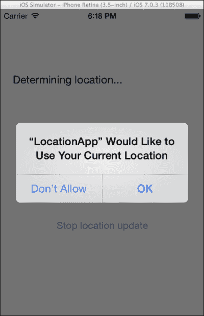
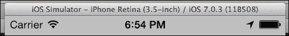
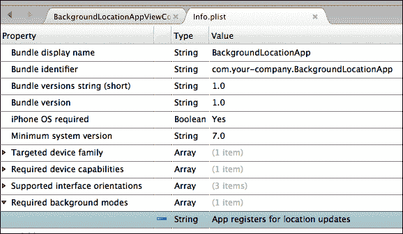
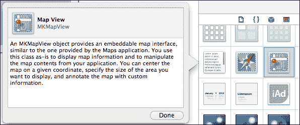
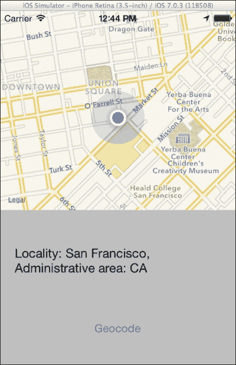
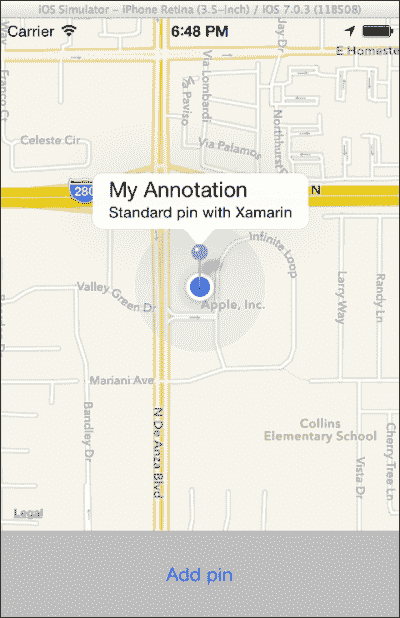
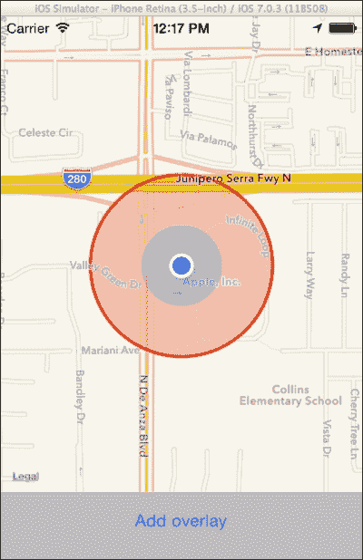
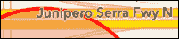

# 第十章：位置服务和地图

在本章中，我们将涵盖以下内容：

+   确定位置

+   确定航向

+   使用区域监控

+   使用显著变化位置服务

+   背景位置服务

+   显示地图

+   地理编码

+   添加地图标注

+   添加地图覆盖

# 简介

当今的智能手机和手持设备都配备了高精度的全球定位系统（GPS）硬件。GPS 硬件从卫星星座接收位置信息。除了卫星之外，iOS 设备还利用蜂窝和 Wi-Fi 网络向用户提供位置信息。

在本章中，我们将讨论如何使用适当的框架来利用设备的位置服务。此外，我们还将学习如何显示地图并对其进行标注。具体来说，我们将重点关注以下主题：

+   **位置服务**：在此，我们将讨论设备上提供位置信息的服务。这些服务如下：

    +   **标准位置服务**：此位置服务完全依赖于设备的 GPS 模块，并提供最高精度的位置数据

    +   **区域监控服务**：此位置服务监控边界穿越

    +   **显著变化位置服务**：此服务监控设备位置的显著变化

+   `CLLocationManager`：此类允许我们使用位置服务

+   `Compass`：此类展示了如何使用内置罗盘

+   `MKMapView`：此视图用于显示地图

+   `CLGeocoder`：此类提供地理编码功能

+   `MKAnnotation`：此类允许我们在地图上添加标注

+   `MKOverlay`：此类允许我们在地图上添加覆盖

# 确定位置

我们现在将学习如何从内置的 GPS 硬件接收位置信息。

## 准备工作

在 Xamarin Studio 中创建一个新的**单视图应用程序**，并将其命名为`LocationApp`。在控制器的视图中添加两个按钮和一个标签。

## 如何操作...

执行以下步骤以接收设备的位置：

1.  要从内置的 GPS 硬件检索位置信息，我们需要使用 Core Location 框架。它通过以下`MonoTouch.CoreLocation`命名空间公开：

    ```swift
    using MonoTouch.CoreLocation;
    ```

1.  在`LocationAppViewController`类中添加以下代码：

    ```swift
    private CLLocationManager locationManager;
    public override void ViewDidLoad ()
    {
      base.ViewDidLoad ();
      this.locationManager = new CLLocationManager();
      this.locationManager.LocationsUpdated += LocationManager_LocationsUpdated;
      this.locationManager.Failed += this.LocationManager_Failed;

      this.btnStart.TouchUpInside += delegate {
        this.lblOutput.Text = "Determining location...";
        this.locationManager.StartUpdatingLocation();
      } ;
      this.btnStop.TouchUpInside += delegate {
        this.locationManager.StopUpdatingLocation();
        this.lblOutput.Text = "Location update stopped.";
      } ;
    }
    private void LocationManager_LocationsUpdated (object sender, CLLocationsUpdatedEventArgs e)
    {
      CLLocation location = e.Locations[0];
      double latitude = Math.Round(location.Coordinate.Latitude, 4);
      double longitude = Math.Round(location.Coordinate.Longitude, 4);
      double accuracy = Math.Round(location.HorizontalAccuracy, 0);
      this.lblOutput.Text = string.Format("Latitude: {0}\nLongitude: {1},\nAccuracy: {2}m", latitude, longitude, accuracy);
    }
    private void LocationManager_Failed (object sender, NSErrorEventArgs e)
    {
      this.lblOutput.Text = string.Format("Location update failed! Error message: {0}", e.Error.LocalizedDescription);
    }
    ```

1.  在设备上编译并运行应用程序。点击开始按钮以在屏幕上查看您的位置坐标。

### 注意

使用 Core Location 框架确定设备当前位置的项目可以在模拟器上运行。通过导航到模拟器的**调试** | **位置**菜单，我们可以自定义设备将使用的位置。

## 工作原理...

通过`CLLocationManager`类可以访问 GPS 模块提供的位置数据。初始化该类的实例后，我们需要订阅其`LocationsUpdated`事件，如下所示：

```swift
this.locationManager = new CLLocationManager();
this.locationManager.LocationsUpdated += LocationManager_LocationsUpdated;
```

位置数据将通过此事件变得可用。同时，订阅`Failed`事件也是一个好的实践，如下所示：

```swift
  this.locationManager.Failed += this.LocationManager_Failed;
```

当位置管理器首次请求位置更新时，用户将通过系统特定的警报得到通知，这与以下截图所示类似：



此警报基本上是请求用户权限，允许应用程序检索位置数据。如果用户拒绝此请求，将触发带有适当信息的`Failed`事件。未来的位置请求将不会触发权限警报，用户必须通过设备的设置启用应用程序的位置服务，因此我们需要相应地处理这种情况。

在订阅适当的事件后，我们通过`StartUpdatingLocation`方法请求位置更新，如下所示：

```swift
this.locationManager.StartUpdatingLocation();
```

要停止接收位置更新，我们按照以下方式调用`StopUpdatingLocation`方法：

```swift
this.locationManager.StopUpdatingLocation();
```

## 还有更多...

`LocationsUpdated`事件接受`EventHandler<CLLocationsUpdatedEventArgs>`类型的委托。`CLLocationsUpdatedEventArgs`参数包含一个属性，该属性返回一个`CLLocation`对象的数组。数组中的最后一个项目包含从位置服务检索到的最新位置数据。数组将始终包含至少一个`CLLocation`项目。

坐标以`double`类型返回，并代表位置坐标的度数，如下所示：

```swift
CLLocation location = e.Locations[0];
double latitude = Math.Round(location.Coordinate.Latitude, 4);
double longitude = Math.Round(location.Coordinate.Longitude, 4);
double accuracy = Math.Round(location.HorizontalAccuracy, 0);
```

负纬度值表示南坐标，正值表示北坐标。负经度值表示西坐标，而正值表示东坐标。

`HorizontalAccuracy`属性返回 GPS 定位的精度（以米为单位）。例如，17 米的值表示位置被确定在一个直径为 17 米的圆内。较低的值表示更好的精度。

### GPS 精度

位置数据始终存在一定的误差范围，这与 GPS 硬件无关，并且存在一些变量因素定义它，例如周围建筑和各种障碍物。您会注意到，当设备在户外时，`HorizontalAccuracy`属性将返回较低的值，而当我们在室内使用 GPS 或在有高楼的城市街道上时，将返回较高的值。

### 位置服务可用性

并非所有设备都配备了位置服务硬件。此外，即使设备配备了适当的硬件，用户也可能已禁用位置服务。

要确定设备上是否可用或启用了位置服务，我们在初始化位置管理器对象之前，读取`CLLocationManager.LocationServicesEnabled`静态属性的返回值，如下所示：

```swift
if (CLLocationManager.LocationServicesEnabled) {
  // Initialize the location manager
  //...
}
```

此外，我们还可以通过`CLLocationManager.Status`属性检查位置服务的授权状态，如下所示：

```swift
if (CLLocationManager.Status == CLAuthorizationStatus.Authorized) {
  //..
}
```

### 位置服务使用指示器

当使用任何类型的定位服务时，位置服务图标会出现在状态栏的右侧，紧挨着电池指示器，如下面的截图所示：



## 相关内容

+   *确定航向*和*后台位置服务*菜谱

# 确定航向

在这个菜谱中，我们将学习如何使用内置的指南针来确定设备的航向。

## 准备工作

在 Xamarin Studio 中创建一个新的**单视图应用程序**，并将其命名为`HeadingApp`。就像你在上一个菜谱中所做的那样，在控制器的视图中添加两个按钮和一个标签。

### 注意

在这个菜谱中的项目不能在模拟器上测试。需要一个带有指南针硬件（磁力计）的设备。

## 如何操作...

要确定设备的航向，请执行以下步骤：

1.  在`HeadingAppViewController`类中添加以下代码：

    ```swift
    private CLLocationManager locationManager;
    public override void ViewDidLoad ()
    {
      base.ViewDidLoad ();
      // Perform any additional setup after loading the view, typically from a nib.
      this.locationManager = new CLLocationManager();
      this.locationManager.UpdatedHeading += LocationManager_UpdatedHeading;
      this.locationManager.Failed += (sender, e) => Console.WriteLine("Failed! {0}", e.Error.LocalizedDescription);

      this.btnStart.TouchUpInside += delegate {
        this.lblOutput.Text = "Starting updating heading...";
        this.locationManager.StartUpdatingHeading();
      } ;
      this.btnStop.TouchUpInside += delegate {
        this.locationManager.StopUpdatingHeading();
        this.lblOutput.Text = "Stopped updating heading.";
      };
    }
    private void LocationManager_UpdatedHeading (object sender, CLHeadingUpdatedEventArgs e)
    {
      this.lblOutput.Text = string.Format("Magnetic heading: {0}", Math.Round(e.NewHeading.MagneticHeading, 1));
    }
    ```

1.  在设备上编译并运行应用程序。点击开始按钮并旋转设备以查看不同的航向值。

## 它是如何工作的...

要检索航向信息，我们首先需要订阅位置管理器的`UpdatedHeading`事件，如下所示：

```swift
this.locationManager.UpdatedHeading += this.LocationManager_UpdatedHeading;
```

要开始发送航向信息，我们调用`StartUpdatingHeading`方法，如下所示：

```swift
this.locationManager.StartUpdatingHeading();
```

在`UpdatedHeading`事件处理程序中，我们通过事件参数的`NewHeading`属性，通过以下方式检索`CLHeading`对象的`MagneticHeading`属性来获取航向信息：

```swift
this.lblOutput.Text = string.Format("Magnetic heading: {0}", Math.Round(e.NewHeading.MagneticHeading, 1));
```

要停止检索航向更新，我们调用`StopUpdatingHeading`方法，如下所示：

```swift
this.locationManager.StopUpdatingHeading();
```

## 更多内容...

航向是以度数来测量的。在简单指南针上可以看到地平线的四个方向的值如下：

+   **0 或 360 度**：当设备朝北时，磁力计将返回最多 359.99 度的值，然后返回 0。

+   **90 度**：设备朝东

+   **180 度**：设备朝南

+   **270 度**：设备朝西

### 磁航向与真航向

磁航向是基于普通指南针显示的北方。真航向是基于地球北极实际位置的北方方向。两者之间有一个微小的差异，这个差异根据地球磁场的变化而变化，通常约为 2 度。

`CLHeading`类通过`MagneticHeading`和`TrueHeading`属性提供两种读数。这对开发者来说非常有帮助，因为计算两种读数之间的差异可能需要昂贵的设备或基于年份和其他因素的非常复杂的计算。

### 指南针可用性

磁力计，一个可以确定方向（以度为单位）并为设备提供指南针功能的功能模块，并非所有设备都可用。要检查设备是否可以提供方向信息，请从 `CLLocationManager.HeadingAvailable` 静态属性中检索值，如下所示：

```swift
if (CLLocationManager.HeadingAvailable) {
  // Start updating heading
  //...
}
```

## 参见

+   *确定位置* 和 *后台位置服务* 的食谱

# 使用区域监控

在本食谱中，我们将学习如何使用 GPS 来响应特定区域的位置变化。

## 准备工作

在 Xamarin Studio 中创建一个新的 **单视图应用** 并命名为 `RegionApp`。在控制器的视图中添加两个按钮和一个标签。

## 如何操作...

执行以下步骤：

1.  在 `RegionAppViewController` 类中创建两个字段，如下所示：

    ```swift
    private CLLocationManager locationManager;
    private CLCircularRegion region;
    ```

1.  在 `ViewDidLoad` 方法中，初始化 `RegionAppViewController` 类，并按以下方式订阅 `LocationsUpdated`、`RegionEntered` 和 `RegionLeft` 事件：

    ```swift
    this.locationManager.RegionEntered += this.LocationManager_RegionEntered;
    this.locationManager.RegionLeft += this.LocationManager_RegionLeft;
    this.locationManager.UpdatedLocation += this.LocationManager_UpdatedLocation;
    ```

1.  在类中输入以下事件处理程序：

    ```swift
    private void LocationManager_LocationsUpdated (object sender, CLLocationUpdatedEventArgs e)
    {
      CLLocation location = e.Locations[0];
      if (location.HorizontalAccuracy < 100)
      {
        this.region = new CLCircularRegion(location.Coordinate, 100, "Home");
        this.locationManager.StartMonitoring(this.region);
        this.locationManager.StopUpdatingLocation();
      }
    }
    private void LocationManager_RegionLeft (object sender, CLRegionEventArgs e)
    {
      this.lblOutput.Text = string.Format("{0} region left.", e.Region.Identifier);
    }
    private void LocationManager_RegionEntered (object sender, CLRegionEventArgs e)
    {
      this.lblOutput.Text = string.Format("{0} region entered.", e.Region.Identifier);
    }
    ```

1.  在启动按钮的 `TouchUpInside` 处理程序中，使用以下代码调用 `StartUpdatingLocation` 方法：

    ```swift
    this.locationManager.StartUpdatingLocation();
    ```

1.  在停止按钮的 `TouchUpInside` 处理程序中，使用以下代码调用 `StopMonitoring` 方法：

    ```swift
    this.locationManager.StopMonitoring(this.region);
    ```

1.  在模拟器上编译并运行应用。在模拟器的菜单中导航到 **调试** | **位置** | **高速公路驾驶**，然后点击 **开始区域监控** 按钮。

## 它是如何工作的...

区域监控是一个监控边界穿越的功能。当特定区域边界被穿越时，`CLLocationManager` 对象将发出适当的事件，如下所示：

```swift
this.locationManager.RegionEntered += this.LocationManager_RegionEntered;
this.locationManager.RegionLeft += this.LocationManager_RegionLeft;
```

在此示例中，我们根据当前位置定义区域；因此，我们也订阅了 `LocationsUpdated` 事件。

当应用开始接收位置更新时，它首先使用以下代码检查位置精度：

```swift
if (location.HorizontalAccuracy < 100)
```

如果达到所需的精度（<100 m，可自行修改），我们使用以下代码行初始化 `CLCircularRegion` 对象：

```swift
this.region = new CLRegion(e.NewLocation.Coordinate, 100, "Home");
```

`CLCircularRegion` 类用于定义圆形区域，并继承自 `CLRegion` 类。在此，我们根据当前位置创建要监控的区域。第二个参数声明了围绕坐标的半径（以米为单位），定义了区域的边界。第三个参数是我们想要分配给区域的字符串标识符。

要开始监控区域，我们使用以下代码行调用 `StartMonitoring` 方法：

```swift
this.locationManager.StartMonitoring(this.region);
```

当区域监控开始时，当设备进入或离开区域时，将触发适当的事件。

## 更多内容...

区域监控是一个非常实用的功能。例如，一个应用可以根据用户接近的不同区域提供特定的信息。此外，它还可以在应用处于后台时通知边界穿越。

### 区域监控可用性

要检查设备是否支持区域监控，调用`CLLocationManager.IsMonitoringAvailable`静态方法，并传递我们想要使用的`CLRegion`对象的类型，如下所示：

```swift
if (CLLocationManager.IsMonitoringAvailable(typeof(CLCircularRegion)) {
  // Start monitoring a region
  //...
}
```

## 相关内容

+   *使用显著变化位置服务*和*后台位置服务*菜谱

# 使用显著变化位置服务

在本章中，我们将学习如何使用显著位置变化监控功能。

## 准备工作

在 Xamarin Studio 中创建一个新的**单视图应用程序**，并将其命名为`SLCApp`。在控制器的视图中添加一个标签和两个按钮。

## 如何操作...

执行以下步骤：

1.  在`SLCAppViewController`类中添加以下`ViewDidLoad`方法：

    ```swift
    private CLLocationManager locationManager;
    public override void ViewDidLoad ()
    {
      base.ViewDidLoad ();

      // Perform any additional setup after loading the view, typically from a nib.
      this.locationManager = new CLLocationManager();
      this.locationManager.LocationsUpdated += LocationManager_LocationsUpdated;
      this.btnStart.TouchUpInside += (s, e) => {
        this.lblOutput.Text = "Starting monitoring significant location changes...";
        this.locationManager.StartMonitoringSignificantLocationChanges();
      } ;
      this.btnStop.TouchUpInside += (s, e) => {
        this.locationManager.StopMonitoringSignificantLocationChanges();
        this.lblOutput.Text = "Stopped monitoring significant location changes.";
      } ;
    }
    ```

1.  添加以下方法：

    ```swift
    private void LocationManager_LocationsUpdated (object sender, CLLocationsUpdatedEventArgs e)
    {
      CLLocation location = e.Locations[0];
      double latitude = Math.Round(location.Coordinate.Latitude, 4);
      double longitude = Math.Round(location.Coordinate.Longitude, 4);
      double accuracy = Math.Round(location.HorizontalAccuracy, 0);
      this.lblOutput.Text = string.Format("Latitude: {0}\nLongitude: {1}\nAccuracy: {2}", latitude, longitude, accuracy);
    }
    ```

1.  在 iOS 模拟器中，通过菜单导航到**调试** | **位置** | **高速公路驾驶**。

1.  在模拟器上编译并运行应用。点击**开始监控**按钮以开始监控显著位置变化。

## 工作原理...

显著变化位置服务监控显著位置变化，并在这些变化发生时提供位置信息。在功耗方面，它是要求较低的位置服务。它使用设备的蜂窝无线电收发器来确定用户的位置。只有配备了蜂窝无线电收发器的设备才能使用此服务。

使用显著变化位置服务的代码与标准位置服务的代码类似。唯一的不同之处在于启动和停止服务的方法。要启动服务，我们使用以下代码行调用`StartMonitoringSignificantLocationChanges`方法：

```swift
this.locationManager.StartMonitoringSignificantLocationChanges();
```

位置更新通过`LocationsUpdated`事件处理器发布，这与我们用于标准位置服务的相同事件，如下所示：

```swift
this.locationManager.LocationsUpdated += LocationManager_LocationsUpdated;
//...
private void LocationManager_LocationsUpdated (object sender, CLLocationUpdatedEventArgs e)
{
//...
}
```

## 更多内容...

显著变化位置服务可以在后台报告位置变化，唤醒应用。对于需要使用位置服务但精度低于标准位置服务的应用来说，它非常有用。

### 显著变化位置服务可用性

要确定设备是否能够使用显著变化位置服务，按照以下方式检索`SignificantLocationChangeMonitoringAvailable`静态属性的值：

```swift
if (CLLocationManager.SignificantLocationChangeMonitoringAvailable) {
  // Start monitoring for significant location changes.
  //...
}
```

## 相关内容

+   *使用区域监控*和*后台位置服务*菜谱

# 后台位置服务

在本菜谱中，我们将讨论如何在应用处于后台时使用位置服务。

## 准备工作

在 Xamarin Studio 中创建一个新的**单视图应用程序**，并将其命名为`BackgroundLocationApp`。就像我们在前面的菜谱中所做的那样，在控制器的视图中添加一个标签和两个按钮。

## 如何操作...

在应用处于后台时使用位置服务，请执行以下步骤：

1.  在 **Solution** 面板中，双击 `Info.plist` 文件以打开它。在 **Source** 选项卡下，通过单击加号（**+**）或通过右键单击并从上下文菜单中选择 **New Key** 来添加一个新键。

1.  从下拉列表中选择 **Required background modes**，或者直接在字段中输入 `UIBackgroundModes`。

1.  展开键并右键单击其下方的空白项。在上下文菜单中单击 **New Key**。在其 **Value** 字段中，选择 **App registers for location updates**，或者输入单词 `location`。保存文档。完成后，你应该会有以下类似的截图：

1.  在 `BackgroundLocationAppViewController` 类中，输入与本章中 *Determining location* 菜单中使用的相同代码。

1.  在 `LocationManager_LocationsUpdated` 方法的底部添加以下行：

    ```swift
    Console.WriteLine("{0}:\n\t{1} ", DateTime.Now, this.lblOutput.Text);
    ```

1.  在模拟器上编译并运行应用。轻触 **Start** 按钮以开始接收位置更新。

1.  当模拟器窗口处于活动状态时，按 *Cmd* + *Shift* + *H*。这个键组合模拟在设备上按主页按钮，并将应用移动到后台。观察 Xamarin Studio 的 **Application Output** 面板继续显示位置更新。

## 它是如何工作的...

要在应用后台运行时接收位置更新，我们需要在 `Info.plist` 文件中将 `location` 值设置为 `UIBackgroundModes` 键。这基本上确保了应用在后台运行时具有接收位置更新的适当权限，并且它不会进入挂起状态。

如果你在一个文本编辑器中打开 `Info.plist` 文件，这是添加的内容：

```swift
<key>UIBackgroundModes</key>
  <array>
    <string>location</string>
  </array>
</key>
```

为了确保应用正在接收位置更新，检查状态栏。即使应用在后台运行，位置服务图标也应显示。

## 还有更多...

为位置服务设置 `UIBackgroundModes` 键仅适用于标准位置服务。区域监控和重大变更位置服务默认支持在应用后台运行时提供位置更新。当其中一个位置服务开始更新位置数据时，应用甚至可以被终止。当接收到位置更新时，应用将被启动或从挂起状态唤醒，并给予有限的时间来执行代码。

要确定应用是否是由这两个位置服务之一启动的，请检查 `AppDelegate` 类中 `FinishedLaunching` 方法的 `options` 参数，如下所示：

```swift
if (null != options)
{
 if (options.ContainsKey (UIApplication.LaunchOptionsLocationKey))
  {
    Console.WriteLine ("Woken from location service!");
    CLLocationManager locationManager = new CLLocationManager();
    locationManager.UpdatedLocation += this.LocationUpdatedHandler;
    locationManager.StartMonitoringSignificantLocationChanges();
  }
}
```

`options` 参数的类型是 `NSDictionary`。如果这个字典包含 `UIApplication.LaunchOptionsLocationKey`，则应用是因为位置服务而被启动或从挂起状态唤醒的。在这种情况下，我们需要再次在 `CLLocationManager` 实例上调用 `StartMonitoringSignificantLocationChanges` 方法，以检索位置数据。

同样适用于区域监控位置服务。请注意，如果我们使用这两种位置服务之一，但我们的应用不支持位置事件的背景交付，我们必须确保在不再需要时停止监控位置更新。如果不这样做，位置服务将继续运行，导致电池消耗显著增加。

### 限制到支持的硬件

如果我们的应用功能完全依赖于位置服务，并且无法在不支持这些服务的设备上正确运行，我们必须在 `Info.plist` 文件中添加 `UIRequiredDeviceCapabilities` 键，并使用 `location-services` 值。

此外，当应用需要使用使用 GPS 硬件的常规位置服务时，我们需要将 `gps` 值添加到 `UIRequiredDeviceCapabilities` 键。这样，我们确保应用不会通过 App Store 供没有配备适当硬件的设备使用。

### 在后台进行 UI 更新

在本食谱中，我们故意在应用处于后台时设置标签的 **Text** 属性的值。然而，在应用处于后台时更新 UI 应该避免，因为 iOS 如果有太多的更新可能会终止我们的应用。此外，在后台发生的 UI 更新基本上是在应用返回前台时排队，并在这种情况下立即发生。这可能会导致我们应用中出现意外的行为。

## 参见

+   *确定位置* 食谱

+   在 第一章 *开发工具* 的 *使用 Xamarin Studio 创建 iOS 项目* 食谱

# 显示地图

在本食谱中，我们将学习如何在我们的应用中显示地图。

## 准备工作

在 Xamarin Studio 中创建一个新的 **单视图应用程序** 并将其命名为 `MapDisplayApp`。

## 如何操作...

执行以下步骤以在应用中显示地图：

1.  在控制器上添加 `MKMapView`。以下截图显示了 Xcode 对象库中 `MKMapView` 的符号：

1.  在 `MapDisplayAppViewController.cs` 文件中添加以下 `using` 指令：

    ```swift
    using MonoTouch.MapKit;
    using MonoTouch.CoreLocation;
    ```

1.  在 `MapDisplayAppViewController` 类中输入以下代码：

    ```swift
    public override void ViewDidLoad ()
    {
      base.ViewDidLoad ();
      this.mapView.ShowsUserLocation = true;
      this.mapView.RegionChanged += this.MapView_RegionChanged;
    }
    private void MapView_RegionChanged (object sender, MKMapViewChangeEventArgs e)
    {
      if (this.mapView.UserLocation.Location != null)
      {
        CLLocationCoordinate2D mapCoordinate = this.mapView.UserLocation.Location.Coordinate;
        Console.WriteLine("Current coordinates: LAT: {0}, LON: {1}", mapCoordinate.Latitude, mapCoordinate.Longitude);
      }
    }
    ```

1.  在模拟器或设备上编译并运行应用。

1.  通过在屏幕上捏合来缩放或平移地图（在模拟器上按 *Option* 并点击拖动）以在 **应用程序输出** 框中输出当前位置。（*注：原文中的 *Option* 应为 *Option* 键，即键盘上的 Option 键*）

## 它是如何工作的...

`MonoTouch.MapKit` 命名空间包装了 MapKit 框架中包含的所有对象。MapKit 框架使用 Apple 地图来显示地图。

`MKMapView` 是默认的 iOS 视图，用于显示地图。它专门为此目的而设计，不应被子类化。

要在地图上显示用户的当前位置，我们使用以下代码行将其 `ShowsUserLocation` 属性设置为 `true`：

```swift
this.mapView.ShowsUserLocation = true;
```

这将激活标准位置服务以开始接收位置更新并将它们内部传递给`MKMapView`对象。

### 注意

当`MKMapView`首次在应用中显示时，系统将提示用户请求使用位置服务的权限，就像我们直接尝试使用位置服务一样。

要确定用户何时缩放或平移地图，我们使用以下代码订阅`RegionChanged`事件：

```swift
this.mapView.RegionChanged += this.MapView_RegionChanged;
```

在事件处理程序内部，我们通过`UserLocation`属性如下检索当前位置：

```swift
if (this.mapView.UserLocation.Location != null)
{
  CLLocationCoordinate2D mapCoordinate = this.mapView.UserLocation.Location.Coordinate;
  Console.WriteLine("Current coordinates: LAT: {0}, LON: {1}", mapCoordinate.Latitude, mapCoordinate.Longitude);
}
```

如果`ShowsUserLocation`属性设置为`false`，则位置服务将不会激活，并且`UserLocation.Location`属性将返回`null`。当应用第一次运行时，它也会返回`null`，因为它将要求用户授权使用位置服务。然而，只要设备或模拟器有活动的互联网连接，就会显示地图。

## 更多内容...

我们可以通过`SetCenterCoordinate`方法如下设置要显示的地图的中心坐标：

```swift
CLLocationCoordinate2D mapCoordinates = new CLLocationCoordinate2D(0, 0);
this.mapView.SetCenterCoordinate(mapCoordinates, true);
```

第一个参数是我们希望地图中心对齐的地图坐标，由`CLLocationCoordinate2D`类型的对象表示。第二个参数声明我们是否希望地图中心对齐是动画的。

除了定位地图外，我们还可以设置其缩放级别。我们通过`SetRegion`方法如下进行设置：

```swift
this.mapView.SetRegion(MKCoordinateRegion.FromDistance(mapCoordinates, 1000, 1000), true);
```

第一个参数是`MKCoordinateRegion`类型。在这里，使用其`FromDistance`静态方法来创建一个实例。它的第一个参数是区域中心的坐标，接下来的两个参数代表要显示的地图的水平跨度，单位为米。这基本上意味着由这个`MKCoordinateRegion`实例表示的区域将具有`mapCoordinates`为中心，地图的水平部分和垂直部分将分别代表地图上的 1000 米。

注意，`MKMapView`将实际区域设置为`MKCoordinateRegion`值的近似值。这是因为`MKMapView`的尺寸不一定总是与提供的水平和垂直跨度值匹配。例如，在这里，我们设置了一个 1000 x 1000 米的正方形区域，但我们的`MKMapView`布局并不是一个绝对的正方形，因为它基本上占据了整个屏幕。我们可以通过其`Region`属性检索`MKMapView`显示的实际地图区域。

## 相关内容

+   *地理编码*、*添加地图标注*和*添加地图覆盖*菜谱

# 地理编码

在这个菜谱中，我们将学习如何根据位置坐标提供关于地址、城市或国家的信息。

## 准备中

在 Xamarin Studio 中创建一个新的**单视图应用程序**，并将其命名为`GeocodingApp`。

## 如何实现...

执行以下步骤：

1.  在`MainController`视图的上半部分添加一个`MKMapView`，一个标签，以及下半部分的一个按钮。

1.  在 `GeocodingAppViewController.cs` 文件中添加 `MonoTouch.MapKit` 和 `MonoTouch.CoreLocation` 命名空间。

1.  在类中输入以下 `ViewDidLoad` 方法：

    ```swift
    private CLGeocoder geocoder;
    public override void ViewDidLoad () {
      base.ViewDidLoad ();
      this.mapView.ShowsUserLocation = true;
      this.btnGeocode.TouchUpInside += async (sender, e) => {
        this.lblOutput.Text = "Reverse geocoding location...";
        this.btnGeocode.Enabled = false;
        CLLocation currentLocation = 
          this.mapView.UserLocation.Location;
        this.mapView.SetRegion(MKCoordinateRegion.FromDistance(currentLocation.Coordinate, 1000, 1000), true);
        this.geocoder = new CLGeocoder();
        try	{
          CLPlacemark[] placemarks = 
            await this.geocoder.ReverseGeocodeLocationAsync(currentLocation);
          if (null != placemarks)  {
            CLPlacemark placemark = placemarks[0];
            this.lblOutput.Text = 
              string.Format("Locality: {0}, Administrative area: {1}", 
                placemark.Locality,
                placemark.AdministrativeArea);
          }
        } catch (Exception ex) {
          Console.WriteLine("Error reverse geocoding location! {0}", ex.Message);
        } finally {
          this.btnGeocode.Enabled = true;
        }
      };
    }
    ```

1.  确保模拟器的位置设置为固定位置。导航到 **调试** | **位置** | **自定义**（或 **Apple**）。

1.  在模拟器或设备上编译和运行应用程序。结果应类似于以下截图：

## 它是如何工作的...

地理编码是将地址信息与地理坐标匹配的过程。反向地理编码是相反的过程，即将地理坐标与地址信息匹配。在本食谱中，我们通过 `CLGeocoder` 类使用以下方式进行反向地理编码：

```swift
private CLGeocoder geocoder;
```

初始化地理编码器对象后，我们按照以下方式调用 `ReverseGeocodeAsync` 方法：

```swift
CLPlacemark[] placemarks = 
        await this.geocoder.ReverseGeocodeLocationAsync(currentLocation);
```

该方法接受一个 `CLLocation` 参数，它表示我们想要检索地理编码数据的地理位置。`return` 值是一个包含 CLPlacemark 对象的数组。`CLPlacemark` 类包含反向地理编码信息，例如国家、城市和坐标的地址，如下面的代码所示：

```swift
CLPlacemark placemark = placemarks[0];
this.lblOutput.Text = 
  string.Format("Locality: {0}, Administrative area: {1}", 
            placemark.Locality,
            placemark.AdministrativeArea);
```

当反向地理编码位置时，数组将始终包含一个项目。如果返回值为 null，则表示发生了错误。

## 还有更多...

我们还可以使用 `CLGeocoder` 类进行正向地理编码。例如，要获取 Apple 中央办公室的坐标，我们使用以下 `GeocodeAddressAsync` 方法：

```swift
CLPlacemark[] forward = 
  await this.geocoder.GeocodeAddressAsync("Infinite Loop, 1-5, Cupertino, CA, USA");
```

当我们向该方法传递所有拥有的信息时，该方法将给出更准确的结果。

### 注意

使用 `GeocodeAddressAsync` 方法进行正向地理编码可能会在结果 `CLPlacemark[]` 对象中返回多个项目。这是因为地理编码器可能无法通过传递的信息确定确切的位置，因此会返回一组可能的结果。

### 对于 CLGeocoder 需要注意的事项

Apple 提供了地理编码功能，并设置了速率限制。尽管确切的限制没有记录，但建议您每分钟不要进行超过一次地理编码请求。如果超过速率限制，地理编码器将失败并返回错误。

### 已废弃的 API

`CLGeocoder` 类基本上取代了 `MKReverseGeocoder`，后者在 iOS 5 之前仅提供反向地理编码功能。

## 参见

+   *显示地图*、*添加地图注释*和*添加地图覆盖*食谱

# 添加地图注释

在本食谱中，我们将讨论如何注释地图以向用户提供各种信息。

## 准备工作

在 Xamarin Studio 中创建一个新的 **单视图应用程序**，并将其命名为 `MapAnnotateApp`。在控制器的视图中添加 `MKMapView` 和一个按钮。

## 如何操作...

执行以下步骤以向地图添加注释：

1.  在 `MapAnnotateAppViewController.cs` 文件中添加 `MonoTouch.MapKit` 和 `MonoTouch.CoreLocation` 命名空间。

1.  使用以下代码将 `IMKMapViewDelegate` 接口添加到 `MapAnnotateAppViewController` 类声明中：

    ```swift
    public partial class MapAnnotateAppViewController : UIViewController, IMKMapViewDelegate
    ```

1.  在 `ViewDidLoad` 方法中添加以下代码：

    ```swift
    this.mapView.ShowsUserLocation = true;
    this.mapView.WeakDelegate = this;
    this.btnAddPin.TouchUpInside += (sender, e) => {
      CLLocationCoordinate2D mapCoordinate = 
        this.mapView.UserLocation.Coordinate;
      this.mapView.SetRegion(MKCoordinateRegion.FromDistance(mapCoordinate, 1000, 1000), true);
      MKPointAnnotation myAnnotation = new MKPointAnnotation();
      myAnnotation.Coordinate = mapCoordinate;
      myAnnotation.Title = "My Annotation";
      myAnnotation.Subtitle = "Standard pin with Xamarin";
      this.mapView.AddAnnotation(myAnnotation);
    };
    ```

1.  在 `MapAnnotateAppViewController` 类中添加以下方法：

    ```swift
    [Export ("mapView:viewForAnnotation:")]
    public MKAnnotationView GetViewForAnnotation (MKMapView mapView, NSObject annotation)
    {
      if (annotation is MKUserLocation)
      {
        return null;
      } else
      {
        string reuseID = "myAnnotation";
        MKPinAnnotationView pinView = 
          mapView.DequeueReusableAnnotation(reuseID) as MKPinAnnotationView;
        if (null == pinView)
        {
          pinView = new MKPinAnnotationView(annotation, reuseID);
          pinView.PinColor = MKPinAnnotationColor.Purple;
          pinView.AnimatesDrop = true;
          pinView.CanShowCallout = true;

        }
        return pinView;
      }
    }
    ```

1.  编译并运行应用程序，无论是在模拟器上还是在设备上。点击按钮在地图上添加一个图钉。结果应该类似于以下截图：

点击图钉会显示带有注释标题和副标题的呼出气泡。

## 它是如何工作的...

在地图上注释非常有用，可以提供与地图数据一起的各种信息。我们可以使用 `MKPointAnnotation` 类创建一个简单的注释，如下所示：

```swift
MKPointAnnotation myAnnotation = new MKPointAnnotation();
myAnnotation.Coordinate = mapCoordinate;
myAnnotation.Title = "MyAnnotation";
myAnnotation.Subtitle = "Standard annotation";
this.mapView.AddAnnotation(myAnnotation);
```

我们将要在地图坐标上出现的注释分配给，并且可选地，标题和副标题也可能出现。然后我们使用 `AddAnnotation` 方法将注释添加到地图视图中。

只在地图视图中添加注释对象是不够的。注释需要一个将显示其信息的视图。为了为注释提供视图，我们需要将代理对象分配给我们的地图视图。在这个菜谱中，我们使用我们的控制器类作为地图视图的代理对象，如下所示：

```swift
this.mapView.WeakDelegate = this;
```

我们可以将任何从 `NSObject` 派生的对象分配给 `WeakDelegate` 属性。我们只需要确保我们提供必要的方法。这就是 `GetViewForAnnotation` 方法出现的地方，如下所示：

```swift
[Export ("mapView:viewForAnnotation:")]
public MKAnnotationView GetViewForAnnotation (MKMapView mapView, NSObject annotation)
```

这个方法在 `MKMapViewDelegate` 类中，当系统需要为注释获取视图时被调用。我们实现中的主要区别是，我们不是子类化 `MKMapViewDelegate`，而是仅仅将我们的控制器作为地图视图的代理。

在 `GetViewForAnnotation` 方法内部，我们需要确保我们为我们的注释创建并返回一个视图。由于地图显示用户的位置，地图上有两个注释。我们首先需要使用以下代码检查注释对象是否为 `MKUserLocation`：

```swift
  if (annotation is MKUserLocation)
```

在这种情况下，我们只需返回 `null`。如果注释参数是 `MKPointAnnotation` 类型，我们首先尝试以类似于 `UITableView` 创建其包含的单元格的方式检索其视图，如下所示：

```swift
MKPinAnnotationView pinView = mapView.DequeueReusableAnnotation(reuseIdentifier) as MKPinAnnotationView;
```

如果 `DequeueReusableAnnotation` 方法的返回结果是 `null`，我们使用以下代码初始化我们的注释视图的新实例：

```swift
pinView = new MKPinAnnotationView(annotation, reuseIdentifier);
pinView.PinColor = MKPinAnnotationColor.Purple;
pinView.AnimatesDrop = true;
pinView.CanShowCallout = true;
```

在这里为注释创建的视图类型是 `MKPinAnnotationView`。这是由地图上的图钉表示的标准视图。我们设置的属性相当直接，定义了其外观和行为。`PinColor` 属性定义了图钉的颜色，`AnimatesDrop` 属性定义了图钉是否将以动画形式显示在地图上，而 `CanShowCallout` 属性定义了注释视图是否将在呼出气泡中显示其底层注释的信息。

在我们为注释创建了视图之后，我们只需使用以下代码行从方法中返回它：

```swift
return pinView;
```

## 还有更多...

我们还可以创建自定义注释和注释视图。对于注释，我们必须重写 `MKAnnotation` 类，而对于注释视图，我们可以重写 `MKAnnotationView` 类。

### 注释的性能

理论上，我们可以向地图视图中添加任意数量的注释。虽然 `MKMapView` 可以有效地管理大量注释，但强烈建议考虑性能下降。一种克服此问题的方法是只显示所需的注释，而不是所有注释。为此，我们可以调用 `ShowAnnotations` 方法，使用以下代码将特定的注释对象作为数组传递：

```swift
this.mapView.ShowAnnotations(myAnnotationsArray, true);
```

## 参见

+   *显示地图* 和 *添加地图覆盖层* 的食谱

+   在 第五章 的 *在表中显示数据* 食谱中，*显示数据*

# 添加地图覆盖层

在本食谱中，我们将学习如何在地图上的一个点上添加红色圆覆盖层。

## 准备工作

在 Xamarin Studio 中创建一个新的**单视图应用程序**，命名为 `MapOverlayApp`。在控制器中添加 `MKMapView` 和一个按钮。

## 如何操作...

执行以下步骤以在地图上添加覆盖层：

1.  在 `MapOverlayAppViewController.cs` 文件中添加 `MonoTouch.MapKit` 和 `MonoTouch.CoreLocation` 命名空间。

1.  使用以下代码将 `IMKMapViewDelegate` 接口添加到类声明中：

    ```swift
    public partial class MapOverlayAppViewController : UIViewController, IMKMapViewDelegate
    ```

1.  在 `ViewDidLoad` 方法中添加以下代码：

    ```swift
    this.mapView.ShowsUserLocation = true;
    this.mapView.WeakDelegate = this;
    this.btnAddOverlay.TouchUpInside += (sender, e) => {
      CLLocationCoordinate2D mapCoordinate = 
        this.mapView.UserLocation.Coordinate;
      this.mapView.SetRegion(MKCoordinateRegion.FromDistance(mapCoordinate, 1000, 1000), true);
      MKCircle circle = 
        MKCircle.Circle(mapCoordinate, 250);
      this.mapView.AddOverlay(circle, MKOverlayLevel.AboveRoads);
    };
    ```

1.  将以下方法添加到类中：

    ```swift
    [Export ("mapView:rendererForOverlay:")]
    public MKOverlayRenderer OverlayRenderer (MKMapView mapView, IMKOverlay overlay)
    {
      MKCircle circle = overlay as MKCircle;
      if (null != circle)
      {
        MKCircleRenderer renderer = new MKCircleRenderer(circle);
        renderer.FillColor = UIColor.FromRGBA(1.0f, 0.5f, 0.5f, 0.5f);
        renderer.StrokeColor = UIColor.Red;
        renderer.LineWidth = 2f;
        return renderer;
      } else
      {
        return null;
      }
    }
    ```

1.  在模拟器或设备上编译并运行应用程序。当你点击按钮时，结果应该类似于以下截图：

## 如何工作...

虽然 `MK` `MKAnnotation` 代表地图上的一个点，但 `MKOverlay` 对象可以代表地图上的一个区域。在这个例子中，我们使用继承自 `MKOverlay` 的 `MKCircle` 类来在地图上显示一个圆。

我们使用以下代码使用 `Circle` 静态方法初始化 `MKCircle` 实例：

```swift
MKCircle circle = MKCircle.Circle(mapCoordinate, 250);
```

第一个参数表示圆心的坐标，第二个参数表示圆的半径，单位为米。初始化后，我们使用以下 `AddOverlay` 方法将覆盖层添加到地图视图中：

```swift
this.mapView.AddOverlay(circle, MKOverlayLevel.AboveRoads);
```

`AddOverlay` 方法的第二个参数确定覆盖层相对于地图信息应该如何渲染。有两种可能的值，以下附图进行了说明：

+   `MKOverlayLevel.AboveRoads`: 此覆盖层将在地图的道路之上显示，但在地图标签之下，如下面的截图所示：

+   `MKOverlayLevel.AboveLabels`: 此覆盖层将在地图上显示在道路和标签之上，但在注释和建筑物的 3D 投影之下，如下面的截图所示：

与注释不同，覆盖层需要 `MKOverlayRenderer` 来显示其信息。

### 注意

在 iOS 7 之前，叠加是以 `MKOverlayView` 类型的视图显示的。这个类现在已弃用。

为了为我们的叠加提供渲染器，我们使用 `OverlayRenderer` 方法如下：

```swift
public override MKOverlayRenderer OverlayRenderer (MKMapView mapView, IMKOverlay overlay)
```

在此方法中，我们首先使用以下代码检查 `overlay` 参数是否为我们想要的类型（在这种情况下，一个 `MKCircle`）：

```swift
MKCircle circleOverlay = overlay as MKCircle;
if (null != circleOverlay)
```

然后，我们创建一个 `MKCircleView` 类的实例，并如下返回它：

```swift
MKCircleRenderer renderer = new MKCircleRenderer(circle);
renderer.FillColor = UIColor.FromRGBA(1.0f, 0.5f, 0.5f, 0.5f);
renderer.StrokeColor = UIColor.Red;
renderer.LineWidth = 2f;
return renderer;
```

我们设置适当的属性，这些属性将定义我们的叠加外观。在这种情况下，我们设置了 `FillColor`、`StrokeColor` 和 `LineWidth` 属性。

## 还有更多...

地图视图高效地处理叠加。地图视图为我们处理的一个重要事情是，当我们缩放地图时，叠加会自动缩放到匹配每个缩放级别。这样，我们就不需要在代码中手动缩放叠加。

### 创建自定义叠加

我们可以创建自己的自定义叠加。为此，我们需要为叠加覆盖 `MKOverlay` 类，并为渲染器覆盖 `MKOverlayRenderer` 类。

### 标准叠加对象

除了 `MKCircle` 之外，其他标准叠加对象是 `MKPolygon`，用于创建多边形形状，以及 `MKPolyline`，用于创建折线，如在轨迹记录应用程序中。

## 参见

+   *显示地图* 和 *添加地图标注* 的食谱
