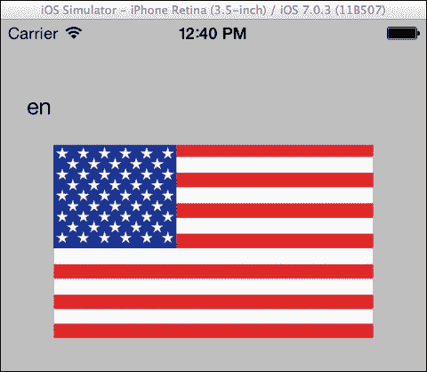
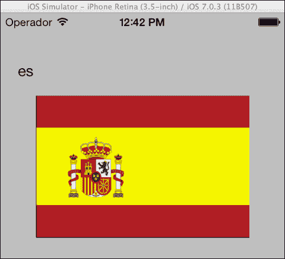
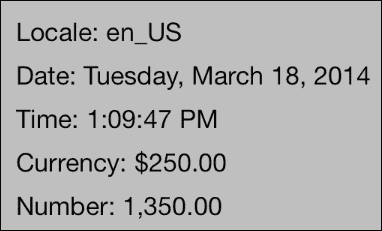
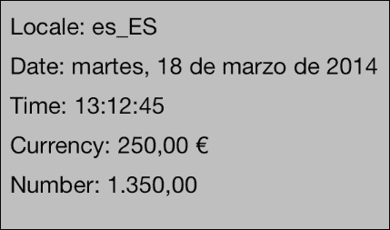

# 第十三章。本地化

在本章中，我们将涵盖以下主题：

+   为不同语言创建应用程序

+   可本地化资源

+   区域格式化

# 简介

随着 iOS 平台和 App Store 这种全球软件市场的推出，苹果公司使得开发者更容易在全球范围内分发应用程序。

然而，全球用户甚至不会费心下载和使用发布在他们不理解的语言中的应用程序。为了扩大应用程序的用户基础，开发者必须对其进行本地化。本地化是将文本翻译成多种语言、提供针对多个区域的具体资源，从而创建面向不同文化受众的应用程序的过程。

在本章中，我们将讨论提供符合每个用户区域首选项的翻译文本的最佳实践。我们还将看到如何根据这些首选项提供资源（图像和视频）。最后，我们将使用常见的.NET 实践来格式化日期、货币和数字。

# 为不同语言创建应用程序

在本食谱中，我们将创建一个支持两种不同语言的程序。

## 准备工作

在 Xamarin Studio 中创建一个新的**单视图应用程序**，并将其命名为`MultipleLanguageApp`。

## 如何操作...

执行以下步骤：

1.  在`MultipleLanguageAppViewController`的视图中添加两个标签。

1.  将两个文件夹添加到项目中。分别命名为`en.lproj`和`es.lproj`。

1.  在`en.lproj`文件夹中添加一个纯文本文件，并将其命名为`Localizable.strings`。在文件中输入以下内容并保存：

    ```swift
    // Localized output on MultipleLanguageAppViewController
    "Have a nice day!" = "Have a nice day!";
    ```

1.  在`es.lproj`文件夹中添加另一个纯文本文件，并将其命名为之前相同的名称：`Localizable.strings`。在文件中输入以下内容并保存：

    ```swift
    // Localized output on MultipleLanguageAppViewController
    "Have a nice day!" = "¡Qué tenga un buen día!";
    ```

1.  在`MultipleLanguageAppViewController`类中输入以下代码：

    ```swift
    public override void ViewWillAppear (bool animated)
    {
      base.ViewWillAppear (animated);
      this.lblLocale.Text = string.Format("Locale: {0} - Language: {1}", NSLocale.CurrentLocale.LocaleIdentifier, NSLocale.PreferredLanguages[0]);
      string resourcePath = NSBundle.MainBundle.PathForResource(NSLocale.PreferredLanguages[0], "lproj");
      NSBundle localeBundle = NSBundle.FromPath(resourcePath);
      this.lblLocalizedOutput.Text = localeBundle.LocalizedString("Have a nice day!", "Localized output on MultipleLanguageAppViewController");
    }
    ```

1.  通过模拟器的设置应用程序，将语言设置为英语（如果尚未设置）并运行应用程序。消息将以英语显示。尝试将模拟器的语言设置为西班牙语（**Español**）并再次运行应用程序。消息将以西班牙语显示。

## 它是如何工作的...

为了使开发者更容易在应用程序中提供对多种语言的支持，iOS 从相应的语言文件夹中读取不同语言中的文本。在本应用程序中，我们支持英语和西班牙语。它们对应的文件夹分别是`en.lproj`和`es.lproj`。当我们调用`LocalizedString`方法时，它会查找并解析`Localizable.strings`文件，以返回适当的文本。

字符串文件的内容由一组用 C 风格语法定义的引号键值对组成，每个集合以分号结尾，如下面的代码所示：

```swift
// Localized output on MultipleLanguageAppViewController
"Have a nice day!" = "¡Qué tenga un buen día!";
```

如您所见，我们还可以提供注释以协助翻译文本的人的工作，即使我们自己翻译。

`NSLocale.PreferredLanguages`静态属性返回一个包含用户首选语言标识符的字符串数组。该数组中的第一个项目是当前选定的语言。如果选定的语言是英语，它将返回`en`；如果是西班牙语，它将返回`es`，依此类推。

### 注意

这两种语言代码都基于 ISO 639-1 标准。也支持三字母的 ISO 639-2 标准。所有可用的语言代码列表可以在[`www.loc.gov/standards/iso639-2/php/code_list.php`](http://www.loc.gov/standards/iso639-2/php/code_list.php)找到。

`NSBundle.PathForResource`方法返回我们传递给它的参数的应用程序包路径。我们使用此路径根据选定的语言获取适当的`NSBundle`实例，如下所示：

```swift
string resourcePath = NSBundle.MainBundle.PathForResource(NSLocale.PreferredLanguages[0], "lproj");
NSBundle localeBundle = NSBundle.FromPath(resourcePath);
```

然后，我们调用`LocalizedString`方法来显示适当的文本，如下所示：

```swift
this.lblLocalizedOutput.Text = localeBundle.LocalizedString("Have a nice day!", "Localized output on MultipleLanguageAppViewController");
```

第一个参数的目的是双重的。它既是查找以返回翻译文本的键，也是在找不到指定的本地化路径时将显示的文本。第二个参数是我们想要给翻译者提供的注释或任何指令。它不会显示并且基本上不会被使用。我们可以传递 null 到这个参数，并且不会发生错误。然而，始终包含注释或指令是明智的，因为它将有助于在翻译多个字符串时避免混淆。

## 还有更多...

建议始终提供可以作为在英语中显示的回退文本的键，以防用户选定的语言未包含在我们的应用程序中。

然而，`LocalizedString`方法有重载。第二个重载接受三个参数。考虑以下示例：

```swift
this.lblLocalizedOutput.Text = localeBundle.LocalizedString("Have a nice day!", "Have a nice day!", "Localizable");
```

第一个参数是查找键。第二个参数是在找不到指定的本地化路径时的回退值。第三个参数是不带`.strings`扩展名的字符串文件名。这种重载更有帮助，我们可以为我们的字符串使用不同的键，这有助于我们识别特定字符串在代码中的使用位置。例如，在这种情况下，我们可以在字符串文件中将键设置为`MultipleLanguageAppViewController.lblLocalizedOutput`：

```swift
// Localized output on MainController
"MultipleLanguageAppViewController.lblLocalizedOutput" = "Have a nice day!";
```

然后，在代码中使用它如下：

```swift
this.lblLocalizedOutput.Text = localeBundle.LocalizedString("MultipleLanguageAppViewController.lblLocalizedOutput", "Have a nice day!", "Localizable");
```

这种重载还帮助我们将字符串分离到多个`.strings`文件中，通过传递相应的文件名作为第三个参数。

最后一个重载包含四个参数。前三个与第二个重载相同。第四个参数是我们希望特定字符串具有的注释。

### 在现实世界的应用程序场景中的本地化

在这个例子中，我们使用 `PathForResource` 方法来获取当前区域包的实例。这是因为 `LocalizedString` 方法返回的值会被缓存。在现实世界的应用程序场景中，如果应用程序以特定语言下载，并且用户不太可能更改设备的语言来使用它，只需调用 `NSBundle.MainBundle.LocalizedString` 就足够了。

### 可本地化的字符串编码

`Localizable.strings` 文件的编码始终应该是 UTF-8 或 UTF-16。

# 可本地化资源

可本地化资源是特定于区域的内容，例如图片和声音文件。在本例中，我们将学习如何根据用户的本地化首选项加载和显示资源。

## 准备工作

在 Xamarin Studio 中创建一个新的 **单视图应用程序**，命名为 `LocalizableResourcesApp`。在 `LocalizableResourcesAppViewController` 的视图中添加一个标签和一个 `UIImageView`。还需要两个不同的图片，每个区域一个。本例中使用的是美国和西班牙的图片。

## 如何操作...

执行以下步骤：

1.  将两个文件夹（`en.lproj` 和 `es.lproj`）添加到项目中，用于英语和西班牙语区域。

1.  每个文件夹中添加一个图片。确保图片的文件名在两个文件夹中都是相同的。

1.  在 `LocalizableResourcesAppViewController` 类中输入以下代码：

    ```swift
    public override void ViewWillAppear (bool animated)
    {
      base.ViewWillAppear (animated);
      this.lblLocale.Text = NSLocale.PreferredLanguages[0];
      this.imageView.Image = UIImage.FromFile(NSBundle.MainBundle.PathForResource("flag", "jpg"));
    }
    ```

1.  编译并在模拟器上运行应用程序，在 *设置* 应用中选择英语作为语言。结果应该类似于以下截图：

1.  现在，将模拟器的语言设置为西班牙语，然后再次运行应用程序。应该显示西班牙国旗，如下面的截图所示：

## 它是如何工作的...

`PathForResource` 方法会自动搜索适当的语言文件夹，并通过其参数加载指定的资源。在本例中，我们将方法的结果传递给 `UIImage.FromFile` 方法，以便加载图片并将其分配给图像视图的 `Image` 属性。

## 还有更多...

除了图片之外，我们还可以使用 `PathForResource` 方法来加载视频、PDF 文件和任何其他需要的可本地化资源。

### 关于可本地化资源的更多信息

我们需要确保特定语言文件夹的资源存在。如果不存在，将会发生异常。避免这种情况的一种方法是，在项目中添加一个通用的图片文件，并在每个语言文件夹内使用一个 `Localizable.strings` 文件，其中包含资源的路径，如下面的代码所示：

```swift
// US flag image
"flag_path"="en.lproj/flag.jpg";
```

要加载适当的国旗，我们使用 `LocalizedString` 方法加载图片，如下所示：

```swift
this.Image = UIImage.FromFile(NSBundle.MainBundle.LocalizedString("flag_path", "path/to/universal/image.jpg", "Localizable");
```

这样，如果找不到相应的语言文件夹，将会加载 `image.jpg` 图片。

## 相关内容

+   *为不同语言创建应用程序* 的配方

# 区域格式化

区域格式化是指根据世界各地的不同区域，以不同的方式显示各种信息，例如货币、日期和时间。在本教程中，我们将讨论如何根据用户的区域格式化设置显示格式化的数字和日期。

## 准备工作

在 Xamarin Studio 中创建一个新的 **单视图应用程序**，并将其命名为 `RegionalFormattingApp`。

## 如何操作...

执行以下步骤：

1.  在 `RegionalFormattingAppViewController` 的视图中添加五个标签。

1.  在 `RegionalFormattingAppViewController` 类中输入以下代码：

    ```swift
    public override void ViewDidAppear (bool animated)
    {
      base.ViewDidAppear (animated);
      this.lblLocale.Text = string.Format("Locale: {0}", NSLocale.CurrentLocale.LocaleIdentifier);
      this.lblDate.Text = string.Format("Date: {0}", DateTime.Now.ToLongDateString());
      this.lblTime.Text = string.Format("Time: {0}", DateTime.Now.ToLongTimeString());
      this.lblCurrency.Text = string.Format("Currency: {0:c}", 250);
      this.lblNumber.Text = string.Format("Number: {0:n}", 1350);
    }
    ```

1.  在模拟器上编译并运行应用程序，将区域格式设置为 **美国** 和 **西班牙** | **西班牙**，在 **设置** | **通用** | **国际** | **区域格式** 下。美国区域格式的输出将类似于以下屏幕截图：

    西班牙区域格式的输出将类似于以下屏幕截图所示：

    

## 它是如何工作的...

要格式化日期、货币和数字，我们使用标准的 .NET 代码。对于日期和时间，`DateTime.ToLongDateString` 和 `DateTime.ToLongTimeString` 方法分别返回根据区域设置确定的值。

对于货币和数字，我们使用 C# 数值字符串，如下所示：

```swift
this.lblCurrency.Text = string.Format("Currency: {0:c}", 250);
this.lblNumber.Text = string.Format("Number: {0:n}", 1350);
```

## 还有更多...

`System.Globalization` 命名空间在 Xamarin.iOS 中受支持。要显示当前区域设置，请考虑以下代码行：

```swift
Console.WriteLine(CultureInfo.CurrentCulture.Name);
```

注意，前面的代码与 `NSLocale.CurrentLocale.LocaleIdentifier` 之间有一个区别。前者使用破折号（`-`），而后者在区域名称中使用下划线（`_`）。
