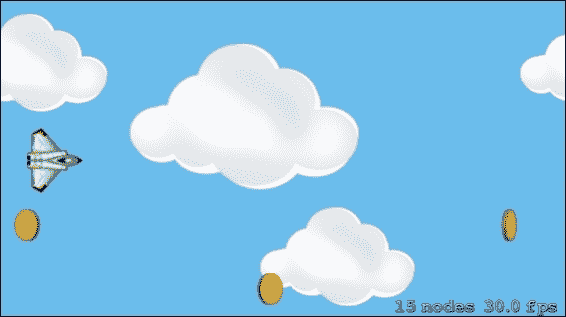
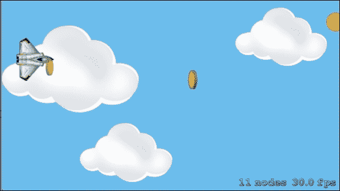
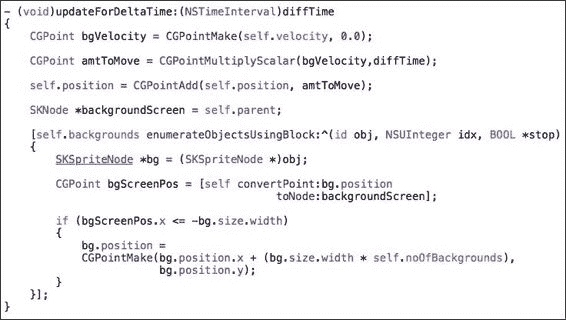

# 第三章。动画和纹理

在 第二章 中，你学习了 SpriteKit 的基本结构和其构建块，如场景、节点、精灵等。我们通过触摸屏幕在空中获得了一个飞行的飞船，现在在本章中，我们将转向为用户提供完整游戏体验。

你将了解如何使用动画改变精灵的内容，如何使用纹理（存储精灵数据）来渲染精灵，如何使用纹理图集创建一个包含所有游戏资产的大图像，一些角色（飞船）动画，最后但同样重要的是，为充满动画的游戏创建一个视差背景。

在本章中，我们将关注以下食谱：

+   动画化你的纹理

+   创建纹理图集

+   使用纹理图集添加动画

+   碰撞检测

+   视差背景

# 简介

使用 SpriteKit 将动画添加到我们的游戏中是一个简单的任务，正如我们在上一章中所做的那样，我们在那里添加了一些 `SKAction` 函数来使飞船移动。这些动画与它们的运动、方向以及某种程度上与它们的变换有关。然而，现在我们要讨论的动画是精灵内容的变化。动画将通过每秒多次动画化同一精灵的多个图像（即，帧），给精灵带来一种活生生的感觉。这有点类似于我们捕捉视频的方式，它只是每秒快照的序列。这类动画需要大量的图像来完成，从而增加了这些纹理的内存大小。纹理由一个 `SKTexture` 对象表示，该对象与精灵一起创建和附加。纹理对象在可见时自动加载精灵数据（称为纹理数据），并用于在相应场景中渲染精灵。当精灵被移除或在场景中不可见时，它将删除纹理数据，因此自动内存管理得到了简化。

技术上，所有这些都意味着精灵有显示帧，这些帧有不同的纹理，并且每个帧之间通过固定的延迟来改变。而我们将在入门和解决方案套件中要做的一切都将从我们在上一章中离开的地方继续。

# 动画化你的纹理

在这个食谱中，我们将查看如何创建和附加纹理到精灵。我们还将借助纹理进行一些内容更改（即，帧更改动画）。

## 准备工作

要开始使用要动画化的纹理，我们应该了解场景、节点和精灵。由于精灵是通过图像创建并添加到场景中的，这会占用更多内存，因此纹理应该是解决这个问题的一个方案。

## 如何做...

现在，由于纹理的内存管理更加优化，我们可以开始通过固定时间改变精灵的帧进行动画。为此，我们将展示一个环境中的道具，这是一个水平旋转 360 度的硬币。

以下是将硬币看起来像水平旋转 360 度的步骤：

1.  首先，复制`Project_Resources`文件夹中提供的所有硬币图像（即帧），这些图像与工具包一起提供。总共有六个硬币图像，每个图像都水平旋转了一定角度。

1.  在`FSMyScene`中添加一个名为`addCoin`的方法，在其中我们使用纹理（`Coin1.png`）创建一个硬币精灵，初始图像要显示在天空背景上。

    ```swift
      SKTexture* coinInitialTexture = [SKTexture textureWithImageNamed:@"Coin1.png"];
      SKSpriteNode* coinSprite = [SKSpriteNode spriteNodeWithTexture:coinInitialTexture];
    ```

1.  要在屏幕上显示硬币，指定其位置；目前，位置设置为屏幕中心，然后将其添加到`FSMyScene`。

    ```swift
    coinSprite.position = CGPointMake(self.frame.size.width/2,self.frame.size.height/2);
    [self addChild:coinSprite];
    ```

1.  同样，为硬币的其余帧创建纹理以添加帧动画。

    ```swift
    SKTexture* coin2Texture = [SKTexture textureWithImageNamed:@"Coin2.png"];
    SKTexture* coin3Texture = [SKTexture textureWithImageNamed:@"Coin3.png"];
    SKTexture* coin4Texture = [SKTexture textureWithImageNamed:@"Coin4.png"];
    SKTexture* coin5Texture = [SKTexture textureWithImageNamed:@"Coin5.png"];
    SKTexture* coin6Texture = [SKTexture textureWithImageNamed:@"Coin6.png"];
    ```

    将所有硬币纹理组合在一起创建一个纹理数组。

    ```swift
    NSArray *coinAnimationTextures = @[coinInitialTexture,coin2Texture,coin3Texture,coin4Texture,coin5Texture,coin6Texture];
    ```

1.  使用`SKAction`类的类方法为`coinAnimation`创建一个`SKAction`类，并在`FSMyScene`上添加的硬币精灵上运行该动作。

    ```swift
    SKAction *coinAnimation = [SKAction animateWithTextures:coinAnimationTexturestimePerFrame:0.2];
    [coinSprite runAction:coinAnimation];
    ```

添加所有这些代码行使我们的`addCoin`方法：


## 它是如何工作的...

当我们使用`SKTexture`创建纹理对象，就像我们在前一节中所做的那样，纹理将图像（即帧）数据存储到其中，然后进一步转发以创建精灵。这有助于内存管理，因为当精灵被移除时，与之关联的数据（即纹理）也会被移除，从而释放内存。

```swift
SKTexture* spaceShipTexture = [SKTexture textureWithImageNamed:@"Spaceship.png"];

self.spaceShipSprite = [SKSpriteNode spriteNodeWithTexture:spaceShipTexture];
```

同样，使用纹理在屏幕中心添加硬币，其初始帧看起来像这样：


现在我们将使用多个纹理来了解帧动画是如何工作的。我们刚刚使用一些硬币图像创建了一些纹理，这些纹理在视觉上按水平旋转角度递增的顺序设计。因此，创建了一个与纹理顺序相同的数组。

```swift
NSArray *coinAnimationTextures = @[coinInitialTexture,coin2Texture,coin3Texture,coin4Texture,coin5Texture,coin6Texture];
```

使用`SKAction`类的类方法，将硬币动画纹理数组作为输入，帧延迟为 0.2 秒。

```swift
  SKAction *coinAnimation = [SKAction animateWithTextures:coinAnimationTexturestimePerFrame:0.2];

  [coinSprite runAction:coinAnimation];
```

前面的函数接受纹理，并以纹理提供的顺序以 0.2 秒的延迟显示它们。

因此，包含动画代码的整体`addCoin`方法给人一种硬币在屏幕中心水平旋转一周的感觉，这就是场景看起来像这样的原因：


# 创建纹理图集

纹理图集是将所有应用程序资源（即图像）组合成一个或多个较大图像的方法，以提高应用程序的性能，以便应用程序可以在单个渲染场景的绘制调用中绘制多个图像。例如，如果我们有多个图像文件需要加载到精灵中，SpriteKit 将为每个精灵执行一次绘制调用。然而，如果我们将所有必需的图像组合到一个图像文件中，那么 SpriteKit 可以在使用非常少的内存的情况下，在一个绘制调用中渲染所有精灵。建议为任何游戏项目创建所有必需图像的纹理图集。

Xcode 具有为您的图像集合构建纹理图集的能力，使其成为一个更大的图像，从而提高性能。在创建纹理图集时，应保持纹理过多或过少的平衡，以免内存负载增加。

## 准备中

要创建纹理图集，我们应该了解精灵和纹理是什么，最重要的是如何使用纹理创建精灵。我们将以*动画你的纹理*食谱为参考开始。在这个食谱中，我们将学习如何为用于动画的硬币图像和太空船创建纹理图集。

## 如何操作...

以下是为图像集合创建纹理图集的步骤：

1.  在`FlyingSpaceship`的启动项目中创建一个存储项目的系统文件夹。

    ### 注意

    它不应是一个 Xcode 组文件夹；它必须是一个系统文件夹。

1.  在那个文件夹中，添加所有硬币的图像以及之前在应用程序包中添加的太空船图像。

1.  右键单击`Resources`文件夹，然后点击**将文件添加到"FloatingSpaceship"**。

1.  打开一个查找器视图。从那里，选择`FSGame.atlas`并点击**添加**按钮。每次我们构建项目时，编译器都会寻找命名约定为`name.atlas`的文件夹。因此，文件夹被识别，并且该文件夹中的所有图像都被组合成一个或多个大图像。

1.  在将`FSGame.atlas`文件添加到项目后，`Resources`文件夹看起来像这样：

1.  现在，为了启用纹理图集的生成，转到项目的构建设置并搜索类型`Spritekit`；搜索结果将看起来像这样：

1.  现在，您可以在**SpriteKit 部署选项**部分看到**启用纹理图集生成**字段。将该布尔值设置为**是**。

因此，每次我们构建项目时，编译器都会生成一个属性列表，通过其名称访问纹理图集的图像，这是我们给文件夹的。

## 它是如何工作的...

在创建纹理图集之后，最重要的部分是我们将如何能够访问纹理图集中的图像。这是通过启用 bool 值**Enable Texture Atlas Generation**来完成的。之后，每次我们构建项目时，编译器都会寻找具有类似`name.atlas`命名约定的文件夹。因此，文件夹被识别，并且该文件夹中的所有图像都被组合成一个或多个大图像。

在这里，Xcode 在设置 bool 值后生成一个`.plist`文件。之后，使用纹理图集名称在代码中获取纹理图集，并从那里我们可以获取任何图像，这些图像被放在那个文件夹中，即纹理图集。

## 更多内容...

每次我们创建纹理图集时，总是存在使用过多纹理或较少图像之间的权衡。当使用较少图像时，SpriteKit 仍然需要做出许多绘图调用以渲染每一帧。而对于许多纹理，图像数量的增加可能会增加纹理数据，从而对内存造成负载。因此，这取决于我们如何选择；我们可以相对容易地在两种选择之间切换。因此，可以尝试不同的配置以获得最佳性能。

# 使用纹理图集添加动画

在学习如何使用纹理从`App Bundle`加载图像之前，我们就已经了解了动画。因为我们有一个纹理图集（即一个较大的组合图像），我们将通过该纹理图集加载图像。在`FSMyScene`文件中添加的所有精灵都通过`App Bundle`中的图像加载，所以现在我们将通过精灵中的纹理图集加载所有图像。最后，将使用纹理图集加载的图像应用一些动画。

## 准备工作

在使用纹理图集加载图像进行动画之前，我们应该了解使用图像组合创建纹理图集的过程，并在固定延迟后进行一些帧变化的动画。所以这里我们将做之前做的同样的硬币旋转动画，但现在使用纹理图集。这个配方将被称为*使用纹理图集添加动画*。之后，我们将以随机方式在`FSMyScene`中从一端到另一端（从右到左）动画化一组硬币，给人一种硬币在天空中移动的感觉。

## 如何操作…

首先，我们将用纹理图集图像在`App Bundle`中创建纹理的过程替换掉使用图像创建纹理的过程。执行以下步骤：

1.  通过指定其名称，即`FSGame`（纹理图集的名称），创建一个`SKTextureAtlas`对象。

    ```swift
      SKTextureAtlas *textureAtlas = [SKTextureAtlas atlasNamed:@"FSGame"];
    ```

    ### 注意

    应该从项目包中移除之前添加的图像，以避免冗余。

    ```swift
      SKTexture* spaceShipTexture = [SKTexture textureWithImageNamed:@"Spaceship.png"];
    ```

1.  现在通过传递要设置到精灵中的太空船图像来使用纹理图集对象创建纹理。

    ```swift
      SKTexture* spaceShipTexture = [textureAtlas textureNamed:@"Spaceship.png"];
    ```

1.  在 FSMyScene 的`addCoin`方法中，使用前面的过程通过`t`extureAtlas`对象为所有硬币纹理创建纹理。

    ```swift
      SKTextureAtlas *textureAtlas = [SKTextureAtlas atlasNamed:@"FSGame"];

      SKTexture* coinInitialTexture = [textureAtlas textureNamed:@"Coin1.png"];

      SKTexture* coin2Texture = [textureAtlas textureNamed:@"Coin2.png"];
      SKTexture* coin3Texture = [textureAtlas textureNamed:@"Coin3.png"];
      SKTexture* coin4Texture = [textureAtlas textureNamed:@"Coin4.png"];
      SKTexture* coin5Texture = [textureAtlas textureNamed:@"Coin5.png"];
      SKTexture* coin6Texture = [textureAtlas textureNamed:@"Coin6.png"];
    ```

1.  一旦所有纹理都创建完毕，使用与`addCoin`相同的代码来添加和动画硬币。

1.  让我们使硬币动画更加生动和自然。将用于动画纹理的动作与一个固定延迟一起传递给另一个`SKAction`，使其无限重复，从而给人一种硬币持续旋转（永不结束）的感觉。

    ```swift
      SKAction *rotateAction = [SKAction animateWithTextures:coinAnimationTextures timePerFrame:0.2];

      SKAction *coinRepeatForeverAnimation = [SKAction repeatActionForever:rotateAction];

      [coinSprite runAction:coinRepeatForeverAnimation];
    ```

1.  经过一些调整后，从数组中移除最后一个纹理，这样当`repeatForever`动作运行时，第一个图像将在最后一个图像之后出现，因此不需要最后一个纹理。

    ```swift
      NSArray *coinAnimationTextures = @[coinInitialTexture,coin2Texture,coin3Texture,coin4Texture,coin5Texture,coin6Texture];
    ```

现在我们已经构建了一个永远旋转的硬币，可以用作游戏中的道具或可收集物品。

制作可收集硬币的步骤如下：

1.  为了使硬币从屏幕的左侧移动到右侧，我们必须计算初始和最终位置。

    ```swift
      CGFloat coinInitialPositionX = self.frame.size.width + coinSprite.size.width/2;
      CGFloat coinInitialPositionY = arc4random() % 320;
      CGPoint coinInitialPosition = CGPointMake(coinInitialPositionX, oinInitialPositionY);

      CGFloat coinFinalPositionX = -coinSprite.size.width/2;
      CGFloat coinFinalPositionY = coinInitialPositionY;
      CGPoint coinFinalPosition = CGPointMake(coinFinalPositionX, coinFinalPositionY);
    ```

1.  之后，设置初始位置为硬币精灵的位置。

    ```swift
     coinSprite.position = coinInitialPosition;
    ```

1.  硬币的初始位置被设置，现在我们必须将硬币从初始位置动画到最终位置。这可以通过向硬币精灵添加一个移动`SKAction`并指定其最终目的地来实现。

    ```swift
      SKAction *coinMoveAnimation = [SKAction moveTo:coinFinalPosition duration:5.0];

      [coinSprite runAction:coinMoveAnimation];
    ```

最后，我们的`addCoin`方法已经完全准备好用于游戏。为了移动作为可收集物品的硬币，执行以下步骤：

1.  为了使这些硬币在场景中作为可收集物品移动，需要在更新方法中进行一些重构。更新`diffTim`e 和`lastUpdatedTime`，如下面的代码所示：

    ```swift
       if (self.lastUpdatedTime)
        {
            self.diffTime = currentTime - self.lastUpdatedTime;
        }
        else
        {
            self.diffTime = 0;
        }

        self.lastUpdatedTime = currentTime;
    ```

1.  现在通过在 FSMyScene 的私有接口中声明一个名为`lastCoinAdded`的属性，使用`currentTime`创建一个计时器功能。

    ```swift
    @property (nonatomic, assign) NSTimeInterval lastCoinAdded;
    ```

1.  因此，这是在更新方法中添加的计时器，通过检查`currentTime`和`lastCoinAdded`的差值来 1。因此，每过 1.0 秒，就会添加一个硬币，动画从屏幕左侧移动到右侧。

    ```swift
        if( currentTime - self.lastCoinAdded > 1)
        {
            self.lastCoinAdded = currentTime + 1;

            [self addCoin];
        }
    ```

最后，我们的更新方法已经准备好在设定延迟后动画多个硬币。

## 它是如何工作的…

在我们之前是使用来自`App Bundle`的图片来创建精灵，但现在我们将使用纹理图集来获取图片并将其传递给精灵。之前名为`FSGame.atlas`的纹理图集包含了多个硬币和宇宙飞船的图片。内部代码加载这些帧并将它们存储在一个数组中。

+   SpriteKit 首先搜索图像文件，如果找不到，它会在应用包中构建的纹理图集中搜索。如果我们想显式地使用纹理图集，可以使用`SKTextureAtlas`类。通过指定其名称来获取纹理图集：

    ```swift
      SKTextureAtlas *textureAtlas = [SKTextureAtlas atlasNamed:@"FSGame"];
    ```

+   然后，我们可以使用图集对象来获取创建精灵所需的图片。

    ```swift
      SKTexture* spaceShipTexture = [textureAtlas textureNamed:@"Spaceship.png"];
    ```

现在，我们将了解硬币是如何被转换成可收集物品的。为了移动硬币，需要决定其初始和最终位置。

+   在*x*维度上的初始位置固定为框架宽度加上硬币的一半，这样它就被添加到屏幕外，而*y*维度则使用`arc4random()`函数从 0 到 320 随机选择。

    ```swift
    CGFloat coinInitialPositionX = self.frame.size.width + coinSprite.size.width/2;
      CGFloat coinInitialPositionY = arc4random() % 320;
      CGPoint coinInitialPosition = CGPointMake(coinInitialPositionX, coinInitialPositionY);
    ```

+   对于最终位置，*x* 轴设置为自身宽度的一半的负值，*y* 轴与初始位置 *x* 相同。

    ```swift
      CGFloat coinFinalPositionX = -coinSprite.size.width/2;
      CGFloat coinFinalPositionY = coinInitialPositionY;
      CGPoint coinFinalPosition = CGPointMake(coinFinalPositionX, coinFinalPositionY);
    ```

    

+   现在可收集物品已准备好添加到场景中。但是，为了使多个硬币在场景中从左向右移动，必须实现一个计时器。计时器看起来像这样：

    ```swift
        if( currentTime - self.lastCoinAdded > 1)
        {
            self.lastCoinAdded = currentTime + 1;

            [self addCoin];
        }
    ```

在完成所有这些实现后，可以看到多个硬币从左向右移动，如下面的截图所示：



# 碰撞检测

我们已经将游戏与可收集物品集成在一起。让我们看看宇宙飞船将如何收集这些可收集物品，即硬币。在角色动画中，我们将对相互碰撞的宇宙飞船和硬币进行动画处理。

## 准备工作

在继续对场景中的实体应用复杂动画之前，必须理解动作（即 `SKAction`）和场景的更新函数（`SKScene`）。这样，在更新过程中，我们可以检测硬币与宇宙飞船之间的碰撞，并对它们进行一些动画处理。

## 如何做…

检测碰撞并对两个实体（硬币和宇宙飞船）进行动画的以下步骤包括：

1.  编写一个 `detectSpaceShipCollisionWithCoins` 方法，我们将遍历硬币对象。

    ```swift
    - (void)detectSpaceShipCollisionWithCoins
    {
        [self enumerateChildNodesWithName:@"Coin"
                               usingBlock: ^(SKNode *node, BOOL *stop)
         {
         }];
    }
    ```

1.  在枚举中，使用 `CGRectIntersectsRect()` 确定宇宙飞船的帧与任何硬币的帧相交。

    ```swift
        [self enumerateChildNodesWithName:@"Coin"
          usingBlock: ^(SKNode *node, 
            BOOL *stop)
         {
             if (CGRectIntersectsRect(self.spaceShipSprite.frame, node.frame))
             {

             }
         }];
    ```

1.  当检测到碰撞时，通过名为 `spaceShipCollidedWithCoin` 的函数通知场景，硬币与宇宙飞船发生了碰撞。

    ```swift
        [self spaceShipCollidedWithCoin:node];
    ```

在所有这些之后，`detectSpaceShipCollisionWithCoins` 方法看起来如下：


1.  在检测到碰撞后，调用 `spaceShipCollidedWithCoin` 函数，该函数调用两个其他函数，这些函数实现了碰撞宇宙飞船和硬币的动画方法。此方法的定义如下：

    ```swift
    - (void)spaceShipCollidedWithCoin:(SKNode*)coinNode
    {
        [self runSpaceshipCollectingAnimation];

        [self runCollectedAnimationForCoin:coinNode];
    }
    ```

1.  为宇宙飞船编写的动画看起来像是将硬币吸入自身。创建了两个动作 `scaleUp` 和 `scaleDown`，分别用于缩放因子 1.4 和 1.0，每个动作播放 0.2 秒。

    ```swift
    - (void)runSpaceshipCollectingAnimation
    {
      SKAction* scaleUp = [SKAction scaleTo:1.4 duration:0.2];

      SKAction* scaleDown = [SKAction scaleTo:1.0 duration:0.2];
    }
    ```

1.  之后，形成这两个动画数组以用于创建序列动作。

    ```swift
    NSArray* scaleSequenceAnimations =
      [NSArray arrayWithObjects:scaleUp, scaleDown, nil];

      SKAction* spaceShipCollectingAnimation = [SKAction sequence:scaleSequenceAnimations];
    ```

    最后，形成的序列动作在宇宙飞船上运行。

    ```swift
      [self.spaceShipSprite runAction:spaceShipCollectingAnimation];
    ```

1.  对于硬币，动画应该看起来像是被宇宙飞船带走时正在消失。因此，创建了两个核心动画 `fadeOut` 和 `scaleDown`，每个动画的缩放因子为 0.2，时间间隔为 0.4，形成一个动画数组。

    ```swift
    - (void)runCollectedAnimationForCoin:(SKNode*)coinNode
    {
        SKAction* coinFadeOutAnimation = [SKAction fadeOutWithDuration:0.4];

        SKAction* scaleDownAnimation = [SKAction scaleTo:0.2 duration:0.4];

        NSArray* coinAnimations = [NSArray arrayWithObjects:coinFadeOutAnimation, scaleDownAnimation, nil]; 
    }
    ```

1.  使用这些动画，形成一个组动画。

    ```swift
      SKAction* coinGroupAnimation = [SKAction group:coinAnimations];
    ```

1.  关于硬币，当它与宇宙飞船相撞时，动画结束后必须从场景中移除。因此，在之前创建的组动画完成后，使用积木创建一个动作来移除硬币。

    ```swift
      SKAction* coinAnimationFinishedCallBack = [SKAction customActionWithDuration:0.0 actionBlock:^(SKNode *node,CGFloat elapsedTime)
      {
        [node removeFromParent];
      }];
    ```

    ```swift
    removeFromParent function, which is similar to removeFromSuperview in UIKit.
    ```

1.  当动画准备就绪时，使用数组创建其序列动作。

    ```swift
        NSArray* coinAnimationsSequence =
        [NSArray arrayWithObjects:coinGroupAnimation, coinAnimationFinishedCallBack, nil];

        SKAction* coinSequenceAnimation =
        [SKAction sequence:coinAnimationsSequence];
    ```

    因此，当先前的复杂动作在硬币上运行时，硬币看起来就像是要消失一样。

    ```swift
        [coinNode runAction:coinSequenceAnimation];
    ```

1.  由于所有动画和碰撞检测的代码都已完成，调用`detechSpaceShipCollisionWithCoins`方法，以便在每一帧检测碰撞，并通过游戏角色（即飞船）收集硬币。

    ```swift
        [self detectSpaceShipCollisionWithCoins];
    ```

## 工作原理…

本节最重要的部分是碰撞检测。它是通过`CGRectIntersectsRect`方法完成的，其中枚举硬币并检查它们的框架是否与飞船框架相交。如果相交，则在硬币和飞船上播放两个不同的动画。

```swift
    [self enumerateChildNodesWithName:@"Coin"usingBlock: ^(SKNode *node, BOOL *stop)
     {
         if (CGRectIntersectsRect(self.spaceShipSprite.frame, node.frame))
         {

         }
     }];
```

当检测发生时，游戏看起来是这样的：



现在我们来谈谈动画。飞船的动画很简单。为了给收集硬币的感觉，我们按顺序使用了`scaleUp`和`scaleDown`动画。

```swift
SKAction* scaleUp = [SKAction scaleTo:1.4 duration:0.2];

    SKAction* scaleDown = [SKAction scaleTo:1.0 duration:0.2];

NSArray* scaleSequenceAnimations = [NSArray arrayWithObjects:scaleUp, scaleDown, nil];

  SKAction* spaceShipCollectingAnimation = [SKAction sequence:scaleSequenceAnimations];
```

然而，对于硬币，创建了一个复杂的动作，包括以下三个动作：

+   `FadeOutAction`使硬币在 0.4 秒内淡出，看起来像是消失。

    ```swift
      SKAction* coinFadeOutAnimation = [SKAction fadeOutWithDuration:0.4];
    ```

+   `ScaleDownAction`将硬币缩小，使其在 0.4 秒内缩入飞船。

    ```swift
      SKAction* scaleDownAnimation = [SKAction scaleTo:0.2 duration:0.4];
    ```

+   一个`CallBack`函数，用于在先前的动画结束后从场景中移除硬币。

    ```swift
     SKAction* coinAnimationFinishedCallBack = [SKAction customActionWithDuration:0.0 actionBlock:^(SKNode *node,CGFloat elapsedTime)
         {
             [node removeFromParent];
         }];
    ```

在创建所有这些动作之后，创建了一组`fadeOut`和`scaleDown`，这是一个由一系列组动画和回调动作组成的动画序列，它应用于硬币。

每当发生碰撞时，飞船会上下缩放，而硬币会淡出，如下截图所示：


# 视差背景

现在我们的小游戏 FlyingSpaceship 即将结束。为了给游戏环境增添感觉，我们将引入一个视差滚动背景。视差滚动背景由多个背景层（即节点）组成；同时动画它们会给人一种动态背景的感觉。为了给游戏添加一些酷炫的飞行物，我们将添加两层背景：以节点形式出现的`SpaceBlueSky`和`SpaceWhiteMist`。

## 准备工作

首先，要使用这个酷炫的功能，我们应该了解在前一章中创建的滚动背景，并具备对精灵、节点和数学的基本知识。我们将在 FlyingSpaceship 游戏中制作*视差背景*的配方。

## 如何操作…

为了创建具有不同滚动速度的多个滚动背景，我们将创建一个类来完成视差背景。创建名为`FSParallaxNode`的视差背景类所涉及的步骤如下：

1.  通过在**FlyingSpaceship**项目上右键单击来创建一个新文件。

1.  在**Cocoa Touch**部分选择**Objective-C Class**。

1.  将类命名为`FSParallaxNode`并点击**下一步**。

1.  现在要创建类，请选择要创建的`FlyingSpaceship`文件夹，并点击**创建**。

1.  现在，我们需要在`FSParallaxNode`的头部添加两个方法。首先，在`init`方法中，我们需要指定`imageFiles`，即要滚动的图片，画布大小以及图片滚动的速度。

    ```swift
    - (id)initWithBackgrounds:(NSArray *)imageFiles
               size:(CGSize)size
               speed:(CGFloat)velocity;
    ```

    其次，有一个名为从场景更新中调用的更新方法，其中添加了`FSParallaxNode`方法，使得滚动变得无限。

    ```swift
    - (void)updateForDeltaTime:(NSTimeInterval)diffTime;
    ```

1.  在`FSParallaxNode.m`中，在其私有接口中声明一些属性以存储所有背景节点、背景数量和该视差节点的速度。

    ```swift
    @property (nonatomic, strong)  NSMutableArray*  backgrounds;
    @property (nonatomic, assign)  NSInteger        noOfBackgrounds;
    @property (nonatomic, assign) CGFloat           velocity;
    ```

    在`init`方法的定义中，首先分配函数中传递的所有参数，例如`velocity`。现在我们使用`imageFiles`计数来分配`noOfBackgrounds`，并创建一个容量为`noOfBackgrounds`的背景数组。

    ```swift
    - (id)initWithBackgrounds:(NSArray *)imageFiles
                   size:(CGSize)size
                   speed:(CGFloat)velocity
    {
        if (self = [super init])
        {
            self.velocity = velocity;
            self.noOfBackgrounds = [imageFiles count];
            self.backgrounds =
            [NSMutableArray arrayWithCapacity:self.noOfBackgrounds];

            }];
        }
        return self;
    }
    ```

1.  使用`imageFiles`，使用块进行枚举。在枚举过程中，使用`imageFiles`类添加背景节点，将它们添加到背景数组中，并在`FSParallaxNode`上。

    ```swift
            [imageFiles enumerateObjectsUsingBlock:^(id obj, NSUInteger idx, BOOL *stop)
            {
                SKSpriteNode *backgroundNode =
                [SKSpriteNode spriteNodeWithImageNamed:obj];

                [self.backgrounds addObject:backgroundNode];
                [self addChild:backgroundNode];
            }];
    ```

1.  还需要指定`backgroundNode`的大小，这是通过`init`方法传递的，其`anchorPoint`为`CGPointZero`，其位置根据`idx`整数，节点名称为`background`。

    ```swift
            backgroundNode.size = size;
            backgroundNode.anchorPoint = CGPointZero;
            backgroundNode.position = CGPointMake(size.width * idx, 0.0);
            backgroundNode.name = @"background";
    ```

在完成所有这些之后，我们的`init`方法就准备好了，如下面的截图所示：


现在，让我们看看如何滚动添加到`FSParallaxNode`上的这些背景；这将通过一个实例更新方法来完成。

1.  必须进行一些`cleanUp`操作，或者换句话说，需要移动一些代码。将`FSMyScene`中使用的两个静态方法复制到用于某些数学计算的`FSParallaxNode`类中，移除`SpaceBackground`方法的初始化以及从`FSMyScene`中更新的移动背景调用。从`FSMyScene`文件中剪切移动背景的方法代码，并将其粘贴到`FSParallaxNode`的`updateForDeltaTime`函数中。现在我们将对方法进行一些调整。

1.  `SKParallax`节点是所有添加到其上的背景节点的父节点。因此，使用速度，通过`init`和`diffTime`方法（这些方法将通过`FSMyScene`的更新方法传递），我们计算出父节点的位置，即`FSParallax`节点。

    ```swift
    - (void)updateForDeltaTime:(NSTimeInterval)diffTime
    {
        CGPoint bgVelocity = CGPointMake(self.velocity, 0.0);
        CGPoint amtToMove = CGPointMultiplyScalar(bgVelocity,diffTime);
        self.position = CGPointAdd(self.position, amtToMove);    
    }
    ```

1.  现在，枚举背景，即所有添加到父节点上的节点。在这个枚举过程中，找到相对于父节点的单个背景的位置。之后，检查背景的位置是否小于其宽度的负值（即到达了左端），然后改变该背景的位置到其右端。

    ```swift
        SKNode *backgroundScreen = self.parent;

        [self.backgrounds enumerateObjectsUsingBlock:^(id obj, NSUInteger idx, BOOL *stop)
        {
            SKSpriteNode *bg = (SKSpriteNode *)obj;

            CGPoint bgScreenPos = [self convertPoint:bg.position
                                              toNode:backgroundScreen];

            if (bgScreenPos.x <= -bg.size.width)
            {
                bg.position =
                CGPointMake(bg.position.x + (bg.size.width * self.noOfBackgrounds),
                            bg.position.y);
            }
        }];
    ```

1.  最后，我们的更新方法构建完成，它提供了多个背景无限滚动的功能。

    到目前为止，提供视差滚动背景功能的`FSParallaxNode`类已经创建，现在是时候在`FSMyScene`中创建对象以创建一个酷炫的环境了。

1.  我们将添加两个背景层：BlueSky 和 WhiteMist，因此为每个背景创建两个对象。

    ```swift
    @property (nonatomic, strong) FSParallaxNode*spaceBlueSkyParallaxNode;
    @property (nonatomic, strong) FSParallaxNode*spaceWhiteMistParallaxNode;
    ```

    添加一个名为`addParallaxNodes`的方法，并在`FSMyScene`的`init`方法的第一行调用它。

    ```swift
            [self addParallaxNodes];
    ```

1.  对于两个视差节点，我们必须为它们的相对速度添加以下两个常量。

    ```swift
    static const float SPACE_BLUE_SKY_BG_VELOCITY = 20.0;
    static const float SPACE_WHITE_MIST_BG_VELOCITY = 100.0;
    ```

    在`addParallaxNodes`中，创建一个`blueSkyParallaxBackgroundImages`数组，并通过传递场景大小和滚动速度创建一个`FSParallax`对象。

    ```swift
    - (void)addParallaxNodes
    {
        NSArray *blueSkyParallaxBackgroundNames = @[@"SpaceBackground.png", @"SpaceBackground.png",];

        self.spaceBlueSkyParallaxNode = [[FSParallaxNode alloc] initWithBackgrounds:blueSkyParallaxBackgroundNames
                                               size:self.frame.size
              speed:-SPACE_BLUE_SKY_BG_VELOCITY];
        self.spaceBlueSkyParallaxNode.position =
        CGPointMake(0, 0);

        [self addChild:self.spaceBlueSkyParallaxNode];
    }
    ```

1.  与蓝天背景类似，我们还需要实现雾图像。为了使游戏更具现实感，我们将添加`mistParallaxBackgroundImages`函数。

    ```swift
        NSArray *mistParallaxBackgroundNames = @[@"SpaceWhiteMist.png", @"SpaceWhiteMist.png",];

        self.spaceWhiteMistParallaxNode = [[FSParallaxNode alloc] initWithBackgrounds:mistParallaxBackgroundNamessize:self.frame.size
        speed:-SPACE_WHITE_MIST_BG_VELOCITY];
        self.spaceWhiteMistParallaxNode.position = CGPointMake(0, 0);

        [self addChild:self.spaceWhiteMistParallaxNode];
    ```

1.  一旦节点被添加到场景中，它们需要更新以实现滚动。因此，为两个节点调用`FSMyScene`的`updateForDeltaTime`函数。

    ```swift
      if (self.spaceBlueSkyParallaxNode)
      {
        [self.spaceBlueSkyParallaxNode updateForDeltaTime:self.diffTime];
      }

      if (self.spaceWhiteMistParallaxNode)
      {
        [self.spaceWhiteMistParallaxNode updateForDeltaTime:self.diffTime];
      }
    ```

经过所有这些步骤后，带有视差滚动的背景的动态环境已经准备好用于游戏。

## 它是如何工作的…

由于我们在上一章中已经完成了背景的滚动，现在是时候为它创建一个单独的类，称为`FSParallaxNode`。在这个类中，相同的多个背景图像被放置并在场景的每次更新中滚动。这意味着滚动是基于添加到`FSParallaxNode`的所有背景节点的位置来进行的。

使用这个`FSParallaxNode`，创建了两个对象：`BlueSkyBackground`和`WhiteMistBackground`。所有这些都在`init`方法中作为普通节点添加到场景中。为了使它们滚动，更新方法调用`updateForDeltaTime`函数，其中类检查屏幕左侧达到的各个背景位置，并改变位置，使其再次从屏幕右侧开始。这个整个算法使这些单独的背景滚动，形成一个完整的视差滚动背景。视差滚动背景看起来真的很酷，如下面的截图所示：


