# 第四章. 粒子系统与游戏性能

在本章中，我们将关注以下食谱：

+   粒子系统的安装

+   在游戏中使用粒子系统

+   粒子发射器集成

+   游戏性能分析

# 简介

在第三章，*动画和纹理*中，我们构建了一个通过宇宙飞船在透视无限滚动背景中收集金币的全游戏。现在，我们将通过引入一些粒子系统来向游戏中添加一些飞行物，使游戏中的效果看起来更加生动和美丽。此外，我们还将了解一些性能分析术语和工具。在本章中，将使用一些性能和监控工具进行性能级别分析，以提高游戏 FlyingSpaceship 的稳定性和性能。

# 粒子系统的安装

粒子系统是一组称为粒子的独立微小对象集合。它们作为发射节点添加到场景和节点中，控制其在场景中的位置和运动。这些粒子系统用于向场景添加一些酷炫的效果，如火焰、烟雾、爆炸、雨、水等，效果非常强烈。

在本节中，我们将讨论如何安装和创建粒子系统工具，以便在接下来的章节中添加到游戏中特定的效果。

## 准备工作

在 iOS 7 之前，有开源的粒子编辑器用于创建粒子系统。然而，从 iOS 7 开始，有一个内置的粒子编辑器支持使用名为粒子编辑器的工具创建粒子系统，该工具集成在 Xcode 5.0 中。因此，本节的前提条件是拥有 iOS 7 和 Xcode 5 来创建一些酷炫的粒子效果。

## 如何操作

对于粒子系统的创建和实现，我们将使用粒子编辑器。这个编辑器不需要安装，因为它内置在 Xcode 中，将用于创建粒子系统文件，然后可以作为节点的一部分添加到实现中。

因此，我们可以从第三章的解决方案套件开始，即 *动画和纹理*，并从这里继续。以下是为创建 Sprite Kit 粒子文件所涉及的步骤：

1.  打开 Xcode，转到 **文件** | **新建** | **文件**。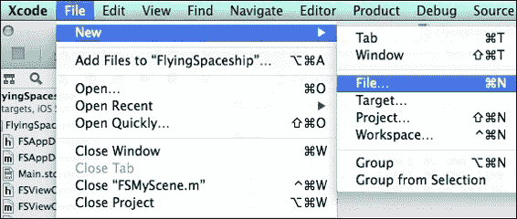

1.  然后在 **iOS 部分** 的 **资源** 部分中选择 **SpriteKit 粒子文件**，然后按 **下一步**。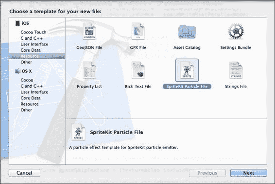

1.  从提供的粒子系统模板列表中选择 **Fire** 粒子系统模板，然后点击 **下一步** 创建火焰效果，该效果将用于描绘到目前为止构建的游戏中宇宙飞船的推力。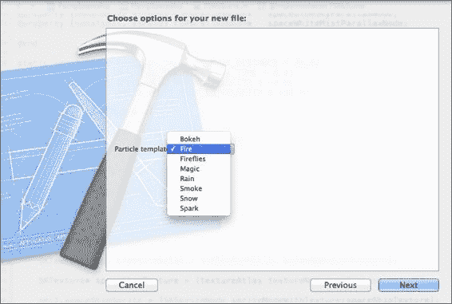

1.  将文件命名为 `FireParticle` 并点击 **创建**。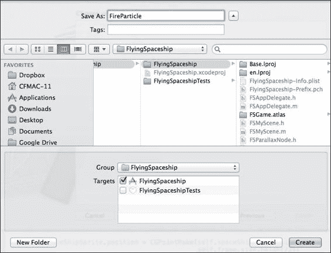

1.  因此，创建了一个名为`FireParticle.sks`的文件，它是粒子文件，并创建了一个名为`spark.png`的样本粒子图像。`Spark.png`文件是自动生成的，用作粒子系统的 sks 文件。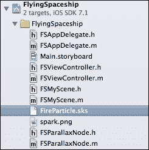

1.  如前一个屏幕截图所示，当我们选择`FireParticle.sks`文件时，在详细面板中创建的具有火焰效果的粒子系统看起来是这样的：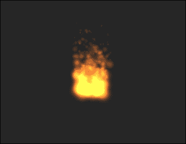

1.  使用右侧的检查器面板，我们可以根据我们的需求自定义默认的粒子系统。你可以向下滚动以探索检查器中的所有属性，因此你可以相应地更新设置。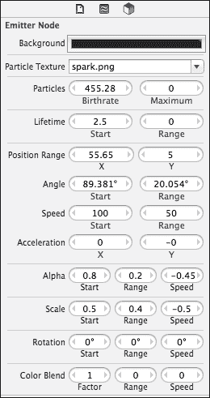

现在我们有了粒子系统，我们可以直接看到当从检查器更改某些值时的结果。实现也只需要几行代码，无需在代码中更改任何粒子系统值，只需选择文件并将其添加到任何节点或场景中。

让我们尝试并理解粒子系统文件的参数或属性。

如前一个屏幕截图中的列表所示，有一个背景部分可以改变编辑器背景的颜色。它只是在游戏构建时保存，但在运行时并不使用。

在此之下是一个粒子纹理，我们可以选择任何图像或资产用于粒子系统的渲染。它应该具有较小的尺寸和内存，因为粒子的数量将与使用的图像数量相等，这会降低帧率或性能。降低帧率反过来会减慢游戏速度，因此需要明智地使用。

一些属性用于确定粒子的生命周期，例如出生率、寿命和要发射的最大数量。粒子生成部分有**位置范围**、**角度**、**速度**和**加速度**。

除了所有这些之外，它还有缩放、旋转和透明度来改变粒子的变换。最后但同样重要的是，颜色修饰部分，其中可以完成我们粒子的混合和颜色。

因此，包含`FireParticle`文件并显式导入图像`spark.png`的粒子系统是该章节的入门套件。

## 工作原理

如前所述，创建整个粒子系统或粒子文件非常简单。但努力在于微调粒子发射器的属性，可以说类似于粒子系统的解剖。每个粒子系统都有许多不同的属性，影响单个粒子和整个粒子系统的外观、感觉和行为。

因此，要玩粒子系统文件，以下值相应地更改，从而产生我们想要的粒子效果。以下是一个属性列表，描述了如果更改这些属性会发生什么。

+   **背景**：这是粒子编辑器的背景。它仅在构建时保存，但在运行时不会反映出来。

+   **粒子纹理**：这是一个用作粒子图像的图像或资产纹理，用于渲染整个粒子系统。

+   **粒子出生率**：这是系统每秒生成的粒子数量。

+   **最大粒子数**：这是发射器必须总共生成的粒子数量；对于值为零的情况，将生成无限流粒子。

+   **生命周期**：这是粒子在从屏幕消失前的平均寿命；该值以秒为单位插入。

+   **位置范围**：这是粒子的平均起始位置。

+   **发射器角度**：这是粒子的平均初始方向。这意味着粒子必须以该角度发射。

+   **粒子速度和范围**：这是粒子应该移动的速度，还有一个 `SpeedRange` 参数；例如，如果它等于 50 且速度为 100，则速度值将在 50（100 - 50）到 150（100 + 50）之间变化。

+   **加速度**：这些用于 *x*（水平）和 *y*（垂直）加速度。

+   **Alpha**：这是粒子的初始 Alpha 值，它还有一个范围参数可以指定。

+   **缩放**：这是为粒子提供的初始缩放因子，即粒子的大小。

+   **旋转**：这是粒子的初始旋转。

+   **颜色混合**：在本节中，通过指定粒子的平均初始颜色，提供了一些混合模式。

## 还有更多

在游览安装和了解粒子编辑器之后，需要对不同粒子系统中的编辑器进行许多调整，以产生生动和酷炫的粒子效果。

在接下来的章节中，我们将调整 `FireParticle` 文件的值来构建太空船的推力，这在未来将被添加到游戏的空间环境中。

## 参见

为了更好地理解并学习关于 Xcode 的粒子编辑器以及调整粒子文件值，您可以访问以下链接：

[`developer.apple.com/library/ios/documentation/IDEs/Conceptual/xcode_guide-particle_emitter/Introduction/Introduction.html`](https://developer.apple.com/library/ios/documentation/IDEs/Conceptual/xcode_guide-particle_emitter/Introduction/Introduction.html)

# 在游戏中使用粒子系统

现在粒子编辑器的完整游览已经结束，我们可以使用粒子发射器了。我们将为我们的游戏构建一些东西，即使用相同的 `FireParticle` 文件来模拟太空船的推力，以及当太空船捡起硬币时使用默认烟雾模板的碰撞效果。

在本节中，我们将使用 Xcode 的粒子编辑器编辑粒子文件，以产生游戏粒子效果，例如太空船的推力，并创建一个新的名为 `SmokeParticle` 的粒子文件，用于硬币与太空船之间的碰撞效果。此外，我们还将讨论和了解一些初始的代码级别类。

## 准备就绪

我们应该熟悉 Xcode 的粒子编辑器，了解如何更改任何粒子文件的值，并创建一些可以在游戏中的某些地方使用的良好粒子系统。由于粒子编辑器的基本元素已在上一节中介绍，现在我们将更改 `FireParticle` 文件的某些值，并构建更多的粒子系统。

## 如何做

让我们从与粒子系统创建相关的文件开始，并更改其属性值。在创建粒子系统时，会创建两个文件：

+   一个 sks 文件，即粒子文件，用于创建一个 `SKEmitterNode` 对象，可以添加到任何节点或场景中。

+   导入了一个默认文件 `spark.png`，它用于在粒子编辑器中为特定的 sks 文件指定粒子图像。它可以是从外部导入的任何图像。

由于创建粒子文件的全过程已经清楚，我们将进一步调整 `FireParticle` 文件的某些属性，以创建太空船的推力。

1.  首先，由于太空船正朝屏幕的右侧移动，我们必须使推力从右向左产生。在 `FireParticle` 文件中，默认的角度值约为 89 度；将其更改为 180 度，使其看起来是从右向左。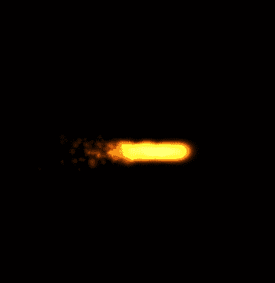

1.  如前一张快照所示，粒子更多，与太空船相比出生率非常高。因此，我们需要将粒子数减少到 50，出生率减少到 0.5，从而创建一个粒子系统更小、生命周期更短的粒子系统，如下一张快照所示：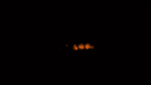

1.  进行一些调整，使其看起来像推力，将其速度设置为 `50`，将初始 alpha 值设置为 `180`，最后也是最重要的，将比例设置为 `0.2`，以便与太空船的比例相匹配。

1.  现在我们已经建立了太空船的推力，它看起来是这样的：

1.  以下是在 Xcode 的粒子编辑器中设置的值，用于使用默认的 `FireParticle` 文件创建太空船的推力。

在此之后，当太空船拾取硬币时，还需要创建一个名为碰撞效果的粒子效果。以下是为硬币和太空船的碰撞效果创建 `SmokeParticle` 文件（粒子系统）的步骤：

1.  打开 Xcode 并转到 **文件** | **新建** | **文件**。

1.  在 **iOS** 的 **资源** 部分中选择 **SpriteKit 粒子文件**，然后点击 **下一步**。

1.  为粒子系统选择**烟雾**模板，以创建一个继承的烟雾效果，然后点击**下一步**。

1.  将文件命名为`SmokeParticle`并点击**创建**。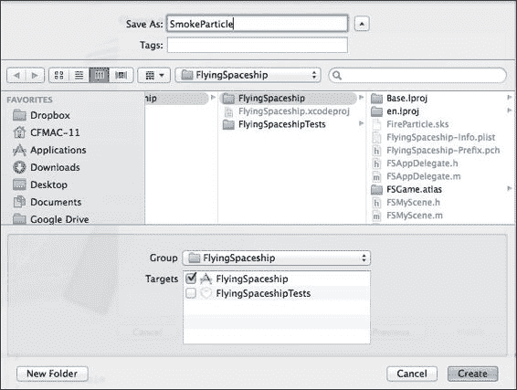

1.  因此，创建了一个`SmokeParticle.sks`文件，并且显式导入的`spark.png`文件也将被这个粒子文件使用。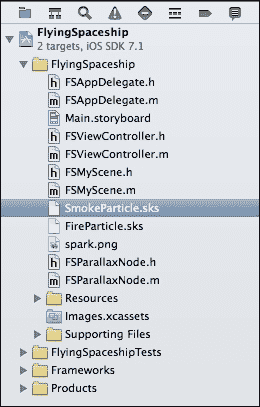

1.  在`SmokeParticle`文件的粒子编辑器中，创建的默认效果将看起来像这样：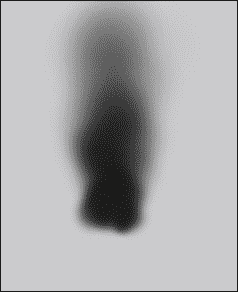

1.  现在为了产生白色烟雾效果，我们将更改粒子文件的属性。设置以下值以创建所需的效果：

    +   **颜色混合因子**设置为`0`

    +   **生命周期**设置为`2`

    +   **粒子**设置为`20`

    +   **角度**设置为`0`

    +   **速度**设置为`20`

    +   **最大粒子数**设置为`1`

    +   **缩放**设置为`0.2`

因此，在粒子编辑器中，碰撞硬币和太空船时将显示的小白烟雾效果如下：

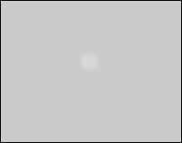

在所有更改完成后，粒子编辑器的编辑器检查器将看起来像这样：

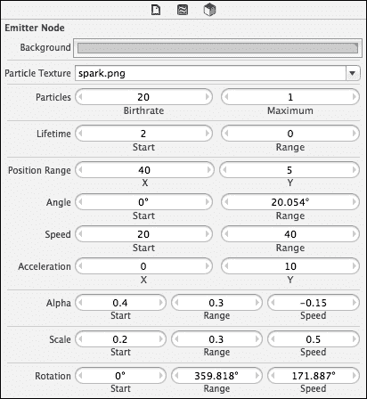

到目前为止，`FireParticle`和`SmokeParticle`文件都已准备好添加到游戏中，但我们应该了解用于将这些文件作为节点添加到某些节点或场景中的类。要使用的节点类是`SKEmitterNode`。

`SKEmitterNode`是`SKNode`的子类，它自动创建小粒子作为精灵并在屏幕上渲染。这些发射节点可以用来创建烟雾、火花、雨以及其他许多粒子效果。

例如，一个`SKEmitterNode`对象，我们既可以使用从粒子编辑器设置的属性的自定义 sks 粒子文件，也可以直接创建`SKEmitterNode`类的对象并在代码中程序化地更改属性。这意味着有两种方法可以做到这一点：

+   通过从包含预定义属性值的包中获取粒子文件路径来创建一个`SKEmitterNode`对象，然后将其添加到任何其他节点或场景中

+   创建一个`SKEmitterNode`对象，就像创建任何其他节点一样，设置所有属性，如粒子图像、生命周期、速度等，然后将其添加到任何其他节点或场景中

## 它是如何工作的

每当创建一个 SpriteKit 粒子文件时，都会使用导入的默认图像，例如 spark.png，作为该粒子系统中的粒子。我们也可以导入我们自己的任何图像来创建个性化的粒子系统。

如前所述，在制作太空船推力的过程中，我们更改了`FireParticle`文件的一些值以产生火焰推力：

+   我们将角度值更改为 180，以便推力的方向可以正确地按照太空船的方向，即从右向左移动

+   我们降低了生命周期和出生率以匹配太空船的容量，以便它可以按照其大小发射

+   我们还更改了粒子的初始大小，以匹配释放推力的机械

+   我们调整了速度、alpha 等参数

如前所述，在制作碰撞效果的过程中，我们更改了`SmokeParticle`文件的一些值以产生烟雾效果：

+   要使其变白，我们将**Color Blend**更改为 0

+   要使其快速消失，将**LifeTime**更改为 2，将**Speed**更改为 20

+   为了减少粒子的强度，将**Particles**的数量分配为 20，并且为了播放一次，将最大粒子数分配为 1

+   将角度设置为 0，比例设置为 0.2，使烟雾从左向右缓慢移动

因此，如何让发射粒子系统表现、放置和构建，完全取决于我们。

说到帮助添加该粒子系统的类，即`SKEmitterNode`，它通过文件或代码本身在游戏中添加粒子系统。我们将在下一节中在代码级别执行这两种选项。

## 还有更多

在彻底使用粒子编辑器后，我们真的可以构建一些粒子系统，这些系统可以作为环境变化添加，例如制作雪效果，然后随机添加到场景中，营造出下雪的感觉。使用粒子系统编辑器可以构建更多类似这样的酷炫变化。

在下一节中，我们将添加我们之前在游戏中构建的太空船的推力，以增强太空船的感觉和活力。

## 参考信息

关于`SKEmitterNode`及其相关属性的更详细文档，您可以访问以下链接 [`developer.apple.com/library/ios/documentation/SpriteKit/Reference/SKEmitterNode_Ref/index.html`](https://developer.apple.com/library/ios/documentation/SpriteKit/Reference/SKEmitterNode_Ref/index.html)。

# 粒子发射器集成

现在，我们已经准备好并装备好将粒子系统添加到我们的游戏《FlyingSpaceship》中。在本节中，我们将取`FireParticle`和`SmokeParticle`文件，为相应的文件创建一个`SKEmitterNode`对象，并在某些事件中将它添加到相应的实体上。

在完成所有这些之后，游戏中将出现太空船的推力，使我们的角色变得更加强大。此外，当太空船拾取硬币时，还会看到碰撞烟雾效果。

## 准备工作

我们将首先在游戏中添加发射器。我们还应该阅读前几节中提供的`SKEmitterNode`类的文档。然后我们可以继续添加本章入门套件中太空船推力添加的代码。

## 如何操作

继续使用相同的 Xcode 项目，现在我们将为这一章创建我们的解决方案包，即第四章。

以下是在我们的游戏中添加太空船推力的步骤：

1.  打开`FSMyScene`类，并添加一个名为`addSpaceShipThrust`的方法。

    要获取一个粒子文件，首先我们需要文件的路径来从包中选取。找到路径的方法需要粒子文件的名称和类型。

    ```swift
        NSString *emitterPath = [[NSBundle mainBundle] pathForResource:@"FireParticle" ofType:@"sks"];
    ```

1.  然后，我们可以使用`NSKeyedUnarchiver`实例化一个新的`SKEmitterNode`对象，该对象将返回一个`SKEMitterNode`对象，用于提供的路径。

    ```swift
        SKEmitterNode *emitterNode = [NSKeyedUnarchiver unarchiveObjectWithFile:emitterPath];
    ```

1.  一旦创建了发射器对象，指定其位置，这个位置必须是飞船的中心，因为推力就在那里。

    ```swift
        emitterNode.particlePosition = CGPointMake(-self.spaceShipSprite.frame.size.width/2,0);
    ```

1.  最后，在完成所有配置后，只需将`emitterNode`对象添加到`SpaceShipSprite`。

    ```swift
        [self.spaceShipSprite addChild:emitterNode];
    ```

1.  在`addSpaceShip`方法之后立即调用`addSpaceShipThrust`方法。

1.  前面的`SKEmitterNode`完全使用**SpriteKit Particle**文件创建。但我们可以直接在代码中调整`SKEmitterNode`的属性。

1.  由于我们想在添加发射器节点后增加推力的速度，因此，为此，我们可以编辑发射器节点对象的`speed`属性。

    ```swift
        emitterNode.speed = 500.0f;
    ```

1.  通过使用粒子编辑器创建`FireParticle`文件，并使用`SKEmitterNode`类将其添加到代码中，我们的游戏角色（即飞船）的后面出现了推力。

在我们的游戏中，在硬币和飞船碰撞时添加烟雾效果的步骤如下：

1.  打开`FSMyScene`类，并添加一个名为`addCoinCollisionEffectWithSpaceShip`的方法。

1.  重复我们在创建飞船推力时执行的步骤。指定文件名和类型以获取路径。

    ```swift
        NSString *emitterPath = [[NSBundle mainBundle] pathForResource:@"SmokeParticle" ofType:@"sks"];
    ```

1.  然后，我们可以使用`NSKeyedUnarchiver`实例化一个新的`SKEmitterNode`对象，该对象将返回一个`SKEMitterNode`对象，用于提供的路径。

    ```swift
        SKEmitterNode *emitterNode = [NSKeyedUnarchiver unarchiveObjectWithFile:emitterPath];
    ```

1.  一旦创建了发射器对象，指定其位置，这个位置将是飞船的中心。

    ```swift
        emitterNode.particlePosition =  CGPointMake(0,0);
    ```

1.  最后，在完成所有配置后，只需将`emitterNode`对象（即`SmokeEffect`对象）添加到`SpaceShipSprite`。

    ```swift
        [self.spaceShipSprite addChild:emitterNode];
    ```

1.  将所有这些行添加到`addCoinCollisionEffectWithSpaceShip`方法中，看起来是这样的。

1.  现在在名为`spaceShipCollidedWithCoin`的方法中调用此方法。

    ```swift
        [self addCoinCollisionEffectWithSpaceShip];
    ```

1.  调用添加`Coin CollisionEffect`后，`spaceShipCollidedWithCoin`看起来是这样的。

通过使用粒子编辑器创建`SmokeParticle`文件，并使用`SKEmitterNode`类将其添加到飞船的代码中，烟雾碰撞效果出现在硬币和飞船的碰撞点。

## 工作原理

这就是我们在添加`SKEmitterNode`到`SKSprite`时的工作原理，以及前述步骤的结果，如下面的截图所示，为飞船添加了推力：

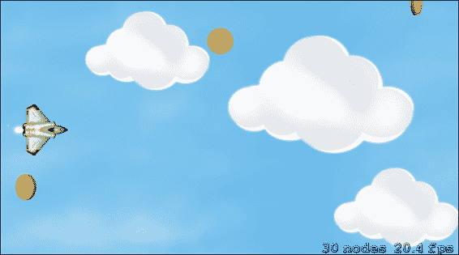

同样，为了添加碰撞烟雾效果，我们需要在前面章节中创建的 `ParticleSystem` 文件。对于这种效果，过程与前面描述的太空船推力类似。以下是实现碰撞烟雾效果后的两个快照。

+   硬币与太空船碰撞：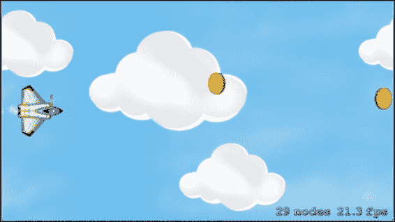

+   产生的碰撞烟雾效果：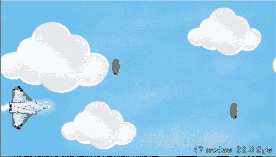

## 更多内容

当太空船产生推力时，我们可以在这些实体或发生任何事件时添加各种这样的小粒子效果。同样，我们也可以在太空船捡起硬币时添加粒子效果。如果需要，我们还可以构建一个可以改变整个环境感觉的粒子效果，例如在前面章节中讨论的创建雨或雪。

## 参见

使用 Xcode 的粒子编辑器可以执行各种操作。要了解更多关于粒子系统的信息，请访问 [`developer.apple.com/library/ios/documentation/SceneKit/Reference/SCNParticleSystem_Class/index.html`](https://developer.apple.com/library/ios/documentation/SceneKit/Reference/SCNParticleSystem_Class/index.html)。

# 游戏性能分析

在构建游戏时，为了创建一个实时游戏环境，会进行大量的处理和分析，因此对游戏性能分析有巨大的需求，这对于游戏的平稳运行或软件产品的运行都是必要的。

从用户的角度来看，如果游戏变得缓慢或停止响应，技术上降低帧率，用户可能会对他们正在玩的游戏感到沮丧，并会寻找替代方案。因此，游戏必须达到良好的性能水平，游戏开发者可以通过进行性能分析来实现这一点，这也有助于轻松识别问题并修复它们。

因此，在软件性能分析领域，开发者需要使用特定的工具和性能文档，以便他们可以识别和修复常见性能问题，从而构建一个性能稳定且更好的游戏。

在这个菜谱中，我们查看一些应用程序的性能工具，如何使用它们，确定丢失的池，并修复它们，从而保持应用程序更好的性能水平。

## 准备工作

为了进行性能分析，我们应该了解一些术语，例如绘图代码、启动时间初始化代码、文件访问代码、应用程序足迹、内存分配代码、基本的优化技巧、基于事件的处理器、提高程序任务的并发性、使用加速框架、现代化应用程序等等。

## 如何操作

Xcode 包含了多个图形应用程序和命令行工具，用于收集性能指标。有许多可用的工具，例如仪器、分析工具、监控工具、硬件分析工具、额外的命令行工具等等。

所有这些工具都用于收集性能数据，但其中一些使用频率更高，例如内置的调试导航器检查器、工具和许多其他工具。因此，在本节中，你将了解调试导航器和工具的仪器。

### 调试导航器

在 Xcode 项目的项目导航器中，调试导航器位于面板的第六位，显示正在运行的应用程序的 **CPU** 利用率和 **内存** 利用率。

分析应用程序利用率类型的步骤如下：

1.  首先，打开任何项目，或者我们可以打开本章解决方案套件中的自己的项目，然后按 *command* + *R* 运行应用程序 FlyingSpaceship。

1.  点击调试导航器；会出现一个类似这样的面板：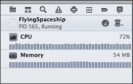

1.  在这里，显示在面板中的总 **CPU** 利用率百分比，即 **72%** 和使用的 **内存**，即 **54 MB**。为了进一步分析这些指标，我们可以点击相应的行以查看适当的图表。

在 **CPU** 中，显示了三个不同部分的图表：

+   CPU 利用率部分：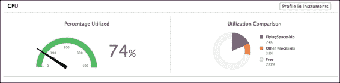

+   随时间利用部分：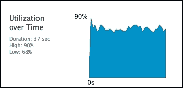

+   线程部分：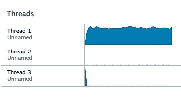

在 **内存** 中，显示了两个不同部分的图表：

+   内存利用率：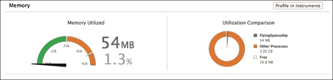

+   基于时间的内存图表：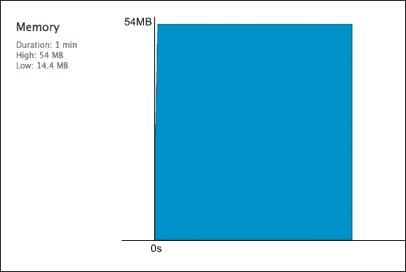

### 仪器

Instruments 是一套功能强大的分析工具，具有图形用户界面。Instruments 帮助了解我们应用程序的运行时行为。它一次只显示我们程序的一个方面，因此我们可以使用多个仪器配置每个性能分析会话，每个仪器收集特定的性能指标。

谈到用户界面，所有数据都是并排显示的，以便可以从一个仪器关联到另一个仪器，识别我们应用程序行为中遵循的趋势。这些指标可以使用仪器收集：

+   基于核心数据的应用程序

+   文件系统的读写操作

+   与内存相关的分配和对象对应的统计数据

+   内存泄漏信息

+   Cocoa 分发的有关事件的信息

+   应用程序在运行时的样本

+   与垃圾收集代码相关的统计数据

使用仪器的步骤如下：

1.  首先，打开任何项目，或者我们可以从本章解决方案套件中打开自己的项目，然后按 *command* + *R* 运行应用程序 FlyingSpaceship。

1.  点击调试导航器的 **CPU** 利用率部分。

1.  然后点击此部分的顶部最右边的 **Profile in Instruments** 按钮。Xcode 将弹出一个窗口询问我们是否要将相同的会话传输到仪器或重新启动。我们可以选择我们希望分析的选项。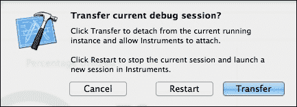

1.  假设我们选择传输，那么 Xcode 将默认打开仪器，并在用户界面中插入一个时间分析器，显示不同线程的运行时间。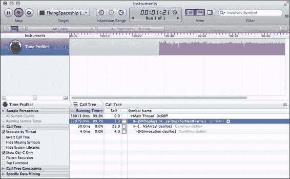

我们也可以通过按下 *command* + *i* 来运行仪器，它将打开仪器以选择要分析的指标，类似于以下内容：

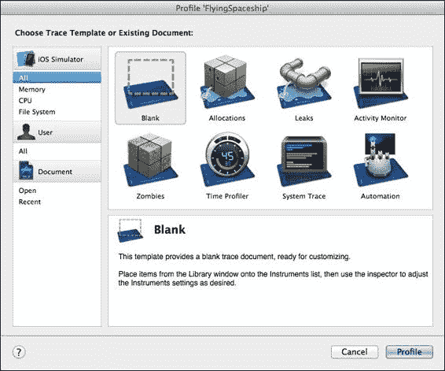

现在执行以下步骤：

1.  现在假设我们选择 **Allocations** 类别来查看这些应用程序的分配。

1.  但分配不是可读格式；因此，点击 **Statistics** 按钮，并选择 **Call Trees** 以使调用按调用顺序排列。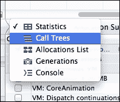

1.  之后，为了更好的可读性，请勾选 **Show Obj-C Only** 复选框。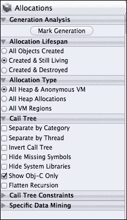

1.  点击这两个按钮后，我们就可以真正查看应用程序中分配是如何发生的。您可以使用这些方法查看和分析您的分配。

1.  为了进一步分析，有许多更多可以通过点击顶部栏按钮 **Library** 来包含的指标。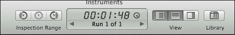

这就是库的外观，有许多选择其他指标选项：


通过使用这个库，我们可以包含多个指标，如泄漏、时间分析器，并在仪器的侧面板中集中查看它们。

## 还有更多

为了更好地理解代码更改如何影响性能，请使用本节中列出的工具，例如仪器。并且，为了更好地理解前面讨论的术语，请阅读以下提供的文档：

[`developer.apple.com/library/mac/documentation/Performance/Conceptual/PerformanceOverview/BasicTips/BasicTips.html#//apple_ref/doc/uid/TP40001410-CH204-BBCGCFGF`](https://developer.apple.com/library/mac/documentation/Performance/Conceptual/PerformanceOverview/BasicTips/BasicTips.html#//apple_ref/doc/uid/TP40001410-CH204-BBCGCFGF).

## 参见

要检查任何应用程序的性能水平并提高它，请使用以下链接中记录的工具和初始性能评估流程：

+   [`developer.apple.com/library/mac/documentation/Performance/Conceptual/PerformanceOverview/PerformanceTools/PerformanceTools.html#//apple_ref/doc/uid/TP40001410-CH205-BCIIHAAJ`](https://developer.apple.com/library/mac/documentation/Performance/Conceptual/PerformanceOverview/PerformanceTools/PerformanceTools.html#//apple_ref/doc/uid/TP40001410-CH205-BCIIHAAJ).

+   [`developer.apple.com/library/mac/documentation/Performance/Conceptual/PerformanceOverview/InitialEvaluation/InitialEvaluation.html#//apple_ref/doc/uid/TP40001410-CH206-CJBFHBDB`](https://developer.apple.com/library/mac/documentation/Performance/Conceptual/PerformanceOverview/InitialEvaluation/InitialEvaluation.html#//apple_ref/doc/uid/TP40001410-CH206-CJBFHBDB).
