# 第七章. 为游戏添加现实感

在本章中，我们将涵盖以下食谱：

+   在世界中创建物理体

+   物理关节

+   检测接触和碰撞

# 简介

在前面的章节中，你学习了游戏物理模拟的结构。我们已经探索了物理引擎的各个部分，包括其与游戏的集成以及游戏引擎基础的操作。你还学习了创建静态和动态体的方法。现在，在本章中，我们将重点关注通过高级物理集成为游戏添加更多现实感。这包括与关节连接的许多物理体的操作。你还将学习检测两个物理体之间碰撞的方法。整体目标是在本章中创建一个迷你游戏，它将包含所有食谱，并有助于更好地理解这些部分。游戏将分为以下三个部分：

+   创建包含一些物理体的物理世界游戏

+   然后，我们将继续前进，使用各种类型的关节将物理体连接起来

+   然后，最终，你将学习各种检测世界中各种物理体之间碰撞和接触的方法

# 在世界中创建物理体

在本食谱中，我们将创建一个新的游戏项目，并将其设置成适用于所有食谱。这个游戏项目将包含创建物理世界和一些物理体对象。我们将使用这些物理对象在它们之间添加关节。

## 准备就绪

要开发一个使用物理引擎的迷你游戏，首先创建一个新的项目。打开 Xcode，转到**文件** | **新建** | **项目**，导航到**iOS** | **应用程序** | **SpriteKit Game**。在弹出的窗口中，将产品名称指定为`Physics Joints`，导航到**设备** | **iPhone**，并点击**下一步**，如下面的截图所示：

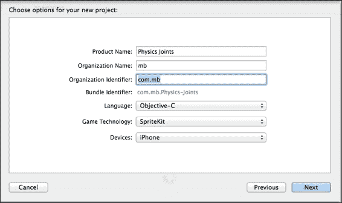

点击**下一步**，并将项目保存到你的硬盘上。

保存项目后，你应该能够看到项目设置。在这个项目设置页面中，只需取消选中**设备方向**部分中的**纵向**，因为我们只支持本游戏的横屏模式。最终屏幕应类似于以下截图：

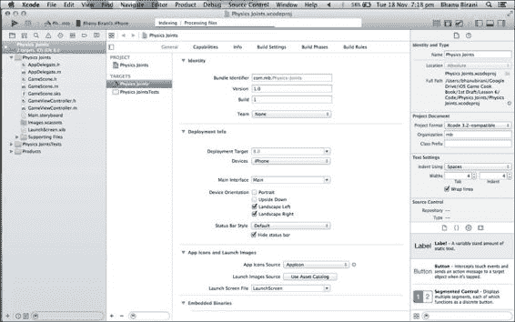

## 如何操作...

现在我们的项目模板已经准备好包含一些高级物理行为。为了适应这些行为，我们还需要在项目中调整一些代码。按照以下步骤更新项目以满足我们的要求：

1.  打开本章代码包中可用的`GameScene.m`文件；这个类创建了一个将被插入到游戏中的场景。从这个类中删除所有代码，并仅添加以下函数：

    ```swift
    -(id)initWithSize:(CGSize)size {
        if (self = [super initWithSize:size]) {
            self.backgroundColor = [SKColor colorWithRed:0.15 green:0.15 blue:0.3 alpha:1.0];
        }
        return self;
    }
    ```

    这个`initWithSize`方法创建了一个指定大小的空场景。`init`函数中编写的代码改变了场景的背景颜色。我们可以调整 RGB 值以获得所需的背景颜色。

1.  现在打开`GameViewController.m`文件。从该文件中删除所有代码，并添加以下函数：

    ```swift
    -(void)viewWillLayoutSubviews {
        [super viewWillLayoutSubviews];

        // Configure the view.
        SKView * skView = (SKView *)self.view;
        if (!skView.scene) {
            skView.showsFPS = YES;
            skView.showsNodeCount = YES;

            // Create and configure the scene.
            GameScene * scene = [GameScene sceneWithSize:skView.bounds.size];
            scene.scaleMode = SKSceneScaleModeAspectFill;

            // Present the scene.
            [skView presentScene:scene];
        }
    }
    ```

1.  现在编译并运行应用程序。你应该能够正确地看到背景颜色。这看起来类似于以下截图：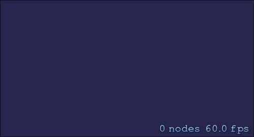

1.  现在我们已经设置了背景颜色，所以让我们向世界添加重力。打开`GameScene.m`文件，并在`initWithSize`方法的末尾添加以下代码行：

    ```swift
    self.physicsWorld.gravity = CGVectorMake(0.0f, -0.5f);
    ```

    这行代码将设置世界的重力为-0.5，这意味着所有物理对象在游戏场景中都将受到向地面的力。

1.  现在我们已经应用了一些重力，使物体被拉向地面。因此，为世界添加一些边界是很重要的，这将保持世界中的所有物体，并防止它们离开屏幕。添加以下代码行以在屏幕周围添加不可见的边界以保持物理对象：

    ```swift
    self.PhysicsBody = [SKPhysicsBody bodyWithEdgeLoopFromRect:self.frame];
    self.physicsBody.friction = 0.0f;
    ```

1.  在第一行，我们创建了一个基于屏幕大小的框架的边缘物理边界对象。这种物理体没有质量或体积，它们也不会受到力和冲量的影响。然后我们将对象与场景的物理体关联起来。在最后一行，我们将物体的摩擦力更改为 0，以使物体与边界表面的交互无损耗。

1.  现在我们已经准备好在世界上创建物理体。在`initWithSize`方法之后添加以下方法：

    ```swift
    -(void)update:(CFTimeInterval)currentTime {
        /* Called before each frame is rendered */
    }
    ```

    这是将在游戏执行过程中的每一帧调用的更新方法。因此，所有需要定期更新的操作都将在这个方法中编码。

1.  是时候在世界上创建物理对象了。所有物理对象都被称为体。现在添加以下方法来在物理世界中创建体。

    ```swift
    -(void)createPhysicsBodiesOnScene:(SKScene*)scene
    {
        //Adding Rectangle
        SKSpriteNode* backBone = [[SKSpriteNode alloc] initWithColor:[UIColor whiteColor] size:CGSizeMake(20, 200)];
        backBone.position = CGPointMake(CGRectGetWidth(self.frame)/2.0, CGRectGetHeight(self.frame)/2.0);
        backBone.physicsBody = [SKPhysicsBody bodyWithRectangleOfSize:backBone.size];
        [scene addChild:backBone];

        //Adding Square
        SKSpriteNode* head = [[SKSpriteNode alloc] initWithColor:[SKColor grayColor] size:CGSizeMake(40, 40)];
        head.position = CGPointMake(backBone.position.x, backBone.position.y-40);
        head.physicsBody = [SKPhysicsBody bodyWithRectangleOfSize:head.size];
        [scene addChild:head];

    }
    ```

    上述代码将创建两个物理体，一个矩形和一个正方形。我们已经调整了物体相对于彼此的位置。

1.  现在，在`initWithSize`方法的末尾添加以下代码行以在游戏场景中添加物理体：

    ```swift
    [self createPhysicsBodiesOnScene:self];
    ```

    在这里，我们通过调用`initWithSize`中的实例方法来创建物体。

1.  现在，编译并运行应用程序。你应该能够看到在世界上创建的两个物理体，并且由于重力作用，它们将落向地面。这看起来类似于以下截图：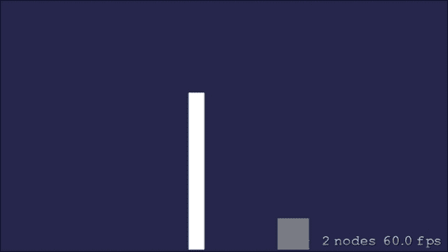

# 物理关节

我们已经看到了物理引擎的许多有趣特性。然而，我们可以通过使用关节将物理体相互连接来使我们的游戏更加有趣。所有物理模拟和力都将考虑它们连接的方式后应用于体上。

## 准备中

将两个物理体连接在一起的方法有很多种。它们根据连接的物体位置和位置而有所不同。根据连接物体的方式，关节被分为以下类型：

+   **销轴**：这种类型的关节将两个物理体连接/固定在一起，这样它们都可以独立地围绕它们的锚点旋转。关节看起来类似于以下图示：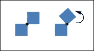

+   **限制关节**：在这种类型的关节中，两个物体总是保持彼此之间的最大固定距离。这就像两个物体通过一根固定最大距离的绳子连接在一起。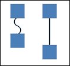

+   **弹簧关节**：这种类型的关节将两个物体连接起来，就像它们通过弹簧连接在一起一样。这使得它们以完美的弹性方式行为。弹簧的长度可以通过两个物体之间的初始距离来定义。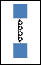

+   **滑动关节**：这种类型的关节允许两个物体相对于彼此滑动。滑动轴可以由用户明确定义。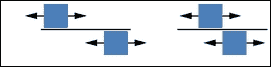

+   **固定关节**：这种类型的关节通过提供的参考点将两个物理体融合在一起。这些关节可以用来创建复杂物体，这些物体以后可以被分解成碎片。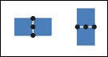

## 如何操作…

现在，我们将再次打开我们的工作项目，以集成和实现项目中所有类型的关节。以下步骤将提供逐步实现关节和理解它们的更深入的方法。

1.  要实现销轴，打开`GameScene.m`文件，并在其中添加以下函数：

    ```swift
    -(void)createPinJointOnScene:(SKScene*)scene
    {
        //Adding Rectangle
        SKSpriteNode* backBone = [[SKSpriteNode alloc] initWithColor:[UIColor whiteColor] size:CGSizeMake(20, 200)];
        backBone.position = CGPointMake(CGRectGetWidth(self.frame)/2.0, CGRectGetHeight(self.frame)/2.0);
        backBone.physicsBody = [SKPhysicsBody bodyWithRectangleOfSize:backBone.size];
        backBone.physicsBody.categoryBitMask = GFPhysicsCategoryRectangle;
        backBone.physicsBody.collisionBitMask = GFPhysicsCategoryWorld;
        [scene addChild:backBone];

        //Adding Square
        SKSpriteNode* head = [[SKSpriteNode alloc] initWithColor:[SKColor grayColor] size:CGSizeMake(40, 40)];
        head.position = CGPointMake(backBone.position.x+5, backBone.position.y-40);
        head.physicsBody = [SKPhysicsBody bodyWithRectangleOfSize:head.size];
        head.physicsBody.categoryBitMask = GFPhysicsCategorySquare;
        head.physicsBody.collisionBitMask = GFPhysicsCategoryWorld;
        [scene addChild:head];

        //Pinning Rectangle and Square
        NSLog(@"Head position %@", NSStringFromCGPoint(head.position));
        SKPhysicsJointPin* pin =[SKPhysicsJointPin jointWithBodyA:backBone.physicsBody bodyB:head.physicsBody anchor:CGPointMake(head.position.x-5, head.position.y)];
        [scene.physicsWorld addJoint:pin];
    }
    ```

    在代码的前五行中，我们创建了一个带有物理体的矩形精灵。我们也为这个精灵指定了碰撞和类别掩码。

    类似地，在以下代码行中，我们将创建一个带有物理体的正方形精灵。对于这个精灵，我们也指定了类别和碰撞掩码。

    然后，最后，在代码的最后三行中，我们将两个物体通过销轴连接在一起。我们创建了一个`SKPhysicsJointPin`类的对象，并将矩形和正方形物体以及它们将围绕其旋转的锚点提供给它。

1.  现在，将`createPhysicsBodiesOnScene`函数调用替换为`createPinJointOnScene`。在`init`函数的末尾添加以下代码：

    ```swift
    [self createPinJointOnScene:self];
    ```

    最终的函数看起来应该类似于以下截图：

    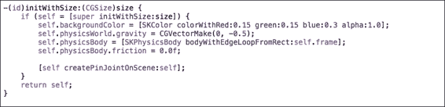

1.  现在，编译并运行项目，你应该能够看到通过销轴连接的两个物理体。你可以看到它们通过锚点相互连接。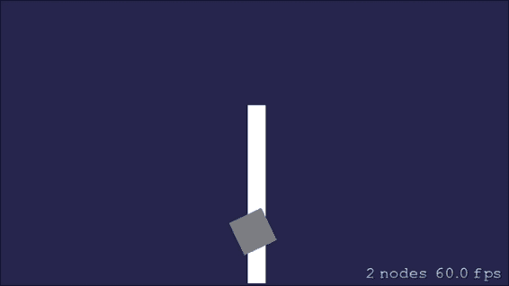

1.  现在，我们将实现固定连接；打开`GameScene.m`文件，并添加以下函数以实现固定连接：

    ```swift
    -(void)createFixedJointOnScene:(SKScene*)scene
    {
        //Adding Rectangle
        SKSpriteNode* backBone = [[SKSpriteNode alloc] initWithColor:[UIColor whiteColor] size:CGSizeMake(20, 200)];
        backBone.position = CGPointMake(CGRectGetWidth(self.frame)/2.0, CGRectGetHeight(self.frame)/2.0);
        backBone.physicsBody = [SKPhysicsBody bodyWithRectangleOfSize:backBone.size];backBone.physicsBody.categoryBitMask = GFPhysicsCategoryRectangle;
        backBone.physicsBody.collisionBitMask = GFPhysicsCategoryWorld;
        [scene addChild:backBone];

        //Adding Square
        SKSpriteNode* head = [[SKSpriteNode alloc] initWithColor:[SKColor grayColor] size:CGSizeMake(40, 40)];
        head.position = CGPointMake(backBone.position.x+5, backBone.position.y-40);
        head.physicsBody = [SKPhysicsBody bodyWithRectangleOfSize:head.size];
        head.physicsBody.categoryBitMask = GFPhysicsCategorySquare;
        head.physicsBody.collisionBitMask = GFPhysicsCategoryWorld;
        [scene addChild:head];

        //Pinning Rectangle and Square
        NSLog(@"Head position %@", NSStringFromCGPoint(head.position));
        SKPhysicsJointFixed* pin =[SKPhysicsJointFixed jointWithBodyA:backBone.physicsBody bodyB:head.physicsBody anchor:CGPointMake(head.position.x-5, head.position.y)];
        [scene.physicsWorld addJoint:pin];
    }
    ```

    现在，我们已经使用固定连接将两个物理体连接在一起。在上一个函数中，我们提供了两个体以及它们所连接的锚点。

1.  现在，将`createPinJointOnScene`函数调用替换为`createFixedJointOnScene`。在`init`函数的末尾添加以下代码：

    ```swift
    [self createFixedJointOnScene:self];
    ```

1.  现在，编译并运行项目，你应该能够看到两个物理体通过固定连接连接在一起。你会观察到，两个体通过指定的锚点连接在一起。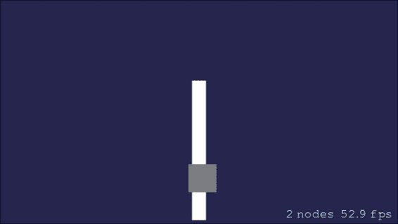

1.  现在，要在我们的示例项目中实现滑动连接，打开`GameScene.m`文件，并在末尾添加以下函数：

    ```swift
    -(void)createSlidingJointOnScene:(SKScene*)scene {
        //Adding Rectangle
        SKSpriteNode* backBone = [[SKSpriteNode alloc] initWithColor:[UIColor whiteColor] size:CGSizeMake(20, 200)];
        backBone.position = CGPointMake(CGRectGetWidth(self.frame)/2.0, CGRectGetHeight(self.frame)/2.0);
        backBone.physicsBody = [SKPhysicsBody bodyWithRectangleOfSize:backBone.size];
        backBone.physicsBody.categoryBitMask = GFPhysicsCategoryRectangle;
        backBone.physicsBody.collisionBitMask = GFPhysicsCategoryWorld;
        backBone.physicsBody.affectedByGravity = NO;
        backBone.physicsBody.allowsRotation = NO;
        [scene addChild:backBone];

        //Adding Square
        SKSpriteNode* head = [[SKSpriteNode alloc] initWithColor:[SKColor grayColor] size:CGSizeMake(40, 40)];
        head.position = CGPointMake(backBone.position.x, backBone.position.y-40);
        head.physicsBody = [SKPhysicsBody bodyWithRectangleOfSize:head.size];
        head.physicsBody.categoryBitMask = GFPhysicsCategorySquare;
        head.physicsBody.collisionBitMask = GFPhysicsCategoryWorld;
        [scene addChild:head];

        //Pinning Rectangle and Square
        NSLog(@"Head position %@", NSStringFromCGPoint(head.position));
        SKPhysicsJointSliding* pin =[SKPhysicsJointSliding jointWithBodyA:backBone.physicsBody bodyB:head.physicsBody anchor:head.position axis:CGVectorMake(0, 1)];
        pin.shouldEnableLimits = YES;
        pin.upperDistanceLimit = 200;
        pin.lowerDistanceLimit = -100;

        [scene.physicsWorld addJoint:pin];
    }
    ```

1.  现在，你会注意到我们正在创建两个物理体，在最后一个部分中，我们使用滑动连接将它们连接起来。然而，为了看到滑动连接的效果，我们将在正方形体上应用冲量。添加以下函数以应用冲量：

    ```swift
    -(void)applyImpulseUpwards:(NSTimer*)timer {
        NSDictionary* dict = [timer userInfo];
        SKPhysicsBody* body = dict[@"body"];

        CGVector impulse = CGVectorMake(0, [dict[@"impulse"] intValue]);

        [body applyImpulse:impulse];
    }
    ```

1.  要添加冲量实现，我们将在`createSlidingJointOnScene`函数的末尾添加以下代码行。

    ```swift
    [NSTimer scheduledTimerWithTimeInterval:5 target:self selector:@selector(applyImpulseUpwards:) userInfo:@{@"body":head.physicsBody,@"impulse":@(25)} repeats:YES];
    ```

    现在，正方形体会每 5 秒经历一次冲量。

1.  现在，将`createFixedJointOnScene`函数调用替换为`createSlidingJointOnScene`。在`init`函数的末尾添加以下代码：

    ```swift
    [self createSlidingJointOnScene:self];
    ```

1.  现在，编译并运行项目，你应该能够看到两个物理体相互滑动。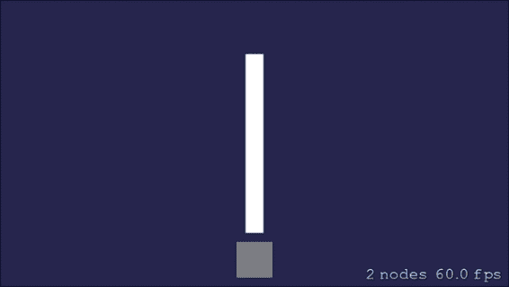

1.  现在我们将着手在我们的示例项目中实现弹簧连接。打开`GameScene.m`文件，并在文件末尾添加以下函数：

    ```swift
    -(void)createSpringJointOnScene:(SKScene*)scene
    {
        SKSpriteNode* backBone = [[SKSpriteNode alloc] initWithColor:[UIColor whiteColor] size:CGSizeMake(20, 200)];
        backBone.position = CGPointMake(CGRectGetWidth(self.frame)/2.0, CGRectGetHeight(self.frame)/2.0);
        backBone.physicsBody = [SKPhysicsBody bodyWithRectangleOfSize:backBone.size];
        backBone.physicsBody.categoryBitMask = GFPhysicsCategoryRectangle;
        backBone.physicsBody.collisionBitMask = GFPhysicsCategoryWorld;
        [scene addChild:backBone];

        //Adding Square
        SKSpriteNode* head = [[SKSpriteNode alloc] initWithColor:[SKColor grayColor] size:CGSizeMake(40, 40)];
        head.position = CGPointMake(backBone.position.x, backBone.position.y+backBone.size.height/2.0+40);
        head.physicsBody = [SKPhysicsBody bodyWithRectangleOfSize:head.size];
        head.physicsBody.categoryBitMask = GFPhysicsCategorySquare;
        head.physicsBody.collisionBitMask = GFPhysicsCategoryWorld;
        [scene addChild:head];

        //Pinning Rectangle and Square
        NSLog(@"Head position %@", NSStringFromCGPoint(head.position));
        SKPhysicsJointSpring* pin =[SKPhysicsJointSpring jointWithBodyA:backBone.physicsBody bodyB:head.physicsBody anchorA:head.position anchorB:CGPointMake(backBone.position.x, backBone.position.y+backBone.size.height/2.0)];
        pin.damping = 0.5;
        pin.frequency = 0.5;
        [scene.physicsWorld addJoint:pin];
    }
    ```

    要在两个物理体之间应用弹簧连接，我们已提供两个物理体以及两个锚点作为函数参数。我们还可以提供额外的参数，例如阻尼和频率。

1.  现在，将`createSlidingJointOnScene`函数调用替换为`createSpringJointOnScene`。在`init`函数的末尾添加以下代码：

    ```swift
    [self createSpringJointOnScene:self];
    ```

1.  现在，编译并运行项目，你应该能够看到两个物理体相互滑动。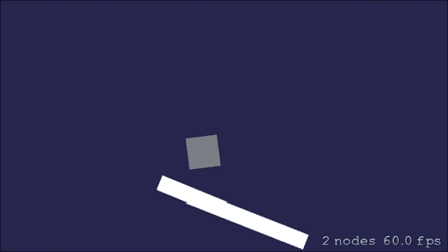

1.  我们在示例项目中接下来的一种连接类型是极限连接。现在打开`GameScene.m`文件，并在文件末尾添加以下函数：

    ```swift
    -(void)createLimitJointOnScene:(SKScene*)scene {
        SKLabelNode* label = [SKLabelNode labelNodeWithFontNamed:@"Futura-Medium"];
        label.text = @"An upward impulse is applied to the square every few seconds.";
        label.fontSize = 14;
        label.position = CGPointMake(220, scene.view.frame.size.height-100);
        [scene addChild:label];

        SKSpriteNode* backBone = [[SKSpriteNode alloc] initWithColor:[UIColor whiteColor] size:CGSizeMake(20, 200)];
        backBone.position = CGPointMake(CGRectGetWidth(self.frame)/2.0, CGRectGetHeight(self.frame)/2.0);
        backBone.physicsBody = [SKPhysicsBody bodyWithRectangleOfSize:backBone.size];
        backBone.physicsBody.categoryBitMask = GFPhysicsCategoryRectangle;
        backBone.physicsBody.collisionBitMask = GFPhysicsCategoryWorld;
        [scene addChild:backBone];

        //Adding Square
        SKSpriteNode* head = [[SKSpriteNode alloc] initWithColor:[SKColor grayColor] size:CGSizeMake(40, 40)];
        head.position = CGPointMake(backBone.position.x, backBone.position.y+backBone.size.height/2.0+40);
        head.physicsBody = [SKPhysicsBody bodyWithRectangleOfSize:head.size];
        head.physicsBody.categoryBitMask = GFPhysicsCategorySquare;
        head.physicsBody.collisionBitMask = GFPhysicsCategoryWorld;
        [scene addChild:head];

        //Pinning Rectangle and Square
        NSLog(@"Head position %@", NSStringFromCGPoint(head.position));
        SKPhysicsJointLimit* pin =[SKPhysicsJointLimit jointWithBodyA:backBone.physicsBody bodyB:head.physicsBody anchorA:head.position anchorB:CGPointMake(backBone.position.x, backBone.position.y+backBone.size.height/2.0)];
        pin.maxLength = 100;
        [scene.physicsWorld addJoint:pin];

        [NSTimer scheduledTimerWithTimeInterval:5 target:self selector:@selector(applyImpulseUpwards:) userInfo:@{@"body":head.physicsBody,@"impulse":@(50)} repeats:YES];
    }
    ```

    在倒数第二个部分，我们在我们创建的两个物理体上应用了极限连接。要应用极限连接，我们必须传递两个体以及创建连接的锚点。现在，当连接对象初始化后，我们可以将连接添加到物理世界中。

    如我们之前在滑动连接中看到的，在其中一个体上应用了额外的冲量。同样，这里我们也要在正方形体上应用冲量以测试极限连接的行为。

1.  现在，将`createSpringJointOnScene`函数调用替换为`createLimitJointOnScene`。在`init`函数的末尾添加以下代码：

    ```swift
    [self createLimitJointOnScene:self];
    ```

1.  现在编译并运行项目，你应该能够看到两个物理体相互滑动。如何做到这一点…

# 检测接触和碰撞

我们通过在节点上添加`SKPhysicsBody`函数来对节点应用物理模拟。当场景处理每一帧时，它为场景中的所有物理体执行所有与物理相关的计算。它还计算场景中任何物理体上施加的所有自定义力，这最终在游戏中产生逼真的效果。在现实世界的任何游戏中开发时，碰撞检测都是一个重要的部分，因为在几乎所有的游戏中，我们都会检查两个物理体的碰撞。例如，在任何战争游戏中，我们可能需要检查子弹是否与玩家发生了碰撞。

## 准备工作

物理体有多种形状，可以用来将物理应用到场景中。这些形状被定义为节点的个人空间。当一个节点的形状与另一个节点的形状相交时，会调用`-didBeginContact`方法，并可能应用物理。现在，为了实现碰撞检测，我们需要了解物理体的以下属性：

+   `categoryBitMask`：这个属性定义了物理体的类别。我们可以根据需求有自定义的类别。例如，在战争游戏中，我们可以有玩家、子弹和敌人作为类别。所有物理体都可以基于这些类别。

+   `collisionBitMask`：这个属性添加了一个掩码，定义了哪些物理体可以与这个物理体碰撞。这将帮助物理引擎评估并仅在代理方法中抛出所需的结果。例如，子弹只能与敌人碰撞，而不能与任何玩家碰撞。

+   `contactTestBitMask`：这个属性定义了指定哪些物理体类别与这个物理体产生交叉通知的掩码。

## 如何做到这一点…

现在，我们将再次打开我们的工作项目来实现一个处理碰撞和接触检测的示例。以下步骤将提供逐步实现和理解项目中碰撞检测的方法：

1.  要实现碰撞检测，打开`GameScene.m`文件，并在文件末尾添加以下函数：

    ```swift
    - (void)createCollisionDetectionOnScene:(SKScene*)scene {
        collisionLabel = [SKLabelNode labelNodeWithFontNamed:@"Futura-Medium"];
        collisionLabel.text = @"Collision detected";
        collisionLabel.fontSize = 18;
        collisionLabel.fontColor = [SKColor whiteColor];
        collisionLabel.position = CGPointMake(CGRectGetWidth(self.frame)/2.0, CGRectGetHeight(self.frame)/1.2);
        collisionLabel.alpha = 0.0f;
        [scene addChild:collisionLabel];

        SKSpriteNode* backBone = [[SKSpriteNode alloc] initWithColor:[UIColor whiteColor] size:CGSizeMake(20, 200)];
        backBone.position = CGPointMake(CGRectGetWidth(self.frame)/2.0, CGRectGetHeight(self.frame)/2.0);
        backBone.physicsBody = [SKPhysicsBody bodyWithRectangleOfSize:backBone.size];
        backBone.physicsBody.categoryBitMask = GFPhysicsCategoryRectangle;
        backBone.physicsBody.collisionBitMask = GFPhysicsCategorySquare;
        backBone.physicsBody.contactTestBitMask = GFPhysicsCategorySquare;
        backBone.physicsBody.dynamic = YES;
        [scene addChild:backBone];

        //Adding Square
        SKSpriteNode* head = [[SKSpriteNode alloc] initWithColor:[SKColor grayColor] size:CGSizeMake(40, 40)];
        head.position = CGPointMake(backBone.position.x, backBone.position.y+backBone.size.height/2.0+40);
        head.physicsBody = [SKPhysicsBody bodyWithRectangleOfSize:head.size];
        head.physicsBody.categoryBitMask = GFPhysicsCategorySquare;
        head.physicsBody.collisionBitMask = GFPhysicsCategoryRectangle;
        head.physicsBody.contactTestBitMask = GFPhysicsCategoryRectangle;
        head.physicsBody.dynamic = YES;
        [scene addChild:head];

        [NSTimer scheduledTimerWithTimeInterval:5 target:self selector:@selector(applyImpulseUpwards:) userInfo:@{@"body":head.physicsBody,@"impulse":@(50)} repeats:YES];
    }
    ```

    现在我们已经熟悉了这个函数中的代码。我们将创建两个物理体并将它们添加到场景中。最后，在最后一节中，我们将每 5 秒对物理体施加一个冲量。

    在这里，我们正在为每个物理体更新三个额外的参数。我们正在更新物理体的`categoryBitMask`、`collisionBitMask`和`contactTestBitMask`。如前所述，我们正在更新`categoryBitMask`以向物理体提供特定的类别。同时，我们提供信息来定义它可以检测碰撞的物理体。

1.  现在，我们必须添加一个代理方法，当两个物理体相互碰撞时将被调用。我们已经添加了日志来检查正在碰撞的物理体。我们可以使用它们的`categoryBitMask`来识别物理体。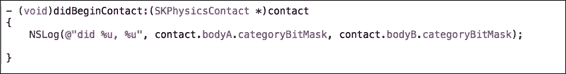

1.  现在，将`createLimitJointOnScene`函数调用替换为`createCollisionDetectionOnScene`。在`init`函数的末尾添加以下代码：

    ```swift
    [self createCollisionDetectionOnScene:self];
    ```

1.  此外，我们还需要订阅接触检测的代理回调。要订阅，请添加以下代码行：

    ```swift
    self.physicsWorld.contactDelegate = self;
    ```

1.  我们还必须在接口文件中声明接触代理。因此，打开`GameScene.h`并在接口声明行末尾添加以下代码：

    ```swift
    <SKPhysicsContactDelegate>
    ```

1.  最终的代码文件应该看起来类似于以下截图：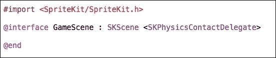

1.  现在编译并运行项目，你应该能够在屏幕上看到物理体，并在 Xcode 调试窗口中看到日志。你可以看到碰撞已经被检测并在日志中打印出来。你还可以注意到，具有类别掩码`2`和`4`的物理体之间发生了碰撞。我们有一个类别掩码为`2`的矩形物理体和一个类别掩码为`4`的正方形物理体，它们正在相互碰撞。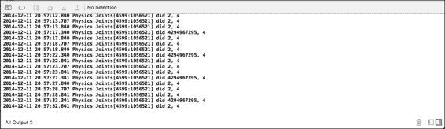

1.  现在，我们将使碰撞检测更加直观。为此，让我们在屏幕上添加一个标签，当物理体相互碰撞时，该标签将闪烁。为此，在`@implementation GameScene`代码之前添加以下代码行：

    ```swift
    SKLabelNode* collisionLabel;
    ```

1.  现在，在`createCollisionDetectionOnScene`函数的开始处添加以下代码行：

    ```swift
    collisionLabel = [SKLabelNode labelNodeWithFontNamed:@"Futura-Medium"];
    collisionLabel.text = @"Collision detected";
    collisionLabel.fontSize = 18;
    collisionLabel.fontColor = [SKColor whiteColor];
    collisionLabel.position = CGPointMake(CGRectGetWidth(self.frame)/2.0, CGRectGetHeight(self.frame)/1.2);
    collisionLabel.alpha = 0.0f;
    [scene addChild:collisionLabel];
    ```

1.  现在，为了在碰撞时对标签进行淡入和淡出，在`didBeginContact`方法的末尾添加以下代码行：

    ```swift
    SKSpriteNode *firstNode, *secondNode;

    firstNode = (SKSpriteNode *)contact.bodyA.node;
    secondNode = (SKSpriteNode *) contact.bodyB.node;

    if (firstNode.physicsBody.categoryBitMask == GFPhysicsCategoryRectangle && secondNode.physicsBody.categoryBitMask == GFPhysicsCategorySquare) {

        SKAction *fadeIn = [SKAction fadeAlphaTo:1.0f duration:0.2];
        SKAction *fadeOut = [SKAction fadeAlphaTo:0.0f duration:0.2];
        [collisionLabel runAction:fadeIn completion:^{
            [collisionLabel runAction:fadeOut];
        }];
    }
    ```

1.  在这里，我们正在检查矩形和正方形的物理体。一旦我们收到这两个物理体碰撞的回调，我们可以让标签淡入一秒钟，然后再次淡出。这将产生一个很好的效果，以显示物理体相互碰撞时的情况。

1.  现在编译并运行项目，你应该能够看到通过销轴连接的物理体。你可以看到它们通过锚点相互连接。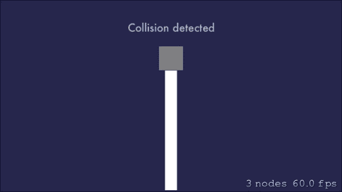
