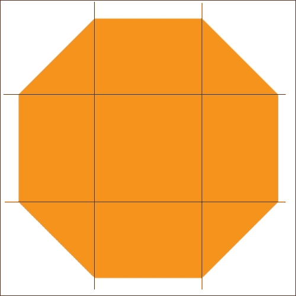
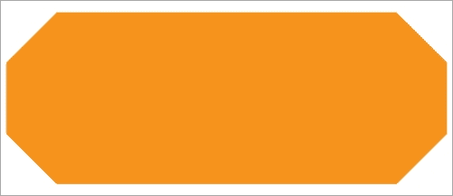
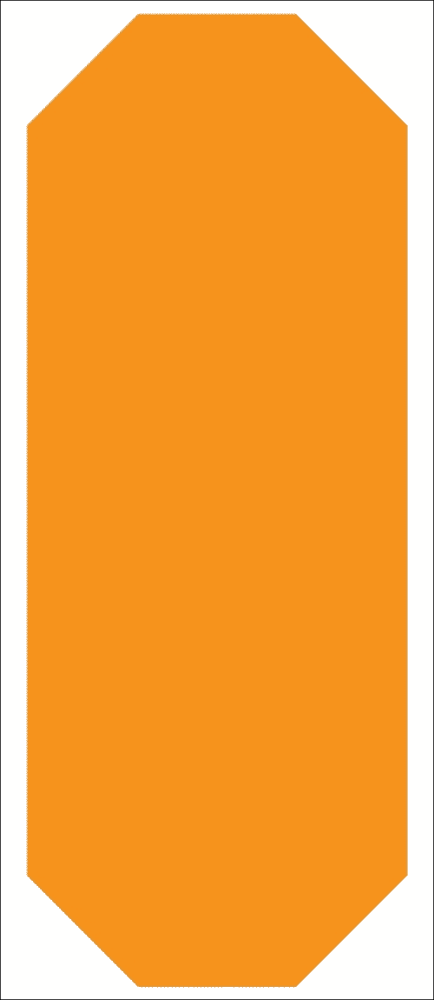
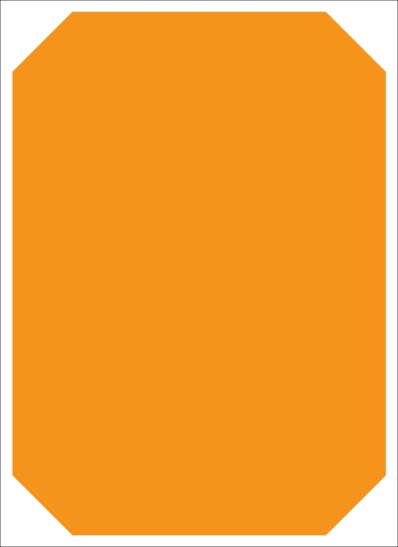
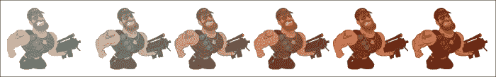
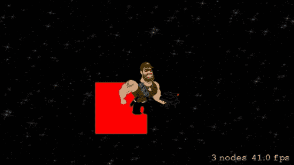
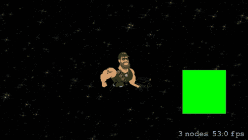
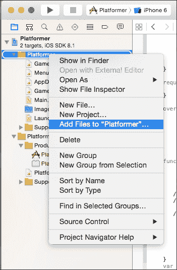
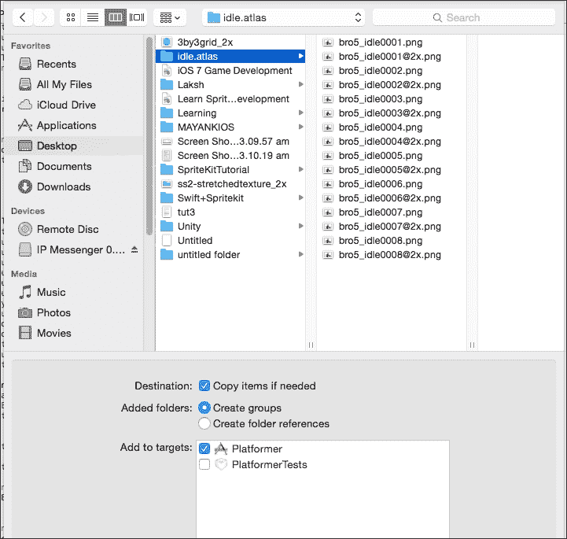

# 第三章. 精灵

在前一章中，我们设置了我们的第一个场景，学习了场景中节点的渲染，在一个项目中添加了多个场景，并学习了从一个场景到另一个场景的过渡。

在本章中，我们将学习关于精灵的内容。精灵是一个二维图像，集成到场景中。精灵的集合称为**精灵表**。在这里，我们将学习如何在游戏中添加精灵、定位精灵、纹理图集以及如何在我们的游戏中变换精灵。

在 Sprite Kit 中，游戏基于节点树层次结构。场景作为根节点，其他添加到其中的节点是子节点。一旦所有节点都渲染到场景中，我们就得到了视图。精灵也作为节点添加到游戏中；Sprite Kit 为此提供了 `SKSpriteNode` 类。在前一章中，我们通过创建 `SKSpriteNode` 引用并将其添加到相应场景中，添加了背景精灵和播放按钮精灵。现在我们将发现 Sprite Kit 在 `SKSpriteNode` 类中为我们提供了什么，以及我们可以用它做什么。

# SKSpriteNode

`SKSpriteNode` 类是一个根节点类，用于以许多自定义方式绘制纹理图像；它继承自 `SKNode` 类。我们可以简单地绘制一个图像，或者我们可以添加一些效果，例如自定义着色器或阴影。为此，我们首先需要了解 `SKSpriteNode` 类及其提供的功能。

## 初始化精灵

要在游戏中创建一个精灵，我们必须创建 `SKSpriteNode` 类的一个实例。Sprite Kit 提供了许多初始化 `SKSpriteNode` 类实例的方法。其中一些如下：

```swift
init(name: String){
  //it is designated initializer . initialization part

}
convenience init(){
  //Calling the Designated Initializer in same class
  self.init(name: "Hello")
}
```

在 Swift 中，必须通过创建结构体的对象来初始化一个类。为此提供了两个初始化器，即指定初始化器和便利初始化器。

指定初始化器为类属性执行实际初始化。现在问题来了，“为什么需要便利初始化器？”在编程过程中，有时便利初始化器非常有用，因为它们需要的输入参数较少，并将实际初始化工作交给指定初始化器。

Swift 中初始化器的示例如下：

+   `convenience init(color color:UIColor!, size size: CGSize)`: 这用于初始化一个彩色精灵。如果您想创建一个不使用任何纹理而仅使用颜色的精灵，可以使用此初始化器。它接受颜色和大小作为参数，并返回一个新初始化的精灵对象。

+   `convenience init(imageNamed name: String)`: 这个初始化器将纹理分配给精灵。精灵将从图像名称分配纹理，并将精灵的颜色初始化为白色。

+   `convenience init(texture texture: SKTexture!)`: 这个初始化器接受一个现有的纹理精灵并返回一个新初始化的精灵。精灵的大小设置为纹理的尺寸，精灵的颜色设置为白色 `(1.0, 1.0, 1.0)`。

+   `init(texture texture: SKTexture!,color color: UIColor!,size size: CGSize)`: 如前所述，这个初始化器需要一个便利初始化器作为其参数，因此这是一个指定初始化器。现在，我们的*Platformer*游戏精灵将被初始化为所需的纹理、颜色和大小。它返回一个新初始化的精灵。

+   `convenience init(texture texture: SKTexture!,size size: CGSize)`: 这个初始化方法接受纹理和大小作为参数，并返回一个新初始化的精灵。

+   `convenience init(imageNamed name: String, normalMapped generateNormalMap: Bool)`: 这个初始化方法接受一个图像名称和一个布尔值作为参数，并返回一个新初始化的对象。

+   `convenience init(texture texture: SKTexture!,normalMap normalMap: SKTexture?)`: 这个初始化方法接受两个纹理作为参数，一个用于精灵绘制，另一个用于向精灵添加光照行为。它返回一个新初始化的精灵。

在了解了`SKSpriteNode`的初始化之后，现在是时候让我们熟悉一些`SKSpriteNode`的物理属性了，比如`size`、`anchorPoint`等等。

# `SKSpriteNode`的属性

让我们在以下章节中讨论`SKSpriteNode`的属性。

## 物理

让我们来看看`SKSpriteNode`的一些物理属性：

+   `size`: 这个属性决定了精灵在点上的大小。在我们的`GameScene`和`MenuScene`类中，我们使用这个属性在背景精灵上以覆盖屏幕。

+   `AnchorPoint`: 锚点是与精灵相关的坐标点。例如，一个精灵每个角落的坐标是`(0,0)`、`(1,0)`、`(0,1)`和`(1,1)`，分别代表左下角、右下角、左上角和右上角。这些参考点可以被分配为锚点，以便在屏幕上相应地绘制精灵。分配的锚点将根据情况在屏幕上定位精灵。

    例如，假设我们的精灵锚点是`(0,0)`。如果我们将这个精灵放置在屏幕上，它将从坐标`(0,0)`开始放置，即左下角。要将精灵从中心位置放置，我们需要将锚点坐标设置为`(0.5, 0.5)`。

但要向这个精灵添加另一个节点，该节点的`(0,0)`坐标将位于精灵的锚点上。当我们向视图中添加场景时，场景的`(0,0)`坐标将成为默认的锚点。

在`size`和`anchorPoint`下已经很好地讨论了精灵的物理属性。现在，是时候讨论一些与精灵纹理相关的属性了。

## 纹理

它是`SKSpriteNode`类中的一个可选属性；这意味着它可以 nil 或者将具有纹理。如果它是 nil，那么精灵将通过使用其`color`属性以矩形形状绘制，否则精灵将通过这个纹理绘制。

## centerRect

这个属性是创建矩形按钮或场景中任何其他固定大小元素的一个非常有用的工具。当你使用`centerRect`属性时，你实际上是在控制由坐标指定的矩形部分的纹理缩放因子。

默认情况下，矩形覆盖整个纹理；这就是为什么整个纹理都会被拉伸。但如果这个矩形只覆盖纹理的一部分，那么纹理就可以在一个`3 * 3`的网格中可视化，将这个矩形放在网格的中间，并在每侧从其每个边缘画一条线。



原始图像

如果我们尝试在两个方向上拉伸纹理，那么它将遵循以下规则：

+   网格的中间部分将在每侧水平垂直拉伸

+   网格的所有四个角落部分都不会被拉伸

+   网格的上下中间部分将水平拉伸

    从中心水平拉伸的图像

+   网格的左右中间部分将垂直拉伸

    从中心垂直拉伸的图像

此外，以下是一个图像在垂直和水平方向上都被拉伸的情况：



从中心垂直和水平拉伸的图像

这是一个非常有用的属性，可以实现纹理的一些特定行为，例如在游戏中制作生命条，我们不想拉伸纹理的角落部分，所以如果它们是圆角，它们不应该变形。

## 颜色

`SKSpriteNode`也有一些颜色属性。让我们详细了解一下它们：

+   `color`: 这个属性用于为精灵添加颜色。例如，当生命条减少到 50%、25%等时，你需要更改精灵的颜色。

+   `colorBlendFactor`: 这个属性用于控制精灵纹理的颜色混合。它可以在`0.0`到`1.0`（包含）之间取值；默认值为`0.0`。如果值为`0.0`，则表示忽略`color`属性，使用未修改的纹理值。如果你增加值，精灵将添加更多颜色。例如，我们可以使用这个属性来随着对角色攻击次数的增加，在我们的角色中混合更多颜色：

    由于 colorBlendFactor 值的变化而产生的颜色效果

+   `blendMode`: 这个属性用于根据场景混合精灵。精灵的每个像素颜色和其下对应场景像素的颜色，将由 Sprite Kit 渲染器比较，为精灵分配一个结果颜色。当你向场景添加光照效果或闪光效果时，这个属性非常有用。

在 iOS 8 中，为精灵添加了一些光照属性以生成光和影效果。让我们来看看它们：

+   `lightingBitMask`：此属性用于在精灵上显示光照效果，并通过逻辑与操作与光的`categoryBitMask`属性进行测试。如果值为非零，精灵将发光，否则它将不受光的影响。其默认值为`0x00000000`。

+   `shadowedBitMask`：此属性确定精灵是否会被光照产生的阴影所影响。此属性通过逻辑与操作与光的`categoryBitMask`属性进行测试。如果值为非零，精灵将以阴影效果绘制，否则它将不受光的影响。其默认值为`0x00000000`。

+   `shadowCastBitMask`：此属性确定精灵是否会阻挡光线并投射阴影。此属性通过逻辑与操作与光的`categoryBitMask`属性进行测试。如果值为非零，精灵将投射超出自身的阴影，否则它将不受光的影响。其默认值为`0x00000000`。

+   `normalTexture`：当精灵被照亮时，使用正常贴图纹理，给它带来更逼真的外观，带有阴影和令人惊叹的高光。纹理必须是正常贴图纹理。

除了光照属性外，iOS 8 还引入了着色器属性来定制渲染效果。

## 着色器

着色器属性在第七章中专门讨论，*粒子效果和着色器*。

这些是`SKSpriteNode`属性，通过这些属性，我们可以根据我们的需求自定义精灵来使用。游戏的大部分内容都是由精灵组成的，因此了解这些属性以及我们如何使用它们非常重要。现在，是时候在我们的游戏中使用这些属性并看看它们会产生什么效果了。

# 添加不带纹理的精灵

在游戏中，我们通常会给我们的精灵添加纹理，但也可以不使用纹理来制作精灵。纹理属性是`SKSpriteNode`类中的一个可选属性。如果纹理为 nil，这意味着我们没有可拉伸的纹理，因此收缩参数被忽略。让我们打开我们的`GameScene.swift`文件，在`backgroundNode`声明下方创建一个`SKSpriteNode`变量：

```swift
var spriteWithoutTexture : SKSpriteNode?
```

现在，有了前面的声明，我们已经将`spriteWithoutTexture`声明为可选的。由于我们已将其声明为可选的，纹理不需要值。现在在`didMoveToView`下添加以下函数：

```swift
  func addSpriteWithoutTexture(){
    spriteWithoutTexture = SKSpriteNode(texture: nil, color: UIColor.redColor(), size: CGSizeMake(100, 100))
    addChild(spriteWithoutTexture!)
  }
```

之后，在`didMoveToView()`函数中调用此函数，在`addBackGround()`函数下方：

```swift
addSpriteWithoutTexture()
```

现在点击播放，看看会发生什么。在我们的`GameScene`中没有变化。这不是我们想要的。实际上，我们遗漏了纹理的`z`位置。这就是为什么它渲染在背景后面，没有显示给我们。在我们的`addSpriteWithoutTexture()`函数中添加此行，在`addChild(spriteWithoutTexture!)`之前：

```swift
spriteWithoutTexture!.zPosition=1;
```

运行它。你会在屏幕中间看到一个红色的正方形。

代码是自解释的。我们通过实例化创建了一个`SKSpriteNode`实例。我们传递 nil 作为纹理参数，这意味着我们不想为这个精灵添加纹理。由于我们已经使这个精灵引用为可选的，在使用任何`SKSpriteNode`属性之前，我们必须解包它，我们通过在`spriteWithoutTexture`后使用`!`标记来实现这一点。

我们也可以用另一种方式初始化。从初始化部分删除`texture`参数：

```swift
spriteWithoutTexture = SKSpriteNode(texture: nil, color: UIColor.redColor(), size: CGSizeMake(100, 100))
```

将前面的初始化部分更改为如下所示：

```swift
spriteWithoutTexture = SKSpriteNode(color: UIColor.redColor(), size: CGSizeMake(100, 100))
```

运行代码，它会产生与上一个相同的结果。它自动将 nil 分配给纹理，并初始化一个具有颜色和指定边界的精灵。让我们用它做一些有趣的事情。

## 更改颜色属性

我们将使用`color`属性在用户点击这个精灵时改变颜色。为此，首先给`spriteWithoutTexture`起一个名字，这样我们就能识别出对其的点击：

```swift
spriteWithoutTexture!.name = "HELLO"
```

在`GameScene.swift`文件中添加以下函数以更改颜色，如下所示代码：

```swift
var 
```

现在，我们使用`touchesBegan`函数来检测用户的触摸（就像之前在`MenuScene`类中使用的那样）：

```swift
override func touchesBegan(touches: NSSet, withEvent event: UIEvent) {
   for touch: AnyObject in touches{ currentno = 0;
func changeColor(){
    switch(currentno%3){
    case 0:
        spriteWithoutTexture!.color = UIColor.redColor()
    case 1:
        spriteWithoutTexture!.color = UIColor.greenColor()
    case 2:
        spriteWithoutTexture!.color = UIColor.blueColor()
    default :
        spriteWithoutTexture!.color = UIColor.blackColor()

    }
}

       let location = touch.locationInNode(self)
       let node = self.nodeAtPoint(location)
                    if node.name == spriteWithoutTexture!.name {
                        currentno++
                        changeColor()
                    }
   }
}
```

现在，在运行 Xcode 后，点击`GameScene`中的彩色区域。你会看到该区域颜色发生变化。

在这段代码中，当用户点击精灵时，它将向当前值添加一个值并调用`changeColor()`函数。在`changeColor()`函数中，我们使用`switch`语句来确定`spriteWithoutTexture`的颜色属性。在 Swift 中，`switch`语句的使用方式与许多其他语言类似。我们不需要使用`break`语句。每个`switch`语句都必须是*详尽的*。这意味着我们必须对每个单独的情况进行检查。因此，我们必须为每个`switch`情况编写一个`default`值。

如果我们的纹理不是 nil，我们可以使用`colorBlendFactor`属性来着色纹理。我们可以用它来实现着色效果，例如游戏中受到的伤害；如果纹理是 nil，则忽略`colorBlendFactor`。它的默认值是`0.0`，这意味着纹理应该保持未修改状态。当我们增加值时，纹理颜色将被混合颜色所替代。

## 在`MenuScene`中更改`colorBlendFactor`

让我们在播放按钮上添加一些色调。打开`MenuScene`并在`MenuScene`类中定义一个名为`tintChanger`的可选`Float`类型变量，这样我们就不需要在初始化器中为其分配值了：

```swift
var tintChanger : Float?
```

在`MenuScene`类中添加以下函数：

```swift
func tintPlayButton(){
    if PlayButton.colorBlendFactor >= 1{
        tintChanger = -0.02
    }
    else if PlayButton.colorBlendFactor <= 0{
        tintChanger = 0.02
    }
    PlayButton.colorBlendFactor += CGFloat(tintChanger!)
}
```

从`update`函数中调用它：

```swift
override func update(currentTime: NSTimeInterval) {
     tintPlayButton()
}
```

现在运行 Xcode。你会看到**播放**按钮分别出现和消失。

在这段代码中，我们只创建了一个`Float`类型的变量。在我们的`tintPlayButton`函数中，我们检查其`colorBlendFactor`属性的值是否在`1`到`0`之间。

现在让我们在`addChildToScene`函数中给它一个颜色：

```swift
  PlayButton.color = UIColor.redColor()
```

运行它，你会看到**播放**按钮的颜色从原始颜色变为红色。现在，是时候看看位置属性的实际效果了。

## 改变精灵的位置

现在，让我们看看`SKSpriteNode`的`position`属性。让我们再次打开`GameScene`，因为我们将要查看`spriteWithoutTexture.position`属性以及我们可以如何设置它。在`changeColor`函数下方添加此函数：

```swift
func changePosition(){
    switch(currentno%3){
    case 0:
        spriteWithoutTexture!.position = CGPointZero

    case 1:
        spriteWithoutTexture!.position = CGPointMake(self.size.width/2-spriteWithoutTexture!.size.width/2, 0)
    case 2:
        spriteWithoutTexture!.position = CGPointMake
        (-self.size.width/2+spriteWithoutTexture!.size.width/2, 0)
    default :
        spriteWithoutTexture!.position = CGPointMake(0, 0)

    }
}
```

并且在`changeColor()`调用下方调用它。

```swift
changePosition()
```

现在如果你运行它并在游戏场景中点击，你会看到`spriteWithoutTexture`改变位置并在它们之间切换。

代码的大部分与`changecolor()`相同，除了位置。在`case 0`中，我们将它的位置设置为`CGPointZero`。位置是以`CGPoint`单位测量的。`CGPointZero`等同于`CGPointMake(0, 0)`。精灵的位置不仅取决于其`anchorPoint`，还取决于其父`anchorPoint`。

由于我们将`GameScene`的`anchorPoint`定义为`(0.5 , 0.5)`，这意味着任何将被添加到`GameScene`的其他节点都将有起始位置`(0,0)`，从屏幕的中间开始。这就是为什么背景和`spriteWithoutTexture (0,0)`坐标将在屏幕中间。

现在，正如我们指定的`spriteWithoutTexture`的`anchorPoint`，它将采用其默认值`(0.5,0.5)`。这意味着它的`anchorPoint`将位于其中心。因此，在`case 0`中，它以对称的方式在屏幕中间渲染。在`case 1`和`case 2`中，我们只是将其移动到屏幕的右中角和左中角。

让我们尝试改变`anchorPoint`并看看会发生什么。在`addSpriteWithoutTexture`内部添加此行：

```swift
spriteWithoutTexture!.anchorPoint = CGPointZero
```

现在运行它。



Before tap



After tap

你会发现所有位置都不像之前那样了。你能猜出这个原因吗？

在前面的代码行中，我们将新值`(0,0)`赋给了`spriteWithoutTexture`，这将移除其默认值`(0.5,0.5)`。这意味着它的`anchorPoint`将不会从中间开始。它将从这个的左下角开始。为了可视化它，考虑你的精灵的右上角为`1,1`，左下角为`0,0`。现在如果你将`anchorPoint`设置为`0,0`，它将在精灵的左下角。如果你将其设置为`0,1`，它将在左上角。对于`1,1`，它将在右上角，对于`1,0`，它将在右下角。你可以将其更改为任何你喜欢的值，例如负的`(-1,-2)`等等。

现在，我们可以看到，一旦我们熟悉了屏幕上的坐标数字，设置`anchorPoint`就变得容易了。所以，让我们通过将`spriteWithoutTexture`的位置设置回之前的位置，使用`0,0`作为`anchorPoint`来测试一下。将`changePosition`函数替换为以下内容：

```swift
func changePosition(){
    switch(currentno%3){
    case 0:
        spriteWithoutTexture!.position = CGPointMake
(-spriteWithoutTexture!.size.width/2,
-spriteWithoutTexture!.size.height/2)

    case 1:
        spriteWithoutTexture!.position = CGPointMake(self.size.width/2-spriteWithoutTexture!.size.width,
-spriteWithoutTexture!.size.height/2)
    case 2:
         spriteWithoutTexture!.position = CGPointMake
(-self.size.width/2, -spriteWithoutTexture!.size.height/2)
    default :
         spriteWithoutTexture!.position = CGPointMake(0, 0)

    }
}
```

在`addSpriteWithoutTexture()`函数内部添加以下行：

```swift
spriteWithoutTexture!.position = CGPointMake
(-spriteWithoutTexture!.size.width/2,
-spriteWithoutTexture!.size.height/2)
```

现在运行它。你将在`GameScene`中看到与之前相同的结果。

在这段代码中，我们做了一些小的调整。我们希望`spriteWithoutTexture`位于中心。由于它的`anchorPoint`是`(0,0)`，其左下角将位于屏幕中央。因此，为了在屏幕中央显示它，我们必须通过从每个宽度和高度的中间点（`0,0`）减去一半的宽度和高度来设置其位置，这些中间点是屏幕的左上角。同样适用于精灵的左右位置。

现在，只需在`GameViewController.swift`文件中将`MenuScene anchorPoint`设置为`(1,1)`，并尝试自己调整按钮和背景的位置。如果你无法做到这一点，只需在`addChildToScene`函数中添加以下代码：

```swift
 Background.position = CGPointMake(-self.size.width/2,
-self.size.height/2)
 PlayButton.position = CGPointMake(-self.size.width/2,
-self.size.height/2)
```

现在，如果你运行这段代码，你会注意到与之前相同的结果。在定位之后，让我们谈谈调整精灵大小。

## 调整精灵大小

由于`SKSpriteNode`类是从`SKNode`类继承的，它也从`SKNode`类继承了`xScale`和`yScale`属性。在我们的场景中，我们已经将背景的宽度设置为与我们的视图相同。如果我们使用其原始尺寸并缩放其宽度和高度，我们将得到与之前相同的结果。打开`GameScene`类，并更新`addBackGround`函数如下：

```swift
func addBackGround() {
    backgroundNode.zPosition = 0

    var scaleX =  self.size.width/backgroundNode.size.width
    var scaleY =  self.size.height/backgroundNode.size.height
    backgroundNode.xScale = scaleX
    backgroundNode.yScale = scaleY
    addChild(backgroundNode)
}
```

我们已经修改了函数`addBackGround()`，以便我们的游戏能够检测设备的屏幕尺寸。这使我们的游戏具有可移植性（例如，iPhone 5 和 iPhone 6 的屏幕尺寸不同）。现在这个函数将返回两个浮点值，作为屏幕尺寸和背景尺寸在宽度和高度上的比例。在将它们设置为`backgroundNode.xScale`和`backgroundNode.yScale`之后，如果你运行这段代码，你将得到与之前相同的结果。

# 与纹理对象一起工作

当创建精灵时，Sprite Kit 也会创建一个纹理。但有时我们需要纹理来完成一些复杂的工作，例如：

+   更改精灵

+   动画

+   在多个精灵之间使用相同的纹理

+   将节点树渲染成纹理，就像屏幕截图一样

为了简化，Sprite Kit 为我们提供了`SKTexture`类。我们可以创建这个类的对象，并按需使用它。

打开你的`MenuScene.swift`文件，并创建一个`SKTexture`的引用：

```swift
let testingTexture : SKTexture

Now initialize it inside init code block

init(size:CGSize, playbutton:String, background:String) {
     PlayButton = SKSpriteNode(imageNamed: playbutton)
     Background = SKSpriteNode(imageNamed: background)
     MyPlayButton = SKSpriteNode(imageNamed: playbutton)
     testingTexture = SKTexture(imageNamed: playbutton)
     super.init(size:size)
}
```

让我们创建一个函数调用`generateTestTexture`，并在`didMoveToView`中调用它：

```swift
override func didMoveToView(view: SKView) {
    addChildToScene();
    PlayButton.name = "PLAY"
    generateTestTexture()
}
    func generateTestTexture(){

        for var i = 0 ; i < 10; i++ {
            var temp = SKSpriteNode(texture: testingTexture)
            temp.xScale = 100/temp.size.width
            temp.yScale = 50/temp.size.height
            temp.zPosition = 2
            temp.position = CGPointMake(-self.size.width + CGFloat (100 * i), -self.size.height/2)
            addChild(temp)
        }
}
```

运行它，你将看到一系列的播放纹理。我们只使用一个纹理就制作了这些纹理。之前，我们是从图像名称创建`SKSpriteNode`对象，允许 Sprite Kit 创建纹理。现在，我们将纹理分配给由我们创建的`SKNode`对象。现在，由于我们对精灵做了许多自定义，让我们看看纹理图集。

## 什么是纹理图集？

一个游戏的表现取决于其中使用的精灵数量。精灵数量越少，性能越好。为此，Sprite Kit 提供了纹理图集，它自动将我们的图像文件打包到一个或多个大图像中。

它为我们提供了一种通过单次绘制调用绘制多个图像来提高游戏性能的方法。当游戏处于开发阶段时，编译器会遍历每个文件夹以查找具有 `*.atlas` 格式的文件夹。当这些文件夹被识别后，它们内部的全部图像将合并成一个或多个大图像文件。因此，如果你想使用这个功能，请将你的图像放入一个文件夹中，然后通过在其名称后添加 `.atlas` 后缀来重命名它。

现在，我们将向 `GameScene` 添加一个玩家。让我们将玩家的所有空闲状态图像移动到一个文件夹中，并将其命名为 `idle.atlas`。

现在在 Xcode 中，在 **Project Navigator** 中，右键单击你的项目并选择 **Add to Project**：



选择目录（不是文件），然后点击 **Add**。默认值应该是 OK，但请确保它设置为复制。



现在我们将向我们的 `GameScene` 添加一个玩家。打开 `GameScene` 并创建一个函数，名为 `addPlayer`：

```swift
func addPlayer(){
    var player = SKSpriteNode(imageNamed:"bro5_idle0001")

    player.position = CGPoint(x:0,y:0)
    player.zPosition = 2;
    self.addChild(player)
  }
```

在 `addSpriteWithoutTexture` 函数上注释并调用 `addPlayer` 函数。你的函数将如下所示：

```swift
override func didMoveToView(view: SKView) {
        addBackGround()
        //addSpriteWithoutTexture()
        addPlayer();
    }
```

将代码中的 `touchesBegan` 部分转换为注释，这样在发生触摸时我们不会卡住；否则，玩家的图像可能会阻挡触摸：

```swift
override func touchesBegan(touches: NSSet, withEvent event: UIEvent) {
        for touch: AnyObject in touches{
            let location = touch.locationInNode(self)
            let node = self.nodeAtPoint(location)
            // if node.name == spriteWithoutTexture!.name {
            //    currentno++
            //    changeColor()
            //    changePosition()

            //}
        }
    }
```

现在，运行它并查看。你将看到玩家位于屏幕中央。

在此代码中，我们通过传递图像名称来创建一个 `SKSpriteNode` 实例。它将搜索该图像的图集。但如果我们的项目中有一个同名图像，则将加载该图像而不是纹理图集。你必须使用你图像的任何名称。

当我们将图像放入一个以 `.atlas` 扩展名结尾的文件夹中时，Xcode 通过将所有图像合并成一个来生成一个或多个大图像。

1.  要查看打包的图像，请转到你的项目中的 `Products` 文件夹。

1.  在那里的 `.app` 文件上右键单击，然后点击 **Show in Finder**，这样我们就可以进入它的目录。

1.  现在，在 `.app` 文件上右键单击并选择 **Show Package Contents**。

1.  然后，转到 **Contents** | **Resources** | `*.atlasc`。在这里，你会看到两个文件，一个图像和一个 plist。如果你查看图像，你会发现图像被合并成一个纹理，其高度和宽度都是 2 的幂。如果你打开 plist，你会看到它包含了打包纹理中图像的位置，这样我们就可以直接使用 Texture Atlas 访问它们。

你也可以访问纹理图集。让我们使用 `TextureAtlas` 并在点击时做些事情：

1.  首先，在 `GameScene` 中创建一个纹理图集引用：

    ```swift
    let myAtlas = SKTextureAtlas(named:"idle.atlas")
    ```

1.  之后，在函数外部创建一个玩家引用，这样我们就可以在另一个函数中使用它：

    ```swift
    var player :SKSpriteNode?
    ```

1.  现在按照以下方式编辑`addPlayer`函数：

    ```swift
     func addPlayer(){
         player = SKSpriteNode(texture: myAtlas.textureNamed("bro5_idle0001"))
         player!.position = CGPoint(x:0,y:0)
         player!.zPosition = 2;
         player!.name = "Player"
         self.addChild(player!)
      }
    ```

1.  创建函数`changeSpriteFromTextureAtlas()`，并在`touchesBegan`中调用它。现在，它应该看起来像以下几行：

    ```swift
    override func touchesBegan(touches: NSSet, withEvent event: UIEvent) {
            for touch: AnyObject in touches{
                let location = touch.locationInNode(self)
                let node = self.nodeAtPoint(location)
                if node.name == player!.name {
                   currentno++
                   changeSpriteFromTextureAtlas()
                }
            }
        }
        func changeSpriteFromTextureAtlas(){
            switch(currentno%3){
            case 0:
                player!.texture = myAtlas.textureNamed("bro5_idle0001")
            case 1:
                 player!.texture = myAtlas.textureNamed("bro5_idle0004")
            case 2:
                 player!.texture = myAtlas.textureNamed("bro5_idle0007")
            default :
               break

            }

        }
    ```

1.  现在，运行并点击玩家。你会看到玩家在点击时改变了它的精灵。

我们创建了`SKTextureAtlas`引用。我们将其命名为`atlas`文件并将其添加到项目中。现在我们可以从纹理图集文件中获取图像。这是我们可以直接访问纹理图集的方式。纹理图集对于制作动画序列或从瓦片生成关卡非常有用。我们将在后续章节中讨论动画。

现在，由于我们正在使用纹理来制作精灵，有时我们可能需要将纹理预加载到内存中。让我们详细讨论这个问题。

# 预加载纹理到内存中

Sprite Kit 在内存管理方面表现良好。当一个纹理需要在场景中渲染，但尚未准备时，Sprite Kit 将其加载到内存中，并通过将其转换为可用形式上传到图形硬件。如果需要一次性加载许多未加载的纹理，可能会减慢游戏速度。为了避免这种情况，我们需要在使用之前预加载纹理，尤其是在更大或更复杂的游戏中。

当用户需要从关卡屏幕转到游戏屏幕时，可能会出现这个问题。由于游戏屏幕可能有多个纹理，它需要加载，并且由于纹理的加载可能会变慢。为了避免这种情况，我们可以使用`SKTexture class preloadTextures(_:withCompletionHandler:)`函数。它接受一个`SKTexture`数组和一个块，该块在所有纹理加载完成后被调用。因此，我们可以使用这个块来加载一个场景。

对于一个小游戏，我们可以在游戏启动时一次性加载所有纹理。对于一个大游戏，我们需要根据场景和其他标准将纹理分成不同的级别。对于对某个级别没有用的纹理，我们将丢弃它们以节省内存。如果游戏太大，我们还需要在游戏运行时动态加载纹理。

在加载纹理的同时，我们还需要从内存中删除不必要的纹理。当一个纹理被加载到内存中时，它将保留在那里，直到其引用`SKTexture`对象被删除。要删除`SKTexture`对象，我们必须从它那里移除引用；这将使纹理从内存中卸载。

# 概述

在本章中，我们详细了解了精灵。我们学习了如何初始化一个精灵，以及精灵的大小和位置。我们还学习了精灵的各种颜色属性。还讨论了光照和着色器属性。最后，我们讨论了`Texture`对象、纹理图集的使用以及纹理的预加载到内存中。

在下一章中，我们将学习关于节点和树节点结构的各种其他概念。
