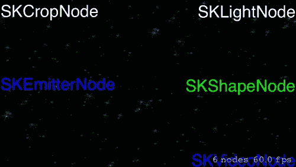
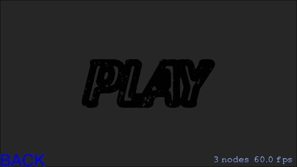
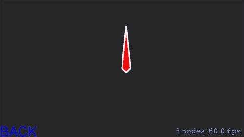
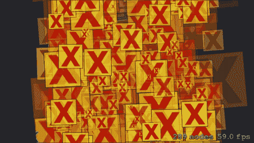
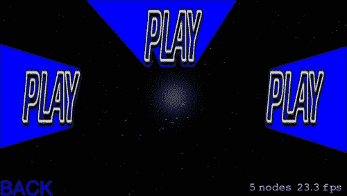
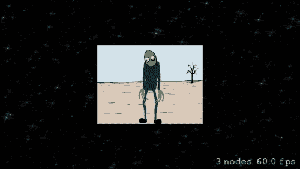

# 第四章。Sprite Kit 中的节点

在上一章中，我们学习了如何在游戏中以各种方式使用精灵。我们讨论了精灵的物理属性、精灵的纹理以及诸如颜色属性、光照、着色器等各种其他属性。我们还学习了与纹理对象一起工作，并对纹理图集进行了介绍。

在上一章中，我们实现了`SKSprite`类，它是`SKNode`类的子类；这就是为什么`SKSprite`本身就是一个节点，继承了`SKNode`属性。在本章中，我们将研究节点，它们在理解游戏树结构中起着重要作用。此外，我们将详细讨论 Sprite Kit 中的节点类型及其用途。

# 你需要了解的所有关于节点的内容

到目前为止，我们已经讨论了许多关于节点的内容。几乎你在使用 Sprite Kit 制作的游戏中所做的每一件事都是一个节点。我们展示给查看的场景是`SKScene`类的实例，它是`SKEffectNode`类的子类，而`SKEffectNode`类本身又是`SKNode`类的子类。间接地，`SKScene`是`SKNode`类的子类。

由于游戏遵循节点树结构，场景就像一个根节点，其他节点则用作其子节点。应该记住，尽管`SKNode`是场景中看到的节点的基类，但它本身并不绘制任何内容。它只为它的子节点提供一些基本功能。我们在 Sprite Kit 制作的游戏中看到的所有视觉内容，都是通过使用适当的`SKNode`子类来绘制的。

以下是一些`SKNode`类的子类，它们用于 Sprite Kit 游戏中的不同行为：

+   `SKSpriteNode`：这个类用于在游戏中实例化纹理精灵；这是在第三章 *精灵* 中经常提到的熟悉节点类。`SKVideoNode`，这个类用于在场景中播放视频内容。

+   `SKLabelNode`：这个类用于在游戏中绘制标签，具有许多自定义选项，例如字体类型、字体大小、字体颜色等。

+   `SKShapeNode`：这个类用于在运行时基于路径创建形状。例如，绘制线条或制作绘图游戏。

+   `SKEmitterNode`：这个类用于在场景中发射粒子效果，具有许多选项，例如位置、粒子数量、颜色等。

+   `SKCropNode`：这个类基本上用于使用遮罩裁剪其子节点。使用它，你可以选择性地屏蔽图层的一部分。

+   `SKEffectNode`：`SKEffectNode`是`SKScene`类的父类，也是`SKNode`类的子类。它用于对其子节点应用图像滤镜。

+   `SKLightNode`：`SKLightNode`类用于在场景中创建光和阴影效果。

+   `SKFieldNode`：这是 Sprite Kit 的一个有用功能。你可以定义场景的一部分并赋予其一些物理属性，例如在太空游戏中，对黑洞施加引力效果，吸引附近的物体。

因此，这些都是 Sprite Kit 中常用到的 `SKNode` 的基本子类。`SKNode` 为其子类提供了一些基本属性，用于在场景中查看节点，例如：

+   `position`: 这设置了场景中节点的位置

+   `xScale`: 这在节点的宽度上进行缩放

+   `yScale`: 这在节点的高度上进行缩放

+   `zRotation`: 这有助于节点按顺时针或逆时针方向旋转

+   `frame`: `frame` 是一个包含节点内容的矩形，包括其 x 缩放、y 缩放和 z 旋转属性，忽略节点的子节点

我们知道 `SKNode` 类本身不绘制任何内容。那么，它的用途是什么呢？嗯，我们可以使用 `SKNode` 实例来分别管理不同层的其他节点，或者我们可以使用它们来管理同一层中的不同节点。让我们看看我们如何做到这一点。

## 在游戏中使用 SKNode 对象

现在，我们将发现 `SKNode` 的各种方面用途。比如说，你需要从精灵的不同部分制作一个身体，比如一辆车。你可以从车轮和车身精灵制作它。车轮和车身的车在同步运行，所以一个可以控制它们的动作，而不是分别管理每个部分。这可以通过将它们添加为 `SKNode` 类对象的子节点并更新此节点来控制汽车的活动来实现。

`SKNode` 类对象可以用作游戏中分层的目的。假设我们在游戏中有三个层：前景层，代表前景精灵；中间层，代表中间精灵；背景层，代表背景精灵。

如果我们想在游戏中实现视差效果，我们必须分别更新每个精灵的位置，或者我们可以制作三个 `SKNode` 对象，分别对应每一层，并将精灵添加到相应的节点中。现在我们只需要更新这三个节点的位置，精灵将自动更新它们的位置。

`SKNode` 类可以用作游戏中的一种检查点，它是隐藏的，但在玩家穿过它们时执行或触发某些事件，例如关卡结束、奖励或死亡陷阱。

我们可以在节点内部移除或添加整个子树，并执行必要的功能，如旋转、缩放、定位等。

好吧，正如我们描述的那样，我们可以使用 `SKNode` 对象作为游戏中的检查点，因此在你的场景中识别它们是很重要的。那么，我们该如何做呢？嗯，`SKNode` 类提供了一个属性来实现这一点。让我们更深入地了解它。

## 识别一个节点

`SKNode` 类提供了一个带有名称的属性，用于识别正确的节点。它接受字符串作为参数。你可以通过名称搜索节点，或者可以使用 `SKNode` 提供的两个方法之一，如下所示：

+   `func childNodeWithName(name:String) -> SKNode`: 这个函数接受一个字符串作为参数，如果找到一个具有特定名称的节点，则返回该节点，否则返回 nil。如果有多个节点具有相同的名称，则返回搜索中的第一个节点。

+   `func enumerateChildNodesWithName(name:String, usingBlock:((SKNode!,UnsafeMutablePointer<ObjCBool>)->Void)!)`: 当你需要所有具有相同名称的节点时，请使用此函数。此函数接受名称和块作为参数。在`usingBlock`中，您需要提供两个参数。一个是匹配的节点，另一个是布尔类型的指针。在我们的游戏中，如果您还记得，我们使用`PlayButton`中的`name`属性来识别当用户点击时识别的节点。这是一个非常有用的属性，用于搜索所需的节点。

因此，让我们快速查看`SKNode`类的其他属性或方法。

## 初始化一个节点

有两个初始化器可以创建`SKNode`的实例。这两个初始化器在 iOS 8.0 或更高版本中都是可用的。

+   `convenience init (fileNamed filename: String)`: 这个初始化器用于通过从主包中加载存档文件来创建节点。为此，您必须在主包中传递一个具有`sks`扩展名的文件名。

+   `init()`: 它用于创建一个不带任何参数的简单节点。这在游戏中的分层用途中非常有用。

如我们之前讨论过的节点的定位，让我们讨论一些用于构建节点树的函数和属性。

## 构建节点树

`SKNode`提供了一些函数和属性来处理节点树。以下是一些函数：

+   `addChild(node:SKNode)`: 这是一个非常常见的函数，主要用于创建节点树结构。我们之前已经用它向场景中添加节点。

+   `insertChild(node:SKNode,atIndex index: Int)`: 这用于在数组中插入一个子节点到特定位置。

+   `removeFromParent()`: 这只是简单地从一个节点中移除。

+   `removeAllChildren()`: 这用于清除节点中的所有子节点。

+   `removeChildrenInArray(nodes:[AnyObject]!)`: 它接受一个`SKNode`对象的数组，并将其从接收节点中移除。

+   `inParentHierarchy(parent:SKNode) -> Bool`: 它接受一个`SKNode`对象作为接收节点的父节点进行检查，并返回一个布尔值来表示该条件。

在节点树中，有一些有用的属性，如下所示：

+   `children`: 这是一个只读属性。它包含接收节点在数组中的子节点。

+   `parent`: 这也是一个只读属性。它包含接收节点的父节点的引用，如果没有父节点，则返回 nil。

+   `scene`: 这也是一个只读属性。如果节点嵌入在场景中，它将包含场景的引用，否则为 nil。

在游戏中，我们需要对节点执行一些特定任务，例如将其位置从一个点移动到另一个点，按顺序更改精灵等。这些任务是通过节点上的动作完成的。现在让我们来谈谈它们。

## 节点树上的动作

游戏中的一些特定任务需要动作。为此，`SKNode`类提供了一些基本函数，如下所示。

+   `runAction(action:SKAction!)`: 此函数接受一个`SKAction`类对象作为参数，并在接收节点上执行该动作。

+   `runAction(action:SKAction!,completion block: (() -> Void)!)`: 此函数接受一个`SKAction`类对象和一个编译块作为对象。当动作完成时，它调用该块。

+   `runAction(action:SKAction,withKey key:String!)`: 此函数接受一个`SKAction`类对象和一个唯一键，以识别此动作并在接收节点上执行。

+   `actionForKey(key:String) -> SKAction?`: 它接受一个`String`键作为参数，并返回一个关联的`SKAction`对象，用于该键标识符。如果存在，则发生这种情况，否则返回 nil。

+   `hasActions() -> Bool`: 通过此操作，如果节点有任何正在执行的动作，则返回`true`，否则返回`false`。

+   `removeAllActions()`: 此函数从接收节点中移除所有动作。

+   `removeActionForKey(key:String)`: 它接受`String`名称作为键，并移除与该键关联的动作（如果存在）。

控制这些动作的一些有用属性如下：

+   `speed`: 这用于加快或减慢动作运动的速度。默认值为`1.0`以正常速度运行；随着值的增加，速度增加。

+   `paused`: 这个布尔值确定节点上的动作是否应该暂停或恢复。

有时，我们需要根据场景中的节点更改一个点坐标系统。`SKNode`类提供了两个函数来交换一个点相对于场景中节点的坐标系统。让我们来谈谈它们。

## 节点的坐标系

我们可以转换任何节点树的坐标系中的点。执行此操作的功能如下：

+   `convertPoint(point:CGPoint, fromNode node : SKNode) -> CGPoint`: 它接受另一个节点坐标系统中的一个点以及另一个节点作为其参数，并返回根据接收节点坐标系统转换后的点。

+   `convertPoint(point:CGPoint, toNode node:SKNode) ->CGPoint`: 它接受接收节点坐标系中的一个点以及节点树中的其他节点作为其参数，并返回根据其他节点坐标系转换后的相同点。

我们还可以确定一个点是否在节点区域内或不在。

+   `containsPoint(p:CGPoint) -> Bool`: 它根据点的位置返回布尔值，该点位于接收节点的边界框内部或外部。

+   `nodeAtPoint(p:CGPoint) -> SKNode`：此函数返回与点相交的最深子节点。如果没有这样的节点，则返回接收节点。

+   `nodesAtPoint(p:CGPoint) -> [AnyObject]`：此函数返回一个数组，包含所有在子树中与点相交的 `SKNode` 对象。如果没有节点与点相交，则返回一个空数组。

除了这些之外，`SKNode` 类还提供了一些其他函数和属性。让我们来谈谈它们。

## 其他函数和属性

`SKNode` 类的其他一些函数和属性如下：

+   `intersectsNode(node:SKNode) -> Bool`：正如其名所示，它根据接收节点与函数参数中的另一个节点的交集返回一个布尔值。

+   `physicsBody`：它是 `SKNode` 类的一个属性。默认值是 nil，这意味着此节点不会参与场景中的任何物理模拟。如果它包含任何物理体，则其位置和旋转将根据场景中的物理模拟进行更改。

+   `userData : NSMutableDictionary?`：`userData` 属性用于以字典形式存储节点的数据。我们可以在其中存储位置、旋转以及许多关于节点的自定义数据集。

+   `constraints: [AnyObject]?`：它包含一个约束 `SKConstraint` 对象数组到接收节点。约束用于限制节点在场景内的位置或旋转。

+   `reachConstraints: SKReachConstraints?`：这基本上用于通过创建一个 `SKReachConstraints` 对象来为接收节点设置限制值。例如，使关节在人体中移动。

+   节点混合模式：`SKNode` 类声明了一个 `enum SKBlendMode` 的 `int` 类型，用于通过源像素颜色和目标像素颜色混合接收节点的颜色。用于此的常量如下：

    +   `Alpha`：用于通过乘以源 alpha 值混合源颜色和目标颜色

    +   `Add`：用于将源颜色和目标颜色相加

    +   `Subtract`：用于从目标颜色中减去源颜色

    +   `Multiply`：用于将源颜色乘以目标颜色

    +   `MultiplyX2`：用于将源颜色乘以目标颜色，然后双倍结果颜色

    +   `Screen`：用于分别乘以反转的源颜色和目标颜色，然后反转最终结果颜色

    +   `Replace`：用于用源颜色替换目标颜色

+   `calculateAccumulatedFrame()->CGRect`：我们知道节点本身不会绘制任何内容，但如果节点有绘制内容的子节点，那么我们可能需要知道该节点的整体框架大小。此函数计算包含接收节点及其所有子节点内容的框架。

现在，我们准备看看一些基本的 `SKNode` 子类在实际中的应用。我们将讨论的类如下：

+   `SKLabelNode`

+   `SKCropNode`

+   `SKShapeNode`

+   `SKEmitterNode`

+   `SKLightNode`

+   `SKVideoNode`

为了研究这些类，我们将在项目中创建六个不同的 `SKScene` 子类，这样我们就可以分别学习它们。

现在，我们已经详细学习了节点，我们可以进一步利用节点在游戏中的概念。

# 为我们的平台游戏创建子类

在理解了节点的理论知识后，人们会想知道这个概念在开发游戏中有何帮助。为了理解使用节点概念开发游戏，我们现在继续编写和执行我们的 *平台游戏* 的代码。

按照给定的步骤在 Xcode 中创建不同节点的子类：

1.  从主菜单中选择 **新建文件** | **Swift** | **另存为** | **NodeMenuScene.swift**:

    确保将 **Platformer** 标记为目标。现在 **创建** 并 **打开**，通过继承 `SKScene` 创建 `NodeMenuScene` 类。

1.  按照之前的相同步骤，分别创建 `CropScene`、`ShapeScene`、`ParticleScene`、`LightScene` 和 `VideoNodeScene` 文件。

1.  打开 `GameViewController.swift` 文件，并用以下代码替换 `viewDidLoad` 函数：

    ```swift
    override func viewDidLoad() {
            super.viewDidLoad()

            let menuscene = NodeMenuScene()

            let skview = view as SKView

            skview.showsFPS = true
            skview.showsNodeCount = true
            skview.ignoresSiblingOrder = true
            menuscene.scaleMode = .ResizeFill

            menuscene.anchorPoint = CGPoint(x: 0.5, y: 0.5)
            menuscene.size = view.bounds.size
            skview.presentScene(menuscene)

        }
    ```

在这段代码中，我们只是从 `GameViewController` 类中调用了我们的 `NodeMenuScene` 类。现在，是时候向 `NodeMenuScene` 类添加一些代码了。

## NodeMenuScene

打开 `NodeMenuScene.swift` 文件，并输入如下所示的代码。不要担心代码的长度；因为这段代码是为了创建节点菜单屏幕，大多数函数都与创建按钮类似：

```swift
import Foundation
import SpriteKit

let BackgroundImage = "BG"
let FontFile = "Mackinaw1"

let sKCropNode = "SKCropNode"

let sKEmitterNode = "SKEmitterNode"

let sKLightNode = "SKLightNode"
let sKShapeNode = "SKShapeNode"
let sKVideoNode = "SKVideoNode"
class NodeMenuScene: SKScene {

    let transitionEffect = SKTransition.flipHorizontalWithDuration(1.0)
    var labelNode : SKNode?
    var backgroundNode : SKNode?

    override func didMoveToView(view: SKView) {
        backgroundNode = getBackgroundNode()
        backgroundNode!.zPosition = 0
        self.addChild(backgroundNode!)
        labelNode = getLabelNode()
        labelNode?.zPosition = 1
        self.addChild(labelNode!)

    }
        func getBackgroundNode() -> SKNode {
        var bgnode = SKNode()
        var bgSprite = SKSpriteNode(imageNamed: "BG")
        bgSprite.xScale = self.size.width/bgSprite.size.width
        bgSprite.yScale = self.size.height/bgSprite.size.height
        bgnode.addChild(bgSprite)
        return bgnode
    }
    func getLabelNode() -> SKNode {
    var labelNode = SKNode()
        var cropnode = SKLabelNode(fontNamed: FontFile)
        cropnode.fontColor = UIColor.whiteColor()
        cropnode.name = sKCropNode
        cropnode.text = sKCropNode
        cropnode.position = CGPointMake(CGRectGetMinX(self.frame)+cropnode.frame.width/2, CGRectGetMaxY(self.frame)-cropnode.frame.height)
        labelNode.addChild(cropnode)
        var emitternode = SKLabelNode(fontNamed: FontFile)
        emitternode.fontColor = UIColor.blueColor()
        emitternode.name = sKEmitterNode
        emitternode.text = sKEmitterNode
        emitternode.position = CGPointMake(CGRectGetMinX(self.frame) + emitternode.frame.width/2 , CGRectGetMidY(self.frame) - emitternode.frame.height/2)
        labelNode.addChild(emitternode)

        var lightnode = SKLabelNode(fontNamed: FontFile)
        lightnode.fontColor = UIColor.whiteColor()
        lightnode.name = sKLightNode
        lightnode.text = sKLightNode
        lightnode.position = CGPointMake(CGRectGetMaxX(self.frame) - lightnode.frame.width/2 , CGRectGetMaxY(self.frame) - lightnode.frame.height)
        labelNode.addChild(lightnode)

        var shapetnode = SKLabelNode(fontNamed: FontFile)
        shapetnode.fontColor = UIColor.greenColor()
        shapetnode.name = sKShapeNode
        shapetnode.text = sKShapeNode
        shapetnode.position = CGPointMake(CGRectGetMaxX(self.frame) - shapetnode.frame.width/2 , CGRectGetMidY(self.frame) - shapetnode.frame.height/2)
        labelNode.addChild(shapetnode)

        var videonode = SKLabelNode(fontNamed: FontFile)
        videonode.fontColor = UIColor.blueColor()
        videonode.name = sKVideoNode
        videonode.text = sKVideoNode
        videonode.position = CGPointMake(CGRectGetMaxX(self.frame) - videonode.frame.width/2 , CGRectGetMinY(self.frame) )
        labelNode.addChild(videonode)

        return labelNode
    }
    var once:Bool = true
    override func touchesBegan(touches: NSSet, withEvent event: UIEvent) {
        if !once {
            return
        }
        for touch: AnyObject in touches {
            let location = touch.locationInNode(self)
            let node = self.nodeAtPoint(location)
            if node.name == sKCropNode {
                once = false
                var scene = CropScene()
                scene.anchorPoint = CGPointMake(0.5, 0.5)
                scene.scaleMode = .ResizeFill
                scene.size = self.size
                self.view?.presentScene(scene, transition:transitionEffect)
            }

            else if node.name == sKEmitterNode {
                once = false
                var scene = ParticleScene()
                scene.anchorPoint = CGPointMake(0.5, 0.5)
                scene.scaleMode = .ResizeFill
                scene.size = self.size
                self.view?.presentScene(scene, transition:transitionEffect)
            }
            else if node.name == sKLightNode {
                once = false
                var scene = LightScene()
                scene.scaleMode = .ResizeFill
                scene.size = self.size
                scene.anchorPoint = CGPointMake(0.5, 0.5)
                self.view?.presentScene(scene , transition:transitionEffect)
            }
            else if node.name == sKShapeNode {
                once = false
                var scene = ShapeScene()
                scene.scaleMode = .ResizeFill
                scene.size = self.size

                scene.anchorPoint = CGPointMake(0.5, 0.5)
                self.view?.presentScene(scene, transition:transitionEffect)
            }
            else if node.name == sKVideoNode {
                once = false
                var scene = VideoNodeScene()
                scene.scaleMode = .ResizeFill
                scene.size = self.size
                scene.anchorPoint = CGPointMake(0.5, 0.5)
                self.view?.presentScene(scene , transition:transitionEffect)
            }
        }
    }
}
```

我们将从之前的代码中获得以下屏幕：



执行 `NodeMenuScene.swift` 文件时，我们获得了屏幕。

在前面的代码中，在 `import` 语句之后，我们定义了一些 `String` 变量。我们将使用这些变量作为场景中的 `Label` 名称。我们还添加了我们的字体名称作为一个字符串变量。在这个类内部，我们创建了两个节点引用：一个用于背景，另一个用于我们将在这个场景中使用的那些标签。我们使用这两个节点来制作游戏中的层。最好将场景中的节点分类，这样我们可以优化代码。我们创建了一个 `SKTransition` 对象引用，用于翻转水平效果。您也可以使用其他过渡效果。

在 `didMoveToView()` 函数内部，我们只是获取节点并将其添加到我们的场景中，并设置它们的 `z` 位置。

现在，如果我们查看 `getBackgroundNode()` 函数，我们可以看到我们通过 `SKNode` 类实例创建了一个节点，通过 `SKSpriteNode` 类实例创建了一个背景，并将其添加到节点中并返回。如果您看到这个函数的语法，您会看到 `-> SKNode`。这意味着这个函数返回一个 `SKNode` 对象。

在函数 `getLabelNode()` 中也是同样的情况。它也返回一个包含所有 `SKLabelNode` 类对象的节点。我们为这些标签指定了字体和名称，并在屏幕上设置了它们的位置。`SKLabelNode` 类用于在 Sprite Kit 中创建具有许多可定制选项的标签。

在 `touchBegan()` 函数中，我们获取被触摸的标签信息，然后调用带有过渡效果的适当场景。

通过这种方式，我们已经创建了一个带有过渡效果的场景。通过点击每个按钮，你可以看到过渡效果。

### CropScene

在这个场景中，我们将使用 `SKCropNode` 类对象。这个类用于在另一个节点上遮罩一个节点。我们将使用我们的游戏精灵作为遮罩，并将背景图像作为根据遮罩区域渲染的图像。打开 `CropScene.swift` 文件，并输入以下代码，如下所示：

```swift
import Foundation
import SpriteKit
class CropScene : SKScene {
    var play : SKSpriteNode?
    override func didMoveToView(view: SKView) {
        play = SKSpriteNode(imageNamed: "Play")
        var crop = SKCropNode()
        crop.maskNode = play
        crop.addChild(SKSpriteNode(imageNamed: "BG"))
        addChild(crop)
        addBackLabel()
    }
    func addBackLabel() {
        var backbutton = SKLabelNode(fontNamed: FontFile)
        backbutton.fontColor = UIColor.blueColor()
        backbutton.name = "BACK"
        backbutton.text = "BACK"
        backbutton.position = CGPointMake(CGRectGetMinX(self.frame) + backbutton.frame.width/2 , CGRectGetMinY(self.frame))
       self.addChild(backbutton)
    }
    var once:Bool = true
    override func touchesBegan(touches: NSSet, withEvent event: UIEvent) {
        for touch: AnyObject in touches {
            let location = touch.locationInNode(self)
            let node = self.nodeAtPoint(location)
            if node.name == "BACK" {
                if once {
                    once = false
                    let transitionEffect = SKTransition.flipHorizontalWithDuration(1.0)
                    var scene = NodeMenuScene()
                    scene.anchorPoint = CGPointMake(0.5, 0.5)
                    scene.scaleMode = .ResizeFill
                    scene.size = self.size
                    self.view?.presentScene(scene, transition:transitionEffect)
                }
            }
        }
    }
}
```

使用前面的代码，我们将得到以下屏幕：



执行 Cropscene.swift 文件时，我们得到前面的屏幕。

在此代码中，我们仅为 `SKLabelNode` 类对象的后退按压添加了一个标签。

在这个类中，我们将游戏图像添加到 `SKCropNode` 对象的遮罩节点中，并为这个裁剪节点添加了一个背景。如果你在 `NodeMenuScene` 中点击 `SKCropNode` 标签，你会看到游戏图像作为遮罩覆盖在背景图像上。

### ShapeScene

现在，打开 `ShapeScene.swift` 文件，并添加以下代码以创建 `SKShapeNode` 类：

```swift
import Foundation
import SpriteKit
class ShapeScene : SKScene {
    override func didMoveToView(view: SKView) {

            var shape = SKShapeNode()
            var path = CGPathCreateMutable()
            CGPathMoveToPoint(path, nil, 0, 0)
        CGPathAddLineToPoint(path, nil, 10  , 100)
        CGPathAddLineToPoint(path, nil, 20, 0)
        CGPathAddLineToPoint(path, nil, 10, -10)
        CGPathAddLineToPoint(path, nil, 0, 0)
        shape.path = path
        shape.fillColor = UIColor.redColor()
        shape.lineWidth = 4
        addChild(shape)
        addBackLabel()
    }
    func addBackLabel() {
        var backbutton = SKLabelNode(fontNamed: FontFile)
        backbutton.fontColor = UIColor.blueColor()
        backbutton.name = "BACK"
        backbutton.text = "BACK"
        backbutton.position = CGPointMake(CGRectGetMinX(self.frame) + backbutton.frame.width/2 , CGRectGetMinY(self.frame))
        self.addChild(backbutton)
    }
    var once:Bool = true
    override func touchesBegan(touches: NSSet, withEvent event: UIEvent) {
        for touch: AnyObject in touches {
            let location = touch.locationInNode(self)
            let node = self.nodeAtPoint(location)
            if node.name == "BACK" {
                if once {
                    once = false
                    let transitionEffect = SKTransition.flipHorizontalWithDuration(1.0)
                    var scene = NodeMenuScene()
                    scene.anchorPoint = CGPointMake(0.5, 0.5)
                    scene.scaleMode = .ResizeFill
                    scene.size = self.size
                    self.view?.presentScene(scene, transition:transitionEffect)
                }
            }
        }
    }
}
```

使用前面的代码，我们将得到以下屏幕：



执行 ShapeScene.swift 文件时，我们得到此屏幕。

`SKShapeNode` 类主要用于在场景中创建运行时图形。在这个例子中，我们创建了一个由四条线组成的图形，然后使用 `fillColor` 属性填充了颜色。

### ParticleScene

现在，打开 `ParticleScene.swift` 文件，并添加以下代码以创建 `SKEmitterNode` 类：

```swift
import Foundation.
import SpriteKit
class ParticleScene : SKScene {
    var emitternode :SKEmitterNode?
    override func didMoveToView(view: SKView) {
    var path = NSBundle.mainBundle().pathForResource("MagicParticle", ofType: "sks")
    emitternode = NSKeyedUnarchiver.unarchiveObjectWithFile(path!) as? SKEmitterNode
        self.addChild(emitternode!)
  addBackLabel()
    }
    func addBackLabel() {
        var backbutton = SKLabelNode(fontNamed: FontFile)
        backbutton.fontColor = UIColor.blueColor()
        backbutton.name = "BACK"
        backbutton.text = "BACK"
        backbutton.position = CGPointMake(CGRectGetMinX(self.frame) + backbutton.frame.width/2 , CGRectGetMinY(self.frame))
        self.addChild(backbutton)
   }
    var once:Bool = true
    override func touchesBegan(touches: NSSet, withEvent event: UIEvent) {
        for touch:AnyObject in touches {
           var location = touch.locationInNode(self)
           emitternode?.position = location
           let node = self.nodeAtPoint(location)
            if node.name == "BACK" {
                if once {
                    once = false
                    let transitionEffect = SKTransition.flipHorizontalWithDuration(1.0)
                    var scene = NodeMenuScene()
                    scene.anchorPoint = CGPointMake(0.5, 0.5)
                    scene.scaleMode = .ResizeFill
                    scene.size = self.size
                    self.view?.presentScene(scene, transition:transitionEffect)
                }
            }
       }
    }
}
```

使用前面的代码，我们得到以下屏幕：



执行 ParticleScene.swift 文件时，我们得到此屏幕。

我们使用了 `SKEmitterNode` 类对象来创建粒子效果。Sprite Kit 提供了许多预定义的粒子效果。你可以根据需求进行自定义。要创建粒子效果，请按照以下步骤操作：

1.  右键点击项目资源管理器，**新建文件** | **资源** | **SpriteKit 粒子文件**。

1.  从列表中选择一个粒子模板，然后点击 **下一步**。

1.  **另存为**，给你的粒子系统命名。在我们的项目中，我们将其命名为 `MagicParticle`。确保在点击 **创建** 按钮之前，在 **目标** 选项中选择了 **Platformer**（项目）。

在**项目导航器**中，屏幕左侧，你会看到`MagicParticle.sks`文件。如果你点击这个文件，你可以在编辑器窗口中看到粒子效果。现在，在右侧面板中，有许多选项可供选择，如粒子、颜色、形状等。你可以根据自己的喜好选择任何值。

### LightScene

现在，打开`LightScene.swift`文件，添加以下代码以创建`SKLightNode`类：

```swift
import Foundation
import SpriteKit
class LightScene : SKScene {
    var lightNode : SKLightNode?
    override func didMoveToView(view: SKView) {
        var background = SKSpriteNode(imageNamed: "BG")
        background.zPosition = 0.5
        var scaleX =  self.size.width/background.size.width
        var scaleY =  self.size.height/background.size.height
        background.xScale = scaleX
        background.yScale = scaleY
        addChild(background)
        println(background.size)
        var playbutton = SKSpriteNode(imageNamed: "Play")
        playbutton.zPosition = 1
        playbutton.size = CGSizeMake(100, 100)
        playbutton.position = CGPointMake(-200, 0)
        addChild(playbutton)
        var playbutton2 = SKSpriteNode(imageNamed: "Play")
        playbutton2.zPosition = 1
        playbutton2.size = CGSizeMake(100, 100)
        playbutton2.position = CGPointMake(0, 100)
        addChild(playbutton2)
        var playbutton3 = SKSpriteNode(imageNamed: "Play")
        playbutton3.zPosition = 1
        playbutton3.size = CGSizeMake(100, 100)
        playbutton3.position = CGPointMake(200, 0)
        addChild(playbutton3)
        lightNode = SKLightNode()
        lightNode!.categoryBitMask = 1
        lightNode!.falloff = 1
        lightNode!.ambientColor = UIColor.greenColor()
        lightNode!.lightColor = UIColor.redColor()
        lightNode!.shadowColor = UIColor.blueColor()
        lightNode!.zPosition = 1
        addChild(lightNode!)
        playbutton.shadowCastBitMask = 1
        playbutton2.shadowCastBitMask = 1
        playbutton3.shadowCastBitMask = 1
        background.lightingBitMask = 1;
        addBackLabel()
    }
    func addBackLabel() {
        var backbutton = SKLabelNode(fontNamed: FontFile)
        backbutton.fontColor = UIColor.blueColor()
        backbutton.name = "BACK"
        backbutton.text = "BACK"
        backbutton.position = CGPointMake(CGRectGetMinX(self.frame) + backbutton.frame.width/2 , CGRectGetMinY(self.frame))
        backbutton.zPosition = 3
        self.addChild(backbutton)
    }
    var once:Bool = true
    override func touchesMoved(touches: NSSet, withEvent event: UIEvent) {
        for touch : AnyObject in touches {
            let location = touch.locationInNode(self)
            lightNode!.position = location
            let node = self.nodeAtPoint(location)
            if node.name == "BACK" {
                if once {
                    once = false
                    let transitionEffect = SKTransition.flipHorizontalWithDuration(1.0)
                    var scene = NodeMenuScene()
                    scene.anchorPoint = CGPointMake(0.5, 0.5)
                    scene.scaleMode = .ResizeFill
                    scene.size = self.size
                    self.view?.presentScene(scene, transition:transitionEffect)
                }
            }
        }
    }
}
```

使用前面的代码，我们将获得以下屏幕：



上一屏是在执行`LightScene.swift`文件时获得的

在这个类中，我们使用了一个光源并设置了位掩码到图像上。如果你运行项目，你会看到背景颜色受到光源的影响，其他播放图像在相反方向上投射阴影。如果你点击场景，光源将改变其位置，阴影也会根据光源改变自己。

### VideoNodeScene

现在，打开`VideoNodeScene.swift`文件，添加以下代码以创建`SKVideoNode`类：

```swift
import Foundation
import SpriteKit
import AVFoundation
class VideoNodeScene : SKScene {
    var playonce :Bool = false
    var videoNode : SKVideoNode?
    override func didMoveToView(view: SKView) {
        var background = SKSpriteNode(imageNamed: "BG")
        background.zPosition = 0
        var scaleX =  self.size.width/background.size.width
        var scaleY =  self.size.height/background.size.height
        background.xScale = scaleX
        background.yScale = scaleY
        addChild(background)
        var fileurl = NSURL.fileURLWithPath(NSBundle.mainBundle().pathForResource
("Movie", ofType: "m4v")!)
        var player = AVPlayer(URL: fileurl)
        videoNode = SKVideoNode(AVPlayer: player)
        videoNode?.size = CGSizeMake(200, 150)
        videoNode?.zPosition = 1
        videoNode?.name = "Video"
        self.addChild(videoNode!)
        addBackLabel()
    }
    func addBackLabel() {
        var backbutton = SKLabelNode(fontNamed: FontFile)
        backbutton.fontColor = UIColor.blueColor()
        backbutton.name = "BACK"
        backbutton.text = "BACK"
        backbutton.position = CGPointMake(CGRectGetMinX(self.frame) + backbutton.frame.width/2 , CGRectGetMinY(self.frame))

        self.addChild(backbutton)
    }
    var once:Bool = true
    override func touchesBegan(touches: NSSet, withEvent event: UIEvent) {
        for touch: AnyObject in touches {
            let location = touch.locationInNode(self)
            let node = self.nodeAtPoint(location)
            if node.name == videoNode?.name {
                if !playonce {
                        videoNode?.play()
                    playonce = true
                }

            }
            if node.name == "BACK" {
                if once {
                    once = false
                    let transitionEffect = SKTransition.flipHorizontalWithDuration(1.0)
                    var scene = NodeMenuScene()
                    scene.anchorPoint = CGPointMake(0.5, 0.5)
                    scene.scaleMode = .ResizeFill
                    scene.size = self.size
                    self.view?.presentScene(scene, transition:transitionEffect)
                }
            }
    }
    }

}
```

我们将获得以下屏幕：



执行`LightScene.swift`文件时，将获得以下屏幕

在我们的场景中使用音频和视频，我们在代码中导入了`AVFoundation`。我们在项目中添加了一个`.m4v`格式的视频文件。我们为这个项目使用了名为`Movie.a4v`的文件。因此，我们完成了这一章的编码部分。我们学习了`SKNode`类在 Sprite Kit 中常用的六个主要子类。

# 概述

在本章中，我们详细学习了节点。我们讨论了 Sprite Kit 中`SKNode`类的许多属性和函数，以及它的用法。我们还讨论了节点树的构建和节点树上的动作。现在我们熟悉了`SKNode`的主要子类，即`SKLabelNode`、`SKCropNode`、`SKShapeNode`、`SKEmitterNode`、`SKLightNode`和`SKVideoNode`，以及它们在我们游戏中的实现。

在下一章中，我们将学习在 Sprite Kit 游戏中添加物理模拟的基础知识。我们还将学习如何将物理添加到我们游戏中的不同节点。
