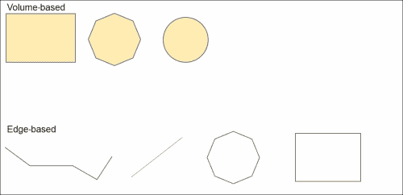
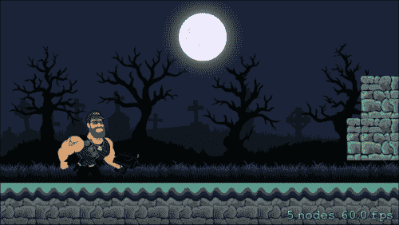
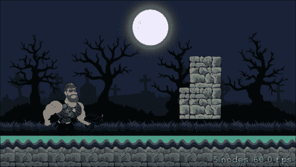
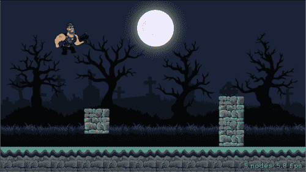

# 第五章. Sprite Kit 中的物理

在前面的章节中，我们学习了在 Sprite Kit 中开发游戏的基本知识。此外，我们已经开始开发起始场景，这些场景是与菜单项关联的不同屏幕视图。

为了回顾上一章，我们详细讨论了节点，我们研究了`SKNode`类及其相关的属性和函数。此外，我们还讨论了构建节点树和节点树上的动作。我们还应用了我们在游戏中创建菜单场景的主要子类，如`SKLabelNode`、`SKCropNode`、`SKShapeNode`、`SKEmitterNode`、`SKLightNode`和`SKVideoNode`。现在，是时候进一步探索 Sprite Kit 了。

在现实世界中，我们受到许多物理定律的影响，例如质量、重力、速度等。为了使游戏更加逼真，Sprite Kit 为我们提供了一些类和函数，这些类和函数用于使节点像在真实环境中一样行动。通过将这些类应用于角色、环境等，我们的游戏变得逼真。

例如，在一个涉及玩家在道路上行走的平台游戏中。给玩家、道路或任何其他障碍物应用重力、力、摩擦等将更好。现在，我们将讨论在我们的游戏*Platformer*中模拟物理。

# 在 Sprite Kit 中模拟物理

大多数游戏引擎都有内置的物理引擎，你还可以向游戏引擎添加外部物理引擎。幸运的是，Apple 在 Sprite Kit 中提供了一个物理引擎。在 Sprite Kit 中，物理属性通过`SKPhysicsBody`类的对象应用。正如我们已经学到的，对象与节点树中的节点相关联，物理模拟使用节点的方向和位置进行模拟。在 Sprite Kit 中，当游戏渲染时，每一帧都会在循环中调用一些函数，如下所示：

```swift
update
didEvaluateActions
didSimulatePhysics
didApplyConstraints
didFinishUpdate
```

在动作（例如节点动画中的图像变化）之后，`SKScene`会模拟物理以执行所有动作，例如物理体上的重力、速度变化、两个物理体之间的碰撞等。如果我们查看我们的`SKNode`类，我们会看到一个名为`physicsBody`的属性。它接受`SKPhysicsBody`对象作为参数，并定义了这些对象上的物理定律；很明显，它将从其子类继承，例如`SKSpriteNode`、`SKEmitterNode`、`SKVideoNode`等。因此，我们可以通过在它上面设置`physicsBody`属性，使任何`SKNode`子类成为一个物理体。

现在是时候深入研究负责场景中节点物理行为的必要文档了。让我们来讨论一下`SKPhysicsBody`类。

# SKPhysicsBody

一个节点的`physicsBody`属性使用`SKPhysicsBody`类对象。在帧的生命周期中，`didSimulatePhysics`函数在动作评估之后被调用。这个函数的工作是计算物理属性，如重力、速度、摩擦、恢复力、碰撞或其他力。在完成这些计算后，节点的位置和方向在`update`函数中更新。如果我们打算对一个节点施加一些力，那么首先将`SKPhysicsBody`对象分配给该节点是必要的。

Sprite Kit 为我们提供了两种物理体：

+   **基于体积**：这些是有质量和体积的物理体类型

+   **基于边缘**：这些是没有质量和体积的物理体类型

在基于体积的物理体中，我们可以通过将其设置为`static`或`dynamic`来控制它是否应该受到重力、摩擦、碰撞等的影响。这个属性非常有用，因为我们只需调整这个属性就可以创建一个静态平台或移动对象。这些物体定义在特定的边界内，如圆形、矩形、多边形等。不允许不规则形状。对于不规则形状的物体，可以通过连接小的基于体积的物体来实现所需的物理对象图案。

另一方面，边缘基于的物理体用于在游戏场景中创建无体积的空间。这意味着它们不是实心的，允许其他物理体在其边界内。边缘基于的物理体始终被视为其`dynamic`属性为`false`，并且只能与其他基于体积的物理体发生碰撞。为了理解边缘基于物理体的概念，可以想象一个有云的场景；云永远不会是实心的，基于体积的物理对象可以进入其中。



基于体积和边缘物理体的图形示例

这两种物理体是通过调用`SKPhysicsBody`的适当初始化方法来创建的。在我们的场景中，我们主要使用基于体积的物理体。

正如我们所定义的，我们需要实例化`SKPhysicsBody`类来创建基于体积或边缘的物理体。

## 基于体积物理体的初始化

以下是基于体积物理体的初始化器：

+   `init(circleOfRadius r: CGFloat) -> SKPhysicsBody`：这个初始化器用于创建圆形物理体。它接受半径作为参数，并返回一个`SKPhysicsBody`对象。这个物体的重心位于接收节点的中心，即应用此函数的节点。

+   `init(circleOfRadius r: CGFloat,center center: CGPoint) -> SKPhysicsBody`：这个初始化器与之前的非常相似，只是在它还接受一个额外的参数，即物理体的原点。我们可以使用这个初始化器分配的接收坐标系统相对于我们的重力或圆形物理体的中心进行偏移。

+   `init!(rectangleOfSize s: CGSize) -> SKPhysicsBody`: 这个初始化器用于创建矩形形状的物理体。它接受一个`rectangle`作为参数，并返回一个包含其中心在接收节点中心的`SKPhysicsBody`对象。

+   `init!(rectangleOfSize s: CGSize,center center: CGPoint) -> SKPhysicsBody`: 这个初始化器与上一个非常相似，除了它多了一个参数，即物理体的原点。我们可以通过这个初始化器分配的接收坐标系，将重力在矩形物理体上移至中心。

+   `init(bodies bodies: [AnyObject]) -> SKPhysicsBody`: 这个初始化器用于通过使用现有物理体的数组来创建一个新的物理体。为此，我们只需在数组中传递基于体积的物理体对象。从这个初始化器创建的物理体的结果区域是数组中其他子物理体的并集。因为它使用其子体的形状，这意味着它内部可以有空间，甚至空白区域。

+   `init!(polygonFromPath path: CGPath!) -> SKPhysicsBody`: 这个初始化器用于创建多边形形状的物理体。它接受一个顺时针方向的凸多边形路径作为参数。

+   `init!(texture texture: SKTexture!,size size: CGSize) -> SKPhysicsBody`: 这个初始化器用于使用纹理创建物理体。当我们需要根据纹理形状创建物理体形状时，会用到它。这被称为逐像素物理，当形状既不是矩形也不是圆形时非常有用。它是在 iOS 8 中引入的。在这个初始化器中，使用纹理和大小作为参数。首先，纹理被缩放到那个大小，然后，新创建的物理体的形状由所有具有非零 alpha 值的像素决定。

+   `init!(texture texture: SKTexture!,alphaThreshold alphaThreshold: Float,size size: CGSize) -> SKPhysicsBody`: 这个初始化器与上一个非常相似，也是在 iOS 8 中引入的，但它多了一个参数，即`alpha`。我们可以定义像素的 alpha 值，当低于这个值时，像素将被忽略，以创建新的物理体。其余的过程与上一个相同。

在此之后，让我们看看如何创建基于边缘的物理体。

## 基于边缘的物理体的初始化

以下是用于创建基于边缘的物理体的初始化器列表：

+   `init (edgeLoopFromRect rect: CGRect) -> SKPhysicsBody`: 这个初始化器接受一个矩形作为参数，并返回一个新的基于矩形边缘的物理体。

+   `init (edgeFromPoint p1: CGPoint, toPoint p2: CGPoint) -> SKPhysicsBody`: 这个初始化器接受两个点作为参数，并在这两个点之间返回一个基于边缘的物理体。

+   `init (edgeLoopFromPath path: CGPath!) -> SKPhysicsBody`: 此初始化器接受一个`path`作为参数，并基于该路径返回一个基于边的物理体。路径不得相交。如果路径未封闭，它将自动通过连接该路径的第一个和最后一个点来创建一个循环。

+   `init (edgeChainFromPath path: CGPath!) -> SKPhysicsBody`: 此初始化器接受一个`path`作为参数，并基于该路径返回一个基于边链的物理体。路径不得相交。

这些是基于体积和基于边的物理体的初始化过程。我们可以通过调整其一些属性来自定义物理体的行为。

## 物理体的行为控制器属性

以下是我们可以控制物理体行为的属性列表：

+   `受重力影响`: 这是一个布尔值。它确定物理体是否会被场景中的重力影响。基于边的物理体简单地忽略此属性，因为它们不受重力影响。默认值是`true`。

+   `允许旋转`: 这也是一个布尔值。它确定物理体是否会被场景中施加到它上的角力和冲量影响。基于边的物理体简单地忽略此属性。默认值是`true`。

+   `动态`: 这也是一个布尔值。它确定物理体是否会被场景中的物理模拟移动。基于边的物理体简单地忽略此属性。默认值是`true`。

这些是基于体积的物理体的行为控制器属性。此外，物理体还有一些自己的物理属性。

## 物理体的物理属性

这些是物理体拥有的属性。正如你所知，速度、力、重力、碰撞等取决于物体的质量、密度、面积等。

以下是物理体的物理属性列表。

+   `质量`: 这是物体的质量，单位为千克。

+   `密度`: 这是物体每平方米的密度。密度和质量属性是相互关联的。每当其中一个属性改变时，另一个属性就会重新计算。默认值是 1.0。

+   `面积`: 这是物体覆盖的面积。这是一个只读属性，并用于在`密度`属性的帮助下定义物理体的质量。

+   `摩擦力`: 它用于确定应施加到与当前物体接触的另一个物理物体上的摩擦力大小。此属性值介于 0.0 和 1.0 之间。默认值为 0.2。

+   `恢复`: 它用于确定物理体的弹性。此属性值介于 0.0 和 1.0 之间。默认值是 0.2。

+   `线性阻尼`: 它用于减少物理体的线性速度。此属性值介于 0.0 和 1.0 之间。默认值为 0.1。

+   `angularDamping`: 它用于减少物理物体的角速度。此属性值介于 0.0 和 1.0 之间。默认值为 0.1。

这些属性定义了物理物体的物理行为。

`SKPhysicsBody`类提供了一些用于碰撞控制的属性和函数。

## 碰撞控制属性和函数

物理物体使用某些类别与其他物理物体进行碰撞检测。碰撞在几乎每个游戏中都非常重要。当物体发生碰撞时，物体的速度和方向会发生变化，这需要对物理参数的变化进行精确计算。我们必须指定我们游戏中物理物体的类别。有一个限制，因为我们只能为我们游戏中的物理物体定义 32 种不同的类别。我们使用这些类别来定义物理物体是否应该与另一个物理物体发生碰撞。这是非常有用的行为，并且在 Sprite Kit 的物理游戏中使用。

以下是碰撞控制属性的列表：

+   `categoryBitMask`: 这是一个定义物理物体类别的掩码。我们可以有最多 32 个不同的类别。借助类别掩码，您可以定义哪些物理物体应该相互交互。此属性与`contactTestBitMark`一起使用。

+   `collisionBitMask`: 此属性用于定义可能发生碰撞的物理物体的类别。它用于通过与其他物理物体的 AND 操作来确定是否发生碰撞。如果结果是非零值，则此物体将受到碰撞的影响，否则不会。这有助于在速度变化很小的场合跳过碰撞计算。

+   `usesPreciseCollisionDetection: Bool`: 如果为`true`，则此物体将受到碰撞的影响，否则它将在一个帧内穿过另一个物体。任一物体的`true`值都会导致碰撞，这意味着 Sprite Kit 将使用更多的计算能力来检测碰撞和执行精确计算。对于非常小且快速移动的物体，此属性可以设置为`true`，否则默认值为`false`。

+   `contactTestBitMask`: 此属性定义了`BitMask`物理物体应该通过 AND 门操作通知与接收到的物理物体相交的类别。如果值为非零，则创建`SKPhysicsContact`对象并将其传递给物理世界代理。

+   `allContactedBodies() -> [AnyObject]`: 这是一个用于确定一个或多个物体是否与接收到的物理物体接触的函数。它简单地返回一个包含所有与接收到的物理物体接触的物理物体对象的数组，即应用此函数的物体。

这些碰撞控制属性和功能决定了在物理模拟中两个或更多物理体碰撞或接触的行为。但有时我们需要为了某些特定的行为给物理体施加速度或力。`SKPhysicsBody` 类定义了一些用于在此目的上对物理体施加力和冲量的函数。

## 力和冲量

要移动一艘太空船或一辆汽车，我们需要在运动方向上施加力；要保持其运动，必须持续施加力。冲量是用来改变物体的动量，例如，发射子弹时，一旦它开始运动，我们就不需要再施加任何力。

以下是用于在物理体上施加力和冲量的函数列表：

+   `func applyForce(_ force: CGVector)`: 此函数用于对接收到的物理体施加力。它接受 `force` 作为参数，并加速接收到的物理体，而不产生任何角加速度。

+   `func applyTorque(_ torque: CGFloat)`: 此函数用于对接收到的物理体施加角力。它接受 `torque` 作为参数，并对接收到的物理体施加角加速度。它不会对接收到的物理体施加任何线加速度。

+   `func applyForce(_ force: CGVector, atPoint point: CGPoint)`: 此函数用于在特定点上对接收到的物理体施加力。由于它作用于物理体上的特定点，因此可能会改变物体的角加速度和线加速度。

+   `func applyImpulse(_ impulse: CGVector)`: 此函数用于对接收到的物理体的重心施加冲量。它接受 `impulse` 作为参数，并影响线速度，而不改变角速度。

+   `func applyImpulse(_ impulse: CGVector, atPoint point: CGPoint)`: 此函数用于在特定点上对接收到的物理体施加冲量。由于它作用于物理体上的特定点，因此可能会改变接收物理体的角速度和线速度。

+   `func applyAngularImpulse(_ impulse: CGFloat)`: 此函数用于对接收到的物理体施加角冲量。它接受 `impulse` 作为参数，并对接收到的物理体施加角速度。它不会对接收到的物理体施加任何线速度。

除了这些函数之外，我们还需要知道物理体的结果速度和角速度。为此，`SKPhysicsBody` 类有一些属性。

## 物理体的速度

以下是用于在物理体上施加速度的函数列表：

+   `velocity`: 它用于确定物理体的线速度。

+   `angularVelocity`: 它用于确定物理体的角速度。

+   `resting`：它确定物理对象是否在物理世界中处于静止状态。这意味着它不参与物理模拟，直到被力或碰撞唤醒。这个属性有助于减少物理模拟中的计算，从而提高性能。

+   `SKPhysicsBody`：它为我们提供了一些其他重要的属性。其他属性 `joints`，这个属性包含一个 `SKPhysicsJoint` 对象的数组，这些对象连接到接收到的物理体。

+   `fieldBitMask`：这个属性应用于物理体。一旦这个体进入一个 `SKFieldNode` 对象内部，`fieldBitMask` 属性将与字段节点的 `categoryBitMask` 属性执行逻辑与操作。如果值为非零，字段节点的影响将应用于此体。

+   `charge`：它用于计算 `SKFieldNode` 对象对接收器物理体的电磁场力。

+   `pinned`：它确定接收器是否相对于其父级固定在位置。其默认值是 `false`。如果是 `true`，则节点可以自由地围绕其相对于父级的位置旋转，将物理应用到我们的 *平台游戏*。

现在，我们将继续我们的 *平台游戏* 并在其中实现各种物理引擎功能。在我们开始将物理应用到我们的游戏之前，我们需要首先确保最初加载的菜单场景是 `MenuScene`（如第三章 所述，*精灵*) 而不是 `NodeMenuScene`。当我们讨论着色器和粒子发射器时，我们将实现 `NodeMenuScene` 类。

请转到 `GameViewController.swift` 文件，并在 `GameViewController` 类中注释掉以下内容：

```swift
let menuscene = NodeMenuScene()
```

取而代之，写下以下内容：

```swift
let menuscene = MenuScene(size: view.bounds.size, playbutton: "Play", background:"BG")
```

上述代码将使你的游戏加载 `MenuScene` 类。现在，前往 `GameScene.swift` 文件以在我们的游戏中添加物理体。

## 使用 `GameScene.swift` 添加物理体。

首先打开你的 `GameScene.swift` 文件。

1.  编辑 `GameScene` 类声明以添加 `SKPhysicsContactSelegate` 如下：

    ```swift
    class GameScene: SKScene, SKPhysicsContactDelegate
    ```

1.  然后在其中添加以下代码：

    ```swift
    let backgroundNode = SKSpriteNode(imageNamed: "BG")
        var spriteWithoutTexture : SKSpriteNode?
        let myAtlas = SKTextureAtlas(named: "idle.atlas")
        var player:SKSpriteNode = SKSpriteNode(imageNamed:"bro5_idle0001@2x")
        var currentno = 0

        // SETTING UP "RUNNING BAR", "BLOCK 1", "Block 2
        let runningBar = SKSpriteNode(imageNamed:"bar")
        let block1 = SKSpriteNode(imageNamed:"block1")
        let block2 = SKSpriteNode(imageNamed:"block2")
        var origRunningBarPositionX = CGFloat(0)
        var maxBarX = CGFloat(0)
        var groundSpeed = 5
        var playerBaseline = CGFloat(0)
        var onGround = true

        // INITIALIZING PHYSICAL PROPERTIES VALUES
        var velocityY = CGFloat(0)
        let gravity = CGFloat(0.6)
        var blockMaxX = CGFloat(0)
        var origBlockPositionX = CGFloat(0)
        var blockStatuses:Dictionary<String,BlockStatus> = [:]

        //COLLISION TYPE BETWEEN "BLOCKS" AND "PLAYER"
        enum ColliderType:UInt32
        {
            case player = 1
            case Block = 2
        }
    ```

    如果你查看前面的代码，你会看到我们添加了三张新图片：一张是顶部运行的条形，我们的玩家将跑步或看起来在跑步，其他两张是 `block1` 和 `block2`。这两张图片是障碍物，我们的玩家将与它们碰撞。除此之外，我们还初始化了一些物理属性值，如速度、重力等。我们还定义了一个枚举来控制 `Blocks` 和 `Player` 之间的碰撞类型。

1.  现在，添加以下函数以启动执行流程，并定义接触代理以检测屏幕上的触摸/接触（触摸将帮助我们确定跳跃强度）：

    ```swift
        override func didMoveToView(view: SKView)
        {
            self.physicsWorld.contactDelegate = self

            //#1
            addBackGround()
            addRunningBar()
            addPlayer()
            addBlocks()

        }
    ```

    在前面的代码中，`#1`代码块用于使用方法将背景、跑步条、玩家和方块添加到场景中。并且还用于设置物理属性，如`categoryBitMask`、`ContactTestBitMask`、`CollisionBitMask`等。

1.  现在，添加以下函数以随机生成方块，取一个介于`50`和`200`之间的数字；这是用于在屏幕上随机显示方块：

    ```swift
    func random() -> UInt32
        {
            var range = UInt32(50)..<UInt32(200)
            return range.startIndex + arc4random_uniform(range.endIndex - range.startIndex + 1)
    //CREATING BLOCKS FROM LIBRARY METHOD OF iOS
        }
    ```

1.  现在，添加下一个函数以使用无纹理的精灵：

    ```swift
    func addSpriteWithoutTexture()
        {
            spriteWithoutTexture = SKSpriteNode(texture: nil, color:UIColor.redColor(), size: CGSizeMake(100, 100))
            addChild(spriteWithoutTexture!)
        }
    ```

1.  添加下一个函数以在场景中插入背景：

    ```swift
    func addBackGround()
        {
            backgroundNode.zPosition = 0
            var scaleX =  self.size.width/backgroundNode.size.width
            var scaleY =  self.size.height/backgroundNode.size.height
            backgroundNode.xScale = scaleX
            backgroundNode.yScale = scaleY
            addChild(backgroundNode)
        }
    ```

1.  将以下函数添加到定义我们游戏中玩家/角色的物理属性：

    ```swift
    func addPlayer()
        {

            player.zPosition = 2;
            player.name = "Player"

            // PHYSICS PROPERTIES FOR player
            self.playerBaseline = self.runningBar.position.y + (self.runningBar.size.height / 2) + (self.player.size.height / 2)
            self.player.position = CGPointMake(CGRectGetMinX(self.frame) + self.player.size.width + (self.player.size.width / 4), self.playerBaseline)
            self.player.physicsBody = SKPhysicsBody(circleOfRadius: CGFloat(self.player.size.width / 2))
            self.player.physicsBody?.affectedByGravity = false
            self.player.physicsBody?.categoryBitMask = ColliderType.player.rawValue
    // Will become '1' because its defined in "ColliderType" enum
            self.player.physicsBody?.contactTestBitMask = ColliderType.Block.rawValue
            self.player.physicsBody?.collisionBitMask = ColliderType.Block.rawValue

            self.addChild(player)
        }
    ```

1.  现在，设置跑步条；玩家将出现在上面的条上：

    ```swift
    func addRunningBar()
       {
            self.runningBar.anchorPoint = CGPointMake(0, 0.5)
            self.runningBar.position = CGPointMake(CGRectGetMinX(self.frame),CGRectGetMinY
    (self.frame) + (self.runningBar.size.height / 2))
            self.origRunningBarPositionX = self.runningBar.position.x
            self.maxBarX = self.runningBar.size.width - self.frame.size.width
            self.maxBarX *= -1
            self.addChild(self.runningBar)
        }
    ```

1.  现在插入以下函数以在游戏中添加方块：

    ```swift
    func addBlocks()
        {
            // PHYSICS PROPERTIES FOR BLOCK 1
            self.block1.position = CGPointMake(CGRectGetMaxX(self.frame) + self.block1.size.width, self.playerBaseline)
            self.block2.position = CGPointMake(CGRectGetMaxX(self.frame) + self.block2.size.width, self.playerBaseline + (self.block1.size.height / 2))
            self.block1.physicsBody = SKPhysicsBody(rectangleOfSize: self.block1.size)
            self.block1.physicsBody?.dynamic = false
            self.block1.physicsBody?.categoryBitMask = ColliderType.Block.rawValue
            self.block1.physicsBody?.contactTestBitMask = ColliderType.player.rawValue
            self.block1.physicsBody?.collisionBitMask = ColliderType.player.rawValue

            // PHYSICS PROPERTIES FOR BLOCK 2
            self.block2.physicsBody = SKPhysicsBody(rectangleOfSize: self.block1.size)
            self.block2.physicsBody?.dynamic = false
            self.block2.physicsBody?.categoryBitMask = ColliderType.Block.rawValue
            self.block2.physicsBody?.contactTestBitMask = ColliderType.player.rawValue
            self.block2.physicsBody?.collisionBitMask = ColliderType.player.rawValue

            self.origBlockPositionX = self.block1.position.x //ORIGINAL BLOCK POSITION (0,0)
            self.block1.name = "block1"   // SETTING BLOCK NAMES
            self.block2.name = "block2"

            // ADDING BLOCK 1 and BLOCK 2 to DICTIONARY BLOCKSTATUS
            blockStatuses["block1"] = BlockStatus(isRunning: false, timeGapForNextRun: random(), currentInterval: UInt32(0))
            blockStatuses["block2"] = BlockStatus(isRunning: false, timeGapForNextRun: random(), currentInterval: UInt32(0))

            self.blockMaxX = 0 - self.block1.size.width / 2

            self.addChild(self.block1)
            self.addChild(self.block2)
        }
    ```

1.  添加以下函数，当用户触摸屏幕时调用。它使角色跳跃：

    ```swift
    override func touchesBegan(touches: NSSet, withEvent event: UIEvent) {
            for touch: AnyObject in touches
            {
                let location = touch.locationInNode(self)
                let node = self.nodeAtPoint(location)
                if node.name == player.name
                {
                    currentno++
                    //changeSpriteFromTextureAtlas()

                    if self.onGround
                    {
                           self.velocityY = -18.0
                           self.onGround = false
                     }
                }
            }
        }
    ```

1.  还添加下一个函数，当屏幕触摸释放时调用。它将在跳跃后将角色降下：

    ```swift
    override func touchesEnded(touches: NSSet, withEvent event: UIEvent)
        {
            if self.velocityY < -9.0    //SETTING VELOCITY FOR JUMP ACTION IS FINISHED
            {
                self.velocityY = -9.0
            }
        }
    ```

1.  添加下一个方法以定义在场景动作评估之前需要执行的特定场景更新操作：

    ```swift
    override func update(currentTime: NSTimeInterval)
        {
            if self.runningBar.position.x <= maxBarX
                {
                        self.runningBar.position.x = self.origRunningBarPositionX
                }

                // JUMP ACTION
                self.velocityY += self.gravity
                self.player.position.y -= velocityY
                if self.player.position.y < self.playerBaseline // STOPPING PLAYER TO FALLDOWN FROM BASELINE
                {
                    self.player.position.y = self.playerBaseline
                    velocityY = 0.0
                    self.onGround = true
                }
                //move the ground
                runningBar.position.x -= CGFloat(self.groundSpeed)
                blockRunner()

        }
    ```

1.  最后，添加以下函数以使方块移动：

    ```swift
    func blockRunner()
        {
            // LOOP FOR THE DICTIONARY TO GET BLOCKS
            for(block, blockStatus) in self.blockStatuses
            {
                var thisBlock = self.childNodeWithName(block)!
                if blockStatus.shouldRunBlock()
                {
                    blockStatus.timeGapForNextRun = random()
                    blockStatus.currentInterval = 0
                    blockStatus.isRunning = true
                }

                if blockStatus.isRunning
                {

                    if thisBlock.position.x > blockMaxX
    // IF IT IS POSITIVE (KEEP MOVING BLOCKS FROM RIGHT TO LEFT)
                    {
                        thisBlock.position.x -= CGFloat(self.groundSpeed) 
                    }
                    else
    // IF ITS TIME TO OFF THE SCREEN ie when BLOCKS should DISAPPEAR
                    {
                        thisBlock.position.x = self.origBlockPositionX
                        //blockStatus.isRunning = false
                    }
                }
                else
                {
                    blockStatus.currentInterval++
                }
            }
        }
    ```

1.  还需要在 Xcode 中创建一个名为`BlockStatus.swift`的`swift`文件。此文件包含初始化和运行方块代码：

    ```swift
    class BlockStatus            //
    {
        var isRunning = false                 //CURRENTLY RUNNING ON SCREEN OR NOT
        var timeGapForNextRun = UInt32(0)      // HOW LONG WE IT SHOULD WAIT FOR NEXT RUN
        var currentInterval = UInt32(0)         //TOTAL INTERVAL WAITED

        // INITIALIZING BLOCK STATUS
        init(isRunning:Bool, timeGapForNextRun:UInt32, currentInterval:UInt32) {
            self.isRunning = isRunning
            self.timeGapForNextRun = timeGapForNextRun
            self.currentInterval = currentInterval
        }

        // RUNNING BLOCKS
        func shouldRunBlock() -> Bool
        {
            return self.currentInterval > self.timeGapForNextRun
        }
    }
    ```

1.  现在开始运行游戏；确保尝试不同的值来发现你游戏的行为。这将增加你在 Sprite Kit 中对物理学的理解。

以下是第二张图片：



前面的两个截图显示了角色为静态，方块为移动。我们还可以通过在屏幕上触摸角色来执行跳跃：



你注意到玩家没有在跑，而是玩家下面的条和与之碰撞的方块在移动。角色只是看起来像在跑；在这种情况下，我们只是实现了跳跃的速率方法，而不是在 y 方向上应用力。

# 摘要

在本章中，我们讨论了物理引擎。我们学习了`SKPhysicsBody`。现在我们非常了解 Sprite Kit 中的基于边缘和基于体积的物理体。在我们的游戏中，朝向角色的方块是体积型体。我们还学习了这些类型物理体的各种初始化方法。我们学习了如何在游戏中应用 Sprite Kit 的物理引擎，以便探索其功能。

在下一章中，我们将学习在 Sprite Kit 中动画精灵以及在我们的游戏中添加各种类型的控制。我们还将讨论通过 Sprite Kit 进行碰撞和 SceneKit 集成。
