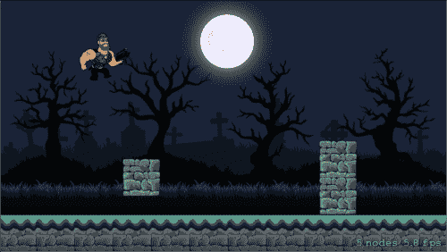
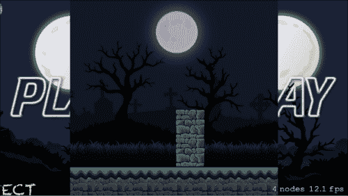
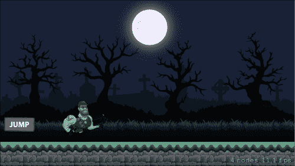

# 第六章. 动画精灵、控件和 SceneKit

在上一章中，我们详细学习了物理引擎。我们讨论了`SKPhysicsBody`，即基于边缘和体积的物理体。我们还了解了各种初始化方法和物理属性，这些帮助我们将物理集成到我们的*平台游戏*中。现在我们对如何在 Sprite Kit 游戏中模拟物理有了更清晰的认识。

在我们的游戏中拥有良好的动画特性总是很好的，这可以增强用户体验；这个 Sprite Kit 拥有`SKAction`类，它帮助我们应用动作到节点上，例如节点的移动、旋转、缩放等。例如，在玩家移动时使用动画或使用动画来描绘碰撞等。现在是时候讨论`SKAction`类以及在我们*平台游戏*中实现动画了。

除了动画，我们还将讨论如何在我们的游戏中提供控制，例如当用户触摸屏幕时产生反应或使用加速度计来响应游戏中的方向。我们还将在我们*平台游戏*中实现控制，并添加一个跳跃按钮，使玩家能够跳过方块。

Scene Kit 是苹果提供的一个 3D 图形框架，我们可以在 Sprite Kit 游戏中使用 SceneKit 的 3D 元素来进一步增强游戏体验，并在需要时拥有更好的游戏玩法。我们将讨论如何将 SceneKit 集成到 Sprite Kit 游戏中。

# 动画节点

动画图片在游戏过程中提供了非常动态和精致的感觉；在我们的游戏中总是偏好拥有动画。要在 Sprite 节点中添加动画，我们可以使用`SKAction`类的属性和方法，这些方法将动画添加到 Sprite Kit 节点中。让我们详细讨论`SKAction`类。

## SKAction

`SKAction`类的属性和方法有助于向场景中的节点提供动作。动作用于改变它们所附加的节点的排列和外观。当场景运行其节点时，节点中的动作会被执行。

要分配一个动作，我们可以根据需要调用特定的`SKAction`类方法。然后，我们可以配置动作的属性。最后，为了执行动作，我们调用节点对象的`runAction()`方法并传递动作对象。

## 将单个动作添加到节点

将单个动作添加到节点的步骤有两个：

1.  **创建动作**：首先，我们创建一个动作，它可以在 Sprite Kit 节点上执行特定的活动，如旋转、缩放、移动等。

1.  **执行动作**：最后，我们通过在该节点上调用`runAction()`方法来运行动作。

## 将多个动作添加到节点

在将多个动作添加到节点过程中的涉及三个步骤：

1.  **创建动作**：在这里，我们不仅可以创建单个动作，还可以创建多个动作，以在 Sprite Kit 节点上执行不同的行为。

1.  **创建动作序列**：在这里，我们将创建在 Sprite Kit 节点中动作应该表现出的执行顺序。

1.  **执行动作**：最后，我们将通过在节点的`runAction()`方法中指定动作序列来运行动作。

# 创建动作

可以对节点应用各种类型的动作，以使其表现出不同的行为，现在我们将详细研究其中大部分。

## 使用动作移动节点

`SKAction`类为在场景中移动节点提供了各种动作方法。它们如下：

+   `func moveByX( x: CGFloat, y : CGFloat, duration sec: NSTimeInterval)`: 这将使节点移动到其新位置。这里，`x`和`y`的增量以及持续时间的秒数作为参数传递。

+   `func moveBy( delta: CGVector, duration sec: NSTimeInterval)`: 这将使节点相对于其当前位置移动。这里，指向新位置的增量向量和持续时间的秒数作为参数传递。

+   `moveTo(location: CGPoint, duration sec: NSTimeInterval)`: 这将使节点移动到新位置。新位置的坐标和持续时间的秒数作为参数传递。这里的位置是一个`CGPoint`值，其默认值为`(0,0)`。

+   `func moveToX( x: CGFloat, duration sec: NSTimeInterval)`: 这将使节点水平移动。在这里，`x`值和动作的持续时间作为参数传递。

+   `func moveToY(y: CGFloat, duration sec: NSTimeInterval)`: 这将使节点沿着相对路径垂直移动。在这里，`y`值和动作的持续时间（以秒为单位）作为参数传递。

+   `func followPath( path: CGPath, duration sec: NSTimeInterval)`: 这将使节点沿着相对路径移动。`path`和`sec`作为参数，其中`path`是一个相对于节点当前位置的`CGPath`值。

+   `func followPath( path: CGPath, speed: CGFloat)`: 这将使节点以指定的速度沿着相对路径移动。速度的单位是每秒点数。

+   `func followPath( path: CGPath, asOffset : Bool, orientToPath : Bool, duration : NSTimeInterval )`: 此函数将使节点沿着路径移动。在这个函数中，我们传递四个参数：一个是节点将要移动的`path`；第二个是`offset`参数，它可以是`true`或`false`。`true`表示路径中的点相对于节点初始位置的相对偏移，而另一方面`false`表示点具有绝对性质。`orientToPath`将是一个布尔属性，如果节点可以沿着`z`轴跟随路径。

+   `func followPath( path: CGPath, asOffset : Bool, orientToPath : Bool, speed : CGFloat)`: 此函数将以指定的速度沿着路径移动节点。

## 使用动作旋转节点

`SKAction` 类提供了各种用于在场景中旋转节点的动作方法。它们是：

+   `func rotateByAngle( radians: CGFloat, duration sec: NSTimeInterval)`: 此函数有助于在指定角度旋转节点。它接受两个参数：一个是节点旋转的 `radians` 数量，另一个是旋转的持续时间（以秒为单位）。此旋转相对于节点。

+   `func rotateToAngle( radians: CGFloat, duration sec: NSTimeInterval)`: 此函数有助于将节点旋转到绝对角度，逆时针方向。它也接受两个参数：一个是旋转节点的角度，以 `radians` 为单位测量，另一个是以秒为单位的动画持续时间。

+   `func rotateToAngle(radians: CGFloat, duration sec: NSTimeInterval, shortestUnitArc shortestUnitArc: Bool)`: 此函数有助于将节点旋转到绝对角度。它接受三个参数：一个是节点要旋转到的角度，第二个是持续时间（以秒为单位），第三个是布尔值，用于指定我们是否想要最小的旋转路径。如果 `true`，则旋转将沿最短方向进行，否则旋转将在离散点之间插值。

## 更改节点的动画速度

`SKAction` 类提供了各种用于更改节点动画速度的动作方法。它们如下：

+   `func speedBy(speed: CGFloat, duration sec: NSTimeInterval)`: 使用此函数，我们可以控制节点动作的速度。它接受两个参数：一个是节点中要添加的 `speed` 量，另一个是以秒为单位的动画持续时间。

+   `func speedTo(speed: CGFloat, duration sec: NSTimeInterval)`: 使用此函数同样可以控制节点动作的速度。但与传递参数以将其值添加到先前速度不同，此函数将 `speed` 更改为设置的值。另一个传递的参数是动画的持续时间（以秒为单位）。

## 更改节点的缩放位置

`SKAction` 类提供了各种用于缩放节点的动作方法。它们如下：

+   `func scaleBy( scale: CGFloat, duration sec: NSTimeInterval)`: 使用此函数，您可以更改节点的 `xScale` 和 `yScale` 值。此函数接受两个参数：一个是节点 `x` 和 `y` 值中要添加的量，另一个是动画的持续时间。此缩放应用于当前大小。

+   `func scaleTo( scale: CGFloat, duration sec: NSTimeInterval)`: 使用此函数同样可以更改节点的 `x` 和 `y` 值。它接受两个参数：一个是节点 `x` 和 `y` 值的新值，另一个是动画的持续时间。

+   `func scaleXBy(xScale: CGFloat, y yScale: CGFloat, duration sec: NSTimeInterval)`: 使用此函数，您可以更改节点的`x`和`y`值。在此函数中传递了三个参数：第一个是要添加到节点`x`值中的量，第二个是要添加到节点`y`值中的量，第三个是动画的持续时间。当您必须使用不同的值缩放节点的`x`和`y`时，使用此函数。

+   `func scaleXTo(xScale: CGFloat, y yScale: CGFloat, duration sec: NSTimeInterval)`: 此函数同样可以更改节点的`x`和`y`值，但不是传递要添加到`x`和`y`中的值，而是通过传递相应的参数将`x`和`y`缩放设置为新的值。

+   `func scaleXTo(scale: CGFloat, duration sec: NSTimeInterval)`: 使用此函数，您只能将节点的`x`值更改为新值。它接受两个参数：一个是节点的`x`值，另一个是动画的`duration`。

+   `func scaleYTo(scale: CGFloat, duration sec: NSTimeInterval)`: 使用此函数，您只能将节点的`y`值更改为新值。它接受两个参数：一个是节点的`y`值，另一个是动画的`duration`。

## 显示或隐藏节点

`SKAction`类为在场景上隐藏或显示节点提供了各种动作方法。让我们看看这两个函数：

+   `func unhide()`: 使用此函数，您可以创建一个使节点可见的动作。此函数是在 iOS 8.0 中引入的。

+   `func hide()`: 使用此函数，您可以创建一个使节点隐藏的动作。此函数也是在 iOS 8.0 中引入的。

## 更改节点的透明度

在`SKAction`的帮助下，您还可以更改节点的透明度。以下函数可以帮助您实现这一点：

+   `func fadeInWithDuration(sec: NSTimeInterval)`: 您可以使用此函数将节点的 alpha 值更改为`1.0`。此函数只传递一个参数，即动画的持续时间。

+   `func fadeOutWithDuration(sec: NSTimeInterval)`: 您可以使用此函数将节点的 alpha 值更改为`0.0`。此函数只传递一个参数，即动画的持续时间。

+   `func fadeAlphaBy(factor: CGFloat, duration sec: NSTimeInterval)`: 使用此函数，您可以控制要添加到节点中的 alpha 值的量。在此函数中，您传递两个参数：一个是添加到节点 alpha 值中的量，另一个是节点的`duration`。

+   `func fadeAlphaTo(alpha: CGFloat, duration sec: NSTimeInterval)`: 使用此函数，您可以设置节点的新 alpha 值。在此函数中传递了两个参数：一个是节点的新 alpha 值，另一个是节点的`duration`。

## 更改精灵节点的内容

通过一些`SKAction`函数，您可以创建动作来更改精灵节点的内容。让我们看看它们：

+   `func resizeByWidth(width: CGFloat, height: CGFloat, duration: NSTimeInterval)`: 这个函数创建一个动作，调整精灵节点的尺寸。这个函数接受三个参数：第一个是添加到精灵 `width` 的量，第二个是添加到精灵 `height` 的量，第三个是动画的 `duration`。

+   `func resizeToHeight(height: CGFloat, duration: NSTimeInterval)`: 这个函数创建一个动作，将精灵的 `height` 更改为新值。传递的一个参数是精灵的新 `height`，另一个参数是动画的 `duration`。

+   `func resizeToWidth(width: CGFloat, duration: NSTimeInterval)`: 这个函数创建一个动作，将精灵的 `width` 更改为新值。传递的一个参数是精灵的新 `width`，另一个参数是动画的 `duration`。

+   `func resizeToWidth(width: CGFloat, height: CGFloat, duration: NSTimeInterval)`: 这个函数创建一个动作，将精灵节点的 `width` 和 `height` 更改为新值。在这个函数中，您可以分别指定新的 `height` 和 `width`。它接受三个参数：一个是精灵的新 `width`，二是精灵的新 `height`，三是动画的 `duration`。

+   `func setTexture(texture: SKTexture)`: 这个函数有助于创建一个改变精灵纹理的动作。这个函数只传递了一个参数，即精灵的新 `texture`。

+   `func setTexture(texture: SKTexture, resize: Bool)`: 这个函数有助于创建一个改变精灵纹理的动作。除了这个之外，您还可以控制精灵是否应该调整大小以匹配新纹理。传递的两个参数是用于精灵的新 `texture` 和控制调整大小的布尔值。

+   `func animateWithTextures(textures: [AnyObject], timePerFrame sec: NSTimeInterval)`: 这个函数创建一个动作，用于动画化精灵纹理的变化。当动作执行时，`texture` 属性会动画化传递作为参数的纹理数组。动作会持续进行，直到数组中的所有纹理都完成动画。这个函数传递了两个参数：一个是纹理数组，另一个是数组中每个纹理显示的时间。

+   `func animateWithTextures(textures: [AnyObject], timePerFrame sec: NSTimeInterval, resize: Bool, restore: Bool)`: 这个函数创建一个动作，可以动画化精灵纹理的变化，并在需要时调整精灵大小以匹配新纹理。它接受四个参数：一个是用于动画精灵的纹理数组，第二个是每个纹理显示的时间，第三个是布尔值，用于控制精灵是否调整大小以匹配新纹理，第四个是恢复精灵大小到原始纹理大小。

+   `func colorizeWithColor(color: UIColor, colorBlendFactor: CGFloat, duration sec: NSTimeInterval)`: 此函数创建一个动画，该动画会动画化精灵的颜色和混合因子。此函数中传递了三个参数：一个是用于新精灵的 `color`，第二个是新混合因子，第三个是动画的 `duration`。

+   `func colorizeWithColorBlendFactor( colorBlendFactor: CGFloat, duration sec: NSTimeInterval)`: 此函数将创建一个动画，该动画会动画化精灵的混合因子。它接受两个参数：一个是新的混合因子，另一个是动画的 `duration`。

## 一些其他重要的动作

到目前为止，我们已经讨论了大多数用于在节点上创建动作的重要函数。现在，我们将看看在 Sprite Kit 中创建节点动作的一些其他重要函数：

+   `func runAction( action: SKAction, onChildWithName name: String)`: 此函数将创建一个 `action`，然后在该节点的子节点上运行 `action`。您需要传递要执行的 `action` 和子对象的 `name` 作为参数。

+   `func group( actions: [AnyObject])`: 您可以使用此函数的动作并行运行一系列 `actions`。它接受一个 `SKAction` 对象的数组作为参数。

+   `func sequence( actions: [AnyObject])`: 您可以使用此函数的动作按顺序运行一系列动作。它接受一个 `SKAction` 对象的数组作为参数。动作的顺序与数组中传递的动作顺序相同。

+   `func repeatAction( action: SKAction, count count: Int)`: 您可以创建一个动作来重复指定次数的动作。将重复的动作和重复次数作为参数传递。

+   `func repeatActionForever( action: SKAction)`: 它创建一个动作，该动作会无限期地重复另一个动作。它接受要重复的动作作为参数。

+   `func reversedAction()`: 使用此动作，您可以反转另一个动作的行为。

# 在 Sprite Kit 中添加控制

在 Sprite Kit 中添加控制不需要任何外部预定义框架；我们可以使用以下方法在 Sprite Kit 中实现控制：

+   点击

+   手势识别（任意方向的滑动、捏合、旋转）

+   使用加速度计移动精灵

让我们详细讨论前面提到的每个控制，以及我们如何在游戏中实现它们。

## 节点点击和双击

我们有四个重载方法用于处理带有 `UIResponder` 类的触摸事件，这是 Apple 提供的 `UIKit` 的一部分。让我们来了解一下：

+   `func touchesBegan(touches:Set<NSObject>, withEvent event:UIEvent)`: 当用户触摸视图/窗口时，会调用此方法

+   `func touchesMoved(touches:Set<NSObject>, withEvent event:UIEvent)`: 当用户在视图/窗口上移动手指时，会调用此方法

+   `func touchesEnded(touches:Set<NSObject>, withEvent event:UIEvent)`: 当用户从视窗/窗口移除手指时，此方法会被调用

+   `func touchesCancelled(touches:Set<NSObject>!, withEvent event:UIEvent!)`: 当系统事件发生时，如内存警告等，此方法会被调用

要在场景中的节点上点击时实现一个动作，我们首先获取场景上的点击位置，如果点击位置在节点的坐标轴点上，那么我们可以为该点击定义动作。这将在`touchesBegan()`方法中实现。

Sprite Kit 在`UITouch`中包含一个类别；这是其最佳特性之一。`UITouch`包含两个方法，即`locationInNode()`和`previousLocationInNode()`。这些方法在`SKNode`对象坐标系内找到触摸的坐标。

在我们的游戏中，我们将使用它来确定触摸在场景坐标系中的位置。

## 手势识别（在任何方向上滑动、捏合或旋转）

如果需要在游戏中检测手势，如点击、捏合、拖动或旋转，使用 Swift 和内置的`UIGestureRecognizer`类将非常容易。

以下是一个 Swift 中手势识别的代码片段；它将实现左右、上下滑动。

首先，我们为每个方向设置四个函数，以便处理用户在屏幕上向这些方向滑动时想要执行的操作。然后，在`didMoveToView`语句中，我们为每个方向创建`UISwipeGestureRecognizer`变量并将它们添加到视图中。注意每个`action`: `selector`部分，在下面的代码中调用它们各自的功能：

```swift
func swipedRight(sender:UISwipeGestureRecognizer){
  println("swiped right")
}

func swipedLeft(sender:UISwipeGestureRecognizer){
  println("swiped left")
}

func swipedUp(sender:UISwipeGestureRecognizer){
  println("swiped up")
}

func swipedDown(sender:UISwipeGestureRecognizer){
  println("swiped down")
}

override func didMoveToView(view: SKView) {

  /* Setup your scene here */

  let swipeRight:UISwipeGestureRecognizer = UISwipeGestureRecognizer(target: self, action: Selector("swipedRight:"))
  swipeRight.direction = .Right
  swipeRight.numberOfTouchesRequired = 1
  view.addGestureRecognizer(swipeRight)

  let swipeLeft:UISwipeGestureRecognizer = UISwipeGestureRecognizer(target: self, action: Selector("swipedLeft:"))
  swipeLeft.direction = .Left
  swipeRight.numberOfTouchesRequired = 1
  view.addGestureRecognizer(swipeLeft)

  let swipeUp:UISwipeGestureRecognizer = UISwipeGestureRecognizer(target: self, action: Selector("swipedUp:"))
  swipeUp.direction = .Up
  swipeRight.numberOfTouchesRequired = 1
  view.addGestureRecognizer(swipeUp)

  let swipeDown:UISwipeGestureRecognizer = UISwipeGestureRecognizer(target: self, action: Selector("swipedDown:"))
  swipeDown.direction = .Down
  swipeRight.numberOfTouchesRequired = 1
  view.addGestureRecognizer(swipeDown)
```

使用前面的代码块，你可以在 Sprite Kit 游戏中实现滑动控制。当用户向特定方向滑动时，`UISwipeGestureRecognizer`将识别用户滑动方向，并通过`addGestureRecognizer()`方法将滑动手势对象添加到手势中。因此，特定的对象将被发送到函数，并调用适当的方法，然后执行相应的动作。

## 使用加速度计移动精灵

加速度计是一种测量实际加速度（“g-force”）的传感器。实际加速度与坐标加速度（速度变化率）不同。许多游戏使用加速度计作为控制器。我们也可以在我们的 Sprite Kit 游戏中使用它。

让我们看看如何在 Sprite Kit 游戏中实现加速度计。我们不会在我们的*平台游戏*中使用加速度计，但了解相关知识会很好。

作为主要点，我们需要从加速度计读取值，因此我们需要导入`CoreMotion`框架。在`import SpriteKit`行之后添加以下行：

```swift
import CoreMotion

add the following properties.

var airplane = SKSpriteNode()
var motionManager = CMMotionManager()
var destX:CGFloat = 0.0
```

`CMMotionManager` 对象是访问 iOS 提供的运动服务的入口。在 `didMoveToView` 方法中执行自定义代码。让我们看看它：

```swift
override func didMoveToView(view: SKView) {
    /* Setup your scene here */
   // 1
    airplane = SKSpriteNode(imageNamed: "Airplane")
    airplane.position = CGPointMake(frame.size.width/2, frame.size.height/2)
    self.addChild(airplane)
      if motionManager.accelerometerAvailable == true
{

      // 2motionManager.startAccelerometerUpdatesToQueue
(NSOperationQueue.currentQueue(), withHandler:{
        data, error in
          var currentX = self.airplane.position.x

        // 3
        if data.acceleration.x < 0 {
        self.destX = currentX + CGFloat(data.acceleration.x * 100)
        }
        else if data.acceleration.x > 0 {
        self.destX = currentX + CGFloat(data.acceleration.x * 100)
        }
      })
      }
  }
```

请参考前面代码中的注释，以下是一些要点：

1.  图片将被加载并居中显示在主视图中。

1.  `startAccelerometerUpdatesQueue` 方法读取加速度计的输入并持续获取新的更新。

1.  如果加速度值是负数，则从 `x` 位置减去该值，因此飞机将向左移动。如果加速度值是正数，则将该值添加到 `x` 位置。

    实际移动将在更新方法中完成，该方法将在每一帧被调用。

    ```swift
    override func update(currentTime: CFTimeInterval) {
        /* Called before each frame is rendered */
        var action = SKAction.moveToX(destX, duration: 1)
        self.airplane.runAction(action)
    }
    ```

将 `moveToX` 动作分配给飞机。如果你想要实现用于控制游戏的加速度计，这段代码将是一个有用的参考。现在，让我们来了解一下 SceneKit。

# SceneKit 简介

SceneKit 是一个框架，可以用来将 3D 图形组件的功能实现到我们的 iOS 游戏中。SceneKit 提供了一种在更高层次上集成高性能渲染引擎的设施。它还提供了导入、操作和渲染 3D 图形资源的设施。

在 iOS 8 中，将 SceneKit 元素集成到 Sprite Kit 游戏中相当简单。首先，你只需要在所需的 Sprite Kit 类中导入 SceneKit 框架。然后，你就可以访问 SceneKit 的所有方法和属性了。

# 在我们的 Platformer 游戏中添加动画和控制

在讨论了 `SKAction` 类和向我们的游戏添加控制的各种方法之后，是时候回顾我们的 *Platformer* 游戏，并实现其中的一些方法了。

## 添加动作

现在，是时候在我们的游戏中添加动作了。让我们从给玩家和方块碰撞添加动画开始。直到最后一章，玩家和方块之间没有碰撞效果。

在这里，我们将添加方块和玩家的碰撞。同时，我们可以让玩家以一种动画的方式死亡。我们可以将玩家和方块碰撞后的动画表示为玩家死亡动画。

首先，我们将更新方块 X 轴的最大尺寸，因为目前方块在跑步条结束之前就被销毁了。因此，我们将用更新的代码替换相应的代码。

在 `GameScene.swift` 文件中的 `addBlocks()` 方法中，将 `self.blockMaxX = 0 - self.block1.size.width / 2` 替换为 `self.blockMaxX = 0 - self.runningBar.size.width`。

现在，我们将处理方块和玩家碰撞的部分。为此，我们将使用库方法函数 `didBeginContact()`，当发生碰撞时会被调用，因为我们已经在 `GameScene.swift` 文件中的 `addBlocks()` 方法中设置了所有必要的物理属性，例如，`contactTestBitMask`、`categoryBitMask` 和 `collisionBitMask` 对于方块和玩家。

包含`didBeginContact()`方法，并添加以下代码，其中我们定义了玩家和方块碰撞时的动作：

```swift
func didBeginContact(contact: SKPhysicsContact)
    {

        var inOutActionWhenPlayerDied = SKAction.scaleBy(0.5, duration: 0.5)
        var upActionWhenPlayerDied = SKAction.moveToY(self.player.size.height * 4, duration: 2)
        var removeFromParent = SKAction.self.removeFromParent()

self.player.runAction(SKAction.sequence(
[inOutActionWhenPlayerDied,
inOutActionWhenPlayerDied.reversedAction(),
upActionWhenPlayerDied,removeFromParent]),
gotoMenuScreen)

    }
```

在前面的函数中，我们使用`inOutWhenPlayerDied`通过乘以浮点值`0.5`来缩放玩家，并指定`duration`为`0.5`秒。在`upActionWhenPlayerDied`中，我们通过将玩家的`height`乘以浮点值`4`，动画持续时间为`2`秒，沿着 y 轴移动玩家。

在这些动画之后，我们还应该从场景和节点树中移除玩家。这是由`removeFromParent`处理的。

接下来，我们按照所需的顺序调用动作。

如果你注意到的函数，我们刚刚添加到我们的*Platformer*游戏中，在调用序列时，我们还通过使用`reversedAction()`反转了一个动作。我们还调用了`gotoMenuScreen`函数。让我们讨论一下相同的内容：

添加此动作序列后，我们的游戏将看起来像这样：



玩家与方块碰撞时的动画。

## 从 GameScene 过渡到 MenuScene

玩家死亡后，是时候调用`gotoMenuScreen()`方法以过渡到`MenuScreen`了。在`GameScene`类中添加以下函数来完成此操作：

```swift
func gotoMenuScreen()
    {
        self.player.removeFromParent()

        let transitionEffect = SKTransition.doorsCloseHorizontalWithDuration(1.5)
        menuSceneInstance = MenuScene(size: self.size , playbutton: "Play", background: "BG")
        menuSceneInstance!.anchorPoint = CGPoint(x: 0.5, y: 0.5)
        self.view?.presentScene(menuSceneInstance , transition:transitionEffect)

    }
```

略微一瞥过渡效果：



玩家死亡后的门关闭过渡。

## 在我们的游戏中添加控制

为了控制玩家，我们可以让他跳过方块并救他免于一死。目前，这是通过点击玩家来完成的，但有一个按钮执行此动作会更好。

要在我们的游戏中实现**JUMP**按钮，首先我们需要在`GameScene.swift`文件中为**JUMP**按钮创建一个精灵节点。创建一个名为`btnjump`的精灵节点，然后为节点分配一个按钮图像；我们可以将其命名为`jump`。为此功能添加以下代码：

```swift
var btnJump:SKNode = SKSpriteNode(imageNamed: "jump")
```

现在，我们需要将我们的按钮放置在`GameScene`上。为此，我们可以在`didMoveToView()`方法中调用`addBackground()`函数之前添加以下代码。

```swift
self.btnJump.position = CGPointMake(-(self.size.width/2.2),
-(self.size.height/4))
        self.addChild(btnJump)
```

现在您的`didMoveToView()`函数应该看起来像以下这样：

```swift
   override func didMoveToView(view: SKView)
    {
        self.physicsWorld.contactDelegate = self

        // JUMP BUTTON POSITION SETTING AND ADDING ONTO THE SCREEN
        self.btnJump.position = CGPointMake
        (-(self.size.width/2.2), -(self.size.height/4))
        self.addChild(btnJump)

        addBackGround()
        addRunningBar()
        addPlayer()
        addBlocks()
        //addSpriteWithoutTexture()
    }
```

到目前为止，我们只是在场景中添加了**JUMP**按钮，但尚未定义按钮被点击时的动作。因此，让我们为执行此动作编写一段代码块：

```swift
if self.btnJump.containsPoint(location)
     {
         println("tapped!")
         if self.onGround
         {
           self.velocityY = -18.0
           self.onGround = false
         }
     }
```

在`GameScene.swift`的`touchesBegan`方法中添加前面的代码块。现在你的`touchesBegan()`方法函数应该看起来像以下这样：

```swift
override func touchesBegan(touches: NSSet, withEvent event: UIEvent) {
        for touch: AnyObject in touches
        {
            let location = touch.locationInNode(self)
            let node = self.nodeAtPoint(location)
            if node.name == player.name
            {
                currentno++
                //changeSpriteFromTextureAtlas()

                if self.onGround
                {
                       self.velocityY = -18.0
                       self.onGround = false
                 }
            }

            // JUMP BUTTON ACTION
            if self.btnJump.containsPoint(location)
            {
                println("tapped!")
                if self.onGround
                {

                    self.velocityY = -18.0
                    self.onGround = false
                }
            }

        }
    }
```

以下是添加**JUMP**按钮后`GameScene`的外观：



JUMP 按钮现在出现在屏幕上

现在，如果你运行游戏，将有两个主要变化：一个是玩家与方块碰撞时玩家死亡动画，另一个是**JUMP**按钮，使玩家能够跳过方块。

# 概述

在本章中，我们详细学习了`SKAction`类；这个类负责为节点创建动作。我们还讨论了各种控制方式，通过这些方式可以玩 Sprite Kit 游戏（例如，点击、手势识别和加速度计）。我们还阅读了关于 SceneKit 的内容以及如何在 Sprite Kit 游戏中集成 SceneKit。现在，我们的*平台游戏*有了两个新功能。一个是玩家的死亡动画，另一个是控制玩家跳跃的**跳跃**按钮。

在下一章中，我们将学习粒子系统和着色器。与此同时，我们还将在我们的*平台游戏*中添加粒子效果，以增强游戏体验。
