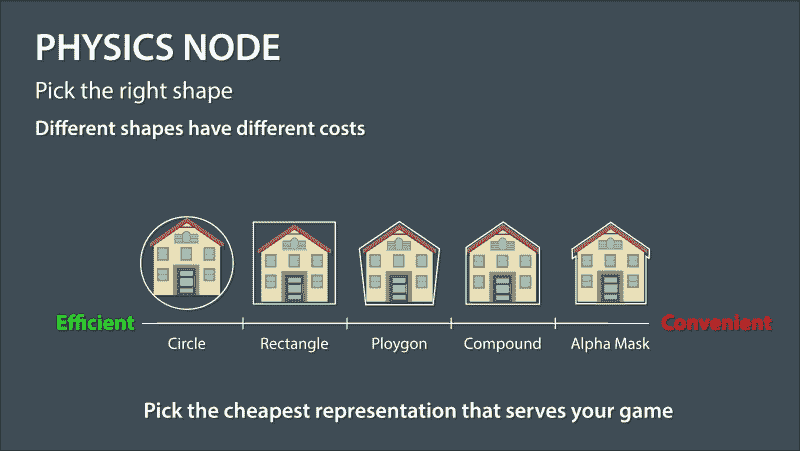
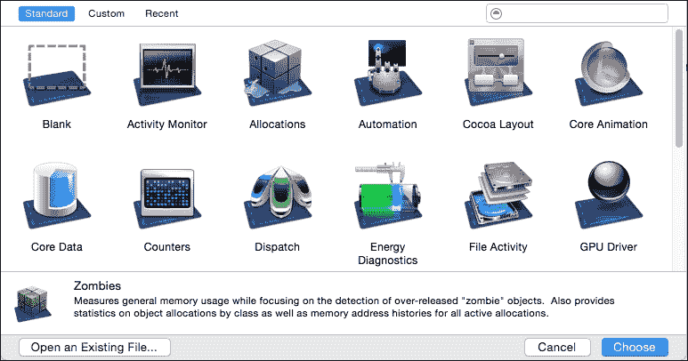
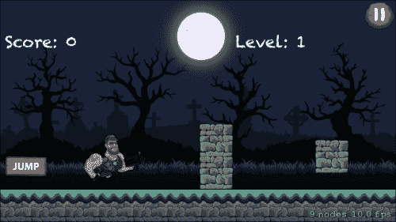
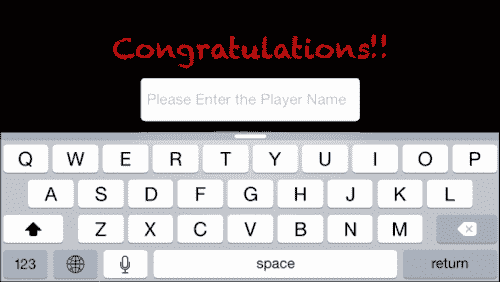
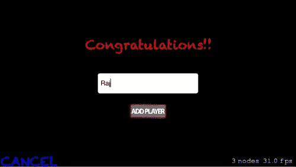
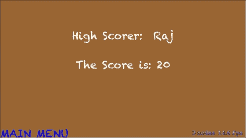
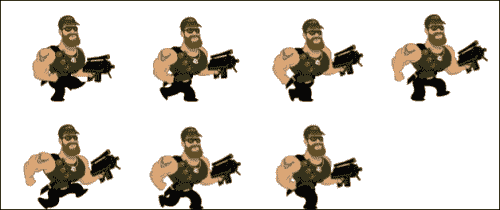

# 第九章. 性能提升与附加功能

在上一章中，我们讨论了在我们的游戏中添加多个级别；在大多数游戏中，添加多个级别是一个正常的功能。我们还添加了使用级别标签显示游戏当前级别的功能。除此之外，我们还添加了暂停按钮和从主菜单访问节点菜单场景的按钮。

本章是本书中最重要的章节之一；在这里，我们将讨论性能提升的技巧和窍门。除此之外，我们还将为我们的游戏添加一些非常重要的功能。这些功能包括：

+   评分系统

+   声音

+   玩家的运行动画

声音是游戏的一个基本组成部分；它极大地增强了玩家的整体游戏体验。评分系统帮助玩家衡量其随时间的变化表现。运行纹理在游戏中产生良好的动画效果，大大增加了游戏体验。我们将在这章中添加所有这些功能，并讨论一些 Sprite Kit 游戏的重要性能提升技术。

# 性能提升

运行游戏需要大量使用设备的内存和其他资源。这导致电池加速耗尽。我们需要优化游戏对设备资源的利用。游戏需要更高的帧率，因此由于对设备资源的过度使用，电池耗尽会更多。一个优化的游戏将导致设备资源的有效使用，从而减少电池耗尽。以下是优化游戏效率的一些最佳实践：

+   在场景中系统化游戏内容

+   提高绘图性能

+   使用`SKAction`和约束提高性能

+   提高物理性能

+   提高形状的性能

+   提高效果性能

+   提高光照

现在我们将详细讨论之前列出的每种方法。

## 在场景中系统化游戏内容

如我们所知，场景是 Sprite Kit 游戏中基本的构建块。根据需求，一个游戏可以包含多个场景。一个场景可以包含多个节点，节点可以执行特定的动作。我们清楚地了解如何创建场景、节点以及节点的动作。具有挑战性的任务是设计游戏场景和转换，以便不会降低游戏性能。

应当记住的一件事是，场景在传统 iOS 应用中与故事板不同，它们没有默认的行为。相反，我们为各自的场景定义和实现行为，这可能包括以下内容：

+   何时创建新的场景

+   定义场景的内容

+   定义场景间转换应何时发生

+   定义转换的视觉效果

+   定义数据如何从一个场景传输到另一个场景

## 通过预加载纹理来提高性能

这是提高游戏性能最强大的方法之一。Sprite Kit 提供了两种相同的方法：

+   `func preloadWithCompletionHandler(completionHandler: () -> Void)`: 此方法使用一个负责将图集纹理加载到内存中的函数，该函数需要参数`completionHandler`，在任务完成后调用。

+   `func preloadTextureAtlases(textureAtlases: [AnyObject]!,`

+   `withCompletionHandler completionHandler: (() -> Void)!)`: 此方法将多个图集的纹理加载到内存中，并在任务完成后调用完成处理程序。完成处理程序期望两个参数：一个是`textureAtlases`，它是一个`SKTextureAtlas`对象的数组，另一个参数是`completionHandler`，在图集纹理加载后调用。

使用纹理图集可以减少绘制调用，从而减少对设备资源的使用。到目前为止，我们已经讨论了一些游戏性能提升的重要技术。现在，是时候讨论一些游戏的基本元素了，例如得分系统、声音等。

## 提高绘制性能

构建节点树的最大部分是组织需要绘制的图形内容。我们应该注意先绘制什么，最后绘制什么。有两个因素会影响绘制性能：

+   绘制顺序，即图形提交给引擎的顺序

+   通过资源共享来完成绘制

关于绘制顺序，你可以设置节点树的兄弟顺序以减少通过忽略兄弟顺序提交的绘制次数：

```swift
View.ignoreSiblingOrder = true
```

你可以使用深度顺序作为规则将它们一起批处理，并使用纹理图集进一步优化批处理。

确保开启性能指标，如**每秒帧数**（**FPS**）、节点计数、绘制计数和四边形计数。这些指标将帮助你确定游戏的性能。以下是我们可以使用来查看性能指标的代码：

```swift
View.showsFPS = true          // #1

View.showsNodeCount = true    //#2

View.showsDrawCount = true    //#3

View.showsQuadCount = true    //#4
```

关于前面的代码块，让我们讨论每个指标：

+   在代码`#1`中，我们显示游戏场景中每秒的帧数。游戏的最佳帧率是`60`。在游戏中显示帧率，可以轻松测量帧率。

+   在代码`#2`中，我们显示场景中`SKNodes`的数量。场景中的节点越少，性能越好。一个游戏需要节点来拥有游戏中的元素，但我们可以一起测量帧率和节点，以确保有多少节点产生了最佳的帧率。

+   在代码`#3`中，我们显示场景计数的批次数，即场景将要绘制的批次数。你的游戏绘制的次数越少，性能越好。

+   在代码`#4`中，我们显示了四边形数量。Sprite Kit 将节点树转换为渲染传递。每个渲染传递都使用四边形进行渲染。我们拥有的四边形数量越少，游戏性能越好。

## 使用 SKActions 和约束提高性能

提高性能的主要解决方案是构建一次动作并尽可能多地使用它。尽量避免在`update()`方法中使用自定义动画代码。通过使用`SKAction`和`SKConstraint`类，你可以优化游戏中的动画效果。

## 提高物理性能

每当`SKScene`计算动画的新帧时，它会模拟节点树连接的物理体上的力和碰撞效果。它为每个物理体计算最终的位置、方向和速度。

关于提高游戏性能，动态对象比静态对象成本更高，因此如果可能的话，我们可以设置以下属性，以便性能逐渐提高。

一些指导原则如下：

+   你应该使用碰撞掩码来分组对象以提高性能

+   你可以使用力场来代替游戏逻辑

+   如果需要，你应该打开场调试绘制

在将指定的边界分配给物理体之前，你必须考虑你对象的最有效形状。边界的形状定义了设备需要执行的计算/操作的数量，这影响了效率。**圆形**是最便宜的，其次是**矩形**、**多边形**、**复合体**和**Alpha 掩码**，计算成本按顺序增加。



不同形状边界的计算成本比例

## 提高形状的性能

对象节点的形状在游戏性能方面起着重要作用。如果节点需要较少的计算，性能将会提高。

与物理性能主题中描述的相同，你可以提高形状节点的效率成本。在性能成本方面，多边形是最便宜的，其次是曲线、线性描边、描边曲线和填充曲线，计算成本按顺序增加。


形状节点的性能成本比例

## 提高效果的性能

关于 Sprite Kit 中的效果，`SKEffectNodes`成本较高，因此请尽量少用。它在其屏幕外进行渲染并将结果传输到帧缓冲区，这降低了效率。当不需要屏幕外传递时，最好使用`SKShaders`。

如果效果变化不大，最好通过使用`shouldRasterize`属性来光栅化这些效果。如果`shouldRasterize`属性为`true`，效果节点将缓存图像以供未来帧使用。

## 提高光照性能

照明是按像素计算的，因此计算成本与被照亮的像素数量成正比。环境光不会消耗计算能力。阴影的计算成本与灯光的数量成正比，因此建议保持阴影数量较低。

# 使用仪器测量性能

Instruments 是苹果在 Xcode 中提供的性能测量和测试工具，用于代码的跟踪和剖析。Instruments 有助于分析代码的性能。有许多仪器可用于检查性能问题、内存泄漏或其他问题。

一旦识别出任何问题，就很容易纠正。您还可以查看我们的游戏缓存了多少，并根据这一点对游戏中的资产做出决定。

您可以通过导航到**Xcode** | **打开开发者工具** | **Instruments**来访问仪器。然后，您可以选择合适的仪器进行操作。在开发过程的初期阶段查看分析会更好，这样您可以轻松地了解代码中的哪些包含导致了错误。

Instruments 为您提供一个跟踪模板列表。跟踪模板是一组预配置的仪器。让我们详细讨论每个跟踪模板：



+   **活动监视器**：**活动监视器**用于监控 CPU、内存、磁盘和网络使用统计的进程。

+   **分配**：分配工具用于跟踪进程的匿名虚拟内存和堆。

    此工具还提供了对象的类名以及可选的保留/释放历史记录。

+   **自动化**：自动化模板执行一个脚本，该脚本模拟 iOS 应用程序的 UI 交互，该应用程序从仪器启动。

+   **Cocoa 布局**：**Cocoa 布局**观察`NSLayoutConstraint`对象的变化，以帮助确定何时以及在哪里布局约束消失了。

+   **核心动画**：**核心动画**仪器通过时间剖析测量应用程序的图形性能以及进程的 CPU 使用情况。

+   **核心数据**：此仪器模板跟踪**核心数据**文件系统活动，包括检索、缓存未命中和保存的缓存。这在第八章 *处理多个场景和级别*中已有讨论。

+   **计数器**：**计数器**将收集**性能监视器计数器**（**PMC**）事件，使用基于时间或事件采样的方法。

+   **调度**：此模板将监控调度队列的活动，并记录块调用及其持续时间。

+   **能源诊断**：此模板将提供有关能源使用以及主要设备组件的基本开/关状态的诊断信息。

+   **文件活动**：这将监控文件和目录活动，包括文件打开/关闭调用、文件权限修改、目录创建、文件移动等。

+   **GPU 驱动程序**：此模板用于测量 GPU 驱动程序统计信息，并且它还采样活动 CPU 使用情况。

+   **泄漏**：**泄漏**将测量一般内存使用情况；它定期扫描是否有对象被创建但没有被访问，并检测由此产生的内存损失。

+   **网络**：**网络**分析使用连接工具分析应用程序如何使用 TCP/IP 和 UDP/IP 连接。

+   **OpenGL ES 分析**：此模板测量和分析 OpenGL ES 活动，以检测 OpenGL ES 精度和性能问题。它还提供了解决这些问题的建议。

+   **突然终止**：**突然终止**用于分析目标进程的突然终止支持，报告文件系统访问和突然终止启用/禁用调用的跟踪。

+   **系统跟踪**：此工具提供系统信息，例如进程名称、生成的线程数、每个线程的 CPU 使用情况等。

+   **系统使用**：此模板用于记录通过工具启动的单个进程与文件、套接字和共享内存相关的 I/O 系统活动。

+   **时间分析器**：**时间分析器**用于执行低开销的时间采样，我们可以检查系统 CPU 上运行的过程的状态。分析是一种测量方法，通过分析会话的输出，你可以了解代码中哪些部分被使用得最多，并告诉你哪些代码部分可以改进。

+   **僵尸**：如果一个游戏删除了一个对象，但在稍后阶段试图访问该对象，它将使游戏崩溃。僵尸工具将删除的对象保持为已死亡状态，并在游戏调用时释放它，从而避免崩溃。这样，僵尸工具就指出了游戏可能崩溃的地方。调试器无法定位这种异常。

# 游戏中的评分系统

在游戏中添加评分或得分系统可以使游戏更有趣，更有趣。在游戏中拥有评分系统使玩家更容易衡量他们的表现，使用户的目标更加明确。

总是在主屏幕的某个位置显示分数是有意义的，这样玩家在玩游戏时可以查看分数。

## 在我们的平台游戏添加评分系统

在我们游戏添加评分系统的第一步，我们创建一个标签节点来向玩家显示分数。初始变量将为零。

### 创建分数标签

让我们在`GameScene`类的开头添加以下代码片段：

```swift
let scoreText = SKLabelNode(fontNamed: "Chalkduster")
    var score = 0
```

在前面的代码中，你正在创建一个`SKLabelNode`并将其分配给字体`Chalkduster`。与此相关，你还在初始化一个变量`score`，其值为零。

现在，让我们将上面创建的`ScoreText`标签设置为 0。我们还可以在`addScoreLabel()`方法中设置字体的大小和位置，并从`GameScene`的`didMoveToView()`中调用此方法：

```swift
func addScoreLabel()
    {
        self.scoreText.text = "Score: 0"
        self.scoreText.fontSize = 30
        self.scoreText.position = CGPointMake(CGRectGetMinX(self.frame) + scoreText.frame.width / 1.8  , CGRectGetMidY(self.frame) + scoreText.frame.height * 4.2)
        self.addChild(self.scoreText)
    }
```

前面的代码将定义分数文本为**分数：0**和字体大小为`30`。此外，我们还定义了`scoreText`的位置。

以下是实现**分数**标签后的游戏屏幕将看起来如何：



### 在需要时增加分数

在我们的游戏中定义何时增加分数非常重要。同样，这也应该在创建的`scoreText`标签中显示。

由于我们的*平台游戏*处理作为障碍物的方块，当玩家跳过一个方块时，最好奖励玩家分数。

在`blockrunner()`方法中添加以下代码行，条件是方块应该成功跨越玩家的**X**位置而不与他碰撞（第一个`else`条件）：

```swift
self.score = score + 10

self.scoreText.text = "Score: \(String(self.score))"
```

现在，为了保存最高分和用户的名字，我们将使用 iOS 提供的特殊功能，通过`NSUserDefaults`保存频繁需要的数据，如下所示：

```swift
self.highestScore = self.score
NSUserDefaults.standardUserDefaults().setObject(highestScore, forKey:"HighestScore")
NSUserDefaults.standardUserDefaults().setInteger(highestScore, forKey:"SCORE")
```

之前的代码需要在`if`语句`blockStatus.isRunning`的末尾之前添加。这段代码将成功增加分数。现在，是时候保存高分了。

### 保存高分

当用户得分高时，我们将添加一个弹出屏幕来保存高分。为了实现这一点，首先，我们必须创建一个新的场景，`ScoreList.swift`，并在玩家出局时调用此场景，即游戏结束时。

在我们的`didBeginContact()`方法中，我们有以下代码行：

```swift
self.player.runAction(SKAction.sequence(
[inOutActionWhenPlayerDied,
inOutActionWhenPlayerDied.reversedAction(),
upActionWhenPlayerDied,removeFromParent]),gotoMenuScreen)
```

将前面的行替换为以下行：

```swift
self.player.runAction(SKAction.sequence(
[inOutActionWhenPlayerDied,
inOutActionWhenPlayerDied.reversedAction(),
upActionWhenPlayerDied,removeFromParent]),
completion: gotoSavePlayerScreen)
```

新增的行在玩家死亡时添加了`ScoreList`场景。

现在，我们将创建一个名为`gotoSavePlayerScreen()`的新方法，以检查当前分数是否大于保存的分数。然后，应该调用`ScoreList`场景，否则调用主屏幕，即`MainMenu`场景。相应的代码如下：

```swift
func gotoSavePlayerScreen()
    {
        self.player.removeFromParent()

        println("The Saved Score Is:  \(savedScore)")
        println("The Highest Score Is:  \(highestScore)")

        if self.highestScore > savedScore
        {
            let transitionEffect = SKTransition.doorsCloseHorizontalWithDuration(1.5)
            highScorerListInstance = ScoreList
    (size: self.size) // , playbutton: "Play", background: "BG")
            highScorerListInstance!.anchorPoint = CGPoint(x: 0.5, y: 0.5)
            self.view?.presentScene(highScorerListInstance , transition:transitionEffect)
        }

        else if self.highestScore <= savedScore

        {
           gotoMenuScreen()
        }
}
```

我们已经实现了在游戏完成后打开场景的方法。现在，让我们构建`ScoreList`场景。

#### 创建保存高分的场景

让我们创建一个`ScoreList`场景来显示保存最高分的弹出窗口。

此外，还需要添加一个标签来恭喜用户。以下是为同一目的的代码：

```swift
func congratsUserAndSaveScorerName()
    {
         var congratsUserLabel = SKLabelNode(fontNamed: "Chalkduster")
        congratsUserLabel.fontColor = UIColor.redColor()
        congratsUserLabel.name = "CONGRATS"
        congratsUserLabel.color = UIColor.lightGrayColor()
        congratsUserLabel.text = "Congratulations!! "
        congratsUserLabel.position = CGPointMake(CGRectGetMidX(self.frame), CGRectGetMidY(self.frame) + congratsUserLabel.frame.height * 2)
        congratsUserLabel.zPosition = 3
        self.addChild(congratsUserLabel)
    }
```

如果用户不想用名字保存分数，我们需要添加一个**取消**按钮。请从`ScoreList.swift`的`didMoveToView()`方法中添加以下代码，其中**取消**按钮将带您进入`MenuScene`：

```swift
func addCancelBtn()
    {
        var Cancelbutton = SKLabelNode(fontNamed: FontFile)
        Cancelbutton.fontColor = UIColor.blueColor()
        Cancelbutton.name = "CANCEL"
        Cancelbutton.text = "CANCEL"
        Cancelbutton.position = CGPointMake(CGRectGetMinX(self.frame) + Cancelbutton.frame.width/2 , CGRectGetMinY(self.frame))
        Cancelbutton.zPosition = 3
        self.addChild(Cancelbutton)
    }
func gotoMenuScreen()
    {
        self.playerNameTextField.removeFromSuperview()
        let transitionEffect = SKTransition.flipHorizontalWithDuration(1.0)
        menuSceneInstance = MenuScene(size: self.size , playbutton: "Play", background: "BG")
        menuSceneInstance!.anchorPoint = CGPoint(x: 0.5, y: 0.5)
        self.view?.presentScene(menuSceneInstance , transition:transitionEffect)

    }
```

前面的代码在蓝色中添加了一个取消按钮，点击此按钮将玩家带到`MenuScene`。现在，为了处理**取消**按钮的点击，请在`ScoreList.swift`的`touchesBegan()`方法中的触摸循环内添加以下代码：

```swift
if node.name == "CANCEL"
{
     gotoMenuScreen()

}
```

成绩列表已经成功创建。我们也为用户添加了一个取消按钮。现在，是时候添加一个文本框，玩家将在其中添加他的/她的名称。

#### 添加文本框以保存玩家名称

我们需要显示一个文本框供用户输入要保存的玩家名称。添加以下代码行以在框架内插入一个文本字段：

```swift
let playerNameTextField = UITextField(frame: CGRectMake(50, 150, 250, 50))
```

以下方法将创建要使用的文本框：

```swift
func addPlayerNameTextBox()
    {
        playerNameTextField.center = CGPointMake(self.size.width / 2, self.size.height / 2)
        playerNameTextField.backgroundColor = UIColor.whiteColor()
        playerNameTextField.placeholder = "Enter Your Name"
        playerNameTextField.borderStyle = UITextBorderStyle.RoundedRect
        self.view?.addSubview(playerNameTextField)
    }
```

现在，让我们添加一个`UITextFieldDelegate`的`textFieldShouldReturn`方法，以便在文本框中输入玩家名称并点击回车键时使键盘消失：

```swift
func textFieldShouldReturn(playerNameTextField: UITextField) -> Bool
    {
        println("Text Field Return Key")
        playerNameTextField.resignFirstResponder()
        return true

    }
```

现在，在`Scorelist`类开始时添加`UITextFieldDelegate`代理。这个代理使键盘出现。

前面的代码片段将在按下回车键后成功使键盘消失。现在，下一个任务是将添加的名称保存。



这是键盘打开时的屏幕外观

#### 保存高分玩家的玩家名称

我们将命名按钮为**添加玩家**。这个按钮将使用户输入的名称与高分一起保存。首先，创建以下节点，命名为`add-player`，并带有图像：

```swift
let addPlayerButton = SKSpriteNode(imageNamed:"add-player")
```

添加以下代码方法来设置**添加玩家**按钮的属性。同时，确保从`didmoveToView()`方法中调用相同的代码：

```swift
func addScoresSceneBtn()
    {
        addPlayerButton.name = "SCORES"
        self.addPlayerButton.position = CGPointMake(CGRectGetMidX(self.frame),CGRectGetMinY(self.frame)/3)
        self.addChild(self.addPlayerButton)
    }
declare the following variable before adding didMoveToView() method

var highestScorerName:String = String()
```

在`ScoreList.swift`的`touchesBegan()`方法中添加以下代码行，如前所述，在触摸循环中处理**添加玩家**按钮的点击：

```swift
if node.name == "SCORES"
            {
                if playerNameTextField.text.isEmpty
                {
                    playerNameTextField.placeholder = "Please Enter the Player Name"
                }
                else
                {
                    self.highestScorerName = self.playerNameTextField.text NSUserDefaults.standardUserDefaults().setObject(highestScorerName, forKey:"HighestScorerName")
                    NSUserDefaults.standardUserDefaults().synchronize()
                     gotoMenuScreen()
                }
            }
```

我们还添加了`gotoMenuScene()`来返回主菜单，正如我们所知。以下是它的代码：

```swift
func gotoMenuScreen()
    {
        self.playerNameTextField.removeFromSuperview()
        let transitionEffect = SKTransition.flipHorizontalWithDuration(1.0)
        menuSceneInstance = MenuScene(size: self.size , playbutton: "Play", background: "BG")
        menuSceneInstance!.anchorPoint = CGPoint(x: 0.5, y: 0.5)
self.view?.presentScene(menuSceneInstance , transition:transitionEffect)
    }
```

现在，`SceneList.swift`的工作已经完成。是时候开始处理高分榜了。以下截图显示了屏幕将如何显示：



### 创建高分榜

到目前为止，我们已经保存了获得高分玩家的名称，但我们还没有创建一个分数榜来向玩家显示高分。最好直接从主菜单访问分数榜，因为它使操作更方便。

在我们的游戏中，我们将创建一个高分菜单场景，在主菜单中有一个按钮可以访问此屏幕。

首先，创建一个名为`AddScoreScene.swift`的场景，以显示高分。

现在，创建一个名为`showHeightestScorerName()`的方法来显示得分最高玩家的名称，并从`AddScoreScene.swift`文件中的`didMoveToView()`方法中调用相同的方法：

```swift
var savedScorerName: String = String()
func showHeighestScorerName()
    {
if(NSUserDefaults.standardUserDefaults().objectForKey
("HighestScorerName")) == (nil)
        { savedScorerName = " "
        }
        else
        { savedScorerName = NSUserDefaults.standardUserDefaults().objectForKey
("HighestScorerName") as String
            println(savedScorerName)
        }
var highScorerNameLabel = SKLabelNode(fontNamed: "Chalkduster")
        highScorerNameLabel.fontColor = UIColor.blueColor()
        highScorerNameLabel.name = "HIGHESTSCORERNAME"
        highScorerNameLabel.color = UIColor.lightGrayColor()
        highScorerNameLabel.text = "High Scorer :  \(savedScorerName)"
        highScorerNameLabel.position = CGPointMake(CGRectGetMidX(self.frame), CGRectGetMidY(self.frame) + (highScorerNameLabel.frame.height * 2))
        highScorerNameLabel.zPosition = 3
        self.addChild(highScorerNameLabel)
    }
```

我们已经显示了得分最高的玩家的名称，现在该显示玩家创下的最高分了。为此，创建`showHeighestScores()`方法，并从`AddScoreScene.swift`文件中的`didMoveToView()`方法中调用相同的方法。以下是在`showHeighestScores()`方法中要添加的代码：

```swift
    func showHeighestScores()
    {
if(NSUserDefaults.standardUserDefaults().objectForKey
("HighestScore")) == (nil)
        {
            savedScore = 0
        }
        else
        {
            savedScore = NSUserDefaults.standardUserDefaults().objectForKey("HighestScore") as! Int
            println(savedScore)
        }

        var highScoreLabel = SKLabelNode(fontNamed: "Chalkduster")
        highScoreLabel.fontColor = UIColor.blueColor()
        highScoreLabel.name = "HIGHESTSCORE"
        highScoreLabel.color = UIColor.lightGrayColor()
        highScoreLabel.text = "The Score is: \(savedScore)"
        highScoreLabel.position = CGPointMake(CGRectGetMidX(self.frame), CGRectGetMidY(self.frame))
        highScoreLabel.zPosition = 3
        self.addChild(highScoreLabel)
    }
```

现在，是时候添加一个返回按钮了，它将玩家返回主菜单。将以下代码添加以实现返回按钮的功能：

```swift
func addBackBtn()
    {
        var mainMenubutton = SKLabelNode(fontNamed: FontFile)
        mainMenubutton.fontColor = UIColor.blueColor()
        mainMenubutton.name = "MAIN MENU"
        mainMenubutton.text = "MAIN MENU"
        mainMenubutton.position = CGPointMake(CGRectGetMinX(self.frame) + mainMenubutton.frame.width/2 , CGRectGetMinY(self.frame))
        mainMenubutton.zPosition = 3
        self.addChild(mainMenubutton)
    }

var menuSceneInstance : MenuScene?
 func goToMenuScene()
    {
        let transitionEffect = SKTransition.flipHorizontalWithDuration(1.0)
        menuSceneInstance = MenuScene(size: self.size , playbutton: "Play", background: "BG")
        menuSceneInstance!.anchorPoint = CGPoint(x: 0.5, y: 0.5)
        self.view?.presentScene(menuSceneInstance , transition:transitionEffect)
    }
```

前面的代码已添加返回按钮功能；现在我们必须在`AddScore.swift`中的`touchesBegan()`方法中处理按钮的触摸/点击，就像我们之前做的那样。在`touchesBegan()`方法中添加以下代码：

```swift
for touch: AnyObject in touches
        {
            let location = touch.locationInNode(self)
            let node = self.nodeAtPoint(location)
            if node.name == "MAIN MENU"
            {
                goToMenuScene()
            }
        }
```

下面是高分榜将呈现的样子：



最后，高分屏幕也完成了。这标志着我们在*平台游戏（Platformer）*中集成计分系统的完成。

# 将声音添加到游戏中

一款游戏只有配上不同的音乐和声音效果才能完整。游戏中可以有背景音乐，以及在每个动作中的声音效果，例如，当用户点击时，我们可以播放一个声音，稍后，当玩家击中障碍物或主游戏中的其他元素时，我们可以播放另一个声音。我们还可以在不同的关卡中使用不同的音乐。声音效果在增强整体游戏体验中起着至关重要的作用，因为它们让用户沉浸在全面的游戏体验中。

## 将声音添加到 Sprite Kit 游戏中

在 Sprite Kit 游戏中添加声音效果有两种方式：

+   使用`SKActions`

+   使用`AVFoundation`框架

与使用`AVFoundation`框架相比，使用`SKActions`添加声音效果效率不高。`SKActions`有很多限制，例如，在游戏过程中无法暂停或播放声音等。因此，建议使用`AVFoundation`。

## 将声音添加到我们的平台游戏（Platformer）中

让我们在我们的*平台游戏（Platformer）*中添加声音效果。我们将使用`AVFoundation`框架来添加声音。

1.  首先，通过点击你的项目添加框架，然后，在**通用**类别下，转到**链接的框架和库**部分，并添加`AVFoundation`框架。

1.  现在，将以下代码添加到将`AVFoundation`框架导入到我们的`GameScene.swift`文件中：

    ```swift
    Import AVFoundation
    ```

1.  将`AVAudioPlayerDelegate`代理添加到`GameScene`类中，以使用`AVAudioPlayer`的特定属性和方法。

1.  现在，为我们的`GameScene`文件创建一个`AVAudioPlayer`实例：

    ```swift
    var avPlayer:AVAudioPlayer!
    ```

1.  我们将两个声音文件`game_music.mp3`和`Strong_Punch-Mike_Koenig-574430706.wav`添加到我们的项目中（WAV 文件格式适合短声音，而 MP3 格式适合较长时间的声音），并使用两个字符串变量指定它们的名称，如下所示：

    ```swift
    let backgroundSound = "game_music"
        let gameOutSound = "Strong_Punch-Mike_Koenig-574430706"
    ```

1.  将以下代码方法添加到使`AVAudioPlayer`获取指定的音频文件并播放相同的代码中：

    ```swift
    func readFileIntoAVPlayer(soundName:String, ext:String)
        {
            var error: NSError?
            let fileURL:NSURL = NSBundle.mainBundle().URLForResource(soundName, withExtension: ext)!

            // the player must be a field. Otherwise it will be released before playing starts.
            self.avPlayer = AVAudioPlayer(contentsOfURL: fileURL, error: &error)
            if avPlayer == nil
            {
                if let e = error {
                    println(e.localizedDescription)
                }
            }
            if avPlayer.playing
            {
                avPlayer.stop()
            }

            println("playing \(fileURL)")
            avPlayer.delegate = self
            avPlayer.prepareToPlay()
            avPlayer.volume = 1.0
            avPlayer.play()

        }
    ```

    在前面的代码中，我们传递了声音名称和文件格式作为两个参数。然后该方法将播放声音文件。如果用户在设备上播放声音时开始游戏，此代码将停止之前播放的声音，然后开始游戏声音。

1.  由于我们希望背景音乐始终播放，我们将调用 `readFileIntoAVPlayer()` 方法并传递 `backgroundSound` 和 `mp3` 作为参数。在 `GameScene.swift` 的 `didMoveToView()` 方法开头添加此方法。以下是要添加的行：

    ```swift
    readFileIntoAVPlayer(backgroundSound, ext: "mp3")
    ```

    上述行将在游戏开始时播放背景音乐。

1.  我们还为玩家死亡时添加了另一个声音文件。现在，是时候添加当玩家死亡时播放声音效果的代码了。在 `GameScene.swift` 的 `didBeginContact()` 方法开头添加以下代码行：

    ```swift
    avPlayer.stop()

    readFileIntoAVPlayer(gameOutSound, ext: "wav")
    ```

在前面的代码中，我们通过调用与之前相同的方法但使用不同的参数来停止玩家中的背景音乐，并通过调用相同的方法为玩家的死亡播放新的声音效果。

# 使用 SKTexture 的动画帧

到目前为止，我们在游戏中使用了静态图像，但如果你看的话，大多数游戏都有动画效果，如玩家跑步效果、汽车跑步效果或任何其他增强游戏玩法并创造更好体验的效果。

## 在平台游戏玩家中添加运行动作纹理

我们之前添加了一个名为 `idle.atlas` 的图像图集，其中包含玩家站立位置的相似图像。

现在，我们将为玩家添加跑步纹理图像，这将使玩家看起来像在 `GameScene` 中跑步。

首先，添加一个名为 `bro5_run.atlas` 的纹理图像集，这是我们提供的。图像图集包含七组图像，有时也被称为精灵表。在我们的案例中，它将被称为玩家跑步精灵表。这些图像组将按照快速的时间速率在纹理图集中依次运行。

现在，让我们为玩家分配纹理图像。在 `didMoveToView()` 方法的开头添加以下代码行：

```swift
player = SKSpriteNode(texture:atlasForPlayerRun.textureNamed("bro5_run0001.png"))
```

在下一步中，我们将添加一个方法来为 `atlasForPlayerRun.atlas` 的不同纹理创建一个 `SKAction`。通过创建一个 `runForwardTexture()` 方法并在 `didMoveToView()` 中调用它来实现这一点。确保在添加玩家纹理图像后执行此操作：

```swift
func runForwardTexture()
    {
        let hero_run_anim = SKAction.animateWithTextures([

            atlasForPlayerRun.textureNamed("bro5_run0002.png"),
            atlasForPlayerRun.textureNamed("bro5_run0002.png"),
            atlasForPlayerRun.textureNamed("bro5_run0003.png"),
            atlasForPlayerRun.textureNamed("bro5_run0004.png"),
            atlasForPlayerRun.textureNamed("bro5_run0005.png"),
            atlasForPlayerRun.textureNamed("bro5_run0006.png"),
            atlasForPlayerRun.textureNamed("bro5_run0007.png")
            ], timePerFrame: 0.06)

        let run = SKAction.repeatActionForever(hero_run_anim)

        player.runAction(run, withKey: "running")

    }
```

上述代码已成功实现了玩家的跑步动画。以下截图显示了精灵表的外观：



玩家跑步动画的纹理图集

# 摘要

在本章中，我们介绍了一些游戏的重要方面，包括阅读关于性能改进的内容。此外，您可以使用 Xcode 提供的性能测量工具来提高您游戏的表现。我们还集成了得分系统、音效和玩家跑步动画到我们的平台游戏中。

在本书的下一章和最后一章中，我们将讨论我们*平台游戏*的每个元素，深入探讨苹果提供的游戏中心，并讨论苹果带来的 iOS 9 的最新增补。
