# 第十章。回顾我们的游戏以及更多关于 iOS 9 的内容

首先，恭喜您克服了与游戏开发相关的所有障碍，并成功进入最后一章。现在您已经具备了独立开发 2D 游戏的能力，使用 Sprite Kit 游戏引擎。在前一章中，我们了解了性能提升，并在我们的游戏中添加了一些额外的功能，例如得分系统、声音和玩家跑步动画。

在本章中，我们将通过一些最后的润色来完善游戏，并讨论那些使您的游戏变得超级酷的强大奖励物品。我们还将了解如何集成游戏中心，以充分利用我们的游戏开发经验！

# 我们平台游戏开发过程回顾

让我们通过讨论构建的每个场景来回顾我们*平台游戏*的整个开发过程，从主菜单开始：

+   **主菜单屏幕**：这是我们开始游戏后看到的第一个屏幕。这个屏幕上有四个按钮。在左上角，您会看到一个**得分菜单**按钮，点击它将带您到高分排行榜。在右上角，有一个名为**节点菜单**的按钮，点击它将带您到节点菜单屏幕。在左下角，有一个名为**阴影效果**的按钮，点击它将显示阴影效果。最后，在屏幕中央是**播放**按钮。点击这个按钮，您将进入游戏屏幕。

+   **得分菜单屏幕**：这个屏幕是高分排行榜。您可以在屏幕上看到高分者的姓名和分数。屏幕左下角是**主菜单**按钮，点击它将带您回到主菜单。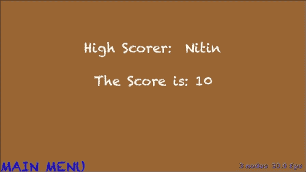

+   **节点菜单屏幕**：这个屏幕展示了各种节点的示例。您可以看到五个不同的按钮，分别称为**SKCropNode**、**SKLightNode**、**SKEmitterNode**、**SKShapeNode**和**SKVideoNode**。除了这五个按钮外，还有一个**返回**按钮，可以带您回到主菜单屏幕。每个节点按钮都显示与按钮名称相对应的示例。

+   **SKCropNode 屏幕**：这个屏幕展示了`SKCropNode`的示例。您可以看到在这个屏幕上对节点进行了裁剪。此外，还有一个**返回**按钮，可以带您回到节点菜单屏幕。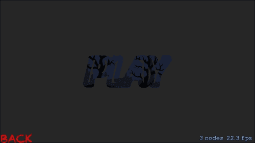

+   **SKLightNode 屏幕**：这个屏幕展示了`SKLightNode`的示例。您可以看到屏幕中央有一个灯光，您可以拖动它来查看在图像背后产生的阴影效果的变化。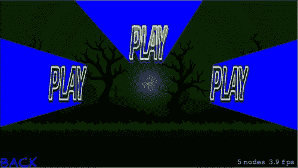

+   **SKEmitterNode 屏幕**：这个屏幕展示了`SKEmitterNode`的一个示例。你可以在屏幕上看到发射的粒子，并且随着这些粒子的定期创建或销毁，你还可以注意到屏幕上节点数量和**fps**的变化。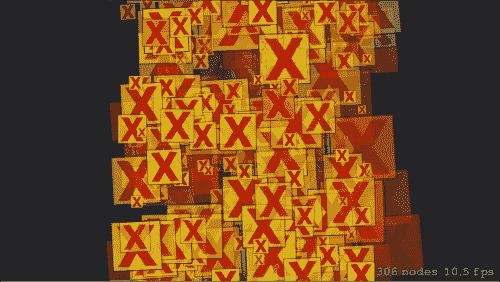

+   **SKShapeNode 屏幕**：这个屏幕展示了`SKShapeNode`的一个示例。你可以在屏幕上看到一个形状，并且如之前设置的那样，通过按屏幕上的**返回**按钮，你可以回到上一个节点菜单屏幕。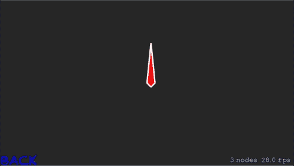

+   **SKVideoNode 屏幕**：这个屏幕展示了**SKVideoNode**的一个示例。你可以在屏幕中央看到一个视频，当你点击屏幕时，它将开始播放。你可以按**返回**按钮回到上一个屏幕。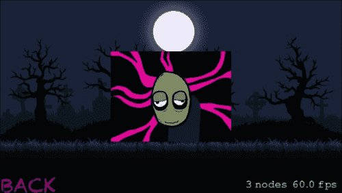

+   **阴影效果屏幕**：这个屏幕展示了阴影效果。你可以在屏幕中间看到阴影效果运行，并且像发射节点屏幕一样，你可以注意到这个屏幕的**fps**因为阴影效果而发生变化。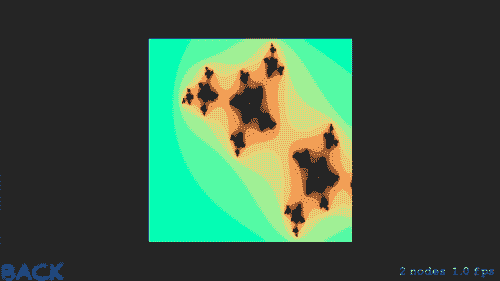

+   **游戏屏幕**：这是带有**跳跃**和暂停按钮的游戏屏幕。如果玩家碰到任何障碍物，游戏将终止，并弹出得分列表屏幕。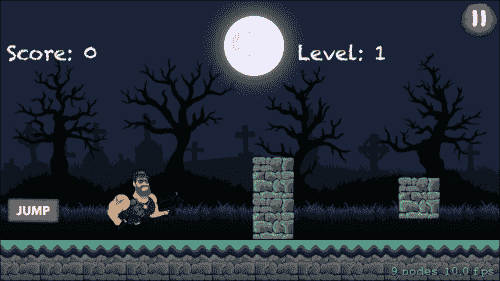

+   **得分列表屏幕**：游戏结束后，将显示这个屏幕。它有一个**恭喜**的提示和一个用于输入玩家名字的文本框。一旦你添加了玩家的名字，你可以点击**添加玩家**按钮来保存玩家的名字。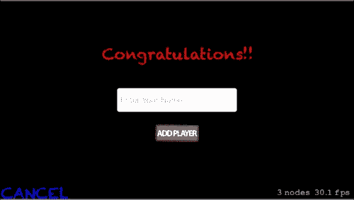

前面的几点简要描述了每个屏幕的功能以及每个屏幕上存在的元素。

# 进一步开发平台游戏

到目前为止，我们已经研究了 Sprite Kit 为游戏开发提供的每个基本方面。我们甚至集成了得分系统、音效和跑步动画来增强游戏体验。然而，仍有改进的空间；你可以尝试各种效果和功能，或者只是增强当前的功能，使你的游戏更加有趣。以下是一些你可以尝试的想法：

+   **障碍物**：目前，我们只有两种类型的障碍物；你可以努力在游戏中添加更多障碍物，使游戏玩法更加刺激。

+   **等级**：目前，游戏中我们只有三个等级，但随着等级的提升，你可以努力添加更多等级，使游戏更具挑战性。

+   **额外生命**：如果玩家碰到障碍物，玩家就会死亡；你可以努力给玩家增加额外生命，从而增加游戏时间。

+   **加分**：另一个想法是在玩家击中特殊道具时添加一些加分。当玩家击中这个加分物品时，你可以额外增加 100 或 200 分。

+   **声音**：我们的游戏目前有两个音效：一个是背景音，另一个是玩家死亡音。你可以在游戏中添加更多声音，例如菜单和游戏玩法中的不同音乐。除此之外，你还可以在节点菜单屏幕等地方使用单独的音乐。

这些想法只是开始；你可以在游戏中应用大量的创意，使其成为下一个超级热门的游戏标题。

# 游戏中心简介

iOS 和 OS X 平台上的游戏可以利用苹果的社交游戏网络，即游戏中心。游戏玩家可以在排行榜上比较分数，跟踪成就，邀请朋友，或通过自动匹配开始多人游戏。游戏中心是游戏套件的一部分，除了游戏中心外，还有两个其他功能。

游戏中心允许设备连接到游戏中心服务并交换信息。游戏中心还确保将信息添加到排行榜和成就中。一个人还可以使用游戏中心服务玩多人游戏。

## 游戏中心在游戏中的优势

游戏中心处理用户认证、朋友、排行榜、成就、挑战、多人游戏、回合制游戏和邀请。从某种意义上说，可以说游戏中心为我们提供了与社交互动相关的服务器服务；类似于其网络系统。使用游戏中心的一些优点包括：

+   **无需服务器端烦恼**：使用游戏中心，你不必担心设置自己的服务器。你可以使用游戏中心的服务器来完成社交游戏中所需的大部分任务。

+   **用户认证**：游戏中心还帮助进行用户认证，因此你不必担心重复的 ID 或其他类似问题。

+   **朋友**：你可以和朋友玩游戏；玩家可以通过别名与其他玩家互动。玩家还可以设置状态，以及将其他玩家标记为朋友。

+   **多人游戏**：你可以通过游戏中心玩多人游戏。玩家可以邀请朋友或连接到游戏中心网络中的匿名玩家。

+   **回合制游戏**：使用此功能，你可以拥有一个回合制网络基础设施。比赛在没有所有玩家同时连接到游戏中心的情况下进行；玩家通过回合制方法相互对战。

+   **排行榜**：这允许玩家将游戏分数存储在游戏中心的排行榜上。每个游戏都将有一个本地和网络排行榜，你可以与本地和全球玩家比较分数。

+   **成就**：玩家可以在游戏中实现各种目标或成就，并通过解锁成就获得特殊奖励。

+   **挑战**：这允许玩家挑战其他玩家，并与其他玩家竞争分数或成就。

## 在游戏中集成游戏中心

在游戏中集成游戏中心并不难，在宏观层面上，包括两个步骤：

1.  第一，是在 Xcode 中集成我们游戏所需的所有游戏中心库的实现和集成。

1.  另一步是在 iTunes Connect 上注册应用程序，启用游戏中心支持，并设置游戏中所需的任何排行榜和成就。

要在 Sprite Kit 游戏中集成游戏中心，首先必须有一个 Apple ID，这样您就可以将游戏注册到 Apple。除了拥有 Apple ID 之外，还必须在代码和设计中做一些调整，以便成功地将游戏中心集成到您的游戏中。例如，您需要在游戏启动时进行游戏中心的登录（身份验证）；如果您希望在游戏中显示排行榜，最好在游戏中显示它们，等等。

现在，让我们更详细地讨论这两个步骤。

### 使用 Xcode

您必须执行一些活动，例如创建或集成 Apple ID，以便开发游戏并启用 Xcode 中的游戏中心。让我们看看这个过程：

1.  要添加 Apple ID，首先点击 Xcode 菜单中的**偏好设置**。**偏好设置**窗口将出现。在**偏好设置**窗口的顶部，将有各种标签页。点击**账户**标签页。

1.  现在，点击窗口的左下角，并点击带有**+**符号的按钮，以获取一个包含三个选项的小菜单。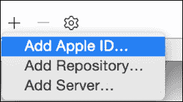

1.  在小菜单中的三个选项中，点击添加**Apple ID**选项。在弹出的窗口中，输入您的**Apple ID**和**密码**，然后点击**添加**按钮。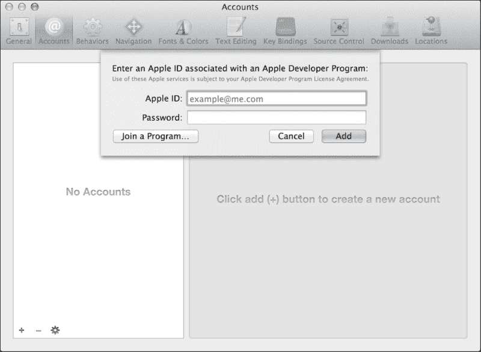

1.  现在，你将在“账户”标签页中看到你的**Apple ID**的摘要。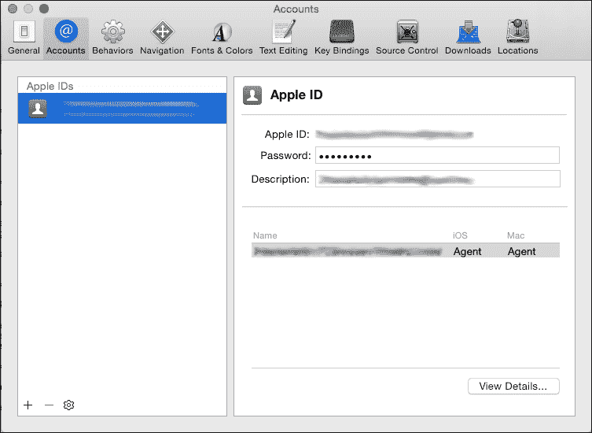

1.  现在，在项目导航器中，点击项目目标。

1.  在“通用”标签页下的“标识”部分中，将有一个名为**团队**的下拉菜单。如果您点击它，您将看到其中的开发者姓名。这将确认 Apple ID 已成功集成。然后，您必须点击它，以便 Xcode 使用您的开发者账户。Xcode 将自动创建 App ID。

1.  现在，点击紧挨着**通用**标签页的**能力**标签页。在所有提供的功能列表中，展开**游戏中心**。现在，在列表右侧打开开关。

游戏中心集成在游戏中的第一步已完成。我们已经启用了游戏中心，并在下一步中创建了一个用于 iTunes Connect 的 App ID。

### 与 iTunes Connect 一起工作

在这一步，我们将在 iTunes Connect 中为新的应用程序创建一个记录，然后我们将通过创建排行榜和成就来管理游戏中心部分。

1.  前往 iTunes Connect 并使用你的开发者凭据登录。然后点击所有选项中的**我的应用**选项。

1.  然后，在右上角，有一个**+**按钮用于添加新的 iOS 应用。

1.  当你点击**新建 iOS 应用**按钮时，你将得到一个弹出窗口，询问有关新 iOS 应用的信息。所需的信息包括**公司名称**、**名称**（应用名称）、**版本**、**主要语言**、**包标识符**和**SKU**。

    +   **公司名称**是公司或开发者的名称（之后不能更改）

    +   接下来是应用名称（**名称**），其长度不能超过 255 个字符

    +   下一个是应用中的**主要语言**，你可以从下拉菜单中选择

    +   下一个选项是**包标识符**，它是一个下拉菜单，并将包含 Xcode 中应用的包标识符

    +   之后，你可以在应用商店中显示的**版本号**中添加，并且它应该与 Xcode 中使用的版本号相匹配

    +   最后，**SKU**是应用的一个唯一标识符，在应用商店中不可见

    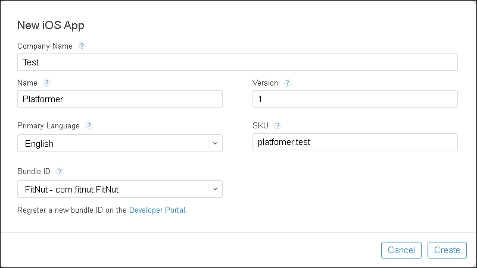

1.  在点击**新建 iOS 应用**弹出窗口中的**创建**后，你将进入一个页面，你需要填写如描述、定价、评分和其他发布相关选项的详细信息。在选项卡中，将有一个名为**游戏中心**的选项。点击该按钮即可进入**启用游戏中心**页面。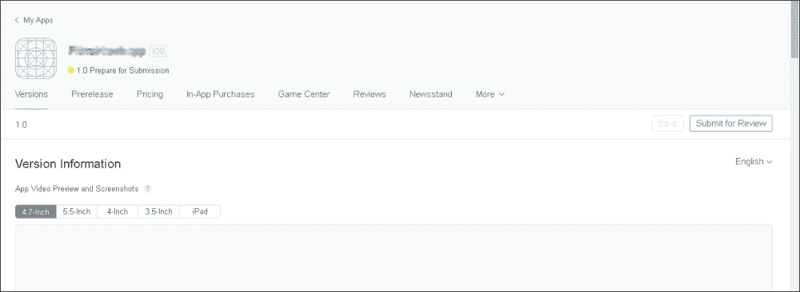

1.  由于你只有一个游戏，请点击**为单个游戏启用**，然后，游戏中心将为我们游戏启用。

1.  在下面，将有一个选项用于添加排行榜和成就；你可以根据自己的方便添加它们。

现在，我们已经完成了游戏中心集成的第二步，这涉及到与 iTunes Connect 一起工作。

你已经对在 Sprite Kit 游戏中集成游戏中心所需的具体操作有了宏观层面的了解。

# iOS 9 的新功能

苹果公司在 2015 年 6 月宣布了 iOS 9，它将在今年晚些时候正式发布。它建议为 Sprite Kit 框架添加一些新功能。以下列出了其中的一些：

+   **Metal 渲染支持**：Metal 提供了最低开销的图形处理单元（**GPU**）访问。这使得我们能够最大化我们应用和游戏的图形和计算能力。Metal 具有简化的 API、多线程支持以及预编译着色器，这些都有助于使我们的游戏或应用在性能和效率上更优越。

+   **改进的场景编辑器和新的动作编辑器**：Xcode 的最新版本现在拥有一个大幅改进的场景编辑器和一个新的动作编辑器。这将有助于在更短的时间内，通过更少的代码工作来设计 Xcode 中的场景。

+   **相机节点**：相机节点是一个`SKCameraNode`对象，有助于指定场景中的一个位置，从该位置可以渲染场景。如果我们将场景的相机属性设置为相机节点，那么场景将使用相机节点的属性进行渲染。这使得创建 2D 滚动游戏、带状滚动游戏等变得更加容易。场景中的相机节点确定场景坐标空间中应可见的部分。

+   **位置音频**：我们可以使用此功能添加空间音频效果。通过这个功能，音频效果可以跟踪场景中听者的位置。位置音频效果使用`SKAudioNode`对象。

这些功能是苹果为 Sprite Kit 框架推出的几个重要功能之一。

# 摘要

在本章中，我们讨论了我们的*平台游戏*及其各个方面，从本书的第一章到最新的一章。我们还讨论了如何在*平台游戏*中应用新的思想和尝试，并将其进一步扩展，使其成为苹果应用商店的下一个大热门。最后，我们研究了游戏中心，并简要讨论了其集成到 Sprite Kit 游戏中的情况。

话虽如此，我们正在为我们的 iOS 游戏开发书籍画上句号，带着这样的想法：一系列新游戏将席卷应用商店，这本书将对那些新平台游戏开发者产生巨大影响。我期待看到你们带来的令人兴奋的标题。祝你们好运！
