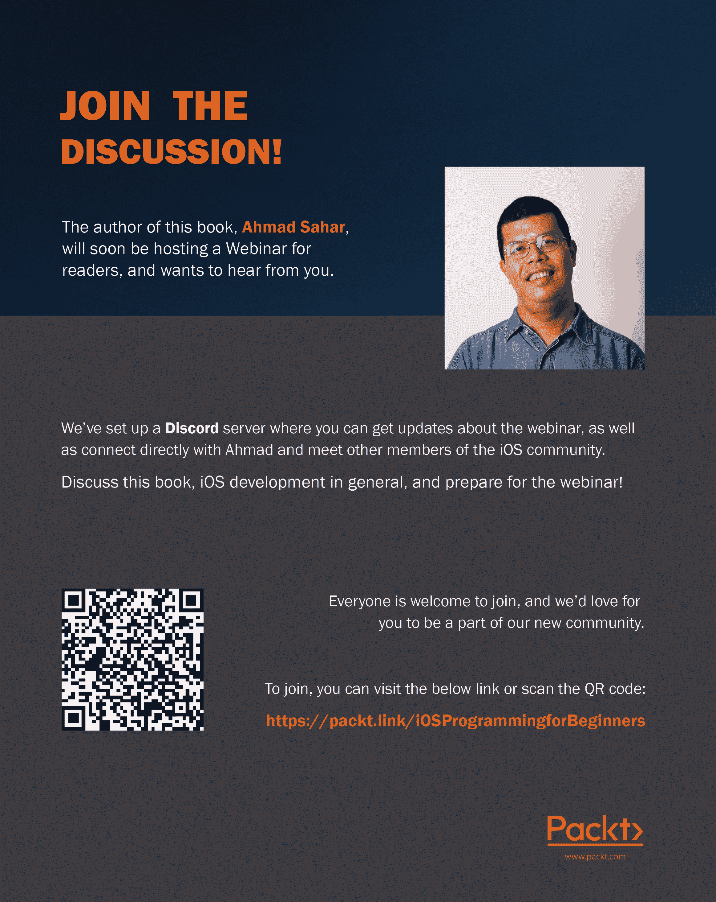

# 前言

欢迎来到 iOS 15 编程入门。本书是 iOS 编程入门系列的第六版，已全面更新以支持 iOS 15、macOS 12.0 Monterey 和 Xcode 13。

在本书中，您将构建一个名为*Let's Eat*的餐厅预订应用程序。您将从探索 Xcode 开始，这是苹果的编程环境，也称为其**集成开发环境**（**IDE**）。接下来，您将开始学习 Swift 的基础知识，这是 iOS 应用程序中使用的编程语言，并了解它是如何用于完成常见编程任务的。

在您掌握了 Swift 的坚实基础之后，您将开始创建*Let's Eat*应用程序的用户界面。在这个过程中，您将使用故事板，并通过 segues 连接您的应用程序场景。

在完成用户界面后，您将添加代码以实现应用程序的功能。为了在网格中显示您的数据，您将使用集合视图，而在列表中显示数据时，您将使用表格视图。您还将了解如何在地图上添加基本和自定义注释。您将看到如何使用 JSON 文件将实际餐厅数据导入到您的集合视图、表格视图和地图中。您将允许用户为特定餐厅添加评分、评论和照片，您将使用 Core Data 保存这些信息。

您现在有一个完整的应用程序，但如何添加最新的 iOS 15 功能呢？您将从修改您的应用程序以在 iPhone 和 iPad 上运行开始，并使其在 Mac 上也能运行。接下来，您将学习如何使用 SwiftUI 开发应用程序，这是一种为所有 Apple 平台开发应用程序的全新方法。之后，您将使用 Swift Concurrency 实现异步和并行编程，并使用 SharePlay 为您的应用程序实现共享用户体验。

最后，您将学习如何使用内部和外部测试人员测试您的应用程序，并将其提交到 App Store。

# 本书面向对象

如果您是一位对 iOS 和 Swift 编程语言完全陌生的经验丰富的开发者，那么这本书是为您准备的。然而，如果您是一位希望探索最新 iOS 15 功能的 iOS 开发者，您也会发现这本书很有用。

# 本书涵盖内容

*第一章**，熟悉 Xcode*，带您游览 Xcode，并讨论您在整个书中将使用的所有不同面板。

*第二章**，简单值和类型*，讨论 Swift 语言如何实现值和类型。

*第三章**，条件语句和可选类型*，展示了如何实现`if`和`switch`语句，以及如何实现可能或可能没有值的变量。

*第四章**，范围运算符和循环*，展示了如何在 Swift 中处理范围以及循环的不同实现方式。

*第五章**，集合类型*，涵盖了常见的集合类型，包括数组、字典和集合。

*第六章**，函数和闭包*，介绍了如何使用函数和闭包将指令组合在一起。

*第七章**，类、结构和枚举*，讨论了在 Swift 中如何表示包含状态和行为的复杂对象。

*第八章**，协议、扩展和错误处理*，讨论了创建复杂数据类型可以采用的协议，扩展现有类型的功能，以及如何在代码中处理错误。

*第九章**，设置用户界面*，涉及创建 *Let's Eat* 应用，添加图形资源，并设置用户将看到的初始屏幕。

*第十章**，构建用户界面*，介绍了为 *Let's Eat* 应用设置主屏幕。

*第十一章**，完成用户界面*，涵盖了为 *Let's Eat* 应用设置剩余屏幕。

*第十二章**，修改和配置单元格*，是关于在故事板中自定义表格和集合视图单元格。

*第十三章**，开始使用 MVC 和集合视图*，关注于使用集合视图以及如何使用它们来显示项目网格。

*第十四章**，将数据引入集合视图*，关注于将数据合并到集合视图中。

*第十五章**，开始使用表格视图*，教你如何使用表格视图，并深入探讨动态表格视图。

*第十六章**，开始使用 MapKit*，涉及使用 MapKit 向地图添加标注，你还将为你的地图创建自定义标注。

*第十七章**，开始使用 JSON 文件*，涉及学习如何使用数据管理器读取 JSON 文件并在你的应用中使用其中的数据。

*第十八章**，在静态表格视图中显示数据*，教你如何使用 segues 从一个视图控制器传递数据到另一个视图控制器以填充静态表格视图。

*第十九章**，开始使用自定义 UIControls*，探讨了如何创建你自己的自定义视图。

*第二十章**，开始使用相机和照片库*，讲述了如何使用设备的相机和照片库。

*第二十一章**，理解 Core Data*，涵盖了使用 Core Data 的基础知识以及如何保存评论和餐厅照片。

*第二十二章**，开始使用 Mac Catalyst*，处理修改您的应用以在 iPad 的大屏幕上运行良好，并使其在 Mac 上运行。

*第二十三章**，开始使用 SwiftUI*，介绍了如何使用苹果公司的新 SwiftUI 技术来构建应用。

*第二十四章**，开始使用 Swift Concurrency*，介绍了并行和异步编程的概念，并展示了您如何在您的应用中实现它。

*第二十五章**，开始使用 SharePlay*，展示了您如何通过使用 SharePlay 和 Group Activities 框架来实现用户的共享体验。

*第二十六章**，测试并将您的应用提交到 App Store*，关注了如何测试并将您的应用提交到 App Store。

# 要充分利用这本书

本书已完全修订以适应 iOS 15、macOS 12.0 Monterey、Xcode 13 和 Swift 5.5。本书的*第四部分*还涵盖了苹果在 2021 年 WWDC 上推出的最新技术，包括 Mac Catalyst、SwiftUI、Swift 并发和 SharePlay。

要完成本书中的所有练习，您将需要：

+   运行 macOS 11 Big Sur 或 macOS 12.0 Monterey 的 Mac 电脑

+   Xcode 13.0 或更高版本

要检查您的 Mac 是否支持 macOS 12.0 Big Sur，请参阅此链接：[`www.apple.com/macos/monterey/`](https://www.apple.com/macos/monterey/)。如果您的 Mac 支持，您可以通过系统偏好设置中的软件更新来更新 macOS。

要获取最新版本的 Xcode，您可以从 Mac App Store 下载。大多数练习可以在没有 Apple 开发者账户的情况下完成，并使用 iOS 模拟器。如果您希望在实际的 iOS 设备上测试您正在开发的应用，您将需要一个免费或付费的 Apple 开发者账户，以下章节需要付费的 Apple 开发者账户：

*第二十五章**，开始使用 SharePlay*

*第二十六章**，测试并将您的应用提交到 App Store*

在*第二十六章**，测试并将您的应用提交到 App Store*中，有关于如何测试并将您的应用提交到 App Store 的说明。

# 下载示例代码文件

您可以从 GitHub 下载本书的示例代码文件：[`github.com/PacktPublishing/iOS-15-Programming-for-Beginners-Sixth-Edition`](https://github.com/PacktPublishing/iOS-15-Programming-for-Beginners-Sixth-Edition)。如果代码有更新，它将在 GitHub 仓库中更新。

我们还有其他来自我们丰富图书和视频目录的代码包，可在[`github.com/PacktPublishing/`](https://github.com/PacktPublishing/)找到。查看它们吧！

# 代码实战

访问以下链接查看代码运行的视频：

[`bit.ly/3kdYBGc`](https://bit.ly/3kdYBGc)

# 下载彩色图像

我们还提供了一份包含本书中使用的截图/图表彩色图像的 PDF 文件。您可以从这里下载：[`bit.ly/3kdYBGc`](https://bit.ly/3kdYBGc)

[`static.packt-cdn.com/downloads/9781801811248_ColorImages.pdf`](https://static.packt-cdn.com/downloads/9781801811248_ColorImages.pdf).

# 使用的约定

本书使用了多种文本约定。

`CodeInText`：表示文本中的代码单词、数据库表名、文件夹名、文件名、文件扩展名、路径名、虚拟 URL、用户输入和 Twitter 账号。以下是一个示例：“所以，这是一个非常简单的函数，名为`serviceCharge()`。”

代码块设置如下：

```swift
class ClassName {
   property1
   property2 
   property3 
   method1() { 
      code
   }
   method2() {
      code
   }
} 
```

当我们希望您注意代码块中的特定部分时，相关的行或项目将以粗体显示：

```swift
let cat = Animal()
cat.name = "Cat"
cat.sound = "Mew" 
cat.numberOfLegs = 4 
cat.breathesOxygen = true
print(cat.name)
```

**粗体**：表示新术语、重要单词或您在屏幕上看到的单词。例如，菜单或对话框中的单词在文本中显示如下。以下是一个示例：“启动**Xcode**并点击**创建一个新的 Xcode 项目**：”

小贴士或重要提示

看起来是这样的。

# 联系我们

我们始终欢迎读者的反馈。

**一般反馈**：如果您对本书的任何方面有疑问，请在邮件主题中提及书名，并通过 mailto:customercare@packtpub.com 与我们联系。

**勘误**：尽管我们已经尽一切努力确保内容的准确性，但错误仍然可能发生。如果您在这本书中发现了错误，我们将不胜感激，如果您能向我们报告，我们将非常感谢。请访问[www.packtpub.com/support/errata](https://www.packtpub.com/support/errata)，选择您的书，点击勘误提交表单链接，并输入详细信息。

**盗版**：如果您在互联网上以任何形式遇到我们作品的非法副本，如果您能提供位置地址或网站名称，我们将不胜感激。请通过 mailto:copyright@packt.com 与我们联系，并提供材料的链接。

**如果您有兴趣成为作者**：如果您在某个领域有专业知识，并且您有兴趣撰写或为本书做出贡献，请访问[authors.packtpub.com](https://authors.packtpub.com)。

# 分享您的想法

一旦您阅读了《*iOS 15 编程入门 第六版*》，我们非常期待听到您的想法！请[点击此处直接访问亚马逊评论页面](https://packt.link/r/1-801-81124-5)并分享您的反馈。

您的评论对我们和科技社区都非常重要，并将帮助我们确保我们提供高质量的内容。


