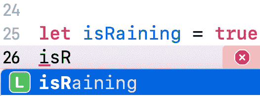
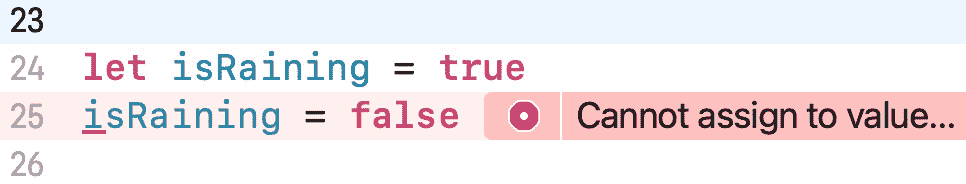
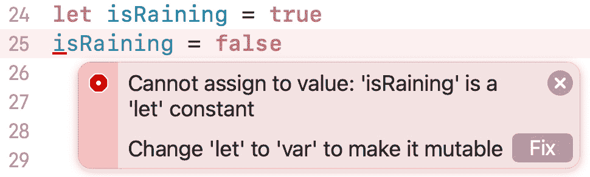
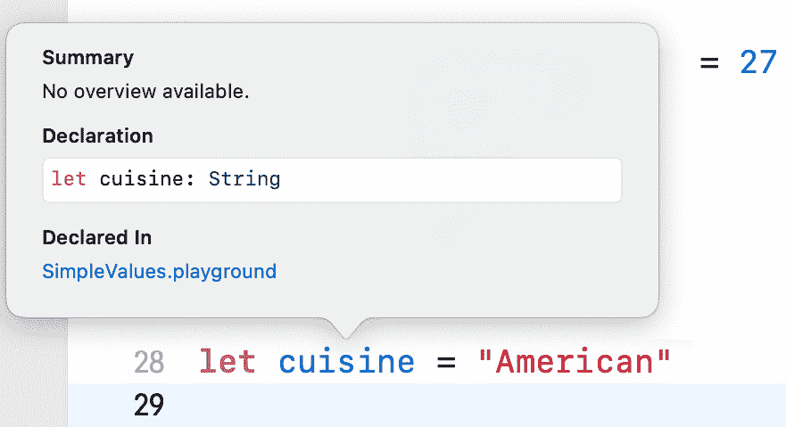
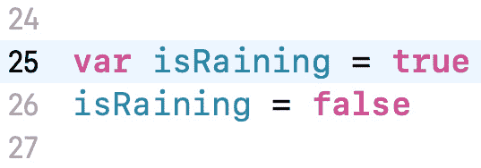

# 第二章：*第二章*：简单值和类型

现在，您已经对 Xcode 进行了简要的浏览，让我们来看看 Swift 编程语言。

首先，您将探索 **Swift 游乐场**，这是一个交互式环境，您可以在此输入 Swift 代码并立即显示结果。接下来，您将学习 Swift 如何表示和存储各种类型的数据。然后，您将了解一些酷炫的 Swift 功能，如 **类型推断** 和 **类型安全**，这些功能可以帮助您编写更简洁的代码并避免常见错误。最后，您将学习如何对数据进行常见操作，以及如何将消息打印到调试区域以帮助您解决问题。

到本章结束时，您应该能够编写能够存储和处理字母和数字的简单程序。

以下内容将涵盖：

+   理解 Swift 游乐场

+   探索数据类型

+   探索常量和变量

+   理解类型推断和类型安全

+   探索运算符

+   使用 `print()` 语句

    重要信息

    更多关于 Swift 语言最新版本的信息，请访问 [`docs.swift.org/swift-book/`](https://docs.swift.org/swift-book/)。

# 技术要求

要完成本章的练习，您需要以下内容：

+   运行 macOS 11 Big Sur 或 macOS 12 Monterey 的 Apple Mac 计算机

+   已安装 Xcode 13（有关安装 Xcode 的说明，请参阅 *第一章*，*熟悉 Xcode*）

本章的 Xcode 游乐场位于本书代码包的 `Chapter02` 文件夹中，可在此处下载：

[`github.com/PacktPublishing/iOS-15-Programming-for-Beginners-Sixth-Edition`](https://github.com/PacktPublishing/iOS-15-Programming-for-Beginners-Sixth-Edition)

查看以下视频，了解代码的实际应用：

[`bit.ly/3bTuizM`](https://bit.ly/3bTuizM)

在下一节中，您将创建一个新的游乐场，您可以在其中输入本章中展示的代码。

# 理解 Swift 游乐场

游乐场是交互式编码环境。您在左侧窗格中输入代码，结果会立即在右侧窗格中显示。这是一种很好的实验代码和探索系统 API 的方法。

重要信息

API 是应用程序编程接口的缩写。要了解更多信息，请访问此链接：[`en.wikipedia.org/wiki/API`](https://en.wikipedia.org/wiki/API)。

让我们从创建一个新的游乐场并检查其用户界面开始。按照以下步骤进行：

1.  要创建游乐场，启动 Xcode 并从 Xcode 菜单栏选择 **File** | **New** | **Playground...**：![图 2.1：Xcode 菜单栏，选中 File | New | Playground...

    ![img/Figure_2.1_B17469.jpg]

    图 2.1：Xcode 菜单栏，选中 File | New | Playground... ![图 2.1：Xcode 菜单栏，选中 File | New | Playground...

1.  模板屏幕出现。**iOS** 应已选中。选择 **空白** 并点击 **下一步**：![图 2.2：为您的新的游乐场选择一个模板：屏幕

    ![Figure_2.2_B17469.jpg]

    图 2.2：为您的新的 playground 选择一个模板：屏幕

1.  将 playground 命名为`SimpleValues`并保存到您喜欢的任何位置。完成后点击**创建**：![Figure_2.3: Save dialog box]

    ![Figure_2.3_B17469.jpg]

    图 2.3：保存对话框

1.  您应该在屏幕上看到 playground：

![Figure_2.4: Xcode playground 用户界面]

![Figure_2.4_B17469.jpg]

图 2.4：Xcode playground 用户界面

如您所见，它比 Xcode 项目简单得多。让我们更详细地看看界面：

+   **导航器按钮（1）** - 显示或隐藏**导航器**区域。

+   **活动视图（2）** - 显示当前操作或状态。

+   **库按钮（3）** - 显示代码片段和其他资源。

+   **检查器按钮（4）** - 显示或隐藏**检查器**区域。

+   **导航器区域（5）** - 提供快速访问项目各个部分的途径。默认情况下显示项目导航器。

+   **编辑器区域（6）** - 您在这里编写代码。

+   **结果区域（7）** - 为您编写的代码提供即时反馈。

+   **播放按钮（8）** - 从所选行执行代码。

+   **边框（9）** - 这个边框将**编辑器**和**结果**区域分开。如果您发现**结果**区域显示的结果被截断，将边框向左拖动以增加其大小。

+   **播放/停止按钮（10）** - 执行或停止 playground 中所有代码的执行。

+   `print()`命令。

+   **调试按钮（12）** - 显示或隐藏**调试**区域。

您可能会发现 playground 中的代码太小，难以阅读。让我们看看如何在下一节中使其变大。

## 定制字体和颜色

Xcode 提供了广泛的定制选项。您可以在**首选项...**菜单中访问它们。如果您发现文本太小，难以看清，请按照以下步骤操作：

1.  从**Xcode**菜单中选择**首选项...**以显示首选项窗口。

1.  在首选项窗口中，点击**主题**并选择**演示（浅色）**以使代码更大，更容易阅读：![Figure_2.5: Xcode Preferences window with the Themes pane selected]

    ![Figure_2.5_B17469.jpg]

    图 2.5：选择主题面板的 Xcode 首选项窗口

1.  关闭首选项窗口返回到 playground。注意，playground 中的文本比之前大。如果您愿意，也可以尝试其他主题。

现在您已经将字体和颜色定制到您喜欢的样子，让我们看看如何在下一节中在 playground 中运行代码。

## 运行 playground 代码

您的 playground 中已经有一个指令。要执行指令，请按照以下步骤操作：

1.  点击 playground 左下角的**播放/停止**按钮。您可能会看到一个以下对话框：![Figure_2.6: Developer Tools Access dialog box]

    ![Figure_2.6_B17469.jpg]

    图 2.6：开发者工具访问对话框

1.  在**结果**区域显示的`"Hello, playground"`中输入：

![Figure_2.7: Playground showing "Hello, playground" in the Results area]

![Figure_2.7_B17469.jpg]

图 2.7：游乐场中结果区域显示 "Hello, playground"

小贴士

你可以使用键盘快捷键 *Command + Shift + Return* 来在游乐场中运行代码。

为了准备在本章剩余部分使用游乐场，请从游乐场中删除 `var greeting = "Hello, playground"` 指令。在编写代码的过程中，将本章中显示的代码输入到游乐场中，并在必要时点击 **播放/停止** 按钮来运行它。

让我们进入下一节，了解 Swift 中使用的简单数据类型。

# 探索数据类型

所有编程语言都可以存储数字、逻辑状态和单词，Swift 也不例外。即使你是一位经验丰富的程序员，你也可能会发现 Swift 以与其他你可能熟悉的语言不同的方式表示这些对象。

重要信息

更多有关数据类型的信息，请访问：[`docs.swift.org/swift-book/LanguageGuide/TheBasics.html`](https://docs.swift.org/swift-book/LanguageGuide/TheBasics.html)。

让我们按顺序介绍 Swift 中的 **整数**、**浮点数**、**布尔值** 和 **字符串**，在下一节中。

## 整数的表示

假设你想存储以下内容：

+   城市中的餐馆数量

+   飞机上的乘客

+   酒店房间

你会使用整数，这些是没有分数部分的数字（包括负数）。

Swift 中的整数由 `Int` 类型表示。

## 浮点数的表示

假设你想存储以下内容：

+   圆周率（3.14159...）

+   绝对零度（-273.15 °C）

你会使用浮点数，这些是带有分数部分的数字。

Swift 中浮点数的默认类型是 `Double`，它使用 64 位，包括负数。您还可以使用 `Float`，它使用 32 位，但 `Double` 更受欢迎。

## 表示布尔值

假设你想存储对简单是/否问题的答案，例如以下内容：

+   在下雨吗？

+   餐厅里还有空位吗？

为了这个，你使用布尔值。

Swift 提供了一个 `Bool` 类型，可以是 `true` 或 `false`。

## 表示字符串

假设你想存储以下内容：

+   餐馆的名称，例如 "Bombay Palace"

+   职位描述，例如 "会计师" 或 "程序员"

+   一种水果，例如 "香蕉"

你会使用 Swift 的 `String` 类型，它表示字符序列，并且完全符合 Unicode。这使得表示不同的字体和语言变得容易。

重要信息

要了解更多关于 Unicode 的信息，请访问此链接：[`home.unicode.org/basic-info/faq/`](https://home.unicode.org/basic-info/faq/)。

现在你已经了解了 Swift 如何表示这些常见数据类型，让我们在之前创建的游乐场中尝试它们，在下一节中。

## 在游乐场中使用常见数据类型

您在游乐场中输入的任何内容都将被执行，结果将出现在**结果**区域。让我们看看当您在游乐场中输入数字、布尔值和字符串并执行时会发生什么。按照以下步骤操作：

1.  在它前面的`//`中输入以下代码是一个**注释**。注释是创建笔记或提醒给自己的一种好方法，并且将被 Xcode 忽略。

1.  点击**播放/停止**按钮来运行您的代码。

1.  等待几秒钟。Xcode 将评估您的输入并在结果区域显示结果，如下所示：

    ```swift
    42
    -23

    3.14159
    0.1
    -273.15

    true
    false

    "hello, world" 
    "albatross"
    ```

    注意，注释不会出现在结果区域。

太棒了！您刚刚创建并运行了您的第一个游乐场。让我们看看如何在下一节中存储不同的数据类型。

# 探索常量和变量

现在您已经了解了 Swift 支持的基本数据类型，让我们看看如何存储它们，这样您以后就可以对它们进行操作。

您可以使用**常量**或**变量**来存储数据。两者都是具有名称的容器，但常量的值只能设置一次，一旦设置后就不能更改，而变量的值可以在任何时候更改。

在使用之前，您必须声明常量和变量。常量使用`let`关键字声明，而变量使用`var`关键字声明。

让我们通过在您的游乐场中实现它们来探索常量和变量是如何工作的。按照以下步骤操作：

1.  将以下代码添加到您的游乐场中，以声明三个常量：

    ```swift
    let theAnswerToTheUltimateQuestion = 42 
    let pi = 3.14159
    let myName = "Ahmad Sahar"
    ```

1.  点击`"Ahmad Sahar"`，用于为`myName`分配值。这些被称为**字符串字面量**。

1.  在常量声明之后添加以下代码以声明三个变量：

    ```swift
    var currentTemperatureInCelsius = 27 
    var myAge = 50
    var myLocation = "home"
    ```

    与常量类似，每个情况下都会创建一个容器并命名，然后存储分配的值。

    小贴士

    存储的值将在结果区域显示。

1.  常量的值一旦设置就无法更改。为了测试这一点，在变量声明之后添加以下代码：

    ```swift
    let isRaining = true
    isRaining = false
    ```

    当您输入第二行代码时，将出现一个带有建议的弹出菜单：

    

    图 2.8：自动完成弹出菜单

    使用上下箭头键选择`isRaining`常量，然后按*Tab*键选择它。这个功能被称为**自动完成**，可以帮助您在输入代码时防止输入错误。

1.  输入完成后，等待几秒钟。在第二行，您应该看到一个带有白色点的红色圆圈：

    图 2.9：错误通知

    这意味着您的程序中存在错误，Xcode 认为它可以修复。错误出现是因为您在常量的初始值设置后尝试为其分配新值。

1.  点击红色圆圈以展开错误消息。您应该看到一个带有**修复**按钮的以下框：

    图 2.10：扩展的错误通知

    Xcode 会告诉您问题所在（**无法赋值：'isRaining' 是一个 'let' 常量**）并建议一个修正（**将 'let' 更改为 'var' 以使其可变**）。

1.  点击 **修复** 按钮。

1.  您应该看到 `isRaining` 常量声明已被更改为变量声明：



图 2.11：应用修复后的代码

由于新值可以在创建变量后分配，错误得到了解决。但是，请注意，建议的修正可能不是最佳解决方案。

如果您查看输入的代码，可能会想知道 Xcode 如何知道变量或常量中存储的数据类型。您将在下一节中了解这一点。

# 理解类型推断和类型安全

在上一节中，您声明了常量和变量，并给它们赋值。Swift 会根据您提供的值自动确定常量或变量的类型，这被称为 **类型推断**。您可以通过按住 *Option* 键并单击其名称来查看常量或变量的类型。要查看实际操作，请按照以下步骤进行：

1.  将以下代码添加到您的游乐场中，以声明一个字符串：

    ```swift
    let cuisine = "American"
    ```

1.  点击 **播放/停止** 按钮来运行它。

1.  按住 *Option* 键并单击 `cuisine` 以显示常量类型。您应该看到以下内容：



](img/Figure_2.12_B17469.jpg)

图 2.12：类型声明弹出窗口

如您所见，`cuisine` 的类型是 `String`。

如果您想为变量或常量设置特定的类型，您将在下一节中了解如何操作。

## 使用类型注解来指定类型

您已经看到 Xcode 会尝试根据提供的值自动确定变量或常量的数据类型。然而，有时您可能希望指定一个类型而不是让 Xcode 为您做这件事。为此，在常量或变量名称后输入一个冒号，后跟所需类型。这被称为 **类型注解**。

将以下代码添加到您的游乐场中，以声明一个具有特定类型的变量，并点击 **播放/停止** 按钮来运行它：

```swift
var restaurantRating: Double = 3
```

在这里，您指定了 `restaurantRating` 具有特定的类型，`Double`。即使您分配了一个整数给 `restaurantRating`，它也会被存储为浮点数。

在下一节中，您将了解 Xcode 如何通过强制执行 **类型安全** 来帮助您减少程序中的错误数量。

## 使用类型安全来检查值

Swift 是一种类型安全的语言。它会检查您是否正在将正确类型的值分配给变量，并将不匹配的类型标记为错误。让我们通过以下步骤来了解它是如何工作的：

1.  将以下代码添加到您的游乐场中，以将字符串赋值给 `restaurantRating`：

    ```swift
    restaurantRating = "Good"
    ```

1.  点击 **播放/停止** 按钮来运行代码。

1.  你应该看到一个带有**x**的红色圆圈。感叹号表示 Xcode 无法为此提供修复建议。点击红色圆圈。

1.  由于你试图将一个字符串赋值给类型为`Double`的变量，因此显示以下错误信息：![Figure 2.13: Expanded error notification with no fix]

    ![img/Figure_2.13_B17469.jpg]

    图 2.13：无修复建议的扩展错误通知

1.  在该行前输入`//`来注释掉它，如下所示：

    ```swift
    // restaurantRating = "Good"
    ```

    红色圆圈消失了，因为你的程序中没有错误了。

    小贴士

    选择代码行并输入*Command + /* 来注释掉它们。

现在你已经知道了如何在常量和变量中存储数据，让我们看看如何在下一节中对这些数据进行操作。

# 探索操作符

你可以在 Swift 中执行算术、比较和逻辑操作。`true`或`false`。

重要信息

关于操作符的更多信息，请访问[`docs.swift.org/swift-book/LanguageGuide/BasicOperators.html`](https://docs.swift.org/swift-book/LanguageGuide/BasicOperators.html)。

让我们更详细地看看每种操作符类型。你将在下一节开始学习算术操作符（加法、减法、乘法和除法）。

## 使用算术操作符

你可以使用这里显示的标准算术操作符对整数和浮点数执行数学运算：

![Figure 2.14: Arithmetic operators]

![img/Figure_2.14_B17469.jpg]

图 2.14：算术操作符

让我们看看这些操作符是如何使用的。按照以下步骤操作：

1.  将以下代码添加到你的 playground 中，以添加算术运算：

    ```swift
    let sum = 23 + 20
    let result = 32 - sum
    let total = result * 5
    let divide = total / 10
    ```

1.  点击`43`、`-11`、`-55`和`-5`，分别。请注意，55 除以 10 返回 5 而不是 5.5，因为这两个数都是整数。

1.  操作符只能与相同类型的操作数一起工作。输入以下代码并运行它，看看如果操作数是不同类型会发生什么：

    ```swift
    let a = 12
    let b = 12.0 
    let c = a + b
    ```

    你会得到一个错误信息，`a`和`b`是不同类型。请注意，Xcode 无法自动修复这个问题，因此不会显示任何修复建议。

1.  为了修复错误，按照以下方式修改程序：

    ```swift
    let c = Double(a) + b
    ```

    `Double(a)`从`a`中获取存储的值并从中创建一个浮点数。现在两个操作数都是相同类型，现在你可以将`b`中的值加到它上面。存储在`c`中的值是`24.0`，`24`将在结果区域显示。

现在你已经知道了如何使用算术操作符，你将在下一节中查看复合赋值操作符（`+=`、`-=`、`*=` 和 `/=`）。

## 使用复合赋值操作符

你可以使用这里显示的复合赋值操作符对一个值执行操作并将结果赋给一个变量：

![Figure 2.15: Compound assignment operators]

![img/Figure_2.15_B17469.jpg]

图 2.15：复合赋值操作符

让我们看看这些操作符是如何使用的。将以下代码添加到你的 playground 中，并点击**播放/停止**按钮来运行它：

```swift
var aa = 1
aa += 2
aa -= 1
```

`a += 2` 表达式是 `a = a + 2` 的简写，所以 `a` 中的值现在是 `1 + 2`，并将 `3` 赋值给 `a`。同样，`a -= 1` 是 `a = a - 1` 的简写，所以 `a` 中的值现在是 `3 - 1`，并将 `2` 赋值给 `a`。

现在你已经熟悉了复合赋值运算符，让我们在下一节看看比较运算符（`==`、`/=`、`>`、`<`、`>=` 和 `<=`）。

## 使用比较运算符

你可以使用比较运算符将一个值与另一个值进行比较，结果将是 `true` 或 `false`。你可以使用以下比较运算符：

![Figure 2.16: Comparison operators]

![Figure_2.16_B17469.jpg]

图 2.16：比较运算符

让我们看看这些运算符是如何使用的。将以下代码添加到你的游乐场中，并点击 **Play/Stop** 按钮来运行它：

```swift
1 == 1 
2 != 1 
2 > 1    
1 < 2    
1 >= 1 
2 <= 1
```

让我们看看它是如何工作的：

+   `1 == 1` 返回 `true`，因为 1 等于 1。

+   `2 != 1` 返回 `true`，因为 2 不等于 1。

+   `2 > 1` 返回 `true`，因为 2 大于 1。

+   `1 < 2` 返回 `true`，因为 1 小于 2。

+   `1 >= 1` 返回 `true`，因为 1 大于或等于 1。

+   `2 <= 1` 返回 `false`，因为 2 不小于或等于 1。

返回的布尔值将在**结果**区域显示。

如果你想要检查多个条件，那逻辑运算符（**AND**、**OR** 和 **NOT**）就派上用场了。你将在下一节学习这些内容。

## 使用逻辑运算符

当你处理两个或更多条件时，逻辑运算符很有用。例如，如果你在便利店，如果你有现金或信用卡，你可以为商品付款。在这种情况下，**OR** 是逻辑运算符。

你可以使用以下逻辑运算符：

![Figure 2.17: Logical operators]

![Figure_2.17_B17469.jpg]

图 2.17：逻辑运算符

要查看这些运算符的使用方法，请将以下代码添加到你的游乐场中，并点击 **Play/Stop** 按钮来运行它：

```swift
(1 == 1) && (2 == 2) 
(1 == 1) && (2 != 2) 
(1 == 1) || (2 == 2) 
(1 == 1) || (2 != 2) 
(1 != 1) || (2 != 2) 
!(1 == 1)
```

让我们看看它是如何工作的：

+   `(1 == 1) && (2 == 2)` 返回 `true`，因为两个操作数都是 `true`，所以 `true` AND `true` 返回 `true`。

+   `(1 == 1) && (2 != 2)` 返回 `false`，因为一个操作数是 `false`，所以 `true` AND `false` 返回 `false`。

+   `(1 == 1) || (2 == 2)` 返回 `true`，因为两个操作数都是 `true`，所以 `true` OR `true` 返回 `true`。

+   `(1 == 1) || (2 != 2)` 返回 `true`，因为一个操作数是 `true`，所以 `true` OR `false` 返回 `true`。

+   `(1 != 1) || (2 != 2)` 返回 `false`，因为两个操作数都是 `false`，所以 `false` OR `false` 返回 `false`。

+   `!(1 == 1)` 返回 `false`，因为 `1==1` 是 `true`，所以 NOT `true` 返回 `false`。

返回的布尔值将在结果区域显示。

到目前为止，你只处理过数字。在下一节中，你将看到如何使用 Swift 的 `String` 类型对单词和句子进行操作，它们作为字符串存储。

## 执行字符串操作

如你之前所见，字符串是一系列字符。它们由 `String` 类型表示，并且完全符合 Unicode 标准。

重要信息

更多有关字符串的信息，请访问：[`docs.swift.org/swift-book/LanguageGuide/StringsAndCharacters.html`](https://docs.swift.org/swift-book/LanguageGuide/StringsAndCharacters.html)。

让我们了解一些常见的字符串操作。按照以下步骤操作：

1.  您可以使用 `+` 运算符将两个字符串连接起来。将以下代码添加到您的游乐场中，然后点击 `"Good"` 和 `"Morning"` 将被连接，并在结果区域显示 `"Good Morning"`。

1.  您可以通过 `rating` 常量（包含 `3.5`，类型为 `Double`）与其他类型的常量和变量结合使用。将 `rating` 放在 `String()` 的括号中，获取存储在 `rating` 中的值，并基于它创建一个新的字符串 `"3.5"`，然后将其与 `ratingResult` 变量中的字符串结合，返回字符串 `"The restaurant rating is 3.5"`。

1.  有一种更简单的方法来组合字符串，称为字符串中的 `\(`" 和 "`)`" 。输入以下代码并运行它：

    ```swift
    ratingResult = "The restaurant rating is \(rating)"
    ```

    如前例所示，`rating` 中的值用于创建一个新的字符串 `"3.5"`，返回字符串 `"The restaurant rating is 3.5"`。

到目前为止，您可以在结果区域看到您指令的结果。然而，当您使用 Xcode 编写应用程序时，您将无法访问在游乐场中看到的那个结果区域。为了在程序运行时显示变量和常量的内容，您将在下一节中学习如何将它们打印到调试区域。

# 使用 `print()` 语句

如您在 *第一章**，熟悉 Xcode* 中所见，Xcode 项目没有游乐场那样的结果区域，但项目和游乐场都有调试区域。使用 `print()` 语句会将括号之间的任何内容打印到调试区域。

重要信息

`print()` 语句是一个 **函数**。您将在 *第六章**，函数和闭包* 中了解更多关于函数的内容。

将以下代码添加到您的游乐场中，然后点击 **播放/停止** 按钮来运行它：

```swift
print(ratingResult)
```

您将看到 `ratingResult` 的值出现在调试区域：


图 2.18：调试区域显示 `print()` 语句的结果

当你刚开始学习时，可以随意使用尽可能多的 `print()` 语句。这是一种非常好的理解程序中发生情况的方法。

# 摘要

在本课中，您学习了如何创建和使用游乐场文件，这允许您探索和实验 Swift。

您看到了 Swift 如何表示不同类型的数据，以及如何使用常量和变量。这使得您可以在程序中存储数字、布尔值和字符串。

您还了解了类型推断、类型注解和类型安全，这些有助于您编写简洁且错误更少的代码。

你已经了解了如何对数字和字符串进行操作，这让你能够执行简单的数据处理任务。

你学习了如何修复错误，以及如何将输出打印到调试区域，这在尝试查找和修复你编写的程序中的错误时非常有用。

在下一章中，你将学习**条件语句**和**可选参数**。条件语句用于在程序中做出逻辑选择，而可选参数则处理变量可能或可能没有值的情况。
