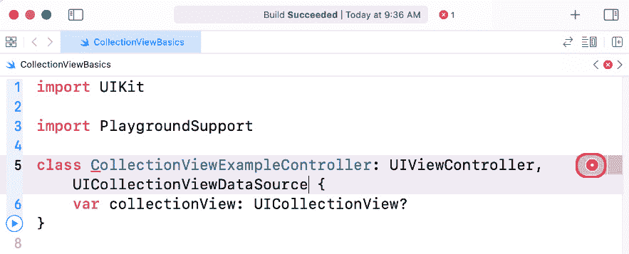
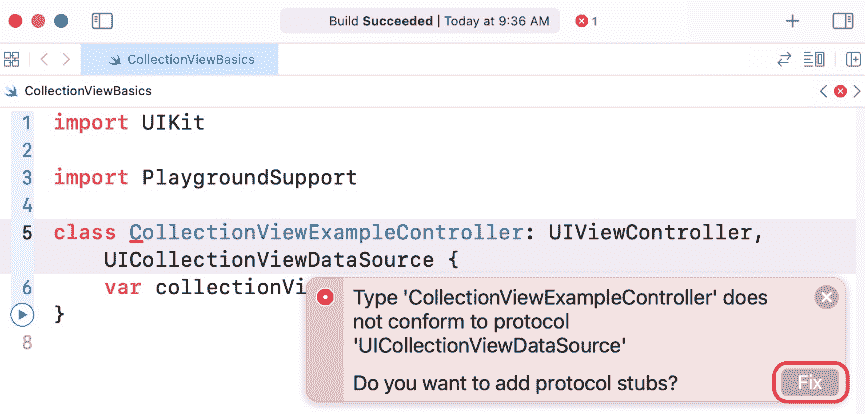
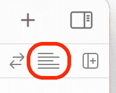
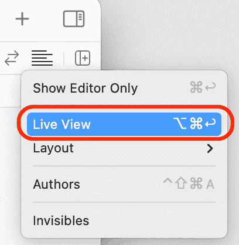
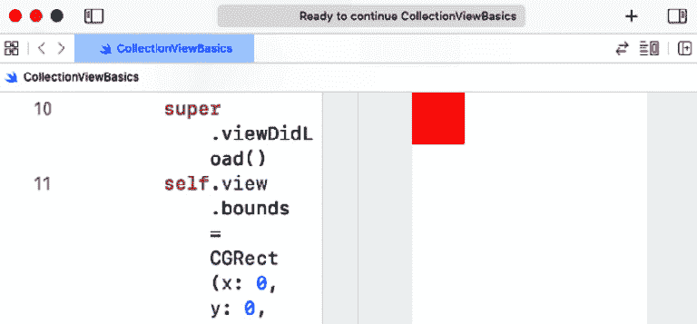

# 第十三章：*第十三章*：MVC 和集合视图入门

在上一章中，你修改了 **探索** 屏幕内、**餐厅列表** 屏幕和 **位置** 屏幕中的单元格，以匹配 *第九章* 中的应用导览，“设置用户界面”。你已经完成了 *Let's Eat* 应用的初始 UI，这标志着本书第二部分的结束。

本章开始本书的第三部分，你将专注于使你的应用工作的代码。在本章中，你将学习 **模型-视图-控制器 (MVC**) 设计模式以及应用的各个部分如何相互交互。然后，你将使用 playground 以编程方式实现集合视图（这意味着使用代码而不是 storyboards 来实现），以了解集合视图的工作原理。最后，你将回顾在 **探索** 和 **餐厅列表** 屏幕中实现的集合视图，以便你可以看到在 storyboards 中实现它们和在编程方式中实现它们的区别。

到本章结束时，你将理解 MVC 设计模式，学习如何以编程方式创建集合视图控制器，以及如何使用集合视图代理和数据源协议。

将涵盖以下主题：

+   理解模型-视图-控制器设计模式

+   探索控制器和类

# 技术要求

本章的资源文件和完成的 Xcode 项目位于本书代码包的 `Chapter13` 文件夹中，可以在此处下载：

[`github.com/PacktPublishing/iOS-15-Programming-for-Beginners-Sixth-Edition`](https://github.com/PacktPublishing/iOS-15-Programming-for-Beginners-Sixth-Edition)

观看以下视频，看看代码的实际效果：

[`bit.ly/3wsOeCZ`](https://bit.ly/3wsOeCZ)

创建一个新的 playground 并将其命名为 `CollectionViewBasics`。你可以使用这个 playground 在阅读本章时输入和运行所有代码。在这样做之前，让我们看一下模型-视图-控制器设计模式，这是一种常用的 iOS 应用编写方法。

# 理解模型-视图-控制器设计模式

**模型-视图-控制器**（**MVC**）设计模式是构建 iOS 应用的一种常用方法。MVC 将应用分为三个不同的部分：

+   **模型**：这处理数据存储和表示，以及数据处理任务。

+   **视图**：这包括用户可以与之交互的所有屏幕上的内容。

+   **控制器**：这管理模型和视图之间信息流的流动。

MVC 的一个显著特点是视图和模型不会相互交互；相反，所有通信都由控制器管理。

例如，想象你正在一家餐厅。你查看菜单并选择你想要的东西。然后，服务员过来，接收你的订单，并将其发送给厨师。厨师准备你的订单，当它完成时，服务员取走订单并将其带给你。在这个场景中，菜单是视图，服务员是控制器，厨师是模型。此外，请注意，你与厨房之间的所有互动都只通过服务员进行；你与厨师之间没有互动。

重要信息

要了解更多关于 MVC 的信息，请访问[`en.wikipedia.org/wiki/Model–view–controller`](https://en.wikipedia.org/wiki/Model-view-controller)。

要了解 MVC 是如何工作的，让我们更多地了解控制器和类。你将看到实现一个必须管理集合视图的视图控制器需要什么，这个视图控制器用于**探索**屏幕和**餐厅列表**屏幕。

# 探索控制器和类

到目前为止，你已经在`主故事板文件`中使用 Interface Builder 实现了视图控制器场景。你将`ExploreViewController`，一个管理`RestaurantListViewController`中集合视图的视图控制器，以及`RestaurantListViewController`，一个管理**餐厅列表**屏幕中集合视图的视图控制器，添加到了你的项目中。然而，你还没有学习如何你的代码在各个视图控制器中工作，所以现在让我们看看这一点。

小贴士

你可能希望重新阅读*第十章*，*构建你的用户界面*，其中你创建了`ExploreViewController`类，以及*第十一章*，*完成你的用户界面*，其中你创建了`RestaurantListViewController`类。

当一个典型的 iOS 应用启动时，将加载要显示的第一个屏幕的视图控制器。视图控制器有一个`view`属性，并自动加载分配给其`view`属性的视图实例。该视图可能有子视图，这些子视图也会被加载。如果一个子视图是集合视图，它将具有`dataSource`和`delegate`属性。`dataSource`属性被分配给一个为集合视图提供数据的对象。`delegate`属性被分配给一个处理与集合视图用户交互的对象。通常，集合视图的视图控制器也会被分配到集合视图的`dataSource`和`delegate`属性。集合视图将向其视图控制器发送的方法调用在`UICollectionViewDataSource`和`UICollectionViewDelegate`协议中声明。请记住，协议只提供方法声明；这些方法调用的实现是在视图控制器中。然后，视图控制器将为集合视图提供所需的数据或处理用户交互。

在下一节中，让我们更仔细地看看集合视图和集合视图协议。

## 理解集合视图

收集视图通过可定制的布局显示有序的收集视图单元格集合。

重要信息

要了解更多关于收集视图的信息，您可以参考 [`developer.apple.com/documentation/uikit/uicollectionview`](https://developer.apple.com/documentation/uikit/uicollectionview)。

收集视图的布局由 `UICollectionViewFlowLayout` 决定。它决定了收集视图中元素的方向和大小。

重要信息

要了解更多关于 `UICollectionViewFlowLayout` 的信息，您可以参考 [`developer.apple.com/documentation/uikit/uicollectionviewflowlayout`](https://developer.apple.com/documentation/uikit/uicollectionviewflowlayout)。

收集视图显示的数据通常由视图控制器提供。为收集视图提供数据的视图控制器必须遵守 `UICollectionViewDataSource` 协议。该协议声明了一系列方法，告诉收集视图显示多少个单元格以及每个单元格中显示什么。它还涵盖了辅助视图（如收集视图分区标题）的创建和配置。

重要信息

要了解更多关于 `UICollectionViewDataSource` 协议的信息，您可以参考 [`developer.apple.com/documentation/uikit/uicollectionviewdatasource`](https://developer.apple.com/documentation/uikit/uicollectionviewdatasource)。

为了提供用户交互，收集视图的视图控制器还必须遵守 `UICollectionViewDelegate` 协议，该协议声明了一系列在用户与收集视图交互时被触发的方法。

重要信息

要了解更多关于 `UICollectionViewDelegate` 协议的信息，您可以参考 [`developer.apple.com/documentation/uikit/uicollectionviewdelegate`](https://developer.apple.com/documentation/uikit/uicollectionviewdelegate)。

要理解收集视图的工作原理，您将在 `CollectionViewBasics` 游乐场中实现一个控制收集视图的视图控制器。然后，您将比较下一节中 **探索** 和 **餐厅列表** 屏幕中的视图控制器实现。由于游乐场中没有故事板，您不能像之前章节中那样添加 UI 元素。相反，您将按编程方式添加它们。

重要信息

在下一章（*第十四章*，“将数据放入收集视图”）中，将介绍如何将模型对象添加到收集视图中。

您将首先创建 `CollectionViewExampleController` 类，这是一个视图控制器，用于管理收集视图。之后，您将创建一个 `CollectionViewExampleController` 实例，并在游乐场的实时视图中显示包含单个收集视图单元格的收集视图。按照以下步骤操作：

1.  打开您在本章开头创建的 `CollectionViewBasics` 游乐场。在游乐场的最顶部，删除 `var` 语句并添加 `import PlaygroundSupport` 语句。您的游乐场现在应包含以下内容：

    ```swift
    import UIKit
    import statement imports the API for creating iOS apps. The second statement enables the playground to display a live view, which you will use to display the collection view.
    ```

1.  在 `import` 语句之后添加以下代码以声明 `CollectionViewExampleController` 类：

    ```swift
    class CollectionViewExampleController: UIViewController {
    }
    ```

    此类是 `UIViewController` 的子类，这是一个苹果公司提供的用于管理屏幕上视图的类。

1.  在大括号内添加以下代码以向 `CollectionViewExampleController` 类添加一个可选属性，`collectionView`：

    ```swift
    var collectionView: UICollectionView?
    ```

    将为该属性分配一个集合视图的实例。

1.  确保您的代码看起来如下：

    ```swift
    class CollectionViewExampleController: UIViewController {
       var collectionView: UICollectionView?
    }
    ```

在下一节中，您将学习如何设置集合视图显示的单元格数量以及如何设置每个单元格的内容。

### 遵循 `UICollectionViewDataSource` 协议

集合视图在屏幕上显示一个集合视图单元格的网格。然而，在它能够这样做之前，它需要知道要显示多少个单元格以及每个单元格中要放置什么内容。为了向集合视图提供这些信息，您将使 `CollectionViewExampleController` 类遵循 `UICollectionViewDataSource` 协议。

此协议有两个必需的方法：

+   `collectionView(_:numberOfItemsInSection:)` 由集合视图调用，以确定应显示多少个集合视图单元格。

+   `collectionView(_:cellForItemAt:)` 由集合视图调用，以确定在每个集合视图单元格中显示什么。

让我们添加一些代码使 `CollectionViewExampleController` 遵循 `UICollectionViewDataSource` 协议。按照以下步骤操作：

1.  要使 `CollectionViewExampleController` 采用 `UICollectionViewDataSource` 协议，在超类声明后输入一个逗号，然后输入 `UICollectionViewDataSource`。完成时，您的代码应如下所示：

    ```swift
    class CollectionViewExampleController: UIViewController, UICollectionViewDataSource {
       var collectionView:UICollectionView?
    }
    ```

1.  由于您尚未实现两个必需的方法，将出现错误。点击错误图标：

    图 13.1：显示错误图标的编辑区域

1.  错误消息表明缺少 `UICollectionViewDataSource` 协议的必需方法。点击 **修复** 按钮以添加必需的方法：

    图 13.2：错误解释和修复按钮

1.  确保您的代码看起来如下：

    ```swift
    class CollectionViewExampleController: UIViewController, UICollectionViewDataSource {
       func collectionView(_ collectionView:
    UICollectionView, numberOfItemsInSection 
       section: Int) -> Int {
          code
       }
    func collectionView(_ collectionView: 
    UICollectionView, cellForItemAt indexPath: 
       IndexPath) -> UICollectionViewCell{
          code
       }
       var collectionView:UICollectionView?
    }
    ```

1.  在类定义中，惯例规定属性应在类顶部声明，在所有方法声明之前。重新排列代码，使 `collectionView` 属性声明位于顶部，如下所示：

    ```swift
    class CollectionViewExampleController: UIViewController, UICollectionViewDataSource {
       var collectionView:UICollectionView?
       func collectionView(_ collectionView:
       UICollectionView, numberOfItemsInSection 
       section: Int) -> Int {
          code
       }
    ```

1.  在 `collectionView(_:numberOfItemsInSection:)` 中，点击单词 `code` 并输入 `1`。完成的方法应如下所示：

    ```swift
    func collectionView(_ collectionView: 
    UICollectionView, numberOfItemsInSection 
    section: Int) -> Int {
       collectionView instance to display a single collection view cell. Typically, the number of cells to be displayed will be provided by a model object. You will learn more about them in *Chapter 14*, *Getting Data into Collection Views*.
    ```

1.  在 `collectionView(_:cellForItemAt:)` 中，点击单词 `code` 并按如下方式修改方法：

    ```swift
    func collectionView(_ collectionView: 
    UICollectionView, cellForItemAt indexPath: 
    IndexPath) -> UICollectionViewCell{
       let cell = collectionView.dequeueReusableCell
       (withReuseIdentifier: "BoxCell", for: indexPath)
    cell.backgroundColor = .red 
       return cell
    }
    ```

    下面是这个方法的工作原理。想象一下，你需要在集合视图中显示 1,000 个项目。你不需要 1,000 个集合视图单元格；你只需要足够多的单元格来填满屏幕。滚动出屏幕顶部的集合视图单元格可以重用来显示屏幕底部的项目。为了确保你使用的是正确的单元格类型，你使用重用标识符来识别单元格类型。重用标识符需要与集合视图注册，你将在稍后进行注册。下一行代码将单元格的背景颜色设置为红色，下一行代码返回单元格，然后单元格在屏幕上显示。这个过程会重复进行，直到第一行方法中指定的单元格数量，在这种情况下是 1。

1.  确认你的`CollectionViewExampleController`类看起来如下：

    ```swift
    class CollectionViewExampleController: 
    UIViewController, UICollectionViewDataSource {
       var collectionView: UICollectionView?
       func collectionView(_ collectionView:
       UICollectionView, numberOfItemsInSection 
       section: Int) -> Int {
          1
       }
       func collectionView(_ collectionView: 
       UICollectionView, cellForItemAt indexPath: 
       IndexPath) -> UICollectionViewCell{
          let cell = collectionView.dequeueReusableCell
          (withReuseIdentifier: "BoxCell", for: indexPath)
          cell.backgroundColor = .red 
          return cell
       }
    }
    ```

你已经完成了`CollectionViewExampleController`类的实现。在下一节中，你将学习如何创建此类的实例。

### 创建`CollectionViewExampleController`实例

现在你已经声明并定义了`CollectionViewExampleController`类，你需要编写一个方法来创建它的实例。按照以下步骤操作：

1.  在`collectionView`变量声明之后输入以下代码以声明一个新的方法：

    ```swift
    func createCollectionView() {
    }
    ```

    这声明了一个新的方法`createCollectionView()`，你将使用它来创建集合视图的实例并将其分配给`collectionView`属性。

1.  在大括号开头的代码之后输入以下代码以定义此方法的主体：

    ```swift
    self.collectionView = UICollectionView(
    frame: CGRect(x: 0, y: 0, width: 
    self.view.frame.width, height: 
    self.view.frame.height),
    collectionViewLayout: UICollectionViewFlowLayout())
    ```

    这将创建一个新的集合视图实例并将其分配给`collectionView`。这个集合视图的尺寸与其包含视图完全相同，并使用默认的流布局。流布局决定了集合视图单元格的显示顺序，即从左到右。

1.  进入下一行，然后输入以下代码以将集合视图的`dataSource`属性设置为`CollectionViewExampleController`的一个实例：

    ```swift
    self.collectionView?.dataSource = self
    ```

    集合视图的`dataSource`属性将指定哪个对象包含所需的`UIViewControllerDataSource`方法的实现。

1.  进入下一行，然后输入以下代码以将集合视图的背景颜色设置为白色：

    ```swift
    self.collectionView?.backgroundColor = .white
    ```

1.  进入下一行，然后输入以下代码以将集合视图中单元格的标识符设置为`BoxCell`：

    ```swift
    self.collectionView?.register(UICollectionViewCell.self, forCellWithReuseIdentifier:"BoxCell")
    ```

    此标识符将在`collectionView(_:cellForItemAt:)`方法中使用，以识别要重用的集合视图单元格的类型。

1.  进入下一行，然后输入以下代码将集合视图添加为`CollectionViewExampleController`实例视图的子视图：

    ```swift
    self.view.addSubview(self.collectionView!)
    ```

    当一个视图控制器实例被加载到内存中时，其视图也会被加载，以及任何子视图。在这种情况下，`CollectionViewExampleController`实例将自动加载其视图，由于集合视图是其视图的子视图，因此集合视图也将被加载。

1.  确认完成的方法看起来如下：

    ```swift
    func createCollectionView() {
       self.collectionView = UICollectionView(frame:
       CGRect(x: 0, y: 0, width: self.view.frame.width,
       height: self.view.frame.height),
       collectionViewLayout: 
       UICollectionViewFlowLayout()) 
       self.collectionView?.dataSource = self
       self.collectionView?.backgroundColor = .white
       self.collectionView?.register(
       UICollectionViewCell.self, 
       forCellWithReuseIdentifier: "BoxCell")   
       self.view.addSubview(self.collectionView!)
    }
    ```

现在你需要一个合适的地方来调用此方法。视图控制器有一个`view`属性。分配给`view`属性的视图将在视图控制器加载时自动加载。在视图成功加载后，将调用视图控制器的`viewDidLoad()`方法。你将在`CollectionViewControllerExample`类中重写`viewDidLoad()`方法以调用`createCollectionView()`。按照以下步骤操作：

1.  在`createCollectionView()`方法之前输入以下代码：

    ```swift
    override func viewDidLoad(){ 
       super.viewDidLoad() 
       self.view.bounds = CGRect(x: 0, y: 0, width: 375,
       height: 667)
       createCollectionView()
    }
    ```

    这设置了实时预览的大小，创建了一个集合视图实例，将其分配给`collectionView`，并将其作为子视图添加到`CollectionViewExampleController`实例的视图中。然后，集合视图会调用数据源方法以确定要显示多少个集合视图单元格以及每个单元格中显示什么内容。

    `collectionView(_:numberOfItemsInSection:)`返回`1`，因此将显示单个集合视图单元格。

    `collectionView(_:cellForItemAt:)`创建单元格，将单元格的背景颜色设置为红色，并将其返回以供显示。

1.  确认你的完成后的 playground 看起来如下：

    ```swift
    import UIKit
    import PlaygroundSupport
    class CollectionViewExampleController:
    UIViewController, UICollectionViewDataSource{
       var collectionView: UICollectionView?
       override func viewDidLoad(){ 
          super.viewDidLoad()
          self.view.bounds = CGRect(x: 0, y: 0, 
          width: 375, height: 667)
          createCollectionView()
       }
       func createCollectionView(){
          self.collectionView = UICollectionView(frame:
          CGRect(x: 0, y: 0, width: self.view.frame.width,
          height: self.view.frame.height),
          collectionViewLayout: 
          UICollectionViewFlowLayout()) 
          self.collectionView?.dataSource = self
          self.collectionView?.backgroundColor = .white
          self.collectionView?.register(
          UICollectionViewCell.self,
          forCellWithReuseIdentifier: "BoxCell")
          self.view.addSubview(self.collectionView!)
       }
       func collectionView(_ collectionView: 
       UICollectionView, numberOfItemsInSection 
       section: Int) -> Int {
          1
       }
       func collectionView(_ collectionView:
       UICollectionView, cellForItemAt indexPath: 
       IndexPath) -> UICollectionViewCell {
          let cell = collectionView.dequeueReusableCell(
          withReuseIdentifier: "BoxCell", for: indexPath)
          cell.backgroundColor = .red 
          return cell
       }
    }
    ```

1.  现在是时候看到它的实际效果了。在 playground 中的所有其他代码之后输入以下内容：

    ```swift
    PlaygroundPage.current.liveView = CollectionViewExampleController()
    ```

    此命令创建`CollectionViewExampleController`的实例，并在 playground 的实时预览中显示其视图。`createCollectionView()`方法将创建一个集合视图并将其作为子视图添加到`CollectionViewExampleController`实例的视图中，它将出现在屏幕上。

1.  运行 playground。如果你在屏幕上没有看到集合视图的表示，你需要打开 playground 的实时预览。点击调整编辑器选项按钮：

    图 13.3：调整编辑器选项按钮

1.  确保已选择**实时预览**：

    图 13.4：选择实时预览的编辑器选项菜单

1.  你将在实时预览中看到集合视图显示一个红色集合视图单元格：



图 13.5：显示包含一个集合视图单元格的集合视图的 Playground 实时预览

你刚刚创建了一个集合视图的视图控制器，创建了一个其实例，并在 playground 的实时预览中显示了一个集合视图。做得好！

在下一节中，您将重新审视在 **探索** 和 **餐厅列表** 屏幕中使用集合视图控制器的方式，这些屏幕是在 *第十章**，构建用户界面* 和 *第十一章**，完成用户界面* 中实现的。使用本节学到的知识作为参考，您应该能够理解它们是如何工作的。

## 重新审视探索和餐厅列表屏幕

记得您在 *第十章**，构建用户界面* 中添加的 `ExploreViewController` 类，以及您在*第十一章**，完成用户界面* 中添加的 `RestaurantListViewController` 类？这两个都是管理集合视图的视图控制器示例。请注意，这两个中的代码与您在游乐场中的代码非常相似。区别如下：

+   您在 `collectionView(_:cellForItemAt:)` 中通过编程方式设置单元格的背景颜色，而不是在属性检查器中设置。

+   您通过编程方式在 `CollectionViewExampleController` 中创建并分配集合视图到 `collectionView` 属性。

+   您在 `UICollectionView(frame:collectionViewLayout:)` 中通过编程方式设置集合视图的尺寸，而不是使用尺寸检查器。

+   您通过编程方式将数据源出口连接到视图控制器，而不是使用连接检查器。

+   您可以通过编程方式设置集合视图的背景颜色，而不是使用属性检查器。

+   您可以通过编程方式设置集合视图单元格的重用标识符，而不是使用属性检查器。

+   您通过编程方式将集合视图作为 `CollectionViewExampleController` 视图的子视图添加，而不是从库中拖入 **集合视图** 对象。

打开 `LetsEat` 项目。再次回顾 *第十章**，构建用户界面* 和 *第十一章**，完成用户界面*，以便比较和对照使用故事板实现的集合视图，以及像本章中那样通过编程实现。

# 摘要

在本章中，您详细学习了 MVC 设计模式和集合视图控制器。然后，您重新审视了在 **探索** 和 **餐厅列表** 屏幕中使用的集合视图，并学习了它们是如何工作的。

您现在应该理解了 MVC 设计模式、如何创建集合视图控制器以及如何使用集合视图数据源协议。这将使您能够为您的应用程序实现集合视图控制器。

到目前为止，您已经为`ExploreViewController`实例设置了视图和视图控制器，以便它可以通过**探索**屏幕中的集合视图进行显示。
