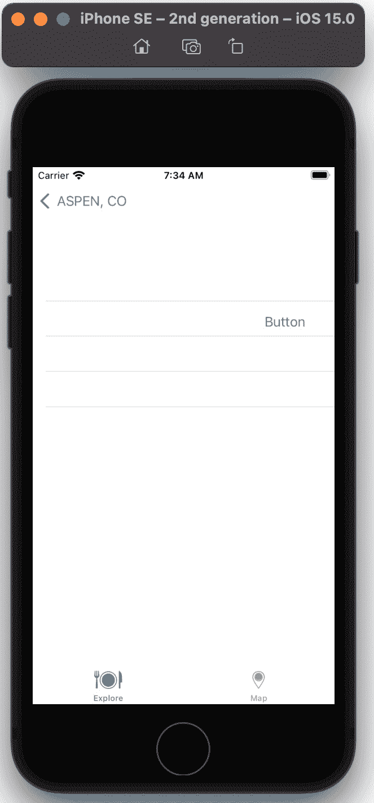
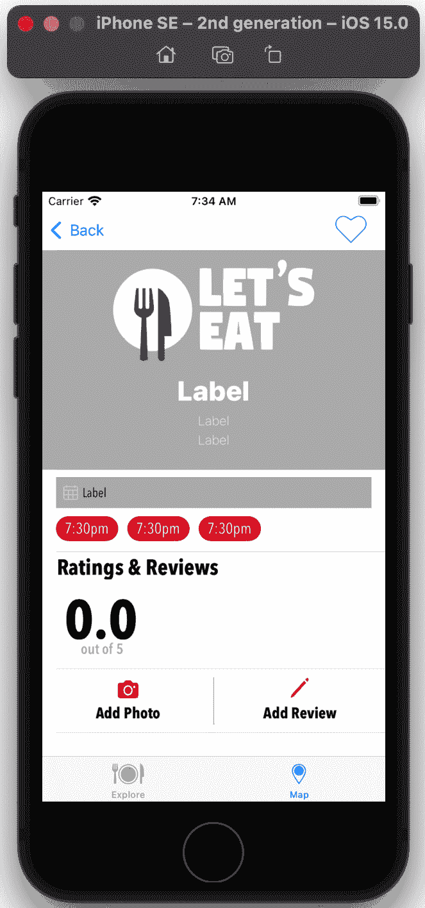
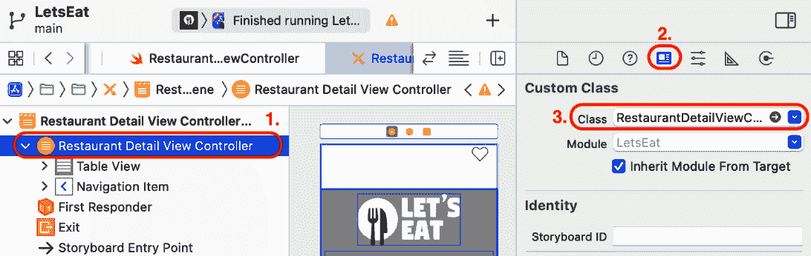
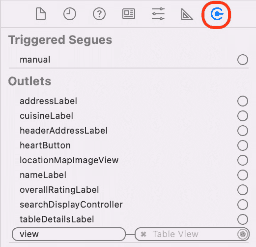
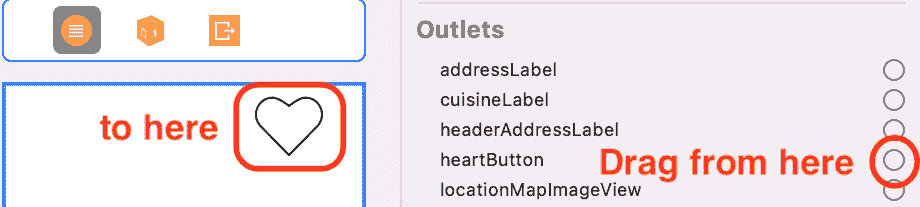
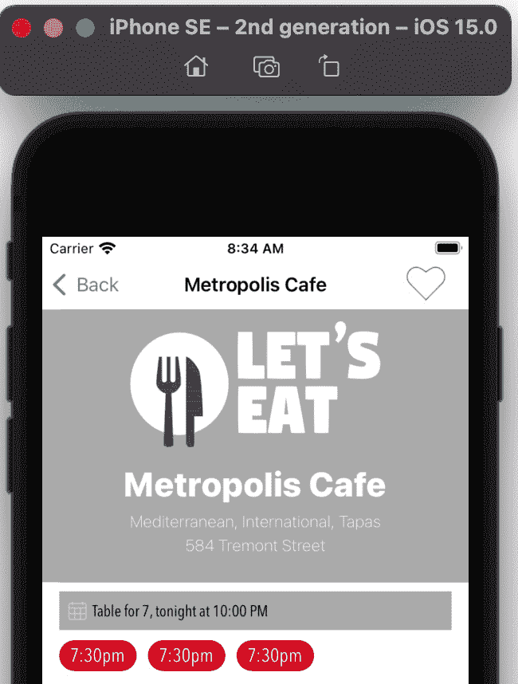
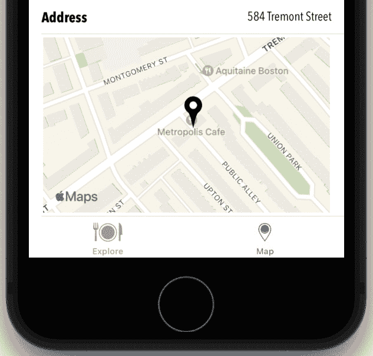

# 第十八章：*第十八章* 在静态表格视图中显示数据

你已经走得很远了，你的应用在所有屏幕上都有数据，除了餐厅详情屏幕。

在本章中，你将配置 `RestaurantDetailViewController` 类，以便在 `viewDidLoad()` 中管理视图，当从 `RestaurantListViewController` 和 `MapViewController` 实例将 `RestaurantItem` 实例传递到 `RestaurantDetailViewController` 实例时，将在餐厅详情屏幕上显示该 `RestaurantItem` 实例的数据。

到本章结束时，你将学会如何使静态单元格的表格视图显示数据，以及如何创建自定义地图图像。通过这样做，你将能够在自己的应用中实现这些功能。

本章将涵盖以下主题：

+   为 `RestaurantDetailViewController` 类设置出口

+   在静态表格视图中显示数据

+   将数据传递到 `RestaurantDetailViewController` 实例

# 技术要求

你将继续在上一章中修改的 `LetsEat` 项目上工作。

本章完成的 Xcode 项目位于本书代码包的 `Chapter18` 文件夹中，可以在此处下载：

[`github.com/PacktPublishing/iOS-15-Programming-for-Beginners-Sixth-Edition`](https://github.com/PacktPublishing/iOS-15-Programming-for-Beginners-Sixth-Edition)

查看以下视频，了解代码的实际效果：

[`bit.ly/3l2h6xq`](https://bit.ly/3l2h6xq)

让我们从在 `RestaurantDetailViewController` 类中创建出口开始，以便它能够管理餐厅详情屏幕中的视图。

# 为 RestaurantDetailViewController 类设置出口

你的应用在所有屏幕上都有数据，除了餐厅详情屏幕。这个屏幕可以通过在餐厅列表屏幕中点击餐厅或通过在地图屏幕中点击餐厅注释视图的呼出气泡按钮来访问。如果你构建并运行你的应用，点击餐厅列表屏幕中的餐厅会显示占位符餐厅详情屏幕：



Figure 18.1: iOS 模拟器显示占位符餐厅详情屏幕

在地图屏幕中餐厅注释视图的呼出气泡中的按钮上点击，会显示实际的餐厅详情屏幕，但它不包含任何餐厅数据：



Figure 18.2: iOS 模拟器显示餐厅详情屏幕

为了解决这个问题，让我们为 `RestaurantDetailViewController` 类设置出口。在项目导航器中点击 `RestaurantDetailViewController` 文件。在类声明之后和 `selectedRestaurant` 属性声明之前添加以下出口：

```swift
// Nav Bar
@IBOutlet var heartButton: UIBarButtonItem!
// Cell One
@IBOutlet var nameLabel: UILabel!
@IBOutlet var cuisineLabel: UILabel!
@IBOutlet var headerAddressLabel: UILabel!
// Cell Two
@IBOutlet var tableDetailsLabel: UILabel!
// Cell Three
@IBOutlet var overallRatingLabel: UILabel!
// Cell Eight
@IBOutlet var addressLabel: UILabel!
// Cell Nine
@IBOutlet var locationMapImageView: UIImageView!
```

你刚刚设置的出口如下：

+   `heartButton` 是导航栏中心形按钮的输出。你在这本书中不会使用它，但这是你可以稍后自己工作的内容。

+   `nameLabel` 是显示餐厅第一单元格中名称的标签的输出。

+   `cuisineLabel` 是显示餐厅第一单元格中提供的菜系的标签的输出。

+   `headerAddressLabel` 是显示餐厅第一单元格中地址的标签的输出。

+   `tableDetailsLabel` 是显示餐厅第二单元格中餐桌详情的标签的输出。

+   `overallRatingLabel` 是显示餐厅第三单元格中整体评分的标签的输出。你将在 *第二十一章* *理解核心数据* 中计算并设置此值。

+   `addressLabel` 是显示餐厅第八单元格中地址的标签的输出。

+   `locationMapImageView` 是显示餐厅第九单元格中位置地图的视图的输出。你将在本章后面编写生成此地图的方法。

现在你已经创建了输出，你将它们连接到 `RestaurantDetail` 故事板文件中的 UI 元素。按照以下步骤操作：

1.  在项目导航器中展开 `RestaurantDetail` 文件夹。点击 `RestaurantDetail` 故事板文件。然后，点击 `RestaurantDetailViewController` 类：

    图 18.3：餐厅详情视图控制器身份检查器设置

    注意，一旦设置类，视图控制器的名称将更改为 **餐厅详情视图控制器**。与 **位置视图控制器场景** 中的表格视图不同，**餐厅详情视图控制器场景** 中的表格视图具有静态单元格，这意味着单元格的数量不是根据模型对象的数据动态生成的。如文档大纲所示，有九个单元格，并且每个单元格都已经配置了适当的视图对象。在文档大纲中单击每个表格视图单元格将显示该单元格在编辑区域。

1.  点击连接检查器按钮。你将看到在 `RestaurantDetailViewController` 类中之前添加的所有输出：

    图 18.4：连接检查器显示 RestaurantDetailViewController 类的输出

1.  从 `heartButton` 输出拖动到导航栏中的心形图标：

    图 18.5：连接检查器显示 heartButton 输出

1.  `heartButton` 输出口现在已连接。注意，在文档大纲中，视图的描述将更改为 **Heart Button**：![图 18.6：文档大纲显示 Heart Button 视图

    ![img/Figure_18.06_B17469.jpg]

    图 18.6：文档大纲显示 Heart Button 视图

1.  点击最后一个 `locationMapImageView` 输出口，连接到最后单元格中的 **Image View**。注意，在文档大纲中，名称将从 **Image View** 更改为 **Location Map Image View**：![图 18.7：连接检查器显示 locationMapImageView 输出口

    ![img/Figure_18.07_B17469.jpg]

    图 18.7：连接检查器显示 locationMapImageView 输出口

1.  点击并拖动 `addressLabel` 输出口到第八单元格中的 **Label** 以连接它们。注意，在文档大纲中，名称将从 **Label** 更改为 **Address Label**：![图 18.8：连接检查器显示 addressLabel 输出口

    ![img/Figure_18.08_B17469.jpg]

    图 18.8：连接检查器显示 addressLabel 输出口

1.  点击第一个 `cuisineLabel` 输出口，连接到第一个单元格中的第二个 **Label**。注意，在文档大纲中，名称将从 **Label** 更改为 **Cuisine Label**：![图 18.9：连接检查器显示 cuisineLabel 输出口

    ![img/Figure_18.09_B17469.jpg]

    图 18.9：连接检查器显示 cuisineLabel 输出口

1.  从 `headerAddressLabel` 输出口拖动到第一个单元格中的第三个 **Label** 以连接它们。注意，在文档大纲中，名称将从 **Label** 更改为 **Header Address Label**：![图 18.10：连接检查器显示 headerAddressLabel 输出口

    ![img/Figure_18.10_B17469.jpg]

    图 18.10：连接检查器显示 headerAddressLabel 输出口

1.  从 `nameLabel` 输出口拖动到第一个单元格中的第一个 **Label** 以连接它们。注意，在文档大纲中，名称将从 **Label** 更改为 **Name Label**：![图 18.11：连接检查器显示 nameLabel 输出口

    ![img/Figure_18.11_B17469.jpg]

    图 18.11：连接检查器显示 nameLabel 输出口

1.  点击第三个 `overallRatingLabel` 输出口，连接到内部带有大黑 **0.0** 的 **Label**。注意，在文档大纲中，名称将从 **Label** 更改为 **Overall Rating Label**：![图 18.12：连接检查器显示 overallRatingLabel 输出口

    ![img/Figure_18.12_B17469.jpg]

    图 18.12：连接检查器显示 overallRatingLabel 输出口

1.  点击第二个 `tableDetailsLabel` 输出口，连接到第二个单元格中三个红色按钮上方的 **Label**。注意，在文档大纲中，名称将从 **Label** 更改为 **Table Details Label**：

![图 18.13：连接检查器显示 tableDetailsLabel 输出口

![img/Figure_18.13_B17469.jpg]

图 18.13：连接检查器显示 tableDetailsLabel 输出口

现在，`RestaurantDetailViewController`类的所有输出都已设置。在下一节中，你将修改`RestaurantDetailViewController`类以从`RestaurantListViewController`和`MapViewController`实例接收餐厅数据，并在**餐厅详情**屏幕中显示它。

# 在静态表格视图中显示数据

你已经成功将`RestaurantDetailViewController`类中的所有输出连接到用户界面元素，以填充输出。相反，你将编写自定义方法来完成此操作。按照以下步骤操作：

1.  在项目导航器中点击`RestaurantDetailViewController`文件。

1.  在现有的`import`语句之后添加导入`MapKit`框架的代码：

    ```swift
    import MapKit
    ```

    这是因为你将使用`MapKit`框架的属性和方法来生成一个地图图像，用于最后一个单元格中的图像视图。

1.  添加一个包含设置标签的`setupLabels()`方法的私有扩展，代码相当简单；它从`RestaurantItem`实例获取值并将它们放入`RestaurantDetailViewController`实例的输出中，除了`tableDetailsLabel`，它只是分配了一个字符串。

1.  在最后一个单元格中，你将显示一个地图图像。为此，你需要从地图区域生成图像，并将`locationMapImageLabel`输出设置为显示该图像。此图像还将显示你在`setupLabels()`和最后一个花括号之前使用的相同自定义注释图像：

    ```swift
    func createMap() {
       guard let annotation = selectedRestaurant, let long
       = annotation.long, let lat = annotation.lat else { 
          return 
       }
       let location = CLLocationCoordinate2D(latitude: 
       lat, longitude: long)
       takeSnapshot(with: location)
    }
    ```

    这个方法使用`selectedRestaurant`属性的`lat`和`long`属性创建一个`CLLocationCoordinate2D`实例，并将其分配给`location`。然后，它调用`takeSnapshot(with:)`方法，将`location`作为参数传递。

1.  你将看到一个错误，因为`takeSnapShot(with:)`尚未实现，所以请在`createMap()`函数之后添加以下代码以实现它：

    ```swift
    func takeSnapshot(with location:
    CLLocationCoordinate2D) {
       let mapSnapshotOptions = MKMapSnapshotter.Options()
       var loc = location
       let polyline = MKPolyline(coordinates: &loc, count:
       1 )
       let region = MKCoordinateRegion(polyline.
       boundingMapRect)
       mapSnapshotOptions.region = region 
       mapSnapshotOptions.scale = UIScreen.main.scale 
       mapSnapshotOptions.size = CGSize(width: 340, 
       height: 208) 
       mapSnapshotOptions.showsBuildings = true 
       mapSnapshotOptions.pointOfInterestFilter = 
       .includingAll
       let snapShotter = MKMapSnapshotter(options: 
       mapSnapshotOptions)
       snapShotter.start() { snapshot, error in 
          guard let snapshot = snapshot else {
             return 
          }
          UIGraphicsBeginImageContextWithOptions(
          mapSnapshotOptions.size, true, 0)
          snapshot.image.draw(at: .zero)
          let identifier = "custompin"
          let annotation = MKPointAnnotation()
          annotation.coordinate = location
          let pinView = MKPinAnnotationView(annotation: 
          annotation, reuseIdentifier: identifier) 
          pinView.image = UIImage(named: "custom-
          annotation")! 
          let pinImage = pinView.image
          var point = snapshot.point(for: location)
          let rect = self.locationMapImageView.bounds 
          if rect.contains(point) { 
             let pinCenterOffset = pinView.centerOffset
             point.x -= pinView.bounds.size.width / 2
             point.y -= pinView.bounds.size.height / 2
             point.x += pinCenterOffset.x
             point.y += pinCenterOffset.y
             pinImage?.draw(at: point)
          }
          if let image = 
          UIGraphicsGetImageFromCurrentImageContext() {
             UIGraphicsEndImageContext() 
             DispatchQueue.main.async {
                self.locationMapImageView.image = image
             }
          }
       }
    }
    ```

    这个方法的完整描述超出了本书的范围，但这里是对其功能的简单解释。给定一个位置，它在该位置拍摄地图的快照，并将你之前在`RestaurantDetailViewController`实例的`locationMapImageView`输出中使用的自定义注释添加到地图上。

1.  你已经在`setupLabels()`方法定义之前的`private`扩展中编写了所有必需的方法，以在`RestaurantDetailViewController`类中显示所需的`RestaurantItem`实例详细信息，添加一个调用`setupLabels()`和`createMap()`方法的`initialize()`方法：

    ```swift
    func initialize() { 
       setupLabels() 
       createMap()
    }
    ```

1.  修改`viewDidLoad()`方法，在`RestaurantDetailViewController`实例加载其视图时调用`initialize()`方法：

    ```swift
    override func viewDidLoad() { 
       super.viewDidLoad() 
       initialize()
    }
    ```

回想一下，在 *第十六章*，*使用 MapKit 入门*，你已经配置了 `MapViewController` 类，以便将 `RestaurantItem` 实例传递到 `RestaurantDetailViewController` 实例。构建并运行你的应用，转到 **地图** 屏幕。点击其中一个餐厅以显示呼出气泡。点击呼出气泡中的按钮，你应该在 **餐厅详情** 屏幕中看到餐厅详情：



图 18.14：iOS 模拟器显示餐厅详情屏幕

如果你向下滚动，你将看到最后一个单元格中的地图图像：



图 18.15：iOS 模拟器显示餐厅详情屏幕中的地图

你已经完成了对 `RestaurantDetailViewController` 类的修改，但你仍然需要从 `RestaurantListViewController` 实例将选中的 `RestaurantItem` 实例传递到 `RestaurantDetailViewController` 实例。你将在下一节中这样做。

# 将数据传递给 RestaurantDetailViewController 实例

你已经添加并连接了 `RestaurantDetailViewController` 类的输出端口。你还在这个类中添加了代码，从 `RestaurantItem` 实例获取餐厅数据，并使用它来填充其输出端口。你需要做的最后一件事是将选中的 `RestaurantItem` 实例从 `RestaurantListViewController` 实例传递到 `RestaurantDetailViewController` 实例。按照以下步骤操作：

1.  在项目导航器中点击 `RestaurantListViewController` 文件。

1.  在 `viewDidLoad()` 之后添加以下代码：如果过渡标识符是 `showDetail`，则调用 `showRestaurantDetail(segue:)` 方法：

    ```swift
    override func prepare(for segue: UIStoryboardSegue, 
    sender: Any?) {
       if let identifier = segue.identifier {
          switch identifier {
          case Segue.showDetail.rawValue:
             showRestaurantDetail(segue: segue)
          default:
             print("Segue not added")
          }
       }
    }
    ```

    回想一下，你在 `RestaurantListViewController` 实例过渡到另一个视图控制器时添加了一个过渡，过渡标识符被检查。如果过渡标识符是 `showDetail`，则执行 `showRestaurantDetail` 方法。只有 `showDetail` 标识符之间的过渡，所以目标视图控制器必须是 `RestaurantDetailViewController` 实例。

1.  你会看到一个错误，因为 `showRestaurantDetail(segue:)` 方法尚未实现。此方法将从 `RestaurantListViewController` 实例传递 `RestaurantItem` 实例到 `RestaurantDetailViewController` 实例。在 `RestaurantListViewController` 类的 `private` 扩展的开头大括号之后添加它：

    ```swift
    func showRestaurantDetail(segue: UIStoryboardSegue) {
       if let viewController = segue.destination as? 
       RestaurantDetailViewController, let indexPath = 
       collectionView.indexPathsForSelectedItems?.first {
          selectedRestaurant = manager.restaurantItem(at:
          indexPath.row)
          viewController.selectedRestaurant = 
          selectedRestaurant
       }
    }
    ```

    这种方法首先检查过渡目标是否是 `RestaurantDetailViewController` 的实例，并获取被点击的集合视图单元格的索引。然后，`manager` 返回存储在该索引处的 `RestaurantItem` 实例，并将其分配给 `selectedRestaurant`。然后，将 `RestaurantDetailViewController` 实例的 `selectedRestaurant` 属性设置为这个实例。

现在我们来看看`Main`故事板文件。它目前连接到一个占位符`Main`故事板文件，以删除占位符并连接到`RestaurantDetail`故事板文件。按照以下步骤操作：

1.  点击`Main`故事板文件，在文档大纲中找到`restaurantCell`。然后，*Ctrl + Drag*从`restaurantCell`到`RestaurantDetail`故事板引用（你在*第十六章**，使用 MapKit 入门）中，如图所示：![图 18.16：编辑区域显示 RestaurantDetail 故事板引用

    ![img/Figure_18.16_B17469.jpg]

    图 18.16：编辑区域显示 RestaurantDetail 故事板引用

1.  从出现的弹出菜单中选择**显示**：![图 18.17：带有“显示选中”的切换弹出菜单

    ![img/Figure_18.17_B17469.jpg]

    图 18.17：带有“显示选中”的切换弹出菜单

1.  通过选择它们并在键盘上按*Delete*键来从故事板中删除占位符场景，因为它们不再需要：![图 18.18：编辑区域显示要删除的占位符场景

    ![img/Figure_18.18_B17469.jpg]

    图 18.18：编辑区域显示要删除的占位符场景

1.  你将设置切换标识符为`showDetail`。如前所述，这将设置`RestaurantDetailViewController`实例的`selectedRestaurant`属性。选择你刚刚添加的切换：![图 18.19：餐厅列表视图控制器场景和 RestaurantDetail 故事板引用之间的切换

    ![img/Figure_18.19_B17469.jpg]

    图 18.19：餐厅列表视图控制器场景和 RestaurantDetail 故事板引用之间的切换

1.  点击属性检查器按钮。在`showDetail`下：

![图 18.20：为 showDetail 切换设置的属性检查器

![img/Figure_18.20_B17469.jpg]

图 18.20：为 showDetail 切换设置的属性检查器

构建并运行你的项目。选择一个城市和一种菜系。点击**餐厅列表**屏幕中的其中一家餐厅。该餐厅的详细信息将出现在**餐厅详情**屏幕中：

![图 18.21：iOS 模拟器显示餐厅详情屏幕

![img/Figure_18.21_B17469.jpg]

图 18.21：iOS 模拟器显示餐厅详情屏幕

**餐厅详情**屏幕的实现现在已经完成。当你从**地图**或**餐厅列表**屏幕中选择一家餐厅时，该餐厅的详细信息将在**餐厅详情**屏幕中显示。太棒了！

# 摘要

在本章中，你将`RestaurantDetailViewController`类中的出口连接到`viewDidLoad()`，以便在从`RestaurantListViewController`和`MapViewController`实例到`RestaurantDetailViewController`实例的`RestaurantItem`实例时填充表格视图，使其能够在**餐厅详情**屏幕上显示该`RestaurantItem`实例的数据。

通过这样做，您已经学会了如何制作静态单元格的表格视图来显示数据，以及如何创建自定义地图图像，现在您可以在自己的应用中实现这些功能。

恭喜！您应用中的所有屏幕现在都显示数据了。然而，如果您查看**餐厅详情**屏幕，会发现没有餐厅的评分、评论或照片，也没有添加它们的方法。您将从下一章开始实现这一功能，在那里您将创建一个自定义控件，允许您为**餐厅详情**和**评论表单**屏幕添加餐厅的星级评分。
