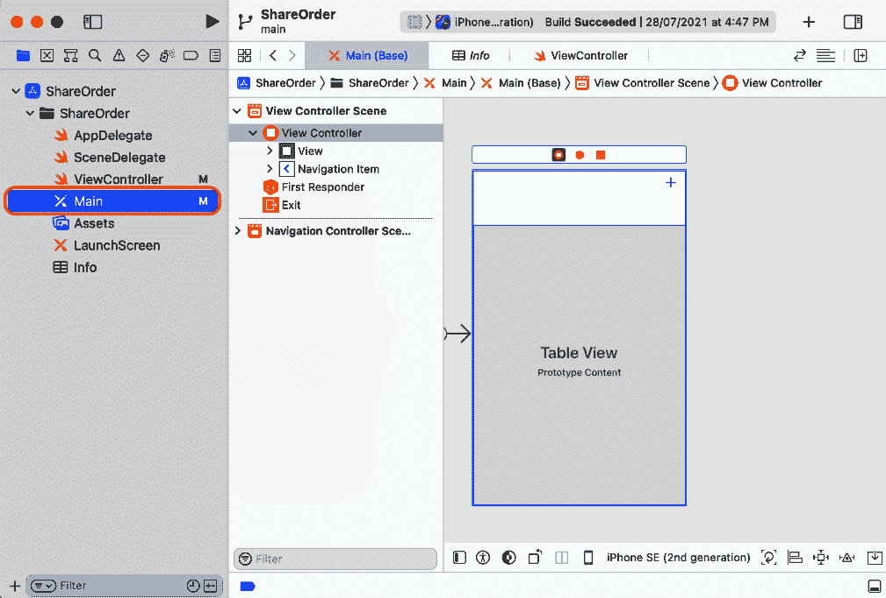
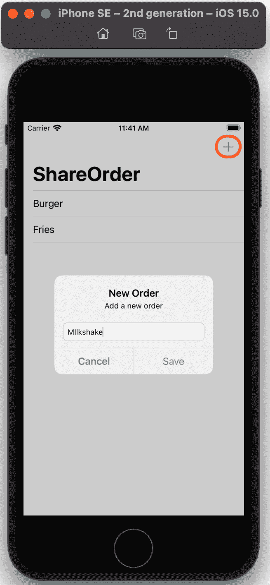
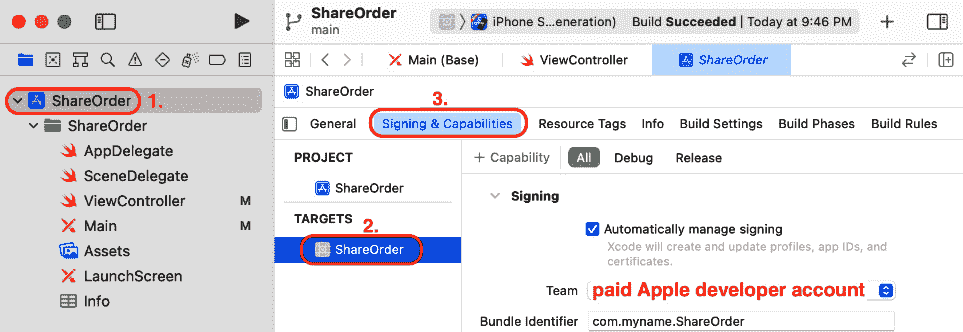
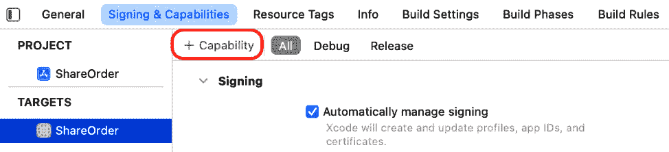
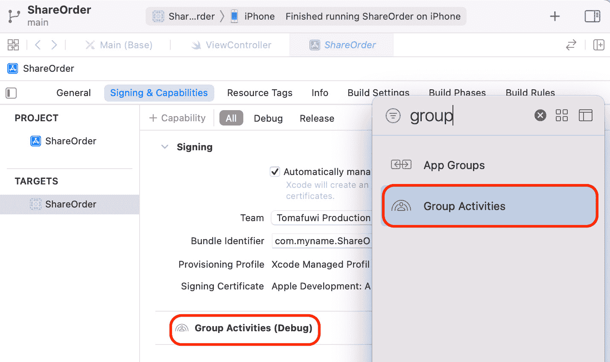
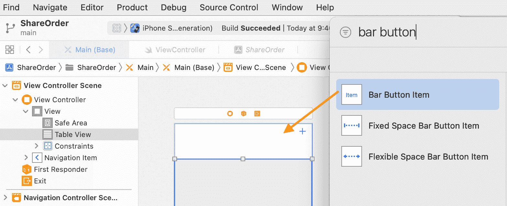
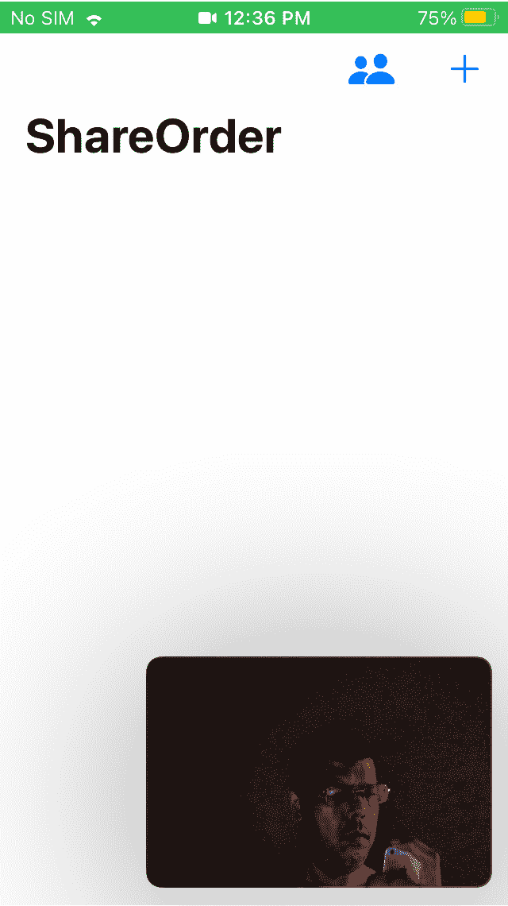
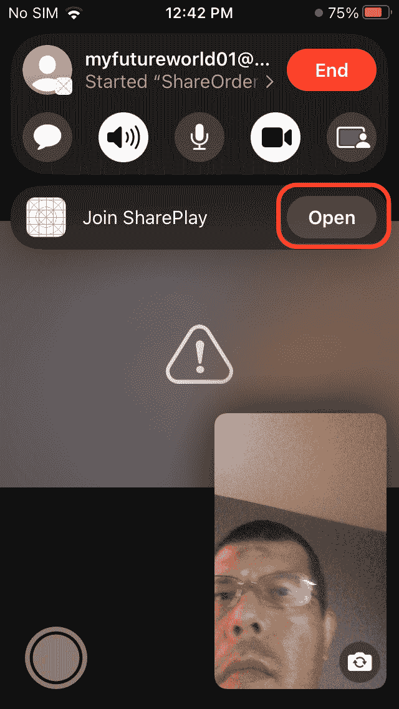
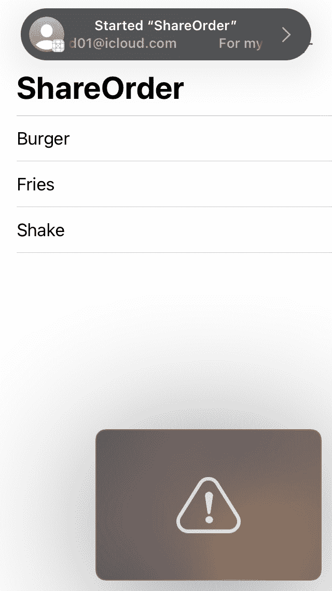

# 第二十五章：*第二十五章*：SharePlay 入门

苹果公司在 2021 年的 WWDC 上推出了 **SharePlay**，该功能允许用户通过将您的应用集成到 FaceTime 中使用 **Group Activities** 框架来共享体验。

在本章中，您将通过向其中添加 Group Activities 支持来实现 SharePlay 的示例应用。您将从学习 SharePlay 的工作原理开始。接下来，您将使用 Group Activities 框架探索您将添加 SharePlay 支持的应用。然后，您将学习如何为该应用创建自定义群组活动以及如何管理群组活动会话。最后，您将使用两台 iOS 设备在应用中测试 SharePlay 体验。

到本章结束时，您将了解 SharePlay 的工作原理以及如何更新您的应用以使用它。

将涵盖以下主题：

+   理解 SharePlay

+   探索 *ShareOrder* 应用

+   创建自定义群组活动

+   管理群组活动会话

+   在 *ShareOrder* 应用中测试 SharePlay

# 技术要求

您将在名为 *ShareOrder* 的示例应用中实现和测试 Group Activities 框架。您将需要一个付费的 Apple 开发者账户，以及至少两台安装了 iOS 15.1 或更高版本的 iOS 设备，并安装了 *ShareOrder* 应用。您还可以使用一台安装了 macOS 12.1 或更高版本的 Mac 和一台安装了 iOS 15.1 或更高版本的 iOS 设备。

本章的完成 Xcode 项目位于本书代码包的 `Chapter25` 文件夹中，可以在此处下载：

[`github.com/PacktPublishing/iOS-15-Programming-for-Beginners-Sixth-Edition`](https://github.com/PacktPublishing/iOS-15-Programming-for-Beginners-Sixth-Edition)

查看以下视频以查看代码的实际运行情况：

[`bit.ly/3I9zb6Y`](https://bit.ly/3I9zb6Y)

让我们从下一节开始学习 SharePlay。

# 理解 SharePlay

SharePlay 是苹果公司在 2021 年的 WWDC 上推出的。它允许 FaceTime 会话中的参与者共享用户体验。例如，一个用户可能希望与另一个用户一起观看视频。用户需要做的只是与另一个用户进行 FaceTime 通话，启动视频应用，并启动 SharePlay。相同的应用将为另一个用户启动并播放相同的视频，SharePlay 确保视频在两个用户之间保持同步。

您还可以创建自定义 SharePlay 体验。一个例子是在 2021 年的 WWDC 上展示的 *DrawTogether* 应用。在演示中，三个用户最初加入了一个 FaceTime 会话。一个用户启动了 *DrawTogether* 应用，并在应用中启动了 SharePlay 会话。其他用户看到了一个包含 **加入** 按钮的 SharePlay 提示。当按下 **加入** 按钮时，*DrawTogether* 应用将为其他用户启动，用户在屏幕上绘制的任何内容都会出现在其他用户的屏幕上。

重要信息

您可以在此处查看`*DrawTogether*`应用程序的工作原理及其实现方式：[`developer.apple.com/videos/play/wwdc2021/10187`](https://developer.apple.com/videos/play/wwdc2021/10187).

您可以在此处下载`*DrawTogether*`应用程序：[`developer.apple.com/documentation/groupactivities/drawing_content_in_a_group_session`](https://developer.apple.com/documentation/groupactivities/drawing_content_in_a_group_session).

SharePlay 由 Group Activities 框架提供支持。此框架使用 FaceTime 来同步应用程序的活动，并邀请其他参与者加入这些活动。表示共享活动的对象必须遵守`GroupActivity`协议。在群组活动开始后，使用`GroupSession`对象在所有参与者之间同步应用程序行为。

重要信息

您可以在此处找到 WWDC 2021 期间所有与 Apple 的 Group Activities 相关的视频链接：

[`developer.apple.com/videos/wwdc2021/?q=group%20activities`](https://developer.apple.com/videos/wwdc2021/?q=group%20activities)

您可以在此处阅读 Apple 的 Group Activities 文档：

[`developer.apple.com/documentation/GroupActivities`](https://developer.apple.com/documentation/GroupActivities)

在本章中，您将通过以下步骤在名为`*ShareOrder*`的示例应用程序中实现 Group Activities 框架：

1.  将 Group Activities 功能添加到`*ShareOrder*`应用程序中。

1.  创建并配置一个遵守`GroupActivity`协议的`*ShareOrder*`结构。此结构将包含描述群组活动的元数据。

1.  使用一个按钮配置`*ShareOrder*`应用程序的用户界面以激活群组活动。

1.  实现一个允许您的应用程序加入群组活动会话的`GroupSession`对象。

1.  实现一个允许您的应用程序发送和接收消息的`GroupSessionMessenger`对象。这些消息用于同步用户在应用程序中的操作。

在这样做之前，让我们看看下一节中`*ShareOrder*`应用程序是如何工作的。

# 探索`ShareOrder`应用程序

您将要工作的应用程序`*ShareOrder*`是一个简单的应用程序，用于记录和显示您在餐厅想要订购的内容。让我们构建并运行此应用程序以查看其工作原理。请按照以下步骤操作：

1.  如果您还没有这样做，请在此链接下载本书的代码包中的`Chapter25`文件夹：[`github.com/PacktPublishing/iOS-15-Programming-for-Beginners-Sixth-Edition`](https://github.com/PacktPublishing/iOS-15-Programming-for-Beginners-Sixth-Edition).

1.  打开`Chapter25`文件夹，您将看到两个文件夹，`ShareOrder-start`和`ShareOrder-complete`。第一个文件夹包含您在本课中将要修改的应用程序，第二个文件夹包含完成的应用程序。

1.  打开 `ShareOrder-start` 文件夹并打开 `ShareOrder` Xcode 项目。在项目导航器中点击 `Main` 故事板文件。你应该在导航栏中看到一个 **+** 按钮，以及填充其余屏幕的表格视图。

    图 25.1：显示 Main 故事板文件的 ShareOrder 应用

    应用启动时将显示一个显示空表格视图的屏幕。点击 **+** 按钮将弹出一个对话框，允许你输入一个订单，然后该订单将出现在表格视图中。

1.  在项目导航器中点击 `ViewController` 文件。你应该在编辑器区域看到以下代码：

    ```swift
    import UIKit
    class ViewController: UIViewController {
       var orders: [String] = []
       @IBOutlet var tableView: UITableView!
       override func viewDidLoad() {
          super.viewDidLoad()
          title = "ShareOrder"
          tableView.register(UITableViewCell.self, 
          forCellReuseIdentifier: "orderCell")
       }
       @IBAction func addOrder(_ sender: UIBarButtonItem)
       {
          let alert = UIAlertController(title: "New
          Order", message: "Add a new order", 
          preferredStyle: .alert)
          let saveAction = UIAlertAction(title: "Save", 
          style: .default) {
             [unowned self] action in
             guard let textField = 
             alert.textFields?.first, 
             let orderToSave = textField.text else {
                return
             }
             self.orders.append(orderToSave)
             self.tableView.reloadData()
          }
          let cancelAction = UIAlertAction(title: 
          "Cancel", style: .cancel)
          alert.addTextField()
          alert.addAction(saveAction)
          alert.addAction(cancelAction)
          present(alert, animated: true)
       }
    }
    extension ViewController: UITableViewDataSource {
       func tableView(_ tableView: UITableView, 
       numberOfRowsInSection section: Int) -> Int {
          orders.count
       }
       func tableView(_ tableView: UITableView, 
       cellForRowAt indexPath: IndexPath) -> 
       UITableViewCell {
          let cell = tableView.dequeueReusableCell
          (withIdentifier: "orderCell", for: indexPath)
          cell.textLabel?.text = orders[indexPath.row]
          return cell
       }
    }
    ```

    让我们分解一下：

    ```swift
    var orders: [String] = []
    ```

    此属性包含一个订单数组，其类型为 `String`。此数组将是应用中表格视图的数据源。

    ```swift
    @IBOutlet var tableView: UITableView!
    ```

    此出口连接到 `Main` 故事板文件中视图控制器场景中的表格视图。

    `viewDidLoad()` 方法：

    此方法中的代码将导航栏的标题设置为 `ShareOrder`，并为表格视图单元格注册重用标识符 `orderCell`。

    `addOrder(_:)` 方法：

    此方法连接到 `orders` 数组并重新加载表格视图。点击 `orders` 数组。表格视图中的每个单元格将显示 `orders` 数组中的对应字符串。

    小贴士

    你可能希望回顾 *第十五章**，开始使用表格视图，*，它更详细地介绍了表格视图数据源方法。

构建并运行应用。点击 **+** 按钮，在警告框的文本字段中输入一些文本，然后点击 **保存**。它将出现在表格视图中，如下所示：



图 25.2：运行 ShareOrder 应用的 iOS 模拟器

现在你已经熟悉了 *ShareOrder* 应用及其工作原理，你将为它添加群组活动支持。完成此操作后，在 SharePlay 会话中添加订单将使订单出现在所有参与者的屏幕上。你将在下一节中创建一个用于 *ShareOrder* 应用的自定义群组活动。

# 创建自定义群组活动

你已经看到 *ShareOrder* 应用允许你添加将在屏幕上显示的订单。你将为该应用添加一个群组活动，允许参与者在 SharePlay 会话中添加订单，这些订单将出现在每个参与者的屏幕上。需要一个自定义对象来表示此活动。实现此功能所需的步骤如下：

+   将群组活动权限添加到 *ShareOrder* 应用中。

+   创建一个名为 `ShareOrder` 的新结构，使其符合 `GroupActivity` 协议，并配置群组活动元数据。

+   在 *ShareOrder* 应用的用户界面中添加一个按钮，并为该按钮添加一个动作以激活群组活动。

    重要信息

    您可以通过此链接了解有关创建自定义组活动的更多信息：[`developer.apple.com/documentation/groupactivities/inviting-participants-to-share-an-activity`](https://developer.apple.com/documentation/groupactivities/inviting-participants-to-share-an-activity).

让我们从将组活动权限添加到 *ShareOrder* 应用程序开始。

## 添加组活动权限

因为您的应用将在不同设备之间进行交互，所以它必须具有 `com.apple.developer.group-session` 权限。您将使用 Xcode 将此权限添加到您的应用中。请注意，您需要付费的 Apple 开发者账户才能完成此操作。请按照以下步骤操作：

1.  在项目导航器中单击 `ShareOrder` 项目（项目导航器中最顶部的项目）并单击 `ShareOrder` 目标。在编辑区域中选择 **签名与能力** 选项卡。验证是否已将 **团队** 设置为付费的 Apple 开发者账户。

    图 25.3：Xcode 签名与能力选项卡，已设置账户

    小贴士

    在 *第一章**，熟悉 Xcode* 中提供了如何设置开发团队以及在 iOS 设备上运行您的应用的说明。

    在 *第二十六章**，测试并将您的应用提交到 App Store* 中提供了如何获取付费 Apple 开发者账户的说明。

1.  将运行 iOS 15 的 iOS 设备连接到您的计算机，并验证 *ShareOrder* 应用程序是否可以在您的设备上运行。

1.  在 **签名和能力** 选项卡中，单击 **+** 按钮以向 *ShareOrder* 应用程序添加能力。

    图 25.4：Xcode 签名和能力选项卡，突出显示 + 按钮

1.  在出现的窗口中，搜索并双击组活动功能以将其添加到 *ShareOrder* 应用程序：



图 25.5：将组活动功能添加到 ShareOrder 应用程序

您已将组活动权限添加到 *ShareOrder* 应用程序。接下来，您将在下一节中创建一个 `ShareOrder` 结构来表示组活动。

## 创建 ShareOrder 结构

您将为 *ShareOrder* 应用程序实现的活动将使在 SharePlay 会话期间添加的订单出现在所有参与者的屏幕上。您需要一个对象来表示此活动。您将通过创建一个 `ShareOrder` 结构来实现此对象。此结构将遵循 `GroupActivity` 协议，并包含描述活动的元数据。要创建和配置 `ShareOrder` 结构，请按照以下步骤操作：

1.  在项目导航器中单击 `ViewController` 文件，并按如下所示导入 `GroupActivities` 框架：

    ```swift
    import UIKit
    import GroupActivities
    ```

1.  在最后一个花括号之后添加以下扩展来创建和配置`ShareOrder`结构：

    ```swift
    extension ViewController {
       struct ShareOrder: GroupActivity {
          var metadata: GroupActivityMetadata {
             var metadata = GroupActivityMetadata()
             metadata.title = NSLocalizedString("Share 
             Order", comment: "Title of group activity")
             metadata.type = .generic
             return metadata
          }
       }
    }
    ```

此结构表示*ShareOrder*应用的共享体验。它符合`GroupActivity`协议，该协议提供上下文和元数据以启动活动相关的会话。在此，您使用名为`metadata`的计算属性来设置元数据标题和注释。对于自定义活动，元数据类型设置为`.generic`。

您已创建并配置了`ShareOrder`结构。在下一节中，您将在*ShareOrder*应用的用户界面中添加一个按钮，并配置此按钮以便在 FaceTime 会话期间激活群组活动。

## 激活自定义群组活动

您已创建并配置了用于表示*ShareOrder*应用自定义群组活动的`ShareOrder`结构。现在，您将在*ShareOrder*应用的导航栏中添加一个按钮，以便在与其他参与者进行 FaceTime 会话时激活此群组活动。按照以下步骤操作：

1.  在项目导航器中点击`Main`故事板文件，然后点击图书馆按钮。

1.  在图书馆的筛选字段中，搜索一个**栏按钮项**对象并将其拖动到**+**按钮旁边的导航栏中：

    图 25.6：选择栏按钮项的图书馆

1.  在选择栏按钮项后，点击属性检查器按钮。在`person.2.fill`下：

    图 25.7：属性检查器显示设置为 person.2.fill 的栏按钮项

    这设置了栏按钮项的图标。

1.  点击调整编辑器选项按钮并选择`ViewController`文件将出现在辅助编辑器中。

1.  从您刚刚添加的栏按钮项**控制+拖动**到辅助编辑器中`addOrder(_:)`方法之前。

    将会出现一个弹出对话框。

1.  在`activateGroupActivity`中点击**连接**：

    图 25.8：名称设置为 activateGroupActivity 的弹出对话框

1.  将以下代码添加到`activateGroupActivity(_:)`方法中，以便在点击栏按钮项时激活群组活动：

    ```swift
    @IBAction func activateGroupActivity(_ sender: Any) {
       Task {
          do {
             try await ShareOrder().activate()
          } catch {
             print("Unable to activate")
          }
       }
    }
    ```

    这将向 FaceTime 会话中的所有参与者显示一个带有**加入**按钮的 SharePlay 提示。

1.  点击**x**按钮关闭辅助编辑器。

您刚刚添加了一个按钮，当点击时将激活您的群组活动。在下一节中，您将学习如何在*ShareOrder*应用中管理群组活动会话。

# 管理群组活动会话

你已经创建了`ShareOrder`结构来表示`*ShareOrder*`应用的组活动，并且你已经在应用的导航栏中添加了一个按钮，用于在 FaceTime 会话期间激活组活动。现在你需要添加代码以允许参与者加入这个组活动会话，并使所有参与者保持同步。实现此功能所需的步骤如下：

+   创建一个允许应用加入组活动会话的`GroupSession`对象。

+   创建一个允许应用发送和接收消息以同步内容的`GroupSessionMessenger`对象。

    重要信息

    你可以通过此链接了解更多关于会话管理的信息：[`developer.apple.com/documentation/groupactivities/joining-your-app-to-a-shared-activity`](https://developer.apple.com/documentation/groupactivities/joining-your-app-to-a-shared-activity)。

让我们看看如何在下一节中实现和配置`*ShareOrder*`应用的`GroupSession`对象。

## 实现一个`GroupSession`对象

当前`*ShareOrder*`应用中有一个表示组活动的对象，以及一个在 FaceTime 会话期间激活组活动的按钮。你将在你的应用中添加代码以实现一个`GroupSession`对象，这将允许参与者加入组活动会话。为了为`*ShareOrder*`应用实现和配置`GroupSession`对象，请按照以下步骤操作：

1.  在项目导航器中点击`ViewController`文件。在`orders`属性之后添加一个可选属性来保存组活动会话的实例：

    ```swift
    var orders: [String] = [] 
    var groupSession: GroupSession<ShareOrder>?
    ```

1.  将以下代码添加到`viewDidLoad()`中，以创建一个异步任务来接收一个组会话：

    ```swift
    override func viewDidLoad() {
       super.viewDidLoad()
       title = "ShareOrder"
       tableView.register(UITableViewCell.self, 
       forCellReuseIdentifier: "orderCell")
    Task is a unit of asynchronous work, and is covered in *Chapter 24*, *Getting Started with Swift Concurrency*.You'll see an error because `configureGroupSession(_:)` has not yet been implemented.
    ```

1.  将以下代码添加到`ShareOrder`结构定义之后的扩展中，以实现`configureGroupSession(_:)`方法：

    ```swift
    func configureGroupSession(_ groupSession: 
    GroupSession<ShareOrder>) {
       orders.removeAll()
       self.groupSession = groupSession
    }
    ```

    此方法会移除`orders`数组中的所有订单，然后将接收到的组活动会话分配给`groupSession`属性。

1.  通过添加代码来修改`configureGroupSession(_:)`方法，以便加入组活动会话：

    ```swift
    func configureGroupSession(_ groupSession: 
    GroupSession<ShareOrder>){
       orders.removeAll()
       self.groupSession = groupSession
       ShareOrder project at this point.
    ```

现在你已经实现和配置了`GroupSession`对象，你将在下一节中实现和配置`*ShareOrder*`应用的`GroupSessionMessenger`对象。

## 实现一个`GroupSessionMessenger`对象

当`*ShareOrder*`应用的用户加入 SharePlay 会话后，他们添加到应用中的任何订单都会出现在每个人的屏幕上。这种同步由一个`GroupSessionMessenger`对象处理，该对象可以向组活动会话中的其他设备发送和接收消息。请注意，保持消息大小较小非常重要，因为大的消息大小可能会导致应用崩溃。对于此应用，消息将仅包含提交的订单的字符串，这将相当小。为了为`*ShareOrder*`应用实现`GroupSessionMessenger`对象，请按照以下步骤操作：

1.  在`ViewController`文件中，在`groupSession`属性之后添加一个新的可选属性以保存`GroupSessionMessenger`的一个实例：

    ```swift
    var groupSession: GroupSession<ShareOrder>?
    var messenger: GroupSessionMessenger?
    ```

1.  修改`configureGroupSession(_:)`方法以创建`GroupSessionMessenger`的一个实例并将其分配给`messenger`属性：

    ```swift
    func configureGroupSession(_ groupSession: 
    GroupSession<ShareOrder>){
       orders.removeAll()
       self.groupSession = groupSession
    let messenger = GroupSessionMessenger(session: 
       groupSession)
       self.messenger = messenger
       groupSession.join()
    }
    ```

1.  在`messenger`属性赋值后添加一个异步任务以接收`GroupSessionMessenger`消息：

    ```swift
    let messenger = GroupSessionMessenger(session: 
    groupSession)
    self.messenger = messenger
    GroupSessionMessenger message contains a string representing an order. You will implement a handle(_:) method and pass the message to this method to be processed. You'll see an error because the handle(_:) method has not yet been implemented.
    ```

1.  在`configureGroupSession(_:)`方法之后实现`handle(_:)`方法，如下所示：

    ```swift
    func handle(_ message: String) {
       self.orders.append(message)
       self.tableView.reloadData()
    }
    ```

    此方法将消息中的字符串追加到`orders`数组中，并重新加载表格视图。

1.  修改`addOrder(_:)`方法如下，以便在参与者点击**+**按钮时发送`GroupSessionMessenger`消息：

    ```swift
    self.orders.append(orderToSave)
    if let messenger = messenger {
       Task {
          do {
             try await messenger.send(orderToSave)
          } catch {
             print("Failed to send")
          }
       }
    }
    self.tableView.reloadData()
    ```

您添加到`addOrder(_:)`方法中的代码创建了一个异步任务，该任务将包含订单的消息发送给 FaceTime 会话中的所有其他参与者。当消息被接收时，它将由`handle(_:)`方法处理，该方法将订单添加到`orders`数组中并重新加载表格视图。

在您的 iOS 15 设备上构建和运行*ShareOrder*应用。它应该像之前一样工作。在下一节中，您将通过使用 FaceTime 会话中的两台 iOS 设备来测试*ShareOrder*应用中的 SharePlay 功能。

# 在 ShareOrder 应用中测试 SharePlay

您已经添加了实现 SharePlay 所需的所有代码。为了测试它，您需要两台运行 iOS 15.1 或更高版本的 iOS 设备，并且已安装*ShareOrder*应用。您也可以使用运行 macOS 12.1 Monterey 或更高版本的 Mac 作为其中一台设备。您将在两台设备之间启动 FaceTime 会话并启动 SharePlay 会话。您应该能够从任何设备添加订单，并且您添加的任何订单都将出现在两个屏幕上。按照以下步骤操作：

1.  在您的第二台 iOS 设备上安装*ShareOrder*应用。

1.  在两台设备之间启动 FaceTime 通话并在第一台设备上启动*ShareOrder*应用。

    图 25.9：在 FaceTime 通话期间在第一台设备上运行 ShareOrder

1.  点击按钮以激活群组活动。您应该在第二台设备上看到一个 SharePlay 提示。

    图 25.10：在第一台设备上点击按钮会在第二台设备上触发 SharePlay 提示

1.  在 SharePlay 提示中点击**加入**按钮，*ShareOrder*应用将在第二台设备上启动。使用**+**按钮添加一个订单，它将出现在两台设备的屏幕上。



图 25.11：相同的订单出现在两台设备上

恭喜！您已经在*ShareOrder*应用中实现了 SharePlay 功能！

# 摘要

在本章中，您通过向*ShareOrder*应用添加群组活动支持来实现 SharePlay 功能。

你首先学习了 SharePlay 的工作原理。接下来，你探索了 *ShareOrder* 应用程序以了解其工作方式。之后，你为该应用程序创建了一个自定义的群组活动，并添加了代码来管理群组活动会话。最后，你使用两台 iOS 设备在应用程序中测试了 SharePlay 体验。

现在，你已经了解了 SharePlay 的基础知识，并将能够将自定义群组活动添加到自己的应用程序中。

在下一章中，你将学习如何测试并将你的应用程序提交到 App Store。
