# 第二章：简单值和类型

现在你已经在前一章中对 Xcode 进行了简要的浏览，让我们来看看你将用来编写应用的 Swift 编程语言。

首先，你将探索 **Swift 游乐场**，这是一个交互式环境，你可以在此处输入 Swift 代码，并立即显示结果。然后，你将学习 Swift 如何表示和存储各种类型的数据。之后，你将了解一些酷炫的 Swift 功能，例如 **类型推断** 和 **类型安全**，这些功能可以帮助你更简洁地编写代码并避免常见错误。最后，你将学习如何对数据进行常见操作以及如何将消息打印到调试区域以帮助你解决问题。

到本章结束时，你应该能够编写简单的程序来存储和处理字母和数字。

以下主题将涵盖：

+   介绍 Swift 游乐场

+   探索数据类型

+   探索常量和变量

+   理解类型推断和类型安全

+   探索运算符

+   使用 `print()` 语句

    要了解 Swift 语言最新版本的信息，请访问 [`docs.swift.org/swift-book/documentation/the-swift-programming-language/`](https://docs.swift.org/swift-book/documentation/the-swift-programming-language/)。

# 技术要求

要完成本章的练习，你需要以下内容：

+   运行 macOS 14 Sonoma 或 macOS 15 Sequoia 的苹果 Mac 电脑

+   已安装 Xcode 16（有关安装 Xcode 的说明，请参阅 *第一章*，*探索 Xcode*）

本章节的 Xcode 游乐场位于本书代码包的 `Chapter02` 文件夹中，可在此处下载：

[`github.com/PacktPublishing/iOS-18-Programming-for-Beginners-Ninth-Edition`](https://github.com/PacktPublishing/iOS-18-Programming-for-Beginners-Ninth-Edition%0D)

观看以下视频以查看代码的实际效果：

[`youtu.be/lSBD_Wacpdc`](https://youtu.be/lSBD_Wacpdc%0D)

在下一节中，你将创建一个新的游乐场，你可以在其中输入本章中展示的代码。

# 介绍 Swift 游乐场

游乐场是交互式编码环境。你在左侧面板中输入代码，结果会立即在右侧面板中显示。这是一种很好的实验代码和探索 iOS SDK 的方法。

SDK 是软件开发工具包的缩写。要了解更多关于 iOS SDK 的信息，请访问 [`developer.apple.com/ios/`](https://developer.apple.com/ios/)。

让我们从创建一个新的游乐场并检查其用户界面开始。按照以下步骤操作：

1.  要创建游乐场，启动 Xcode 并从 Xcode 菜单栏中选择 **文件** | **新建** | **游乐场...**：

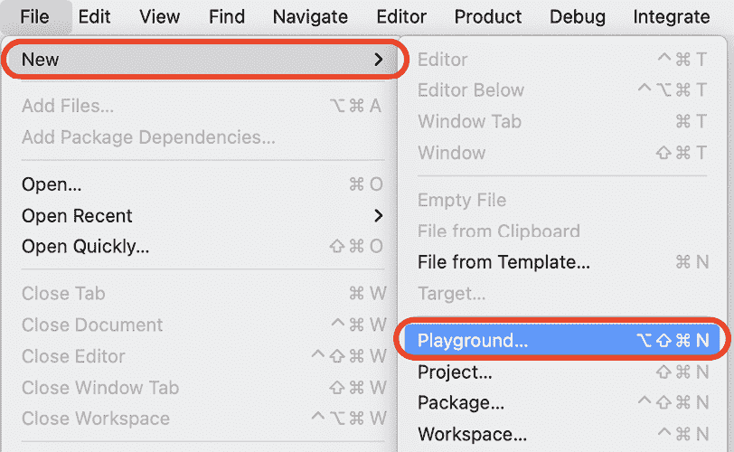

图 2.1：选择 File | New | Playground... 的 Xcode 菜单栏

1.  **选择一个模板以创建新的游乐场**：屏幕出现。**iOS** 应已选中。选择 **空白** 并点击 **下一步**：

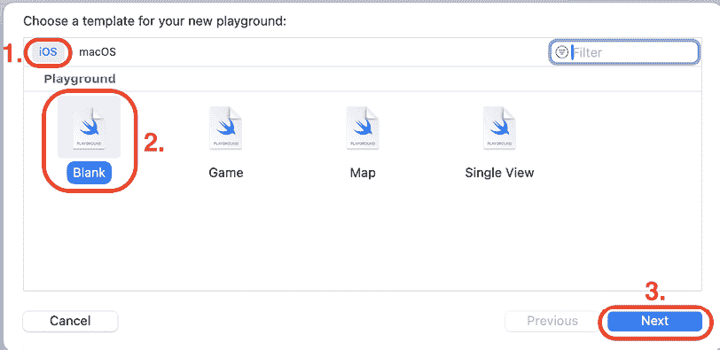

图 2.2：为新游乐场选择模板：屏幕

1.  将你的游乐场命名为 `SimpleValues` 并保存到任何你喜欢的位置。完成后点击 **创建**：

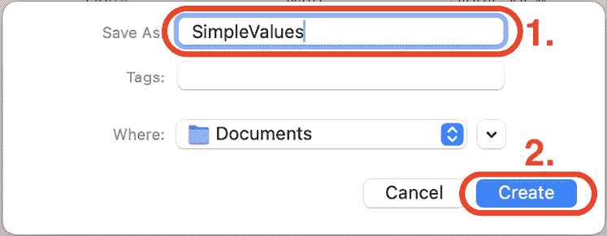

图 2.3：保存对话框

1.  你会在屏幕上看到游乐场：

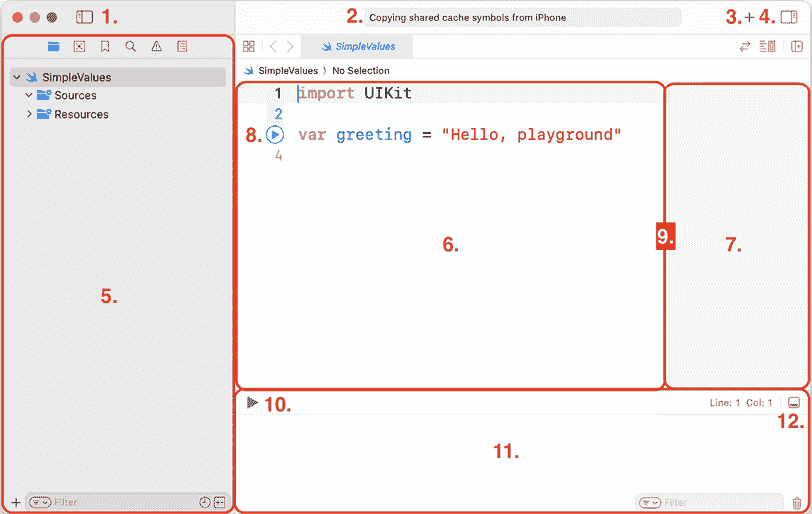

图 2.4：Xcode 游乐场用户界面

如你所见，它比 Xcode 项目简单得多。让我们更详细地看看界面：

+   **导航按钮（1）**：这会显示或隐藏导航区域。

+   **活动视图（2）**：这显示了当前的操作或状态。

+   **库按钮（3）**：这会显示代码片段和其他资源。

+   **检查器按钮（4）**：这会显示或隐藏检查器区域。

+   **导航区域（5）**：这提供了快速访问项目各个部分的途径。默认情况下显示项目导航器。

+   **编辑器区域（6）**：你在这里编写代码。

+   **结果区域（7）**：这为你编写的代码提供即时反馈。

+   **运行按钮（8）**：这会从选定的行执行代码。

+   **边框（9）**：这个边框分隔了编辑器和结果区域。如果你发现结果区域显示的结果被截断，可以将边框向左拖动以增加其大小。

+   **运行/停止按钮（10）**：这会执行或停止游乐场中所有代码的执行。

+   **调试区域（11）**：这会显示 `print()` 命令的结果。

+   **调试按钮（12）**：这会显示或隐藏调试区域。

你可能会发现游乐场中的文本太小，难以阅读。让我们看看如何在下一节中将其放大。

## 自定义字体和颜色

Xcode 提供了广泛的定制选项。你可以在 **设置...** 菜单中访问它们。如果你发现文本太小，难以看清，请按照以下步骤操作：

1.  从 Xcode 菜单中选择 **设置...** 以显示设置窗口。

1.  在设置窗口中，点击 **主题** 并选择 **演示（浅色）** 以使文本更大，更容易阅读：

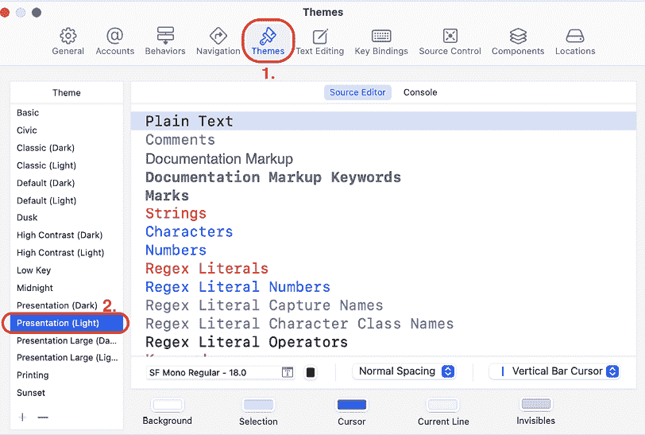

图 2.5：选择主题面板的 Xcode 设置窗口

1.  关闭设置窗口返回到游乐场。注意，游乐场中的文本比之前更大。你也可以尝试其他主题。

现在你已经根据自己的喜好自定义了字体和颜色，让我们看看如何在下一节中运行游乐场代码。

## 运行游乐场代码

你的游乐场中已经包含了一条指令。要执行指令，请按照以下步骤操作：

1.  点击指令左侧的运行按钮。几秒钟后，你将在结果区域看到 `"``Hello, playground"`：

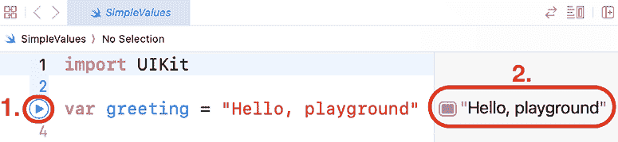

图 2.6：游乐场结果显示区域显示“Hello, playground”

你也可以使用左下角的运行/停止按钮，或者使用键盘快捷键 *Command* + *Shift* + *Return* 来运行游乐场中的所有代码。

1.  为了准备游乐场在本章剩余部分的使用，请从游乐场中删除 `var greeting = "Hello, playground"` 指令。随着你的操作，将本章中显示的代码输入到游乐场中，并点击最后一行左侧的运行按钮来运行它。

在下一节中，让我们深入了解 Swift 中使用的简单数据类型。

# 探索数据类型

所有编程语言都可以存储数字、单词和逻辑状态，Swift 也不例外。即使你是一位经验丰富的程序员，你也可能会发现 Swift 对这些值的表示与其他你可能熟悉的语言不同。

更多有关数据类型的信息，请访问 [`docs.swift.org/swift-book/documentation/the-swift-programming-language/thebasics`](https://docs.swift.org/swift-book/documentation/the-swift-programming-language/thebasics).

在下一节中，我们将逐步介绍 Swift 中的 **整数**、**浮点数**、**字符串** 和 **布尔值**。

## 表示整数

假设你想要存储以下内容：

+   城市中的餐馆数量

+   飞机上的乘客

+   酒店的房间

你会使用整数，它们是没有分数部分的数字（包括负数）。

Swift 中的整数由 `Int` 类型表示。

## 表示浮点数

假设你想要存储以下内容：

+   圆周率（3.14159...）

+   绝对零度（-273.15°C）

你会使用带有分数部分的浮点数。

Swift 中浮点数的默认类型是 `Double`，它使用 64 位，包括负数。你也可以使用 `Float`，它使用 32 位，但 `Double` 是默认表示。

## 表示字符串

假设你想要存储以下内容：

+   餐馆的名称，例如“孟买宫殿”

+   职位描述，例如“会计”或“程序员”

+   一种水果，例如“香蕉”

你会使用 Swift 的 `String` 类型，它表示字符序列，并且完全符合 Unicode 标准。这使得表示不同的字体和语言变得容易。

想了解更多关于 Unicode 的信息，请访问此链接：[`home.unicode.org/basic-info/faq/`](https://home.unicode.org/basic-info/faq/).

## 表示布尔值

假设你想要存储简单的是/否问题的答案，例如以下内容：

+   是否在下雨？

+   餐馆是否有空位？

对于此，你使用布尔值。Swift 提供了一个 `Bool` 类型，可以被分配 `true` 或 `false`。

现在你已经了解了 Swift 如何表示这些常见的数据类型，让我们在前面创建的游乐场中尝试它们，下一节将进行操作。

## 在游乐场中使用常见的数据类型

你在游乐场中输入的任何内容都将被执行，结果将显示在结果区域。让我们看看当你将数字、字符串和布尔值输入到你的游乐场并执行时会发生什么。按照以下步骤操作：

1.  将以下代码输入到你的游乐场的编辑器区域：

    ```swift
    // SimpleValues
    42
    -23
    3.14159
    0.1
    -273.15
    "hello, world"
    "albatross"
    true
    false 
    ```

注意，任何以`//`开头的行都是注释。注释是为自己创建笔记或提醒的好方法，并且会被 Xcode 忽略。

1.  点击最后一行左侧的运行按钮来运行你的代码。

1.  等待几秒钟。Xcode 将评估你的输入并在结果区域显示结果，如下所示：

    ```swift
    42
    -23
    3.14159
    0.1
    -273.15
    "hello, world"
    "albatross"
    true
    false 
    ```

注意，注释不会出现在结果区域。

太棒了！你已经创建并运行了你的第一个沙盒。让我们看看如何在下一节中存储不同的数据类型。

# 探索常量和变量

现在你已经了解了 Swift 支持的基本数据类型，让我们看看如何存储它们，以便你可以在以后对它们进行操作。

你可以使用**常量**或**变量**来存储值。两者都是具有名称的容器，但常量的值只能设置一次，一旦设置就不能更改，而变量的值可以在任何时候更改。

在使用之前，你必须声明常量和变量。常量使用`let`关键字声明，而变量使用`var`关键字声明。

让我们通过在我们的沙盒中实现它们来探索常量和变量是如何工作的。按照以下步骤操作：

1.  将以下代码添加到你的沙盒中，以声明三个常量：

    ```swift
    let theAnswerToTheUltimateQuestion = 42
    let pi = 3.14159
    let myName = "Ahmad Sahar" 
    ```

1.  点击最后一行左侧的运行按钮来运行它。在每种情况下，都会创建一个容器并命名，并将分配的值存储在其中。

你可能已经注意到这里显示的常量和变量的名称以小写字母开头，并且如果名称中有多个单词，则每个后续单词的首字母都大写。这被称为**驼峰式命名法**。强烈建议这样做，因为大多数经验丰富的 Swift 程序员都遵循这个约定。

注意，用双引号括起来的字符序列`"Ahmad Sahar"`用于为`myName`分配值。这些被称为**字符串字面量**。

1.  在常量声明之后添加以下代码来声明三个变量并运行它：

    ```swift
    var currentTemperatureInCelsius = 27
    var myAge = 50
    var myLocation = "home" 
    ```

与常量一样，在每种情况下都会创建一个容器并命名，并将分配的值存储在其中。

存储的值会在结果区域显示。

1.  常量的值一旦设置就不能更改。为了测试这一点，在变量声明之后添加以下代码：

    ```swift
    let isRaining = true
    isRaining = false 
    ```

当你输入第二行代码时，会出现一个带有建议的弹出菜单：

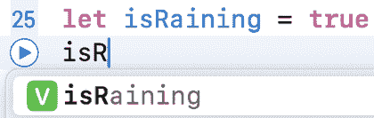

图 2.7：自动完成弹出菜单

使用上箭头键和下箭头键选择`isRaining`常量，然后按*Tab*键选择它。这个功能被称为**自动完成**，有助于在输入代码时防止输入错误。

1.  当你完成输入后，等待几秒钟。在第二行，你会看到一个错误通知（一个中间有白色点的红色圆圈）出现：

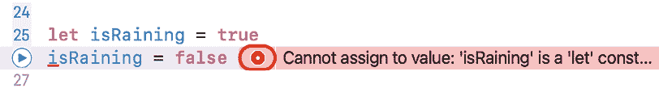

图 2.8：错误通知

这意味着你的程序中存在错误，Xcode 认为它可以修复。错误出现是因为你试图在设置初始值后为常量分配新值。

1.  点击红色圆圈以展开错误消息。你会看到一个带有**修复**按钮的框：

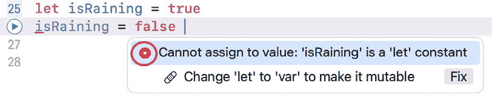

图 2.9：扩展的错误通知

Xcode 告诉你问题是什么（**无法赋值：'isRaining'是一个'let'常量**）并建议一个修正（**将'let'改为'var'以使其可变**）。"可变"的意思是值可以在最初设置后更改。

1.  点击**修复**按钮。你会看到`isRaining`常量声明已被更改为变量声明：

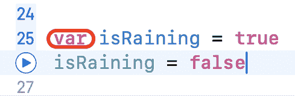

图 2.10：应用了修复的代码

由于可以在创建变量后为其分配新值，错误已解决。但是请注意，建议的修复可能不是最佳解决方案。随着你在 iOS 开发方面经验的增加，你将能够确定最佳的行动方案。

如果你查看你输入的代码，你可能想知道 Xcode 是如何知道变量或常量中存储的数据类型的。你将在下一节中了解这一点。

# 理解类型推断和类型安全

在上一节中，你声明了常量和变量并给它们赋值。Swift 会根据提供的值自动确定常量或变量的类型，这被称为**类型推断**。你可以通过按住*选项*键并点击其名称来查看常量或变量的类型。为了看到这一点是如何发生的，请按照以下步骤操作：

1.  将以下代码添加到你的游乐场中，以声明一个字符串并运行它：

    ```swift
    let cuisine = "American" 
    ```

1.  按住*选项*键并点击`cuisine`以显示常量类型。你应该看到以下内容：

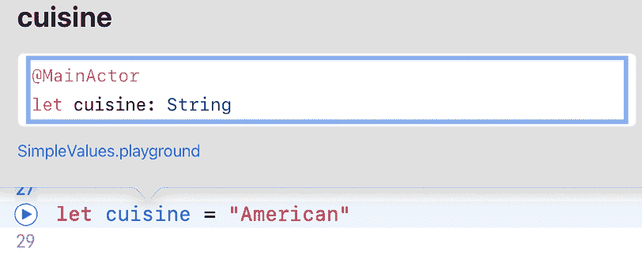

图 2.11：显示的类型声明

如你所见，`cuisine`的类型是`String`。

如果你想为变量或常量设置一个特定的类型？你将在下一节中看到如何做到这一点。

## 使用类型注解来指定类型

你已经看到 Xcode 会尝试根据提供的值自动确定变量或常量的数据类型。然而，有时你可能希望指定一个类型而不是让 Xcode 为你做这件事。为此，在常量或变量名称后输入一个冒号（`:`），然后跟随着期望的类型。这被称为**类型注解**。

将以下代码添加到你的游乐场中，以声明一个类型为`Double`的变量`restaurantRating`，然后点击运行按钮来运行它：

```swift
var restaurantRating: Double = 3 
```

在这里，你指定了`restaurantRating`具有特定的类型，`Double`。即使你为`restaurantRating`分配了一个整数，它也会被存储为浮点数。

在下一节中，你将了解 Xcode 如何通过强制类型安全来帮助你减少程序中的错误数量。

## 使用类型安全来检查值

Swift 是一种类型安全的语言。它会检查你是否将正确类型的值分配给变量，并将不匹配的类型标记为错误。让我们通过以下步骤来了解它是如何工作的：

1.  将以下语句添加到你的游乐场中，以将字符串分配给 `restaurantRating` 并运行它：

    ```swift
    restaurantRating = "Good" 
    ```

1.  你会看到一个错误通知（一个带有 x 的红色圆圈）。x 表示 Xcode 无法为此提供修复方案。点击红色圆圈。

1.  由于你试图将一个字符串分配给类型为 `Double` 的变量，因此会显示以下错误消息：

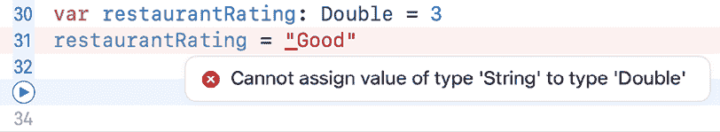

图 2.12：无修复方案的扩展错误通知

1.  在它前面输入 `//` 来注释掉该行，如下所示：

    ```swift
    // restaurantRating = "Good" 
    ```

红色圆圈消失了，因为你的程序中不再有错误。

选择代码行并输入 *Command* + */* 来注释掉它们。

现在你已经知道了如何将数据存储在常量和变量中，让我们看看如何在下一节中对这些数据进行操作。

# 探索运算符

你可以在 Swift 中执行算术、比较和逻辑运算。**算术运算符**用于常见的数学运算。**比较**和**逻辑运算符**检查表达式的值并返回 `true` 或 `false`。

更多关于运算符的信息，请访问 [`docs.swift.org/swift-book/documentation/the-swift-programming-language/basicoperators`](https://docs.swift.org/swift-book/documentation/the-swift-programming-language/basicoperators)。

让我们更详细地查看每种运算符类型。你将在下一节中从算术运算符（加法、减法、乘法和除法）开始。

## 使用算术运算符

你可以使用这里显示的标准算术运算符对整数和浮点数执行数学运算。

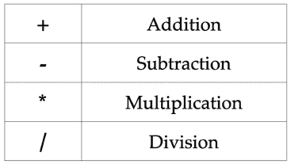

图 2.13：算术运算符

让我们看看这些运算符是如何使用的。按照以下步骤操作：

1.  将以下代码添加到你的游乐场中，以添加算术运算：

    ```swift
    let sum = 23 + 20
    let result = 32 - sum
    let total = result * 5
    let divide = total / 10 
    ```

1.  运行代码。结果区域显示的结果分别是 `43`，`-11`，`-55` 和 `-5`。请注意，55 除以 10 返回 5 而不是 5.5，因为这两个数都是整数。

1.  运算符只能与相同类型的操作数一起工作。输入以下代码并运行，看看如果操作数是不同类型会发生什么：

    ```swift
    let a = 12
    let b = 12.0
    let c = a + b 
    ```

你会得到一个错误消息（**二进制运算符 '+' 无法应用于类型 'Int' 和 'Double' 的操作数**）。这是因为 `a` 和 `b` 是不同类型的。请注意，Xcode 无法自动修复此问题，因此不会显示任何修复建议。

1.  要修复错误，请按以下方式修改程序：

    ```swift
    let c = Double(a) + b 
    ```

`Double(a)` 获取存储在 `a` 中的值，并从中创建一个浮点数。现在两个操作数都是同一类型，现在你可以将 `b` 中的值加到它上面。存储在 `c` 中的值是 `24.0`，而 `24` 将在结果区域显示。

现在您已经了解了如何使用算术运算符，您将学习下一节中的复合赋值运算符（+=、-=、*= 和 /=）。

## 使用复合赋值运算符

您可以使用复合赋值运算符（如下所示）对一个值执行操作并将结果赋给一个变量：

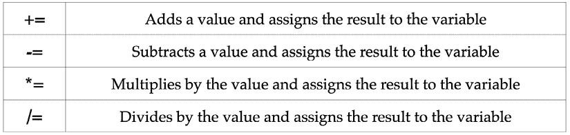

图 2.14：复合赋值运算符

让我们看看这些运算符是如何使用的。将以下代码添加到您的游乐场并运行它：

```swift
var d = 1
d += 2
d -= 1 
```

`d += 2` 表达式是 `d = d + 2` 的简写，因此 `d` 中的值现在是 `1 + 2`，并将 `3` 赋值给 `d`。同样，`d -= 1` 是 `d = d - 1` 的简写，因此 `d` 中的值现在是 `3 - 1`，并将 `2` 赋值给 `d`。

现在您已经熟悉了复合赋值运算符，让我们看看下一节中的比较运算符（==、/、>、<、>= 和 <=）。

## 使用比较运算符

您可以使用比较运算符将一个值与另一个值进行比较，结果将是 `true` 或 `false`。您可以使用以下比较运算符：

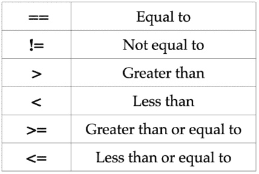

图 2.15：比较运算符

让我们看看这些运算符是如何使用的。将以下代码添加到您的游乐场并运行它：

```swift
1 == 1
2 != 1
2 > 1   
1 < 2   
1 >= 1
2 <= 1 
```

让我们看看这是如何工作的：

+   `1 == 1` 返回 `true`，因为 1 等于 1。

+   `2 != 1` 返回 `true`，因为 2 不等于 1。

+   `2 > 1` 返回 `true`，因为 2 大于 1。

+   `1 < 2` 返回 `true`，因为 1 小于 2。

+   `1 >= 1` 返回 `true`，因为 1 大于或等于 1。

+   `2 <= 1` 返回 `false`，因为 2 不小于或等于 1。

返回的布尔值将在结果区域显示。

如果您想检查多个条件会发生什么？这就是逻辑运算符（**AND**、**OR** 和 **NOT**）发挥作用的地方。您将在下一节中了解它们。

## 使用逻辑运算符

逻辑运算符在处理两个或多个条件时非常有用。例如，如果您在便利店，如果您有现金或信用卡，您就可以为商品付款。在这种情况下，OR 是逻辑运算符。

您可以使用以下逻辑运算符：

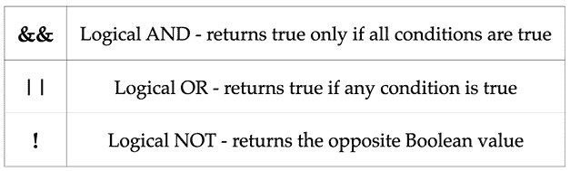

图 2.16：逻辑运算符

要查看这些运算符的使用方法，将以下代码添加到您的游乐场并运行它：

```swift
(1 == 1) && (2 == 2)
(1 == 1) && (2 != 2)
(1 == 1) || (2 == 2)
(1 == 1) || (2 != 2)
(1 != 1) || (2 != 2)
!(1 == 1) 
```

让我们看看这是如何工作的：

+   `(1 == 1) && (2 == 2)` 返回 `true`，因为两个操作数都是 `true`，所以 `true AND true` 返回 `true`。

+   `(1 == 1) && (2 != 2)` 返回 `false`，因为一个操作数是 `false`，所以 `true AND false` 返回 `false`。

+   `(1 == 1) || (2 == 2)` 返回 `true`，因为两个操作数都是 `true`，所以 `true OR true` 返回 `true`。

+   `(1 == 1) || (2 != 2)` 返回 `true`，因为一个操作数是 `true`，所以 `true OR false` 返回 `true`。

+   `(1 != 1) || (2 != 2)` 返回 `false`，因为两个操作数都是 `false`，所以 `false OR false` 返回 `false`。

+   `!(1 == 1)` 返回 `false`，因为 `1==1` 是 `true`，所以 `NOT true` 返回 `false`。

返回的布尔值将在结果区域显示。

到目前为止，你只处理过数字。在下一节中，你将看到如何使用 Swift 的 `String` 类型对单词和句子进行操作，这些单词和句子被存储为字符串。

## 执行字符串操作

如你之前所见，字符串是一系列字符。它们由 `String` 类型表示，并且完全符合 Unicode 标准。

更多有关字符串的信息，请访问 [`docs.swift.org/swift-book/documentation/the-swift-programming-language/stringsandcharacters`](https://docs.swift.org/swift-book/documentation/the-swift-programming-language/stringsandcharacters)。

让我们学习一些常见的字符串操作。按照以下步骤操作：

1.  你可以使用 `+` 运算符将两个字符串连接起来。将以下代码添加到你的游乐场中并运行它：

    ```swift
    let greeting = "Good" + " Morning" 
    ```

字符串字面量 `"Good"` 和 `"Morning"` 的值被连接起来，并在结果区域显示 `"Good Morning"`。

1.  你可以通过将其他类型的常量或变量也转换为字符串来组合字符串。要将常量 `rating` 转换为字符串，输入以下代码并运行它：

    ```swift
    let rating = 3.5
    var ratingResult = "The restaurant rating is " + String(rating) 
    ```

`rating` 常量包含 `3.5`，这是一个 `Double` 类型的值。将 `rating` 放在 `String()` 的括号中，会获取 `rating` 中存储的值并基于它创建一个新的字符串 `"3.5"`，然后与 `ratingResult` 变量中的字符串组合，返回字符串 `"The restaurant rating is 3.5"`。

1.  有一种更简单的方法来组合字符串，称为 **字符串插值**。字符串插值是通过在字符串中用 `"\("` 和 `")"` 包围一个常量或变量的名称来完成的。输入以下代码并运行它：

    ```swift
    ratingResult = "The restaurant rating is \(rating)" 
    ```

如前例所示，`rating` 中的值被用来创建一个新的字符串 `"3.5"`，返回字符串 `"The restaurant rating is 3.5"`。

到目前为止，你可以在结果区域看到你的指令结果。然而，当你使用 Xcode 编写应用程序时，你将无法访问你在游乐场中看到的结果区域。为了在程序运行时显示变量和常量的内容，你将在下一节中学习如何将它们打印到调试区域。

# 使用 `print()` 语句

如你在 *第一章*，*探索 Xcode* 中所见，Xcode 项目没有像游乐场那样的结果区域，但项目和游乐场都有调试区域。使用 `print()` 语句会将括号内的任何内容打印到调试区域。

`print()` 语句是一个函数。你将在 *第六章*，*函数和闭包* 中了解更多关于函数的内容。

将以下代码添加到你的游乐场中，然后点击 **运行** 按钮来运行它：

```swift
print(ratingResult) 
```

你将看到 `ratingResult` 的值出现在调试区域：

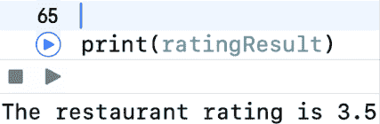

图 2.17：调试区域显示 `print()` 语句的结果

当你刚开始时，可以随意使用尽可能多的 `print()` 语句。这是一个真正理解程序中发生情况的好方法。

# 概述

在本章中，你学习了如何创建和使用游乐场文件，这允许你探索和实验 Swift。

你看到了 Swift 如何表示不同类型的数据，以及如何使用常量和变量。这使你能够在程序中存储数字、布尔值和字符串。

你还学习了类型推断、类型注解和类型安全，这些可以帮助你编写简洁且错误更少的代码。

你了解了如何对数字和字符串进行操作，这让你能够执行简单的数据处理任务。

你学习了如何修复错误，以及如何将输出打印到调试区域，这在尝试查找和修复你编写的程序中的错误时非常有用。

在下一章中，你将学习**条件语句**和**可选参数**。条件语句用于在程序中做出逻辑选择，而可选参数用于处理变量可能或可能没有值的情况。

# 加入我们的 Discord！

与其他用户、专家和作者本人一起阅读这本书。提出问题，为其他读者提供解决方案，通过“问我任何问题”的环节与作者聊天，等等。扫描二维码或访问链接加入社区。

[`packt.link/ios-Swift`](https://packt.link/ios-Swift)


