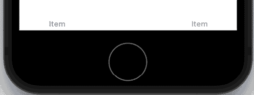

# 第十章：设置用户界面

在本书的*第一部分*中，你学习了 Swift 语言及其工作原理。现在你对这门语言有了很好的了解，你可以学习如何开发 iOS 应用程序。在这一部分，你将构建一个名为*JRNL*的日记应用程序的用户界面（UI）。你将使用 Xcode 的**界面构建器**来完成这项工作，并且代码将保持最小化。

你将从这个章节开始学习 iOS 开发中广泛使用的一些有用术语。接下来，你将游览*JRNL*应用程序中使用的屏幕，并了解用户如何使用该应用程序。最后，你将开始使用界面构建器重新创建应用程序的 UI，从允许用户在日记列表和地图屏幕之间选择的标签栏开始。你将在两个屏幕的顶部添加导航栏并配置标签栏按钮。

到本章结束时，你将学会 iOS 应用开发中常用的术语，了解你的应用程序的流程，以及如何使用界面构建器添加和配置 UI 元素。

本章将涵盖以下主题：

+   学习 iOS 开发中的有用术语

+   游览*JRNL*应用程序

+   修改你的 Xcode 项目

+   设置标签栏控制器场景

# 技术要求

你将修改在*第一章*，“探索 Xcode”中创建的`JRNL` Xcode 项目。

本章的资源文件和完成的 Xcode 项目位于本书代码包的`Chapter10`文件夹中，可以在此处下载：

[`github.com/PacktPublishing/iOS-18-Programming-for-Beginners-Ninth-Edition`](https://github.com/PacktPublishing/iOS-18-Programming-for-Beginners-Ninth-Edition%0D)

观看以下视频，看看代码的实际应用：

[`youtu.be/lgyerQeTgN4`](https://youtu.be/lgyerQeTgN4%0D)

在你开始项目之前，你将学习一些 iOS 开发中常用的术语。

# 学习 iOS 开发中的有用术语

当你开始你的 iOS 应用开发之旅时，你将遇到特殊的术语和定义。以下是一些最常用的术语和定义。现在只需阅读它们即可。即使你现在可能并不完全理解，但随着你的深入，一切都会变得清晰：

+   **视图**：视图是`UIView`类或其子类的实例。你屏幕上看到的所有内容（按钮、文本字段、标签等）都是视图。你将使用视图来构建你的 UI。

类在*第七章*，“类、结构和枚举”中有所介绍。

+   **堆叠视图**：堆叠视图是`UIStackView`类的实例，它是`UIView`的子类。它用于将视图组合成水平或垂直堆叠，这使得它们更容易使用**自动布局**（稍后在本节中讨论）在屏幕上定位。自动布局是一种布局方式，它允许开发者通过指定视图之间的相对位置和大小来创建用户界面。

+   **视图控制器**：视图控制器是`UIViewController`类的一个实例。每个视图控制器都有一个`view`属性，它包含对一个视图的引用。它决定了视图向用户显示的内容以及用户与视图交互时会发生什么。

视图控制器将在第十四章“开始使用 MVC 和表格视图”中详细讨论。

+   **表格视图控制器**：表格视图控制器是`UITableViewController`类的一个实例，它是`UIViewController`类的一个子类。它的`view`属性包含对一个`UITableView`实例（表格视图）的引用，该实例显示一列`UITableViewCell`实例（表格视图单元格）。

**设置**应用以表格视图的形式显示你的设备设置：

图 10.1：设置应用

正如你所见，所有不同的设置（**通用**、**辅助功能**、**隐私**等）都在表格视图的单元格内显示。

+   **集合视图控制器**：集合视图控制器是`UICollectionViewController`类的一个实例，它是`UIViewController`类的一个子类。它的`view`属性包含对一个`UICollectionView`实例（集合视图）的引用，该实例显示一个`UICollectionViewCell`实例（集合视图单元格）的网格。

**照片**应用在集合视图中显示照片：

图 10.2：照片应用

正如你所见，缩略图图片在集合视图中显示在集合视图的单元格内。

+   **导航控制器**：导航控制器是`UINavigationController`类的一个实例，它是`UIViewController`类的一个子类。它有一个`viewControllers`属性，该属性包含一个视图控制器数组。数组中最后一个视图控制器的视图会显示在屏幕上，同时屏幕顶部还有一个导航栏。

在**设置**应用中，表格视图控制器嵌入在导航控制器中，你可以看到表格视图上方的导航栏：

图 10.3：设置应用中的导航栏

当你点击一个设置时，该设置的视图控制器会被添加到分配给`viewControllers`属性的视图控制器数组中。用户会看到该视图控制器从右侧滑入。注意屏幕顶部的导航栏，它可以包含标题和按钮。一个**< 设置**按钮出现在导航栏的左上角。点击此按钮会返回上一个屏幕，并从`viewControllers`属性分配的视图控制器数组中移除该设置的视图控制器。

+   **标签栏控制器**：标签栏控制器是`UITabBarController`类的一个实例，它是`UIViewController`类的一个子类。它有一个`viewControllers`属性，包含一个视图控制器数组。数组中第一个视图控制器的视图显示在屏幕上，同时还有一个带有按钮的标签栏在底部。最左边的按钮对应于数组中的第一个视图控制器，并且已经选中。当你点击另一个按钮时，相应的视图控制器将被加载，其视图将显示在屏幕上。

**Fitness**应用使用标签栏控制器来导航到不同的屏幕：

图 10.4：健身应用中的标签栏

正如你所见，这个应用的不同屏幕（**所有照片**、**为你推荐**、**相册**和**搜索**）可以通过点击相应的标签栏按钮来访问。

+   **模型-视图-控制器（MVC）**：这是在 iOS 应用开发中非常常见的一个设计模式。用户与屏幕上的视图进行交互。应用数据存储在数据模型对象中。控制器管理视图和数据模型对象之间的信息流。

    MVC 将在*第十四章*，*开始使用 MVC 和表格视图*中详细讨论。

+   **故事板文件**：故事板文件包含用户看到的视觉表示。应用中的每一屏幕都由一个故事板**场景**表示。

打开你在*第一章*，*探索 Xcode*中创建的*JRNL*项目，并点击**主**故事板文件。

图 10.5：显示主故事板文件的 JRNL Xcode 项目

你将看到一个场景，当你运行你的应用在**模拟器**中时，这个场景的内容将显示在屏幕上。你可以在故事板文件中有一个以上的场景。

+   **转场**：如果你在一个应用中有多个场景，你使用转场来从一个场景移动到另一个场景。*JRNL*项目没有转场，因为它的故事板文件中只有一个场景，但你将在本章的后面部分看到它们。

+   **自动布局**：作为一名开发者，你必须确保你的应用在不同屏幕尺寸的设备上看起来都很好。**自动布局**帮助你根据你指定的**约束**来布局你的 UI。例如，你可以设置一个约束来确保按钮在屏幕上居中，无论屏幕大小如何，或者当设备从纵向旋转到横向时，使文本字段扩展到屏幕的宽度。

现在你已经熟悉了在 iOS 应用开发中使用的术语，让我们来游览一下你将要构建的应用。

# JRNL 应用的游览

让我们快速浏览一下你将要构建的应用程序。*JRNL*应用程序是一个日记应用程序，允许用户编写自己的个人日记，并为每个日记条目提供存储照片或地图位置的选择。用户还可以查看显示靠近用户当前位置的条目位置的地图。你将在下一节中看到应用程序中使用的所有屏幕及其整体流程。

## 使用“期刊列表”屏幕

当应用程序启动时，你会看到“期刊列表”屏幕：

图 10.6：期刊列表屏幕

让我们研究一下这个屏幕的不同部分。

屏幕底部的`UITabBar`实例（标签栏）显示了**期刊**和**地图**按钮。**期刊**按钮被选中，你可以看到一个表格视图，在表格视图中显示期刊条目的列表。一个`UISearchController`实例在屏幕顶部显示一个搜索栏。这允许你搜索特定的期刊条目。

要添加新的期刊条目，你点击屏幕顶部的**+**按钮。这会显示“添加新期刊条目”屏幕。

## 使用“添加新期刊条目”屏幕

当你在“期刊列表”屏幕顶部点击**+**按钮时，你会看到“添加新期刊条目”屏幕：

图 10.7：添加新期刊条目屏幕

让我们研究一下这个屏幕的不同部分。

屏幕顶部的导航栏包含**取消**和**保存**按钮。一个堆叠视图显示自定义评分控件、开关、条目标题文本字段、正文文本视图和占位符照片。点击评分控件可以为此条目分配 0 到 5 星。打开开关将获取你的当前位置。

你可以在条目标题文本字段中输入期刊条目的标题，并在正文文本视图中输入详细信息。你还可以点击占位符照片，使用设备相机拍照。一旦你点击**保存**，你将返回到“期刊列表”屏幕，然后新的条目将在表格视图中可见。你也可以点击**取消**，不创建新的期刊条目就返回到“期刊列表”屏幕。

要查看特定期刊条目的详细信息，点击列表中的条目，然后你会看到“期刊条目详情”屏幕。

## 使用“期刊条目详情”屏幕

点击“期刊列表”屏幕上的任何一条期刊条目将显示相应的“期刊条目详情”屏幕：

图 10.8：期刊条目详情屏幕

让我们研究一下这个屏幕的不同部分。

屏幕顶部的导航栏包含一个**返回**按钮。一个表格视图在表格视图中显示期刊条目的日期、评分、标题文本、正文文本、照片和位置地图。

你可以点击**< 期刊**按钮返回到“期刊列表”屏幕。

## 使用“地图”屏幕

在标签栏中点击**地图**按钮会显示地图屏幕：

图 10.9：地图屏幕

让我们研究一下这个屏幕的不同部分。

屏幕底部的标签栏显示了**Journal**和**Map**按钮。**Map**按钮被选中，你可以看到一个`MKMapView`实例（地图视图）在屏幕上显示地图，图钉指示期刊条目。

点击一个图钉将显示注释，点击注释中的按钮将显示该条目的期刊条目详情屏幕。

这完成了对该应用的浏览。现在，是时候开始构建它的 UI 了！

# 修改你的 Xcode 项目

现在你已经知道了应用屏幕的外观，你可以开始构建它了。如果你还没有这样做，打开你在*第一章* *探索 Xcode*中创建的`JRNL`项目：

图 10.10：JRNL 项目

确认从目标菜单中选择了**iPhone SE (第 3 代)**。构建并运行你的应用。你会看到一个空白的白色屏幕。如果你在项目导航器中点击**Main**故事板文件，你会看到它包含一个包含空白视图的单个场景。这就是为什么当你运行应用时，你只看到一个空白的白色屏幕。

要配置 UI，你将使用 Interface Builder 修改**Main**故事板文件。Interface Builder 允许你添加和配置场景。每个场景代表用户将看到的屏幕。你可以在场景中添加 UI 对象，如视图和按钮，并按需配置它们，使用属性检查器。

有关如何使用 Interface Builder 的更多信息，请访问此链接：[`help.apple.com/xcode/mac/current/#/dev31645f17f`](https://help.apple.com/xcode/mac/current/#/dev31645f17f)。

现在，你将在标签栏中嵌入现有的场景，并向其中添加另一个场景。标签栏场景将在屏幕底部显示一个标签栏，其中包含两个按钮。点击一个按钮将显示与之关联的屏幕。这些屏幕对应于应用浏览中显示的期刊列表和地图屏幕。让我们看看如何在下一节中完成这个操作。

# 设置标签栏控制器场景

正如你在应用浏览中看到的，*JRNL*应用在屏幕底部有一个标签栏，其中包含两个按钮，用于显示期刊列表和地图屏幕。你将在标签栏中嵌入现有的视图控制器场景，并向其中添加第二个视图控制器场景。按照以下步骤操作：

1.  在项目导航器中点击**Main**故事板文件：

图 10.11：选择 Main 故事板文件的项目导航器

**Main**故事板文件的内容显示在编辑器区域。

1.  如果它不存在，点击文档大纲按钮以显示文档大纲：

图 10.12：显示文档大纲按钮的编辑器区域

1.  在文档大纲中选择**View Controller**：

图 10.13：选择 ViewController 的文档大纲

1.  你将在标签栏控制器场景中嵌入现有的视图控制器场景。从**编辑器**菜单中选择**嵌入** | **标签栏控制器**：

图 10.14：选中嵌入 | 标签栏控制器的编辑器菜单

你将在编辑器区域看到一个新标签栏控制器场景出现。

1.  点击窗口右上角的**+**按钮以显示库：

图 10.15：显示+按钮的工具栏

库允许你选择要添加到场景中的 UI 对象。

1.  在库的过滤器字段中输入`view con`。一个**View Controller**对象将出现在结果列表中：

图 10.16：选中视图控制器对象的库

1.  将**View Controller**对象拖动到故事板中，以添加一个新的视图控制器场景，并将其放置在现有的视图控制器场景下方：

图 10.17：添加了视图控制器场景的主故事板文件

1.  点击**-**按钮以缩小视图，并在故事板中重新排列场景，以便同时显示标签栏控制器场景和视图控制器场景：

图 10.18：显示缩放按钮的编辑区域

如果**–**和**+**按钮不可见，尝试放大 Xcode 窗口。你也可以尝试使用**导航器**和**检查器**按钮隐藏**导航器**和**检查器**区域。

1.  在文档大纲中选择**Tab Bar Controller**。按*Ctrl*键并从**Tab Bar Controller**拖动到新添加的视图控制器场景：

图 10.19：显示拖动目的地的编辑区域

1.  将出现一个切换弹出菜单。从该菜单中选择**视图控制器**：

图 10.20：切换弹出菜单

将出现一个连接标签栏控制器场景到视图控制器场景的切换。

1.  在**编辑器**区域重新排列场景，使其看起来像下面的截图：

图 10.21：重新排列场景的编辑区域

1.  在模拟器中构建和运行你的应用，你将在屏幕底部看到带有两个按钮的标签栏：

图 10.22：显示两个按钮的标签栏的模拟器

你已成功将标签栏添加到项目中，但正如你所见，按钮标题目前都命名为**Item**。在下一节中，你将将它们更改为**Journal**和**Map**。

## 设置标签栏按钮标题和图标

你的应用现在在屏幕底部显示了一个标签栏，但按钮标题和图标与应用之旅中显示的不匹配。为了使它们匹配，你将在属性检查器中将按钮标题配置为读取**Journal**和**Map**，并配置它们的图标。按照以下步骤操作：

1.  在项目导航器中点击**Main**故事板文件。如果未显示，点击文档大纲按钮以显示文档大纲。点击文档大纲中的第一个**Item Scene**：

图 10.23：显示已选择第一个项目场景的文档大纲

1.  在**项目场景**下点击**项目**按钮。然后，点击属性检查器按钮：

图 10.24：已选择属性检查器

1.  在**条目项**下将**标题**设置为`Journal`，**图像**设置为`person.fill`：

图 10.25：属性检查器，标题设置为 Journal，图像设置为 person.fill

1.  在第二个**项目**场景中点击**项目**按钮，并在**条目项**下将**标题**设置为`Map`，**图像**设置为`map`：

图 10.26：属性检查器，标题设置为 Map，图像设置为 map

1.  在模拟器中构建并运行你的应用。你会看到按钮的标题已分别更改为**Journal**和**Map**，并且每个按钮都有一个自定义图标：

图 10.27：显示带有自定义按钮标题和图标的标签栏的模拟器

点击**Journal**和**Map**按钮将显示期刊列表和地图屏幕的场景。

`person.fill`和`map`图标是苹果的**SF Symbols**库的一部分。要了解更多信息，请访问此链接：[`developer.apple.com/design/human-interface-guidelines/sf-symbols`](https://developer.apple.com/design/human-interface-guidelines/sf-symbols)。

正如你在应用浏览中看到的，一些屏幕在导航栏中有标题和按钮。在下一节中，你将学习如何将导航栏添加到你的屏幕上，以便你可以根据需要稍后添加按钮和标题。

## 在导航控制器中嵌入视图控制器

正如你在应用浏览中看到的，期刊列表和地图屏幕的顶部都有导航栏。要为两个屏幕添加导航栏，你需要在导航控制器中嵌入期刊和地图场景的视图控制器。这样，当显示期刊列表和地图屏幕时，导航栏将出现在屏幕顶部。按照以下步骤操作：

1.  在文档大纲中点击**期刊场景**：

图 10.28：显示已选择期刊场景的文档大纲

1.  从**编辑**菜单中选择**嵌入** | **导航控制器**：

图 10.29：显示已选择嵌入到导航控制器中的编辑菜单

1.  验证是否在标签栏控制器场景和期刊场景之间出现了一个导航控制器场景：

图 10.30：显示已添加导航控制器场景的编辑区域

1.  在文档大纲中点击**地图场景**并重复*步骤 2*。

图 10.31：显示已添加导航控制器场景的编辑区域

现在，**期刊列表**屏幕和**地图**屏幕都拥有导航栏，但由于它们的颜色与背景相同，所以在屏幕上并不明显。你将为每个场景的导航项设置标题，以便区分它们。

1.  在文档大纲中选择第一个**视图控制器场景**的**导航项**。在属性检查器中，在**导航项**下，将**标题**设置为`日历`：

图 10.32：标题设置为“日历”的属性检查器

1.  在文档大纲中选择第二个**视图控制器场景**的**导航项**。在属性检查器中，在**导航项**下，将**标题**设置为`地图`：

图 10.33：标题设置为“地图”的属性检查器

1.  构建并运行你的应用，并点击每个标签栏按钮以显示相应的屏幕。注意每个屏幕在导航栏中显示一个标题。

在导航控制器中嵌入视图控制器会将该视图控制器添加到导航控制器的`viewControllers`数组中。然后导航控制器在屏幕上显示视图控制器的视图。导航控制器还会在屏幕顶部显示一个带有标题的导航栏。

恭喜！你刚刚为你的应用配置了标签栏和导航控制器！

你可能已经注意到 Interface Builder 中显示的屏幕与你在目标菜单中选择的 iPhone 型号不匹配，你可能还会发现最小地图显示会妨碍你在应用中排列屏幕。让我们进行一些额外的 Interface Builder 配置来解决这个问题。

## 配置 Xcode

尽管你已经配置了模拟器使用 iPhone SE（第 3 代）作为你的应用设备，但在 Interface Builder 中显示的场景是为不同的 iPhone 型号。你可能还希望隐藏最小地图显示。让我们配置 Interface Builder 中的场景以使用 iPhone SE（第 3 代）并隐藏最小地图显示。按照以下步骤操作：

1.  应该仍然选择**主**故事板文件。要配置在 Interface Builder 中场景的外观，请点击设备配置按钮：

图 10.34：显示设备配置按钮的编辑区域

将显示不同设备屏幕的弹出窗口。

1.  从此弹出窗口中选择**iPhone SE（第 3 代**），然后点击编辑区域中的任何位置以关闭它：

图 10.35：选择 iPhone SE（第 3 代）的设备弹出窗口

故事板中场景的外观将更改为反映 iPhone SE（第 3 代）的屏幕。

1.  如果你希望隐藏最小地图，从**编辑**菜单中选择**最小地图**以取消选中它。

图 10.36：突出显示最小地图的编辑菜单

1.  验证在`主`故事板文件中是否有以下场景：

图 10.37：显示完成的主故事板文件的编辑区域

1.  构建并运行你的应用。它应该和之前一样工作。

你已经为你的应用创建了日历列表和地图屏幕！做得好！

# 摘要

在本章中，你学习了在 iOS 应用开发中使用的某些有用术语。这将使你更容易理解本书的其余部分，以及关于该主题的其他书籍或在线资源。

然后，你还了解了 *JRNL* 应用中使用的不同屏幕以及用户如何使用该应用。当你从头开始重新创建应用的 UI 时，你能够将你所做的工作与实际应用的外观进行比较。

最后，你学习了如何使用 Interface Builder 和 storyboards 将标签栏控制器场景添加到你的应用中，配置按钮标题和图标，并为 JournalList 和 Map 屏幕添加导航控制器。这将使你熟悉为你的应用添加和配置 UI 元素。

在下一章中，你将继续设置你应用的 UI，并熟悉更多 UI 元素。你将为你的应用添加和配置剩余的屏幕。

# 加入我们的 Discord 社区！

与其他用户、专家和作者本人一起阅读这本书。提出问题，为其他读者提供解决方案，通过 Ask Me Anything 会话与作者聊天，等等。扫描二维码或访问链接加入社区。

[`packt.link/ios-Swift`](https://packt.link/ios-Swift%0D)

