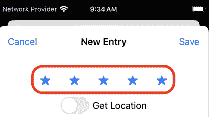
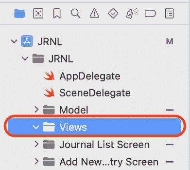
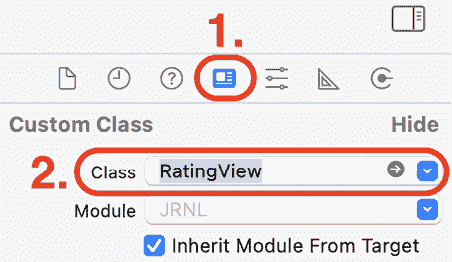
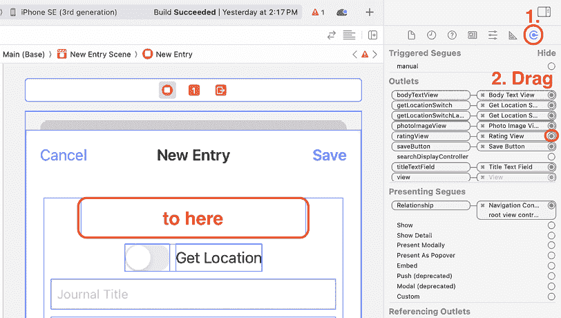
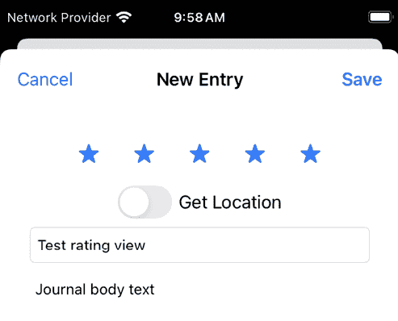
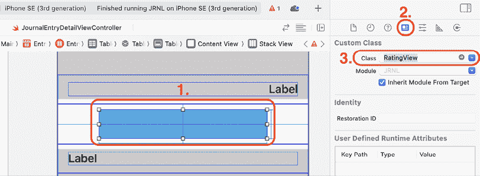
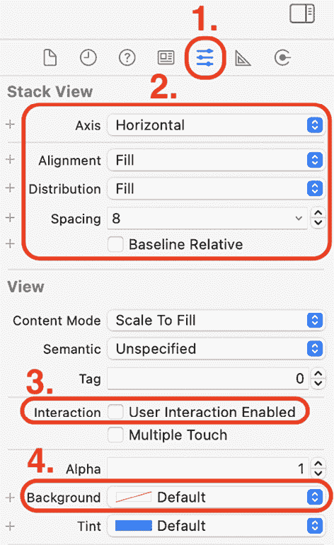
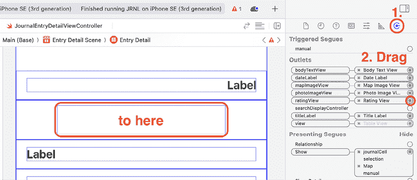
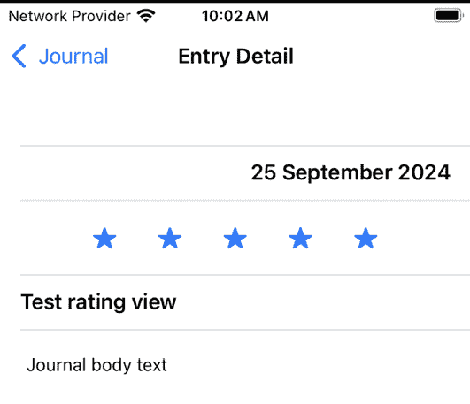

# 第十九章：开始使用自定义视图

到目前为止，您的 *JRNL* 应用已经可以正常工作。所有屏幕都正常工作，但由于缺少评分用户界面元素，您无法设置如应用演示中所示的星星评分。您也无法设置自定义图片，但这将在 *第二十章*，*开始使用相机和照片库* 中解决。

到目前为止，您一直在使用苹果的标准 UI 元素。在本章中，您将创建一个 `UIStackView` 类的 **自定义视图** 子类，该子类以星星的形式显示日记条目的评分，并且您将修改这个子类，以便用户可以通过点击来设置日记条目的评分。之后，您将在“添加新日记条目”屏幕上实现它。最后，您将在“日记条目详情”屏幕上实现它。

到本章结束时，您将学会如何为您的应用创建自定义视图。

本章将涵盖以下主题：

+   创建自定义 `UIStackView` 子类

+   将您的自定义视图添加到“添加新日记条目”屏幕

+   将您的自定义视图添加到“日记条目详情”屏幕

# 技术要求

您将继续在上一章中修改的 `JRNL` 项目上工作。

本章完成的 Xcode 项目位于本书代码包的 `Chapter19` 文件夹中，可以通过以下链接下载：

[`github.com/PacktPublishing/iOS-18-Programming-for-Beginners-Ninth-Edition`](https://github.com/PacktPublishing/iOS-18-Programming-for-Beginners-Ninth-Edition%0D)

观看以下视频以查看代码的实际效果：

[`youtu.be/Y21q6voqYuk`](https://youtu.be/Y21q6voqYuk%0D)

让我们先学习如何创建一个自定义 `UIStackView` 子类，该子类将在屏幕上显示星星评分。

# 创建自定义 UIStackView 子类

到目前为止，您只使用了苹果预定义的 UI 元素，例如标签和按钮。您所需要做的只是点击库按钮，搜索您想要的元素，并将其拖入故事板。然而，在某些情况下，苹果提供的对象可能不适合或不存在。在这种情况下，您将需要自己构建。让我们回顾一下您在应用演示中看到的“添加新日记条目”屏幕：



图 19.1：显示星星评分的“添加新日记条目”屏幕

您可以看到一组五个星星位于 **获取位置** 开关的上方。目前，`Main` 故事板文件中的 **新条目场景** 和 **条目详情场景** 有占位符视图对象，星星应该在那里。您将创建 `RatingView` 类，这是一个 `UIStackView` 类的定制子类，您将在两个场景中使用它。这个类的实例将显示评分作为星星。

在本章的剩余部分，`RatingView` 类的实例将被称为评分视图（与 `UIButton` 类的实例被称为按钮的方式相同）。

让我们从创建 `UIStackView` 类的子类开始。按照以下步骤操作：

1.  在项目导航器中，右键单击**JRNL**文件夹，从弹出菜单中选择**新建组**。将此组命名为**视图**。将此组移动到**模型**组下方的新位置：



图 19.2：项目导航器显示视图组位于模型组下方

1.  右键单击**视图**文件夹，从弹出菜单中选择**从模板新建文件...**。

1.  **iOS**应该已经选中。选择**Cocoa Touch 类**然后点击**下一步**。

1.  按照以下方式配置文件：

    +   **类**：`RatingView`

    +   **子类**：`UIStackView`

    +   **语言**：`Swift`

点击**下一步**。

1.  点击**创建**。`RatingView`文件将出现在项目导航器中。

1.  删除此文件中的所有注释代码，并在`RatingView`类声明之后输入以下内容以声明类的属性：

    ```swift
    // MARK: - Properties
    private var ratingButtons = [UIButton()]
    var rating = 0
    private let buttonSize = CGSize(width: 44.0, height: 44.0)
    private let buttonCount = 5 
    ```

`ratingButtons`属性是一个数组，将包含此类中所有的按钮。

`rating`属性用于存储日记条目的评分。它决定了将要绘制多少个星形以及星形的类型。例如，如果`rating`包含`3`，评分视图将显示三个填充星形和两个空星形。

`buttonSize`属性确定要在屏幕上绘制的按钮的高度和宽度。

`buttonCount`属性确定要在屏幕上绘制的按钮总数。

1.  在属性声明之后实现此类的初始化器：

    ```swift
    // MARK: - Initialization
    required init(coder: NSCoder) {
      super.init(coder: coder)
    } 
    ```

1.  在初始化器之后实现一个在屏幕上绘制星形的方法：

    ```swift
    // MARK: - Private methods
    private func setupButtons() {
      for button in ratingButtons {
        removeArrangedSubview(button)
        button.removeFromSuperView()
      }
      ratingButtons.removeAll()
      let filledStar = UIImage(systemName:"star.fill" )
      let emptyStar = UIImage(systemName: "star")
      let highlightedStar =
      UIImage(systemName: "star.fill")?.withTintColor(.red,
      renderingMode: .alwaysOriginal)
      for _ in 0..<buttonCount {
        let button = UIButton()
        button.setImage(emptyStar, for: .normal)
        button.setImage(filledStar, for: .selected)
        button.setImage(highlightedStar, for: .highlighted)
        button.setImage(highlightedStar, for: [.highlighted,    .selected])
        button.translatesAutoresizingMaskIntoConstraints =
        false
        button.heightAnchor.constraint(equalToConstant:     buttonSize.height).isActive = true
        button.widthAnchor.constraint(equalToConstant:     buttonSize.width).isActive = true
        addArrangedSubview(button)
        ratingButtons.append(button)
      }
    } 
    ```

让我们分解一下：

```swift
for button in ratingButtons {
  removeArrangedSubview(button)
  button.removeFromSuperView()
}
ratingButtons.removeAll() 
```

这些语句从堆叠视图中移除任何现有的按钮和`ratingButtons`数组。

```swift
let filledStar = UIImage(systemName:"star.fill" )
let emptyStar = UIImage(systemName: "star")
let highlightedStar =
UIImage(systemName: "star.fill")?.withTintColor(.red,
renderingMode: .alwaysOriginal) 
```

这些语句从苹果的`SFSymbols`库中的符号创建三个`UIImage`实例。`filledStar`将存储填充星形的图像，`emptyStar`将存储星形轮廓的图像，而`highlightedStar`将存储被着色为红色的填充星形的图像。

更多关于苹果的`SFSymbols`库的信息，请参阅[`developer.apple.com/design/human-interface-guidelines/sf-symbols`](https://developer.apple.com/design/human-interface-guidelines/sf-symbols)。

```swift
for _ in 0..<buttonCount { 
```

由于`buttonCount`设置为`5`，这个`for`循环将重复五次。

```swift
let button = UIButton() 
```

此语句将`UIButton`的一个实例分配给`button`。

更多关于`UIButton`的信息，请参阅[`developer.apple.com/documentation/uikit/uibutton`](https://developer.apple.com/documentation/uikit/uibutton)。

```swift
button.setImage(emptyStar, for: .normal)
button.setImage(filledStar, for: .selected)
button.setImage(highlightedStar, for: .highlighted)
button.setImage(highlightedStar, for: [.highlighted, .selected]) 
```

这些语句设置了`UIButton`实例的不同状态下的图像。`.normal`状态显示星形轮廓。在`.selected`状态下，显示填充星形。如果你点击`UIButton`实例，它将处于`.highlighted`状态或`.highlighted`和`.selected`状态，这取决于点击之前它是在`.normal`状态还是`.selected`状态。然后显示带有红色色调的填充星形。

```swift
button.translatesAutoresizingMaskIntoConstraints =
false
button.heightAnchor.constraint(equalToConstant: buttonSize.height).isActive = true
button.widthAnchor.constraint(equalToConstant: buttonSize.width).isActive = true 
```

这些语句设置了按钮的大小。第一条语句将`UIButton`实例的`translatesAutoresizingMaskIntoConstraints`属性设置为`false`；否则，系统将创建一组约束，这些约束会重复视图自动调整大小掩码中指定的行为，你将无法设置自己的约束。接下来的两个语句通过使用存储在`buttonSize`中的值以编程方式设置实例的高度和宽度约束。

```swift
addArrangedSubview(button) 
```

这条语句将`UIButton`实例作为子视图以编程方式添加到堆叠视图中。

```swift
ratingButtons.append(button) 
```

这条语句将`UIButton`实例添加到`ratingButtons`数组中。

1.  在初始化器中调用`setupButtons()`方法：

    ```swift
    required init(coder: NSCoder) {
      super .init(coder: coder)
      **setupButtons****()**
    } 
    ```

当评分视图初始化时，这将在屏幕上绘制评分视图。

你已经创建了一个名为`RatingView`的自定义`UIStackView`子类，并且已经添加了代码使其在屏幕上绘制五个星星。现在让我们添加代码，使用户能够在评分视图中的星星被点击时更改评分。按照以下步骤操作：

1.  实现一个方法，在`setupButtons()`方法之后，当在`ratingButtons`数组中的按钮被点击时，更改评分视图的`rating`属性：

    ```swift
    @objc private func ratingButtonTapped(_ button: UIButton) {
      guard let index = ratingButtons.firstIndex(of: button)   else {
        fatalError("The button, \(button), is not in the 
        ratingButtons array: \(ratingButtons)")
      }
      let selectedRating = index + 1
      if selectedRating == rating {
        rating = 0
      } else {
        rating = selectedRating
      }
    } 
    ```

当`ratingButtons`数组中的按钮被点击时，`guard`语句将按钮的索引分配给`index`。然后`selectedRating`被设置为`index` + 1 存储的值。如果`rating`属性的值与`selectedRating`相同，则将其设置为`0`；否则，将其设置为与`selectedRating`相同的值。

例如，假设你在评分视图中的第三个星星上点击。由于第三个星星是`ratingButtons`数组中的第三个元素，`index`将被设置为`2`，`selectedRating`将被设置为 2 + 1 = `3`。假设`rating`属性的初始值是`0`，`selectedRating == rating`将返回`false`，因此`rating`属性的值将被设置为`3`。

1.  在设置约束的语句之后，在`setupButtons`方法的`for`循环中将此方法分配为按钮动作：

    ```swift
    button.widthAnchor.constraint(equalToConstant: starSize.width).isActive = true
    **button.****addTarget****(****self****, action:** **#selector****(****RatingView****.****ratingButtonTapped****(****_****:)),** **for****: .****touchUpInside****)**
    addArrangedSubview(button) 
    ```

1.  添加一个方法来根据在闭合花括号之前设置的评分来改变按钮的状态：

    ```swift
    private func updateButtonSelectionStates() {
      for (index, button) in ratingButtons.enumerated() {
        button.isSelected = index < rating
      }
    } 
    ```

为了了解这是如何工作的，让我们假设`rating`属性被设置为`3`。每个按钮的默认状态是`.normal`。

第一个按钮位于索引`0`，因此`button.isSelected`是 0 < 3，返回`true`。由于`.selected`状态下的图像是一个填充的星星，因此这个按钮的图像被设置为填充的星星。对于接下来的两个按钮也是如此。

第四个按钮位于索引`3`，因此`button.isSelected`是 3 < 3，返回`false`。这意味着按钮的状态保持为`.normal`。`.normal`状态下的图像是一个星星轮廓，因此这个按钮的图像被设置为星星轮廓。对于第五个按钮也是如此。

简而言之，当`rating`属性设置为`3`时，评分视图显示前三个带有填充星星的按钮，其余两个按钮带有星星轮廓。

1.  每当`rating`属性的值发生变化时，都需要调用`updateButtonSelectionStates()`方法。为此，按如下方式修改`rating`属性：

    ```swift
    var rating = 0 **{**
    **didSet** **{**
    **updateButtonSelectionStates****()**
     **}**
    **}** 
    ```

这被称为**属性观察者**，每当`rating`属性的值发生变化时，`updateButtonSelectionStates()`方法都会被调用。

您已完成了评分视图的实现。在下一节中，您将将其添加到添加新日志条目屏幕。

# 将您的自定义视图添加到添加新日志条目屏幕

到目前为止，您已在项目中创建了一个新的`RatingView`类，并配置它在其中的星形按钮被点击时设置其`rating`属性。在本节中，您将设置**新条目场景**中位于**获取位置**开关上方的堆栈视图对象的身份为`RatingView`类，在`AddJournalEntryViewController`类中为其配置一个出口，并在创建新日志条目时添加使用`rating`属性值的代码。按照以下步骤操作：

1.  在项目导航器中，点击**AddJournalEntryViewController**文件。在所有其他属性声明之后，在`AddJournalEntryViewController`类中为评分视图添加一个新的出口：

    ```swift
    @IBOutlet var getLocationSwitch: UISwitch!
    @IBOutlet var getLocationSwitchLabel: UILabel!
    **@IBOutlet****var****ratingView****:** **RatingView****!** 
    ```

1.  修改`prepare(for:sender:)`方法，在创建新日志条目时获取评分视图的`rating`属性值：

    ```swift
    let photo = photoImageView.image
    let rating = **ratingView****.****rating**
    let lat = currentLocation?.coordinate.latitude 
    ```

1.  点击**主**故事板文件，并在文档大纲中选择**新条目场景**。如图所示，点击位于**获取位置**开关上方的`UIStackView`对象：


图 19.3：编辑区域显示位于获取位置开关上方的 UIStackView 对象

1.  点击身份检查器按钮。在**自定义类**下，将**类**设置为`RatingView`：



图 19.4：身份检查器，类设置为 RatingView

1.  点击属性检查器按钮。验证**堆栈视图**下的设置，并在**视图**下将**背景**设置为`Default`：


图 19.5：背景设置为默认的属性检查器

1.  在文档大纲中点击**新条目场景**，然后点击连接检查器按钮。将`ratingView`出口连接到**新条目**场景中的评分视图：



图 19.6：连接检查器显示 ratingView 出口

1.  构建并运行您的应用。点击**+**按钮进入添加新日志条目屏幕，您将看到评分视图显示在**获取位置**开关上方。添加日志条目标题、正文和评分，然后点击**保存**：



图 19.7：模拟器显示在添加新日志条目屏幕上的评分视图

带有评分的新日志条目现在在日志列表屏幕上可见。在下一节中，您将修改日志条目详情屏幕以显示此日志条目的评分。

# 将您的自定义视图添加到日志条目详情屏幕

到目前为止，你可以在使用“添加新日记条目”屏幕创建新日记条目时设置评分，但你设置的评分在“日记条目详情”屏幕上不可见。你将为评分视图添加一个输出，并修改`JournalEntryDetailViewController`类中的代码，你将在**条目详情场景**中添加一个评分视图。

按照以下步骤操作：

1.  在项目导航器中，点击**JournalEntryDetailViewController**文件。在其他属性声明之后添加一个评分视图的输出：

    ```swift
    @IBOutlet var photoImageView: UIImageView!
    @IBOutlet var mapImageView: UIImageView!
    **@IBOutlet****var****ratingView****:** **RatingView****!** 
    ```

1.  修改`viewDidLoad()`方法中的代码以设置评分视图的`rating`属性：

    ```swift
    super.viewDidLoad()
    dateLabel.text = selectedJournalEntry?.date.formatted(
    .dateTime.day().month(.wide).year()
    )
    **ratingView****.****rating****=****selectedJournalEntry****?****.****rating****??****0**
    titleLabel.text = selectedJournalEntry?.entryTitle 
    ```

1.  点击**Main**故事板文件，然后在文档大纲中点击**Entry Detail Scene**。选择第二个表格视图单元格中的堆叠视图。点击身份检查器按钮，并在**自定义类**下将**类**设置为`RatingView`：



图 19.8：身份检查器，类设置为 RatingView

1.  点击属性检查器按钮，并验证**堆叠视图**下的设置。在**视图**下，取消选中**用户交互启用**复选框（因为用户不应该能够在“日记条目详情”屏幕上更改评分），并将**背景**设置为`默认`：



图 19.9：背景设置为默认的属性检查器

1.  在文档大纲中点击**Entry Detail Scene**，然后点击连接检查器按钮。将**ratingView**输出连接到**Entry Detail**场景中的评分视图：



图 19.10：连接检查器显示 ratingView 输出

1.  构建并运行你的应用程序。点击上一节中添加的日记条目，你将在“日记条目详情”屏幕上的评分视图中看到评分：



图 19.11：模拟器显示“日记条目详情”屏幕上的评分视图

你已经在“日记条目详情”屏幕上成功添加并配置了评分视图！做得好！

# 摘要

在本章中，你创建了一个自定义的`UIStackView`类子类，以星形的形式显示日记条目的评分，并且修改了这个子类，使用户可以通过点击来设置日记条目的评分。之后，你将其添加到“添加新日记条目”屏幕中。最后，你在“日记条目详情”屏幕上实现了它。

现在，你知道如何为你的应用程序创建自定义视图。

在下一章中，你将学习如何处理来自相机或照片库的照片。

# 加入我们的 Discord 社区！

与其他用户、专家和作者本人一起阅读这本书。提问、为其他读者提供解决方案、通过“问我任何问题”环节与作者聊天，等等。扫描二维码或访问链接加入社区。

[`packt.link/ios-Swift`](https://packt.link/ios-Swift%0D)


