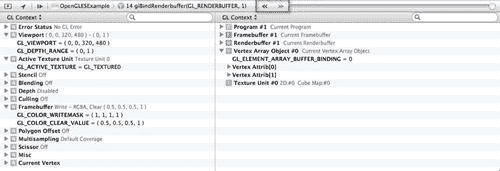

# 第三章：使用 OpenGL ES 调试

**开放图形库**（**OpenGL**）可以简单地定义为“图形硬件的软件接口”。它是一个高度可移植且非常快速的 3D 图形和建模库。使用 OpenGL 图形 API，你可以创建一些能够表示 2D 和 3D 数据的出色图形。

OpenGL 库是一个多用途的开源图形库，支持 2D 和 3D 数字内容创作、机械和建筑设计、虚拟原型设计、飞行模拟和视频游戏等应用，并允许应用程序开发者配置 3D 图形管线，并向其提交数据。

对象由连接的顶点定义。然后对象的顶点被变换、光照，并组装成原语，然后光栅化以创建一个可以直接发送到底层图形硬件进行渲染的 2D 图像，这通常非常快，因为硬件是专门用于处理图形命令的。

**嵌入式系统 OpenGL**（**OpenGL ES**）是流行的 OpenGL 框架的简化版本，它被开发得更容易学习和实现，消除了 iOS 图形硬件中冗余功能的需求。这个框架已经优化，以充分利用硬件加速的数学运算，从而使开发者能够获得最佳性能。

在本章中，我们将重点关注 OpenGL ES 调试器带来的新调试特性，使开发者能够追踪代码中与 OpenGL ES 相关的具体问题。

在本章中，我们将：

+   了解 Xcode 4 中的新工作流程特性

+   创建一个简单的项目来调试 OpenGL ES 应用程序

+   熟悉 OpenGL ES 2.0 可编程管线

+   编译和链接着色器到 OpenGL ES 程序

+   使用统一变量和属性从应用程序传递数据到着色器

+   检测 OpenGL ES 状态信息（视图纹理和着色器）

+   设置和使用断点来捕获 OpenGL ES 错误

+   设置条件 OpenGL ES 入口点断点

+   在帧边界处断点

本章我们将探讨一些精彩的内容，让我们开始吧。

# 理解 Xcode 中的新工作流程特性

在本节中，我们将探讨 Xcode 4 开发环境所做的改进，以及这如何使我们比之前版本的 Xcode 更容易地调试 OpenGL ES 应用程序。

我们将探讨如何使用调试器的帧捕获功能来捕获 OpenGL ES 应用程序中包含的所有帧对象。这个工具使你能够在特定时间点列出应用程序当前使用的所有帧对象。

我们将熟悉 Xcode 中的新 OpenGL ES 调试器，以便我们能够追踪代码中与 OpenGL ES 相关的具体问题。

## 创建一个简单的项目以调试 OpenGL ES 应用程序

在我们继续之前，我们首先需要创建我们的`OpenGLESExample`项目。为了唤起您的记忆，您可以参考我们在第二章中涵盖的部分，在*创建 iCloudExample 应用程序*部分：

1.  从`/Developer/Applications`文件夹中启动 Xcode。

1.  从**项目**模板对话框中选择**OpenGL 游戏**模板。

1.  然后，点击**下一步**按钮以继续向导的下一步。这将允许您输入**产品名称**和您的**公司标识符**。

1.  在**产品名称**中输入`OpenGLESExample`，并确保您已从**设备家族**下拉框中选择了**iPhone**。

1.  接下来，点击**下一步**按钮以继续向导的最终步骤。

1.  6 选择您想要保存项目的文件夹位置。

1.  然后，点击**创建**按钮以在指定位置保存您的项目。

一旦创建了项目，您将看到 Xcode 开发界面，以及模板在项目**导航器**窗口中为您创建的项目文件。

现在我们已经创建了项目，我们需要配置项目以使我们能够调试对象的状态。

## 检测 OpenGL ES 状态信息和对象

为了使我们能够检测和监控应用程序中对象的状态，我们需要通过项目中的**编辑方案…**部分启用此功能，如图下所示：


在**编辑方案**部分，如图下所示，选择**运行 OpenGLESExampleDebug**操作，然后点击**选项**选项卡，然后选择**OpenGL ES 启用**帧捕获复选框。

### 注意

为了使此功能正常工作，您必须在 iOS 设备上运行应用程序，并且设备必须运行 iOS 5.0 或更高版本。此功能在 iOS 模拟器中不会工作。您需要确保在连接设备后，您需要重新启动 Xcode 以使此选项可用。


当您正确配置了项目后，点击**确定**按钮以接受所做的更改，并关闭对话框。接下来，构建并运行您的 OpenGL ES 应用程序。当您运行应用程序时，您将看到两个三维彩色立方体盒子。


当您在 iOS 设备上运行应用程序时，您会注意到帧捕获出现在 Xcode 4 调试栏中，如图下所示：


当使用 Xcode 4.2 的 OpenGL ES 功能时，这些调试功能使您能够执行以下操作：

1.  检查 OpenGL ES 状态信息。

1.  反思 OpenGL ES 对象，如视图纹理和着色器。

1.  步进绘制调用并观察每次调用时的变化。

1.  步进每个绘制调用之前的每个状态调用，以确切了解图像是如何构建的。

以下截图显示了我们的示例应用程序捕获的帧。调试导航器包含与该特定帧相关联的每个绘制调用和状态调用的列表。

与帧关联的缓冲区在编辑器面板中显示，状态信息在调试窗口面板中显示。当启动 OpenGL ES 帧捕获时，默认视图显示在**自动**视图中。此视图显示颜色部分，即`Renderbuffer #1`，以及图像的灰度等效部分，即`Renderbuffer #2`。


您还可以在红色、绿色和蓝色以及 alpha 通道的每个通道之间切换可见性，然后使用**范围**滚动条调整颜色范围。这可以通过选择前一个截图所示的每个齿轮按钮轻松完成。


您还可以通过调试导航器中的每个绘制调用或使用调试栏中的双箭头和滑块来步进每个绘制调用。



当使用绘制调用箭头或滑块时，您可以让 Xcode 从调试导航器中选择步进的绘制调用。这可以通过*Control* + 点击捕获的帧下方，并从快捷菜单中选择**在调试导航器中显示**来实现。


您还可以使用快捷菜单在绘制图像的标准视图和显示对象的线框视图之间切换，通过从弹出菜单中选择**显示线框**选项，如前一个截图所示。

当使用对象的线框视图时，它突出显示由所选绘制调用绘制的元素。要关闭线框功能并将图像返回到正常状态，请从弹出菜单中选择**隐藏线框**选项，如以下截图所示：


现在您已经对通过 OpenGL ES 应用程序及其绘制调用进行调试有了合理的理解，让我们看看我们如何查看与 OpenGL ES 应用程序关联的纹理。

### 查看纹理

当在 OpenGL ES 中引用纹理时，这基本上是一个可以被图形引擎管道采样的图像，并用于将彩色图像映射到映射表面上。要查看通过帧捕获按钮捕获的对象，请按照以下简单步骤操作：

1.  打开**辅助编辑器**以查看与捕获帧关联的对象。在此视图中，你可以选择查看所有对象、仅绑定对象或堆栈。这可以通过以下截图所示的**视图 | 辅助编辑器 | 显示辅助编辑器**菜单访问：

1.  打开一个辅助编辑器面板，这样你就可以同时看到对象和堆栈帧。这可以通过之前显示的**视图 | 辅助编辑器 | 添加辅助编辑器**菜单访问，或者通过点击以下截图所示的**+**符号：


要查看 OpenGL ES 辅助编辑器中任何对象的详细信息，请双击该对象，或从弹出列表中选择该项，如图下所示截图：

值得注意的是，从该视图中，你可以更改已捕获并渲染到视图中的任何对象的朝向。要更改朝向，找到屏幕右下角显示的**方向**选项。根据需要，对象可以被更改以在一个或多个视图中显示，如下所示：

+   顺时针旋转

+   逆时针旋转

+   垂直翻转方向

+   水平翻转方向


例如，如果你想查看关于**顶点数组对象**（VAO）的信息，你可以双击它以更详细地查看，如图下所示截图。


这显示了构建我们每个对象所需的全部`X, Y`和`Z`轴。接下来，我们将探讨着色器的构建方式。

### 着色器

你可以为 OpenGL ES 编写两种类型的着色器；这些是**顶点着色器**和**片段着色器**。

这两个着色器构成了 OpenGL ES 2.0 可编程管道中所谓的**可编程**部分，并且使用类似于 C 语言的语法编写，称为**OpenGL ES 着色语言**（GLSL）。

以下截图概述了 OpenGL ES 2.0 可编程管道，并结合了一个适用于 iOS 设备的嵌入式平台的 OpenGL 着色语言版本，用于编程**顶点着色器**和**片段着色器**：


着色器并不新鲜，这些已经在各种使用 OpenGL 的游戏中得到了应用。例如，Doom 3 和 Quake 4，或者几个飞行模拟器，如微软的 Flight Simulator X。

### 小贴士

关于着色器有一点需要注意，那就是它们在应用程序构建时不会被编译。着色器的源代码以文本文件的形式存储在您的应用程序包中，或者作为字符串字面量定义在您的代码中，即`vertShaderPathname = [[NSBundlemainBundle] pathForResource:@"Shader" ofType:@"vsh"]`;

在您可以使用着色器之前，您的应用程序必须加载和编译每个着色器。这样做是为了保持设备独立性。

以苹果决定为未来发布的 iPhone 更换不同的 GPU 制造商为例，如果苹果更换了 GPU 制造商，编译后的着色器可能在新 GPU 上无法工作。让您的应用程序在运行时延迟编译将避免这个问题，并且任何最新的 GPU 版本都将得到全面支持，而无需您重新构建应用程序。

下表解释了两种着色器之间的区别。

| **着色器类型** | 描述 |
| --- | --- |
| 顶点着色器 | 这些是在您的场景中每次调用一次的程序。为了更好地解释这一点，例如，如果您使用单个正方形渲染一个简单的场景，每个角落有一个顶点，这将被调用四次。它们的工作是执行一些计算，如光照、几何变换、移动、缩放和旋转对象，以模拟现实感。 |
| 片段着色器 | 这些是在您的场景中每次调用一次的程序。例如，如果您使用单个正方形渲染相同的简单场景，它将为正方形覆盖的每个像素调用一次。片段着色器还可以执行光照计算等操作，但它们最重要的任务是设置像素的最终颜色。 |

接下来，我们将从检查 OpenGL 模板为我们创建的顶点着色器实现开始。您会注意到这些着色器是使用类似 C 语法的指令实现的代码文件。让我们首先通过以下简单步骤检查顶点着色器文件的每个部分：

1.  打开位于**项目导航器**窗口中的`OpenGLESExample`文件夹内的`Shader.vsh`顶点着色器文件，并检查以下代码片段。

    ```swift
    attribute vec4 position;
    attribute vec3 normal;
    varying lowp vec4 colorVarying;
    uniform mat4 modelViewProjectionMatrix;
    uniform mat3 normalMatrix;
    void main(){
    vec3 eyeNormal = normalize(normalMatrix * normal);
    vec3 lightPosition = vec3(0.0, 0.0, 1.0);
    vec4 diffuseColor = vec4(0.4, 0.4, 1.0, 1.0);
    floatnDotVP = max(0.0, dot(eyeNormal, normalize(lightPosition)));
    colorVarying = diffuseColor * nDotVP;
    gl_Position = modelViewProjectionMatrix * position;
    }

    ```

1.  接下来，我们将查看这段代码的功能，并解释实际上发生了什么。那么，让我们开始吧。

    `attribute`关键字声明这个着色器将通过一个名为`position`的输入变量传递。这将用于指示顶点的位置。您会注意到`position`变量已被声明为`vec4`类型，这意味着每个顶点包含四个浮点值。第二个声明为`normal`的属性输入变量已被声明为`vec3`类型，这意味着顶点包含三个用于围绕`x`、`y`和`z`轴旋转的浮点值。

    使用变量名 `diffuseColor` 声明的第三个属性输入变量，定义了用于顶点的颜色。我们声明了另一个名为 `colorVarying` 的变量。你会注意到它不包含属性关键字。这是因为它是一个输出变量，将被传递到片段着色器。

    `varying` 关键字告诉我们特定顶点的值。这基本上意味着你可以为每个顶点指定不同的颜色，这将使所有中间值形成一个整洁的渐变，你将在最终输出中看到。我们将其声明为 vec4，因为颜色由四个分量值组成。

1.  最后，我们声明了两个名为 `modelViewProjectionMatrix` 和 `normalMatrix` 的统一关键字变量。模型矩阵、视图矩阵和投影矩阵是三个独立的矩阵。模型矩阵将对象的局部坐标空间映射到世界空间，视图矩阵将世界空间映射到相机空间，投影矩阵将相机空间映射到屏幕空间。

    当使用所有三个时，你可以使用其中一个结果将对象空间映射到屏幕空间，从而让你能够确定需要传递给可编程管道下一阶段的顶点位置信息。

    正常矩阵向量用于确定指定顶点或表面接收到的光量。统一变量是允许你从应用程序代码传递到着色器的第二种数据形式。统一类型对顶点和片段着色器都可用，与属性不同，属性只对顶点着色器可用。

    ### 注意

    统一变量的值不能被着色器更改，并且每次着色器在管道中给定行程时都将具有相同的值。统一变量还可以包含任何你想要传递到着色器中以供使用的任意类型的数据。

1.  接下来，我们将从每个顶点的颜色属性值将值赋给 `colorVarying` 变量。这个值将在片段着色器中以插值形式可用。

1.  最后，我们修改了 `gl_Position` 输出变量，使用浮点平移变量沿着 `X, Y` 和 `Z` 轴移动顶点，基于平移统一变量的值。

    接下来，我们将查看 OpenGL ES 模板为我们创建的片段着色器。

1.  打开位于 **Project Navigator** 窗口 **OpenGLESExample** 文件夹中的 `Shader.fsh` 片段着色器文件，并检查以下代码片段。

    ```swift
    varying lowp vec4 colorVarying;
    void main(){
    gl_FragColor = colorVarying;
    }

    ```

我们现在将查看这段代码，并解释这里实际上发生了什么。

你会注意到在片段着色器中，突出显示的 `colorVarying` 变量的声明与顶点着色器中的名称相同。这非常重要；如果这些名称不同，OpenGL ES 将不会意识到它们是相同的变量，你的程序将产生意外的结果。

类型也非常重要，它必须与在顶点着色器中声明的数据类型相同。这是一个 GLSL 关键字，用于指定表示数字的字节数的精度。

从编程的角度来看，用于表示数字的字节数越多，你可能会遇到的浮点计算舍入问题就越少。GLSL 允许用户在任何声明变量时使用精度修饰符，并且必须在文件中声明。如果在片段着色器中未声明它，将导致你的着色器无法编译。

`lowp`关键字在插值过程中会提供最佳性能和最低精度。当处理颜色时，这是更好的选择，因为小的舍入误差并不重要。如果你需要提高精度，最好使用`mediump`或`highp`，如果精度不足导致你在应用程序中遇到问题。

### 注意

更多关于**OpenGL ES 着色语言**（GLSL）或**精度修饰符**的信息，请参阅以下位于：[`www.khronos.org/registry/gles/specs/2.0/GLSL_ES_Specification_1.0.17.pdf`](http://www.khronos.org/registry/gles/specs/2.0/GLSL_ES_Specification_1.0.17.pdf)的文档。

# OpenGL ES 的错误处理

OpenGL 为基本 GL 和 GLU 库提供简单的错误处理例程。你可以使用`glGetError`函数来检查错误。OpenGL 只记录第一个发生的错误。所有后续的错误都会被忽略，直到通过调用`glGetError`清除错误缓冲区。

导致错误的命令被忽略，因此它对 OpenGL 状态或帧缓冲区内容没有影响。一旦记录，当前错误代码不会清除，并且不会记录额外的错误，直到你调用查询命令`glGetError()`，该命令返回当前错误代码。在你查询并清除当前错误代码之后，或者如果一开始就没有错误，`glGetError()`返回`GL_NO_ERROR`。`glGetError`函数的语法定义如下：

```swift
GLenum glGetError (void);

```

`glGetError`函数返回错误标志的值。当在 GL 或 GLU 库中检测到错误时，错误标志设置为适当的错误代码值。

### 注意

如果返回`GL_NO_ERROR`，则自上次调用`glGetError()`以来或自 GL 初始化以来没有检测到错误。

如果在调用`glGetError()`方法之前没有记录其他错误，将返回错误代码，并将标志重置为`GL_NO_ERROR`。

以下表格列出了由`glGetError`方法调用返回的基本定义的 OpenGL 错误代码及其描述：

| **错误代码** | **描述** |
| --- | --- |
| `GL_INVALID_ENUM` | `GLenum`参数超出范围 |
| `GL_INVALID_VALUE` | 数字参数超出范围 |
| `GL_INVALID_OPERATION` | 当前状态下非法操作 |
| `GL_STACK_OVERFLOW` | 命令会导致栈溢出 |
| `GL_STACK_UNDERFLOW` | 命令会导致栈下溢 |
| `GL_OUT_OF_MEMORY` | 执行命令时内存不足 |
| `GL_NO_ERROR` | 没有发生错误。 |

## 通过设置断点来检测错误

在你的代码中设置断点为你提供了在任何点停止执行的能力，这样你可以调查并逐步执行以找出为什么某段代码不能正确工作。如果你想要逐步执行特定的 OpenGL 函数，这尤其有用。这些断点应该在调用函数之前立即设置，并且你的程序将被停止，状态栏将指示哪个函数导致了断点。

## 在你的代码中设置断点

虽然你可以使用调试器在任何时候暂停程序的执行并查看运行代码的状态，但在运行可执行文件之前设置断点通常更有帮助，这样你可以在已知点停止，并查看源代码中变量的值。

断点基本上是代码中的一条指令，告诉应用程序在达到断点时停止，程序执行暂停，等待进一步的指令以确定下一步操作。在这个阶段，你有机会检查任何属性当前值，或者逐步执行代码。

让我们看看以下使用 `glGetError` 方法的例程。

```swift
- (void)startAnimation{
if (!animating) {
CADisplayLink *aDisplayLink = [[UIScreenmainScreen] displayLinkWithTarget:self selector:@selector(drawFrame)];
[aDisplayLinksetFrameInterval:animationFrameInterval];
[aDisplayLinkaddToRunLoop:[NSRunLoopcurrentRunLoop] forMode:NSDefaultRunLoopMode];
self.displayLink = aDisplayLink;
GLenum err;
err = glGetError();
while ( GL_NO_ERROR != err ) {
NSLog(@"Error. glError: 0x%04X", err);
err = glGetError();
}
animating = YES;
}
}

```

你会注意到我们已声明了一个变量 `err`，它将用于存储 `glGetError` 方法将返回的错误号。然后我们遍历并输出每个错误消息的详细信息到调试控制台窗口，直到没有更多错误为止，然后退出循环。虽然你可以使用 Xcode 4 调试器在任何时候暂停程序的执行以查看运行代码的状态，但在运行应用程序之前在那些区域设置断点更有帮助。

要设置断点，请打开任何源实现文件，并在 Xcode 源编辑器的行号区域（gutter pane section）中点击，点击位置是你希望程序停止的地方。当你添加断点时，Xcode 会自动启用它，并在下面的屏幕截图中以浅蓝色显示。通过再次点击断点，也可以切换断点以关闭，此时颜色会变得更加透明。

**断点导航器**窗口显示项目中设置的所有当前断点，并将显示所有活动和非活动断点。


此视图包含可以针对每个断点配置的几个选项，一个断点可以包含多个条件。您可以选择将消息记录到 Xcode 控制台窗口，或执行一个`debug`命令。要访问此视图，请按住*控制*键，并用鼠标右键单击。

Xcode 4.2 带来的一个新功能是能够捕获 OpenGL 帧，这样您就可以在 Xcode 开发环境中直接调试代码，滚动查看每个 OpenGL ES 方法调用，以及查看状态和对象。

## 设置条件 OpenGL ES 入口点断点

我们已经讨论了在您希望应用程序在特定行被击中时停止的情况下设置代码中的断点。另一种使用断点的方法是，当满足特定条件时停止，然后执行特定的操作，如下面的示例所示：


您可以选择在条件满足时停止，如图所示，或者您可以选择完全忽略条件，并在方法被调用指定次数后执行。

然后，您可以选择执行特定的操作。如从下面的屏幕截图中可以看到，我们设置了一个条件，当变量`transY`大于或等于`2`时捕获当前帧。这将启动**OpenGL 帧捕获**部分，以便我们可以逐步调试代码，查看发生了什么。

我们还可以通过使用**Instruments**来调试 OpenGL ES 项目，这些内容将在第六章*Xcode 工具改进*中介绍。

## 在帧边界上断点

**OpenGL ES 调试器**允许您查看应用程序中正在绘制的所有帧。您可以让应用程序在程序中的某个特定点中断，然后使用调试导航器导航到代码中帧被绘制的地方。在下面的屏幕截图中，它显示了捕获的帧实例，并显示了与该帧相关联的状态调用：


选择如图所示的`glDrawArrays(GL_TRIANGLE_STRIP, 0, 4)`选项，将允许您看到所有相关绘制调用的列表。您还可以使用滚动条循环查看之前屏幕截图中捕获的帧。


点击如图所示的**[OpenGLESExampleViewController drawframe]**方法，将打开 Xcode 开发 IDE，并直接带您到代码所在的位置，如下面的屏幕截图所示：


通过使用 OpenGL ES 调试器，你可以逐帧遍历你的应用程序，帮助你追踪和调试纹理渲染不正确的情况，或者如果对象的颜色看起来很奇怪。

# 摘要

在本章中，我们学习了顶点着色器和片段着色器之间的区别，以及它们之间的关系。然后我们探讨了 OpenGL ES 的新调试功能，以及这个新的 Xcode 调试器如何允许你在 Xcode IDE 中追踪代码中特定的 OpenGL ES 问题。

我们熟悉了 OpenGL ES 帧捕获工具，它能够停止程序的执行，并抓取 iOS 设备上正在渲染的当前帧内容。这样我们就能轻松追踪并纠正程序问题，通过仔细查看对象的状态信息，通过滚动调试导航器堆栈跟踪，以及查看应用程序当前正在使用的所有纹理和着色器。

我们还学习了 OpenGL ES 的`glGetError`方法调用，以及我们如何使用它来提供已检测到的错误列表。为了结束本章，我们探讨了如何在 OpenGL 中在帧边界处中断，并查看由对象定义的当前程序帧状态。

在下一章中，我们将了解什么是**故事板**，以及我们如何应用视图之间的各种过渡，以及如何创建和配置场景和故事板文件，以程序化地展示它们。我们还将探讨如何构建和集成 Twitter 功能到我们的应用程序中，以发送照片和标准消息。
