# 第四章：SceneKit 和 3D 游戏设计

对于本章，我们将介绍用于 3D 游戏开发的 iOS 框架，称为 SceneKit。SceneKit 首次在 iOS 7 中可用，但最初仅用于 MacOS 开发。以前，开发者必须使用 OpenGL 或第三方框架和引擎，如 Cocos3D、Unreal Engine、Havok 和 Unity 来编写 3D 游戏。随着 iOS 设备家族图形能力的提升，对沉浸式、互动式的一方 3D 游戏设计引擎的需求也增加了。SceneKit 很快就可供 iOS 使用，为开发者提供了一个 Xcode 内置的解决方案来制作 3D 游戏。

在上一章中，我们以更基于代码的方法论来处理 iOS 游戏开发。我们仍然会编写一些代码，但自从 Xcode 5 和 Xcode 6 的推出以来，Apple 提供了一些出色的示例，展示了 IDE 如何与多平台游戏引擎一样具有视觉动态性。使用 Xcode 和 SpriteKit/SceneKit 框架而不是这些引擎的好处是，您有一个针对特定平台的专业设计环境。在我们的案例中，这个平台是 iOS 和 Apple 设备家族。随着 iOS 的频繁更新并继续提供新功能，Xcode 和这些框架将与其一起更新。多平台引擎的更新通常发生在较晚的时间，有时还需要安装插件以确保您的应用程序在未来的更新中能够顺利运行。

除了非常动态且工具丰富的 DemoBots SpriteKit 示例之外，2015 年 6 月的全球开发者大会（World Wide Developer's Conference）还介绍了一个名为 Fox 的出色 SceneKit 示例。Fox 示例还利用了 iOS 9 中引入的功能，这些功能可用于 SpriteKit 或 SceneKit，例如可重用动作、组件和状态机。

在本章中，我们将介绍 SceneKit 的基础知识，并使用代码和 Xcode 提供的视觉设计工具创建一个简单的 SceneKit 场景（称为 `SCNScene`）。然后，我们将向我们的 SceneKit 对象和场景添加物理、灯光和粒子。最后，我们将探讨 *WWDC15* Fox 示例以及它使用的某些功能/API，这些功能在 iOS 8 和 iOS 9 中可用。

### 注意

在上一章中，我们在讨论 SpriteKit 时省略了许多这些资产创建功能。使用 SpriteKit 场景文件（`.sks`），我们也可以以与 SceneKit 场景文件（`.scn`）相同的方式创建游戏资产，例如灯光、物理场、边界框/物理约束、法线贴图、纹理、整个关卡以及角色。我们有时会展示 SpriteKit 方法来展示类似的功能。

由于 SpriteKit 和 SceneKit 场景资产的工作方式相似，并且可以在同一场景中一起使用（归功于它们的继承节点/树功能），我们认为最好将视觉和资产工具讨论留到本章。前一章关于游戏/渲染循环以及场景代码功能的大部分内容将在 SceneKit 中像之前在 SpriteKit 中那样工作。

因此，换句话说，我们已经准备好直接进入 SceneKit。

# SceneKit 基础和节点操作

与 SpriteKit 一样，SceneKit 基于节点的概念。SpriteKit 对象是`SKNode`类的子类，而 SceneKit 对象是`SCNNode`类的子类。

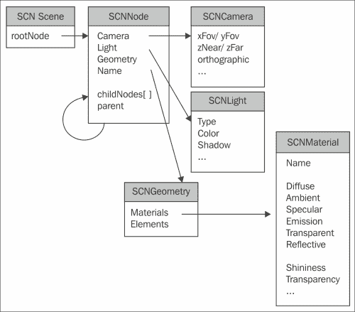

上述图像是 Apple SceneKit 介绍中的 SceneGraph 层次结构。正如我们所见，SceneKit 从`SCNScene`类分支出各种节点。这些包括用于灯光、几何和摄像机的通用`SCNNode`。

节点是一种可以添加其他节点并具有结构中其他节点信息的数据结构。如前图所示，它通过`childNode[]`数组和父属性展示。空间信息，如位置、缩放和方向，可以从这些属性中获取。这就是节点在面向对象设计（OOD）中相对于其他父子结构独特的特点。

在 SpriteKit 中，我们通常通过`addChild()`函数将节点添加到场景或场景中的另一个节点。在 SceneKit 中，相同的功能通过`addChildNode()`实现。例如，SceneKit 场景中的主要根节点是放置在`SCNView`节点中的`SCNScene`节点，即框架的`UIView`类的独特版本。要将基本球体对象添加到场景中，我们会执行以下操作：

```swift
let sphereGeometry = SCNSphere(radius: 1.0)
let sphereNode = SCNNode(geometry: sphereGeometry)
self.rootNode.addChildNode(sphereNode)
```

正如 SpriteKit 所述，通过 SpriteKit 中的节点，我们可以将游戏场景中的各种成员组合成它们自己的父节点，并在一个调用中对这些节点执行动作，同时通过循环或其他迭代调用进行迭代。

# SpriteKit / SceneKit 交互

SceneKit 的一个显著特点是我们可以将 SpriteKit 场景叠加到 3D 游戏中。

```swift
self.overlaySKScene = skScene
```

使用`SCNView`的`overlaySKScene`属性，我们可以将已经建立的`SKScene`节点（可以是角色、动画序列、HUD 等）添加到我们的 3D 场景中。

想要有一个可爱的精灵动画叠加到 3D 角色的舞台胜利场景上，或者想要制作一个 2.5D 游戏，使用 2D 精灵和物理效果叠加在 3D 背景上？那么这就是你可以这样做的方法。

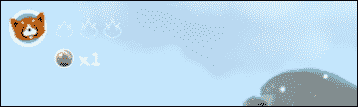

将 SpriteKit 与 SceneKit 混合使用最常见的功能是，SpriteKit 是 SceneKit 场景的用户界面（HUD）。在早期的 Fox 演示中看到的生命、可收集物品和角色图标显示了一个 SpriteKit 节点叠加在 SceneKit 场景上。

一般而言，节点可以帮助为你的游戏和游戏场景添加功能结构。然而，在游戏设计中过度依赖节点和继承并不是没有缺陷的。

## 基于继承的结构化和游戏设计的问题

在继续前进之前，我们应该提到一个可能困扰过度依赖节点概念甚至面向对象设计（OOD）中基于继承的结构化的一般概念的陷阱。当可能的时候，最好不要过度依赖继承来处理你的游戏逻辑，而更多地使用所谓的基于组合的结构化。我们将在下一章中深入探讨这个问题，当时我们将首先介绍在 iOS 9 中首次引入的辅助游戏开发框架 GamePlayKit，但在这里我们先了解一下，与继承和节点一起工作可能并不是我们游戏中总是最佳的选择。

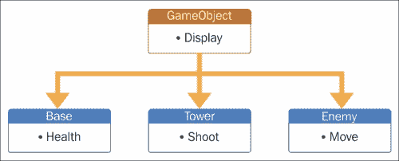

初看之下，人们可能会认为基于继承的结构化非常适合游戏开发。我们中许多熟悉面向对象设计（OOD）的人都知道，我们可以有通用的父类或游戏对象的节点，例如一个包含所有功能的`GameObject`类，然后使用继承和多态来处理从这个基类派生出的独特子类。对于小型、简单的游戏来说，这确实是正确的，但游戏往往有可以共享一些相同功能但放在父-子结构中又没有意义的对象。

在塔式策略游戏中，我们可以采用这种典型的结构化方式：

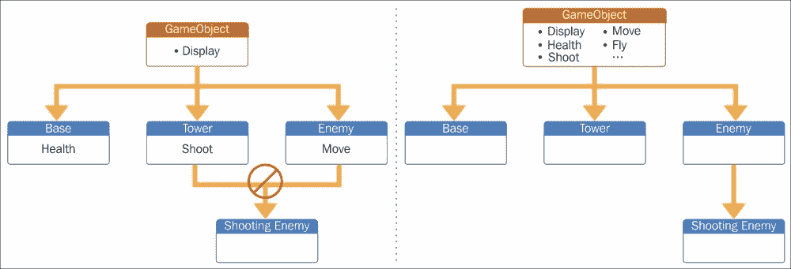

在一个典型的塔式游戏中，我们会有基础、塔和敌人对象，它们都可以从我们定义的通用`GameObject`类继承。塔可以对敌人开火，敌人也可以对塔和其他基于玩家的对象开火。良好的编程和设计的一部分是拥有可重用的代码和方法。通常，我们会通过继承来实现这一点。前面的图表显示了可以解决这个问题的双向继承。我们接下来会想要一个继承移动和射击功能的`ShootingEnemy`类。但我们不能这样做，因为这会涉及到从两个完全不同且相当无关的对象类继承。在面向对象设计中，只有一个子-父关系。右边的下一个解决方案是将这种功能添加到通用的`GameObject`类中。出现的问题是我们曾经简单的`GameObject`父类变得相当复杂，我们不可避免地想要在我们的游戏对象中添加额外的功能和功能。在过去，这会涉及到重构大量代码以适应本质上只是简单设计附加的功能。协议曾经是某种解决方案，因为它们会强迫我们以某种方式创建一个类，但即使是它们也可能变得令人困惑，并且不涉及这些功能的实现。

解决方案是与实体和组件一起工作。

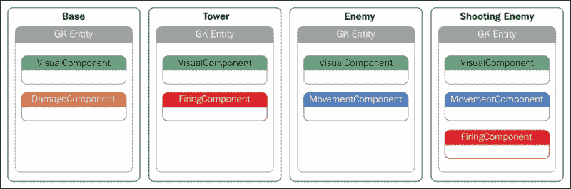

上述图表给出了基于组合的结构示例。使用这种方法，我们可以拥有具有相似功能的部分，这些部分被多个通常无关的游戏对象使用。这样，本例中的通用`GameObject`类就不必具备其子类可能的所有功能，我们还可以将`Enemy`类作为`Enemy`的成员。共享功能可以一次性编写，然后在整个游戏中以及在其他我们希望制作的游戏中使用。iOS 9 的 SpriteKit 演示、DemoBots 以及前面提到的 SceneKit 演示 Fox 都使用基于组合的结构进行动作和动画。

当在 SpriteKit 和 SceneKit 中考虑节点时，重要的是它们在 MVC 模型的 View 上下文中使用，或者在两个框架中，它们的场景上下文中使用。

关于 SceneKit 中的场景，让我们继续制作一个非常基本的场景。

# 我们的第一个 SceneKit 场景 – Xcode 模板

3D 艺术和动画是一个非常深入的话题。我们可以无休止地讨论材料、着色器、光照、雕刻、PVR 纹理以及所有使游戏、电影、建筑或任何其他基于 3D 对象的应用程序中的 3D 对象变得出色的主题。

这些主题的一些细节超出了本书的范围，所以现在让我们保持简单。

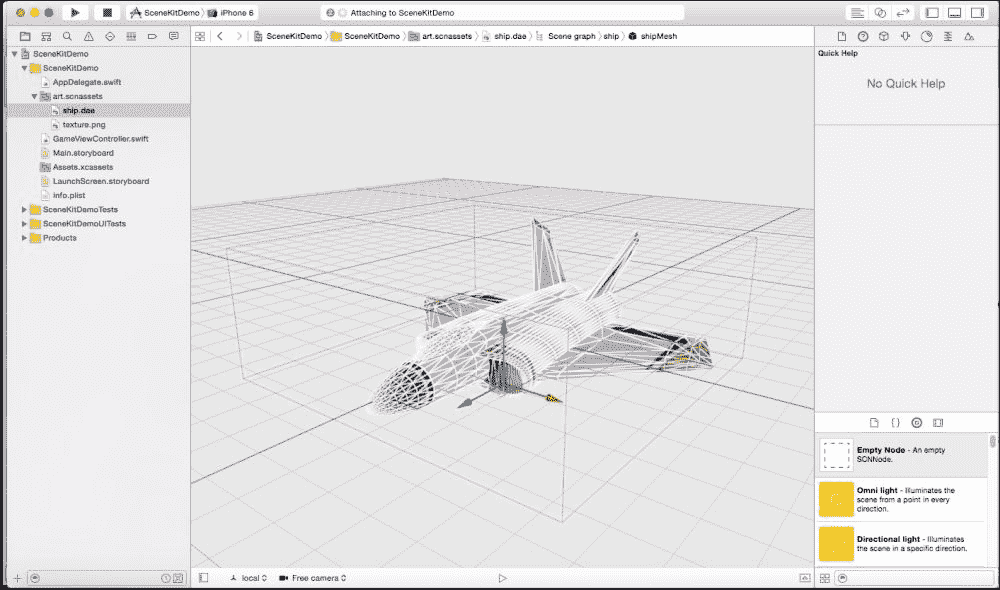

让我们从 Xcode 提供的默认 SceneKit 场景和对象开始，如图所示：

### 注意

在撰写本书时，我们使用了 Xcode 7 – Beta 的 SceneKit 模板。根据你使用的版本，可能会有一些差异。

1.  首先，打开 Xcode，创建一个新的项目，并选择**游戏**模板。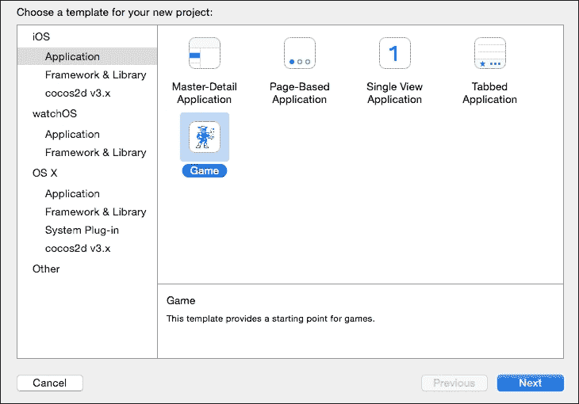

1.  接下来，为你的项目命名，确保**游戏技术**字段显示为**SceneKit**，然后点击**下一步**。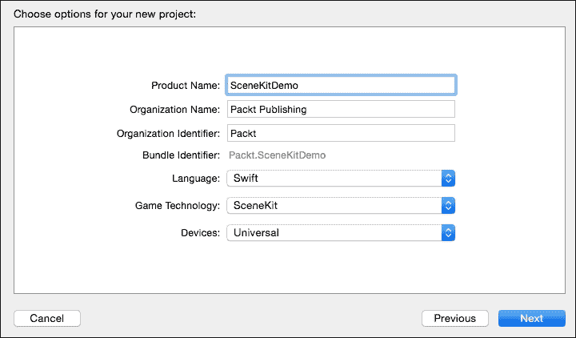

1.  项目文件和结构大致与 SpriteKit 相同，但有一些不同，特别是`art.scnassets`文件夹。唯一的区别是现在除了`Assests.xcassets`外，还有一个`art.scnassets`文件夹。这是我们的 3D 对象所在之处。点击该文件夹以查看 Apple 提供的`ship.dae`资产。

使用 SceneKit 编辑器，我们可以查看和编辑以下 3D 文件类型：

+   DAE

+   OBJ

+   Alembic

+   STL

+   PLY

给我们的示例是一个 DAE 类型的宇宙飞船，`ship.dae`文件作为飞船的纹理文件（`texture.png`）。在我们查看代码和场景如何工作之前，请在自己的设备或 Xcode 设备模拟器上构建并运行程序。

从示例场景中，我们看到我们的宇宙飞船在黑色背景前旋转，并且我们可以通过滑动飞船来改变其方向。点击飞船会使它瞬间发出红色光芒。

现在我们来看看代码中发生了什么，然后我们将探讨编辑器为我们提供的工具，以便在不编写任何代码的情况下编辑我们的对象和场景。

## SceneKit 项目流程和结构

与 SpriteKit 类似，SceneKit 场景使用与上一章中看到的相同的游戏渲染循环，以及我们在 *第二章* 中提到的相同类型的入口点结构，即 *使用 iOS 9 Storyboards 和 Segues 设计游戏结构和规划*。我们有一个 `AppDelegate.swift` 文件，它是我们的入口点，可以根据上层设备事件控制特殊的应用功能，例如应用关闭、进入后台和从后台返回。我们还有之前在 SpriteKit 中看到的启动屏幕和 `Main.storyboard` 文件。

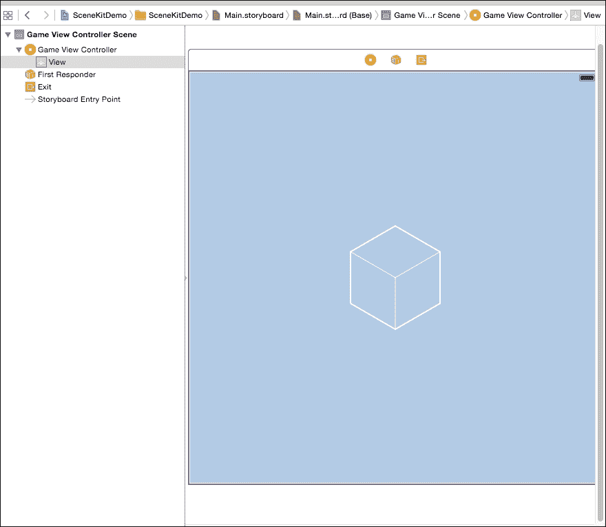

与 `Main.storyboard` 文件不同的是，它有一个 SceneKit 场景图标，如前一张截图所示，以立方体形式显示。

AppDelegate 转移到的 `ViewController` 类是 `GameViewController.swift` 类。这是我们所有演示代码所在的地方：

```swift
override func viewDidLoad() {
        super.viewDidLoad()

        // create a new scene
        let scene = SCNScene(named: "art.scnassets/ship.dae")!
...
```

我们看到我们开始于重写的 `viewDidLoad()` 函数。SceneKit 允许我们创建一个完整的场景，甚至包括我们的 3D 对象/资产的一个实例，正如我们从解包的 `let scene = SCNScene(named: "art.scnassets/ship.dae")!` 调用中看到的。这仅仅创建了场景对象。要获取屏幕上显示的对象，我们仍然需要将其附加到 `SCNView` 节点，正如我们稍后将在函数中看到的。

让我们来看看这里的一些代码：

```swift
//(1) create and add a camera to the scene
   let cameraNode = SCNNode()
   cameraNode.camera = SCNCamera()
   scene.rootNode.addChildNode(cameraNode)     
// place the camera
   cameraNode.position = SCNVector3(x: 0, y: 0, z: 15)       
//(2) create and add a light to the scene
   let lightNode = SCNNode()
   lightNode.light = SCNLight()
   lightNode.light!.type = SCNLightTypeOmni
   lightNode.position = SCNVector3(x: 0, y: 10, z: 10)
   scene.rootNode.addChildNode(lightNode)     
 // create and add an ambient light to the scene
   let ambientLightNode = SCNNode()
   ambientLightNode.light = SCNLight()
   ambientLightNode.light!.type = SCNLightTypeAmbient
   ambientLightNode.light!.color = UIColor.darkGrayColor()
   scene.rootNode.addChildNode(ambientLightNode)      
 //(3) retrieve the ship node
   let ship = scene.rootNode.childNodeWithName("ship", recursively: true)!      
 //(4) animate the 3d object
         ship.runAction(SCNAction.repeatActionForever(SCNAction.rotateByX(0, y: 2, z: 0, duration: 1)))       
 //(5) retrieve the SCNView
   let scnView = self.view as! SCNView    
 //set the scene to the view
   scnView.scene = scene
 //(6)allows the user to manipulate the camera
    scnView.allowsCameraControl = true     
 // show statistics such as fps and timing information
    scnView.showsStatistics = true    
 // configure the view
    scnView.backgroundColor = UIColor.blackColor()      
 //(7) add a tap gesture recognizer
    let tapGesture = UITapGestureRecognizer(target: self, action: "handleTap:")
        scnView.addGestureRecognizer(tapGesture)
```

之前提到的 `viewDidLoad()` 函数在模板中提供给我们。实际上，它非常简单易懂，除了 `handleTap()` 函数外，几乎完成了创建这个场景所需的所有工作。任何在 OpenGL 中为 iOS 或其他平台创建过 3D 图形的开发者都会欣赏 SceneKit 给我们提供的场景和对象的高级简单控制。以下是提供的代码的更多细节：

在行 `(1)` 上，创建了一个名为 cameraNode 的 `SCNNode`，并将 `SCNNode` 的 `camera` 属性赋值为 `SCNCameraNode` 类型。然后，使用相机 `position` 属性上的 `SCNVector3()` 函数将相机放置在三维空间中。在这种情况下，相机放置在 (`x: 0`, `y: 0`, `z: 15`)。换句话说，*x* 和 *y* 坐标被设置为原点，而相机在 *z* 轴上稍微向后移动。

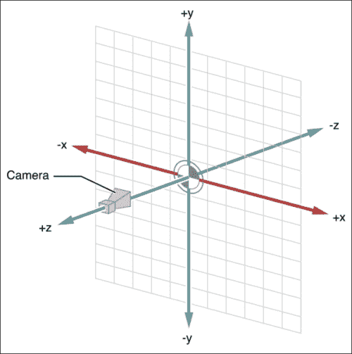

您可以在 [`developer.apple.com/library/ios/documentation/SceneKit/Reference/SceneKit_Framework/`](https://developer.apple.com/library/ios/documentation/SceneKit/Reference/SceneKit_Framework/) 找到 SceneKit 坐标图。

SceneKit 中的坐标系被称为**右手坐标系**。理解 3D 坐标系的一个技巧是，如果我们用右手，做出类似枪的手势，拇指向上，食指直伸在我们面前，中指与食指成直角，我们就会得到*x*、*y*和*z*坐标。你的中指会在*x*轴（左右），拇指会在*y*轴（上下），食指会在*z*轴（前后）。

在`(2)`代码块中，我们正在向屏幕添加灯光。SceneKit 以及 SpriteKit 都允许我们创建多种不同的光照效果，从环境遮挡、使用法线贴图等。在这里，创建了一个名为`lightNode`的`SCNNode`实例，并将`SCNNode`属性`light`赋值为`SCNLight`类类型。第一个创建并添加到场景中的灯光是所谓的`SCNLightTypeOmni`类型灯光，正如从隐式解包的调用`lightNode.light!.type = SCNLightTypeOmni`中看到的那样。这种类型的灯光通常更多地用于调试，因为接下来添加的灯光`ambientLightNode`将是用于创建游戏氛围的类型之一。正如我们通过`ambientLightNode.light!.color = UIColor.darkGrayColor()`这一行所看到的那样，我们可以在代码中为该灯光指定颜色。

关于`SCNLights`的更多信息可以在[`developer.apple.com/library/prerelease/ios/documentation/SceneKit/Reference/SCNLight_Class/index.html`](https://developer.apple.com/library/prerelease/ios/documentation/SceneKit/Reference/SCNLight_Class/index.html)找到。

我们很快就会看到如何将灯光和其他方面可视化地添加到`viewDidLoad()`函数中，但通常理解幕后的一些样板代码是有益的。

在`(3)`行中，`let ship = scene.rootNode.childNodeWithName("ship", recursively: true)!`是我们将`ship`对象添加到场景根节点的方法。这与场景中的其他对象并没有太大的不同。它从`art.scnassets`文件夹中`ship.dae`对象的名称中获取字符串`ship`。`childNodeWithName`函数中的`recursively: true`参数告诉场景它应该将对象的全部子节点添加到场景中。根据原始 3D 模型程序中 3D 对象的建模和绑定方式，对象可能有一个复杂的子节点数组。将`recursively`设置为`true`将迭代子节点以及它们的子节点。

以下长行（`(4)`行的一部分）是告诉船只根据其当前方向以*x*、*y*和/或*z*角度持续旋转的紧凑方式：

```swift
ship.runAction(SCNAction.repeatActionForever(SCNAction.rotateByX(0, y: 2, z: 0, duration: 1)))
```

这可以分解为其各个部分，因为它是一个嵌套在`SCNAction`中的`SCNAction`，即`rotateByX`函数被包裹在`SCNAction`的`repeatActionForever`函数中。SceneKit（`SCNAction`）和 SpriteKit（`SKAction`）中的动作不仅可以通过代码添加到对象中，还可以在 Xcode 的视觉编辑器中添加，正如我们稍后将在 Fox 演示的回顾中看到的那样。

在这里了解更多关于`SCNAction`和`SKAction`类的信息：

关于`SCNAction`，请参阅[`developer.apple.com/library/ios/documentation/SceneKit/Reference/SCNAction_Class/`](https://developer.apple.com/library/ios/documentation/SceneKit/Reference/SCNAction_Class/)。

关于`SKAction`，请参阅[`developer.apple.com/library/ios/documentation/SpriteKit/Reference/SKAction_Ref/`](https://developer.apple.com/library/ios/documentation/SpriteKit/Reference/SKAction_Ref/)。

在行（5）中，我们创建了`SCNView`对象，并将其分配给`GameViewController`的视图，使用行`let scnView = self.view as! SCNView`。然后，我们使用名为`scene`的对象在行（1）中创建的场景及其节点被分配给`scnView`的`scene`属性，通过`scnView.scene = scene`。关于哪个场景分配给了哪个节点，有一些轻微的不确定性，但这基本上与`rootNode`的设置本身有关。

接下来的几行（即（6））展示了我们可以从`SCNView`类中使用的某些属性；首先是使用`allowsCameraControl`属性控制摄像头的功能。将此设置为`false`将阻止玩家移动摄像头。这对于游戏中的剪辑场景或锁定舞台的一部分，使其成为必要的情况可能非常棒。`scnView.showsStatistics = true`这一行告诉场景显示任何对调试有益的渲染数据。例如，我们可以看到游戏运行的**每秒帧数**（**fps**）。

这与 SpriteKit 场景的代码部分`skView.showsFPS`和`skView.showsNodeCount`等价，其中`skView`是`SKView`对象的名字。

下一行，`scnView.backgroundColor = UIColor.blackColor()`，允许我们将背景颜色设置为黑色，就像我们使用`UIColor`类将`ambientLightNode.light!.color = UIColor.darkGrayColor()`设置为深灰色颜色一样。

## SceneKit 调试选项

### 小贴士

截至 iOS 9，通过使用`SCNDebugOptions`结构和`SCNView`的`debugOptions`属性，更多的调试选项变得可用。

如果我们写下以下内容，我们就能看到我们船的边界框：

```swift
scnView.debugOptions = .ShowBoundingBoxes
```

其他选项还包括`ShowLightInfluences`、`ShowPhysicsShapes`和`ShowWireframe`。

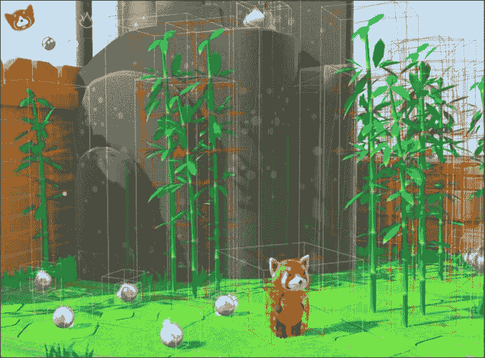

WWDC15 的 Fox 演示，启用了.ShowBoundingBoxes 和 ShowPhysicsShapes 选项

最后，在行`(7)`中，`let tapGesture = UITapGestureRecognizer(target: self, action: "handleTap:")`创建了一个名为`tapGesture`的`UITapGestureRecognizer`对象，当任何点击发生时，它将调用函数`handleTap(gestureRecognize: UIGestureRecognizer)`，而`scnView.addGestureRecognizer(tapGesture)`将识别器添加到场景中。

## 在 SceneKit 中处理用户输入

`UITapGestureRecognizer`对象在选择性组织我们从玩家那里接收到的输入方面非常出色。这适用于 SceneKit 和 SpriteKit 场景。我们可以为点击、每个方向的滑动、平移、捏合和长按设置识别器；长按非常适合当你可能需要处理角色充电攻击时。

这里是`UITapGestureRecognizer`类的文档，供您参考：

[`developer.apple.com/library/prerelease/ios/documentation/UIKit/Reference/UIGestureRecognizer_Class/index.html`](https://developer.apple.com/library/prerelease/ios/documentation/UIKit/Reference/UIGestureRecognizer_Class/index.html)

让我们看看那个`handleTaps`函数，因为它包含了一个 SceneKit 类的对象`SCNTransaction`：

```swift
func handleTap(gestureRecognize: UIGestureRecognizer) {
        //(1) retrieve the SCNView
        let scnView = self.view as! SCNView
        // check what nodes are tapped
        let p = gestureRecognize.locationInView(scnView)
        /(2)
        let hitResults = scnView.hitTest(p, options: nil)
        // check that we clicked on at least one object
        if hitResults.count > 0 {
            // retrieved the first clicked object
            let result: AnyObject! = hitResults[0]
            // get its material
            let material = result.node!.geometry!.firstMaterial!

        //(3)// highlight it
            SCNTransaction.begin()
            SCNTransaction.setAnimationDuration(0.5)
            // on completion - unhighlight
            SCNTransaction.setCompletionBlock {
                SCNTransaction.begin()
                SCNTransaction.setAnimationDuration(0.5)
                material.emission.contents = UIColor.blackColor()   
                SCNTransaction.commit()
            }  
            material.emission.contents = UIColor.redColor()
            SCNTransaction.commit()
        }
    }
```

在行`(1)`中，我们只是创建了一个对当前`SCNView`对象`scnView`的引用。接下来，使用`gestureRecognize.locationInView(scnView)`创建了常量`p`。这所做的是捕获我们希望跟踪的视图中的手势位置。在这种情况下，是整个视图`scnView`。如果我们有子视图，比如一个游戏菜单屏幕，那么如果我们愿意，我们可以以这种方式仅针对那里的手势进行目标识别。

### 注意

如果正在构建一个玩家需要即兴点击多次以控制角色移动或躲避的游戏，我们发现 SpriteKit 中提到的`touchesBegan()`功能比`UITapGestureRecognizer`要快一些。但随着每个新的、更快的 iOS 设备的推出，这最终可能成为一个无足轻重的问题，但如果你的游戏控制高度依赖于玩家的速度，你可能会注意到通过`UITapGestureRecognizer`方法对手势的响应会有一些延迟。这可能会影响你的游戏目标，所以尝试使用`touchesBegan()`函数看看哪个最适合你的游戏。使用`touchesBegan()`进行滑动和其他非点击手势可能会相当棘手，因此在开发方面也存在权衡。

接下来是 `(2)`，我们使用 `SCNView` 的 `hitTest()` 函数来计算在视图中捕获了多少个这样的手势，在我们的例子中是触摸，并且只有当该手势与场景中的任何对象接触时才计数，通过传递位置常量 `p` 作为参数。`hitTest()` 函数返回一个事件结果数组，然后 `count` 属性计算该数组的大小。我们可以通过引用该数组的第一个成员来捕获第一次触摸的引用。在这个演示中，我们只有一个对象提供给我们，即飞船，因此我们可以直接获取 Swift 最上层的父对象 `AnyObject` 的实例。我们的 `hitTest` 对象 `hitResults` 是一个包含在这个上下文中触摸到的每个对象引用的数组。再次强调，这只是一个飞船对象，所以我们可以简单地取 `hitTest[0]` 处的第一个实例。这就是结果常量所代表的。

这行代码 `let material = result.node!.geometry!.firstMaterial!` 展示了我们是怎样通过使用点操作符深入到节点的子节点来获取该对象材质的引用，同时通过感叹号（`!`）隐式解包每个节点。这个材质引用在需要触摸使飞船变红时是必需的。

### 小贴士

这实际上是一个很好的例子，说明了我们如何只选择 SceneKit 场景中的某些对象作为玩家输入的焦点。在这里，它只是使用宽泛的类型 `AnyObject` 类选择任何对象，但想象一下一款只有特定类型的角色或角色可选择的游戏；比如一个等距俯视射击游戏或**实时策略**（**RTS**）游戏。我们可能在采取任何行动之前检查触摸的对象是否仅是某个特定类类型的成员（`isKindOfClass()`）或符合某个协议（`conformsToProtocol()`）。如果你的 RTS 游戏中的玩家只想对坦克对象采取行动？那么结合一个菜单告诉游戏哪个对象类型是焦点，可能就是你在 SceneKit 中获得这种能力的方法。

在行`(3)`中，默认的 SceneKit 模板也给了我们这段有用的代码，展示了`SCNTransaction`的使用。`SCNTransaction`类首次在 iOS 8 中可用，我们可以将`SCNTransaction`视为一系列我们希望在场景中特定时间点发生的变化和动画。`SCNTransaction`类从`SCNTransaction.begin()`调用开始，以`SCNTransaction.commit()`调用结束。在该块内的场景图动画调用默认情况下会延迟 0 秒被调用。在许多情况下，我们可能想要控制这些动画的持续时间，因此我们在`SCNTransaction`块的开始处使用`setAnimationDuration()`函数来设置。`SCNTransaction.setAnimationDuration(0.5)`将完成此块的时间设置为半秒。请注意，在这个块内还有一个以`SCNTransaction.setCompletionBlock{…}`开始的代码块。这样做的作用是在它所在的`SCNTransaction`块完成后才执行调用。在这个模板演示中，首先在半秒内，船只被高亮显示为红色，就像在`material.emission.contents = UIColor.redColor()`行中所做的那样。完成之后，在接下来的半秒内，船只的颜色通过将材质发射设置回`UIColor.blackColor()`恢复到原始颜色。一开始这可能有点令人困惑，但我们可以使用这种方法在单个块中为场景执行一系列动画和事务。查看此链接以获取文档；其他过渡/事务可以是淡入淡出、相机视野、旋转、平移、照明等等：[`developer.apple.com/library/prerelease/ios/documentation/SceneKit/Reference/SCNTransaction_Class/index.html#//apple_ref/occ/clm/SCNTransaction/valueForKey`](https://developer.apple.com/library/prerelease/ios/documentation/SceneKit/Reference/SCNTransaction_Class/index.html#//apple_ref/occ/clm/SCNTransaction/valueForKey)。

至于默认的 SceneKit 模板，这就是制作场景所使用的全部代码。这是一个基本的场景，远非游戏，但它应该能让我们对 SceneKit 中场景的基本结构和逻辑有一个基本的了解。在我们查看 Fox 演示以及一个实际的全游戏项目之前，让我们看看 iOS 9 / Xcode 7 中添加到 Xcode 的一些其他功能。

# iOS 9 / Xcode 7 中引入的 SceneKit 功能

让我们回到过渡和动画。截至 iOS 9，我们可以在 SceneKit 中非常容易地更改角色或其他 3D 对象的混合模式。

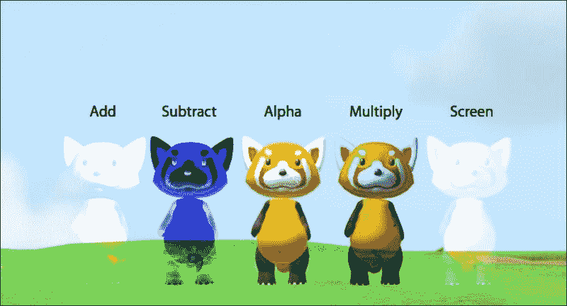

WWDC2015 中 SceneKit 的各种混合模式的展示

混合模式可以通过一行代码简单地更改，`aSCNMaterial.blendMode = .Add`，其中 `aSCNMaterial` 是代表 `SCNNode` 材料的一个对象。更改混合模式可以创建多种效果。一些游戏使用玩家的 *幽灵* 来显示他们试图超越的过去运行，或者当 Boss 角色被击败时，会有淡入淡出的效果。结合 `SCNTransaction` 可以让角色在这些模式中淡入淡出。

## 音频节点和 3D 声音

截至 iOS 9，我们可以在 SceneKit 场景中放置 3D 声音。`SCNNode` 类的 `addAudioPlayer()` 函数让我们可以将声音附加到该节点，并且无论该节点在 3D 空间中的位置如何，声音都将遵循 3D 音频混音；也就是说，如果音频源的 `positional` 属性设置为 `true`。以下是使用音频节点创建 3D 声音的方法：

```swift
let source = SCNAudioSource(named: "sound.caf")
let soundEffect = SCNAudioPlayer(source: source)
node.addAudioPlayer(soundEffect)
source.positional = true 
source.loops = false
```

这为游戏对象，名为 `node` 的 `SCNNode` 提供了音效。

要实际播放声音，我们需要在它上面调用 `SCNAction`，如下所示：

```swift
let action = SCNAction.playAudioSource(source, waitForCompletion: true) 
node.runAction(action)
```

`waitForCompletion` 属性确保动作持续的时间与声音一样长。但这可能不适合角色音效，因为你可能希望在中间停止（也就是说，玩家击中敌人，取消他们之前开始吟唱、尖叫或其他类似动作）。

## 环境音效和音乐

要添加音乐和环境音效，我们可以遵循添加音效到节点的相同方法：创建一个 `SCNAudioSource` 对象；将其添加到 `SCNAudioSource` 对象中；然后使用 `addAudioPlayer` 将其添加到我们的节点中。唯一的区别是，我们会循环播放音乐并将它的 `positional` 属性设置为 `false`，如下所示：

```swift
source.positional = false 
source.loops = true
```

## SceneKit 中的 SpriteKit 场景过渡

SpriteKit 有一些很棒的场景过渡效果。我们可以让它看起来像门在打开或页面在翻动。这可以为你的游戏增添额外的特色和精致。在 iOS 9 之前，我们无法在我们的 3D SceneKit 中进行这些 2D 过渡，但自从 Xcode 7 和 iOS 9 以来，我们可以在 SceneKit 中这样做，下面是如何操作的：

```swift
aSCNView.presentScene(aScene, withTransition:aSKTransition,
incomingPointOfView:nil, completionHandler:nil)
```

再次强调，`aSCNView` 只是对某个 `SCNView` 对象的一般引用，当我们向该视图呈现场景时，我们有传递一个 `SKTransition` 对象作为 `withTransition` 参数的选项。`incomingPointofView` 参数可以是在过渡期间相机视点的引用，而 `completionHandler` 参数是在场景过渡后调用的完成块的名称。例如，我们可以在阶段完成后过渡到得分场景中调用开始计算上一阶段得分的函数。我们可能不想在知道场景已经 100% 过渡到或在这种情况下，在知道前一个场景的总分之后开始新场景的计算和其他函数。

在类参考页面上查看一些 `SKTransition` 的更多示例，也许有一个过渡可以帮助增强你游戏的设计：

[`developer.apple.com/library/prerelease/ios/documentation/SpriteKit/Reference/SKTransition_Ref/index.html`](https://developer.apple.com/library/prerelease/ios/documentation/SpriteKit/Reference/SKTransition_Ref/index.html)

# 狐狸演示

我们的大部分时间都花在了 SpriteKit 和这里的 SceneKit 上，编写构成游戏逻辑的样板代码。随着 Xcode 的不断更新，iOS 游戏设计中的视觉设计功能也在不断更新，这些功能不需要对代码有深入的了解。总是有一些脚本涉及其中，但游戏设计中的一个关键特性，嗯，就是它的设计方面。在*WWDC15*活动上，iOS 9 和 Xcode 7 的介绍是一个很好的游戏演示，它不仅能教会我们一些 Xcode 可以做的视觉设计功能，还为我们提供了一个在 SceneKit 中制作平台游戏的美丽起点。这个演示名为*Fox*，虽然实际上它以红熊猫为主角而不是狐狸，但我们可以原谅这种混淆，因为它功能丰富且对学习如何开发 SceneKit 驱动的 iOS 游戏至关重要。

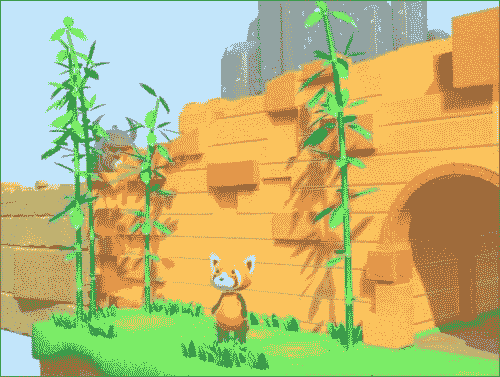

展示我们的玩家角色和关卡资源的狐狸演示图像

这个演示中还有许多我们在这里无法展示的内容，因此我们鼓励您自己下载并查看它提供的所有 SceneKit 功能。我们将关注一些尚未在 SceneKit 或 SpriteKit 中涵盖的主题，例如粒子、物理和场景图。狐狸演示还使用了 3D 游戏/艺术设计功能，如天空盒、环境遮挡、立方体贴图照明、碰撞网格等。它真的是一个制作美丽 iOS 游戏的优质演示。

这里是苹果提供的下载链接：

[`developer.apple.com/library/prerelease/ios/samplecode/Fox/Introduction/Intro.html`](https://developer.apple.com/library/prerelease/ios/samplecode/Fox/Introduction/Intro.html)

### 注意

在撰写本文时，狐狸演示仅使用 Objective-C 编写。我们在这本书的整个过程中都专注于 Swift，但请不要过于担心，如果您对 Objective-C 的一些方面感到陌生。目标是看到 Xcode 提供的视觉工具。在未来某个时间点，狐狸演示肯定将以 Swift 的形式提供，无论是苹果公司自己还是第三方程序员。

# 粒子系统

任何游戏中的一些基本资源，无论是 SpriteKit 还是 SceneKit 构建的，都是我们添加到角色、对象或整个场景中的各种粒子效果。粒子可以增强收集物品的感觉，给玩家一个信号，表明玩家发生了某些事情，比如他们正在获得或失去健康，或者显示即将到来的 Boss 战的存在的力量。

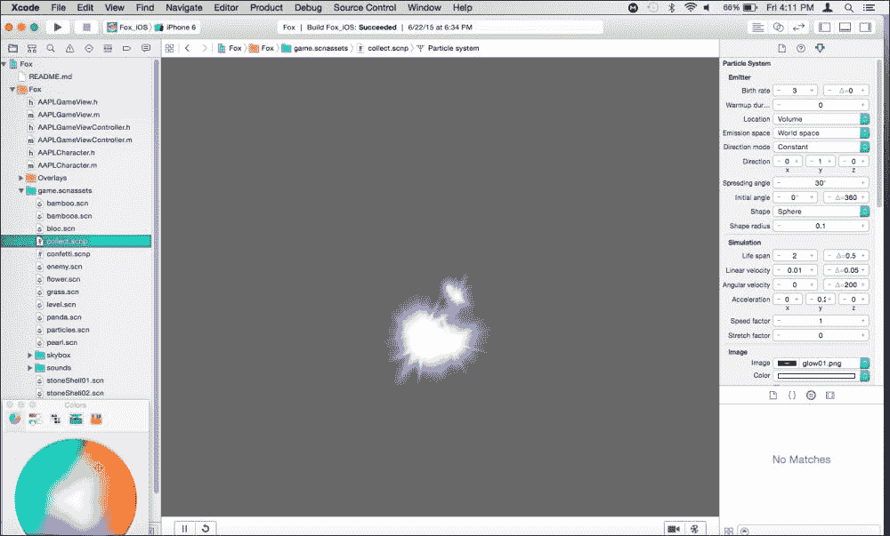

来自狐狸演示的可收集粒子效果

在过去，制作粒子效果的过程是手动创建有时相当复杂的粒子发射器着色器对象，使用 OpenGL 代码。如果我们选择这样做（使用苹果的快速、低级 API，Metal 或 OpenGL），这仍然可以做到，但随着时间的推移，视觉创建和编辑粒子效果的过程已经变得更加简单。在 iOS 开发历史上不久前，像 Cocos2D/ Cocos3D 这样的框架允许我们使用第三方粒子效果构建器导入到我们的游戏中。随着 SpriteKit 和 SceneKit 的出现，从 iOS 7/iOS 8 开始，Xcode 创建了一个更直观的粒子表示，从而为我们节省了大量创建我们想要和期望在游戏中看到的效果的时间和精力。之前显示的图像显示了 Xcode 粒子系统编辑器，其中包含 Fox 演示的可收集闪光效果。

要在 SceneKit 中创建自己的粒子效果，请按照以下步骤操作：

1.  通过导航到**文件** | **新建** … 或者简单地使用键盘快捷键*command* + *N*，创建一个新文件，就像我们过去做的那样。

1.  然后，我们在 iOS 下选择**资源**部分，并选择**SceneKit 粒子系统**模板。（如果使用 SpriteKit，请选择**SpriteKit 粒子文件**。）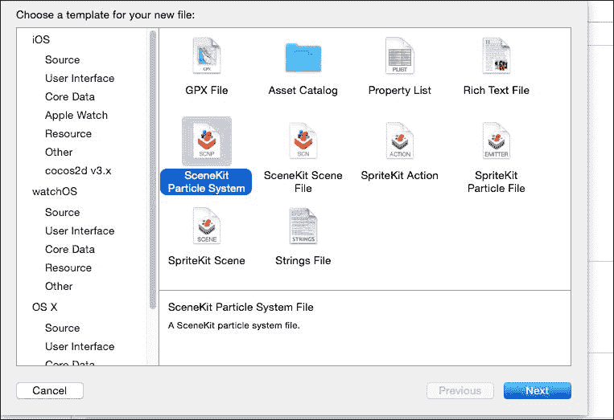

1.  SpriteKit 和 SceneKit 的粒子选项都为我们提供了一个基本粒子模板列表，我们可以从这里开始，例如反应器、闪光或模糊。选择您想要的任何一个，或者在这里的演示中查看可收集的一个。对于 SpriteKit，这会创建一个 SKS 文件和粒子的图像遮罩。SceneKit 模板通过 SCNP 文件和图像遮罩创建 3D 粒子效果。

让我们回顾一下在演示中为可收集粒子创建的粒子系统。如果没有选择，请点击属性检查器以查看我们可以编辑以自定义粒子效果的各个控件。

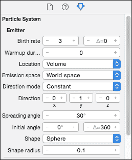

在检查器中，您可以随意测试多个变量和字段。这里有出生率，它控制粒子重新开始其起始和结束动画的频率，图像，它可以构成粒子的形状和颜色，以及决定效果整体方向的各个角度。还有一个**循环**下拉菜单，它使粒子在场景中粒子系统的生命周期内重复。此外，**受重力影响**切换是我们用来根据场景的重力使粒子下落的。集合粒子在没有重力的情况下不断循环，而纸屑粒子发生一次并下落到重力，正如我们预期的那样。如果场景中的物体有一个物理场，我们还可以让粒子对其做出反应。

## 将粒子放入我们的 pioscene 中

当我们创建 SpriteKit 或 SceneKit 粒子时，我们可以通过代码在 SpriteKit 或 SceneKit 中调用它们：

### SpriteKit

SpriteKit 粒子不在 Fox 演示中，但稍微回顾一下我们对 SpriteKit 的讨论，如果我们想在 2D SpriteKit 游戏中添加粒子，下面是如何实现这一点的示例：

```swift
//(1)
var path = NSBundle.mainBundle().pathForResource("Spark", ofType: "sks")
//(2)
    var sparkParticle = NSKeyedUnarchiver.unarchiveObjectWithFile(path!) as! SKEmitterNode
//(3)     
    sparkParticle.position = CGPointMake(self.size.width/2, self.size.height)
    sparkParticle.name = "sparkParticle"
    sparkParticle.targetNode = self.scene 
    self.addChild(sparkParticle)
```

1.  我们使用`NSBundle.mainBundle().pathForResource()`函数调用创建一个指向我们应用程序包的路径，并传递粒子文件名称的字符串，在本例中为`Spark`，以及文件类型，SKS。

1.  接下来，我们使用`NSKeyedUnarchiver.unarchiveObjectWithFile(path!)`调用创建`sparkParticle`对象，正如我们所看到的，它使用了我们在部分(1)中创建的路径。它被转换为 SpriteKit 的粒子对象`SKEmitterNode`。`NSKeyedUnarchiver`是一个用于从键值归档中解码命名对象的类，这是一个归档的编码层次结构。这个类有一些已知类型转换的支持。简而言之，它可以解码文件中的对象，无论是 32 位还是 64 位架构。更多关于这个特殊的文件解码类信息请参阅：[`developer.apple.com/library/mac/documentation/Cocoa/Reference/Foundation/Classes/NSKeyedUnarchiver_Class/`](https://developer.apple.com/library/mac/documentation/Cocoa/Reference/Foundation/Classes/NSKeyedUnarchiver_Class/)

1.  我们然后为这个粒子效果设置位置和名称，并将其定位到场景中，同时将其添加到场景节点中。

虽然这个例子没有在 Fox 演示中给出，但这是一个很好的例子，说明了我们如何针对项目中导航层次结构中的特定文件。

### SceneKit

SceneKit 粒子是`SCNParticleSystem`类的成员。我们通过`SCNNode`类的`addParticleSystem`函数将这些粒子添加到我们的场景中。Fox 演示在`collectFlower()`函数中通过以下 Objective-C 行来实现这一点：

```swift
[self.gameView.scene addParticleSystem:_collectParticles withTransform:particlePosition];
```

这段代码所做的是在指定的视图中调用场景，并将之前在类中声明的粒子（`_collectParticles`）添加到我们的场景中。然后它告诉场景这个效果将在空间中的哪个点出现。在这种情况下，是`particalPosition`变量，当回溯时，它来自传递给`collectFlower()`函数的`SCNNode`参数。

### 备注

下面是如何用 Swift 编写的：

```swift
scene.particleEmitNode.addParticleSystem(_collectable!)
```

Swift 的`addParticleSystem` API 不幸地没有像 Objective-C 那样的`withTransform`参数，因此我们必须将粒子系统添加到它将从中发射的节点上，这由`particleEmitNode`变量表示。这很可能会在 Swift 2.x 及以后的 API 更改中发生变化。

# 介绍 SceneKit 和 SpriteKit 物理

当我们查看我们的粒子示例中的`collectFlower()`函数时，我们看到有一个`SCNNode`参数被传递。这个节点来自`physicsWorld`函数。在 SpriteKit 和 SceneKit 中，我们可以创建一套整体的物理规则，并处理各种与物理相关的交互，最值得注意的是，两个或更多节点之间的接触。任何游戏最基本的一个方面就是在游戏对象相互碰撞时做些什么。这可能是当玩家触摸可收集物品时，当敌人接触玩家或玩家用攻击击中敌人时。在 iOS 开发和游戏引擎中，我们称这些二维精灵或三维对象之间的边界为边界框。我们在关于 iOS 9 及以后的`debugOptions`属性的讨论中简要提到了这些物理对象。SceneKit 对象的边界框是基于对象的简化几何形状自动创建的，但我们可以使用`SCNBoundingVolume`类来编辑这些形状。

更多关于这个类的文档可以在[`developer.apple.com/library/prerelease/ios/documentation/SceneKit/Reference/SCNBoundingVolume_Protocol/index.html`](https://developer.apple.com/library/prerelease/ios/documentation/SceneKit/Reference/SCNBoundingVolume_Protocol/index.html)找到。

iOS 中的游戏物理和一般游戏开发是比我们在这个章节中能讨论的更大的主题。所以现在，让我们看看 Fox 演示和一般 iOS 游戏是如何处理两个节点接触其边界框的简单概念的。

```swift
func physicsWorld(world: SCNPhysicsWorld, didUpdateContact contact: SCNPhysicsContact) {
if (contact.nodeA.physicsBody.categoryBitMask == AAPLBitmaskSuperCollectable) {
        self.collectFlower(contact.nodeA)
    }
if (contact.nodeB.physicsBody.categoryBitMask == AAPLBitmaskSuperCollectable) {
        self.collectFlower(contact.nodeB)
}

```

以下是 Fox 演示的`physicsWorld`函数的 Swift 伪代码示例。该函数接受两个参数，`world`类型为`SCNPhysicsWorld`，表示场景的整个物理环境，以及表示物理接触的`SCNPhysicsContact`类型的对象。该函数检查接触中节点的位掩码。如果接触的第一个或第二个节点（`nodeA`或`nodeB`）在花朵的特定类别中，则调用`collectFlower()`函数，并将该可收集物品的节点作为参数传递。

位掩码是指我们为另一组位指定一组位，这组位可以通过位运算组合在一起。可以这样想，使用 1 和 0 不仅可以将一系列的 1 和 0 进行分类，还可以让我们处理在相同上下文中发生多个分类的情况。

例如，在我们的游戏中，我们有不同类别的事件/对象，并将它们放入一个字节的（8 位）自己的槽中。在 Fox 演示中，游戏碰撞是一个 2 位的位移值，因此它们在二进制中表示为 00000100。Fox 演示中可收集物品的*类别指定*是一个 3 位的位移值或 00001000，敌人是 4，00010000。

在演示中，我们看到以下`AAPLBitmaskSuperCollectable`的代码：

```swift
// Collision bit masks
typedef NS_OPTIONS(NSUInteger, AAPLBitmask) {
    AAPLBitmaskCollision        = 1UL << 2,
    AAPLBitmaskCollectable      = 1UL << 3,
    AAPLBitmaskEnemy            = 1UL << 4,
 AAPLBitmaskSuperCollectable = 1UL << 5,
    AAPLBitmaskWater            = 1UL << 6
};
```

当`nodeA`或`nodeB`的类别掩码与花朵可收集物匹配时（如果槽位是开启的，或者说等于 1，那么我们知道可收集物参与了碰撞）。

Swift 1 版本并没有真正有类似的方式模仿 Objective-C 中的 NSOptions 所执行的位掩码，但自 Swift 2.0 起，我们可以像以下演示那样执行位掩码操作：

```swift
struct AAPLBitmask : AAPLBitmaskType {
 let rawValue: Int
 init(rawValue: Int) { self.rawValue = rawValue }

 static var None: AAPLBitmaskType { return AAPLBitmask(rawValue: 0) }
 static var AAPLBitmaskCollision : AAPLBitmask   { return AAPLBitmask(rawValue: 1 << 2) }
 static var AAPLBitmaskCollectable : AAPLBitmask  { return AAPLBitmask(rawValue: 1 << 3) }
 static var AAPLBitmaskEnemy : AAPLBitmask   { return AAPLBitmask(rawValue: 1 << 4) }
static var AAPLBitmaskSuperCollectable : AAPLBitmask   { return AAPLBitmask(rawValue: 1 << 5) }
static var AAPLBitmaskWater : AAPLBitmask   { return AAPLBitmask(rawValue: 1 << 6) }
}
```

实际上，它是一个返回自身位运算静态变量的结构体。它不如 Objective-C 和过去的 C 实现中那样优雅，但如果我们希望在 Swift 的样板代码中使用位掩码，这应该允许你这样做。

最后关于`physicsWorld()`函数的一点说明，为了在两个物理体碰撞时调用该函数，我们需要设置物理世界代理。在大多数情况下，这个代理会是当前的游戏场景。

```swift
scene.physicsWorld.contactDelegate = self
```

Xcode 很可能会告诉你没有设置物理世界代理，如果你还没有设置，通常这段代码会放在`ViewController`的`viewDidLoad()`函数中。

## 视觉组成的游戏场景图

回到 Fox 演示的视觉方面，让我们看看项目中创建的游戏场景对象以及我们如何查看所谓的**场景图**中的节点。

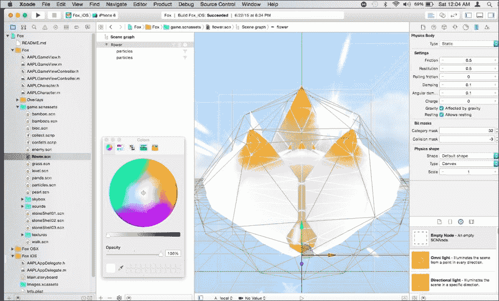

我们可以看到在 Fox 演示中，游戏对象和粒子效果可以在 Xcode 中视觉上操作，并在一个视图中一起显示。前面的图像显示了花朵可收集物及其组件，包括 3D 网格、光照、边界框和粒子效果。在 SceneKit 中，我们使用 SceneKit 场景文件（SCN）来完成这项操作。

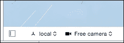

要查看场景的场景图，请点击 Xcode 窗口中视觉编辑器窗口底部左侧的侧窗图标，如图下截图所示：

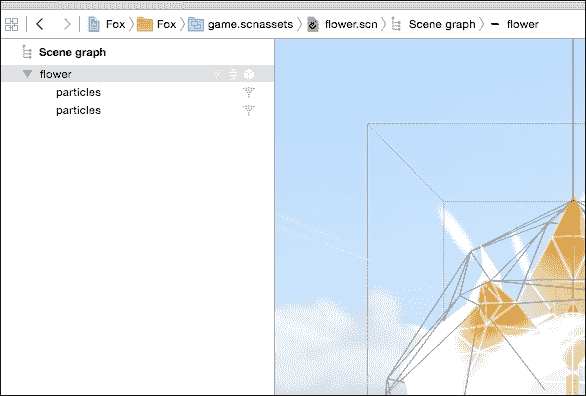

这是场景图的截图。那些熟悉游戏引擎，如 Unity 和 Unreal Engine 的人，会对这种组件/游戏场景视图非常熟悉。场景图显示了场景中所有对象的下拉层次结构，包括它们自己的内部组件。花朵升级由一个名为*flower*的 3D 网格模型组成，它有两个子粒子效果以及一个物理体。这三个都由图右侧的对象上的三个符号表示。

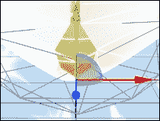

我们可以使用前面图像中看到的*X*、*Y*和*Z*标记在场景中移动模型。我们还可以放大、缩小、旋转场景，以及向场景添加更多对象。

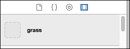

要向场景添加更多对象，请按照以下步骤操作：

1.  前往屏幕底部右侧的库窗口中找到的**媒体库**（如图所示）。

1.  现在搜索`grass`并将其简单地拖放到场景中。现在预制的草地对象已作为参考出现在这个场景中。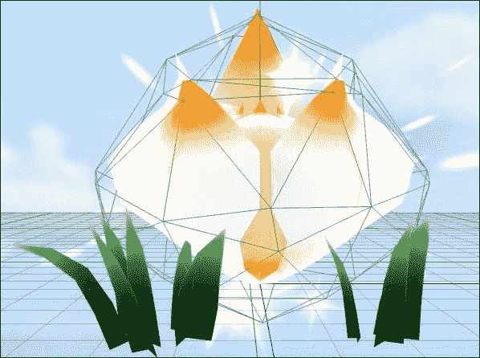

1.  这实际上就是`level.scn`文件是如何组成的。

1.  还可以选择将基本对象添加到场景中，并从那里构建它们，这又与以设计为中心的游戏引擎非常相似。只需从位于媒体库图标旁边的对象库标签中选择，并搜索`geometry`。有基本对象，如球体、平面和盒子。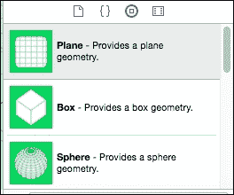

1.  基本对象缺少我们在项目中的草地和其他预制对象中可以看到的照明、材质和其他细节。使用这些对象的更详细检查器窗口来查看和编辑各种细节，例如物理体、材质、烘焙照明以及任何脚本/编码的对象名称识别。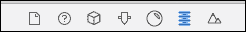

1.  还可以添加到这些对象中的动作。点击位于流程场景视图右侧的次要编辑器图标（一个倒三角形在正方形中，位于底部）。如果场景图中选择了花朵资产，这将打开次要编辑器，显示一个`RotateByEuler`动作。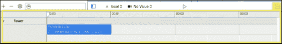

1.  这个动作的作用是每秒旋转一次花朵。要看到这个动作的效果，请点击位于次要编辑器窗口时间轴上方的播放按钮。我们可以看到这个对象将如何旋转。

1.  可以通过在次要编辑器时间轴中展开或收缩来缩短或扩展动作。更多关于动作的详细信息可以在检查器窗口中编辑，如果我们愿意，可以使用库向该对象添加更多动作或删除提供的动作以使其以不同的方式行动。

自己测试几个动作、时间和属性。我们可以看到，不使用任何代码，我们如何可以直观地设置场景并动态控制场景中每个对象的动作。许多这些视觉功能和动作都适用于 SceneKit 和 SpriteKit 场景。

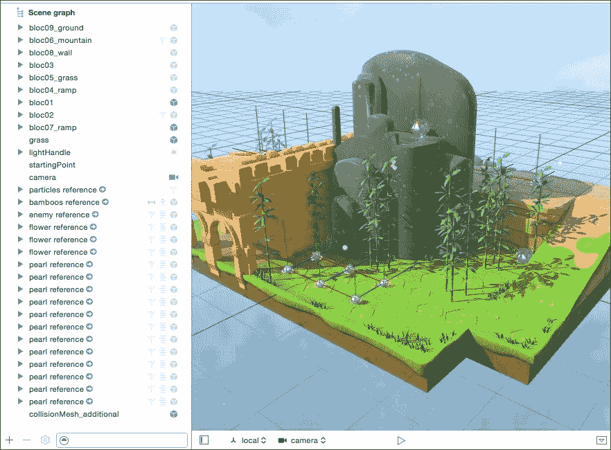

查看`level.scn`文件，可以看到一个包含完整组成级别相机对象的场景（如前一张截图所示）。你想制作一个类似的级别，可能包含更多障碍物和不同的天空盒吗？复制级别并更改这些资产，并将其命名为`level2`。这可以在游戏和级别的设计中节省大量时间。从 Xcode 7 开始，我们有了 IDE 中直接的工具，这些工具最初仅用于多平台游戏引擎。这真的让设计回到了游戏设计。

我们之前讨论的大多数手动代码可能会让人感到沮丧，尤其是对于那些可能想进入游戏设计但仍然相对新手的人来说。

```swift
//Objective-C
SCNScene *scene = [SCNScene sceneNamed:@"game.scnassets/level.scn"];
//Swift 
let scene = SCNScene(named: "game.scnassets/level.scn")!
```

这是我们从视觉设计工具中引用场景所需的所有内容。就像我们在 SceneKit 基本模板中提到的那样，将其添加到视图的根节点，它就准备好了。使用代码添加生成敌人、玩家和 2D SpriteKit 叠加层（它本身可以在其 SKS 文件中拥有动作和视觉设计），这样就构成了一个完整的游戏。

如需更多关于 SceneKit 框架以及其库的最新更新和新增内容的信息，请参阅以下完整文档链接：

[`developer.apple.com/library/ios/documentation/SceneKit/Reference/SceneKit_Framework/`](https://developer.apple.com/library/ios/documentation/SceneKit/Reference/SceneKit_Framework/)

# 摘要

在本章的开头，我们首先简要地谈到了 iOS 中 3D 游戏设计的历史以及 SceneKit 是如何从需要有一个针对 3D 游戏开发复杂性的第一方、动态稳健的框架的需求中产生的。然后，我们介绍了 SceneKit 的基本结构以及它和上一章中提到的 SpriteKit 是如何基于节点概念工作的，从视图开始，然后是场景节点以及该场景中的子节点。接下来，我们讨论了 SpriteKit 和 SceneKit 如何在同一场景中一起使用，然后我们分析了 Xcode 中给出的默认 SceneKit 模板及其各种资源。除了回顾模板项目的代码外，我们还回顾了一些功能、代码和资源，例如自 iOS 9 / Xcode 7 以来可用的音频节点、渲染模式以及调试选项。最后，在本章的剩余部分，我们详细讨论了在*WWDC15*大会上展示的 Fox 演示以及自 Xcode 7 发布以来可用的各种视觉游戏设计功能。

在下一章中，我们将深入探讨 GameplayKit 框架的特点，这是我们之前在介绍使用基于组合的结构构建游戏时的好处时简要介绍过的。使用 GameplayKit，我们可以像在本章中处理游戏的视觉组件那样，复制和重用预先制作的游戏动作和规则。
