# 第三章：*第三章*：自定义声音、外观和隐私设置

许多人对使用 iPhone 的方式非常满意，就像它从盒子里出来一样。然而，其他人喜欢自定义他们的 iPhone，使其更加个性化。例如，你可能想在背景中显示你狗的照片，或者改变每次接电话时 iPhone 发出的声音，使其听起来不像其他人的 iPhone。

个性化你的 iPhone 既有趣又实用。除了更改颜色或图片外，你还可以自定义 iPhone，重新排列应用图标，使其更容易找到你最常用的应用。更重要的是，你可能还想修改隐私设置，以保护你的个人数据安全。

在本章中，你将学习不同的方法来自定义你的 iPhone。只需记住，每次你更改设置时，你都可以随时更改回来，所以请随意尝试，看看如何让你的 iPhone 独一无二。

在本章中，我们将讨论以下主题：

+   获取 Apple ID

+   保护你的 iPhone

+   确保你不丢失你的 iPhone

+   更改壁纸

+   自定义声音和触觉反馈

+   阻止干扰

+   调整文本大小和屏幕亮度

+   自定义日期/时间格式

+   自定义电池

+   定义紧急 SOS

+   保护你的隐私

+   定义通知设置

+   设置 Wi-Fi、蓝牙和热点

+   更新 iPhone

+   使用辅助功能

由于你可能会下载应用、听音乐、阅读电子书或订阅新闻服务，因此获得 iPhone 的第一步是设置 Apple ID。

# 获取 Apple ID

要充分利用你的 iPhone，你应该创建一个 Apple ID，这是一个账户，让你可以访问苹果的各种服务，如 App Store、iTunes Store 和 iCloud。虽然你可以不使用 Apple ID 使用 iPhone，但没有 Apple ID，你将无法购买应用或订阅如 Apple Music 或 Apple News 等服务。

重要提示

如果你已经有 Apple ID，你不需要创建另一个 Apple ID 账户。

每个用户只需要一个 Apple ID。由于你不能共享 Apple ID，这意味着你家里的每个人都需要创建一个单独的 Apple ID 账户。当你创建 Apple ID 时，你需要定义一个唯一的密码，以及几个安全问题，这些安全问题可以帮助你在忘记密码时访问你的 Apple ID 账户。要创建 Apple ID，请按照以下步骤操作：

1.  在主屏幕上点击**设置**图标。

1.  按照图 3.1 所示，点击屏幕顶部的**登录到你的 iPhone**按钮：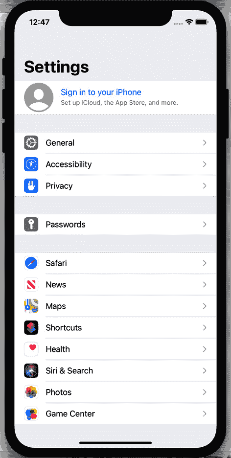

    图 3.1 – 设置 Apple ID

1.  按照图 3.2 所示，点击**没有 Apple ID 或忘记了？**链接：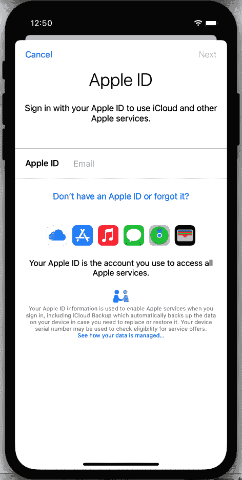

    图 3.2 – 创建 Apple ID

    弹出一个对话框，列出不同的选项。

1.  按下如图 3.3 所示的 **创建 Apple ID** 链接：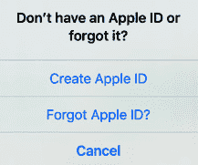

    图 3.3 – 创建 Apple ID 的对话框

1.  按照步骤定义 Apple ID（即你想要使用的电子邮件地址），以及密码和信用卡账单信息。尽管苹果存储了你的信用卡信息，但你不会因为任何原因而被收费，直到你实际上通过像 App Store 这样的服务进行购买。

一旦你设置了 Apple ID，你就可以在你的 iPhone 上通过苹果的各种服务进行购买。为了防止未经授权的人访问你的 iPhone 并使用你存储的信用卡信息进行购买，你应该立即采取措施，使用密码和 Touch ID 或 Face ID 保护你的 iPhone。

# 保护你的 iPhone

由于 iPhone 可以包含重要信息和私人消息以及照片，你不希望任何人未经你的允许使用你的 iPhone。为了阻止对 iPhone 的访问，你需要设置以下一项或多项：

+   **密码**：需要输入一个六位数字

+   **Touch ID**：需要指纹

+   **Face ID**：需要识别你的面部

记住，并非所有 iPhone 模型都提供所有三种访问控制形式。一些 iPhone 只提供密码和 Touch ID，而其他 iPhone 可能只提供密码和 Face ID。无论你拥有哪种 iPhone 模型，都要使用两种访问控制形式，例如密码和 Face ID。由于每个 iPhone 都提供密码，请确保你尽快设置一个良好的密码。

## 使用密码

密码是限制访问 iPhone 的第一道防线。直到有人输入正确的六位代码，你的密码将阻止对 iPhone 的访问。理想情况下，你希望密码对你来说容易记住，但对别人来说难以猜测。

不幸的是，对你来说容易记住的数字也可能对别人来说容易猜测。这就是为什么只包含相同数字的密码，比如 33333，可能容易记住，但也容易被人猜到。

同样，对别人来说难以猜测的数字也可能对你来说难以记住。理想情况下，选择一个对你有特殊意义且别人无法猜测或发现的密码。例如，将你的出生年份与出生月份或日期结合起来不是一个好主意，因为其他人可以很容易地通过查找你的出生日期来发现这些数字。相反，选择别人无法发现的数字，比如你第一只狗的出生日期（月份和年份）或只有你才有的特殊意义的数字。

为了额外的安全性，你可能想要定期更改密码。通过定期更改密码，你可以确保即使有人发现了你的密码，新的密码也会再次将他们拒之门外。

要设置或更改密码，请按照以下步骤操作：

1.  点击主屏幕上的**设置**应用。

1.  点击**面部识别与密码**（适用于配备面部识别的 iPhone）或**Touch ID 与密码**（适用于配备 Touch ID 的 iPhone）。屏幕将出现一个请求您输入六位数字密码的界面（如果您已经定义了一个密码）。

1.  输入您的六位数字密码。屏幕将显示如图 3.4 所示的界面，其中包含以下选项：

    +   **关闭密码**：这允许您禁用密码（不推荐）。

    +   **更改密码**：这允许您定义一个新的六位数字密码或自定义的字母数字密码。

    +   **锁定时允许访问**：这允许您打开（或关闭）您可能希望在无需解锁 iPhone 的情况下访问的功能，例如使用 Siri、查看通知或回复消息：

图 3.4 – 选择密码选项

请记住，密码只是第一道防线。一旦您定义了密码，请确保您还在 iPhone 上设置了 Touch ID 或 Face ID，以提供额外的安全性。

## 使用 Touch ID

Touch ID 允许您存储最多五个指纹，因此您可以存储一只手或双手的指纹。许多人使用拇指或食指，但您可以选择您认为最方便使用的其他手指组合。

存储多个指纹的目的是确保无论您使用哪只手，或者如何握持 iPhone，您都能通过指纹访问您的 iPhone。

要设置 Touch ID，请按照以下步骤操作：

1.  点击主屏幕上的**设置**图标。

1.  点击**Touch ID 与密码**。屏幕将出现一个请求您输入六位数字密码的界面。

1.  输入您的六位数字密码。将出现一个新屏幕，如图 3.5 所示：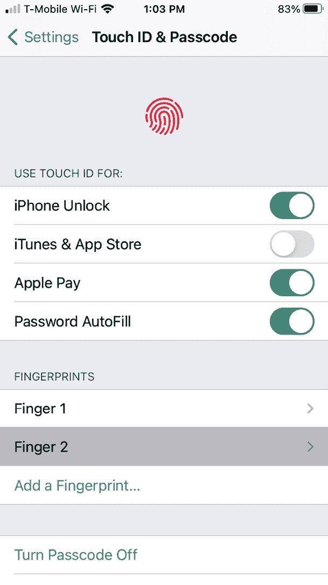

    图 3.5 – Touch ID 设置

1.  点击**添加指纹…**以识别另一个指纹（您可以在任何指纹上向左滑动以删除它或给它一个比**指纹 1**等更描述性的名称）。

每次添加指纹时，您都需要将手指在 Home 按钮上的指纹传感器上滚动，直到 iPhone 识别完整的指纹。您还可能想要定义 Touch ID 以解锁 iPhone 或使用 Apple Pay。

在您将指纹录入 Touch ID 之后，您只需在主屏幕上的指纹传感器识别到的 Home 按钮上按下已识别的手指即可解锁您的 iPhone。

虽然 Touch ID 在较老的 iPhone 型号上很受欢迎，但 Face ID 已成为授权访问的新方法。

## 使用 Face ID

Face ID 依赖于 iPhone 的摄像头来识别您的面部，无论您是否佩戴眼镜或隐形眼镜。其理念是从略微不同的角度扫描您的前面部以捕捉一个三维图像。然后，每次您想要解锁 iPhone 时，只需将摄像头对准您的面部即可。

要设置 Face ID，请按照以下步骤操作：

1.  点击主屏幕上的**设置**图标。

1.  点击**面容 ID 和密码**。将出现一个要求您输入六位密码的屏幕。

1.  输入您的六位密码。将出现另一个屏幕。

1.  点击**设置 Face ID**。屏幕显示一个圆圈，您需要将面部置于其中。

1.  将您的 iPhone 以竖直模式（相机位于 iPhone 顶部）与手臂长度保持距离。

1.  将您的头部向一侧转动，然后向另一侧转动，直到相机通过突出显示围绕您面部的整个圆圈来捕捉您的面部，如图*图 3.6*所示：

    图 3.6 – 训练 Face ID 识别您的面部

1.  点击**继续**并重复扫描以确保 Face ID 可以识别您的面部，然后点击**完成**。

一旦您成功捕捉到您的面部信息用于 Face ID，您只需将相机对准您的面部，就能解锁您的 iPhone。请确保您将 iPhone 竖直握持，并将相机置于顶部。屏幕顶部的动画锁图标将从关闭变为打开。当发生这种情况时，您可以向上滑动以访问 iPhone 的主屏幕。

使用密码、Touch ID 或 Face ID 可以防止他人未经您的允许访问您的 iPhone，但您也需要知道您的 iPhone 在哪里，以免丢失。

# 确保您不会丢失您的 iPhone

如果您找不到您的 iPhone，您就无法使用它。因此，在通过密码、Touch ID 或 Face ID 保护您的 iPhone 之后，设置跟踪以便在您不小心丢失（或有人偷走）您的 iPhone 时可以找到它。

跟踪丢失的 iPhone 背后的想法是您可以再次找到它。如果由于某种原因您无法找回您的 iPhone，那么您可以远程擦除所有数据，这样小偷就无法访问您的个人数据。

跟踪您的 iPhone 需要使用 iCloud，这需要 Apple ID。一旦您打开跟踪，您将能够使用任何可以访问 iCloud 的设备（如计算机或 iPad）跟踪您的 iPhone。

## 设置跟踪

由于跟踪需要 Apple ID，默认情况下，跟踪是关闭的。要打开跟踪，请按照以下步骤操作：

1.  点击主屏幕上的**设置**图标。

1.  点击屏幕顶部的显示您姓名的 Apple ID，如图*图 3.7*所示：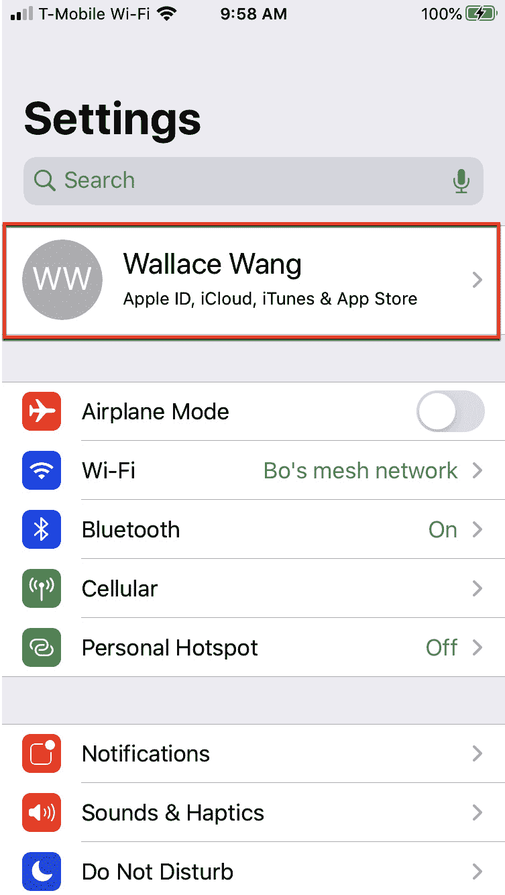

    图 3.7 – Apple ID 按钮

1.  点击**查找我的**。将出现一个**查找我的**屏幕。

1.  点击**查找我的 iPhone**。将出现一个**查找我的 iPhone**屏幕，如图*图 3.8*所示，它允许您打开（或关闭）各种设置：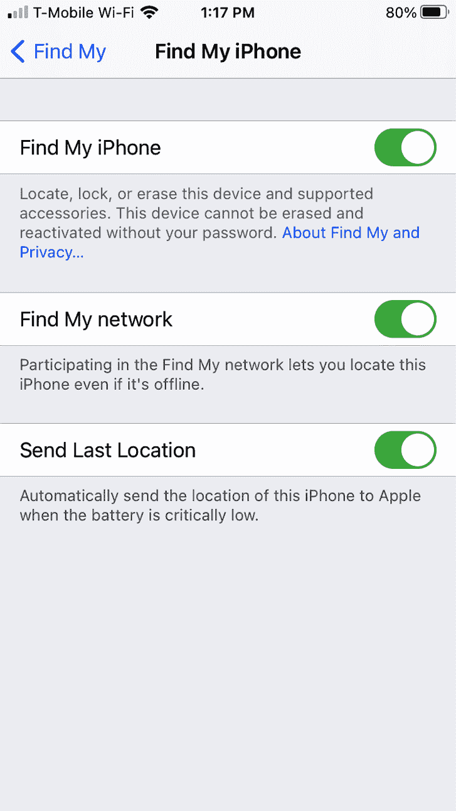

    图 3.8 – 查找我的 iPhone 屏幕

1.  打开所有设置以跟踪您的 iPhone。您现在将能够通过任何可以访问 iCloud 的计算机浏览器跟踪您的 iPhone。

## 定位丢失的 iPhone

在你已开启 iPhone 跟踪并设置好 iCloud 账户后，你将能够通过任何浏览器按照以下步骤找到你的 iPhone：

1.  使用任何浏览器访问 [iCloud.com](http://iCloud.com) 并输入你的电子邮件地址和密码。

1.  从 iCloud 屏幕点击 **查找 iPhone** 图标，如图 *图 3.9* 所示：![图 3.9 – 在 iCloud 中使用查找我的 iPhone

    ![图 3.09 – 使用 iCloud 中的查找我的 iPhone

    图 3.9 – 在 iCloud 中使用查找我的 iPhone

1.  输入你的 Apple ID 密码。iCloud 显示一个显示你的 iPhone 位置的地图。

1.  轻触代表你的 iPhone 位置的圆圈。一个菜单出现，提供了 **播放声音**、**丢失模式** 和 **抹除 iPhone** 选项，如图 *图 3.10* 所示：

![图 3.10 – 跟踪 iPhone 的选项

![图 3.10 – 跟踪 iPhone 的选项

图 3.10 – 跟踪 iPhone 的选项

**播放声音** 使你的 iPhone 播放声音，这样你就可以在家中找到它。**丢失模式** 允许你锁定 iPhone 并显示一个电话号码，以便有人可以联系你以便你找回丢失的 iPhone。**抹除 iPhone** 允许你从 iPhone 中擦除所有重要数据，这样就没有人可以恢复那些数据。

一旦你已设置跟踪以寻找丢失的 iPhone，并且你已经设置了密码、Touch ID 或 Face ID 以阻止未经授权的访问，那么就是时候开始为乐趣定制你的 iPhone 了。个性化 iPhone 的方法之一是更改其壁纸，这是每次主屏幕出现时在背景中显示的图片。

# 更改壁纸

由于你将经常使用主屏幕，你不妨显示一张你喜欢的图片，比如一张激励你的图片，或者你最喜欢的宠物或人物。苹果提供了一些壁纸选项，但你始终可以从其他公司购买单独的壁纸图片。

然而，你很可能已经拍摄了你喜欢的东西或人的照片，因此你可以使用存储在 **照片** 库中的任何图片或你在互联网上找到的任何图片。

要更改壁纸，请按照以下步骤操作：

1.  在主屏幕上轻触 **设置** 图标。

1.  轻触 **壁纸**。出现一个 **壁纸** 屏幕。

1.  轻触 **选择新的壁纸**。出现一个新的屏幕，列出了你可以选择的不同壁纸选项，例如选择存储在你的 **照片** 库中的图片，如图 *图 3.11* 所示：![图 3.11 – 选择不同的壁纸图片

    ![图 3.11 – 选择不同的壁纸图片

    图 3.11 – 选择不同的壁纸图片

1.  轻触你想要使用的图片。图片的预览将出现，让你看到它在 iPhone 屏幕上的样子。你可能可以移动或放大图片以改变其外观。

1.  点击**取消**或**设置**。如果您选择**设置**，将出现一个对话框，让您定义是否使用图片作为主屏幕或锁屏图片。当您的 iPhone 处于锁定状态时，锁屏会出现。当您的 iPhone 解锁时，主屏幕会出现。这样，如果您愿意，可以显示不同的图片，例如当您的 iPhone 处于锁定状态时显示中性图片，而当您的 iPhone 解锁时显示更个性化的图片。

改变您 iPhone 的主屏幕和锁屏的外观可以使您的 iPhone 独一无二，但您可能还想更改每次收到消息或电话时 iPhone 的声音。

# 自定义声音和触觉

默认情况下，每部 iPhone 的声音都相同，所以如果您不更改声音设置，您可能会认为当您的 iPhone 实际上在同一个房间内接收电话或短信时，它正在接收电话或短信。如果您想个性化 iPhone 的声音，请花些时间修改其声音设置。

除了更改您收到消息时 iPhone 发出的声音外，您还可以定义是否希望 iPhone 在您无法听到 iPhone 发出声音的情况下振动，以提供额外的触觉反馈。例如，您可以在接电话时让它振动。这样，如果您在一个嘈杂的地方，没有听到 iPhone 的铃声，您仍然会感觉到它在振动，以告知您有来电。

要定义声音和触觉以提醒您，请按照以下步骤操作：

1.  点击主屏幕上的**设置**图标。

1.  点击**声音与触觉**。屏幕将显示不同的声音选项。您可能需要向下滚动才能看到所有可选择的选项，如图*图 3.12*所示：

![Figure 3.12 – The Sound & Haptics options

![img/Figure_3.12_B14100.jpg]

图 3.12 – 声音与触觉选项

在更改任何声音和触觉选项之前，确定您最常使用 iPhone 的地方。如果您经常在拥挤的地方使用 iPhone，例如办公室或学校，您可能想选择不那么刺耳的声音，并依赖触觉提供振动作为反馈。

然而，如果您在户外使用 iPhone，您可能想选择更独特的声音，并提高音量以便更容易听到您的 iPhone。为了获得额外的反馈，请开启**系统触觉**，这样即使您没有听到您的 iPhone，您也可以感觉到它在振动，以告知您已收到短信或电话。

每个人对声音和触觉的使用和需求都不同，所以请随意尝试，看看您最喜欢什么。例如，您可能想更改**键盘点击声**设置，以便在您点击键时提供音频反馈。如果您觉得这种点击声太烦人，您总是可以再次将其关闭。

即使您更喜欢声音，当您想要工作或集中注意力时，您可能会觉得它们很烦人。与其关闭所有声音（然后稍后再打开），您可能想暂时禁用声音。

# 屏蔽干扰

无论您多么喜欢您的 iPhone 和您的朋友，您可能需要专注于一项任务，并且您不希望您的 iPhone 在您试图完成任务时不断发出哔哔声或噪音。一个简单的解决方案是将您的 iPhone 完全关闭或将其放在另一个房间，这样您就听不到它了。

然而，一个更简单的解决方案是使用 iPhone 的**勿扰模式**功能暂时静音您的 iPhone。iPhone 通过**勿扰模式**为您提供两种屏蔽干扰的选项：

+   手动开启和关闭**勿扰模式**。

+   每天在特定时间自动开启和关闭**勿扰模式**。

手动开启**勿扰模式**功能需要有意为之，但在您需要暂时屏蔽潜在干扰时可能很有用。自动开启和关闭**勿扰模式**功能可以鼓励您设定一个不会被 iPhone 打扰的特定时间。

要开启**勿扰模式**功能，请按照以下步骤操作：

1.  在主屏幕上轻触**设置**图标。

1.  轻触**勿扰模式**。会出现一个**勿扰模式**屏幕，如图 3.13 所示。您可能需要向下滚动以查看所有选项：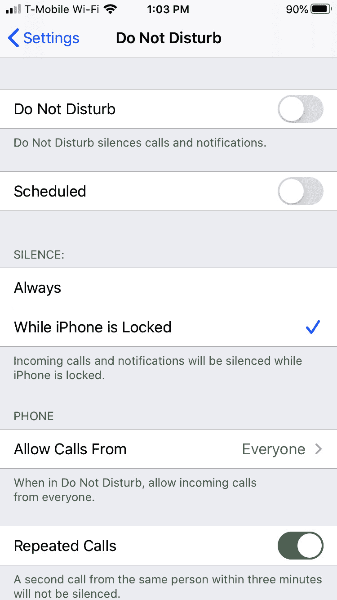

    图 3.13 – **勿扰模式**屏幕

1.  选择**勿扰模式**以静音您的 iPhone。如果您选择此选项，您需要再次选择此选项以允许 iPhone 再次发出声音。

1.  选择**定时**以定义开始和结束时间来禁用声音。如果您选择此选项，您的 iPhone 将在您指定的选择时间内自动静音。

1.  选择**始终/当 iPhone 锁定时**以定义您是否希望 iPhone 始终保持静音或仅在锁定时静音。

1.  选择**允许来电**来自定义是否接收所有人的来电，无人来电，或者仅接收您定义为喜欢的联系人或存储在您的**联系人**应用中的联系人。

1.  选择**重复来电**以允许来自同一人的重复来电通过。

1.  选择**激活**以检测您是否在驾驶。当 iPhone 检测到您正在驾驶，连接到汽车的蓝牙或手动操作时，它会自动开启**勿扰模式**。

1.  选择**自动回复**以在开启**勿扰模式**时向尝试联系您的人发送自动回复。

当您已经将不同的音频设置调整到您喜欢的样子时，花点时间自定义文本和屏幕亮度。

# 调整文本大小和屏幕亮度

根据您的偏好和视力，您可能需要调整 iPhone 屏幕的外观以修改文本大小和屏幕亮度。改变文本大小可以使文本更容易阅读，但会牺牲显示的信息量，或者牺牲显示更多信息而使文本更小、更难阅读。通过修改文本大小，您可以找到最适合您的完美平衡。

您还可能想要调整屏幕亮度到一个舒适的级别。屏幕太暗或太亮可能难以阅读。此外，屏幕太亮会消耗更多电量，这可能会耗尽 iPhone 的电池，因此调整屏幕亮度对您的眼睛和 iPhone 的电池寿命都很重要。

要调整文本大小和屏幕亮度，请按照以下步骤操作：

1.  点击主屏幕上的**设置**图标。

1.  点击**显示与亮度**。出现**显示与亮度**屏幕，如图*图 3.14*所示：![Figure 3.14 – 调整文本大小和屏幕亮度的显示与亮度屏幕

    ![img/Figure_3.14_B14100.jpg]

    图 3.14 – 调整文本大小和屏幕亮度的显示与亮度屏幕

1.  选择**浅色/深色**以选择浅色或深色模式。

1.  选择**自动**以根据日落和日出或您定义的计划时间从浅色模式切换到深色模式。

1.  选择**亮度**以调整滑块以增加或减少屏幕亮度。

1.  选择**夜视**以调整屏幕颜色，使其在接近一天结束时更接近。

1.  选择**自动锁定**以定义一个时间周期来自动锁定您的 iPhone。

1.  选择**抬起唤醒**以在抬起 iPhone 时打开屏幕。

1.  选择**文本大小**以调整屏幕上显示的文本大小。

1.  选择**粗体文本**以定义文本是否为粗体。

1.  选择**视图**以设置屏幕内容的大小。

一旦您对文本大小和屏幕亮度满意，您可能想自定义 iPhone 显示信息的方式，例如日期和时间。

# 自定义日期/时间格式

世界各地的每个地区显示的时间和日期方式都不同。在美国，日期以月、日、年的格式书写，例如 2021 年 1 月 14 日，而在世界其他地区，日期可能以年、月、日的格式书写，例如 2021 年 1 月 14 日。

时间也是如此。有些人喜欢 24 小时制时间，例如 13:25，而有些人则喜欢 12 小时制，例如下午 1:25。无论您喜欢如何查看日期和时间，您都可以从默认设置更改格式。

要自定义日期和时间的格式，请按照以下步骤操作：

1.  点击主屏幕上的**设置**图标。

1.  点击**通用**。

1.  点击**日期和时间**。出现**日期和时间**屏幕，如图*图 3.15*所示：![Figure 3.15 – 定制时间的日期和时间屏幕

    ![img/Figure_3.15_B14100.jpg]

    图 3.15 – 定制时间的日期和时间屏幕

1.  选择**24 小时制时间**以设置或禁用 24 小时时间格式，例如 14:31。

1.  选择**自动设置**以让您的 iPhone 根据您的当前位置自动设置时间。

1.  选择**时区**。当**自动设置**关闭时，此选项允许您定义当前日期和时间以及您想要使用的时区。

1.  点击左上角的返回按钮以返回到**通用**屏幕。

1.  点击**语言与地区**。**语言与地区**界面出现，允许你选择你偏好的语言，以及温度单位（**摄氏度**或**华氏度**）和一个世界区域来定义时间、日期和货币的格式，如图*图 3.16*所示：![Figure 3.16 – Defining a language and region

    ![img/Figure_3.16_B14100.jpg]

    图 3.16 – 定义语言和区域

1.  选择**日历**以定义要使用哪种日历系统：**公历**、**日本**或**佛教**。

在大多数情况下，你的 iPhone 将默认使用你所在地区的最常用设置，但如果你愿意，你始终可以选择更改这些设置。无论你住在哪里，你应该修改的一个额外功能是 iPhone 如何使用其电池。

# 定制电池

iPhone 的电池设计用于使用数年，但随着时间的推移，它会磨损并逐渐减少电量。即使你的电池处于最佳状态，在使用过程中也会在一天中失去电量，因此你可能想要花时间优化电池并调整自己的行为，通过查看哪些应用倾向于消耗最多的电量。

要了解如何在 iPhone 上定制电池，请按照以下步骤操作：

1.  点击主屏幕上的**设置**图标。

1.  点击**电池**。**电池**界面出现，如图*图 3.17*所示。你可能需要向下滚动才能看到**电池**界面上所有可用的选项：![Figure 13.17 – Date pickers let you select different dates and times

    ![img/Figure_3.17_B14100.jpg]

    图 13.17 – 日期选择器允许你选择不同的日期和时间

1.  选择**电池百分比**以定义是否以电池强度的百分比（如 75%）显示剩余电量或不是。

1.  选择**低功耗模式**以减少后台任务，从而在降低任务速度的同时节省电池寿命。

1.  选择**电池健康**以查看电池的强度并开启优化充电以减少过充（从而磨损）电池。

**电池**界面的底部让你可以查看电池随时间的变化充电水平，同时可以看到哪些应用消耗了最多的电量。通过查看你使用最频繁且消耗电量最多的应用，你可以通过减少使用某些应用来调整你的使用习惯以节省电量。

随着时间的推移，你可能会发现你的 iPhone 电池的电量越来越少。这在所有类型的电子设备中都很常见，但通过监控哪些应用消耗了最多的电量，你可以改变你使用 iPhone 的方式，在正常使用过程中节省电池电量。

如果你需要使用 iPhone 在紧急情况下寻求帮助，电池寿命可能特别关键。由于寻求帮助可能需要时间，你可能想要花点时间在你的 iPhone 上设置紧急呼叫。

# 定义紧急 SOS

想象一下最坏的情况。如果你在车祸中受伤，无法用手拨打电话号码求救？或者如果你处于其他人的直接危险中，没有时间拿出 iPhone 并拨打报警电话？

答案很简单。在你遇到麻烦之前，花一点时间打开 iPhone 的**紧急 SOS**呼叫功能，这样你可以通过按五次睡眠/唤醒按钮来联系紧急服务。

要打开这个**紧急 SOS**功能，请按照以下步骤操作：

1.  点击主屏幕上的**设置**图标。

1.  点击**紧急 SOS**。**紧急 SOS**屏幕出现，如图*图 3.18*所示：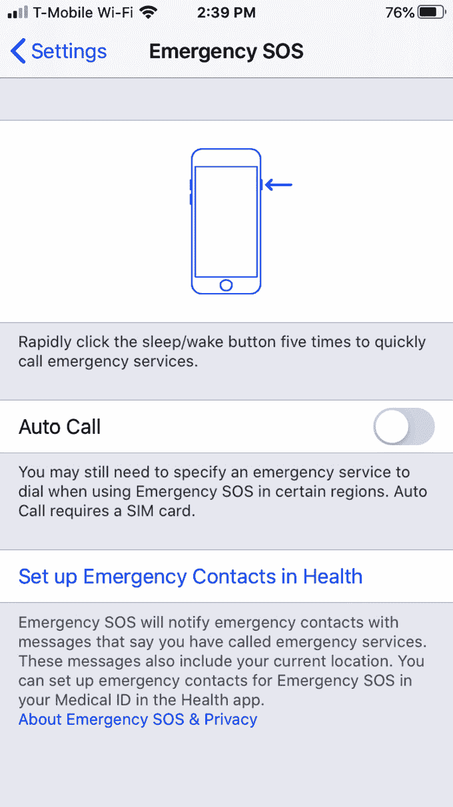

    图 3.18 – 打开紧急 SOS 呼叫功能

1.  点击**自动呼叫**。如果**自动呼叫**已开启，你还将有**设置倒计时声音**的选项，这将在你 iPhone 即将进行紧急呼叫时提醒你。这个倒计时声音可以在你意外触发紧急呼叫功能时提醒你，这样你就有时间决定是否需要关闭它。

    重要提示

    对于老年人或患有疾病或其他可能导致通过 iPhone 求救困难的人，考虑将 iPhone 与 Apple Watch 配对。只有在你需要帮助时携带 iPhone 时，iPhone 才能拨打紧急服务。由于 Apple Watch 戴在手腕上，如果你的 iPhone 不在手边，它更有可能在紧急情况下可用。

打开**紧急 SOS**可能至关重要，所以通常是一个好主意打开它，因为你永远不知道你什么时候可能需要它。

你可能还想自定义的一个最后功能是你的隐私。隐私不仅包括防止未经授权的人访问你的 iPhone，还包括其他应用程序如何访问你存储在 iPhone 上的个人数据。

# 保护你的隐私

你越使用 iPhone，就越有可能存储个人信息，比如在**联系人**应用中存储姓名和电话号码，在**消息**和邮件应用中存储个人和机密消息，或者在**照片**应用中存储你通过 iPhone 摄像头拍摄的个人照片。

在使用密码、Touch ID 和 Face ID 时，这些安全措施可以防止未经授权的人访问这些私人数据，但没有任何这些安全措施可以阻止应用程序访问你的私人数据。

例如，许多应用程序可能会请求访问你的**联系人**数据，以帮助你找到朋友的联系信息。以图形为导向的应用程序也可能请求访问你在**照片**应用中的图片，以便使用它们。

如果你担心太多应用程序可能有权访问你的私人数据，你可以选择性地阻止应用程序访问特定数据。这样，你可以确保只有对你最重要的应用程序才能访问你的个人信息。

要检查和禁用哪些应用正在访问你的 iPhone 数据，请按照以下步骤操作：

1.  在主屏幕上点击**设置**图标。

1.  点击**隐私**。**隐私**屏幕会出现，列出你 iPhone 上所有可用的应用和功能，例如**日历**、**照片**、**蓝牙**、**麦克风**和**健康**，如图*图 3.19*所示：

    图 3.19 – 检查不同数据和硬件的隐私设置

1.  点击你想要检查的应用名称（例如**联系人**）或功能（例如**相机**或**HomeKit**）。另一个屏幕会出现，列出所有请求访问特定数据或硬件的应用，如图*图 3.20*所示：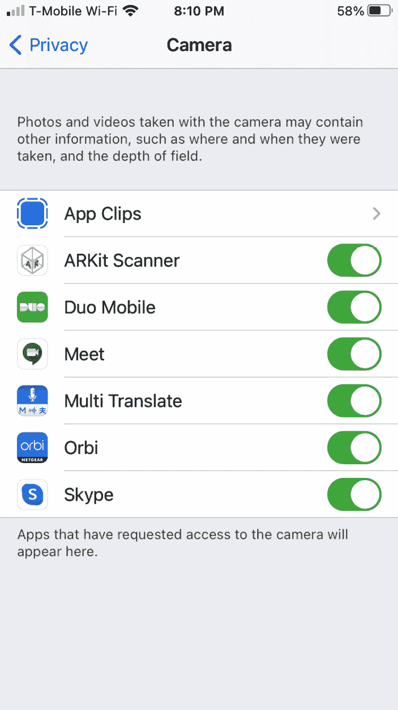

    图 3.20 – 请求访问数据或硬件的应用列表

1.  打开或关闭任何你希望或希望不访问所选数据或服务的应用。

通常，当第一次运行一个新应用时，它可能会请求访问数据或硬件的权限，例如请求使用相机。如果你不给应用权限，它可能根本无法运行，或者即使运行了，功能也会受限。因此，立即给应用授权通常更容易。

然而，你可能想要定期检查哪些应用有权访问你的数据和服务，以确保你仍然希望这些应用有权访问。虽然大多数应用不会恶意窃取你的数据，但限制对数据和服务的访问可以帮助你降低丢失重要数据的风险，因此请检查不同数据和服务的隐私设置，以确保你没有给太多应用访问你 iPhone 数据和服务的权限。

除了定期检查隐私设置外，你还可能想要定期检查通知设置。通知设置允许应用在特定事件发生时提醒你。由于许多应用希望获得通知权限，你应该定义哪些应用最重要，这样你就不会收到来自对你不那么重要的应用的不断通知。

# 定义通知设置

某些应用可能需要在特定事件发生时通知你。例如，日历应用可能会提醒你即将到来的预约，而闹钟应用可能需要在设置闹钟时通知你。

通知允许应用在特定事件发生时提醒你，但你可能不希望每个应用都显示通知，否则如果通知出现得太频繁，可能会变得令人烦恼。你可以设置开启或关闭通知。如果你开启通知，你还可以定义以下一个或多个选项，如图*图 3.21*所示：

+   **警报**：在屏幕中间弹出一个窗口，直到你关闭警报，它会阻止一切操作。

+   **横幅**：在屏幕顶部显示一个窄条，它要么暂时出现，要么永久出现，直到你点击关闭它。

+   **声音**：当出现通知时播放独特的声音。

+   **徽章**：在应用图标的右上角显示一个带数字的小红点（用于定义警报的数量，例如未读消息的数量）：

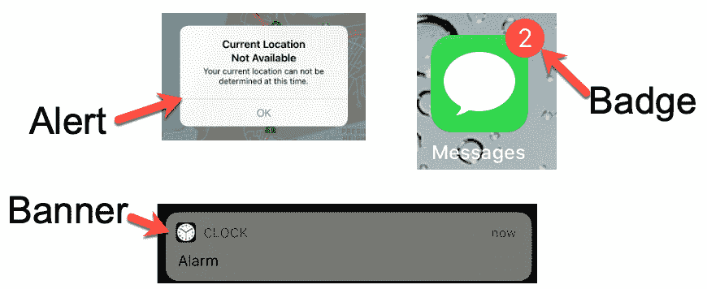

图 3.21 – 提醒、横幅和徽章

要更改不同应用程序的通知设置，请按照以下步骤操作：

1.  点击主屏幕上的**设置**图标。

1.  点击**通知**。会出现不同应用程序通知设置的列表，如图 *图 3.22* 所示：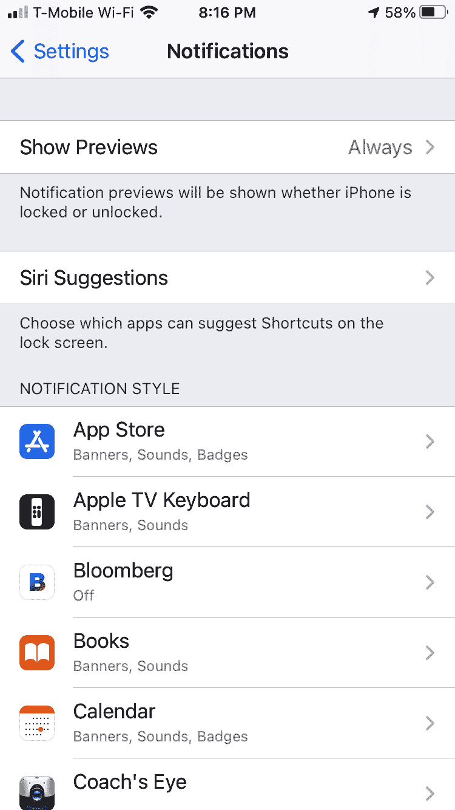

    图 3.22 – 不同应用程序的提醒设置

1.  点击一个应用程序（如**书籍**或**日历**）以修改其通知设置。

1.  点击**允许通知**开关以开启通知。一旦通知开启，可能会出现不同事件的列表，让您为每个事件指定一个通知，如图 *图 3.23* 所示（不允许为多个事件设置通知的应用程序将立即显示类似于 *图 3.24* 的屏幕）：

    图 3.23 – 不同事件的提醒设置

1.  点击一个事件以定义其通知。会出现一个选项列表，如图 *图 3.24* 所示：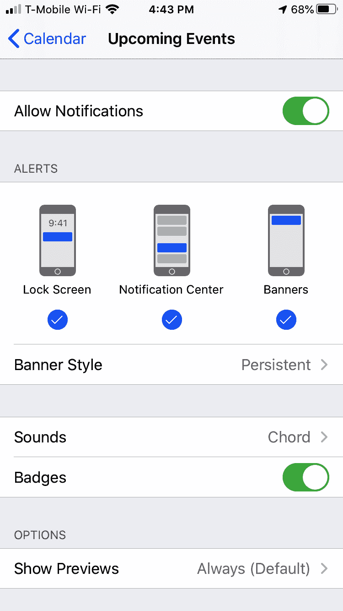

    图 3.24 – 为特定事件定义通知

1.  点击以选择或清除**警报**类别中的任何选项，例如**锁屏**或**横幅**。

1.  点击**横幅样式**以定义**临时**或**持续**。

1.  点击**声音**以选择通知的声音。

1.  点击**徽章**开关以开启或关闭徽章。

单独的 iPhone 可以连接到蜂窝电话网络，以便您访问互联网。然而，您可能希望避免依赖蜂窝网络，以防您因超额使用数据而被收费，或者在某些地区蜂窝网络可能不稳定或不可靠。当您想避免使用蜂窝网络时，您通常可以依赖 Wi-Fi。

# 设置 Wi-Fi、蓝牙和热点

Wi-Fi 允许您通过蜂窝网络连接 iPhone 到互联网，而无需支付额外的数据使用费用。蓝牙允许您将 iPhone 连接到外部键盘或扬声器等配件。

如果没有 Wi-Fi 热点，但您的 iPhone 仍然可以连接到蜂窝网络，您可以将 iPhone 转换为 Wi-Fi 热点，以便其他设备（如笔记本电脑或平板电脑）通过 iPhone 连接到互联网。

通过连接到 Wi-Fi 网络、蓝牙设备或将 iPhone 转换为 Wi-Fi 热点，您可以确保始终通过 iPhone 保持连接。

重要提示

当您连接 iPhone 到您不控制的 Wi-Fi 网络时，请务必小心发送敏感数据，如密码、银行信息或信用卡号码。因为窃贼可能会截取从 iPhone 发送到 Wi-Fi 路由器的数据。

## 连接到 Wi-Fi 网络

在许多地方，长时间连接到蜂窝网络需要额外付费。在这种情况下，您可能想连接到 Wi-Fi 网络以避免额外的蜂窝网络费用。

即使您居住在一个提供无限数据的地方，您可能仍然想连接到 Wi-Fi 网络，因为 Wi-Fi 通常比蜂窝网络更快，可以用于浏览互联网、发送电子邮件，甚至打电话。

要通过 iPhone 连接到 Wi-Fi 网络，请按照以下步骤操作：

1.  在主屏幕上点击**设置**图标。

1.  点击**Wi-Fi**。**Wi-Fi**屏幕将出现。

1.  点击**Wi-Fi**开关以打开 Wi-Fi（或关闭）。当 Wi-Fi 开关打开时，将出现其他选项，如图 3.25 所示：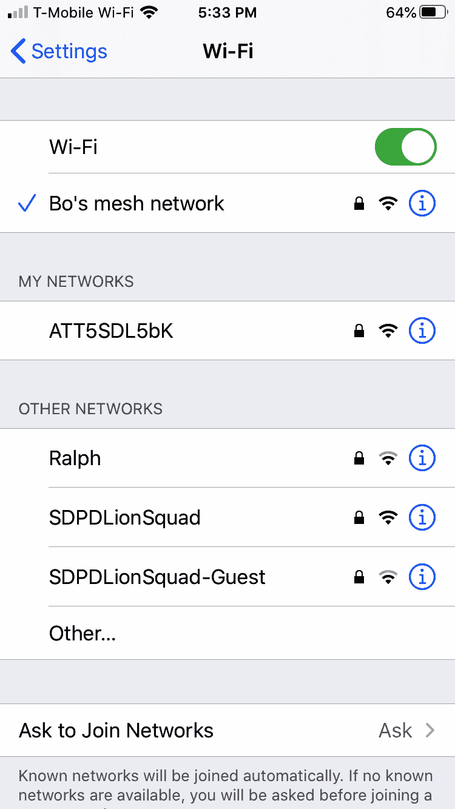

    图 3.25 – 定义不同连接设置的 Wi-Fi 屏幕

1.  点击您想加入的 Wi-Fi 网络。需要密码的 Wi-Fi 网络将显示一个锁形图标，而无需密码的 Wi-Fi 网络则不会显示锁形图标。如果您选择了锁定的 Wi-Fi 网络，将出现一个**输入密码**屏幕，如图 3.26 所示：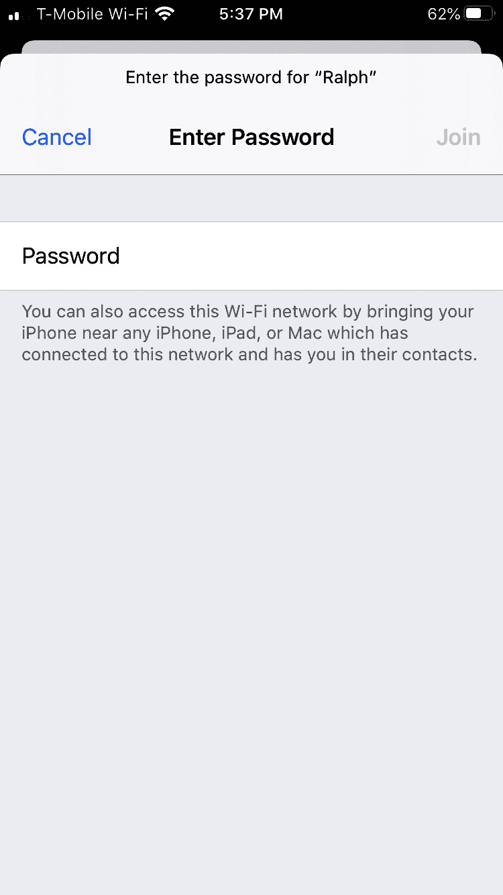

    图 3.26 – 连接到锁定 Wi-Fi 网络的输入密码屏幕

1.  点击**密码**文本框并输入访问 Wi-Fi 网络的密码。

1.  点击**加入**。Wi-Fi 网络名称左侧出现勾选标记，以告知您 iPhone 当前连接到哪个网络（您一次只能连接到一个 Wi-Fi 网络）。

连接到 Wi-Fi 网络让您可以访问互联网，而无需依赖可能较慢且每分钟额外收费的蜂窝网络。如果您想将 iPhone 连接到外部设备，如键盘或扬声器，您还需要打开蓝牙。

## 打开蓝牙

蓝牙是一种在短距离内（如 1 米或 3 英尺）无线连接设备的标准。由于蓝牙具有如此短的传输距离，它通常用于将外部设备连接到 iPhone，例如键盘、扬声器或耳机。

要打开（或关闭）蓝牙，请按照以下步骤操作：

1.  在主屏幕上点击**设置**图标。

1.  点击**蓝牙**。**蓝牙**屏幕将出现。

1.  点击**蓝牙**开关以打开它。当开关打开时，将出现 iPhone 可以通过蓝牙连接的所有设备的列表。

1.  确保其他设备已开启蓝牙，并点击您想连接到 iPhone 的设备。

蓝牙可以方便地连接外部设备，但假如您在没有互联网连接的地方被困住了呢？这时您可能想将 iPhone 用作热点，以便附近的笔记本电脑和平板电脑可以通过您的 iPhone 连接到互联网。

## 创建热点

热点的主要目的是将 iPhone 连接到蜂窝网络，然后允许其他设备，如笔记本电脑或平板电脑，通过 iPhone 连接到互联网。这可以为他人提供互联网接入的一种方便方式，但请注意，您可能需要为数据使用额外付费，并且互联网连接可能不够快。这意味着您可能不想将 iPhone 用作数据密集型活动（如流媒体电影或在线玩视频游戏）的热点。

要将 iPhone 转换为热点，请按照以下步骤操作：

1.  在主屏幕上轻触**设置**图标。

1.  轻触**个人热点**。出现**个人热点**屏幕。

1.  轻触**允许他人加入**开关以将其打开。当开关打开时，会出现连接其他设备到您的 iPhone 的说明列表，如图*图 3.27*所示：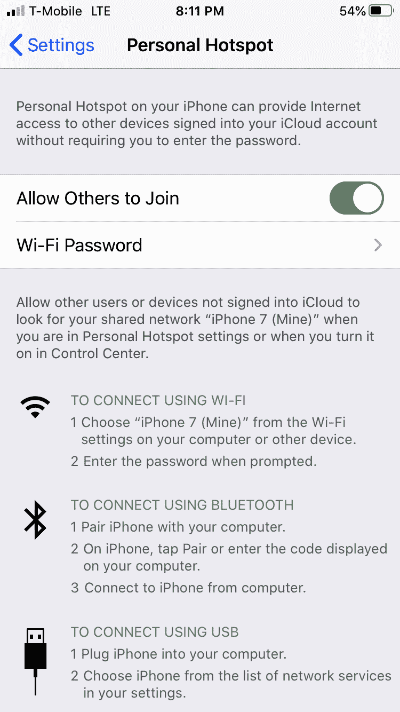

    图 3.27 – 个人热点屏幕

1.  轻触**Wi-Fi 密码**。会出现一个 Wi-Fi 密码屏幕，让您定义其他人需要输入以连接到您的 iPhone 的密码。

1.  轻触**完成**。

在大多数情况下，您可以使用 iPhone 与其他设备一起使用，而无需担心 iPhone 的技术细节。但是，如果您好奇或需要了解 iPhone 的具体信息，您可能需要知道如何识别 iPhone 的不同部分，例如使用的 iOS 版本或剩余的存储空间。要获取这些信息，您需要知道如何查找 iPhone 的技术细节。

## 查找关于您的 iPhone 的信息

在某些情况下，某些应用程序或硬件设备只能在特定类型的 iPhone 上运行。例如，一个应用程序或设备可能只能与运行特定 iOS 版本或具有特定类型处理器的 iPhone 一起使用。要获取此信息，您可以查找有关 iPhone 的详细信息。

要查找您 iPhone 的技术特性，请按照以下步骤操作：

1.  在主屏幕上轻触**设置**图标。

1.  轻触**通用**。

1.  轻触**关于**。出现**关于**屏幕，列出了 iPhone 的详细信息，如软件版本、型号名称和编号以及可用存储空间，如图*图 3.28*所示：

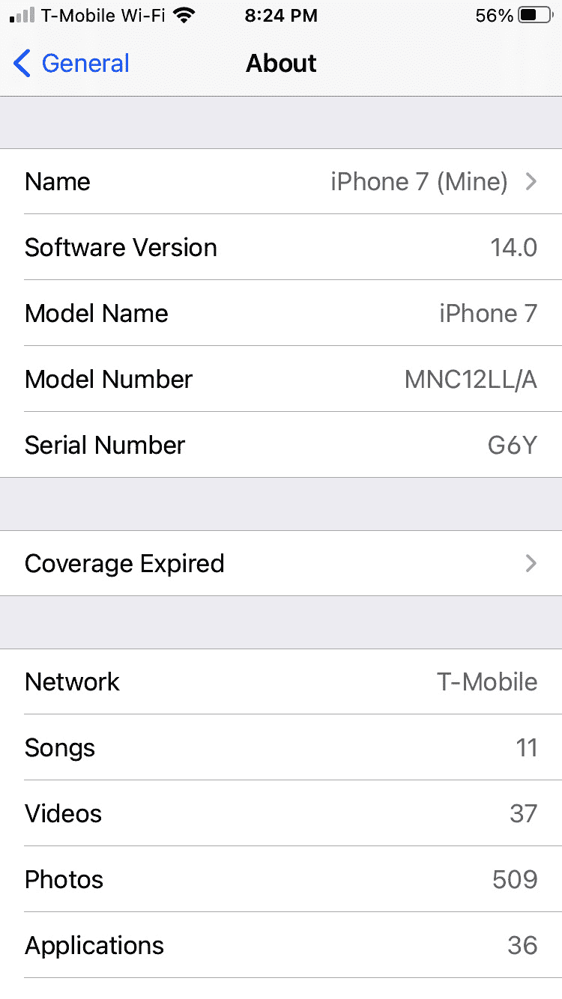

图 3.28 – 查找 iPhone 信息的相关屏幕

可能最重要的信息是检查您是否运行了最新的 iOS 版本。最新的 iOS 版本通常会修复错误并提高安全性，因此请确保您知道如何更新 iPhone 的操作系统。

# 更新 iPhone

iPhone 不过是一个运行操作系统的计算机。使用 iPhone 时，操作系统被称为 iOS，苹果公司每年都会进行重大更新，并在全年进行小幅度更新。

通常，你希望保持你的 iPhone 更新到最新操作系统版本，因为这将提供最多的功能，同时修复先前操作系统版本的错误。然而，有时最新的软件更新可能会出现错误，这意味着如果你将其安装在 iPhone 上，可能会损坏其性能。

因此，你可能想关闭自动更新。自动更新旨在更新你的 iPhone 并保持其最新状态，而无需你主动安装最新的操作系统。然而，你可能想在更新之前等待，以防有人报告最新更新存在问题。

要修改自动更新，请按照以下步骤操作：

1.  在主屏幕上轻触**设置**图标。

1.  轻触**通用**。

1.  轻触**软件更新**。

1.  轻触**自动更新**。将出现一个开关，你可以用它来打开或关闭自动更新。

记住，你保留 iPhone 的时间越长，它就越不可能更新到最新版本的 iOS。苹果公司通常支持其产品大约 5 年，因此保持 iPhone 更新可以确保它能利用 iOS 的最新功能。即使你的 iPhone 无法更新到最新版本的 iOS，它仍然可以正常工作。只要你的 iPhone 继续满足你的需求，那就足够了。

# 使用辅助功能

有些人有视觉困难，而有些人有听觉或身体限制。幸运的是，iPhone 提供了选项，只要花点时间定义不同的辅助功能，就可以让所有人都能使用其所有功能。

iPhone 将辅助功能分为以下几类：**视觉**、**身体和运动**、**听觉**和**通用**。尽管这些辅助功能是为那些需要它们来使用 iPhone 的人设计的，但任何人都可以使用这些辅助功能来让 iPhone 更容易使用。

要访问辅助功能，请按照以下步骤操作：

1.  在主屏幕上轻触**设置**图标。

1.  轻触**辅助功能**。**辅助功能**屏幕将出现，如图 3.29 所示：

    图 3.29 – 辅助功能屏幕

1.  轻触你想要使用的选项，例如**缩放**或**触摸**。另一个屏幕将出现，显示你可以定义的各种选项。

每个人对 iPhone 的使用都有不同的需求，所以尝试不同的辅助功能，看看哪些可能让你的 iPhone 使用起来更加方便。

# 摘要

iPhone 提供了许多不同的方式来自定义其设置，但大多数设置可以分为三类。有趣和个性化的更改代表的是不会影响 iPhone 性能的设置，例如更改壁纸图片。

用户体验的更改代表的是可以使 iPhone 更易于使用和更方便的设置，例如设置**勿扰**时间表或增加文本大小以便更容易阅读文本。

可能至关重要的更改代表的是可能对你的安全性和数据安全重要的设置，例如设置**紧急 SOS**呼叫功能或检查隐私设置以确保你没有给不再需要的应用提供访问权限。

记住，你不需要修改所有可能的设置。开启特定设置的相同程序也可以用来关闭该设置，所以确保你知道开启或关闭功能的步骤，以防你需要稍后反转此设置。

一旦你自定义了 iPhone 的外观和行为，你可能想知道如何使用 iPhone 进行电话通话，这可能是你最初购买 iPhone 的主要原因，下一章将介绍这方面的内容。
